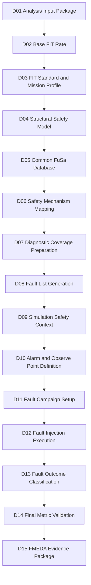
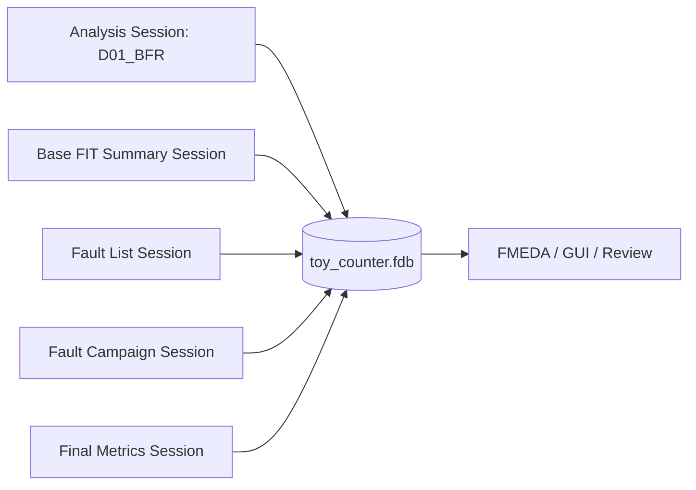
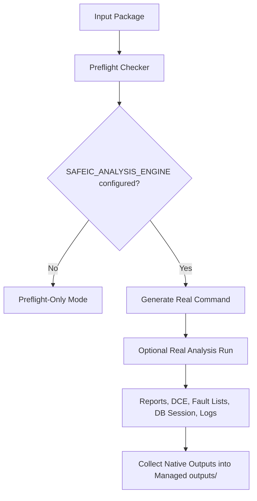
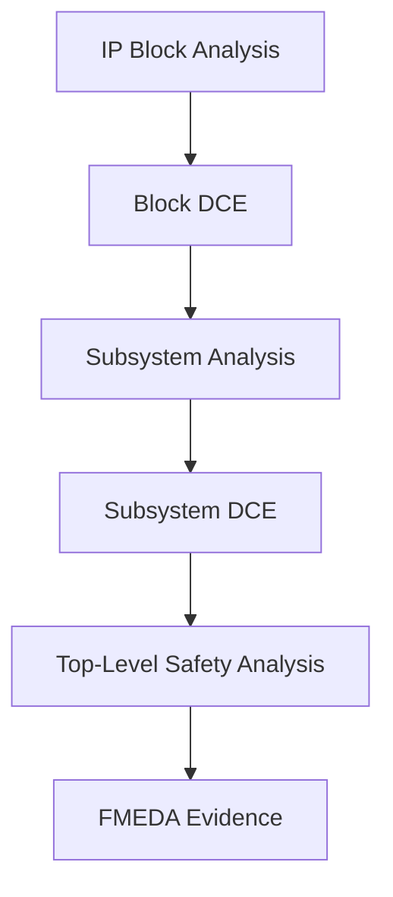

# [Automotive Safe-IC Practice 01] Analysis Input Package: A Reproducible Safety Analysis Context for FIT, Fault Lists, and FMEDA Evidence

**Author**: Darren H. Chen  
**Direction**: Automotive Chip Functional Safety Analysis and Fault Injection Practice  
**Demo**: `D01_analysis_input_package`  
**Platform**: GitHub article + reproducible demo project  

**Tags**: Automotive Chip, Functional Safety, ISO 26262, ASIL, FIT, Base FIT Rate, Diagnostic Coverage, Fault Campaign, FMEDA, FuSa Database, Reproducible EDA Flow

---

## 1. Start with the Basic Concepts

Before discussing the demo structure, it is useful to define a few basic concepts.

Many functional safety discussions quickly jump into SPFM, LFM, PMHF, or FMEDA. For a practical engineering flow, however, it is better to first understand the input package, fault, error, failure, FIT, diagnostic coverage, and fault injection context.

This series does not start from a tool button or a vendor-specific command.

It starts from a reproducible engineering input package.

A safety result is not supported by one command line alone. It is supported by a reviewable set of inputs, configuration files, logs, reports, database sessions, and evidence artifacts.

### 1.1 What Functional Safety Means

In automotive electronics, functional safety is usually discussed in the context of ISO 26262.

A practical interpretation is:

```text
When an electrical/electronic system malfunctions, can the system still avoid unacceptable risk?
```

It does not only ask:

```text
Does the design have a bug?
```

It further asks:

```text
If a register, logic cone, memory element, or interface signal in the chip experiences a random hardware fault,
can the system detect it, control it, recover from it, or move to a safe state?
```

In short, functional safety cares about what happens after something goes wrong.

This is different from ordinary functional verification.

Functional verification usually focuses on:

```text
Under legal inputs and constraints, does the design implement the specification?
```

Functional safety verification adds another question:

```text
When hardware faults occur, do the safety mechanisms prevent dangerous behavior?
```

### 1.2 ISO 26262 and ASIL

ISO 26262 is a major functional safety standard for automotive electrical/electronic systems.

ASIL means **Automotive Safety Integrity Level**. It is commonly divided into:

```text
ASIL A
ASIL B
ASIL C
ASIL D
```

ASIL D is the most stringent level.

ASIL is not selected arbitrarily at the chip level. It is derived from system-level hazard analysis and risk assessment. Typical factors include:

```text
Severity
Exposure
Controllability
```

At the semiconductor level, the safety analysis must provide hardware evidence, such as:

```text
Is the random hardware failure rate low enough?
Are critical failures covered by safety mechanisms?
Is the residual risk acceptable?
Can the evidence be used in FMEDA?
```

Therefore, chip-level safety work must connect design structure, reliability prediction, diagnostic coverage, fault injection results, and FMEDA rows. A standalone percentage or a standalone FIT number is not enough.

### 1.3 Fault, Error, and Failure

These three terms often appear together, but they do not mean the same thing.

| Term | Practical Meaning | Example |
|---|---|---|
| Fault | The defect or fault source | A register bit flips; a net is stuck-at-1 |
| Error | The incorrect internal state | A computed value differs from the expected value |
| Failure | The externally visible functional failure | The wrong output violates a safety goal |

A simplified chain is:

```text
fault -> error -> failure
```

For example:

```text
count[2] experiences a bit flip            = fault
the counter value becomes incorrect        = error
the incorrect value affects control output = failure
```

Functional safety analysis does not merely record that a fault occurred. It studies whether the fault propagates into an error, whether the error becomes a failure, and whether a safety mechanism detects or controls it.

### 1.4 Systematic Faults and Random Hardware Faults

Functional safety usually distinguishes between:

```text
systematic faults
random hardware faults
```

A systematic fault is caused by a deterministic problem in the design, implementation, verification, manufacturing, or maintenance process. Examples include:

```text
RTL bug
incorrect requirement interpretation
verification gap
constraint error
software logic defect
```

A random hardware fault occurs during the lifetime of the device. Examples include:

```text
soft error
single event upset
aging-related defect
stuck-at fault
transient fault
```

This article series focuses mainly on chip-level random hardware faults:

```text
random hardware faults
    -> FIT / BFR
    -> diagnostic coverage
    -> fault list
    -> fault campaign
    -> final safety metrics
    -> FMEDA evidence
```

### 1.5 What a Safety Mechanism Is

A safety mechanism, or SM, is a mechanism added to detect, control, correct, or isolate faults.

Common examples include:

```text
ECC
parity
CRC
lockstep
duplication
triplication
watchdog
BIST
timeout monitor
range checker
protocol checker
alarm aggregation
```

For example, a register group may use parity:

```text
data bits + parity bit
```

If one bit flips, a parity checker can detect the mismatch and trigger an alarm.

The fault outcome may then be classified as:

```text
detected fault
```

If a fault changes the machine state but no alarm fires and the design does not enter a safe state, it may become:

```text
unsafe fault
```

---

## 2. Why D01 Does Not Start from a Tool Command

In ordinary RTL verification, an engineer may start from commands such as:

```text
compile RTL
run simulation
check pass/fail
```

Functional safety analysis requires a richer context.

A single safety analysis run depends on:

```text
design files
top module
filelist ordering
clock definition
reset assumptions
FIT standard
FIT setup
mission profile
technology assumptions
package assumptions
memory assumptions
safety mechanism assumptions
analysis initialization options
common safety database settings
report policy
fault list generation policy
execution command
tool log
```

If these inputs are not explicitly captured, the results are hard to reproduce and review.

For example, two runs may use the same RTL but different FIT standards:

```text
iec_62380
sn_29500
```

The FIT values, DCE files, summary reports, and interpretation may differ.

Two runs may also use the same design but different clock definitions. That can change sequential element recognition, fault propagation boundaries, and diagnostic coverage behavior.

The first engineering principle of D01 is:

> A safety analysis result is meaningful only when its input context is explicit, versioned, and reviewable.

D01 is not about producing a number as quickly as possible. It is about organizing the context behind that number.

---

## 3. Where D01 Sits in the Safe-IC Flow

This series uses a 20-step core flow. D01 is the root of the entire evidence chain.



**Figure 1. D01 is the entry point for safety analysis, fault lists, fault injection, and FMEDA evidence.**

D01 should reserve evidence directories for later stages:

```text
Base FIT reports
DCE-style safety analysis results
permanent fault lists
transient fault lists
alarm lists
observe point specifications
fault campaign results
common safety database sessions
FMEDA-oriented summaries
logs and manifests
```

If D01 is only a loose script folder, D02, D05, D08, D11, and D14 will all need to repair the structure later.

A mature engineering flow starts with a stable entry point.

---

## 4. Safety Analysis vs. Safety Verification

D01 primarily supports safety analysis, but it must also reserve interfaces for safety verification.

### 4.1 Safety Analysis

Safety analysis asks:

```text
How much FIT is contributed by random hardware faults?
Which structures are safety-relevant?
Which endpoints and startpoints matter?
How much diagnostic coverage can be credited from safety mechanism assumptions?
Can a fault list be generated?
How can the results be used by FMEDA?
```

This series uses a neutral name for the analysis executable:

```text
safeic_analysis_engine
```

Typical inputs include:

```text
RTL / netlist
filelist
clock definition
FIT setup
analysis initialization file
library / memory / package information
common safety database settings
```

### 4.2 Safety Verification

Safety verification asks:

```text
After a fault is injected into the design, does the safety mechanism actually respond?
Does an alarm fire?
Does the fault propagate to an observe point?
Does the behavior become unsafe?
How should the fault outcome be classified?
```

This series uses a neutral name for the fault campaign executable:

```text
safeic_fault_engine
```

Typical inputs include:

```text
fault list
VCD / simulation safety context
alarm list
observe point
FTTI / simulation window
fault campaign configuration
common safety database session
```

### 4.3 Why D01 Needs Both Perspectives

The early outputs of safety analysis become inputs to safety verification.

For example:

```text
D02 / D08 generate or index fault lists
D09 prepares VCD and good-machine context
D10 defines alarms and observe points
D11 builds the fault campaign input package
D12 executes fault injection
D13 classifies detected / safe / unsafe / unresolved outcomes
D14 writes back results and calculates final metrics
```

Therefore, D01 should reserve:

```text
outputs/reports/
outputs/fault_lists/
outputs/db/
outputs/manifest/
logs/
```

D01 is not the final safety run. It is the first bridge from design data to safety evidence.

---

## 5. Basic Data-Exchange Protocols and File Conventions

The word "protocol" here does not mean a network protocol. It means the data-exchange contract between flow stages.

Common safety-flow protocols include:

```text
RTL/filelist input protocol
clock definition protocol
analysis initialization file protocol
FIT setup protocol
common safety database session protocol
fault list protocol
alarm / observe point protocol
VCD simulation context protocol
evidence file naming protocol
```

These conventions make the stages connect reliably.

### 5.1 RTL / Filelist Input Protocol

RTL is the design source.

A filelist tells the tool which RTL files should be analyzed and how they should be read.

Example:

```text
# inputs/rtl/toy_counter.v
# inputs/filelist/filelist.f
inputs/rtl/toy_counter.v
```

Without a filelist, the analysis boundary is unclear.

If filelist order, paths, macro definitions, or include paths are unstable, the same design may behave differently across machines.

### 5.2 Clock Definition Protocol

The clock definition tells the analysis engine which signals are clocks.

Example:

```text
# inputs/clock/toy_counter.clk
clk
```

It affects:

```text
register recognition
sequential boundaries
fault propagation
good-machine context
alarm timing
observe point interpretation
```

Therefore, the clock file is safety-analysis input, not just a minor command-line option.

### 5.3 Analysis Initialization File Protocol

The analysis initialization file describes the option set for one analysis run.

This series uses:

```text
inputs/analysis/analysis_bfr.fusaini
```

It collects design scope, FIT setup, FIT standard, database session, and output policy in one place.

### 5.4 FIT Setup Protocol

The FIT setup describes reliability-calculation assumptions, such as:

```text
FIT standard
mission profile
temperature
manufacturing year
package
technology
memory
lambda values
```

D01 uses a simplified public-safe setup, but the location and format must be explicit.

### 5.5 Common FuSa Database Session Protocol

A common safety database is used to share structured evidence between safety analysis, fault campaigns, and FMEDA review.

Example:

```text
outputs/db/toy_counter.fdb::D01_BFR
```

This can be read as:

```text
Database file: outputs/db/toy_counter.fdb
Session name:  D01_BFR
```

The `.fdb` file is the evidence container. The session name is a named partition inside that container.

### 5.6 Fault List Protocol

A fault list is one input to a later fault campaign.

It answers:

```text
Which faults should be injected?
What type is each fault?
Which design objects are affected?
Is the fault permanent or transient?
Is it primary, equivalent, or collapsed?
```

D01 does not require fault campaign closure, but it must reserve:

```text
outputs/fault_lists/
```

### 5.7 Alarm / Observe Point Protocol

An alarm is a signal that indicates that a safety mechanism detected an abnormal condition.

An observe point is a signal or state used to judge fault campaign behavior.

Examples:

```text
alarm_o
error_flag_o
safe_state_o
critical_output_o
```

A fault campaign cannot only check whether a fault was injected. It must check whether an alarm fired, whether an observe point changed, and whether the fault was handled within the intended window.

### 5.8 VCD Simulation Context Protocol

VCD means **Value Change Dump**. It records signal transitions during simulation.

In a functional safety fault campaign, VCD can provide the golden-run or good-machine context.

Fault injection should not happen in a vacuum. A fault is injected into a known normal execution context, and the campaign observes how behavior deviates from the golden context.

D01 does not generate VCD, but it must keep the flow open for:

```text
simulation safety context
VCD
good machine
FTTI
observe point
```

---

## 6. FIT, BFR, DC, and Residual FIT

### 6.1 FIT

FIT means **Failure In Time**.

A common engineering interpretation is:

```text
1 FIT = 1 failure per 10^9 operating hours
```

or:

```text
1 FIT = 10^-9 failures / hour
```

If a module has a failure rate of 10 FIT, it can be understood as:

```text
10 failures per 10^9 operating hours
```

In real engineering, FIT is not guessed. It depends on:

```text
process
component type
temperature
mission profile
package
memory size
gate-level structure
transistor count
usage environment
```

### 6.2 Base FIT Rate

Base FIT Rate, or BFR, is the initial failure-rate baseline before safety mechanisms are credited.

A practical definition is:

```text
How much random hardware failure exposure exists if no diagnostic contribution is credited yet?
```

BFR is the baseline for later safety mechanism evaluation.


**Figure 2. BFR is the baseline for interpreting DC and residual FIT.**

A standalone 90% diagnostic coverage value is not meaningful unless we know the failure-rate contribution it covers.

### 6.3 Diagnostic Coverage

Diagnostic Coverage, or DC, can be understood as the portion of relevant faults covered by a safety mechanism.

Simplified:

```text
DC = covered faults / relevant faults
```

If FIT-weighted:

```text
FIT-weighted DC = covered FIT / total relevant FIT
```

Real engineering needs more care:

```text
Are safe faults included?
How are unsafe faults defined?
How are unresolved faults handled?
Is the metric based on fault count or FIT weight?
What is the observation window?
Is FTTI satisfied?
```

DC is not a standalone percentage. It is tied to fault population, classification policy, FIT weighting, and simulation context.

### 6.4 Residual FIT

Residual FIT is the risk remaining after diagnostic coverage is credited.

A simplified conceptual model is:

```text
Residual FIT = Base FIT x (1 - DC)
```

Example:

```text
Base FIT = 100 FIT
DC = 90%
Residual FIT = 10 FIT
```

This is only a conceptual formula. A real FMEDA may split the calculation by failure mode, part/sub-part, safety mechanism, and ASIL target.

---

## 7. IEC 62380 and SN 29500: Why the FIT Standard Must Be Explicit

The input package must explicitly specify the FIT standard.

This series focuses on two standard identifiers:

```text
iec_62380
sn_29500
```

They should not be hidden in tool defaults.

The selected FIT standard affects:

```text
FIT calculation model
required input data
report naming
DCE file naming
metric interpretation
hierarchical reuse
```

Example:

```ini
fit_standard = iec_62380
```

or:

```ini
fit_standard = sn_29500
```

### 7.1 What to Understand about IEC 62380

IEC 62380 is commonly used for reliability prediction of electronic equipment.

At minimum, the following concepts matter:

```text
mission profile
temperature profile
operating ratio
non-operating ratio
package contribution
die contribution
EOS contribution
```

Mission profile is especially important.

It describes lifetime operating conditions, such as:

```text
how long the device runs at different temperatures
the powered-on ratio
the operating environment
how thermal cycling affects the package
```

The same chip may have different predicted reliability in different automotive locations or thermal conditions.

### 7.2 What to Understand about SN 29500

SN 29500 is another commonly used reliability prediction method.

At minimum, the following concepts matter:

```text
reference failure rate
component category
operating condition
stress condition
temperature factor
technology-dependent failure rate
```

Switching the FIT standard is not merely changing a report format.

Changing from `iec_62380` to `sn_29500` may affect:

```text
base FIT
failure-mode priority
FIT contribution ranking
DCE file naming
residual FIT interpretation in FMEDA
```

### 7.3 FIT Standard Is Part of Run Identity

A robust input package should record the FIT standard in:

```text
analysis_bfr.fusaini
manifest.yaml
FIT_inputs.common.txt
expected_analysis_outputs.csv
```

An incomplete result table would be:

```csv
object,base_fit
toy_counter.count,0.052
```

A more reviewable table would be:

```csv
object,base_fit,fit_standard,evidence_source
toy_counter.count,0.052,iec_62380,D02_base_fit_report
```

The second engineering principle is:

> Never rely on an implicit FIT standard. If a run calculates safety metrics, the standard must be part of the run identity.

---

## 8. Questions D01 Must Answer

A reviewable input package should answer at least the following questions.

| Question | D01 Artifact |
|---|---|
| Which design is analyzed? | RTL filelist and top module |
| What is the design boundary? | `top = toy_counter` |
| Which clocks are recognized? | `inputs/clock/toy_counter.clk` |
| Which FIT standard is used? | `fit_standard = iec_62380` or `sn_29500` |
| Which reliability setup is used? | `inputs/fit/FIT_inputs.common.txt` |
| Which options are active? | `inputs/analysis/analysis_bfr.fusaini` |
| Where are native reports produced? | `Outputs/` |
| Where are managed reports indexed? | `outputs/reports/` |
| Where are fault lists indexed? | `outputs/fault_lists/` |
| Where is structured evidence stored? | `outputs/db/toy_counter.fdb::D01_BFR` |
| How can the run be reproduced? | `outputs/analysis_command.csh` and logs |

D01 does not need a complex directory tree. It needs clear answers.

---

## 9. Recommended Repository Layout

D01 uses a stable and reviewable layout.

```text
D01_analysis_input_package/
├── README.md
├── manifest.yaml
│
├── inputs/
│   ├── rtl/
│   │   └── toy_counter.v
│   ├── filelist/
│   │   └── filelist.f
│   ├── clock/
│   │   └── toy_counter.clk
│   ├── fit/
│   │   └── FIT_inputs.common.txt
│   ├── analysis/
│   │   └── analysis_bfr.fusaini
│   └── safety/
│       ├── alarms.list
│       └── observe_points.list
│
├── scripts/
│   ├── setup_toolchain.template.csh
│   ├── setup_toolchain.local.csh      # local only, not committed
│   ├── run_demo.csh
│   └── run_demo.sh
│
├── tools/
│   ├── preflight_input_package.py
│   ├── parse_analysis_config.py
│   ├── build_expected_outputs.py
│   └── collect_tool_outputs.py
│
├── Outputs/                          # native tool output, generated at runtime
│
├── outputs/
│   ├── db/
│   ├── reports/
│   ├── fault_lists/
│   ├── dce/
│   ├── manifest/
│   ├── input_inventory.csv
│   ├── analysis_options.csv
│   ├── expected_analysis_outputs.csv
│   ├── preflight_check.csv
│   ├── tool_outputs_index.csv
│   ├── analysis_command.csh
│   └── demo_summary.md
│
├── logs/
│   ├── run_demo.log
│   ├── analysis_engine.log
│   └── collect_tool_outputs.log
│
└── docs/
    └── design_notes.md
```

The important distinction is:

```text
Outputs/ = native output directory produced by the configured analysis engine
outputs/ = demo-managed output directory for manifests, indexes, summaries, and copied artifacts
```

This separation keeps tool-native behavior visible while providing a stable GitHub-friendly evidence structure.

---

## 10. Toolchain Mapping and Local Configuration

A public demo should not hard-code private installation paths.

D01 uses neutral environment variables:

```csh
# scripts/setup_toolchain.template.csh
#!/bin/csh -f

setenv SAFEIC_TOOL_HOME /path/to/safeic/toolchain
setenv SAFEIC_ANALYSIS_ENGINE $SAFEIC_TOOL_HOME/bin/safeic_analysis_engine
setenv SAFEIC_FAULT_ENGINE    $SAFEIC_TOOL_HOME/bin/safeic_fault_engine

setenv PATH $SAFEIC_TOOL_HOME/bin:$PATH
```

A real local setup can be written in:

```text
scripts/setup_toolchain.local.csh
```

Example:

```csh
#!/bin/csh -f

setenv SAFEIC_TOOL_HOME /private/tool/install/path
setenv SAFEIC_ANALYSIS_ENGINE $SAFEIC_TOOL_HOME/bin/analysis_engine
setenv SAFEIC_FAULT_ENGINE    $SAFEIC_TOOL_HOME/bin/fault_campaign_engine

setenv PATH $SAFEIC_TOOL_HOME/bin:$PATH
```

The local file should not be committed:

```gitignore
scripts/setup_toolchain.local.csh
```

This keeps the public demo publishable while allowing real engineering environments to map the generic flow to installed tools.

---

## 11. The Toy Design Used by D01

D01 should not start with a large SoC.

The design should be small enough to inspect manually.

```verilog
module toy_counter (
    input  wire       clk,
    input  wire       rst_n,
    input  wire       en,
    input  wire       inject_error_i,
    output reg  [3:0] count,
    output wire       alarm
);

always @(posedge clk or negedge rst_n) begin
    if (!rst_n) begin
        count <= 4'd0;
    end else if (en) begin
        count <= count + 4'd1;
    end
end

assign alarm = inject_error_i | (count == 4'hF);

endmodule
```

The design contains:

```text
clock
reset
state elements
enable signal
observable state
alarm-like output
```

This is enough to support later demos:

```text
fault list generation
VCD safety context
alarm mapping
observe point definition
fault campaign execution
fault outcome classification
```

The filelist is explicit:

```text
# inputs/filelist/filelist.f
inputs/rtl/toy_counter.v
```

The analysis config must also explicitly declare the top:

```ini
top = toy_counter
```

A safety reviewer should never need to guess the top-level boundary.

---

## 12. Why the Clock Definition Is Safety Evidence

The clock file may contain only one line:

```text
clk
```

It is still part of the safety evidence chain.

Clock modeling affects:

```text
state element classification
sequential boundary recognition
fault propagation interpretation
safety context extraction
alarm timing
observe point interpretation
fault campaign setup
```

If the clock definition is wrong, the tool may misidentify sequential boundaries. That can affect DCE, DC, fault lists, and fault campaigns.

Therefore D01 stores the clock file as:

```text
inputs/clock/toy_counter.clk
```

It is not hidden inside a temporary command.

---

## 13. FIT Setup File

The FIT setup records the reliability calculation context.

One important lesson from real execution is that the FIT setup may not use the same syntax as the analysis initialization file.

In this demo, the FIT setup uses a simple `key value` style:

```text
# inputs/fit/FIT_inputs.common.txt

MissionProfileType PassengerCompartment
TemperatureJA 65
MFG_YEAR 2026
Process MOS.ASIC.STDCELL
LambdaFile /path/to/defaults/Lambda_ISO26262.txt
PitFile /path/to/defaults/Tech_PiT.txt
MissionProfileFile /path/to/defaults/MissionProfile.txt
DiagnosticCoverageFile /path/to/defaults/DC.txt
TransistorCountFile /path/to/defaults/Lib.tc
```

This is intentionally different from the `key = value` style used in the analysis initialization file.

The third engineering principle is:

> FIT numbers must be traceable to the reliability assumptions used to compute them.

If a FIT report is separated from the FIT setup, it becomes difficult to review.

---

## 14. Analysis Initialization File: The Center of D01

The central configuration file is:

```text
inputs/analysis/analysis_bfr.fusaini
```

It uses a `key = value` style:

```ini
mode = analysis

top = toy_counter
filelist = inputs/filelist/filelist.f
clkdef = inputs/clock/toy_counter.clk
fit_setup = inputs/fit/FIT_inputs.common.txt

fit_standard = iec_62380
block_level = true
consolidated_report = sparse
parser_messages = true

write_fusa_db = true
fusa_db_name = outputs/db/toy_counter.fdb::D01_BFR
overwrite_session = true
overwrite_fusa_db = true
```

This file has at least four responsibilities.

### 14.1 Define the Design Scope

```ini
top = toy_counter
filelist = inputs/filelist/filelist.f
clkdef = inputs/clock/toy_counter.clk
```

### 14.2 Define the Reliability Setup

```ini
fit_setup = inputs/fit/FIT_inputs.common.txt
fit_standard = iec_62380
```

### 14.3 Define the Evidence Storage Policy

```ini
write_fusa_db = true
fusa_db_name = outputs/db/toy_counter.fdb::D01_BFR
overwrite_session = true
overwrite_fusa_db = true
```

### 14.4 Keep Analysis and Fault Campaign Options Separate

D01 is a BFR-oriented analysis package. It should not mix fault campaign options into the BFR analysis config.

For example, alarm lists and observe points are useful for later fault campaigns, but they should not be forced into the D01 analysis initialization file if the configured analysis engine does not accept them in this mode.

The core D01 idea is:

```text
one initialization file
one design boundary
one FIT setup
one database session
one reproducible run identity
```

---

## 15. Understanding `.fdb::session`

This configuration is central:

```ini
fusa_db_name = outputs/db/toy_counter.fdb::D01_BFR
```

It should be read as:

```text
Database file: outputs/db/toy_counter.fdb
Session name:  D01_BFR
```

The `.fdb` file is the database file.

`D01_BFR` is one session inside it.

Later demos can write additional sessions:

```text
toy_counter.fdb::D01_BFR
toy_counter.fdb::D02_BFR_SUMMARY
toy_counter.fdb::D08_FAULT_LIST
toy_counter.fdb::D12_FAULT_CAMPAIGN
toy_counter.fdb::D14_FINAL_METRICS
toy_counter.fdb::D15_FMEDA_EXPORT
```



**Figure 3. The common safety database connects analysis, fault campaigns, and FMEDA evidence.**

If `.fdb::session` is not introduced until later, the database flow will look like an afterthought. D01 should plan it from the beginning.

---

## 16. File-Based Evidence and Database-Based Evidence

A mature safety flow usually needs both.

### 16.1 File-Based Evidence

File-based evidence is easy to inspect, diff, archive, and publish in a GitHub demo.

Typical files include:

```text
reports
fault lists
DCE files
CSV summaries
markdown summaries
logs
manifest
preflight checks
```

### 16.2 Database-Based Evidence

Database-based evidence is better for cross-tool sharing.

It can store:

```text
FIT values
diagnostic coverage values
fault lists
fault simulation results
part / sub-part mapping
alarm information
observe point settings
safety mechanism maps
```

### 16.3 Why D01 Prepares Both

D01 creates:

```text
outputs/reports/
outputs/fault_lists/
outputs/dce/
outputs/db/
outputs/manifest/
```

A practical rule is:

> Files provide transparency. Database sessions provide flow continuity.

---

## 17. Generating a Reproducible Command

D01 should not rely only on manual commands.

It generates a reviewable command script:

```text
outputs/analysis_command.csh
```

A generic form is:

```csh
#!/bin/csh -f

set ROOT = `cd "$0:h/.." && pwd`
cd "$ROOT"

if ( ! $?SAFEIC_ANALYSIS_ENGINE ) then
    echo "[ERROR] SAFEIC_ANALYSIS_ENGINE is not set."
    exit 1
endif

mkdir -p logs outputs outputs/db outputs/reports outputs/fault_lists outputs/dce outputs/manifest

echo "[INFO] Running configured safety analysis engine..."
echo "[INFO] Config: inputs/analysis/analysis_bfr.fusaini"

$SAFEIC_ANALYSIS_ENGINE <analysis-config-option> inputs/analysis/analysis_bfr.fusaini \
    |& tee logs/analysis_engine.log

set rc = $status
echo "[INFO] analysis engine exit code: $rc"
exit $rc
```

The exact config option is determined by the demo's local tool wrapper and configuration. The public article should not hard-code a private commercial tool command.

This script is itself part of the evidence chain. It answers:

```text
How was this analysis executed?
Which initialization file was used?
Where was the log written?
```

One implementation detail matters:

```text
The generated csh script must contain real newlines.
It must not contain literal "\n" text.
```

A broken example is:

```text
#!/bin/csh -f\nset ROOT = ...
```

That kind of file is not a valid command script in older EDA environments.

---

## 18. Preflight Mode and Real Analysis Mode

D01 has two modes.



**Figure 4. D01 can run public preflight and can also connect to a real analysis engine through configuration.**

### 18.1 Preflight-Only Mode

This mode does not require a real tool.

It checks:

```text
manifest exists
analysis config exists
RTL file exists
filelist exists
clock file exists
FIT setup exists
top module is configured
FIT standard is explicit
.fdb::session is configured
output directories are creatable
expected output names can be generated
tool environment variables are present or warned
```

Without a configured analysis engine, the result can be:

```text
PASS + WARN
```

That means the input package is complete, but the real tool is not configured.

### 18.2 Real Analysis Mode

When this environment variable exists:

```text
SAFEIC_ANALYSIS_ENGINE
```

D01 can generate and run a real analysis command.

This lets one demo serve two audiences:

```text
public readers: understand the structure and run preflight
engineering users: connect the package to a real analysis backend
```

---

## 19. Manifest: The Run Identity Index

The manifest is the stable entry point of D01.

Example:

```yaml
project:
  name: automotive_safeic_practice
  demo: D01_analysis_input_package
  top_module: toy_counter

inputs:
  rtl_file: inputs/rtl/toy_counter.v
  filelist: inputs/filelist/filelist.f
  clock_definition: inputs/clock/toy_counter.clk
  fit_setup: inputs/fit/FIT_inputs.common.txt
  analysis_config: inputs/analysis/analysis_bfr.fusaini

analysis:
  mode: analysis
  fit_standard: iec_62380
  database: outputs/db/toy_counter.fdb
  session: D01_BFR

toolchain:
  analysis_engine_env: SAFEIC_ANALYSIS_ENGINE
  fault_engine_env: SAFEIC_FAULT_ENGINE
  shell_primary: csh

outputs:
  native_tool_outputs: Outputs
  reports_dir: outputs/reports
  fault_lists_dir: outputs/fault_lists
  dce_dir: outputs/dce
  db_dir: outputs/db
  command: outputs/analysis_command.csh
  summary: outputs/demo_summary.md
```

The manifest is not a replacement for tool reports.

It is a reproducibility index.

A reviewer should be able to open the manifest and quickly understand what D01 is preparing to analyze, how it will run, and where the evidence will be written.

---

## 20. Expected Output Model

Even in preflight-only mode, D01 should generate an expected output index.

Example:

```csv
artifact,purpose,produced_by,used_by_later_demo
toy_counter_SF_SA.metric.summary.rpt,metric summary,D02,D05/D14
toy_counter_IEC_62380.DCE,FIT-standard-specific DCE,D02,D04/D05/D15
toy_counter.DCE,generic DCE,D02,D04/D05/D15
toy_counter_Perm_EquivFault.list,equivalent permanent fault list,D08,D11/D12
toy_counter_Perm_PrimaryFault.list,primary permanent fault list,D08,D11/D12
toy_counter_Trans_EquivFault.list,equivalent transient fault list,D08,D11/D12
toy_counter_Trans_PrimaryFault.list,primary transient fault list,D08,D11/D12
analysis_engine_alarms.list,alarm candidate list,D08,D10/D11
analysis_engine.log,tool execution log,D01/D02,D19
toy_counter.fdb::D01_BFR,common safety database session,D01,D05/D11/D14/D15
```

D01 does not deeply interpret these outputs.

It builds the output model.

D02 explains the Base FIT summary.

D08 explains fault lists.

D11-D13 explain fault campaigns.

D14-D15 connect the results to final metrics and FMEDA evidence.

---

## 21. Native Tool Output Collection

In real execution, the configured analysis engine may generate native artifacts into a directory such as:

```text
Outputs/
```

The demo-managed directory is:

```text
outputs/
```

D01 should collect and index native outputs instead of hiding them.

Example managed structure:

```text
outputs/reports/
outputs/fault_lists/
outputs/dce/
outputs/tool_outputs_index.csv
```

Typical native artifacts may include:

```text
Outputs/toy_counter_IEC_62380.DCE
Outputs/toy_counter.DCE
Outputs/toy_counter_Perm_EquivFault.list
Outputs/toy_counter_Perm_PrimaryFault.list
Outputs/toy_counter_Trans_EquivFault.list
Outputs/toy_counter_Trans_PrimaryFault.list
Outputs/toy_counter_Coverage.rpt
Outputs/toy_counter_SF_SA.metric.summary.rpt
Outputs/analysis_engine_alarms.list
outputs/db/toy_counter.fdb
```

A helper such as:

```text
tools/collect_tool_outputs.py
```

can copy or index these files into the demo-managed evidence tree.

This makes GitHub review easier while preserving the native tool behavior.

---

## 22. Why DCE-Style Artifacts Matter

DCE-style artifacts can be understood as diagnostic-coverage-related safety analysis artifacts.

Real automotive chips are hierarchical:

```text
IP block
subsystem
cluster
top-level SoC
```

Safety analysis also needs hierarchical reuse.



**Figure 5. DCE-style artifacts support hierarchical reuse of safety metric evidence.**

D01 uses a tiny design, but the directory and naming model should be able to scale.

---

## 23. D01 Helper Tools

D01 helper tools should be simple, readable, and reviewable.

Suggested tools:

```text
tools/preflight_input_package.py
tools/parse_analysis_config.py
tools/build_expected_outputs.py
tools/collect_tool_outputs.py
```

Responsibilities:

| Tool | Responsibility |
|---|---|
| `preflight_input_package.py` | Main entry point; runs checks and writes reports |
| `parse_analysis_config.py` | Parses the `key = value` initialization file |
| `build_expected_outputs.py` | Builds expected report, DCE, fault-list, and DB-session indexes |
| `collect_tool_outputs.py` | Collects native `Outputs/` artifacts into managed `outputs/` directories |

Implementation principles:

```text
compatible with Python 3.6+ or Python 3.8+
no web service dependency
no license dependency for preflight
no heavy framework
prefer readability, maintainability, and portability
```

---

## 24. csh Execution Path

Many traditional EDA environments still use csh.

Therefore D01 provides a first-class csh wrapper.

```csh
#!/bin/csh -f

set DEMO = D01_analysis_input_package
set ROOT = `cd "$0:h/.." && pwd`

cd "$ROOT"

if ( -e scripts/setup_toolchain.local.csh ) then
    source scripts/setup_toolchain.local.csh
else
    source scripts/setup_toolchain.template.csh
endif

mkdir -p outputs logs outputs/db outputs/reports outputs/fault_lists outputs/dce outputs/manifest

python3 tools/preflight_input_package.py \
    --manifest manifest.yaml \
    |& tee logs/run_demo.log

if ( $?SAFEIC_ANALYSIS_ENGINE ) then
    echo "[INFO] SAFEIC_ANALYSIS_ENGINE is configured."
    echo "[INFO] Review outputs/analysis_command.csh before running real analysis."
else
    echo "[WARN] SAFEIC_ANALYSIS_ENGINE is not set. Preflight-only mode completed."
endif
```

The csh path should be conservative.

It is not a place to show shell tricks. It is meant to run reliably on older EDA servers.

---

## 25. Bash Execution Path

A bash wrapper is also useful for open-source-style usage.

```bash
#!/usr/bin/env bash
set -euo pipefail

ROOT="$(cd "$(dirname "${BASH_SOURCE[0]}")/.." && pwd)"
cd "${ROOT}"

mkdir -p outputs logs outputs/db outputs/reports outputs/fault_lists outputs/dce outputs/manifest

python3 tools/preflight_input_package.py \
    --manifest manifest.yaml 2>&1 | tee logs/run_demo.log
```

Bash improves accessibility for public readers.

csh keeps compatibility with traditional EDA environments.

---

## 26. Preflight Check Output

Preflight output should be machine-readable.

Example:

```csv
check,status,details
manifest_exists,PASS,manifest.yaml
analysis_config_exists,PASS,inputs/analysis/analysis_bfr.fusaini
rtl_file_exists,PASS,inputs/rtl/toy_counter.v
filelist_exists,PASS,inputs/filelist/filelist.f
clock_definition_exists,PASS,inputs/clock/toy_counter.clk
fit_setup_exists,PASS,inputs/fit/FIT_inputs.common.txt
top_module_defined,PASS,toy_counter
fit_standard_explicit,PASS,iec_62380
fusa_db_session_defined,PASS,outputs/db/toy_counter.fdb::D01_BFR
output_directories_created,PASS,outputs/db outputs/reports outputs/fault_lists outputs/dce outputs/manifest
analysis_engine_configured,WARN,SAFEIC_ANALYSIS_ENGINE not set
```

Three statuses are enough:

```text
PASS: condition satisfied
WARN: input package is complete, but an optional environment or backend is missing
FAIL: package is incomplete and cannot proceed
```

Warnings are acceptable.

Hidden assumptions are not.

---

## 27. Demo Summary Output

After running D01, the most important human-readable file is:

```text
outputs/demo_summary.md
```

It should summarize:

```text
demo name
design under analysis
top module
FIT standard
analysis initialization file
common safety database session
preflight status
optional real command path
expected outputs
warnings
next demo dependency
```

Example:

```md
# D01 Demo Summary

Demo: D01_analysis_input_package  
Top: toy_counter  
FIT standard: iec_62380  
Analysis config: inputs/analysis/analysis_bfr.fusaini  
Database session: outputs/db/toy_counter.fdb::D01_BFR  
Mode: preflight-only  

## Result

Preflight completed with warnings.

## Warnings

- SAFEIC_ANALYSIS_ENGINE is not configured.
- Real analysis was not executed.

## Next Step

Configure SAFEIC_ANALYSIS_ENGINE and use D02 to run Base FIT Rate analysis.
```

This summary lets a reviewer understand the demo status without reading the scripts first.

---

## 28. Real Analysis Success Criteria

When a local environment has a real safety analysis engine configured, D01 can enter real analysis mode.

A successful real run does not need to complete fault campaign closure.

D01 success criteria are:

```text
[PASS] preflight completes successfully
[PASS] analysis engine exit code = 0
[PASS] RTL/top/clkdef are recognized
[PASS] fit_standard is accepted by the configured engine
[PASS] Base FIT / Lambda result appears in log or metric summary report
[PASS] common safety database session is created
[PASS] native tool artifacts are generated under Outputs/
[PASS] demo collects Outputs/ artifacts into managed outputs/
[PASS] logs contain no Error / Warning
```

Native artifacts may look like:

```text
Outputs/toy_counter_IEC_62380.DCE
Outputs/toy_counter.DCE
Outputs/toy_counter_Perm_EquivFault.list
Outputs/toy_counter_Perm_PrimaryFault.list
Outputs/toy_counter_Trans_EquivFault.list
Outputs/toy_counter_Trans_PrimaryFault.list
Outputs/toy_counter_Coverage.rpt
Outputs/toy_counter_SF_SA.metric.summary.rpt
Outputs/analysis_engine_alarms.list
outputs/db/toy_counter.fdb
```

The existence of fault-list-style files does not mean D01 has completed a fault campaign.

D01 only establishes the evidence-chain entry point.

### 28.1 Why D01 Does Not Require a Non-Empty Fault List

The D01 design is intentionally small, and D01 does not yet introduce safety mechanism mapping, simulation context, or fault campaign setup.

Therefore, a non-empty fault list should not be the sole pass/fail criterion.

A more accurate statement is:

```text
D01 verifies that the tool can generate or index fault-list-style artifacts.
D01 does not require fault campaign coverage closure.
D01 does not claim final diagnostic coverage success.
```

If a minimum design produces an empty fault list, that does not automatically mean D01 failed.

The key is:

```text
the input package is parseable;
BFR can be calculated;
DCE/report/fault-list artifact model can be established;
common safety database session can be created.
```

---

## 29. What D01 Should Not Do

D01 should stay focused.

It should not:

```text
claim final ASIL compliance
claim production-grade FIT values
claim diagnostic coverage closure
start with a large SoC
expose private tool paths
publish private project logs
hide critical configuration inside scripts
keep only CSV files without database session planning
mix fault campaign options into BFR analysis configuration
```

D01 is not a final metrics article.

D01 is an evidence-context article.

Its correct output is not a final safety conclusion. Its correct output is a reliable foundation for D02.

---

## 30. Common Pitfalls

### 30.1 Starting from Metrics Instead of Inputs

A metric without input context is not reviewable.

### 30.2 Leaving the FIT Standard Implicit

If the standard is hidden inside defaults, results cannot be safely compared.

### 30.3 Treating Clock Definition as a Minor Option

Clock definition affects sequential analysis and fault campaign context.

### 30.4 Mixing Public Demo Scripts with Private Tool Paths

Public demos should use environment variables and ignored local setup files.

### 30.5 Generating Broken csh Scripts

Generated csh scripts must contain real newlines and valid csh syntax.

### 30.6 Treating the Common Database as a Later Add-On

The common database session should be planned from D01.

### 30.7 Making D01 Too Large

D01 should be small enough that every file can be inspected.

### 30.8 Mixing Analysis Options and Fault Campaign Options

A BFR analysis configuration should not force fault campaign-only options into the analysis engine.

---

## 31. Review Checklist

After reading D01 and opening the demo, a reviewer should be able to answer:

```text
Which design is analyzed?
What is the top module?
Which RTL filelist is used?
Which clock definition file is used?
Which FIT setup file is used?
Which FIT standard is selected?
Which analysis initialization file controls the run?
Where are native tool outputs expected?
Where are managed reports stored?
Where are fault lists indexed?
Where is the common safety database stored?
What is the database session name?
Can the real tool path be configured without changing public scripts?
Can preflight run without a real analysis engine?
What command will be executed after the engine is configured?
Which later demos consume the expected outputs?
```

If these answers are unclear, D01 is not ready.

---

## 32. D01 Acceptance Criteria

D01 is complete when:

```text
[ ] design filelist exists explicitly
[ ] top module is declared in the analysis initialization file
[ ] clock definition is separated from RTL
[ ] FIT setup is separated from command-line execution
[ ] FIT standard is explicit
[ ] FIT setup uses the expected key value style
[ ] analysis initialization uses the expected key = value style
[ ] output directories are deterministic
[ ] native Outputs/ and managed outputs/ are distinguished
[ ] common safety database session is defined from D01
[ ] fault-list-style artifacts are planned
[ ] csh command is generated
[ ] generated csh command contains real newlines
[ ] manifest is generated
[ ] preflight can run without a private analysis engine
[ ] real analysis can be enabled through SAFEIC_ANALYSIS_ENGINE
[ ] private local tool setup is not committed
[ ] expected outputs are indexed for later demos
[ ] native outputs can be collected into the managed output tree
```

This is the first quality gate of the series.

---

## 33. How D02 Builds on D01

D02 uses the D01 package to start the first real analysis goal:

```text
Base FIT Rate
```

D02 focuses on:

```text
why BFR is the early random hardware failure baseline
how to read FIT contribution
how to interpret metric summary reports
how DCE-style output enters later flows
how BFR connects to safety exploration
how fault lists connect to fault campaigns
```

D01 prepares the context.

D02 starts interpreting the result.

Suggested D02 inputs from D01:

```text
Outputs/toy_counter_SF_SA.metric.summary.rpt
Outputs/toy_counter_Coverage.rpt
Outputs/toy_counter_IEC_62380.DCE
outputs/db/toy_counter.fdb
logs/analysis_engine.log
```

Suggested D02 outputs:

```text
outputs/bfr_summary.csv
outputs/bfr_summary.md
outputs/fit_contribution.csv
outputs/base_fit_evidence_index.csv
```

---

## 34. Summary

The first step in an automotive chip functional safety flow is not to calculate a number.

The first step is to build a reproducible safety analysis context.

D01 organizes this context as an engineering input package:

```text
RTL filelist
top module
clock definition
FIT setup
analysis initialization file
explicit FIT standard
common safety database session
generated csh command
manifest
preflight report
expected output index
native output collection
logs
```

This input package becomes the root of the later flow:

```text
analysis input
    -> Base FIT Rate
    -> structural safety model
    -> diagnostic coverage preparation
    -> fault list generation
    -> simulation safety context
    -> fault campaign
    -> outcome classification
    -> final metrics
    -> FMEDA evidence
```

D01 is not a minor setup step.

It is the first link in the safety evidence chain.

A mature functional safety workflow must start with disciplined, reproducible, and reviewable input packaging.

---

## 35. D01 Demo Deliverables

Expected D01 deliverables:

```text
[ ] README.md
[ ] manifest.yaml

[ ] inputs/rtl/toy_counter.v
[ ] inputs/filelist/filelist.f
[ ] inputs/clock/toy_counter.clk
[ ] inputs/fit/FIT_inputs.common.txt
[ ] inputs/analysis/analysis_bfr.fusaini
[ ] inputs/safety/alarms.list
[ ] inputs/safety/observe_points.list

[ ] scripts/setup_toolchain.template.csh
[ ] scripts/run_demo.csh
[ ] scripts/run_demo.sh

[ ] tools/preflight_input_package.py
[ ] tools/parse_analysis_config.py
[ ] tools/build_expected_outputs.py
[ ] tools/collect_tool_outputs.py

[ ] outputs/input_inventory.csv
[ ] outputs/analysis_options.csv
[ ] outputs/preflight_check.csv
[ ] outputs/expected_analysis_outputs.csv
[ ] outputs/tool_outputs_index.csv
[ ] outputs/analysis_command.csh
[ ] outputs/demo_summary.md

[ ] outputs/db/toy_counter.fdb
[ ] outputs/reports/
[ ] outputs/fault_lists/
[ ] outputs/dce/

[ ] logs/run_demo.log
[ ] logs/analysis_engine.log
[ ] logs/collect_tool_outputs.log

[ ] docs/design_notes.md
```

A successful D01 run should clearly answer:

> Is this safety analysis input package complete enough to support a reproducible Base FIT Rate run and continue into the later fault campaign evidence flow?

If the answer is yes, D01 has done its job.
