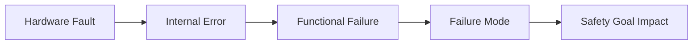
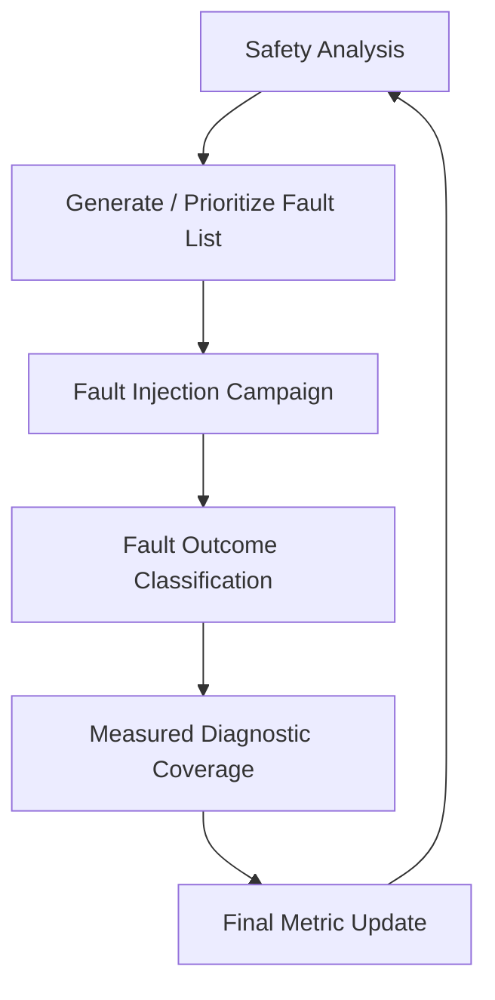
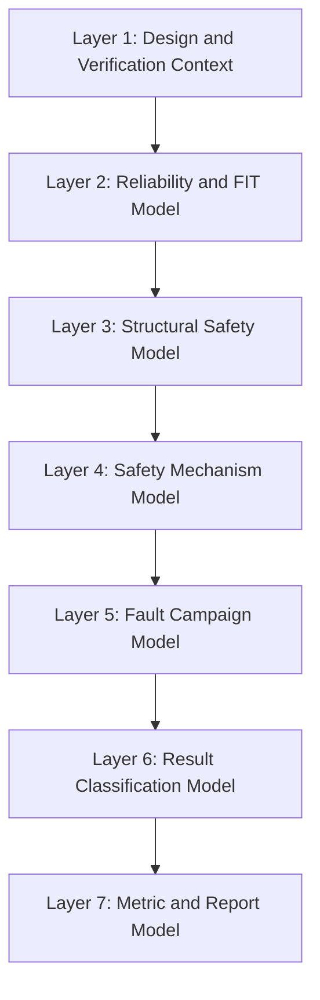
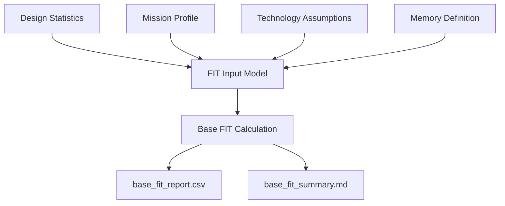
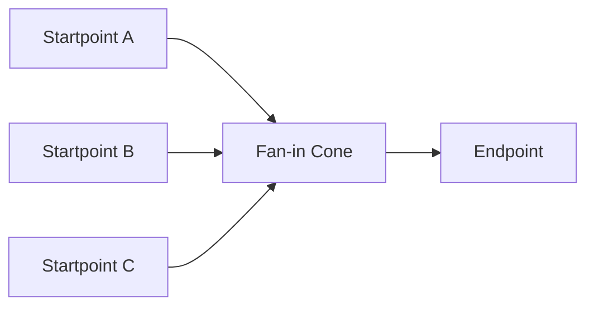
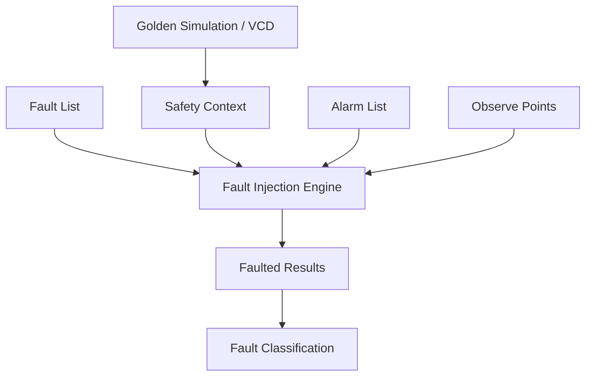
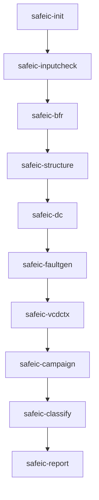
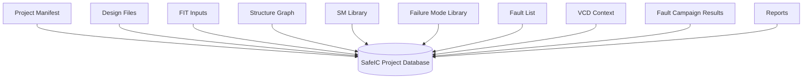
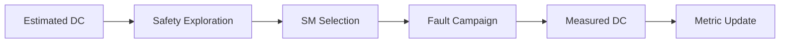
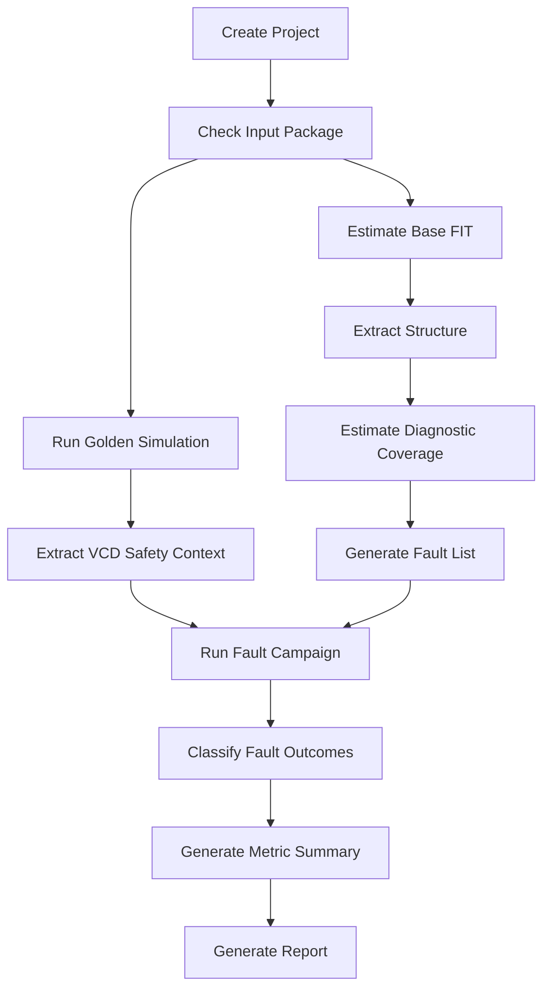

# [Automotive Safe-IC Practice 01] What Are We Actually Verifying in Automotive Chip Functional Safety?

**Author**: Darren H. Chen  
**Direction**: Automotive Chip Functional Safety Analysis and Fault Injection Practice  
**Demo**: D01_safeic_closed_loop  
**Tags**: Automotive Chip, Functional Safety, ISO 26262, FIT, Diagnostic Coverage, FMEDA, Fault Injection, Fault Campaign, VCD, Safety Mechanism

---

## 1. The Central Question

When we say that an automotive chip has been verified for functional safety, what has actually been verified?

At first glance, the answer may sound simple:

> We verify that safety mechanisms can detect faults.

But this statement is incomplete.

A real automotive chip safety workflow must answer a deeper set of questions:

```text
What can fail?
Where can it fail?
How likely is the failure?
Can the failure propagate to a safety-relevant state?
Can a safety mechanism detect or control it?
Under which operating context is the detection valid?
How much residual risk remains after protection?
Can the result be traced back to FMEDA and safety metrics?
```

This article builds the first engineering mental model for the repository:

```text
Automotive Safe-IC Functional Safety and Fault Injection Practice
```

The corresponding demo is:

```text
D01_safeic_closed_loop
```

The goal of the first demo is not to implement a full industrial safety verification solution. The goal is to make the closed loop visible:

```text
Design
→ Safety analysis
→ Safety mechanism modeling
→ Fault list generation
→ Fault injection
→ Fault classification
→ Metric update
→ Engineering report
```

The most important idea is this:

> Functional safety verification is not only about running simulations. It is about building evidence that random hardware faults are either prevented from violating a safety goal, detected by safety mechanisms, converted into safe behavior, or explicitly left as residual risk.

---

## 2. Functional Safety Is About Random Hardware Faults, Not Only Design Bugs

Traditional functional verification mainly asks:

```text
Does the design implement the intended function correctly?
```

Functional safety verification asks a different question:

```text
If hardware faults occur during operation, does the system remain acceptably safe?
```

This distinction is fundamental.

A design bug is usually a systematic fault. It comes from specification mistakes, RTL implementation mistakes, verification gaps, integration errors, or process issues. These faults are addressed by design reviews, verification plans, simulation, formal verification, lint, CDC/RDC checks, synthesis checks, manufacturing tests, and disciplined development processes.

Random hardware faults are different. They may occur during the lifetime of the product even if the RTL is correct. They may be caused by aging, radiation, electrical overstress, manufacturing variability, environmental stress, or transient disturbances.

At chip level, random hardware faults can appear as:

```text
stuck-at faults
transient bit flips
memory bit corruptions
delay faults
control state corruptions
bus transfer corruptions
alarm path failures
diagnostic logic failures
```

A simplified distinction is:

| Verification Dimension | Primary Concern | Typical Method |
|---|---|---|
| Functional verification | Correct behavior without injected faults | Simulation, formal, emulation, regression |
| Manufacturing test | Detect manufacturing defects before shipment | ATPG, scan test, BIST |
| Functional safety analysis | Estimate random hardware failure impact | FIT, DC, FMEDA, structural analysis |
| Functional safety validation | Validate safety mechanisms under faults | Fault injection, fault campaign, report classification |

Functional safety verification does not replace functional verification. It extends it.

A design that fails ordinary functional verification cannot be considered safe. But a design that passes ordinary functional verification is not automatically safe, because it has not yet shown what happens when faults occur during operation.

---

## 3. The Fault-to-Failure Chain

The safest way to understand this topic is to separate four words that are often mixed together:

```text
fault
error
failure
failure mode
```

A practical chip-level interpretation is:

| Term | Meaning |
|---|---|
| Fault | A defect or injected disturbance at hardware level |
| Error | An incorrect internal value or state caused by the fault |
| Failure | A visible violation of intended behavior |
| Failure Mode | A category describing how the function fails |

Example:

```text
Fault:
  A state register bit flips from 0 to 1.

Error:
  The FSM enters an unintended internal state.

Failure:
  A safety-critical output is asserted incorrectly or not asserted when required.

Failure Mode:
  illegal_state_transition or wrong_control_decision.
```

Another example:

```text
Fault:
  A data bus register has a stuck-at-0 fault.

Error:
  A transferred data word becomes corrupted.

Failure:
  The receiver consumes incorrect data.

Failure Mode:
  corrupted_data_transfer.
```

This chain can be visualized as:



A safety mechanism is inserted somewhere along this chain:


A fault campaign tests whether this safety mechanism really works under a defined operating context.

---

## 4. Why FIT and Diagnostic Coverage Must Be Considered Together

Two metrics appear repeatedly in automotive chip safety analysis:

```text
FIT
DC
```

FIT means Failure In Time. It is a failure rate measure. A common interpretation is:

```text
1 FIT = 1 failure per 1,000,000,000 hours
```

In chip safety analysis, FIT is used to estimate how susceptible silicon, package, memory, logic, or other hardware elements are to random hardware faults.

Diagnostic Coverage, or DC, measures the fraction of relevant faults that can be detected or controlled by safety mechanisms.

A design with a high FIT but also high diagnostic coverage may be acceptable depending on safety goals and residual risk. A design with low FIT but almost no diagnostic coverage may still be problematic if a small number of faults directly violate a safety goal.

The relationship is:

```text
risk contribution
≈ fault rate × effect on safety goal × lack of detection
```

This is why safety verification cannot only count faults. It must connect:

```text
fault likelihood
fault propagation
safety mechanism coverage
residual effect
```

A simplified model:

```text
residual_fault_contribution = original_fault_contribution × (1 - diagnostic_coverage)
```

This is not a replacement for a full standard-compliant metric calculation, but it is a useful engineering mental model.

---

## 5. Safety Analysis vs Fault Injection

A closed-loop safety workflow usually contains two complementary parts:

```text
safety analysis
fault injection validation
```

They answer different questions.

### 5.1 Safety Analysis

Safety analysis estimates and organizes risk.

It asks:

```text
What is the base FIT rate?
Which endpoints contribute most?
Which safety mechanisms are assumed?
What diagnostic coverage is claimed?
Which faults should be injected?
What residual metric remains?
```

This stage uses:

```text
design files
technology assumptions
mission profile
FIT inputs
transistor or memory-bit counts
structural analysis
safety mechanism definition
endpoint-to-safety-mechanism mapping
FMEDA hierarchy
```

### 5.2 Fault Injection Validation

Fault injection validates behavior under faults.

It asks:

```text
If a fault is injected under a given operating context, what happens?
Does the machine state deviate from the golden context?
Does an alarm fire?
Is the fault safe?
Is the fault unsafe?
Is the result unresolved?
```

This stage uses:

```text
design files
fault list
alarm list
observe points
VCD or simulation activity
safety context
fault campaign configuration
classification rules
```

The relationship is:



A key principle:

> Safety analysis gives estimated evidence. Fault injection gives measured evidence under simulation context.

Both are needed.

---

## 6. The Closed-Loop Model

The closed-loop model used in this repository has seven layers.



Each layer exists for a reason.

| Layer | Core Question | Typical Data |
|---|---|---|
| Design and verification context | What design is being analyzed and under what stimulus? | RTL/netlist, filelist, clocks, VCD |
| Reliability and FIT model | How likely are random hardware faults? | FIT inputs, mission profile, technology data |
| Structural safety model | Where can faults propagate? | startpoints, endpoints, cones |
| Safety mechanism model | What detects, corrects, or controls faults? | SM library, DC definitions, EP-to-SM map |
| Fault campaign model | Which faults are injected and when? | fault list, alarm list, observe points, VCD context |
| Result classification model | What happened after injection? | detected, safe, unsafe, unresolved |
| Metric and report model | What is the evidence? | DC, residual FIT, FMEDA rows, reports |

This model is deliberately tool-independent. It can be implemented with commercial tools, open-source prototypes, or internal scripts.

---

## 7. Layer 1: Design and Verification Context

Functional safety verification begins with context.

A fault is not meaningful in isolation. The same fault may be irrelevant in one operating mode and dangerous in another.

Consider a register bit flip:

```text
During reset:
  The fault may be overwritten and have no effect.

During idle mode:
  The fault may not propagate.

During safety-critical operation:
  The fault may corrupt an output or prevent an alarm.
```

This is why fault injection needs simulation context.

The minimum design context includes:

```text
RTL or gate-level netlist
top module name
clock definition
reset behavior
testbench or stimulus
waveform activity
fault injection scope
alarm signal definitions
observe point definitions
```

In the demo, this is represented as:

```text
inputs/
  rtl/
  filelist.f
  clkdef.clk
  sim.vcd
  fault.list
  alarm.list
  observe_points.list
```

The tool architecture begins with an input checker:

```text
safeic-inputcheck
```

Its role is simple:

```text
verify that the safety workflow has enough context to run
```

It should check:

```text
Does the filelist exist?
Does the top module exist?
Are clocks defined?
Does the VCD contain expected signals?
Are fault nodes syntactically valid?
Are alarm signals present?
Are observe points present?
Are configuration files consistent?
```

This step is boring but essential. Many safety verification failures are not caused by sophisticated algorithmic issues; they are caused by inconsistent input packages.

---

## 8. Layer 2: Reliability and FIT Model

Before selecting or validating safety mechanisms, we need to estimate how much random hardware failure risk exists.

This is the role of FIT analysis.

A practical FIT model usually needs:

```text
design type
technology assumptions
transistor count or gate count
memory bit count
package assumptions
mission profile
temperature profile
operating ratio
failure rate model
```

The output of this layer is not just a single number. A useful analysis should produce a breakdown:

```text
logic FIT
flip-flop FIT
memory FIT
package FIT
permanent FIT
transient FIT
per-module FIT
per-endpoint contribution
```

The demo component is:

```text
safeic-bfr
```

The name BFR means Base FIT Rate.

The base FIT rate is calculated before additional safety mechanisms are considered. It establishes the baseline:

```text
How unsafe is the unprotected or initially protected design?
```

A simplified flow:



The key engineering principle is:

> BFR is not the final answer. It is the baseline against which safety mechanisms are judged.

---

## 9. Layer 3: Structural Safety Model

A chip is not just a bag of gates. Faults propagate through structure.

For safety analysis, three structural concepts are useful:

```text
Startpoint
Endpoint
Cone
```

A startpoint is where a fault may originate or begin to propagate.

An endpoint is where a propagated error is observed or becomes safety-relevant.

A cone is the logic region connecting startpoints to endpoints.

Conceptually:



Why does this matter?

Because a safety mechanism may cover different parts of this structure:

| Safety Mechanism Type | What It Usually Covers |
|---|---|
| Endpoint parity | Endpoint state |
| Cone duplication | Logic cone and endpoint |
| End-to-end CRC | Path between source and destination |
| Protocol checker | Behavior over time |
| Memory ECC | Stored memory contents |
| Alarm monitor | Diagnostic reporting path |

If we do not know the structure, we cannot reason about coverage.

The demo component is:

```text
safeic-structure
```

It extracts a simplified graph:

```text
structure_graph.json
sp.csv
ep.csv
cone.csv
```

A minimal data model:

```json
{
  "endpoints": [
    {
      "name": "top.u_ctrl.state_reg[2]",
      "type": "fsm_state",
      "fanout": 18,
      "fanin_cone_size": 143
    }
  ],
  "startpoints": [
    {
      "name": "top.u_bus.wdata_reg[0]",
      "type": "register"
    }
  ],
  "cones": [
    {
      "endpoint": "top.u_ctrl.state_reg[2]",
      "startpoints": [
        "top.u_bus.wdata_reg[0]",
        "top.u_cfg.mode_reg[1]"
      ]
    }
  ]
}
```

The value of this model is not only reporting. It becomes the foundation for safety mechanism selection, DC estimation, and fault list generation.

---

## 10. Layer 4: Safety Mechanism Model

A safety mechanism is a technical measure used to detect, correct, mask, or control faults.

Typical examples include:

```text
parity
ECC
CRC
duplication
lockstep
triplication
BIST
watchdog
timeout monitor
range checker
protocol checker
alert monitor
```

A safety mechanism must be modeled with at least three properties:

```text
what it protects
what it detects
how much coverage is claimed
```

A generic safety mechanism library may look like:

```yaml
mechanisms:
  endpoint_parity:
    coverage_scope:
      ep: 0.90
      sp: 0.00
      cone: 0.00
    suitable_for:
      - register_group
      - scalar_ff
    detects:
      - single_bit_error
    corrects: false

  memory_ecc:
    coverage_scope:
      ep: 0.99
      sp: 0.00
      cone: 0.00
    suitable_for:
      - memory
      - register_file
    detects:
      - single_bit_error
      - some_multi_bit_error
    corrects: true

  cone_duplication:
    coverage_scope:
      ep: 0.90
      sp: 0.00
      cone: 0.90
    suitable_for:
      - high_contribution_logic
      - control_path
    detects:
      - logic_corruption
      - endpoint_error
    corrects: false
```

The important methodological point is:

> Diagnostic coverage is not a property of a mechanism name alone. It is a property of a mechanism applied to a specific structure under a specific assumption.

For example:

```text
parity on a local register
```

does not cover the entire upstream combinational cone.

```text
end-to-end CRC on a bus transaction
```

does not necessarily protect an unrelated local FSM transition.

```text
lockstep on a CPU core
```

may detect many internal mismatches, but it still requires valid comparator, alarm, reset, and system response paths.

The demo components involved are:

```text
safeic-dc
safeic-smselect
```

The first computes diagnostic coverage from a given map. The second helps recommend candidate safety mechanisms based on structural contribution and failure semantics.

---

## 11. Layer 5: Fault Campaign Model

A fault campaign is the validation stage where faults are injected and classified.

A practical fault campaign requires at least:

```text
design files
simulation activity
fault list
alarm list
observe points
clock definition
injection instance
fault campaign options
```

The essential flow is:



The demo components are:

```text
safeic-vcdctx
safeic-faultgen
safeic-campaign
```

### 11.1 Fault List

A fault list defines what to inject:

```text
node
fault type
fault mode
injection condition
optional time window
```

Example:

```text
top.u_ctrl.state_reg[2] stuck_at_0
top.u_ctrl.state_reg[2] stuck_at_1
top.u_ram.mem[15][3] transient_flip
top.u_bus.wdata_reg[7] transient_flip
```

### 11.2 Alarm List

An alarm list defines what counts as detection:

```text
top.u_safety.alarm_fsm
top.u_bus.bus_integrity_error
top.u_mem.ecc_error
top.u_core.major_alert
```

An alarm is not merely a waveform signal. It is a safety interpretation:

```text
the safety mechanism observed an error and reported it
```

### 11.3 Observe Points

Observe points are used to determine whether the fault propagated to relevant machine state or outputs.

Examples:

```text
top.u_ctrl.safe_state
top.u_bus.rdata
top.u_timer.timeout
top.u_core.alert_major
```

Observe points help distinguish:

```text
fault did not matter
fault changed internal behavior
fault escaped to safety-relevant output
```

### 11.4 VCD Safety Context

A VCD is not only a waveform file. In this workflow, it is a safety context.

It tells the fault campaign:

```text
which state elements were active
when signals toggled
what the golden values were
what time window matters
what operating mode was exercised
```

A fault injected outside meaningful context may not validate the safety mechanism.

---

## 12. Layer 6: Fault Result Classification

After fault injection, results must be classified.

A simple and useful classification is:

```text
detected
safe
unsafe
unresolved
```

### 12.1 Detected

A fault is detected when the machine state differs from the golden reference and the fault propagates to an alarm or diagnostic indication.

```text
fault injected
→ state deviates
→ alarm fires
→ diagnostic coverage credit
```

### 12.2 Safe

A fault is safe when it does not create a safety-relevant deviation.

Examples:

```text
the fault is overwritten
the fault does not propagate
the fault affects unused logic
the fault is masked by logic behavior
the endpoint remains equal to golden context
```

Safe faults matter because not every injected fault is dangerous.

### 12.3 Unsafe

A fault is unsafe when it produces a relevant deviation but no safety mechanism detects it.

```text
fault injected
→ state/output deviates
→ no alarm
→ potential residual risk
```

Unsafe faults drive design improvement.

### 12.4 Unresolved

A fault is unresolved when the tool cannot determine a meaningful classification.

Possible causes:

```text
missing VCD signal
black-box boundary
unknown X propagation
incomplete mapping
insufficient observe point
missing alarm definition
unsupported construct
insufficient simulation duration
```

Unresolved faults are not automatically unsafe, but they are not evidence of safety either.

The demo component is:

```text
safeic-classify
```

A useful report should summarize:

```csv
fault_id,node,fault_type,outcome,alarm,observe_point,reason
F001,top.u_ctrl.state_reg[2],stuck_at_0,detected,top.u_safety.alarm_fsm,top.u_ctrl.safe_state,alarm_triggered
F002,top.u_timer.count_reg[3],stuck_at_1,safe,,top.u_timer.timeout,no_golden_deviation
F003,top.u_bus.wdata_reg[7],stuck_at_0,unsafe,,top.u_bus.rdata,deviation_without_alarm
F004,top.u_ram.mem[4][1],transient_flip,unresolved,,top.u_mem.rdata,missing_vcd_signal
```

---

## 13. Layer 7: Metric and Report Model

The final layer converts raw fault results into engineering evidence.

A safety report should not only say:

```text
10000 faults simulated
9000 detected
500 safe
300 unsafe
200 unresolved
```

It should also answer:

```text
Which failure modes are affected?
Which safety mechanisms performed well?
Which endpoints dominate residual risk?
Which modules need design change?
Which faults are unresolved due to missing data?
Which results should be back-annotated to FMEDA?
```

A good report connects:

```text
fault outcome
+ endpoint contribution
+ safety mechanism mapping
+ failure mode
+ diagnostic coverage
+ residual FIT
```

The demo component is:

```text
safeic-report
```

A useful report structure:

```text
1. Design and run summary
2. Input package summary
3. Base FIT summary
4. Structural model summary
5. Safety mechanism map summary
6. Fault campaign summary
7. Fault outcome distribution
8. Unsafe fault analysis
9. Unresolved fault analysis
10. Metric update summary
11. Recommendations
```

This is why the first demo focuses on a closed loop, not a single command.

---

## 14. The Tool Architecture Used in D01

The first demo uses generic tool names. These are not intended to represent a mature commercial implementation. They are small engineering components used to make the workflow explainable.



Each component has a narrow responsibility:

| Component | Purpose |
|---|---|
| `safeic-init` | Create project skeleton and manifest |
| `safeic-inputcheck` | Validate design, VCD, fault, alarm, and configuration inputs |
| `safeic-bfr` | Estimate base FIT before safety mechanism impact |
| `safeic-structure` | Extract startpoints, endpoints, and cones |
| `safeic-dc` | Estimate diagnostic coverage from safety mechanism mapping |
| `safeic-faultgen` | Generate a small prioritized fault list |
| `safeic-vcdctx` | Extract golden safety context from VCD |
| `safeic-campaign` | Execute or emulate fault campaign steps |
| `safeic-classify` | Classify results as detected/safe/unsafe/unresolved |
| `safeic-report` | Generate engineering report |

The point is not the number of tools. The point is that each artifact in the safety workflow has a clear owner and a clear transformation.

---

## 15. Data-Centric Architecture

A functional safety workflow becomes fragile if everything is hidden inside scripts.

A better architecture is data-centric.



For the first demo, the database can be a simple directory plus JSON/CSV files:

```text
D01_safeic_closed_loop/
  manifest.yaml
  inputs/
  intermediate/
  outputs/
  reports/
```

Later, this can be represented in SQLite:

```text
project
session
design_file
fit_result
endpoint
startpoint
cone
safety_mechanism
failure_mode
ep_to_sm_map
fault
fault_campaign
fault_result
report
```

The methodology is:

> Every step should produce an artifact that can be inspected, diffed, versioned, and reused.

This is especially important for safety work, because safety evidence must be reviewable.

---

## 16. Methodology: Evidence Before Automation

A tempting mistake is to automate too early.

For functional safety practice, the first goal should not be:

```text
one command that runs everything
```

The first goal should be:

```text
a transparent chain of evidence
```

Automation is useful only after the evidence model is clear.

The recommended methodology is:

```text
1. Define the safety question.
2. Define the design context.
3. Define the reliability assumptions.
4. Extract the structural model.
5. Define safety mechanisms.
6. Generate fault candidates.
7. Run fault injection under meaningful context.
8. Classify results.
9. Update metrics.
10. Review unsafe and unresolved cases.
```

Each step should answer:

```text
What was the input?
What assumption was made?
What artifact was generated?
What can be reviewed?
What can be repeated?
```

---

## 17. Methodology: Estimated Coverage vs Measured Coverage

Safety analysis often starts with estimated coverage.

For example:

```text
endpoint parity is assumed to provide 90% endpoint coverage
memory ECC is assumed to provide 99% memory coverage
a protocol checker is assumed to detect illegal transitions
```

These estimates are useful for early architecture exploration.

But estimated coverage is not the same as measured coverage.

Measured coverage comes from validation:

```text
inject faults
run under context
check alarm and observe points
classify outcomes
back-annotate results
```

The relationship is:



A disciplined workflow keeps these two concepts separate:

| Coverage Type | Meaning |
|---|---|
| Estimated DC | Claimed or assumed coverage based on safety mechanism model |
| Calculated DC | Computed from structural mapping and assumptions |
| Measured DC | Derived from fault injection campaign outcomes |

The first demo introduces this distinction even though the implementation is intentionally small.

---

## 18. Methodology: Fault Campaign Is Context-Dependent

A fault campaign is only as good as its context.

A fault injected into a design without meaningful stimulus may produce misleading results.

Example:

```text
A bus parity checker appears useless if the bus never transfers data.
A timer fault appears safe if timeout behavior is never exercised.
A memory ECC alarm never fires if the memory location is never read.
A CPU lockstep mismatch cannot be observed if alert outputs are not monitored.
```

Therefore, fault injection must be tied to:

```text
operating mode
stimulus
time window
safety function
alarm list
observe points
FTTI or detection window
```

This is why the VCD context is central.

A practical safety context contains:

```text
clock activity
reset release
state element activity
golden values
safety-critical time windows
alarm signal values
observe point values
```

The first demo keeps this small, but the concept scales to realistic IP and SoC verification.

---

## 19. Methodology: Unresolved Faults Are Engineering Work Items

Unresolved faults are often more valuable than they look.

They indicate that the current evidence chain is incomplete.

Common unresolved causes:

```text
missing waveform data
missing mapping between RTL and gate-level names
missing black-box model
incomplete alarm list
insufficient observe points
X propagation
simulation not long enough
unsupported language construct
fault reaches unmodeled boundary
```

A good report should not hide unresolved faults. It should classify them by reason and suggest next action.

Example:

| Unresolved Reason | Engineering Action |
|---|---|
| missing VCD signal | Add signal to waveform dump |
| no observe point | Add relevant observe point |
| black-box boundary | Add model or black-box assumption |
| insufficient stimulus | Extend test or add scenario |
| missing alarm mapping | Update alarm list |
| RTL/gate name mismatch | Add mapping file |
| X propagation | Improve reset or X handling strategy |

This turns fault campaign results into a debug workflow.

---

## 20. Demo D01: What We Build

The first demo is a small closed-loop prototype.

It uses a toy design, such as:

```text
toy_counter
toy_alu
toy_timer
```

The demo should be small enough to understand by inspection, but rich enough to show:

```text
a safety-relevant state
a safety mechanism
an alarm output
a golden simulation
a fault list
fault outcomes
a metric summary
```

Suggested directory:

```text
D01_safeic_closed_loop/
  README.md
  run_demo.sh
  run_demo.csh

  inputs/
    rtl/
      toy_counter.v
      toy_counter_tb.v
    filelist.f
    clkdef.clk
    fit_inputs.yaml
    safety_mechanisms.yaml
    failure_modes.yaml
    ep_to_sm_map.csv
    fault.list
    alarm.list
    observe_points.list
    sim.vcd

  intermediate/
    design_stats.json
    structure_graph.json
    vcd_context.json

  outputs/
    base_fit_report.csv
    dc_report.csv
    fault_result.csv
    metric_summary.csv
    closed_loop_summary.md

  reports/
    d01_safeic_closed_loop_report.html
```

---

## 21. Demo D01: Expected Flow



A simplified run script:

```bash
#!/usr/bin/env bash
set -euo pipefail

safeic-init --project D01_safeic_closed_loop

safeic-inputcheck \
  --manifest manifest.yaml \
  --output outputs/input_check.rpt

safeic-bfr \
  --fit-inputs inputs/fit_inputs.yaml \
  --output outputs/base_fit_report.csv

safeic-structure \
  --filelist inputs/filelist.f \
  --top toy_counter \
  --output intermediate/structure_graph.json

safeic-dc \
  --structure intermediate/structure_graph.json \
  --sm-library inputs/safety_mechanisms.yaml \
  --ep-to-sm-map inputs/ep_to_sm_map.csv \
  --output outputs/dc_report.csv

safeic-vcdctx \
  --vcd inputs/sim.vcd \
  --clkdef inputs/clkdef.clk \
  --output intermediate/vcd_context.json

safeic-campaign \
  --fault-list inputs/fault.list \
  --alarm-list inputs/alarm.list \
  --observe-points inputs/observe_points.list \
  --vcd-context intermediate/vcd_context.json \
  --output outputs/fault_campaign_raw.csv

safeic-classify \
  --campaign outputs/fault_campaign_raw.csv \
  --output outputs/fault_result.csv

safeic-report \
  --base-fit outputs/base_fit_report.csv \
  --dc outputs/dc_report.csv \
  --fault-result outputs/fault_result.csv \
  --output reports/d01_safeic_closed_loop_report.html
```

A csh wrapper can be provided for environments that still use csh-style scripts:

```csh
#!/bin/csh -f

set DEMO = D01_safeic_closed_loop
echo "Running $DEMO"

safeic-inputcheck --manifest manifest.yaml --output outputs/input_check.rpt
safeic-bfr --fit-inputs inputs/fit_inputs.yaml --output outputs/base_fit_report.csv
safeic-structure --filelist inputs/filelist.f --top toy_counter --output intermediate/structure_graph.json
safeic-dc --structure intermediate/structure_graph.json --sm-library inputs/safety_mechanisms.yaml --ep-to-sm-map inputs/ep_to_sm_map.csv --output outputs/dc_report.csv
safeic-vcdctx --vcd inputs/sim.vcd --clkdef inputs/clkdef.clk --output intermediate/vcd_context.json
safeic-campaign --fault-list inputs/fault.list --alarm-list inputs/alarm.list --observe-points inputs/observe_points.list --vcd-context intermediate/vcd_context.json --output outputs/fault_campaign_raw.csv
safeic-classify --campaign outputs/fault_campaign_raw.csv --output outputs/fault_result.csv
safeic-report --base-fit outputs/base_fit_report.csv --dc outputs/dc_report.csv --fault-result outputs/fault_result.csv --output reports/d01_safeic_closed_loop_report.html
```

---

## 22. Example Toy Safety Mechanism

Assume a counter has a parity bit and an alarm:

```verilog
module toy_counter (
  input  logic clk,
  input  logic rst_n,
  input  logic en,
  output logic [7:0] count,
  output logic count_parity,
  output logic alarm
);

  logic expected_parity;

  always_ff @(posedge clk or negedge rst_n) begin
    if (!rst_n) begin
      count <= 8'h00;
      count_parity <= 1'b0;
    end else if (en) begin
      count <= count + 8'h01;
      count_parity <= ^(count + 8'h01);
    end
  end

  assign expected_parity = ^count;
  assign alarm = (expected_parity != count_parity);

endmodule
```

This is not a complete industrial safety mechanism. It is a teaching example.

It lets us demonstrate:

```text
fault on count bit
fault on parity bit
fault on alarm path
detected fault
safe fault
unsafe fault
unresolved fault
```

Possible fault list:

```text
toy_counter.count[0] stuck_at_0
toy_counter.count[0] stuck_at_1
toy_counter.count_parity stuck_at_0
toy_counter.alarm stuck_at_0
```

Alarm list:

```text
toy_counter.alarm
```

Observe points:

```text
toy_counter.count
toy_counter.count_parity
toy_counter.alarm
```

---

## 23. What the First Demo Should Prove

The first demo should prove that we understand the workflow, not that the toy design is certifiable.

A successful D01 demo should show:

```text
1. The project input package is complete.
2. A base FIT report can be generated.
3. A structural model can identify endpoints.
4. A safety mechanism can be mapped to an endpoint.
5. A diagnostic coverage estimate can be generated.
6. A fault list can be injected or emulated.
7. A VCD context can provide golden behavior.
8. Fault outcomes can be classified.
9. Metrics can be summarized.
10. A report can explain the result.
```

Expected output:

```text
outputs/
  input_check.rpt
  base_fit_report.csv
  dc_report.csv
  fault_result.csv
  metric_summary.csv

reports/
  d01_safeic_closed_loop_report.html
```

Example `fault_result.csv`:

```csv
fault_id,node,fault_type,outcome,alarm,reason
F001,toy_counter.count[0],stuck_at_0,detected,toy_counter.alarm,alarm_triggered
F002,toy_counter.count[7],stuck_at_1,safe,,no_observed_deviation
F003,toy_counter.alarm,stuck_at_0,unsafe,,alarm_path_blocked
F004,toy_counter.hidden_state,stuck_at_1,unresolved,,missing_vcd_signal
```

Example `metric_summary.csv`:

```csv
metric,value
total_faults,4
detected,1
safe,1
unsafe,1
unresolved,1
measured_detection_ratio,0.25
measured_safe_ratio,0.25
```

The numbers are intentionally simple. The important point is the evidence chain.

---

## 24. How to Think About Tool Architecture

A functional safety workflow should be designed around artifacts.

A poor architecture is:

```text
script A calls script B calls script C
```

with no stable data model.

A better architecture is:

```text
each step consumes explicit artifacts
each step generates explicit artifacts
each artifact can be reviewed independently
```

This allows:

```text
debugging
version control
repeatability
audit-style review
tool comparison
incremental improvement
```

For D01, a useful artifact chain is:

```text
manifest.yaml
→ input_check.rpt
→ design_stats.json
→ base_fit_report.csv
→ structure_graph.json
→ dc_report.csv
→ vcd_context.json
→ fault_campaign_raw.csv
→ fault_result.csv
→ metric_summary.csv
→ report.html
```

This chain is the backbone of the practice series.

---

## 25. Engineering Review Questions

After running D01, an engineer should be able to answer:

```text
What is the safety function in the toy design?
Which signals are endpoints?
Which signals are alarms?
Which faults were injected?
What was the golden context?
Which faults were detected?
Which faults were safe?
Which faults were unsafe?
Which faults were unresolved?
What data is missing for unresolved faults?
What metric changed after fault campaign?
```

If a demo cannot answer these questions, it is not yet a safety demo. It is only a simulation demo.

---

## 26. Common Mistakes

### 26.1 Treating a Fault List as the Safety Goal

A fault list is not the safety goal. It is a validation input.

The safety goal comes from system-level risk analysis. The fault list is a way to test whether hardware safety mechanisms protect safety-relevant structures.

### 26.2 Treating an Alarm as Automatic Safety

An alarm firing is not always sufficient. The system must detect it in time and respond appropriately.

For chip-level practice, we can start by checking whether an alarm fires. But a complete safety argument also needs:

```text
alarm propagation
alarm handling
reaction timing
safe-state transition
software or system response
```

### 26.3 Treating All Undetected Faults as Equally Dangerous

Some undetected faults are safe because they do not affect the safety goal. Some are unsafe because they cause a relevant deviation. Some are unresolved because the evidence is incomplete.

Classification matters.

### 26.4 Ignoring Simulation Context

A fault campaign without meaningful context may overestimate or underestimate safety.

The context should represent a relevant operating scenario.

### 26.5 Mixing Estimated and Measured Diagnostic Coverage

Estimated diagnostic coverage is a design assumption. Measured diagnostic coverage is validation evidence.

They should be compared, not confused.

---

## 27. Summary

Automotive chip functional safety verification is a closed-loop evidence process.

It connects:

```text
FIT estimation
structural safety analysis
safety mechanism modeling
fault list generation
simulation context
fault injection
result classification
metric update
FMEDA/reporting
```

The first demo:

```text
D01_safeic_closed_loop
```

builds a minimal version of that loop.

The core lesson is:

> A safety workflow is not defined by one tool command. It is defined by the traceable transformation from design assumptions to measured safety evidence.

The demo uses generic components:

```text
safeic-init
safeic-inputcheck
safeic-bfr
safeic-structure
safeic-dc
safeic-faultgen
safeic-vcdctx
safeic-campaign
safeic-classify
safeic-report
```

Together, they show the full conceptual path:

```text
Design context
→ FIT baseline
→ structural model
→ safety mechanism model
→ fault campaign
→ outcome classification
→ metric/report evidence
```

This is the foundation for building practical, explainable, and reviewable automotive Safe-IC analysis and fault injection demos.

---

## 28. D01 Demo Checklist

For `D01_safeic_closed_loop`, the expected deliverables are:

```text
[ ] README.md
[ ] run_demo.sh
[ ] run_demo.csh
[ ] manifest.yaml
[ ] inputs/rtl/toy_counter.v
[ ] inputs/rtl/toy_counter_tb.v
[ ] inputs/filelist.f
[ ] inputs/clkdef.clk
[ ] inputs/fit_inputs.yaml
[ ] inputs/safety_mechanisms.yaml
[ ] inputs/failure_modes.yaml
[ ] inputs/ep_to_sm_map.csv
[ ] inputs/fault.list
[ ] inputs/alarm.list
[ ] inputs/observe_points.list
[ ] inputs/sim.vcd
[ ] intermediate/design_stats.json
[ ] intermediate/structure_graph.json
[ ] intermediate/vcd_context.json
[ ] outputs/input_check.rpt
[ ] outputs/base_fit_report.csv
[ ] outputs/dc_report.csv
[ ] outputs/fault_campaign_raw.csv
[ ] outputs/fault_result.csv
[ ] outputs/metric_summary.csv
[ ] reports/d01_safeic_closed_loop_report.html
```

A successful run should make the closed loop visible, inspectable, and repeatable.
