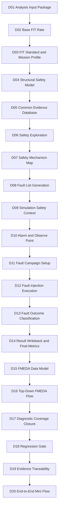
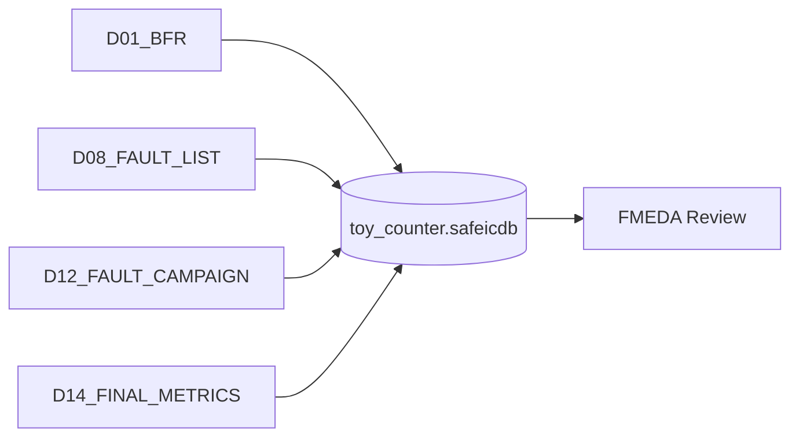
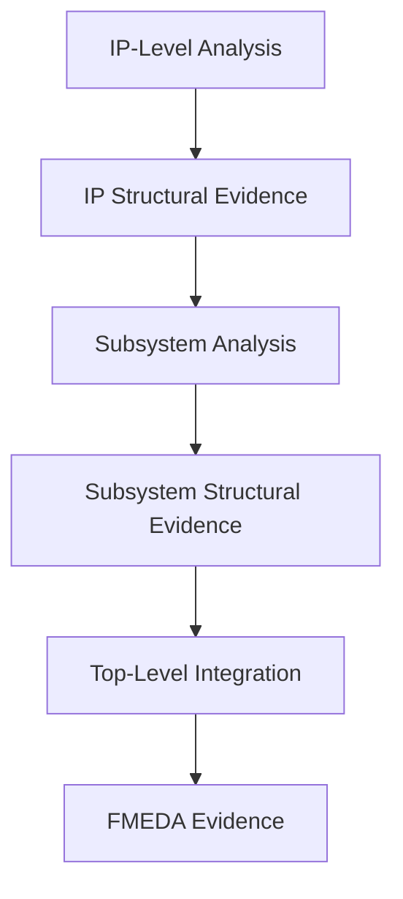
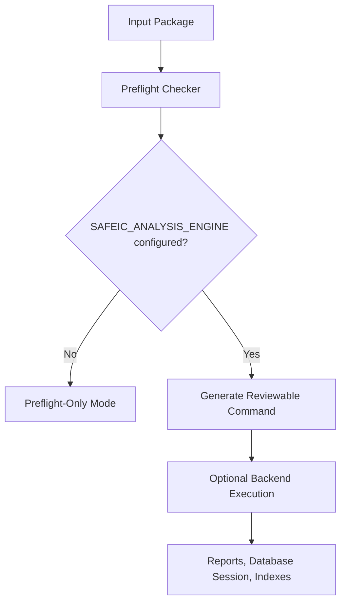

# [Automotive Safe-IC Practice 01] Analysis Input Package: Building a Reproducible Safety Evidence Context

**Author**: Darren H. Chen  
**Direction**: Automotive Chip Functional Safety Analysis and Fault-Injection Practice  
**Demo**: `D01_analysis_input_package`  
**Tags**: Automotive Chip, Functional Safety, ISO 26262, ASIL, FIT, Base FIT Rate, Diagnostic Coverage, Fault Campaign, FMEDA, Evidence Database, Reproducible EDA Flow

---

## 1. Why This Article Starts from an Input Package

Many functional safety discussions start from metrics:

```text
FIT
SPFM
LFM
PMHF
diagnostic coverage
FMEDA
```

These metrics are important, but they are not the best starting point for an engineering practice series.

A functional safety result is only meaningful when its input context is reproducible. A number without a reviewable input package is difficult to audit, difficult to reproduce, and difficult to reuse in later fault campaigns or FMEDA work.

For that reason, this first demo does not start from a vendor-specific command or a tool GUI.

It starts from a simple question:

```text
What files, assumptions, configuration items, and evidence indexes are required
before a safety analysis result can be trusted?
```

The answer is the **analysis input package**.

In this series, D01 is the root of the entire Safe-IC evidence chain. It prepares the design boundary, reliability setup, clock definition, analysis options, database session name, output structure, and run manifest. Later demos can then build on the same foundation without redesigning the directory structure or changing the evidence model.

---

## 2. Basic Concepts Before the Demo

Before describing the demo structure, several terms should be clarified.

### 2.1 Functional Safety

In the automotive context, functional safety is mainly discussed under ISO 26262. A practical engineering interpretation is:

```text
When an electrical/electronic system malfunctions, can the system avoid unreasonable risk?
```

This question is different from ordinary functional verification.

Functional verification asks:

```text
Does the design implement the specification under intended operating conditions?
```

Functional safety adds another question:

```text
When a hardware fault occurs during field operation, does the design detect, control,
correct, isolate, or safely tolerate the abnormal behavior?
```

A normal RTL test may prove that a counter increments correctly. A safety analysis or fault campaign asks what happens when a counter bit flips, a control signal is stuck, a memory word is corrupted, or a checker output is delayed.

### 2.2 ISO 26262 and ASIL

**ISO 26262** is the major functional safety standard for road-vehicle electrical and electronic systems.

**ASIL** means **Automotive Safety Integrity Level**. It is commonly divided into:

```text
ASIL A
ASIL B
ASIL C
ASIL D
```

ASIL D is the most stringent level.

ASIL is not chosen randomly at the chip level. It is derived from system-level hazard analysis and risk assessment. Typical factors include:

```text
Severity
Exposure
Controllability
```

At the semiconductor level, the design team must provide evidence that helps answer questions such as:

```text
What is the random hardware failure rate?
Which internal structures contribute most to the risk?
Which safety mechanisms cover which failure modes?
Which faults remain residual or unsafe?
Can the evidence support an FMEDA table?
```

### 2.3 Fault, Error, and Failure

The terms **fault**, **error**, and **failure** are often used together, but they describe different points in a cause-effect chain.

| Term | Practical meaning | Example |
|---|---|---|
| Fault | The defect or abnormal physical/logical condition | A register bit flips; a net is stuck-at-1 |
| Error | The incorrect internal state caused by the fault | A counter contains the wrong value |
| Failure | The externally visible violation of intended behavior | A safety goal is violated |

A simplified chain is:

```text
fault -> error -> failure
```

A fault does not always become a failure. It may be masked, corrected, detected, or may never propagate to a safety-relevant output. Functional safety analysis studies this propagation and classification.

### 2.4 Systematic Faults and Random Hardware Faults

Functional safety usually distinguishes between two major categories:

```text
systematic faults
random hardware faults
```

A **systematic fault** comes from a deterministic problem in specification, design, implementation, verification, manufacturing, or maintenance. Examples include:

```text
RTL bug
incorrect requirement interpretation
incorrect clock-domain assumption
incomplete verification plan
wrong software logic
incorrect constraint
```

A **random hardware fault** appears during the lifetime of the device. Examples include:

```text
single-event upset
soft error
stuck-at fault
transient bit flip
aging-related defect
memory corruption
```

This article series focuses mainly on chip-level random hardware faults:

```text
random hardware faults
    -> base failure-rate analysis
    -> structural safety modeling
    -> diagnostic coverage preparation
    -> fault list generation
    -> simulation safety context
    -> fault campaign
    -> outcome classification
    -> final metric validation
    -> FMEDA evidence
```

### 2.5 Safety Mechanism

A **safety mechanism**, often abbreviated as **SM**, is a mechanism used to detect, control, correct, isolate, or mitigate a fault.

Common examples include:

```text
ECC
parity
CRC
lockstep
duplication
triplication
watchdog
BIST
timeout monitor
range checker
protocol checker
alarm aggregator
```

For example, a register group may use parity:

```text
data bits + parity bit + parity checker
```

If one data bit flips, the parity checker can detect the mismatch and raise an alarm. In a fault campaign, this fault may be classified as detected if the alarm is observed within the required window.

---

## 3. D01 in the Updated 20-Demo Planning

The updated series is organized around a complete Safe-IC workflow rather than isolated scripts. D01 is the first step.



D01 must therefore prepare the context for later demos, even if it does not execute every stage itself.

The key idea is:

```text
D01 does not prove final safety compliance.
D01 prepares a reproducible context from which later safety evidence can be generated.
```

---

## 4. Safety Analysis and Safety Verification

The updated planning separates two related but different activities.

### 4.1 Safety Analysis

Safety analysis asks questions such as:

```text
What is the base random hardware failure rate?
Which design structures contribute to the failure rate?
Which failure modes are relevant?
Which safety mechanisms may provide diagnostic coverage?
Can fault lists or structural evidence be generated for later campaigns?
Can the result support FMEDA preparation?
```

In the public demo, the analysis backend is represented by a neutral environment variable:

```text
SAFEIC_ANALYSIS_ENGINE
```

This is not a real product command. It is a placeholder for a locally configured analysis backend.

### 4.2 Safety Verification

Safety verification asks questions such as:

```text
After a fault is injected, does an alarm fire?
Does the error propagate to an observe point?
Does the design enter a safe state?
Is the fault detected, safe, unsafe, or unresolved?
Does the response occur within the required timing window?
```

In the public demo, the fault-campaign backend is represented by another neutral environment variable:

```text
SAFEIC_FAULT_ENGINE
```

D01 does not run a full fault campaign. It only reserves the directory structure and evidence model so that later demos can use the same package.

### 4.3 Why D01 Must Know Both Sides

The output of safety analysis often becomes the input to safety verification:

```text
base failure-rate report -> safety exploration
structural safety model  -> diagnostic coverage preparation
fault list               -> fault campaign setup
database session         -> result writeback and FMEDA
```

Therefore, D01 must include placeholders for both file-based evidence and database-based evidence.

---

## 5. What “Protocol” Means in This Demo

This article uses the word **protocol** in an engineering-flow sense.

It does not mean Ethernet, PCIe, CAN, or a network protocol.

Here, a protocol means:

```text
a stable data-exchange contract between two flow stages
```

For example, if D02 produces a fault list and D11 consumes it, both stages must agree on the location, naming rule, basic fields, and interpretation of that file. That agreement is a protocol.

D01 introduces several practical protocols:

```text
RTL/filelist input protocol
clock definition protocol
analysis initialization protocol
FIT setup protocol
evidence database session protocol
fault list protocol
alarm and observe point protocol
VCD safety-context protocol
manifest protocol
output index protocol
```

These protocols make the demo reproducible and make later extensions easier.

---

## 6. Core Files in the D01 Input Package

D01 contains a small design and a set of explicit configuration files.

```text
D01_analysis_input_package/
├── README.md
├── manifest.yaml
│
├── inputs/
│   ├── rtl/
│   │   └── toy_counter.v
│   ├── filelist/
│   │   └── filelist.f
│   ├── clock/
│   │   └── toy_counter.clk
│   ├── fit/
│   │   └── fit_inputs.common.txt
│   ├── analysis/
│   │   └── analysis_bfr.safeic.ini
│   └── safety/
│       ├── alarms.list
│       └── observe_points.list
│
├── scripts/
│   ├── setup_toolchain.template.csh
│   ├── setup_toolchain.local.csh      # local only; not committed
│   ├── run_demo.csh
│   └── run_demo.sh
│
├── tools/
│   ├── preflight_input_package.py
│   ├── parse_analysis_config.py
│   ├── build_expected_outputs.py
│   └── collect_engine_outputs.py
│
├── engine_outputs/                    # native backend output; generated
│
├── outputs/
│   ├── db/
│   ├── reports/
│   ├── fault_lists/
│   ├── dce/
│   ├── manifest/
│   ├── input_inventory.csv
│   ├── analysis_options.csv
│   ├── expected_outputs.csv
│   ├── preflight_check.csv
│   ├── engine_outputs_index.csv
│   ├── analysis_command.csh
│   └── demo_summary.md
│
├── logs/
│   ├── run_demo.log
│   ├── analysis_engine.log
│   └── collect_engine_outputs.log
│
└── docs/
    └── design_notes.md
```

The distinction between the two output directories is intentional:

```text
engine_outputs/ = files produced directly by the configured backend
outputs/        = demo-managed indexes, summaries, copied artifacts, and review files
```

This separation avoids mixing internal backend behavior with the public demo evidence model.

---

## 7. The Toy Design

D01 should not start from a large SoC. A small design is easier to inspect and explain.

```verilog
module toy_counter (
    input  wire       clk,
    input  wire       rst_n,
    input  wire       en,
    input  wire       inject_error_i,
    output reg  [3:0] count,
    output wire       alarm
);

always @(posedge clk or negedge rst_n) begin
    if (!rst_n) begin
        count <= 4'd0;
    end else if (en) begin
        count <= count + 4'd1;
    end
end

assign alarm = inject_error_i | (count == 4'hF);

endmodule
```

This small module is enough to demonstrate several safety-flow concepts:

```text
clock
reset
state element
enable condition
observable state
alarm-like signal
fault target candidate
observe point candidate
```

The filelist is explicit:

```text
# inputs/filelist/filelist.f
inputs/rtl/toy_counter.v
```

The top module is also explicit:

```ini
top = toy_counter
```

A reviewer should never need to infer the design boundary from a script or from a temporary command line.

---

## 8. Clock Definition Protocol

The clock definition file may contain only one line:

```text
clk
```

It is still important evidence.

Clock modeling affects:

```text
state-element recognition
sequential boundary identification
fault propagation analysis
simulation context interpretation
alarm timing
observe point timing
```

If the clock is wrong, later analysis may classify the structure incorrectly. That can affect diagnostic coverage, fault list generation, and fault campaign setup.

Therefore D01 stores the clock definition as a first-class input:

```text
inputs/clock/toy_counter.clk
```

It is not hidden in a shell command.

---

## 9. FIT, Base FIT Rate, and Residual FIT

### 9.1 FIT

**FIT** means **Failure In Time**.

A common engineering interpretation is:

```text
1 FIT = 1 failure per 10^9 operating hours
```

or:

```text
1 FIT = 10^-9 failures / hour
```

FIT is not guessed from the RTL alone. In a real flow, FIT depends on assumptions such as:

```text
technology
component type
transistor count
memory size
temperature
mission profile
package
operating ratio
environment
```

### 9.2 Base FIT Rate

**Base FIT Rate**, or **BFR**, is the baseline random hardware failure rate before diagnostic coverage is credited.

A practical interpretation is:

```text
BFR answers how much random hardware failure exposure exists
before safety mechanisms reduce the residual risk.
```

D02 will interpret the BFR result in more detail. D01 only prepares the required input context.

### 9.3 Diagnostic Coverage

**Diagnostic Coverage**, or **DC**, describes how much of the relevant fault population is detected or controlled by safety mechanisms.

A simplified count-based expression is:

```text
DC = covered faults / relevant faults
```

A FIT-weighted expression is:

```text
FIT-weighted DC = covered FIT / total relevant FIT
```

In real safety work, DC depends on more than a percentage. It depends on:

```text
fault model
fault population
safety mechanism definition
alarm definition
observe point definition
fault classification policy
simulation window
FTTI
unresolved fault treatment
```

### 9.4 Residual FIT

**Residual FIT** is the failure-rate contribution that remains after diagnostic coverage is considered.

A simplified conceptual model is:

```text
residual FIT = base FIT x (1 - diagnostic coverage)
```

This formula is useful for intuition, but a real FMEDA usually splits the calculation by part, sub-part, failure mode, safety mechanism, and ASIL target.

---

## 10. FIT Setup Protocol

The FIT setup records reliability assumptions.

A simplified public-demo file may look like this:

```text
# inputs/fit/fit_inputs.common.txt

MissionProfileType PassengerCompartment
TemperatureJA 65
MFG_YEAR 2026
Process MOS.ASIC.STDCELL
LambdaFile ${SAFEIC_DEFAULTS}/lambda_reference.txt
TemperatureFactorFile ${SAFEIC_DEFAULTS}/temperature_factor.txt
MissionProfileFile ${SAFEIC_DEFAULTS}/mission_profile.txt
DiagnosticCoverageFile ${SAFEIC_DEFAULTS}/diagnostic_coverage.txt
TransistorCountFile ${SAFEIC_DEFAULTS}/transistor_count.txt
```

This file is intentionally separated from the command line.

A FIT result without the FIT setup is incomplete evidence. The review should be able to answer:

```text
Which mission profile was used?
Which temperature assumption was used?
Which manufacturing year was used?
Which reference failure-rate data was used?
Which package or process assumptions were used?
```

---

## 11. IEC 62380 and SN 29500

The FIT standard must be explicit.

This series uses two neutral standard identifiers:

```text
iec_62380
sn_29500
```

### 11.1 IEC 62380

IEC 62380 is a reliability-prediction model for electronic equipment. For integrated circuits, it typically involves concepts such as:

```text
die contribution
package contribution
electrical overstress contribution
temperature profile
thermal cycling
operating ratio
non-operating ratio
mission profile
```

The mission profile matters because the same chip may experience very different thermal and operating conditions depending on where it is used in the vehicle.

### 11.2 SN 29500

SN 29500 is another reliability-prediction method widely used in automotive electronics. It is often built around reference failure rates and operating-condition conversion.

Important concepts include:

```text
reference failure rate
component category
temperature factor
stress condition
operating condition
technology-dependent failure rate
```

### 11.3 Why the Standard Is Part of Run Identity

Changing the FIT standard is not just changing a report title. It may change:

```text
base failure-rate value
failure-contribution ranking
required input parameters
review method
FMEDA interpretation
```

Therefore D01 records the FIT standard in multiple places:

```text
inputs/analysis/analysis_bfr.safeic.ini
manifest.yaml
outputs/analysis_options.csv
outputs/expected_outputs.csv
```

The engineering rule is:

```text
Never rely on an implicit FIT standard.
```

---

## 12. Analysis Initialization Protocol

The central analysis configuration is:

```text
inputs/analysis/analysis_bfr.safeic.ini
```

A public vendor-neutral example:

```ini
[run]
mode = base_fit_analysis
run_id = D01_BFR

[design]
top = toy_counter
filelist = inputs/filelist/filelist.f
clock_definition = inputs/clock/toy_counter.clk

[reliability]
fit_setup = inputs/fit/fit_inputs.common.txt
fit_standard = iec_62380

[evidence]
write_database = true
database = outputs/db/toy_counter.safeicdb
session = D01_BFR
native_output_dir = engine_outputs
managed_output_dir = outputs

[reports]
summary_report = true
contribution_report = true
expected_output_index = outputs/expected_outputs.csv
```

The file has four responsibilities.

First, it defines the design scope:

```ini
top = toy_counter
filelist = inputs/filelist/filelist.f
clock_definition = inputs/clock/toy_counter.clk
```

Second, it defines the reliability setup:

```ini
fit_setup = inputs/fit/fit_inputs.common.txt
fit_standard = iec_62380
```

Third, it defines the evidence storage policy:

```ini
write_database = true
database = outputs/db/toy_counter.safeicdb
session = D01_BFR
```

Fourth, it keeps analysis and fault-campaign options separate.

D01 is a base-FIT input package. It should not force alarm, observe-point, or fault-campaign execution options into the base-FIT analysis config.

---

## 13. Evidence Database Session Protocol

D01 uses a generic database session model:

```text
outputs/db/toy_counter.safeicdb::D01_BFR
```

This can be read as:

```text
Database file: outputs/db/toy_counter.safeicdb
Session name:  D01_BFR
```

The actual file extension can be mapped to a local tool implementation. The public article uses a neutral name to avoid binding the demo to one commercial command.

Later demos can add more sessions:

```text
toy_counter.safeicdb::D01_BFR
toy_counter.safeicdb::D02_BFR_SUMMARY
toy_counter.safeicdb::D05_COMMON_DB_REVIEW
toy_counter.safeicdb::D08_FAULT_LIST
toy_counter.safeicdb::D12_FAULT_CAMPAIGN
toy_counter.safeicdb::D14_FINAL_METRICS
toy_counter.safeicdb::D15_FMEDA_EXPORT
```



The point is not the file extension. The point is that the database session becomes a structured evidence partition that later stages can read and update.

---

## 14. File-Based Evidence and Database-Based Evidence

A practical safety flow needs both.

### 14.1 File-Based Evidence

File-based evidence is easy to inspect, diff, review, and publish.

Typical artifacts include:

```text
report files
fault lists
CSV summaries
markdown summaries
input inventories
preflight checks
manifests
command scripts
```

### 14.2 Database-Based Evidence

Database-based evidence is useful for cross-stage sharing.

It can store structured data such as:

```text
FIT values
diagnostic coverage values
fault lists
fault campaign results
part mapping
failure mode mapping
safety mechanism mapping
alarm definitions
observe point definitions
```

### 14.3 D01 Prepares Both

D01 creates the directory and identity for both forms:

```text
outputs/reports/
outputs/fault_lists/
outputs/dce/
outputs/db/
outputs/manifest/
```

A simple rule:

```text
Files provide transparency.
Database sessions provide continuity.
```

---

## 15. DCE-Style Artifacts

This series uses the neutral term **DCE-style artifact** to refer to diagnostic-coverage-element or structural safety-analysis files.

A DCE-style artifact helps connect design structure to later diagnostic coverage and FMEDA work.

It may represent concepts such as:

```text
endpoint
startpoint
safety-relevant logic cone
diagnostic coverage element
block-level contribution
hierarchical reuse point
```

In a real SoC, analysis is often hierarchical:

```text
IP block -> subsystem -> cluster -> top-level SoC
```

DCE-style artifacts support this reuse:



D01 does not claim final DCE quality. It only reserves the artifact model and output directories.

---

## 16. Fault List Protocol

A fault list defines the fault population for a later campaign.

It answers questions such as:

```text
Which object is faulted?
What type of fault is injected?
Is the fault permanent or transient?
Is the target a net, register, memory bit, or port?
Is the fault primary, equivalent, or collapsed?
Which later campaign should consume it?
```

Typical categories in this series include:

```text
permanent stuck-at fault
transient bit flip
memory fault
path-delay-related fault
safe fault candidate
safety-relevant fault candidate
```

D01 does not require fault campaign closure. It only prepares:

```text
outputs/fault_lists/
outputs/expected_outputs.csv
```

D08 will focus on fault list generation.

---

## 17. Alarm and Observe Point Protocol

A fault campaign must observe whether a fault is handled.

An **alarm** is a signal that indicates a safety mechanism has detected an abnormal condition.

An **observe point** is a signal or state used to judge whether the fault affected safety-relevant behavior.

Examples:

```text
alarm
error_flag
safe_state
critical_output
control_state
```

A fault campaign should not only ask:

```text
Was a fault injected?
```

It should ask:

```text
Did the alarm fire?
Did the observe point deviate from the golden context?
Did the design enter a safe state?
Did the response happen within the allowed timing window?
```

D01 provides placeholder lists:

```text
inputs/safety/alarms.list
inputs/safety/observe_points.list
```

D10 will explain them in detail.

---

## 18. VCD and Simulation Safety Context

**VCD** means **Value Change Dump**. It records signal transitions during simulation.

In a safety verification flow, a VCD or similar waveform database can provide the **golden context** or **good-machine context**.

A golden context means:

```text
the behavior of the design without injected faults
```

Fault injection is meaningful only when compared against this normal behavior.

Related terms:

| Term | Meaning |
|---|---|
| Golden run | The no-fault reference simulation |
| Good machine | The expected normal machine behavior |
| VCD | A waveform/value-change file used as simulation context |
| Fault injection window | The time range in which faults may be injected |
| FTTI | Fault Tolerant Time Interval; the time allowed to detect/control a fault |

D01 does not generate the VCD. It only keeps the structure open for D09.

---

## 19. Neutral Toolchain Mapping

A public demo should not hard-code private installation paths or product-specific commands.

D01 uses neutral environment variables:

```csh
# scripts/setup_toolchain.template.csh
#!/bin/csh -f

setenv SAFEIC_TOOL_HOME /path/to/safeic/toolchain
setenv SAFEIC_ANALYSIS_ENGINE $SAFEIC_TOOL_HOME/bin/safeic_analyze
setenv SAFEIC_FAULT_ENGINE    $SAFEIC_TOOL_HOME/bin/safeic_fault_run
setenv SAFEIC_DEFAULTS        $SAFEIC_TOOL_HOME/defaults

setenv PATH $SAFEIC_TOOL_HOME/bin:$PATH
```

A local machine can map these names to real tools in:

```text
scripts/setup_toolchain.local.csh
```

This local file should not be committed:

```text
scripts/setup_toolchain.local.csh
```

The public article stays vendor-neutral, while a private engineering environment can still connect the demo to an installed backend.

---

## 20. Generated Analysis Command

D01 generates a reviewable command script:

```text
outputs/analysis_command.csh
```

A neutral form:

```csh
#!/bin/csh -f

set ROOT = `cd "$0:h/.." && pwd`
cd "$ROOT"

if ( ! $?SAFEIC_ANALYSIS_ENGINE ) then
    echo "[ERROR] SAFEIC_ANALYSIS_ENGINE is not set."
    exit 1
endif

mkdir -p logs outputs outputs/db outputs/reports outputs/fault_lists outputs/dce outputs/manifest engine_outputs

echo "[INFO] Running configured safety analysis backend."
echo "[INFO] Config: inputs/analysis/analysis_bfr.safeic.ini"

$SAFEIC_ANALYSIS_ENGINE \
    --config inputs/analysis/analysis_bfr.safeic.ini \
    |& tee logs/analysis_engine.log

set rc = $status
echo "[INFO] analysis backend exit code: $rc"
exit $rc
```

The key point is not the exact option name. A real local wrapper can adapt `--config` to the installed backend.

The public version uses neutral names and avoids exposing private command syntax.

One implementation detail matters:

```text
Generated csh scripts must contain real newlines.
They must not contain literal "\n" characters.
```

---

## 21. Preflight Mode and Real Backend Mode

D01 supports two modes.



### 21.1 Preflight-Only Mode

Preflight-only mode does not require a commercial or private backend.

It checks:

```text
manifest exists
analysis config exists
RTL file exists
filelist exists
clock file exists
FIT setup exists
top module is configured
FIT standard is explicit
database session is configured
output directories can be created
expected outputs can be indexed
tool environment variables are present or reported as optional warnings
```

### 21.2 Real Backend Mode

When the environment variable exists:

```text
SAFEIC_ANALYSIS_ENGINE
```

D01 can generate and optionally run a real analysis command.

This allows one demo to serve two audiences:

```text
public readers: understand the package and run preflight
engineering users: connect the package to a local backend
```

---

## 22. Manifest as Run Identity

The manifest is the run identity index.

Example:

```yaml
project:
  name: automotive_safeic_practice
  demo: D01_analysis_input_package
  top_module: toy_counter

inputs:
  rtl_file: inputs/rtl/toy_counter.v
  filelist: inputs/filelist/filelist.f
  clock_definition: inputs/clock/toy_counter.clk
  fit_setup: inputs/fit/fit_inputs.common.txt
  analysis_config: inputs/analysis/analysis_bfr.safeic.ini

analysis:
  mode: base_fit_analysis
  fit_standard: iec_62380
  database: outputs/db/toy_counter.safeicdb
  session: D01_BFR

toolchain:
  analysis_engine_env: SAFEIC_ANALYSIS_ENGINE
  fault_engine_env: SAFEIC_FAULT_ENGINE
  shell_primary: csh

outputs:
  native_output_dir: engine_outputs
  managed_reports_dir: outputs/reports
  fault_lists_dir: outputs/fault_lists
  dce_dir: outputs/dce
  db_dir: outputs/db
  command: outputs/analysis_command.csh
  summary: outputs/demo_summary.md
```

The manifest is not a replacement for analysis reports.

It answers:

```text
What design is this?
Which configuration controls the run?
Which reliability standard is selected?
Where will evidence be stored?
Which later demos can reuse the data?
```

---

## 23. Expected Output Index

Even when D01 runs only in preflight mode, it can generate an expected output index.

Example:

```csv
artifact,purpose,produced_by,used_by_later_demo
base_fit_summary.rpt,base FIT summary,D02,D03/D05/D14
fit_contribution.rpt,FIT contribution ranking,D02,D04/D06/D15
structural_safety_model.dce,structural safety evidence,D02/D04,D05/D15
permanent_fault_candidates.list,permanent fault candidates,D08,D11/D12
transient_fault_candidates.list,transient fault candidates,D08,D11/D12
alarm_candidates.list,alarm candidate list,D08/D10,D11/D12
toy_counter.safeicdb::D01_BFR,common database session,D01,D05/D14/D15
analysis_engine.log,backend execution log,D01/D02,D19
```

This table is not a claim that all artifacts have already been produced.

It is an output contract for the flow.

---

## 24. Demo Summary Output

The most important human-readable output is:

```text
outputs/demo_summary.md
```

It should summarize:

```text
demo name
design under analysis
top module
FIT standard
analysis initialization file
database session
preflight status
optional backend command path
expected outputs
warnings
next demo dependency
```

Example:

```md
# D01 Demo Summary

Demo: D01_analysis_input_package  
Top: toy_counter  
FIT standard: iec_62380  
Analysis config: inputs/analysis/analysis_bfr.safeic.ini  
Database session: outputs/db/toy_counter.safeicdb::D01_BFR  
Mode: preflight-only  

## Result

The input package is complete for preflight review.

## Notes

- The analysis backend is not configured in this public environment.
- Real backend execution is optional and controlled by SAFEIC_ANALYSIS_ENGINE.

## Next Step

Use D02 to run and interpret the Base FIT Rate analysis.
```

This summary avoids exposing private logs while still telling reviewers what the package is ready for.

---

## 25. Review Checklist

After opening D01, a reviewer should be able to answer:

```text
Which design is analyzed?
What is the top module?
Which RTL filelist is used?
Which clock definition file is used?
Which FIT setup file is used?
Which FIT standard is selected?
Which analysis initialization file controls the run?
Where are backend-native outputs expected?
Where are managed reports stored?
Where are fault lists indexed?
Where is the evidence database stored?
What is the database session name?
Can the backend be configured without editing public scripts?
Can preflight run without a private backend?
Which later demos consume the expected outputs?
```

If these answers are unclear, D01 is not ready.

---

## 26. D01 Acceptance Criteria

D01 is complete when:

```text
[ ] design filelist exists explicitly
[ ] top module is declared in the analysis initialization file
[ ] clock definition is separated from RTL
[ ] FIT setup is separated from command-line execution
[ ] FIT standard is explicit
[ ] output directories are deterministic
[ ] backend-native output and demo-managed output are separated
[ ] evidence database session is defined from D01
[ ] fault-list-style artifact locations are planned
[ ] csh command can be generated
[ ] generated csh command contains real newlines
[ ] manifest exists
[ ] preflight can run without a private backend
[ ] real backend execution can be enabled through SAFEIC_ANALYSIS_ENGINE
[ ] private local tool setup is not committed
[ ] expected outputs are indexed for later demos
[ ] backend outputs can be collected into the managed output tree
```

This is the first quality gate of the series.

---

## 27. What D01 Should Not Claim

D01 should stay focused.

It should not claim:

```text
final ASIL compliance
production-grade FIT values
diagnostic coverage closure
complete fault campaign execution
complete FMEDA signoff
tool qualification
certification readiness
```

D01 is an evidence-context demo, not a final metric demo.

The correct output of D01 is not a final safety conclusion. The correct output is a reliable foundation for D02 through D20.

---

## 28. How D02 Builds on D01

D02 uses the D01 package to perform and interpret the first real analysis goal:

```text
Base FIT Rate
```

D02 focuses on:

```text
why BFR is the early random hardware failure baseline
how to read FIT contribution
how to compare FIT-standard assumptions
how structural evidence enters later flows
how BFR connects to safety exploration
how fault lists connect to fault campaigns
```

Suggested D02 inputs from D01:

```text
inputs/analysis/analysis_bfr.safeic.ini
inputs/fit/fit_inputs.common.txt
outputs/db/toy_counter.safeicdb
outputs/expected_outputs.csv
logs/analysis_engine.log
engine_outputs/
```

Suggested D02 outputs:

```text
outputs/bfr_summary.csv
outputs/bfr_summary.md
outputs/fit_contribution.csv
outputs/base_fit_evidence_index.csv
```

D01 prepares the context.

D02 starts interpreting the result.

---

## 29. Summary

The first step in an automotive chip functional safety flow is not to calculate a number.

The first step is to build a reproducible safety analysis context.

D01 organizes this context as an engineering input package:

```text
RTL filelist
top module
clock definition
FIT setup
analysis initialization file
explicit FIT standard
evidence database session
generated csh command
manifest
preflight report
expected output index
backend output collection
logs
```

This input package becomes the root of the later flow:

```text
analysis input
    -> Base FIT Rate
    -> FIT standard and mission profile
    -> structural safety model
    -> common evidence database
    -> safety exploration
    -> fault list generation
    -> simulation safety context
    -> fault campaign
    -> outcome classification
    -> final metrics
    -> FMEDA evidence
```

D01 is not a minor setup step.

It is the first link in the safety evidence chain.

A mature Safe-IC workflow should start with disciplined, reproducible, and reviewable input packaging.

---

## 30. D01 Demo Deliverables

Expected D01 deliverables:

```text
[ ] README.md
[ ] manifest.yaml

[ ] inputs/rtl/toy_counter.v
[ ] inputs/filelist/filelist.f
[ ] inputs/clock/toy_counter.clk
[ ] inputs/fit/fit_inputs.common.txt
[ ] inputs/analysis/analysis_bfr.safeic.ini
[ ] inputs/safety/alarms.list
[ ] inputs/safety/observe_points.list

[ ] scripts/setup_toolchain.template.csh
[ ] scripts/run_demo.csh
[ ] scripts/run_demo.sh

[ ] tools/preflight_input_package.py
[ ] tools/parse_analysis_config.py
[ ] tools/build_expected_outputs.py
[ ] tools/collect_engine_outputs.py

[ ] outputs/input_inventory.csv
[ ] outputs/analysis_options.csv
[ ] outputs/preflight_check.csv
[ ] outputs/expected_outputs.csv
[ ] outputs/engine_outputs_index.csv
[ ] outputs/analysis_command.csh
[ ] outputs/demo_summary.md

[ ] outputs/db/toy_counter.safeicdb
[ ] outputs/reports/
[ ] outputs/fault_lists/
[ ] outputs/dce/

[ ] logs/run_demo.log
[ ] logs/analysis_engine.log
[ ] logs/collect_engine_outputs.log

[ ] docs/design_notes.md
```

A successful D01 package should answer one question clearly:

```text
Is this analysis input package complete enough to support a reproducible Base FIT Rate run
and continue into the later fault-campaign evidence flow?
```

If the answer is yes, D01 has done its job.
