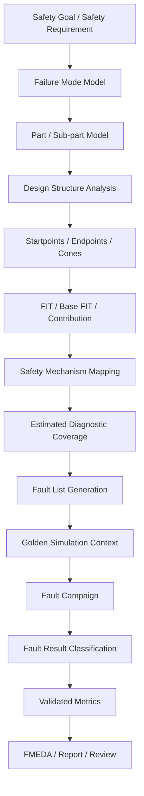
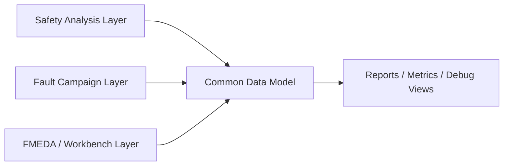
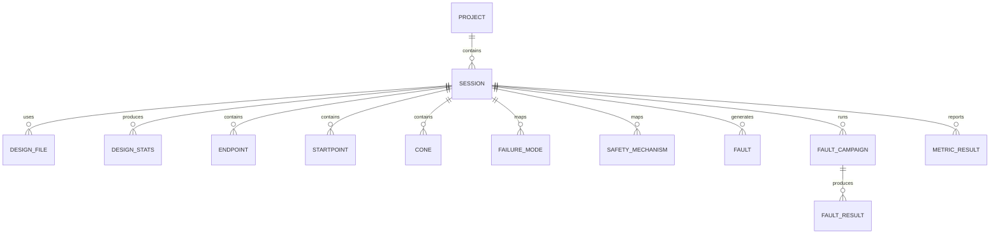
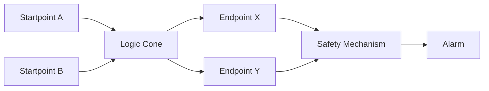
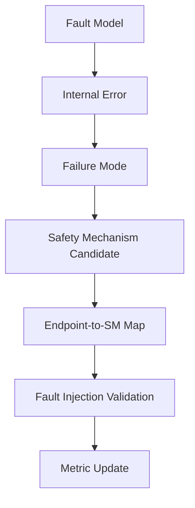
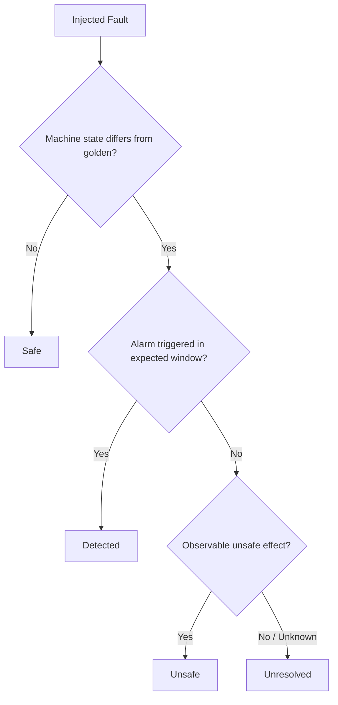
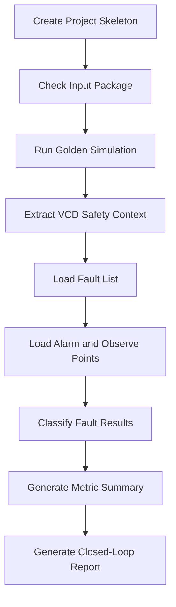

# [Automotive Safe-IC Practice 01] What Are We Actually Verifying in Automotive Chip Functional Safety?

**Author**: Darren H. Chen  
**Direction**: Automotive Chip Functional Safety Analysis and Fault Injection Practice  
**Demo**: D01_safeic_closed_loop  
**Tags**: Automotive Chip, Functional Safety, Fault Injection, FIT, Diagnostic Coverage, FMEDA, Safe-IC, VCD, Fault Campaign

---

## 1. Purpose of This Article

When engineers first hear about automotive chip functional safety verification, it is easy to confuse it with ordinary functional verification.

Functional verification asks:

> Does the design behave correctly when there is no hardware fault?

Functional safety verification asks a different question:

> If a random hardware fault happens during operation, can the design detect it, tolerate it, mask it, correct it, or move the system toward a safe state before the fault becomes dangerous?

This article introduces the core idea behind an automotive Safe-IC functional safety workflow:

```text
safety analysis
+ safety mechanism modeling
+ fault list generation
+ fault injection campaign
+ result classification
+ metric closure
```

The corresponding demo is:

```text
D01_safeic_closed_loop
```

This first demo is intentionally small. It does not try to implement a full industrial-grade safety verification platform. Instead, it builds a minimal, reviewable closed loop that helps us understand what such a platform is supposed to verify.

---

## 2. Functional Verification vs Functional Safety Verification

Traditional functional verification is mainly concerned with systematic design bugs.

Examples:

```text
- a bus protocol implementation is wrong
- an FSM transition is missing
- an interrupt is not generated under a valid condition
- a register write path has an RTL bug
- a reset sequence does not initialize the design correctly
```

These issues are normally found by simulation, formal verification, lint, CDC/RDC checks, assertions, UVM testbenches, emulation, FPGA prototyping, and software-driven validation.

Functional safety verification focuses on random hardware faults during operation.

Examples:

```text
- a flip-flop bit is flipped by a transient event
- a register bit becomes stuck-at-0 or stuck-at-1
- a memory cell is corrupted
- a logic cone propagates a wrong value
- a bus transfer is corrupted
- a safety alarm path itself fails
- a delay fault causes late or missing behavior
```

The goal is not simply to prove that the clean design works. The goal is to verify whether the design responds properly when the clean design is disturbed by faults.

The relationship can be summarized as follows:

| Verification Type | Primary Concern | Typical Root Cause | Typical Question |
|---|---|---|---|
| Functional verification | Correct design behavior | Systematic design bug | Does the RTL implement the specification? |
| Manufacturing test | Defect screening | Manufacturing defect | Can defective parts be detected before shipment? |
| Functional safety verification | Safe behavior under random hardware faults | In-field permanent or transient fault | Can safety mechanisms detect or control faults during operation? |

Automotive Safe-IC verification is mainly about the third question.

---

## 3. The Core Chain: Fault → Error → Failure → Hazard

A safety workflow begins with a basic causal chain:

```text
fault -> error -> failure -> hazard
```

These terms are often used casually, but they should be separated carefully.

| Term | Meaning in a Chip-Level Workflow |
|---|---|
| Fault | A physical or logical defect/disturbance, such as stuck-at, bit flip, delay fault, or memory corruption |
| Error | The incorrect internal state or signal value caused by the fault |
| Failure | A violation of intended behavior visible at a functional boundary |
| Hazard | A system-level dangerous situation caused by the failure |
| Safety mechanism | A design feature that detects, corrects, masks, reports, or controls the fault/error/failure |

At chip level, we usually cannot directly observe the vehicle-level hazard. What we can analyze and verify is whether faults inside the chip propagate to safety-relevant state, outputs, alarms, or observe points.

The workflow therefore needs a bridge:

```text
low-level fault model
-> internal error propagation
-> endpoint corruption
-> safety mechanism response
-> diagnostic classification
-> safety metric update
```

This bridge is the central subject of the entire article and demo series.

---

## 4. What Are We Actually Verifying?

In a Safe-IC workflow, we are not verifying just one thing. We are verifying a chain of assumptions and evidence.

The key verification targets are:

```text
1. Is the design structure understood?
2. Are safety-relevant endpoints identified?
3. Are failure modes mapped to parts and sub-parts?
4. Are safety mechanisms mapped to the logic they protect?
5. Are FIT and diagnostic coverage assumptions traceable?
6. Are generated fault lists meaningful?
7. Does simulation context represent realistic operation?
8. Do injected faults reach alarms, observe points, or safety outputs?
9. Can fault outcomes be classified consistently?
10. Can the final metrics be updated based on evidence?
```

A practical Safe-IC workflow is therefore not just a simulator. It is a dataflow system that connects structural analysis, reliability modeling, FMEDA, fault injection, and reporting.

---

## 5. The Closed-Loop View

A minimal Safe-IC closed loop looks like this:



The loop is important because early estimates and final evidence are different.

Early in the design cycle, we may estimate:

```text
- expected FIT contribution
- expected diagnostic coverage
- expected safety mechanism impact
```

After implementation and fault injection, we can validate:

```text
- which faults are detected
- which faults are safe
- which faults are unsafe
- which faults are unresolved
- which safety mechanisms actually trigger under simulation context
```

A good methodology must keep these two phases connected but not confused.

---

## 6. Three Functional Layers of a Safe-IC Platform

A practical tool architecture can be viewed as three layers.



### 6.1 Safety Analysis Layer

The safety analysis layer answers:

```text
How vulnerable is the design before and after safety mechanisms?
```

Typical tasks:

```text
- calculate base FIT rate
- read reliability model inputs
- compute permanent and transient FIT
- identify startpoints and endpoints
- build structural cones
- estimate diagnostic coverage
- generate safety exploration reports
- generate fault lists for later validation
```

In the demo series, this layer is represented by generic tools such as:

```text
safeic-bfr
safeic-fitmodel
safeic-structure
safeic-epcont
safeic-dc
safeic-faultgen
```

### 6.2 Fault Campaign Layer

The fault campaign layer answers:

```text
What happens when faults are injected under simulation context?
```

Typical tasks:

```text
- read fault list
- read alarm list
- read observe point list
- read golden simulation trace
- extract safety context from VCD
- inject faults
- propagate faults
- compare golden and faulty behavior
- classify results
- generate fault and alarm reports
```

In the demo series, this layer is represented by generic tools such as:

```text
safeic-vcdctx
safeic-alarmop
safeic-campaign
safeic-classify
safeic-report
```

### 6.3 FMEDA / Workbench Layer

The FMEDA/workbench layer answers:

```text
How do design structure, safety mechanisms, failure modes, fault results, and metrics become reviewable evidence?
```

Typical tasks:

```text
- create project and session
- define parts and sub-parts
- maintain failure mode library
- map safety mechanisms to endpoints
- store fault lists and fault results
- visualize diagnostic coverage and metrics
- support top-down or bottom-up FMEDA review
```

In the demo series, this layer is represented by generic artifacts such as:

```text
safeic.sqlite
project.yaml
fmeda_tree.yaml
failure_modes.yaml
safety_mechanisms.yaml
ep_to_sm_map.csv
metric_summary.csv
fault_report.html
```

---

## 7. The Common Data Model

A functional safety workflow becomes difficult to scale if every step uses unrelated spreadsheets and temporary scripts.

A common data model helps preserve traceability.

A simplified database/session model is:



A practical database does not need to be complicated in the first version. For a demo project, a simple SQLite database or a set of JSON/CSV files is enough.

What matters is that the workflow preserves these relationships:

```text
fault result
-> injected node
-> endpoint
-> cone
-> part/sub-part
-> failure mode
-> safety mechanism
-> metric update
```

Without this traceability, fault injection becomes a collection of raw simulation results rather than functional safety evidence.

---

## 8. FIT, BFR, and Diagnostic Coverage

### 8.1 FIT

FIT means Failure In Time.

A common interpretation is:

```text
1 FIT = 1 failure per 1e9 operating hours
```

At chip level, FIT is used to estimate the susceptibility of silicon/package/logic/memory structures to random hardware faults.

FIT can be separated conceptually into:

```text
permanent FIT
transient FIT
package-related FIT
technology-related FIT
memory-related FIT
logic-related FIT
```

Different reliability models may use different input assumptions, but the engineering purpose is similar:

```text
estimate how often random hardware faults may occur
```

### 8.2 BFR

BFR means Base FIT Rate.

It is normally computed before safety mechanisms are inserted or before their effect is credited.

The purpose of BFR is to establish a baseline:

```text
How vulnerable is the design before diagnostic coverage is credited?
```

Once the baseline exists, we can ask:

```text
How much improvement is needed?
Which parts dominate FIT?
Which endpoints contribute most?
Which safety mechanisms are worth adding?
```

### 8.3 Diagnostic Coverage

Diagnostic Coverage measures how effectively safety mechanisms detect relevant faults.

At a simplified level:

```text
DC = detected faults / relevant faults
```

But in a real chip-level analysis, this is not merely a raw count. Faults may have different FIT weights, different structural locations, different failure modes, and different safety impacts.

A more useful conceptual form is:

```text
weighted DC = detected weighted fault contribution / total weighted fault contribution
```

Therefore, diagnostic coverage should be tied to:

```text
- endpoint contribution
- startpoint propagation
- cone structure
- safety mechanism scope
- alarm behavior
- simulation context
```

---

## 9. Structural Model: Startpoint, Endpoint, and Cone

A structural model converts RTL/netlist into safety analysis objects.

The most important concepts are:

| Concept | Meaning |
|---|---|
| Startpoint | A location where a fault may originate or be modeled |
| Endpoint | A safety-relevant state element or output where fault impact is observed |
| Cone | Logic between startpoints and endpoints |
| Safety mechanism scope | The part of the structure protected by a safety mechanism |

A simplified diagram:



This structure helps answer:

```text
Where can a fault start?
Where can it propagate?
Which endpoint can be corrupted?
Which safety mechanism covers it?
Will an alarm be raised?
```

This is the basis for later demos such as:

```text
D06_sp_ep_cone_extract
D07_ep_contribution
D08_dc_engine
D11_ep_to_sm_map
```

---

## 10. Failure Mode and Safety Mechanism Mapping

A fault model describes how hardware is disturbed.

A failure mode describes how intended behavior can fail.

A safety mechanism describes how the design detects, corrects, masks, or controls that failure mode.

For example:

```text
Fault:
  register bit flip

Error:
  corrupted internal state

Failure mode:
  wrong control decision

Safety mechanism:
  FSM transition checker or duplicated control logic

Alarm:
  control_integrity_alarm
```

Another example:

```text
Fault:
  memory cell bit flip

Error:
  corrupted stored data

Failure mode:
  stored data corruption

Safety mechanism:
  memory ECC or parity

Alarm:
  memory_ecc_error
```

A good Safe-IC workflow separates these layers:



This separation is important because a single failure mode may be caused by many fault models, and a single safety mechanism may cover multiple failure modes.

---

## 11. Fault Campaign Inputs

A fault campaign is the validation stage of the workflow.

The minimal inputs are:

| Input | Purpose |
|---|---|
| Design files | Define the RTL/netlist under analysis |
| Fault list | Defines which faults are injected |
| Golden simulation context | Defines fault-free behavior |
| VCD or equivalent trace | Provides signal activity and state context |
| Alarm list | Defines diagnostic signals |
| Observe points | Defines signals used to judge propagation and impact |
| Safety mechanism map | Defines expected protection coverage |
| Campaign configuration | Defines runtime, batching, sampling, and output settings |

A conceptual fault campaign input package:

```text
inputs/
  rtl/
  filelist.f
  clocks.clk
  sim.vcd
  fault.list
  alarm.list
  observe_points.list
  safety_mechanisms.yaml
  ep_to_sm_map.csv
```

The key idea is that fault injection is not just random bit flipping. It must be tied to safety intent and simulation context.

---

## 12. Golden Safety Context

The golden simulation represents the reference behavior of the design without injected faults.

A VCD file or equivalent simulation trace provides:

```text
- clock activity
- reset behavior
- state element values
- input stimulus activity
- output behavior
- alarm signal baseline
- observe point baseline
```

The fault campaign compares faulty behavior against this golden context.

This is why the quality of the golden simulation matters. If the VCD does not exercise relevant behavior, many faults may appear safe or unresolved simply because the simulation did not activate the right paths.

The VCD is therefore not just a waveform file. It is the safety context for fault propagation and classification.

---

## 13. Fault Outcomes

A useful fault campaign should classify results consistently.

The four primary categories are:

| Outcome | Meaning |
|---|---|
| Detected | The fault causes a difference from golden behavior and a safety alarm is triggered |
| Safe | The fault does not cause a relevant difference, or the error is masked before safety impact |
| Unsafe | The fault causes an unsafe or relevant difference without proper alarm response |
| Unresolved | The tool cannot confidently classify the fault because of missing context, unknown propagation, black boxes, X states, or insufficient observation |

A simplified classification flow:



These categories are not merely report labels. They directly affect diagnostic coverage and final metric validation.

---

## 14. From Estimated Metrics to Validated Metrics

Early safety analysis can estimate the effect of safety mechanisms.

For example:

```text
endpoint X is covered by parity
estimated DC = 90%
```

Fault injection can validate whether this assumption holds under simulation context:

```text
faults injected into endpoint X
-> alarm triggered for some faults
-> some faults masked
-> some faults unsafe
-> some faults unresolved
```

The final metric should be based on evidence:

```text
estimated DC
+ fault campaign results
+ unresolved analysis
+ safety mechanism review
= validated metric
```

A practical flow:


This feedback loop is what turns analysis into validation.

---

## 15. D01 Demo: `D01_safeic_closed_loop`

The first demo builds the smallest possible closed loop.

It uses a tiny design such as a counter, timer, or toy control block.

The purpose is not realism. The purpose is clarity.

### 15.1 Demo Goal

The demo answers:

```text
Can we build a minimal Safe-IC workflow that connects:
design -> VCD -> fault list -> alarm list -> fault result -> metric summary?
```

### 15.2 Demo Scope

The demo includes:

```text
- a small RTL design
- a simple safety alarm signal
- a golden simulation trace
- a small hand-written fault list
- a simple alarm list
- a simple observe point list
- a mock or simplified fault result file
- a classification script
- a metric summary report
```

### 15.3 Demo Directory

```text
D01_safeic_closed_loop/
  README.md
  run_demo.sh
  run_demo.csh

  inputs/
    rtl/
      toy_counter.sv
      tb_toy_counter.sv
    filelist.f
    clocks.clk
    fault.list
    alarm.list
    observe_points.list
    sim.vcd
    project.yaml

  outputs/
    input_check.rpt
    fault_result.csv
    metric_summary.csv
    fault_report.md
    closed_loop_summary.md

  tools/
    safeic-init/
    safeic-inputcheck/
    safeic-classify/
    safeic-report/
```

### 15.4 Demo Flow



The first version may use simplified or mock fault result data. Later demos replace this with real fault campaign execution.

---

## 16. Generic Tool Roles in D01

D01 uses only generic tool names.

### 16.1 `safeic-init`

Creates the project skeleton.

Example:

```bash
safeic-init \
  --project toy_counter_safeic \
  --top toy_counter \
  --demo D01_safeic_closed_loop
```

Expected output:

```text
project.yaml
inputs/
outputs/
logs/
reports/
```

### 16.2 `safeic-inputcheck`

Checks whether the required files exist and whether the project manifest is consistent.

Example:

```bash
safeic-inputcheck \
  --manifest project.yaml \
  --output outputs/input_check.rpt
```

It checks:

```text
- RTL filelist exists
- clock definition exists
- VCD exists
- fault list exists
- alarm list exists
- observe point list exists
- output directory is writable
```

### 16.3 `safeic-classify`

Classifies simplified fault results.

Example:

```bash
safeic-classify \
  --golden inputs/sim.vcd \
  --faults inputs/fault.list \
  --alarms inputs/alarm.list \
  --observe-points inputs/observe_points.list \
  --output outputs/fault_result.csv
```

### 16.4 `safeic-report`

Generates summary reports.

Example:

```bash
safeic-report \
  --fault-result outputs/fault_result.csv \
  --output outputs/closed_loop_summary.md
```

The tools are intentionally simple in D01. The value is in the dataflow.

---

## 17. Example Fault List

A minimal fault list can look like:

```text
# fault_id, location, fault_model, injection_time
F001, toy_counter.count[0], stuck_at_0, 120ns
F002, toy_counter.count[1], stuck_at_1, 160ns
F003, toy_counter.state[0], transient_flip, 200ns
F004, toy_counter.alarm_o, stuck_at_0, 240ns
```

This is enough to demonstrate the categories:

```text
- a fault that triggers an alarm
- a fault that is masked
- a fault that causes wrong behavior without alarm
- a fault affecting the alarm path itself
```

D01 does not need thousands of faults. It needs interpretable faults.

---

## 18. Example Alarm List

```text
# alarm_name, signal_path, active_value
counter_error_alarm, toy_counter.alarm_o, 1
```

Alarm lists are important because diagnostic coverage is credited only when the safety mechanism actually reports the fault.

A signal difference without alarm may be unsafe.

An alarm without meaningful fault propagation may be a false or irrelevant alarm.

The workflow must be able to distinguish these cases.

---

## 19. Example Observe Points

```text
# observe_name, signal_path
counter_value, toy_counter.count
counter_done,  toy_counter.done_o
counter_alarm, toy_counter.alarm_o
```

Observe points are used to compare golden and faulty behavior.

They help determine whether a fault affected relevant behavior.

For example:

```text
fault injected
-> internal signal changes
-> observe point does not change
-> fault may be safe or masked

fault injected
-> observe point changes
-> alarm fires
-> detected

fault injected
-> observe point changes
-> alarm does not fire
-> unsafe or unresolved
```

---

## 20. Example Output: `fault_result.csv`

```csv
fault_id,location,model,outcome,alarm_triggered,observe_diff,comment
F001,toy_counter.count[0],stuck_at_0,detected,yes,yes,alarm fired after counter mismatch
F002,toy_counter.count[1],stuck_at_1,safe,no,no,fault masked in current simulation window
F003,toy_counter.state[0],transient_flip,unsafe,no,yes,state diverged without alarm
F004,toy_counter.alarm_o,stuck_at_0,unresolved,no,unknown,alarm path fault requires additional analysis
```

This output is intentionally small but already contains the key semantics.

---

## 21. Example Output: `metric_summary.csv`

```csv
total_faults,detected,safe,unsafe,unresolved,detected_ratio,safe_ratio,unsafe_ratio,unresolved_ratio
4,1,1,1,1,0.25,0.25,0.25,0.25
```

D01 does not claim certification-grade diagnostic coverage. It only demonstrates how a metric summary is derived from classified fault outcomes.

Later demos add:

```text
- FIT weighting
- endpoint contribution
- fault collapsing
- VCD activity windows
- safety mechanism mapping
- FMEDA back-annotation
```

---

## 22. Methodology Principles

### 22.1 Keep Analysis and Validation Separate

Early analysis estimates vulnerability and coverage.

Fault injection validates behavior under context.

Do not treat an estimated safety mechanism coverage as final evidence before validation.

### 22.2 Keep Data Artifacts Reviewable

Each artifact should be readable:

```text
fault.list
alarm.list
observe_points.list
failure_modes.yaml
safety_mechanisms.yaml
ep_to_sm_map.csv
metric_summary.csv
fault_report.md
```

Human review is part of engineering quality.

### 22.3 Keep the Flow Reproducible

Every demo should have:

```text
run_demo.sh
run_demo.csh
README.md
expected outputs
clear inputs
versioned scripts
```

A safety workflow that cannot be reproduced cannot produce reliable evidence.

### 22.4 Keep the Tool Flow Modular

Each tool should have a small purpose:

```text
initialize project
check inputs
extract structure
compute FIT
generate fault list
extract VCD context
classify results
generate reports
```

A modular flow makes it easier to debug, explain, test, and map to soft copyright or patentable engineering components.

### 22.5 Keep Public Demo and Industrial Flow Separated

The public demo should use:

```text
- toy RTL
- open-source RTL
- public documentation
- simplified metrics
- generic tool names
```

It should not publish:

```text
- proprietary tool commands
- proprietary report formats
- non-public design data
- private customer designs
- internal license paths or logs
```

---

## 23. How This Article Connects to Later Work

This first article establishes the system view.

Later articles will deepen each part:

```text
D02_input_package
  -> define a complete input package

D03_base_fit_rate
  -> compute the initial FIT baseline

D06_sp_ep_cone_extract
  -> build the structural graph

D08_dc_engine
  -> compute diagnostic coverage

D10_failure_mode_library
  -> normalize failure semantics

D15_fault_list_generator
  -> generate fault lists

D17_vcd_context
  -> extract safety context from VCD

D19_fault_campaign_runner
  -> manage fault campaigns

D20_fault_classifier
  -> classify detected/safe/unsafe/unresolved results

D24_commercial_benchmark
  -> compare the workflow against commercial-style capabilities
```

The first demo is therefore the seed of the entire practice series.

---

## 24. Summary

Automotive chip functional safety verification is not just about running more simulations.

It is about building a traceable evidence chain:

```text
safety goal
-> failure mode
-> design structure
-> FIT contribution
-> safety mechanism
-> diagnostic coverage estimate
-> fault list
-> simulation context
-> fault injection
-> fault outcome
-> validated metric
-> FMEDA/report
```

The key idea is:

> Functional verification proves that the design works when no fault is present. Functional safety verification checks whether the design remains safe, or becomes diagnosable, when random hardware faults occur.

The demo:

```text
D01_safeic_closed_loop
```

creates the smallest version of that closed loop.

It is deliberately simple, but it introduces the most important architecture of a Safe-IC workflow:

```text
analysis artifacts
+ simulation context
+ fault campaign data
+ classification rules
+ metric reports
```

This is the foundation for all later articles and demos in the Automotive Safe-IC Practice series.

---

## 25. Demo Checklist

For `D01_safeic_closed_loop`, the expected deliverables are:

```text
[ ] README.md
[ ] run_demo.sh
[ ] run_demo.csh
[ ] inputs/rtl/toy_counter.sv
[ ] inputs/rtl/tb_toy_counter.sv
[ ] inputs/filelist.f
[ ] inputs/clocks.clk
[ ] inputs/fault.list
[ ] inputs/alarm.list
[ ] inputs/observe_points.list
[ ] inputs/sim.vcd
[ ] inputs/project.yaml
[ ] outputs/input_check.rpt
[ ] outputs/fault_result.csv
[ ] outputs/metric_summary.csv
[ ] outputs/closed_loop_summary.md
```

A successful D01 demo should answer:

```text
What files are needed?
What is the golden context?
Which faults are injected?
Which alarms are expected?
Which observe points are compared?
Which faults are detected?
Which faults are safe?
Which faults are unsafe?
Which faults are unresolved?
How is the summary report generated?
```

If the demo can answer these questions, the Safe-IC workflow has a minimal but meaningful foundation.
