# [Automotive Safe-IC Practice 01] What Are We Actually Verifying in Automotive Chip Functional Safety?

**Author**: Darren H. Chen  
**Direction**: Automotive Chip Functional Safety Analysis and Fault Injection Practice  
**Demo**: D01_safeic_closed_loop  
**Tags**: Automotive Chip, Functional Safety, ISO 26262, FIT, Diagnostic Coverage, FMEDA, Fault Injection, Fault Campaign, VCD, Safety Mechanism

---

## 1. The Core Question

When we say an automotive chip has been verified for functional safety, what has actually been verified?

A simple answer is:

> The safety mechanisms can detect faults.

But this answer is not sufficient.

A realistic automotive chip safety workflow must answer a chain of questions:

```text
What can fail?
Where can it fail?
How likely is the failure?
Can the failure propagate to a safety-relevant state?
Can a safety mechanism detect, correct, mask, or control it?
Under which operating context is that conclusion valid?
How much residual risk remains?
Can the result be traced back to FMEDA and safety metrics?
```

The first demo in this repository is:

```text
D01_safeic_closed_loop
```

It builds a minimal closed-loop example for functional safety analysis and fault injection.

The goal is not to build a certifiable industrial safety verification solution in one demo. The goal is to make the safety verification loop visible, inspectable, and repeatable.

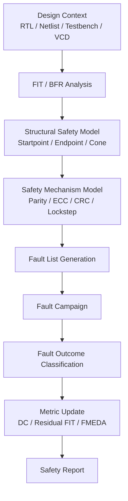

**Figure 1. Safe-IC functional safety verification is a closed-loop evidence process, not a single simulation command.**

The most important idea is:

> Functional safety verification is the process of building evidence that random hardware faults are either detected, corrected, masked, converted into safe behavior, or explicitly left as residual risk.

---

## 2. Functional Verification Is Not Functional Safety Verification

Traditional functional verification asks:

```text
Does the design implement the intended behavior correctly?
```

Functional safety verification asks:

```text
If random hardware faults occur during operation, does the system remain acceptably safe?
```

These are related but not identical.

A design may pass functional verification and still be weak against random hardware faults. A counter, bus controller, CPU core, memory subsystem, or safety monitor can behave correctly under normal simulation, but still fail dangerously when a register bit flips, a memory bit corrupts, an alarm path is blocked, or a control signal is stuck.

A practical distinction is:

| Verification Dimension | Primary Question | Typical Method |
|---|---|---|
| Functional verification | Does the design behave correctly without injected faults? | Simulation, UVM, formal, emulation, regression |
| Manufacturing test | Can manufacturing defects be detected before shipment? | Scan, ATPG, BIST, structural test |
| Functional safety analysis | What is the random hardware failure risk? | FIT, DC, FMEDA, structural analysis |
| Functional safety validation | Do safety mechanisms work under fault conditions? | Fault injection, fault campaign, classification |

Functional safety does not replace functional verification. It extends it.

A good safety workflow reuses the functional verification environment whenever possible, because safety evidence must be collected under meaningful operating scenarios.

---

## 3. Systematic Faults vs Random Hardware Faults

A systematic fault is introduced by a deterministic cause, such as:

```text
wrong requirement
wrong RTL implementation
wrong integration
wrong reset handling
wrong clock-domain assumption
incorrect verification constraint
incorrect software behavior
```

These faults are primarily controlled by engineering process:

```text
specification review
design review
functional verification
traceability
coding guidelines
tool qualification
lint / CDC / RDC / formal checks
regression methodology
```

A random hardware fault is different. It may occur during product lifetime even when the design is correct.

Examples include:

```text
stuck-at behavior
transient bit flip
memory cell upset
delay fault
aging-related degradation
electrical overstress effect
radiation-induced soft error
```

In a safety-oriented chip workflow, random hardware faults must be analyzed and validated because the product is expected to operate in the field for years.

The key mindset is:

```text
functional verification prevents and removes systematic design bugs
functional safety verification detects or controls random hardware failures
```

---

## 4. The Fault-to-Failure Chain

The words **fault**, **error**, **failure**, and **failure mode** should not be mixed.

A practical chip-level interpretation is:

| Term | Meaning |
|---|---|
| Fault | A defect or injected disturbance at hardware level |
| Error | An incorrect internal state or value caused by the fault |
| Failure | A visible violation of intended behavior |
| Failure Mode | A named category describing how the function fails |

Example 1:

```text
Fault:
  A state register bit flips from 0 to 1.

Error:
  The FSM enters an unintended internal state.

Failure:
  A safety-critical output is asserted incorrectly.

Failure Mode:
  wrong_control_decision or illegal_state_transition.
```

Example 2:

```text
Fault:
  A bus data register has a stuck-at-0 fault.

Error:
  A transferred data word becomes corrupted.

Failure:
  The receiver consumes incorrect data.

Failure Mode:
  corrupted_data_transfer.
```

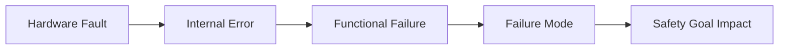

**Figure 2. A hardware fault becomes safety-relevant only if it propagates into a meaningful error, failure, and failure mode.**

A safety mechanism is inserted into this chain.

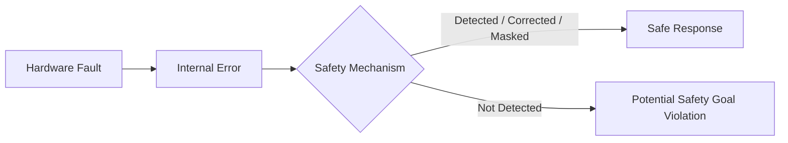

**Figure 3. A safety mechanism is useful only when it breaks or controls the fault-to-failure chain.**

This is why fault injection is important. It validates whether the safety mechanism actually breaks the chain under a real or representative operating context.

---

## 5. FIT: How Likely Is Random Hardware Failure?

FIT means **Failure In Time**.

A common interpretation is:

```text
1 FIT = 1 failure per 1,000,000,000 hours
```

In a chip safety workflow, FIT is used to estimate susceptibility to random hardware faults. It can be broken down by:

```text
silicon logic
flip-flops
memory bits
analog or mixed-signal blocks
package contribution
permanent faults
transient faults
module-level contribution
endpoint-level contribution
```

The first useful value is the **Base FIT Rate**, or BFR.

BFR is calculated before additional safety mechanisms are considered. It provides the baseline:

```text
How much random hardware failure exposure exists before protection is considered?
```

A simplified FIT reasoning flow is:

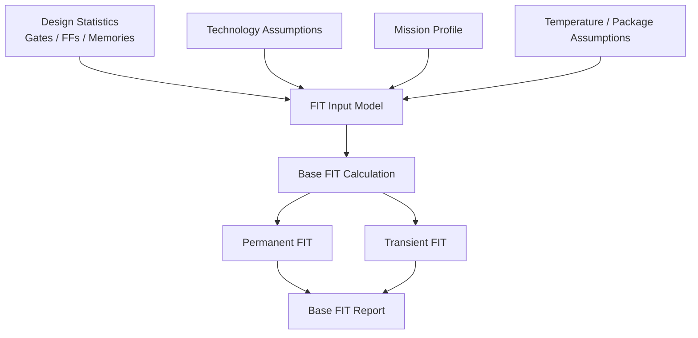

**Figure 4. BFR calculation converts design statistics and reliability assumptions into a baseline random hardware failure estimate.**

For the demo, the generic component is:

```text
safeic-bfr
```

Its output can be:

```text
base_fit_report.csv
base_fit_summary.md
```

A minimal output may look like:

```csv
block,type,permanent_fit,transient_fit,total_fit
toy_counter,logic,0.02,0.01,0.03
toy_counter,ff,0.05,0.08,0.13
toy_counter,package,0.01,0.00,0.01
```

The exact numbers in the demo are simplified assumptions. The important concept is that safety analysis starts with a quantified baseline.

---

## 6. Diagnostic Coverage: How Much Is Detected or Controlled?

Diagnostic Coverage, or DC, measures the effectiveness of safety mechanisms.

A simplified engineering view is:

```text
DC = detected_or_controlled_relevant_faults / total_relevant_faults
```

But this simple expression hides important details.

Diagnostic coverage depends on:

```text
where the safety mechanism is inserted
what fault type is considered
which endpoint is protected
whether the cone or path is covered
whether the alarm path is modeled
whether the operating scenario activates the fault effect
whether the fault campaign validates the claim
```

A useful simplified residual-risk model is:

```text
residual_contribution = original_contribution × (1 - diagnostic_coverage)
```

This does not replace full standard-compliant metric calculation, but it helps explain why FIT and DC must be considered together.

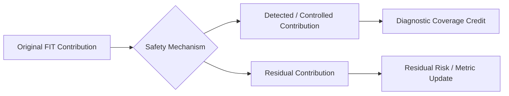

**Figure 5. Diagnostic coverage separates detected or controlled contribution from residual contribution.**

A design with high FIT and high DC may be acceptable depending on system-level allocation. A design with low FIT but almost no DC may still be problematic if its faults directly violate a safety goal.

---

## 7. Structural Safety Model: Startpoint, Endpoint, and Cone

A chip is not a flat list of faults. Faults propagate through structure.

Three structural concepts are useful:

```text
Startpoint
Endpoint
Cone
```

A **startpoint** is where a fault may originate or begin propagating.

An **endpoint** is where a propagated error is observed or becomes safety-relevant.

A **cone** is the logic region connecting startpoints to endpoints.

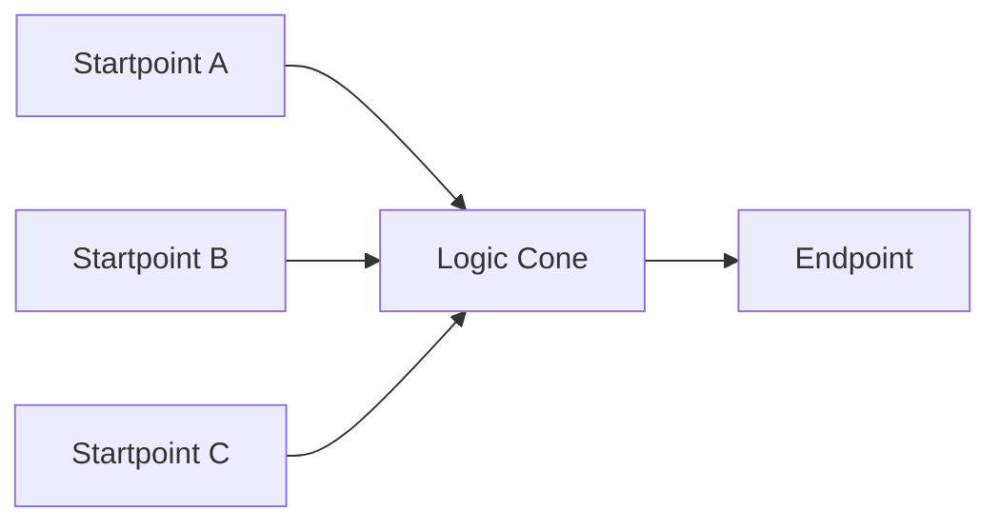

**Figure 6. SP/EP/Cone modeling turns a netlist or RTL design into a safety-relevant propagation graph.**

Why does this matter?

Because different safety mechanisms cover different scopes:

| Safety Mechanism | Typical Coverage Scope |
|---|---|
| Endpoint parity | Endpoint state |
| Endpoint ECC | Endpoint or memory-like state |
| Cone duplication | Logic cone and endpoint |
| End-to-end CRC | Transaction path |
| Protocol checker | Temporal behavior |
| Memory ECC | Stored memory contents |
| Alarm monitor | Diagnostic reporting path |

A local endpoint parity mechanism does not necessarily cover the entire upstream cone. A CRC on a bus path does not necessarily cover an unrelated control FSM. Lockstep may detect many CPU internal mismatches, but it still depends on comparator, alarm, reset, and response paths.

The demo component is:

```text
safeic-structure
```

It generates:

```text
structure_graph.json
sp.csv
ep.csv
cone.csv
```

A simplified structure object:

```json
{
  "endpoints": [
    {
      "name": "top.u_ctrl.state_reg[2]",
      "type": "fsm_state",
      "fanin_cone_size": 143,
      "fanout": 18
    }
  ],
  "startpoints": [
    {
      "name": "top.u_bus.wdata_reg[0]",
      "type": "register"
    }
  ],
  "cones": [
    {
      "endpoint": "top.u_ctrl.state_reg[2]",
      "startpoints": [
        "top.u_bus.wdata_reg[0]",
        "top.u_cfg.mode_reg[1]"
      ]
    }
  ]
}
```

The structural model is the bridge between raw RTL/netlist and safety reasoning.

---

## 8. Failure Mode: The Semantic Layer Above Structure

Structure tells us where a fault can propagate. It does not tell us what the propagated error means.

For example:

```text
top.timer.count_reg[7:0]
top.safety_ctrl.safe_mode_en
```

Both may be endpoints. But their failure meanings are different.

A timer count corruption may map to:

```text
wrong_timeout_decision
```

A corrupted safe mode enable may map to:

```text
loss_of_safe_state_control
```

A failure mode library adds semantic meaning:

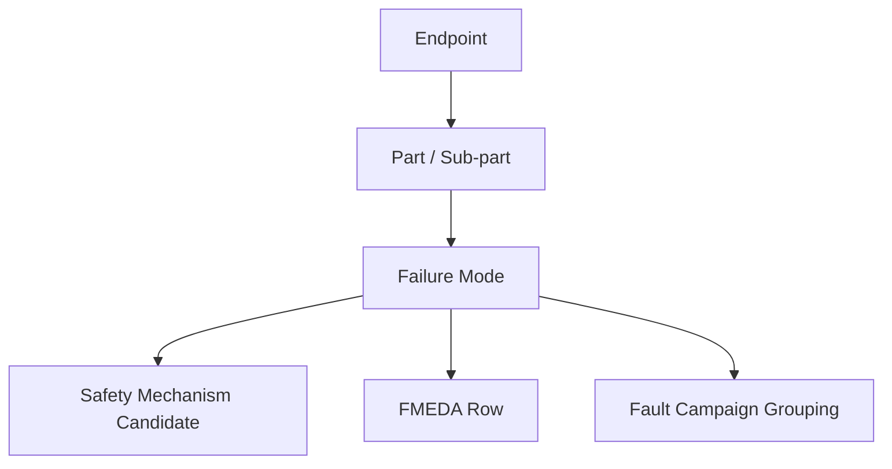

**Figure 7. Failure modes connect hardware structure to safety intent and FMEDA reporting.**

A simplified failure mode entry:

```yaml
id: FM_DATA_CORRUPTION
name: data_corruption
category: data_integrity
description: A data value becomes corrupted before being used or transferred.
applicable_to:
  - datapath
  - bus
  - register_group
recommended_mechanisms:
  - endpoint_parity
  - end_to_end_crc
  - duplication
review_status: draft
```

The first demo keeps this simple, but the closed-loop model already reserves a place for failure semantics.

---

## 9. Safety Mechanism Model

A safety mechanism is a technical measure that detects, corrects, masks, or controls a fault effect.

Examples:

```text
parity
ECC
CRC
duplication
lockstep
triplication
BIST
watchdog
timeout monitor
range checker
protocol checker
alert monitor
```

A safety mechanism should be modeled by at least:

```text
coverage scope
applicable endpoint type
failure modes addressed
expected detection or correction behavior
alarm or response signal
assumed coverage
validation status
```

A simple safety mechanism library:

```yaml
mechanisms:
  endpoint_parity:
    type: endpoint
    suitable_for:
      - scalar_ff
      - register_group
    coverage_scope:
      ep: 0.90
      cone: 0.00
      path: 0.00
    detects:
      - single_bit_error
    corrects: false

  memory_ecc:
    type: memory
    suitable_for:
      - memory
      - register_file
    coverage_scope:
      ep: 0.99
      memory: 0.99
    detects:
      - single_bit_error
      - some_multi_bit_error
    corrects: true

  end_to_end_crc:
    type: path
    suitable_for:
      - bus
      - datapath
      - interface
    coverage_scope:
      path: 0.95
    detects:
      - data_corruption
      - transaction_corruption
    corrects: false
```

The key principle is:

> Diagnostic coverage is not a property of a mechanism name alone. It is a property of a mechanism applied to a specific structure under explicit assumptions.

For the demo, the related components are:

```text
safeic-dc
safeic-smselect
```

`safeic-dc` computes coverage based on mapping.

`safeic-smselect` can recommend candidate safety mechanisms based on endpoint type, contribution, failure mode, and target policy.

---

## 10. Fault List: The Bridge Between Analysis and Validation

A fault list converts safety analysis into validation work.

It answers:

```text
Which nodes should be disturbed?
What type of fault should be injected?
What fault mode is used?
Which time window or condition is relevant?
```

Examples:

```text
top.u_ctrl.state_reg[2] stuck_at_0
top.u_ctrl.state_reg[2] stuck_at_1
top.u_ram.mem[15][3] transient_flip
top.u_bus.wdata_reg[7] transient_flip
top.u_alarm.path_en stuck_at_0
```

A fault list can be generated from:

```text
endpoint contribution
startpoint usage
cone analysis
failure mode mapping
safety mechanism scope
manual safety-critical node selection
```

The generic demo component is:

```text
safeic-faultgen
```

A good fault list is not simply “all possible nodes.” It should be traceable:

```text
fault node
→ endpoint or startpoint
→ part/sub-part
→ failure mode
→ safety mechanism
→ expected alarm or observe point
```

This traceability is what allows the results to be useful for FMEDA and report generation.

---

## 11. VCD Safety Context

A VCD file is often treated as a waveform file. In a fault campaign, it is more than that.

It is a **safety context**.

It provides:

```text
golden signal values
active time windows
state element activity
clock and reset behavior
operating scenario
reference behavior for comparison
```

The same fault may produce different outcomes under different contexts.

Example:

```text
Fault on memory bit:
  If the memory location is never read, no effect is observed.
  If the memory is read but protected by ECC, an alarm may fire.
  If the memory is read and no protection exists, unsafe data may propagate.
```

Example:

```text
Fault on bus data bit:
  If no transaction occurs, the fault may be irrelevant.
  If a transaction occurs and CRC is checked, it may be detected.
  If the receiver consumes corrupted data without checking, it may be unsafe.
```

The generic component is:

```text
safeic-vcdctx
```

It extracts:

```text
vcd_context.json
signal_activity.csv
state_window.json
```

A simplified safety context:

```json
{
  "clock": "clk",
  "reset_release_time": 20,
  "active_windows": [
    {
      "start": 30,
      "end": 120,
      "mode": "counter_enabled"
    }
  ],
  "observed_signals": [
    "toy_counter.count",
    "toy_counter.count_parity",
    "toy_counter.alarm"
  ]
}
```

Fault injection without meaningful context can produce misleading evidence.

---

## 12. Fault Campaign and Outcome Classification

A fault campaign injects faults and classifies outcomes.

A useful first classification is:

```text
detected
safe
unsafe
unresolved
```

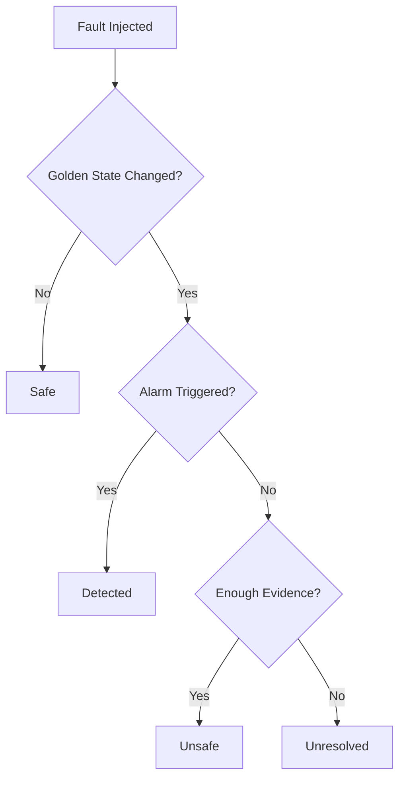

**Figure 8. A fault outcome is classified by comparing golden behavior, alarm behavior, and evidence completeness.**

### 12.1 Detected

A fault is detected when:

```text
the machine state or relevant observation differs from golden behavior
and
a defined alarm or diagnostic signal is triggered
```

Detected faults usually provide diagnostic coverage credit.

### 12.2 Safe

A fault is safe when it does not cause a safety-relevant deviation.

Examples:

```text
the fault is overwritten
the fault is not activated
the fault is logically masked
the affected signal is unused in this context
the observed state remains equivalent to golden behavior
```

### 12.3 Unsafe

A fault is unsafe when:

```text
the fault causes a relevant deviation
and
no safety mechanism detects or controls it
```

Unsafe results are design improvement targets.

### 12.4 Unresolved

A fault is unresolved when classification cannot be completed.

Common reasons:

```text
missing VCD signal
missing observe point
black-box boundary
incomplete alarm list
unknown X propagation
insufficient simulation duration
unsupported construct
missing RTL-to-gate name mapping
```

Unresolved is not automatically unsafe, but it is not safety evidence. It is an engineering work item.

---

## 13. Alarm List and Observe Points

A fault campaign needs to know how detection and propagation are observed.

An **alarm list** defines diagnostic outputs:

```text
toy_counter.alarm
top.u_mem.ecc_error
top.u_bus.integrity_error
top.u_core.major_alert
```

An **observe point list** defines relevant states and outputs:

```text
toy_counter.count
toy_counter.count_parity
toy_counter.alarm
top.u_bus.rdata
top.u_ctrl.safe_state
```

The distinction matters:

| Concept | Meaning |
|---|---|
| Alarm | A safety mechanism reports a fault or diagnostic event |
| Observe point | A signal used to determine whether the fault changed relevant behavior |
| Golden context | Reference behavior from non-fault simulation |
| Faulted context | Behavior after injection |

A detected fault usually needs alarm evidence. A safe or unsafe classification often needs observe-point evidence.

---

## 14. Metric Update and Reporting

Raw fault campaign results are not enough.

A report should connect outcomes to safety metrics:

```text
fault outcome
+ endpoint contribution
+ safety mechanism mapping
+ failure mode
+ diagnostic coverage
+ residual FIT
```

A useful report answers:

```text
Which faults were detected?
Which faults were safe?
Which faults were unsafe?
Which faults were unresolved?
Which endpoints dominate residual risk?
Which safety mechanisms need improvement?
Which failure modes are weakly covered?
Which input data is missing?
```

A minimal report structure:

```text
1. Project summary
2. Input package summary
3. Base FIT summary
4. Structural model summary
5. Safety mechanism map summary
6. Fault campaign summary
7. Fault outcome distribution
8. Unsafe fault analysis
9. Unresolved fault analysis
10. Metric summary
11. Engineering recommendations
```

The generic component is:

```text
safeic-report
```

This is the final step that turns tool outputs into reviewable engineering evidence.

---

## 15. Data-Centric Tool Architecture

A safety workflow becomes fragile if all information is hidden inside scripts.

A better architecture is data-centric:

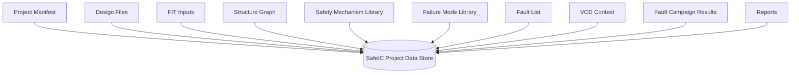

**Figure 9. A data-centric architecture makes safety evidence inspectable, versioned, and reusable.**

For D01, the data store can simply be a directory structure:

```text
D01_safeic_closed_loop/
  manifest.yaml
  inputs/
  intermediate/
  outputs/
  reports/
```

A future implementation may use SQLite or another lightweight database:

```text
project
session
design_file
fit_result
endpoint
startpoint
cone
safety_mechanism
failure_mode
ep_to_sm_map
fault
fault_campaign
fault_result
report
```

The methodology is:

> Every step should produce an artifact that can be inspected, diffed, versioned, and reused.

This matters because safety evidence must be reviewable.

---

## 16. Generic Tool Architecture Used by D01

D01 uses generic tool names to illustrate a modular workflow.

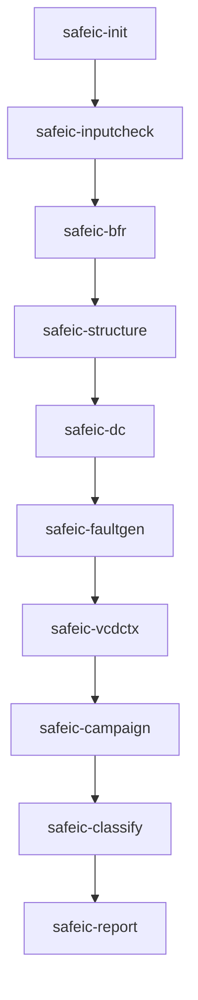

**Figure 10. The D01 demo is organized as a sequence of small, reviewable transformations.**

Each component has a narrow responsibility:

| Component | Responsibility |
|---|---|
| `safeic-init` | Create the project skeleton and manifest |
| `safeic-inputcheck` | Validate design, VCD, fault, alarm, and configuration inputs |
| `safeic-bfr` | Estimate base FIT before safety mechanism impact |
| `safeic-structure` | Extract startpoints, endpoints, and cones |
| `safeic-dc` | Estimate diagnostic coverage from safety mechanism mapping |
| `safeic-faultgen` | Generate a small prioritized fault list |
| `safeic-vcdctx` | Extract golden safety context from VCD |
| `safeic-campaign` | Execute or emulate fault campaign steps |
| `safeic-classify` | Classify results as detected, safe, unsafe, or unresolved |
| `safeic-report` | Generate the engineering report |

This architecture is intentionally simple. Its value is clarity.

---

## 17. Evidence Before Automation

A common mistake is to automate too early.

For functional safety practice, the first goal should not be:

```text
one command that runs everything
```

The first goal should be:

```text
a transparent chain of evidence
```

Automation is useful only after the evidence model is clear.

A practical methodology:

```text
1. Define the safety question.
2. Define the design context.
3. Define reliability assumptions.
4. Extract the structural model.
5. Define failure modes and safety mechanisms.
6. Generate fault candidates.
7. Run fault injection under meaningful context.
8. Classify results.
9. Update metrics.
10. Review unsafe and unresolved cases.
```

For each step, ask:

```text
What was the input?
What assumption was made?
What artifact was generated?
What can be reviewed?
What can be repeated?
```

---

## 18. Estimated Coverage vs Measured Coverage

Safety analysis often starts with estimated coverage.

Example assumptions:

```text
endpoint parity covers 90% of endpoint single-bit errors
memory ECC covers 99% of relevant memory bit faults
a protocol checker detects illegal state transitions
a bus CRC detects most transaction corruptions
```

These assumptions are useful for architecture exploration.

But estimated coverage is not the same as measured coverage.

Measured coverage comes from fault injection:

```text
inject faults
run under context
check alarms
compare observe points
classify outcomes
back-annotate results
```

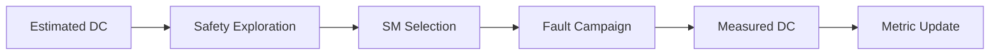

**Figure 11. Estimated coverage guides design exploration; measured coverage comes from fault campaign results.**

A disciplined workflow keeps these concepts separate:

| Coverage Type | Meaning |
|---|---|
| Estimated DC | Claimed or assumed coverage from safety mechanism model |
| Calculated DC | Computed from structure and mapping assumptions |
| Measured DC | Derived from fault campaign outcomes |

D01 introduces this distinction in a minimal way.

---

## 19. Context-Dependent Nature of Fault Campaigns

A fault campaign is only as strong as its context.

Examples:

```text
A bus parity checker appears useless if the bus never transfers data.
A memory ECC alarm never fires if the corrupted memory location is never read.
A timer fault appears safe if timeout behavior is never exercised.
A lockstep mismatch cannot be observed if alert outputs are not monitored.
```

Therefore, fault injection must be tied to:

```text
operating mode
stimulus
time window
safety function
alarm list
observe points
detection window
```

This is why VCD context is central.

A practical VCD safety context includes:

```text
clock activity
reset release
active windows
state element activity
golden values
alarm values
observe point values
```

D01 keeps this small, but the concept scales to realistic IP and SoC verification.

---

## 20. Unresolved Faults Are Engineering Work Items

Unresolved faults are not a nuisance. They often reveal missing evidence.

Typical unresolved reasons:

```text
missing waveform signal
missing observe point
black-box boundary
incomplete alarm list
X propagation
simulation not long enough
unsupported language construct
name mapping mismatch
```

A useful report should classify unresolved faults by reason:

| Unresolved Reason | Engineering Action |
|---|---|
| missing VCD signal | Add signal to waveform dump |
| missing observe point | Add relevant observe point |
| black-box boundary | Add model or assumption |
| insufficient stimulus | Extend test scenario |
| missing alarm mapping | Update alarm list |
| RTL/gate name mismatch | Add mapping file |
| X propagation | Improve reset or X-handling strategy |

This turns a fault campaign into an iterative engineering workflow.

---

## 21. Demo D01: What We Build

D01 builds a small closed-loop prototype around a toy design.

The design can be:

```text
toy_counter
toy_alu
toy_timer
```

The first implementation can use `toy_counter` because it is easy to inspect.

It should contain:

```text
a safety-relevant state
a simple safety mechanism
an alarm output
a golden simulation
a fault list
fault outcomes
a metric summary
an engineering report
```

Suggested directory:

```text
D01_safeic_closed_loop/
  README.md
  run_demo.sh
  run_demo.csh

  inputs/
    rtl/
      toy_counter.v
      toy_counter_tb.v
    filelist.f
    clkdef.clk
    fit_inputs.yaml
    safety_mechanisms.yaml
    failure_modes.yaml
    ep_to_sm_map.csv
    fault.list
    alarm.list
    observe_points.list
    sim.vcd

  intermediate/
    design_stats.json
    structure_graph.json
    vcd_context.json

  outputs/
    input_check.rpt
    base_fit_report.csv
    dc_report.csv
    fault_campaign_raw.csv
    fault_result.csv
    metric_summary.csv
    closed_loop_summary.md

  reports/
    d01_safeic_closed_loop_report.html
```

---

## 22. Demo D01 Flow

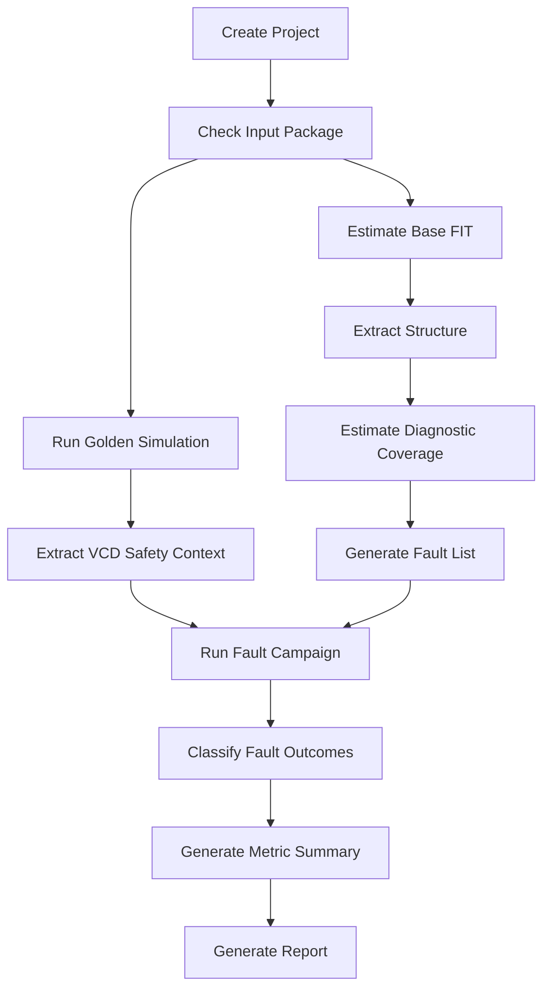

**Figure 12. D01 demo flow: from project setup to fault classification and report generation.**

A simplified shell flow:

```bash
safeic-inputcheck \
  --manifest manifest.yaml \
  --output outputs/input_check.rpt

safeic-bfr \
  --fit-inputs inputs/fit_inputs.yaml \
  --output outputs/base_fit_report.csv

safeic-structure \
  --filelist inputs/filelist.f \
  --top toy_counter \
  --output intermediate/structure_graph.json

safeic-dc \
  --structure intermediate/structure_graph.json \
  --sm-library inputs/safety_mechanisms.yaml \
  --ep-to-sm-map inputs/ep_to_sm_map.csv \
  --output outputs/dc_report.csv

safeic-vcdctx \
  --vcd inputs/sim.vcd \
  --clkdef inputs/clkdef.clk \
  --output intermediate/vcd_context.json

safeic-campaign \
  --fault-list inputs/fault.list \
  --alarm-list inputs/alarm.list \
  --observe-points inputs/observe_points.list \
  --vcd-context intermediate/vcd_context.json \
  --output outputs/fault_campaign_raw.csv

safeic-classify \
  --campaign outputs/fault_campaign_raw.csv \
  --output outputs/fault_result.csv

safeic-report \
  --base-fit outputs/base_fit_report.csv \
  --dc outputs/dc_report.csv \
  --fault-result outputs/fault_result.csv \
  --output reports/d01_safeic_closed_loop_report.html
```

A csh wrapper can also be provided for older EDA-style script environments:

```csh
#!/bin/csh -f

set DEMO = D01_safeic_closed_loop
echo "Running $DEMO"

safeic-inputcheck --manifest manifest.yaml --output outputs/input_check.rpt
safeic-bfr --fit-inputs inputs/fit_inputs.yaml --output outputs/base_fit_report.csv
safeic-structure --filelist inputs/filelist.f --top toy_counter --output intermediate/structure_graph.json
safeic-dc --structure intermediate/structure_graph.json --sm-library inputs/safety_mechanisms.yaml --ep-to-sm-map inputs/ep_to_sm_map.csv --output outputs/dc_report.csv
safeic-vcdctx --vcd inputs/sim.vcd --clkdef inputs/clkdef.clk --output intermediate/vcd_context.json
safeic-campaign --fault-list inputs/fault.list --alarm-list inputs/alarm.list --observe-points inputs/observe_points.list --vcd-context intermediate/vcd_context.json --output outputs/fault_campaign_raw.csv
safeic-classify --campaign outputs/fault_campaign_raw.csv --output outputs/fault_result.csv
safeic-report --base-fit outputs/base_fit_report.csv --dc outputs/dc_report.csv --fault-result outputs/fault_result.csv --output reports/d01_safeic_closed_loop_report.html
```

---

## 23. Example Toy Safety Mechanism

A minimal counter with parity:

```verilog
module toy_counter (
  input  logic clk,
  input  logic rst_n,
  input  logic en,
  output logic [7:0] count,
  output logic count_parity,
  output logic alarm
);

  logic expected_parity;

  always_ff @(posedge clk or negedge rst_n) begin
    if (!rst_n) begin
      count <= 8'h00;
      count_parity <= 1'b0;
    end else if (en) begin
      count <= count + 8'h01;
      count_parity <= ^(count + 8'h01);
    end
  end

  assign expected_parity = ^count;
  assign alarm = (expected_parity != count_parity);

endmodule
```

This is not a complete industrial safety mechanism. It is a teaching example.

It allows us to demonstrate:

```text
fault on count bit
fault on parity bit
fault on alarm path
detected outcome
safe outcome
unsafe outcome
unresolved outcome
```

Example fault list:

```text
toy_counter.count[0] stuck_at_0
toy_counter.count[0] stuck_at_1
toy_counter.count_parity stuck_at_0
toy_counter.alarm stuck_at_0
```

Alarm list:

```text
toy_counter.alarm
```

Observe points:

```text
toy_counter.count
toy_counter.count_parity
toy_counter.alarm
```

---

## 24. Expected D01 Outputs

A successful run should produce reviewable artifacts.

Example `fault_result.csv`:

```csv
fault_id,node,fault_type,outcome,alarm,reason
F001,toy_counter.count[0],stuck_at_0,detected,toy_counter.alarm,alarm_triggered
F002,toy_counter.count[7],stuck_at_1,safe,,no_observed_deviation
F003,toy_counter.alarm,stuck_at_0,unsafe,,alarm_path_blocked
F004,toy_counter.hidden_state,stuck_at_1,unresolved,,missing_vcd_signal
```

Example `metric_summary.csv`:

```csv
metric,value
total_faults,4
detected,1
safe,1
unsafe,1
unresolved,1
measured_detection_ratio,0.25
measured_safe_ratio,0.25
```

The numbers are intentionally simple. The important point is the evidence chain:

```text
input package
→ base FIT
→ structure
→ safety mechanism map
→ fault list
→ VCD context
→ fault outcome
→ metric summary
→ report
```

---

## 25. Engineering Review Questions

After running D01, an engineer should be able to answer:

```text
What is the safety function in the toy design?
Which signals are endpoints?
Which signals are alarms?
Which faults were injected?
What was the golden context?
Which faults were detected?
Which faults were safe?
Which faults were unsafe?
Which faults were unresolved?
Why are some faults unresolved?
What metric changed after classification?
What evidence is ready for review?
```

If a demo cannot answer these questions, it is not yet a safety demo. It is only a simulation demo.

---

## 26. Common Mistakes

### 26.1 Treating a Fault List as the Safety Goal

A fault list is not the safety goal. It is a validation input.

The safety goal comes from system-level risk analysis. The fault list is a way to test whether hardware safety mechanisms protect safety-relevant structures.

### 26.2 Treating an Alarm as Automatic Safety

An alarm firing is not always sufficient.

A complete safety argument also needs:

```text
alarm propagation
alarm handling
reaction timing
safe-state transition
software or system response
```

D01 starts with alarm firing because it is the smallest useful observable.

### 26.3 Treating All Undetected Faults as Equally Dangerous

Some undetected faults are safe because they do not affect relevant behavior. Some are unsafe because they cause a deviation without alarm. Some are unresolved because the evidence is incomplete.

Classification matters.

### 26.4 Ignoring Simulation Context

A fault campaign without meaningful context may overestimate or underestimate safety.

Context should represent a relevant operating scenario.

### 26.5 Mixing Estimated and Measured Diagnostic Coverage

Estimated diagnostic coverage is an architectural assumption.

Measured diagnostic coverage is validation evidence.

They should be compared, not confused.

---

## 27. Summary

Automotive chip functional safety verification is a closed-loop evidence process.

It connects:

```text
FIT estimation
structural safety analysis
failure mode modeling
safety mechanism modeling
fault list generation
simulation context extraction
fault injection
result classification
metric update
engineering reporting
```

The first demo:

```text
D01_safeic_closed_loop
```

makes this loop visible.

The central lesson is:

> A functional safety workflow is not defined by a single command. It is defined by a traceable transformation from design assumptions to measured safety evidence.

D01 uses generic components:

```text
safeic-inputcheck
safeic-bfr
safeic-structure
safeic-dc
safeic-faultgen
safeic-vcdctx
safeic-campaign
safeic-classify
safeic-report
```

Together, they show the complete conceptual path:

```text
Design context
→ FIT baseline
→ structural model
→ safety mechanism model
→ fault campaign
→ outcome classification
→ metric and report evidence
```

This is the foundation for practical, explainable, and reviewable automotive Safe-IC analysis and fault injection demos.

---

## 28. D01 Demo Checklist

For `D01_safeic_closed_loop`, the expected deliverables are:

```text
[ ] README.md
[ ] run_demo.sh
[ ] run_demo.csh
[ ] manifest.yaml
[ ] inputs/rtl/toy_counter.v
[ ] inputs/rtl/toy_counter_tb.v
[ ] inputs/filelist.f
[ ] inputs/clkdef.clk
[ ] inputs/fit_inputs.yaml
[ ] inputs/safety_mechanisms.yaml
[ ] inputs/failure_modes.yaml
[ ] inputs/ep_to_sm_map.csv
[ ] inputs/fault.list
[ ] inputs/alarm.list
[ ] inputs/observe_points.list
[ ] inputs/sim.vcd
[ ] intermediate/design_stats.json
[ ] intermediate/structure_graph.json
[ ] intermediate/vcd_context.json
[ ] outputs/input_check.rpt
[ ] outputs/base_fit_report.csv
[ ] outputs/dc_report.csv
[ ] outputs/fault_campaign_raw.csv
[ ] outputs/fault_result.csv
[ ] outputs/metric_summary.csv
[ ] reports/d01_safeic_closed_loop_report.html
```

A successful run should make the closed loop visible, inspectable, and repeatable.
