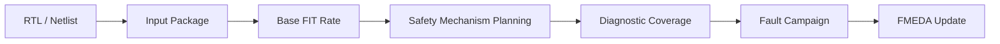
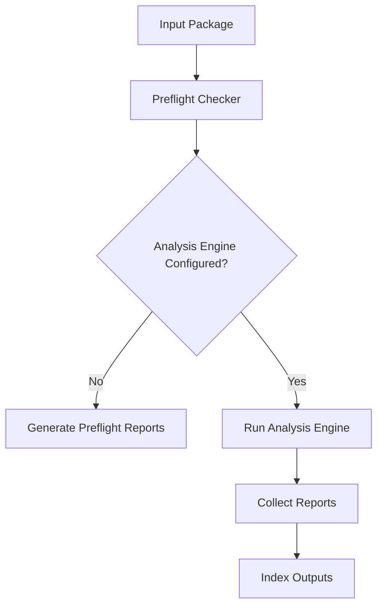
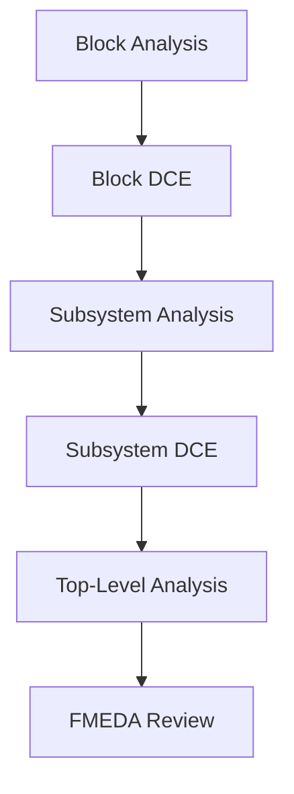
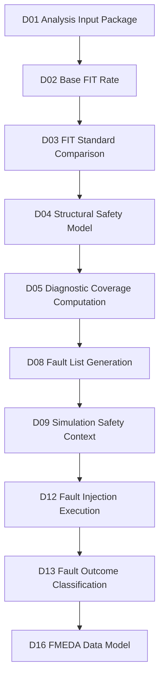

# [Automotive Safe-IC Practice 01] Analysis Input Package: From RTL and FIT Setup to Reproducible Safety Context

**Author**: Darren H. Chen  
**Direction**: Automotive Chip Functional Safety Analysis and Fault Injection Practice  
**Demo**: D01_analysis_input_package  
**Tags**: Automotive Chip, Functional Safety, ISO 26262, FIT, Base FIT Rate, IEC 62380, SN 29500, Diagnostic Coverage, Safety Analysis, Reproducible Flow

---

## 1. Problem Context

Functional safety analysis for automotive chips should not start from a tool command.

It should start from a reproducible analysis context.

Before we calculate FIT rate, estimate diagnostic coverage, generate fault lists, run fault campaigns, or update FMEDA tables, we must first answer a more basic question:

> What exactly is the design, configuration, standard, clock model, FIT setup, and analysis scope that this safety run is based on?

The first demo in this series is:

```text
D01_analysis_input_package
```

The goal of this demo is to build a small but disciplined input package for a safety analysis engine.

The public article and demo use neutral names such as:

```text
analysis_engine
fault_campaign_engine
fmeda_workspace
common_safety_database
```

In a real engineering environment, those names can be mapped to the actual installed tools through configuration.

This keeps the demo clean and portable while still following a practical commercial-tool-style safety flow.

---

## 2. Why the Input Package Is the First Engineering Artifact

In normal RTL verification, engineers often begin with a simulation command:

```text
compile RTL
run testbench
check pass/fail
```

In functional safety analysis, this is not enough.

A safety analysis run is not just a simulation run. It depends on:

```text
design files
top module
clock definitions
reset assumptions
FIT calculation standard
FIT setup files
technology assumptions
mission profile
package assumptions
safety mechanism configuration
output directory
database/session settings
report policy
```

If these inputs are not captured, the result cannot be reviewed or reproduced.

For example, two runs may use the same RTL but different FIT standards:

```text
iec_62380
sn_29500
```

They may generate different report names, different DCE files, and different FIT values.

Another two runs may use the same design but different clock definitions, causing different structural analysis and diagnostic coverage behavior.

Therefore, D01 is intentionally focused on the input package rather than the final metric.

The first engineering principle is:

> A safety result is only meaningful when its input context is explicit, versioned, and reviewable.

---

## 3. Automotive Functional Safety Background

Automotive functional safety work is typically connected to ISO 26262.

At chip level, the analysis usually focuses on random hardware faults, diagnostic coverage, safety mechanisms, and hardware safety metrics.

A simplified view is:

```text
random hardware faults
    -> failure modes
    -> safety mechanisms
    -> diagnostic coverage
    -> residual risk
    -> FMEDA / safety metrics
```

Base FIT Rate analysis establishes the random hardware failure baseline before safety mechanisms are credited.

This is important because safety improvement can only be judged relative to a baseline.

A useful mental model is:

```text
Base FIT Rate:
  How much random hardware failure exposure exists before protection?

Diagnostic Coverage:
  How much of that exposure can be detected, controlled, or made safe?

Residual FIT:
  How much risk remains after credited safety mechanisms?
```

D01 does not yet compute the final safety argument.

It prepares the context that later demos will use.

---

## 4. Base FIT Rate as the Starting Point

FIT means Failure In Time.

A common interpretation is:

```text
1 FIT = 1 failure per 10^9 hours
```

At the chip level, FIT analysis asks:

```text
How susceptible is the silicon/package/design structure to random hardware faults?
```

Base FIT Rate, or BFR, is the initial FIT rate before safety mechanisms are added or credited.

This is why BFR must appear early in the workflow.



**Figure 1. Base FIT Rate provides the risk baseline before safety mechanisms and fault campaigns.**

Without BFR, diagnostic coverage is difficult to interpret.

A 90% diagnostic coverage value does not mean much unless we know what failure-rate contribution it applies to.

---

## 5. FIT Standards: Why the Standard Must Be Explicit

The input package must specify the FIT standard.

For this demo series, the two important standard identifiers are:

```text
iec_62380
sn_29500
```

They should not be hidden in tool defaults.

The selected standard affects:

```text
FIT calculation model
required input data
report naming
DCE file naming
metric interpretation
hierarchical reuse
```

Example configuration:

```ini
fit_standard = iec_62380
```

or:

```ini
fit_standard = sn_29500
```

A robust input package should make this visible in both:

```text
analysis.fusaini
manifest.yaml
```

The second engineering principle is:

> Never rely on an implicit FIT standard. If a run calculates safety metrics, the standard must be part of the run identity.

---

## 6. Design Scope: Top Module, Filelist, and Clock Definition

A minimal safety analysis run needs a design scope.

The basic design scope includes:

```text
top module
RTL or netlist filelist
clock definition file
black-box information if needed
library or technology information if needed
```

In D01, the design is intentionally small:

```text
toy_counter
```

The point is not to create a realistic SoC.

The point is to make the flow inspectable.

Example design files:

```text
inputs/rtl/toy_counter.v
inputs/filelist/filelist.f
inputs/clock/toy_counter.clk
```

Example top module:

```ini
top = toy_counter
```

Example clock definition file:

```text
clk
```

A clock file should be explicit because the analysis engine needs to understand sequential structure.

Even a tiny counter has state.

If the tool does not know the clock, structural analysis and later safety context extraction become unreliable.

---

## 7. Why the Clock File Is a Safety Artifact

A clock definition file may look trivial.

However, it is part of the safety evidence chain.

A design object becomes safety-relevant when it participates in:

```text
state update
fault propagation
alarm generation
diagnostic observation
failure mode activation
```

Clock modeling affects all of these.

A wrong clock definition can cause:

```text
incorrect state classification
incorrect endpoint analysis
wrong sequential boundary
misleading diagnostic coverage
wrong fault campaign setup
```

Therefore, D01 treats the clock file as a first-class artifact.

It is not just a tool option.

It is an assumption about how the design behaves.

---

## 8. FIT Setup File

The FIT setup file captures the reliability-analysis environment.

A production setup may include:

```text
technology data
mission profile
temperature profile
package data
memory definition
library information
transistor count
lambda values
process information
```

The D01 public demo uses a simplified file:

```text
inputs/fit/FIT_inputs.common.txt
```

Example:

```text
PROJECT_NAME = automotive_safeic_practice
TOP_MODULE   = toy_counter
FIT_STANDARD = iec_62380
MISSION_PROFILE = demo_motor_control
ASIL_TARGET = ASIL_B_OR_HIGHER_DEMO_PLACEHOLDER
```

This is not a production FIT setup.

It is a public-safe placeholder that demonstrates where the reliability context belongs.

The third engineering principle is:

> FIT numbers must be traceable to the reliability assumptions used to compute them.

---

## 9. Analysis Initialization File

The analysis initialization file describes how the safety analysis engine should run.

This series uses a neutral file name:

```text
inputs/analysis/analysis_bfr.fusaini
```

Example:

```ini
mode = analysis
top = toy_counter

filelist = inputs/filelist/filelist.f
clkdef = inputs/clock/toy_counter.clk
fit_setup = inputs/fit/FIT_inputs.common.txt

fit_standard = iec_62380
block_level = true
consolidated_report = sparse

write_common_safety_db = false
overwrite_session = true
common_safety_db_name = outputs/toy_counter.fdb::D01_BFR
```

The exact option names may be adapted by a wrapper if the real tool uses different option names.

The public demo should preserve the concept:

```text
mode
top
filelist
clock definition
FIT setup
FIT standard
database/session behavior
output behavior
```

This file is the main bridge between methodology and execution.

---

## 10. Tool Flow Abstraction

D01 abstracts the real command as:

```text
analysis_engine --config inputs/analysis/analysis_bfr.fusaini
```

or:

```text
$SAFEIC_ANALYSIS_ENGINE --fusaini inputs/analysis/analysis_bfr.fusaini
```

The executable path is not hard-coded.

It is configured through the environment:

```csh
setenv SAFEIC_TOOL_HOME /path/to/safety_tool_install
setenv SAFEIC_ANALYSIS_ENGINE /path/to/analysis_engine
```

The public template is:

```text
scripts/setup_toolchain.template.csh
```

The private local file is not committed:

```text
scripts/setup_toolchain.local.csh
```

This separation gives three benefits:

```text
the demo remains publishable
the local run can use the real installed tool
the article remains tool-flow oriented rather than vendor-name oriented
```

---

## 11. D01 Demo Architecture

The D01 demo contains two layers.

### 11.1 Open Preflight Layer

This layer does not require the real tool.

It validates:

```text
required files exist
configuration syntax is parseable
tool path variables are present or warned
FIT standard is explicit
clock file is present
top module is configured
expected output names are known
```

### 11.2 Optional Real Analysis Layer

This layer runs the real analysis engine if configured.

It is controlled by:

```text
SAFEIC_ANALYSIS_ENGINE
```

If the variable is not set, the demo still runs the public preflight and reports warnings.



**Figure 2. D01 separates public preflight from optional real analysis execution.**

This is important for GitHub publication.

A public reader can inspect and run the package without access to a licensed environment.

A local engineer can connect the same package to the real tool.

---

## 12. Input Data Model

D01 input data model:

```text
design:
  top_module
  rtl_files
  filelist
  clock_definition

fit:
  fit_setup
  fit_standard
  mission_profile
  package_context

analysis:
  mode
  output_dir
  database_policy
  report_policy

toolchain:
  analysis_engine_path
  environment
  shell
```

This can be represented in:

```text
manifest.yaml
analysis_bfr.fusaini
FIT_inputs.common.txt
```

Suggested `manifest.yaml`:

```yaml
project:
  name: automotive_safeic_practice
  demo: D01_analysis_input_package
  top_module: toy_counter

inputs:
  rtl_file: inputs/rtl/toy_counter.v
  filelist: inputs/filelist/filelist.f
  clkdef: inputs/clock/toy_counter.clk
  fit_setup: inputs/fit/FIT_inputs.common.txt
  analysis_config: inputs/analysis/analysis_bfr.fusaini

toolchain:
  analysis_engine_env: SAFEIC_ANALYSIS_ENGINE
  setup_template: scripts/setup_toolchain.template.csh

outputs:
  input_inventory: outputs/input_inventory.csv
  preflight_check: outputs/preflight_check.csv
  expected_outputs: outputs/expected_analysis_outputs.csv
  summary: outputs/demo_summary.md
```

The manifest is the stable entry point for the demo.

---

## 13. Expected Output Model

A real safety analysis run may generate outputs such as:

```text
summary report
FIT report
coverage report
diagnostic coverage element file
fault list
alarm list
database session
tool log
```

D01 does not require all of them to exist in public preflight mode.

It generates an expected output index:

```text
outputs/expected_analysis_outputs.csv
```

Example:

```csv
artifact,purpose,used_by_later_demo
toy_counter_IEC_62380.DCE,diagnostic coverage element,D05/D17
toy_counter_SS.summary.rpt,summary report,D02/D05
toy_counter_Perm_EquivFault.list,equivalent permanent fault list,D08/D11
toy_counter_PrimaryFault.list,primary fault list,D08/D11
analysis_engine.log,tool execution log,D19
```

The expected output model prepares the later flow.

---

## 14. Why DCE Is Important

A Diagnostic Coverage Element file is a compact result artifact.

Conceptually, it stores safety metric results for a module and can be reused in a higher-level analysis.

This matters because automotive chips are hierarchical.

A complete SoC cannot always be analyzed from scratch as one flat object.

A scalable flow must allow:

```text
block-level analysis
subsystem-level reuse
top-level roll-up
FMEDA mapping
```



**Figure 3. DCE-style artifacts enable hierarchical reuse of safety metric evidence.**

D01 introduces this concept early even though the tiny demo design does not need hierarchy.

---

## 15. Why File Naming Matters

Safety flows depend heavily on artifacts.

If file names are inconsistent, automation becomes fragile.

D01 uses deterministic names:

```text
D01_analysis_input_package/
  inputs/
  outputs/
  logs/
```

Suggested output names:

```text
input_inventory.csv
analysis_options.csv
preflight_check.csv
expected_analysis_outputs.csv
demo_summary.md
analysis_command.csh
```

Good file naming enables:

```text
automation
review
artifact indexing
traceability
regression comparison
report generation
```

A professional safety demo should not require users to guess where results are.

---

## 16. Demo Directory Structure

Recommended D01 structure:

```text
D01_analysis_input_package/
  README.md
  manifest.yaml

  inputs/
    rtl/
      toy_counter.v
    filelist/
      filelist.f
    clock/
      toy_counter.clk
    fit/
      FIT_inputs.common.txt
    analysis/
      analysis_bfr.fusaini

  scripts/
    setup_toolchain.template.csh
    run_demo.csh
    run_demo.sh

  tools/
    preflight_input_package.py
    parse_analysis_config.py
    build_expected_outputs.py

  outputs/
    input_inventory.csv
    analysis_options.csv
    preflight_check.csv
    expected_analysis_outputs.csv
    analysis_command.csh
    demo_summary.md

  logs/
    run_demo.log

  docs/
    design_notes.md
```

This structure will be reused by later demos.

---

## 17. Toy Design for D01

The toy design should be small enough to inspect manually.

Example:

```verilog
module toy_counter (
    input  wire       clk,
    input  wire       rst_n,
    input  wire       en,
    output reg  [3:0] count,
    output wire       alarm
);

always @(posedge clk or negedge rst_n) begin
    if (!rst_n) begin
        count <= 4'd0;
    end else if (en) begin
        count <= count + 4'd1;
    end
end

assign alarm = (count == 4'hF);

endmodule
```

This design is intentionally simple.

It contains:

```text
state
clock
reset
enable
observable output
alarm-like signal
```

These are enough to support later demos:

```text
structural safety model
fault list
VCD context
fault campaign
fault outcome classification
measured diagnostic coverage
FMEDA row update
```

---

## 18. csh Execution Path

Because many EDA environments still use csh flows, D01 provides a first-class csh script.

Example:

```csh
#!/bin/csh -f

set DEMO = D01_analysis_input_package
set ROOT = `cd "$0:h/.." && pwd`

cd "$ROOT"

if ( -e scripts/setup_toolchain.local.csh ) then
  source scripts/setup_toolchain.local.csh
else
  source scripts/setup_toolchain.template.csh
endif

mkdir -p outputs logs

python3 tools/preflight_input_package.py \
  --manifest manifest.yaml \
  |& tee logs/run_demo.log

if ( $?SAFEIC_ANALYSIS_ENGINE ) then
  echo "[INFO] SAFEIC_ANALYSIS_ENGINE is configured."
  echo "[INFO] Optional real analysis command generated at outputs/analysis_command.csh"
else
  echo "[WARN] SAFEIC_ANALYSIS_ENGINE is not set. Preflight-only mode completed."
endif
```

The demo should run in preflight-only mode even without a real tool.

This makes it usable on GitHub.

---

## 19. Bash Execution Path

A bash wrapper is also useful for general users.

Example:

```bash
#!/usr/bin/env bash
set -euo pipefail

DEMO=D01_analysis_input_package
ROOT="$(cd "$(dirname "${BASH_SOURCE[0]}")/.." && pwd)"

cd "${ROOT}"
mkdir -p outputs logs

python3 tools/preflight_input_package.py \
  --manifest manifest.yaml |& tee logs/run_demo.log
```

The bash script should not be the primary path for older EDA environments, but it helps broader reproducibility.

---

## 20. Preflight Checks

D01 preflight should check:

```text
manifest exists
analysis config exists
RTL file exists
filelist exists
clock definition exists
FIT setup exists
top module is defined
fit_standard is defined
mode is analysis
output directory is writable
tool environment variable is present or warned
expected output names can be generated
```

Example `preflight_check.csv`:

```csv
check,status,details
manifest_exists,PASS,manifest.yaml
analysis_config_exists,PASS,inputs/analysis/analysis_bfr.fusaini
rtl_exists,PASS,inputs/rtl/toy_counter.v
filelist_exists,PASS,inputs/filelist/filelist.f
clkdef_exists,PASS,inputs/clock/toy_counter.clk
fit_setup_exists,PASS,inputs/fit/FIT_inputs.common.txt
fit_standard_explicit,PASS,iec_62380
analysis_engine_configured,WARN,SAFEIC_ANALYSIS_ENGINE not set
```

Warnings are acceptable.

Hidden assumptions are not.

---

## 21. Output Interpretation

After running D01, the most important file is:

```text
outputs/demo_summary.md
```

It should summarize:

```text
design under analysis
top module
configured FIT standard
input files
preflight status
optional tool command
expected outputs
warnings
next demo dependency
```

Example:

```md
# D01 Demo Summary

Design: toy_counter  
Top: toy_counter  
FIT standard: iec_62380  
Mode: preflight-only  

## Result

Preflight passed with warnings.

## Warnings

- SAFEIC_ANALYSIS_ENGINE is not configured.
- Real analysis was not executed.

## Next Step

Use D02 to run Base FIT Rate analysis after configuring the analysis engine.
```

This style makes each demo understandable without reading the script.

---

## 22. Tool Architecture

The D01 helper tool can be implemented as a simple Python preflight utility.

Suggested modules:

```text
tools/
  preflight_input_package.py
  parse_analysis_config.py
  build_expected_outputs.py
```

Responsibilities:

| Module | Responsibility |
|---|---|
| `preflight_input_package.py` | Main entry point, runs all checks |
| `parse_analysis_config.py` | Parses `key = value` configuration |
| `build_expected_outputs.py` | Generates expected report and artifact names |

A later implementation can migrate these into a shared package, but the first demo should stay readable.

---

## 23. Common Pitfalls

### 23.1 Starting From Metrics Instead of Inputs

A metric without input context is not reviewable.

### 23.2 Leaving FIT Standard Implicit

If the standard is not explicitly recorded, results cannot be compared safely.

### 23.3 Treating Clock Definition as a Minor Option

Clock definition affects sequential analysis and fault context.

### 23.4 Mixing Public Demo and Private Tool Paths

Tool paths should be configured through environment variables and local ignored scripts.

### 23.5 Publishing Raw Vendor or Project Data

The public demo should use synthetic design data and sanitized configs.

### 23.6 Making the Demo Too Large

D01 should be small and inspectable.

The purpose is to prove flow discipline, not design complexity.

---

## 24. Review Checklist

A reviewer should be able to answer:

```text
What design is analyzed?
What is the top module?
Which filelist is used?
Which clock file is used?
Which FIT setup file is used?
Which FIT standard is selected?
Is the analysis mode explicit?
Where will outputs be generated?
Is the tool path configurable?
Can the demo run without the real tool?
If the real tool is configured, what command will be executed?
Which later demos consume the expected outputs?
```

If any of these answers are unclear, the input package is not ready.

---

## 25. How D01 Connects to Later Demos

D01 is the root of the flow.



**Figure 4. D01 provides the input foundation for analysis, fault generation, fault campaign, and FMEDA evidence.**

Every later result depends on the correctness of this package.

---

## 26. Summary

D01 introduces the first engineering artifact in the automotive Safe-IC practice flow:

```text
D01_analysis_input_package
```

The demo does not try to produce a final safety metric.

Instead, it builds a reproducible safety analysis context:

```text
RTL
filelist
clock definition
FIT setup
analysis configuration
FIT standard
manifest
preflight report
expected output index
optional tool command
```

The main lesson is:

> Before discussing FIT, diagnostic coverage, fault campaigns, or FMEDA, the analysis context must be explicit, configurable, and reproducible.

This is the foundation for the entire series.

A mature safety workflow starts with disciplined input packaging.

---

## 27. D01 Demo Checklist

Expected D01 deliverables:

```text
[ ] README.md
[ ] manifest.yaml

[ ] inputs/rtl/toy_counter.v
[ ] inputs/filelist/filelist.f
[ ] inputs/clock/toy_counter.clk
[ ] inputs/fit/FIT_inputs.common.txt
[ ] inputs/analysis/analysis_bfr.fusaini

[ ] scripts/setup_toolchain.template.csh
[ ] scripts/run_demo.csh
[ ] scripts/run_demo.sh

[ ] tools/preflight_input_package.py
[ ] tools/parse_analysis_config.py
[ ] tools/build_expected_outputs.py

[ ] outputs/input_inventory.csv
[ ] outputs/analysis_options.csv
[ ] outputs/preflight_check.csv
[ ] outputs/expected_analysis_outputs.csv
[ ] outputs/analysis_command.csh
[ ] outputs/demo_summary.md

[ ] logs/run_demo.log

[ ] docs/design_notes.md
```

A successful D01 run should answer:

```text
Is the safety analysis input package complete?
Is the FIT standard explicit?
Is the top module defined?
Are design files and clock files present?
Is the FIT setup traceable?
Can the real analysis engine be configured without modifying public scripts?
Can later demos consume the expected outputs?
```
