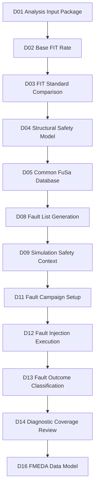
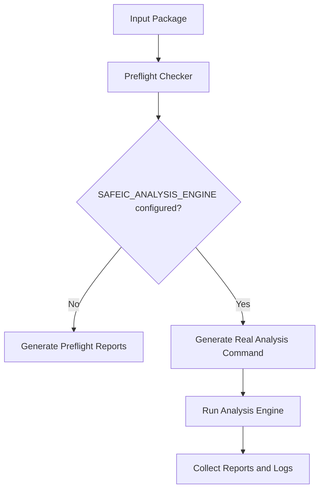
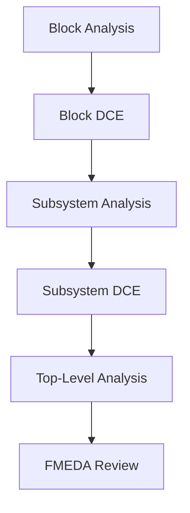

# [Automotive Safe-IC Practice 01] Analysis Input Package: Reproducible Safety Analysis Context for FIT, Fault Lists, and FMEDA Evidence

**Author**: Darren H. Chen  
**Direction**: Automotive Chip Functional Safety Analysis and Fault Injection Practice  
**Demo**: `D01_analysis_input_package`  
**Tags**: Automotive Chip, Functional Safety, ISO 26262, ASIL, FIT, Base FIT Rate, IEC 62380, SN 29500, Diagnostic Coverage, Fault List, Fault Campaign, VCD, Common FuSa Database, FMEDA, Reproducible Flow

---

## 1. Basic Concepts Before the Demo

The first demo in this series is not a tool tutorial.

It is an engineering foundation.

Before calculating FIT rate, generating fault lists, running fault campaigns, or updating an FMEDA table, we need to make the safety analysis context explicit and reproducible.

The target demo is:

```text
D01_analysis_input_package
```

The key question of D01 is:

> Can another engineer understand exactly which design, clock model, FIT setup, analysis options, database session, and output policy were used for this safety-analysis run?

If the answer is no, later metrics are not reviewable enough.

To make the rest of the series clear, this article first explains the basic concepts that will appear repeatedly.

---

### 1.1 What Is Functional Safety?

Functional safety is about ensuring that an electrical or electronic system does not create unreasonable risk when something goes wrong.

In chip-level engineering terms, the design may experience faults caused by aging, radiation, manufacturing defects, electrical stress, or other hardware effects. A safety-oriented chip does not assume that nothing will ever fail. Instead, it introduces mechanisms to detect, control, isolate, correct, or safely tolerate such failures.

A practical way to understand functional safety is:

```text
something may fail
    -> the failure may affect system behavior
    -> the system must detect or control the effect
    -> the residual risk must be acceptable
```

In automotive semiconductor work, this usually connects to ISO 26262.

---

### 1.2 ISO 26262 and ASIL

ISO 26262 is the automotive functional safety standard for road vehicles. At chip level, it influences how semiconductor teams analyze random hardware faults, document safety mechanisms, generate safety evidence, and support system-level safety arguments.

ASIL means Automotive Safety Integrity Level.

It represents the required level of risk reduction for a safety goal.

Typical ASIL levels are:

```text
ASIL A
ASIL B
ASIL C
ASIL D
```

ASIL D is the most stringent among these levels.

For a chip team, ASIL does not simply mean writing a label in a document. It affects the expected rigor of:

```text
hardware safety analysis
safety mechanism definition
fault injection
metric computation
traceability
verification evidence
FMEDA support
```

D01 does not assign an ASIL target to a real product. Instead, it prepares the input structure that later demos can use when safety metrics and evidence are introduced.

---

### 1.3 Fault, Error, and Failure

The words fault, error, and failure are often mixed in daily discussion, but they should be separated in safety analysis.

A simple chain is:

```text
Fault -> Error -> Failure
```

| Term | Practical Meaning |
|---|---|
| Fault | A defect or abnormal condition in hardware or software |
| Error | An incorrect internal state or value caused by a fault |
| Failure | Externally visible behavior that violates the intended function |

Example:

```text
A register bit is flipped by a transient event.
    -> fault

The stored state becomes incorrect.
    -> error

The output control signal becomes unsafe.
    -> failure
```

Fault injection focuses on deliberately injecting faults and observing whether the design, safety mechanism, or system response can prevent the fault from becoming an unsafe failure.

---

### 1.4 Systematic Faults and Random Hardware Faults

Functional safety analysis often separates systematic faults from random hardware faults.

Systematic faults are usually caused by human, process, specification, design, verification, implementation, or manufacturing-process issues. They are addressed mainly through disciplined development process, reviews, traceability, verification, validation, and tool confidence measures.

Random hardware faults occur during operation due to physical effects. They may be permanent or transient.

Examples:

```text
permanent stuck-at behavior
single event upset
memory bit flip
aging-related degradation
package or silicon-related failure
```

This article series focuses mainly on the random hardware fault workflow:

```text
Base FIT Rate
    -> structural safety analysis
    -> fault list generation
    -> simulation safety context
    -> fault campaign
    -> fault outcome classification
    -> diagnostic coverage
    -> FMEDA evidence
```

---

### 1.5 What Is a Safety Mechanism?

A safety mechanism is a design, hardware, software, or system-level mechanism used to detect, control, correct, or mitigate faults.

Common examples include:

```text
ECC
parity
lockstep
duplicated logic
triplicated logic
watchdog
BIST
CRC
alarm generation
error isolation
safe-state control
```

A safety mechanism should not only exist in the RTL. It must also be supported by evidence.

A complete safety argument usually needs to answer:

```text
Which faults does the safety mechanism cover?
How fast can it detect them?
Which alarm or response does it trigger?
Which failure modes does it address?
What diagnostic coverage can be credited?
What residual risk remains?
```

D01 does not validate a real safety mechanism yet. It prepares the input package that will later allow safety mechanisms, fault lists, alarms, simulation traces, and FMEDA evidence to connect consistently.

---

## 2. Why D01 Does Not Start from a Tool Command

Many engineering flows begin with a command:

```text
run_tool -f filelist.f -top top_module
```

That is not enough for functional safety.

A safety analysis run depends on more than design files. It also depends on:

```text
top module
clock definition
reset assumptions
FIT calculation standard
FIT setup file
mission profile
technology assumptions
package assumptions
memory assumptions
fault-list policy
alarm definition
observe-point definition
database/session policy
report naming policy
```

If these assumptions are not captured, the result becomes difficult to reproduce.

For example, two runs may use the same RTL but different FIT standards:

```text
iec_62380
sn_29500
```

The two runs may produce different FIT values and different interpretation contexts.

Another two runs may use the same RTL and same FIT standard, but different clock definitions. That may change sequential analysis, endpoint classification, and later fault-campaign behavior.

Therefore, D01 starts from the input package.

The first engineering rule of this series is:

> A safety metric is meaningful only when the input context behind it is explicit, versioned, and reviewable.

---

## 3. D01 in the Complete Safe-IC Flow

D01 is the root of the complete Safe-IC practice flow.



D01 does not try to calculate the final safety metric.

It prepares the package that later demos consume.

A good D01 package should already reserve locations for:

```text
reports
fault lists
logs
manifest files
common database sessions
preflight results
expected output index
analysis command wrapper
```

This is why D01 is small but important.

If D01 is weak, every later demo must compensate for missing structure.

---

## 4. Safety Analysis and Safety Verification

The series uses two related but different ideas:

```text
Safety Analysis
Safety Verification
```

They must not be confused.

---

### 4.1 Safety Analysis

Safety analysis focuses on understanding the design from a safety-metric and failure-rate perspective.

Typical questions are:

```text
What is the Base FIT Rate?
Which design objects contribute to the failure rate?
Which structural elements are safety-relevant?
What diagnostic coverage can be estimated or credited?
Which DCE-style artifacts can be generated?
Which information should be stored in the common database?
```

In this series, safety analysis begins with D01 and D02.

D01 prepares the input context.

D02 starts the Base FIT Rate run.

---

### 4.2 Safety Verification

Safety verification focuses on proving that the design and safety mechanisms behave properly when faults occur.

Typical questions are:

```text
Which faults should be injected?
Which simulation context is used?
Which alarms should be observed?
Which faults are detected?
Which faults are safe?
Which faults are unsafe?
Which faults remain unresolved?
What diagnostic coverage can be justified by fault campaign evidence?
```

Safety verification becomes central in later demos, especially when fault lists, VCD context, alarms, observe points, and fault outcomes are introduced.

---

### 4.3 Why D01 Must Consider Both

D01 is an analysis input package, but it must already prepare for verification.

For example, D01 may not run a fault campaign yet, but it should already reserve structure for:

```text
fault_lists/
alarms/
vcd/
reports/
db/
```

This is because the safety evidence chain is continuous:

```text
analysis input
    -> Base FIT
    -> fault list
    -> simulation context
    -> fault campaign
    -> diagnostic coverage
    -> FMEDA evidence
```

A good D01 package should not be designed as a one-shot script. It should be designed as the first node of a full safety workflow.

---

## 5. Basic Protocols and File Conventions

In this article, the word protocol does not mean a communication protocol such as AXI, AHB, or JTAG.

It means an engineering contract between files, tools, scripts, and later demos.

D01 introduces several basic file-level protocols.

---

### 5.1 RTL and Filelist Input Protocol

The RTL filelist tells the analysis engine which design files belong to the run.

Example:

```text
# inputs/design/rtl.f
inputs/design/toy_counter.v
```

The filelist should be explicit. It should not depend on hidden shell expansion or uncontrolled local directories.

A safety analysis result should be traceable to a precise RTL snapshot.

Minimum information:

```text
RTL file path
top module
filelist path
source root
optional include directories
optional macro definitions
```

D01 keeps this minimal, but the same principle scales to real IP or SoC-level analysis.

---

### 5.2 Clock Definition Protocol

The clock definition file tells the analysis engine which signals should be treated as clocks.

Example:

```text
# inputs/analysis/clocks.clk
clk
```

This may look too simple, but it is safety-relevant.

Clock definition affects:

```text
sequential structure
state-element recognition
endpoint analysis
fault propagation boundary
simulation context alignment
later fault campaign setup
```

A wrong clock definition can lead to misleading safety analysis.

---

### 5.3 Analysis Initialization File Protocol

The analysis initialization file collects run options into a reproducible configuration.

In this series, the file is:

```text
inputs/analysis/analysis_bfr.fusaini
```

The command line should refer to this file:

```text
$SAFEIC_ANALYSIS_ENGINE --fusaini inputs/analysis/analysis_bfr.fusaini
```

The initialization file should include at least:

```text
mode
top
filelist
clock definition
FIT setup
FIT standard
output policy
database/session policy
fault-list persistence policy
```

This makes the run reviewable.

---

### 5.4 FIT Setup Protocol

The FIT setup file captures reliability assumptions.

A real FIT setup may include:

```text
mission profile
temperature profile
technology data
package data
memory definition
lambda values
transistor count
library mapping
process information
```

A public demo can use a simplified placeholder, but the location and role of the file should remain realistic.

Example:

```text
inputs/analysis/FIT_inputs.bfr.txt
```

The key principle is:

> A FIT result must be traceable to the reliability assumptions used to compute it.

---

### 5.5 Common FuSa Database Session Protocol

A Common FuSa Database is used as a structured evidence container across safety analysis, fault simulation, visualization, and FMEDA-style review.

A session name separates different stages or runs inside the same database.

This series uses the notation:

```text
outputs/db/safeic_demo.fdb::BFR
```

This means:

```text
database file: outputs/db/safeic_demo.fdb
session name:  BFR
```

The session name is part of the run identity.

Later sessions may include:

```text
BFR
FAULT_LIST
FAULT_CAMPAIGN
FINAL_METRICS
FMEDA_REVIEW
```

D01 introduces the database path early, even before later demos fully consume it.

---

### 5.6 Fault List Protocol

A fault list defines which faults are candidates for fault injection or safety analysis.

Typical information may include:

```text
fault target
fault type
fault location
fault time or duration
permanent or transient model
collapsed or primary fault policy
```

D01 does not generate a final fault list yet, but it must prepare the directory and expected output model.

Example expected files:

```text
outputs/fault_lists/toy_counter_PrimaryFault.list
outputs/fault_lists/toy_counter_Perm_EquivFault.list
outputs/fault_lists/toy_counter_Trans_PrimaryFault.list
outputs/fault_lists/toy_counter_Trans_EquivFault.list
```

The fault list is the bridge between safety analysis and fault campaign execution.

---

### 5.7 Alarm and Observe Point Protocol

Fault injection only becomes useful when the flow knows what to observe.

Alarm signals indicate that a safety mechanism has detected or controlled a fault.

Observe points define design points used to detect state divergence or safety-context violation.

Conceptually:

```text
fault injected
    -> design state changes or does not change
    -> alarm triggers or does not trigger
    -> outcome is classified
```

Typical outcome classes include:

```text
detected
safe
unsafe
unresolved
```

D01 does not classify outcomes yet, but it reserves the concept so later fault-campaign demos have a place to connect.

---

### 5.8 VCD Simulation Context Protocol

VCD means Value Change Dump.

It records signal value changes during simulation.

For a safety verification flow, VCD can provide the golden safety context used by fault simulation or fault grading.

A simplified view:

```text
RTL simulation
    -> VCD waveform
    -> safety context
    -> fault campaign uses the context
```

D01 does not create the final VCD yet, but it introduces the need for a clean path:

```text
inputs/simulation/
outputs/vcd/
```

Later demos will connect simulation context with fault injection.

---

## 6. FIT, BFR, DC, and Residual FIT

Several metrics appear repeatedly in safety analysis.

D01 does not compute all of them, but it must prepare the context for them.

---

### 6.1 FIT

FIT means Failure In Time.

A common engineering interpretation is:

```text
1 FIT = 1 failure per 10^9 operating hours
```

Equivalently:

```text
1 FIT = 10^-9 failures / hour
```

If a module has 10 FIT, it can be interpreted as:

```text
10 failures per 10^9 operating hours
```

FIT is not a random number guessed by the tool. It depends on reliability models and assumptions such as:

```text
FIT standard
technology
mission profile
temperature
package
memory model
transistor count
library mapping
```

---

### 6.2 Base FIT Rate

Base FIT Rate, or BFR, is the failure-rate baseline before safety mechanisms are credited.

A practical interpretation:

```text
Base FIT Rate = unprotected random hardware failure exposure
```

D02 will use the D01 input package to run the first BFR analysis.

The relation between D01 and D02 is:

```text
D01: prepare the context
D02: calculate and interpret the baseline
```

---

### 6.3 Diagnostic Coverage

Diagnostic Coverage, or DC, describes how much of the relevant fault population can be detected, controlled, or made safe by safety mechanisms.

A simplified count-based expression is:

```text
DC = covered_faults / total_relevant_faults
```

A FIT-weighted expression is:

```text
FIT-weighted DC = covered_FIT / total_relevant_FIT
```

In real projects, the denominator and classification rules must be handled carefully.

Important questions include:

```text
Are safe faults included?
How are unreachable faults treated?
How are unresolved faults treated?
Is the metric count-based or FIT-weighted?
Which observation window is used?
Which alarm policy is used?
```

Therefore, DC is not just a percentage. It is a metric tied to fault population, classification policy, timing assumptions, and evidence source.

---

### 6.4 Residual FIT

Residual FIT is the remaining risk after diagnostic coverage is considered.

A simplified teaching formula is:

```text
Residual FIT = Base FIT × (1 - DC)
```

Example:

```text
Base FIT = 100 FIT
DC       = 90%

Residual FIT = 100 × (1 - 0.9) = 10 FIT
```

This is a conceptual explanation, not a complete FMEDA formula for every project.

Real flows may split residual FIT by:

```text
failure mode
part
sub-part
safety mechanism
ASIL target
fault class
operating mode
```

D01 prepares the traceable context required for these metrics.

---

## 7. IEC 62380 and SN 29500

The input package must make the FIT standard explicit.

Two important identifiers in this series are:

```text
iec_62380
sn_29500
```

They should not be hidden in tool defaults.

The selected standard affects:

```text
FIT calculation model
required input data
report naming
DCE naming
metric interpretation
hierarchical reuse
FMEDA evidence
```

---

### 7.1 What to Understand About IEC 62380

IEC 62380 is commonly used as a reliability prediction method for electronic components and systems.

At a practical level, it requires engineers to think about:

```text
mission profile
environmental condition
temperature profile
component or device type
operation mode
failure-rate contribution
```

The most important idea is mission profile.

A mission profile describes how the product is used over its lifetime.

It may include:

```text
operating time ratio
temperature condition
power-on and power-off state
environmental stress
thermal cycling
working mode
```

The same chip may produce different reliability results under different mission profiles.

That is why D01 treats the FIT setup file as part of the safety evidence chain.

---

### 7.2 What to Understand About SN 29500

SN 29500 is another widely used reliability prediction method in automotive electronics.

Important ideas include:

```text
reference failure rate
component category
stress condition
temperature factor
operating condition
technology-dependent failure rate
```

Changing the FIT standard from `iec_62380` to `sn_29500` is not simply changing a report format.

It may affect:

```text
base FIT for a design object
FIT contribution ranking
failure-mode priority
FIT-weighted diagnostic coverage
residual FIT interpretation
FMEDA row values
```

Therefore, the selected FIT standard must be visible in both configuration and output evidence.

---

### 7.3 FIT Standard as Run Identity

Example configuration:

```ini
fit_standard = iec_62380
```

or:

```ini
fit_standard = sn_29500
```

A robust D01 package should record the standard in:

```text
analysis_bfr.fusaini
manifest.yaml
FIT_inputs.bfr.txt
outputs/demo_summary.md
```

The second engineering rule is:

> Never rely on an implicit FIT standard. If a run produces safety metrics, the FIT standard must be part of the run identity.

An incomplete output row would be:

```csv
object,base_fit
toy_counter.count,0.052
```

A better row is:

```csv
object,base_fit,fit_standard,evidence_source
toy_counter.count,0.052,iec_62380,D02_base_fit_report
```

Metrics must carry their interpretation context forward.

---

## 8. Questions the D01 Input Package Must Answer

A reviewer should be able to answer the following questions from the D01 package:

```text
What design is analyzed?
What is the top module?
Which RTL filelist is used?
Which clock definition is used?
Which FIT setup file is used?
Which FIT standard is selected?
Which analysis mode is selected?
Where are reports written?
Where are fault lists expected?
Where is the database session written?
Which tool executable is used locally?
Can the run be reproduced without editing the public scripts?
```

D01 is considered weak if these questions require private memory or manual explanation.

D01 is considered strong if the package itself answers them.

---

## 9. Recommended Directory Structure

Recommended D01 layout:

```text
D01_analysis_input_package/
├── README.md
├── manifest.yaml
├── inputs/
│   ├── design/
│   │   ├── rtl.f
│   │   └── toy_counter.v
│   ├── analysis/
│   │   ├── analysis_bfr.fusaini
│   │   ├── clocks.clk
│   │   └── FIT_inputs.bfr.txt
│   └── simulation/
│       └── README.md
├── scripts/
│   ├── setup_toolchain.template.csh
│   ├── setup_toolchain.local.csh.example
│   ├── run_demo.csh
│   └── run_demo.sh
├── tools/
│   ├── preflight_input_package.py
│   ├── parse_analysis_config.py
│   └── build_expected_outputs.py
├── outputs/
│   ├── db/
│   ├── reports/
│   ├── fault_lists/
│   ├── manifest/
│   ├── input_inventory.csv
│   ├── analysis_options.csv
│   ├── preflight_check.csv
│   ├── expected_analysis_outputs.csv
│   ├── analysis_command.csh
│   └── demo_summary.md
├── logs/
│   └── run_demo.log
└── docs/
    └── design_notes.md
```

This layout separates:

```text
inputs
scripts
tools
outputs
logs
docs
```

That separation is important because these file types have different lifecycles.

RTL and analysis setup are inputs.

Preflight results and reports are generated outputs.

Logs are execution evidence.

The database is structured evidence.

The manifest is run identity.

---

## 10. Toolchain Mapping and Local Configuration

The public GitHub demo should not hard-code private tool paths.

Instead, it should use environment variables.

Example template:

```csh
# scripts/setup_toolchain.template.csh
#!/bin/csh -f

# Copy this file to setup_toolchain.local.csh and edit local paths.

setenv SAFEIC_TOOL_HOME /path/to/safety/toolchain
setenv SAFEIC_ANALYSIS_ENGINE $SAFEIC_TOOL_HOME/bin/analysis_engine
setenv SAFEIC_FAULT_ENGINE    $SAFEIC_TOOL_HOME/bin/fault_campaign_engine

setenv PATH $SAFEIC_TOOL_HOME/bin:$PATH
```

A local private file may map these variables to the real installation:

```csh
#!/bin/csh -f

setenv SAFEIC_TOOL_HOME /local/install/path
setenv SAFEIC_ANALYSIS_ENGINE $SAFEIC_TOOL_HOME/bin/analysis_engine
setenv SAFEIC_FAULT_ENGINE    $SAFEIC_TOOL_HOME/bin/fault_engine

setenv PATH $SAFEIC_TOOL_HOME/bin:$PATH
```

The local file should not be committed to the repository.

The public package remains portable, while the local run can still use a real installed tool.

---

## 11. Toy Design Used by D01

The toy design should be small enough for manual inspection.

Example:

```verilog
module toy_counter (
    input  wire       clk,
    input  wire       rst_n,
    input  wire       en,
    output reg  [3:0] count,
    output wire       alarm
);

always @(posedge clk or negedge rst_n) begin
    if (!rst_n) begin
        count <= 4'd0;
    end else if (en) begin
        count <= count + 4'd1;
    end
end

assign alarm = (count == 4'hF);

endmodule
```

Filelist:

```text
# inputs/design/rtl.f
inputs/design/toy_counter.v
```

The toy design contains:

```text
clock
reset
state
observable output
alarm-like signal
```

This is enough for later demos to introduce:

```text
structural safety analysis
fault list generation
VCD safety context
fault campaign setup
fault outcome classification
diagnostic coverage
FMEDA mapping
```

The point is not design complexity.

The point is traceable flow discipline.

---

## 12. Why Clock Definition Is Safety Evidence

Clock definition is not a minor option.

It affects how the design is interpreted.

A design object becomes safety-relevant when it participates in:

```text
state update
fault propagation
alarm generation
diagnostic observation
failure mode activation
```

Clock modeling affects these behaviors.

Wrong clock definition may lead to:

```text
incorrect state classification
incorrect endpoint analysis
wrong sequential boundary
misleading diagnostic coverage
wrong fault campaign setup
```

Therefore, D01 treats the clock file as a first-class safety artifact.

Example:

```text
# inputs/analysis/clocks.clk
clk
```

Even this one-line file has evidence value because it records an assumption about design behavior.

---

## 13. FIT Setup File

The FIT setup file describes the reliability-analysis environment.

D01 uses a simplified file:

```text
# inputs/analysis/FIT_inputs.bfr.txt
PROJECT_NAME = automotive_safeic_practice
TOP_MODULE   = toy_counter
FIT_STANDARD = iec_62380
MISSION_PROFILE = demo_motor_control
ASIL_TARGET = ASIL_B_OR_HIGHER_DEMO_PLACEHOLDER
```

This is not a production FIT setup.

It is a public-safe placeholder that demonstrates where the reliability context belongs.

A real project may include:

```text
technology data
mission profile file
temperature profile
package file
memory definition
library mapping
transistor count
lambda values
process information
```

The third engineering rule is:

> FIT numbers must be traceable to the reliability assumptions used to compute them.

---

## 14. Analysis Initialization File

The analysis initialization file is the center of D01.

Example:

```ini
# inputs/analysis/analysis_bfr.fusaini

mode = analysis
top = toy_counter

filelist = inputs/design/rtl.f
clkdef = inputs/analysis/clocks.clk
fit_setup = inputs/analysis/FIT_inputs.bfr.txt

fit_standard = iec_62380
block_level = true
consolidated_report = sparse

write_fusa_db = true
fusa_db_name = outputs/db/safeic_demo.fdb::BFR
overwrite_session = true
overwrite_fusa_db = true

ss_save_fault_list_to_db = true
```

The file has four responsibilities.

---

### 14.1 Define Design Scope

```ini
top = toy_counter
filelist = inputs/design/rtl.f
clkdef = inputs/analysis/clocks.clk
```

These options identify the design and its clock structure.

---

### 14.2 Define Reliability Setup

```ini
fit_setup = inputs/analysis/FIT_inputs.bfr.txt
fit_standard = iec_62380
```

These options bind the analysis result to reliability assumptions and a selected standard.

---

### 14.3 Define Evidence Storage Policy

```ini
write_fusa_db = true
fusa_db_name = outputs/db/safeic_demo.fdb::BFR
overwrite_session = true
overwrite_fusa_db = true
```

These options control database output.

The session name `BFR` identifies this run stage.

---

### 14.4 Prepare Fault-List Reuse

```ini
ss_save_fault_list_to_db = true
```

Even though D01 does not execute the complete fault campaign, it prepares the flow so generated fault-list evidence can be reused by later demos.

---

## 15. Understanding `.fdb::session`

The notation:

```text
outputs/db/safeic_demo.fdb::BFR
```

should be read as:

```text
database file: outputs/db/safeic_demo.fdb
session name:  BFR
```

The database is the container.

The session is the evidence partition inside the container.

This is useful because one database may store multiple related stages:

```text
safeic_demo.fdb::BFR
safeic_demo.fdb::FAULT_LIST
safeic_demo.fdb::FAULT_CAMPAIGN
safeic_demo.fdb::FINAL_METRICS
```

This helps connect data across tools and stages.

A file-based flow is easy to inspect.

A database-based flow is easier to share across safety tools.

A mature flow usually needs both.

---

## 16. File-Based Evidence and Database-Based Evidence

D01 prepares two evidence paths.

---

### 16.1 File-Based Evidence

File-based evidence includes:

```text
reports
fault lists
logs
CSV summaries
markdown summaries
command scripts
manifest files
```

These are easy for engineers to inspect, diff, review, and attach to a GitHub demo.

---

### 16.2 Database-Based Evidence

Database-based evidence may include:

```text
FIT metrics
diagnostic coverage values
fault lists
fault campaign results
part and sub-part mapping
alarm information
observe points
safety mechanism maps
```

This is more suitable for multi-tool workflows and GUI-driven review.

---

### 16.3 Why D01 Prepares Both

D01 is the root of the later flow.

Therefore it reserves:

```text
outputs/reports/
outputs/fault_lists/
outputs/db/
logs/
```

The file-based evidence supports debugging and review.

The database-based evidence supports tool-to-tool continuity.

---

## 17. Reproducible Command Generation

D01 should generate a command script instead of relying only on a manual command typed in a terminal.

Example generated command:

```csh
#!/bin/csh -f

set ROOT = `cd "$0:h/.." && pwd`
cd "$ROOT"

if ( ! $?SAFEIC_ANALYSIS_ENGINE ) then
    echo "[ERROR] SAFEIC_ANALYSIS_ENGINE is not set."
    exit 1
endif

mkdir -p logs outputs outputs/db outputs/reports outputs/fault_lists outputs/manifest

echo "[INFO] Running safety analysis engine..."
echo "[INFO] Config: inputs/analysis/analysis_bfr.fusaini"

$SAFEIC_ANALYSIS_ENGINE \
    --fusaini inputs/analysis/analysis_bfr.fusaini \
    |& tee logs/analysis_engine.log

set rc = $status
echo "[INFO] analysis engine exit code: $rc"
exit $rc
```

One detail is important:

> The generated `analysis_command.csh` must contain real newline characters, not literal `\n` strings.

This is wrong:

```text
#!/bin/csh -f\nset ROOT = ...
```

Old EDA environments are often sensitive to shell syntax.

D01 should generate boring, inspectable, conservative scripts.

---

## 18. Preflight Mode and Real Analysis Mode

D01 supports two layers.

---

### 18.1 Preflight-Only Mode

Preflight mode does not require the real analysis engine.

It checks:

```text
manifest exists
analysis config exists
RTL file exists
filelist exists
clock definition exists
FIT setup exists
top module is defined
fit_standard is explicit
output directories are writable
expected outputs can be indexed
```

This makes the GitHub demo usable without licensed tools.

---

### 18.2 Real Analysis Mode

If `SAFEIC_ANALYSIS_ENGINE` is configured, the same package can generate and run the real command:

```text
$SAFEIC_ANALYSIS_ENGINE --fusaini inputs/analysis/analysis_bfr.fusaini
```

This gives one package two modes:

```text
public reproducibility mode
private real-tool execution mode
```

Flow diagram:



---

## 19. Manifest as Run Identity

The manifest is the stable index of the run.

Example:

```yaml
project:
  name: automotive_safeic_practice
  demo: D01_analysis_input_package
  top_module: toy_counter

inputs:
  rtl_file: inputs/design/toy_counter.v
  filelist: inputs/design/rtl.f
  clkdef: inputs/analysis/clocks.clk
  fit_setup: inputs/analysis/FIT_inputs.bfr.txt
  analysis_config: inputs/analysis/analysis_bfr.fusaini

analysis:
  mode: analysis
  fit_standard: iec_62380
  database_session: outputs/db/safeic_demo.fdb::BFR

toolchain:
  analysis_engine_env: SAFEIC_ANALYSIS_ENGINE
  setup_template: scripts/setup_toolchain.template.csh

outputs:
  input_inventory: outputs/input_inventory.csv
  preflight_check: outputs/preflight_check.csv
  expected_outputs: outputs/expected_analysis_outputs.csv
  summary: outputs/demo_summary.md
```

The manifest is not a substitute for tool reports.

It is a run-identity index.

A reviewer can start from this file and understand the package.

---

## 20. Expected Output Model

A real safety analysis run may generate:

```text
summary report
FIT report
coverage report
DCE-style artifact
fault list
alarm list
database session
tool log
```

D01 does not require all real outputs in preflight mode.

Instead, it generates an expected output index:

```text
outputs/expected_analysis_outputs.csv
```

Example:

```csv
artifact,purpose,used_by_later_demo
toy_counter_IEC_62380.DCE,diagnostic coverage element,D05/D17
toy_counter_SS.summary.rpt,summary report,D02/D05
toy_counter_Perm_EquivFault.list,equivalent permanent fault list,D08/D11
toy_counter_PrimaryFault.list,primary fault list,D08/D11
SAFA_SA_Alarms.list,alarm signal list,D11/D12
analysis_engine.log,tool execution log,D19
safeic_demo.fdb::BFR,common database session,D05/D16
```

The expected-output model is important because it makes later demo dependencies visible from the start.

---

## 21. Why DCE-Style Artifacts Matter

DCE can be understood as Diagnostic Coverage Element or a diagnostic-coverage evidence artifact, depending on the exact tool terminology.

Conceptually, it stores safety analysis results that can be reused in a hierarchical flow.

This matters because real automotive chips are hierarchical.

A scalable flow must support:

```text
block-level analysis
subsystem-level roll-up
top-level integration
FMEDA mapping
```



D01 introduces this idea early so later demos can reuse the same evidence chain.

---

## 22. D01 Helper Tools

The D01 helper tools can be simple Python utilities.

Suggested modules:

```text
tools/
  preflight_input_package.py
  parse_analysis_config.py
  build_expected_outputs.py
```

Responsibilities:

| Module | Responsibility |
|---|---|
| `preflight_input_package.py` | Main entry point, runs all checks |
| `parse_analysis_config.py` | Parses `key = value` options |
| `build_expected_outputs.py` | Generates expected report and evidence names |

The scripts should stay simple.

D01 is not the place to build a large framework.

It is the place to establish conventions.

---

## 23. csh Execution Path

Many EDA environments still rely on `csh` or `tcsh` scripts.

D01 therefore provides a first-class csh wrapper.

Example:

```csh
#!/bin/csh -f

set DEMO = D01_analysis_input_package
set ROOT = `cd "$0:h/.." && pwd`

cd "$ROOT"

if ( -e scripts/setup_toolchain.local.csh ) then
  source scripts/setup_toolchain.local.csh
else
  source scripts/setup_toolchain.template.csh
endif

mkdir -p outputs logs

python3 tools/preflight_input_package.py \
  --manifest manifest.yaml \
  |& tee logs/run_demo.log

if ( $?SAFEIC_ANALYSIS_ENGINE ) then
  echo "[INFO] SAFEIC_ANALYSIS_ENGINE is configured."
  echo "[INFO] Optional real analysis command generated at outputs/analysis_command.csh"
else
  echo "[WARN] SAFEIC_ANALYSIS_ENGINE is not set. Preflight-only mode completed."
endif
```

The csh path should be conservative and readable.

This improves compatibility with older engineering environments.

---

## 24. Bash Execution Path

A bash wrapper is also useful for GitHub users.

Example:

```bash
#!/usr/bin/env bash
set -euo pipefail

DEMO=D01_analysis_input_package
ROOT="$(cd "$(dirname "${BASH_SOURCE[0]}")/.." && pwd)"

cd "${ROOT}"
mkdir -p outputs logs

python3 tools/preflight_input_package.py \
  --manifest manifest.yaml |& tee logs/run_demo.log
```

The bash script helps general users run the demo.

The csh script remains important for EDA-style environments.

---

## 25. Preflight Check Output

D01 should produce:

```text
outputs/preflight_check.csv
```

Example:

```csv
check,status,details
manifest_exists,PASS,manifest.yaml
analysis_config_exists,PASS,inputs/analysis/analysis_bfr.fusaini
rtl_exists,PASS,inputs/design/toy_counter.v
filelist_exists,PASS,inputs/design/rtl.f
clkdef_exists,PASS,inputs/analysis/clocks.clk
fit_setup_exists,PASS,inputs/analysis/FIT_inputs.bfr.txt
fit_standard_explicit,PASS,iec_62380
fusa_db_session_format,PASS,outputs/db/safeic_demo.fdb::BFR
analysis_engine_configured,WARN,SAFEIC_ANALYSIS_ENGINE not set
```

Warnings are acceptable.

Hidden assumptions are not.

A warning tells the user what is missing.

A hidden assumption silently weakens the evidence chain.

---

## 26. Demo Summary Output

The most important human-readable output is:

```text
outputs/demo_summary.md
```

It should summarize:

```text
design under analysis
top module
FIT standard
input files
preflight status
optional real command
expected outputs
warnings
next demo dependency
```

Example:

```md
# D01 Demo Summary

Design: toy_counter  
Top: toy_counter  
FIT standard: iec_62380  
Mode: preflight-only  
Database session: outputs/db/safeic_demo.fdb::BFR

## Result

Preflight passed with warnings.

## Warnings

- SAFEIC_ANALYSIS_ENGINE is not configured.
- Real analysis was not executed.

## Next Step

Use D02 to run Base FIT Rate analysis after configuring the analysis engine.
```

This file makes the demo understandable without reading all scripts.

---

## 27. What D01 Should Not Do

D01 should not become too large.

It should not attempt to solve all safety problems in one demo.

D01 should not:

```text
perform final FMEDA analysis
claim production diagnostic coverage
hide FIT standard in defaults
hard-code private tool paths
mix generated outputs with source inputs
require licensed tools for basic preflight
use a large SoC that cannot be inspected
```

The purpose of D01 is flow discipline.

The purpose is not design complexity.

---

## 28. Common Mistakes

### 28.1 Starting from Metrics Instead of Inputs

A metric without input context cannot be reviewed.

D01 starts from inputs.

---

### 28.2 Leaving FIT Standard Implicit

If the standard is not recorded, two runs cannot be safely compared.

The FIT standard must be part of run identity.

---

### 28.3 Treating Clock File as a Minor Parameter

Clock definition affects sequential interpretation and later fault campaign setup.

It must be treated as safety evidence.

---

### 28.4 Mixing Public Demo and Private Tool Paths

GitHub scripts should not expose private installation paths.

Use environment variables and local ignored setup files.

---

### 28.5 Generating a Broken csh Script

Do not generate scripts containing literal `\n` text instead of real newlines.

The generated command file should be directly executable.

---

### 28.6 Treating Common Database as a Late Feature

The database/session concept should appear early.

It is part of the evidence architecture, not a GUI afterthought.

---

### 28.7 Making D01 Too Large

D01 should be small, readable, and inspectable.

Large designs belong to later demos.

---

## 29. Review Checklist

A reviewer should be able to answer:

```text
What design is analyzed?
What is the top module?
Which filelist is used?
Which clock file is used?
Which FIT setup file is used?
Which FIT standard is selected?
Is the analysis mode explicit?
Where will reports be generated?
Where will fault lists be generated?
Where is the Common FuSa DB session?
Is the tool path configurable?
Can the package run in preflight-only mode?
If the real engine is configured, what command will run?
Which later demos consume these expected outputs?
```

If any answer is unclear, D01 is not ready.

---

## 30. D01 Acceptance Criteria

D01 is complete when the package satisfies:

```text
[ ] RTL filelist is explicit.
[ ] Top module is defined.
[ ] Clock definition file exists.
[ ] FIT setup file exists.
[ ] FIT standard is explicit.
[ ] Analysis initialization file is reviewable.
[ ] Common database session is planned.
[ ] Output directories are deterministic.
[ ] Preflight works without the real tool.
[ ] Real analysis command can be generated when the engine is configured.
[ ] Generated csh command contains real newlines.
[ ] Manifest records run identity.
[ ] Expected outputs are indexed.
[ ] Later demos can consume the package.
```

This is the first quality gate of the series.

---

## 31. How D02 Builds on D01

D02 will use the D01 input package to run and interpret:

```text
Base FIT Rate
```

D02 will focus on:

```text
BFR meaning
FIT contribution
summary report interpretation
IEC 62380 or SN 29500 setup
report and DCE output
fault-list preparation
connection to later diagnostic coverage
```

D01 prepares the context.

D02 starts interpreting the first real safety metric.

---

## 32. Summary

D01 introduces the first engineering artifact of the Automotive Safe-IC Practice flow:

```text
D01_analysis_input_package
```

It does not try to produce final safety metrics.

It builds a reproducible safety analysis context:

```text
RTL
filelist
clock definition
FIT setup
analysis initialization file
FIT standard
manifest
preflight report
expected output index
optional real command
common database session
```

The main lesson is:

> Before discussing FIT, diagnostic coverage, fault campaign, or FMEDA, the analysis context must be explicit, configurable, and reproducible.

A mature safety workflow starts with disciplined input packaging.

---

## 33. D01 Demo Deliverables

Expected deliverables:

```text
[ ] README.md
[ ] manifest.yaml

[ ] inputs/design/toy_counter.v
[ ] inputs/design/rtl.f
[ ] inputs/analysis/clocks.clk
[ ] inputs/analysis/FIT_inputs.bfr.txt
[ ] inputs/analysis/analysis_bfr.fusaini

[ ] scripts/setup_toolchain.template.csh
[ ] scripts/setup_toolchain.local.csh.example
[ ] scripts/run_demo.csh
[ ] scripts/run_demo.sh

[ ] tools/preflight_input_package.py
[ ] tools/parse_analysis_config.py
[ ] tools/build_expected_outputs.py

[ ] outputs/input_inventory.csv
[ ] outputs/analysis_options.csv
[ ] outputs/preflight_check.csv
[ ] outputs/expected_analysis_outputs.csv
[ ] outputs/analysis_command.csh
[ ] outputs/demo_summary.md

[ ] outputs/db/
[ ] outputs/reports/
[ ] outputs/fault_lists/
[ ] logs/run_demo.log
[ ] docs/design_notes.md
```

A successful D01 run should answer:

```text
Is the safety analysis input package complete?
Is the FIT standard explicit?
Is the top module defined?
Are design files and clock files present?
Is the FIT setup traceable?
Is the Common FuSa DB session planned?
Can the real analysis engine be configured without modifying public scripts?
Can later demos consume the expected outputs?
```
