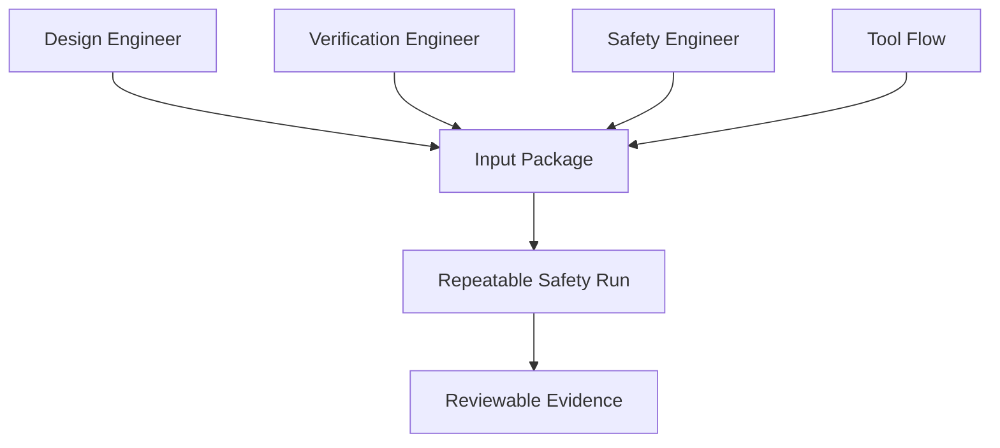
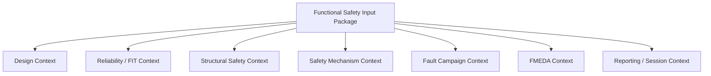
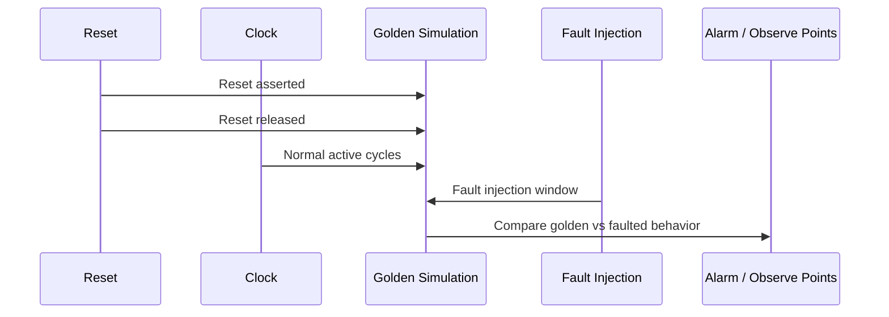
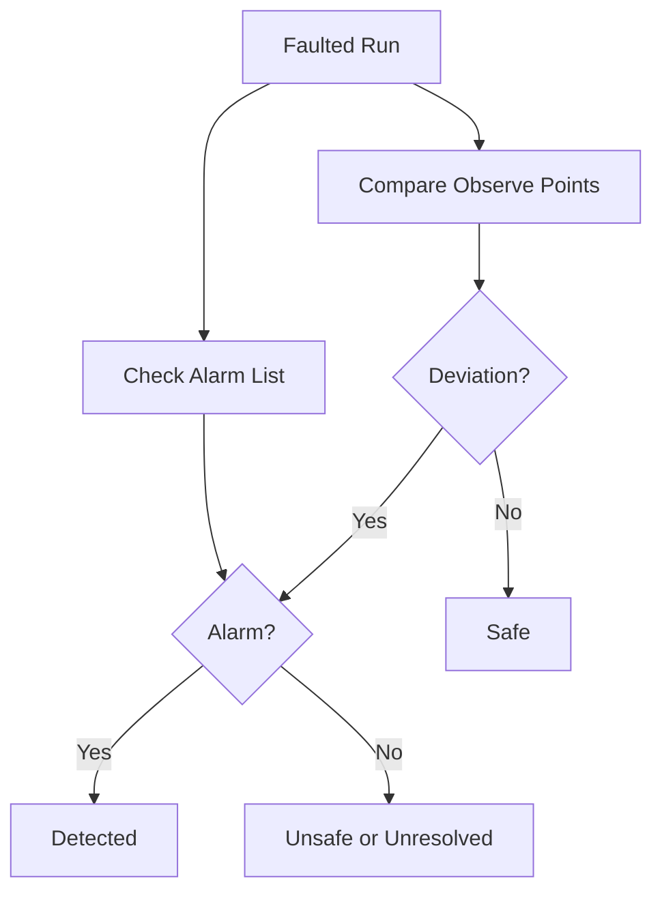
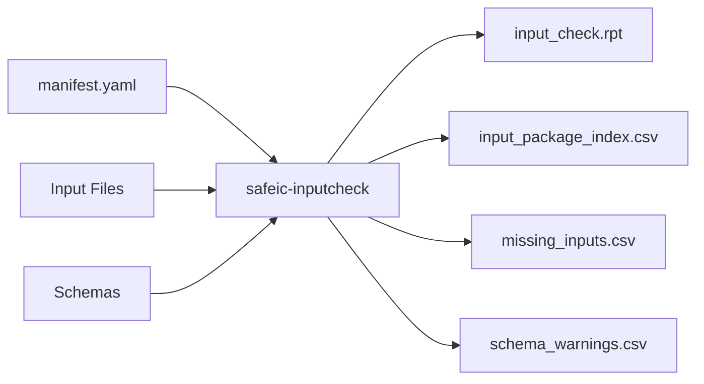
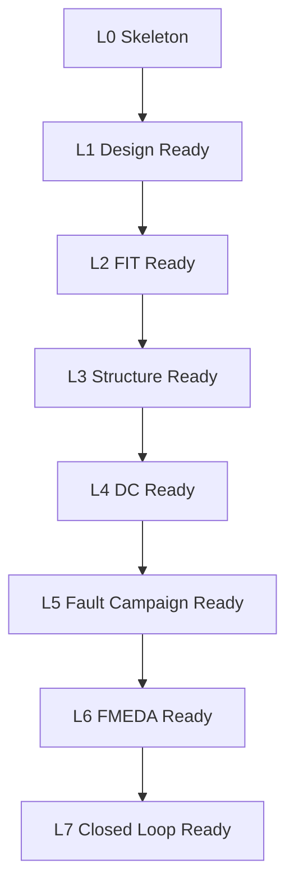

# [Automotive Safe-IC Practice 02] What Input Package Does a Functional Safety Verification Project Need?

**Author**: Darren H. Chen  
**Direction**: Automotive Chip Functional Safety Analysis and Fault Injection Practice  
**Demo**: D02_input_package  
**Tags**: Automotive Chip, Functional Safety, Input Package, FIT, Diagnostic Coverage, FMEDA, Fault List, Alarm List, Observe Point, VCD, Fault Campaign

---

## 1. Why the Input Package Matters

In functional safety analysis and fault injection, tool execution is only the visible part of the workflow.

The real foundation is the input package.

A safety verification run cannot be trusted if the input package is incomplete, inconsistent, or ambiguous.

Before discussing FIT calculation, diagnostic coverage, fault list generation, VCD-based safety context, or fault campaign classification, we must answer a more basic question:

> What information must be available before a chip-level functional safety verification flow can produce meaningful evidence?

The second demo in this repository is:

```text
D02_input_package
```

Its purpose is to define and validate a minimal but extensible input package for automotive chip functional safety analysis and fault injection practice.

This article focuses on the underlying principles:

```text
design context
reliability context
structural context
safety mechanism context
fault campaign context
FMEDA context
reporting context
```

The generic tool introduced in this article is:

```text
safeic-inputcheck
```

The goal of `safeic-inputcheck` is not to run the safety analysis itself. Its goal is to verify that the project contains enough consistent information for later safety analysis and fault campaign steps.

---

## 2. The Core Idea: Safety Evidence Is Only as Good as Its Inputs

A functional safety workflow transforms inputs into evidence.


**Figure 1. A functional safety workflow transforms an input package into reviewable safety evidence.**

If the input package is weak, the evidence is weak.

For example:

| Missing Input | Likely Consequence |
|---|---|
| Missing clock definition | Fault injection timing cannot be interpreted reliably |
| Missing alarm list | Detected vs unsafe classification becomes ambiguous |
| Missing observe points | Safe vs unsafe classification becomes incomplete |
| Missing VCD signals | Fault propagation may become unresolved |
| Missing safety mechanism map | DC estimation becomes unsupported |
| Missing failure mode mapping | FMEDA reporting becomes disconnected from hardware |
| Missing FIT assumptions | Base failure rate becomes meaningless |
| Missing filelist or top module | The design cannot be analyzed consistently |

A safety tool can sometimes run with incomplete inputs, but a successful run does not automatically mean the result is meaningful.

The first engineering rule is:

> Validate the input package before trusting any safety metric.

---

## 3. What Makes Functional Safety Inputs Different from Normal Verification Inputs?

A normal RTL simulation may require:

```text
RTL files
testbench
clock/reset handling
simulation command
waveform dump
```

A functional safety workflow requires more.

It must connect:

```text
hardware structure
random hardware failure model
safety mechanisms
fault injection scope
diagnostic signals
FMEDA semantics
metric reporting
```

A typical safety input package therefore contains:

```text
design files
design hierarchy
clock definitions
reset assumptions
simulation activity
FIT input assumptions
safety mechanism definitions
diagnostic coverage definitions
endpoint-to-safety-mechanism mapping
fault list
alarm list
observe point list
failure mode library
part/sub-part model
database or session metadata
report configuration
```

This is why D02 is important. It turns a loose collection of files into a controlled engineering package.

---

## 4. Input Package as a Contract

The input package should be treated as a contract between engineers and tools.



**Figure 2. The input package is a contract between design, verification, safety, and tool execution.**

Each role contributes different information:

| Role | Typical Contribution |
|---|---|
| Design engineer | RTL, hierarchy, implementation assumptions, safety mechanism signals |
| Verification engineer | Testbench, stimulus, VCD, reset/clock behavior, scenario definition |
| Safety engineer | Failure modes, safety goals, FMEDA hierarchy, diagnostic assumptions |
| Tool flow engineer | Filelist, run scripts, data schemas, report configuration |
| Review owner | Checklist, traceability, versioning, approval status |

A good input package should be:

```text
complete
consistent
versioned
inspectable
machine-readable
human-readable
portable
repeatable
```

---

## 5. The Seven Input Domains

For D02, the input package is divided into seven domains.



**Figure 3. A functional safety input package should separate input domains instead of mixing everything into one script.**

The separation is important because each domain answers a different question.

| Domain | Core Question |
|---|---|
| Design context | What design is being analyzed? |
| Reliability / FIT context | What random failure assumptions are used? |
| Structural safety context | Which nodes, endpoints, cones, and hierarchy matter? |
| Safety mechanism context | What detects, corrects, masks, or controls faults? |
| Fault campaign context | Which faults are injected and how are outcomes observed? |
| FMEDA context | How does hardware evidence map to failure modes and metrics? |
| Reporting / session context | How is evidence stored, reviewed, and reproduced? |

This article defines each domain and shows how the demo checks them.

---

## 6. Domain 1: Design Context

The design context defines what hardware is being analyzed.

Minimum files:

```text
inputs/rtl/
inputs/filelist.f
inputs/top.yaml
inputs/clkdef.clk
```

A minimal filelist:

```text
inputs/rtl/toy_counter.v
inputs/rtl/toy_counter_tb.v
```

A minimal top configuration:

```yaml
design:
  name: toy_counter_project
  top_module: toy_counter
  language:
    - systemverilog
  abstraction:
    - rtl
```

A minimal clock definition:

```text
clock clk period=10ns
reset rst_n active_low
```

The input checker should verify:

```text
Does the filelist exist?
Do all listed RTL files exist?
Is the top module declared?
Are clock and reset signals known?
Is the design abstraction declared?
Are generated files separated from source files?
```

A design context is not complete just because RTL files exist. It must also define the entry point and timing assumptions.

---

## 7. Why Clock and Reset Matter

Fault injection is time-dependent.

A fault injected before reset release may be overwritten. A fault injected during idle mode may not propagate. A fault injected during active operation may cause a safety-relevant deviation.

Therefore, the input package must define:

```text
clock signals
reset signals
reset polarity
reset release window
simulation time unit
active test window
fault injection window
```

A simplified timing model:



**Figure 4. Fault injection must be aligned with clock, reset, and active operation windows.**

Example configuration:

```yaml
timing:
  timescale: 1ns
  clock:
    name: clk
    period: 10
    unit: ns
  reset:
    name: rst_n
    active: low
    release_time: 20
  active_window:
    start: 30
    end: 200
```

The input checker should warn if fault injection windows overlap reset unless this is intentional.

---

## 8. Domain 2: Reliability and FIT Context

Reliability context defines the assumptions used to estimate random hardware failure rate.

Minimum files:

```text
inputs/fit_inputs.yaml
inputs/design_stats.yaml
```

A simplified FIT input file:

```yaml
fit_model:
  standard: simplified
  mission_profile: demo_profile
  temperature_profile: demo_temperature
  package_model: demo_package

design_statistics:
  logic_gates: 120
  flip_flops: 16
  memory_bits: 0

transient_fit:
  logic_gate_fit: 1.0e-6
  ff_fit: 1.0e-3
  memory_bit_fit: 1.0e-6

permanent_fit:
  logic_base_fit: 0.02
  ff_base_fit: 0.05
  package_fit: 0.01
```

For a real industrial flow, FIT inputs may be much richer:

```text
technology-dependent lambda values
mission profile
temperature profile
package information
memory definition
transistor count
library-to-design-type mapping
memory-to-design-type mapping
process assumptions
```

D02 does not need to implement the complete FIT calculation. It validates that the required information is present and internally consistent.

The input checker should verify:

```text
Is a FIT model selected?
Are mission profile assumptions available?
Are design statistics present?
Are memory bits defined if memory faults are enabled?
Are transient and permanent assumptions separated?
Are units explicit?
Are values numeric and non-negative?
```

The key principle is:

> FIT calculation is not a magic number generator. It is a structured transformation from design statistics and reliability assumptions into a failure-rate baseline.

---

## 9. Domain 3: Structural Safety Context

Structural safety context describes how faults may propagate through the design.

In early demos, structure can be generated automatically later. But the input package still needs a place for structural artifacts.

Suggested files:

```text
intermediate/structure_graph.json
intermediate/sp.csv
intermediate/ep.csv
intermediate/cone.csv
```

For D02, these may not exist yet. The input checker can distinguish between:

```text
required now
generated later
optional
```

Example manifest:

```yaml
artifacts:
  structure_graph:
    path: intermediate/structure_graph.json
    role: generated_later
  endpoints:
    path: intermediate/ep.csv
    role: generated_later
  startpoints:
    path: intermediate/sp.csv
    role: generated_later
```

A structural model contains:

```text
startpoints
endpoints
cones
hierarchy
instance names
signal names
node types
fan-in / fan-out information
```

The structural model is needed for:

```text
endpoint FIT contribution
diagnostic coverage calculation
safety mechanism mapping
fault list generation
fault result grouping
```

The input package should not treat structure as a temporary internal result. It should treat structure as an inspectable artifact.

---

## 10. Domain 4: Safety Mechanism Context

Safety mechanism context defines what protection exists or is assumed.

Minimum files:

```text
inputs/safety_mechanisms.yaml
inputs/ep_to_sm_map.csv
```

A simple safety mechanism library:

```yaml
mechanisms:
  endpoint_parity:
    type: endpoint
    description: Detects parity mismatch on protected endpoint state.
    suitable_for:
      - register_group
      - scalar_ff
    coverage_scope:
      ep: 0.90
      cone: 0.00
      path: 0.00
    alarm_required: true
    corrects: false

  memory_ecc:
    type: memory
    description: Detects and corrects selected memory bit errors.
    suitable_for:
      - memory
      - register_file
    coverage_scope:
      memory: 0.99
    alarm_required: true
    corrects: true

  end_to_end_crc:
    type: path
    description: Detects transaction-level data corruption.
    suitable_for:
      - bus
      - interface
      - datapath
    coverage_scope:
      path: 0.95
    alarm_required: true
    corrects: false
```

A simple endpoint-to-safety-mechanism map:

```csv
endpoint,safety_mechanism,alarm,coverage_assumption,comment
toy_counter.count[7:0],endpoint_parity,toy_counter.alarm,0.90,parity protects counter state
toy_counter.count_parity,none,,0.00,parity bit itself is not protected
toy_counter.alarm,none,,0.00,alarm path protection not modeled in D02
```

The input checker should verify:

```text
Are all referenced safety mechanisms defined?
Are coverage values between 0 and 1?
Are alarms defined when the mechanism requires alarm reporting?
Are mapped endpoints syntactically valid?
Are comments or assumptions present?
Are unsupported mechanisms flagged?
```

The key idea is:

> A safety mechanism should not be represented only by its name. It should have scope, assumptions, alarm behavior, and traceability.

---

## 11. Domain 5: Fault Campaign Context

Fault campaign context defines what to inject and how to observe the result.

Minimum files:

```text
inputs/fault.list
inputs/alarm.list
inputs/observe_points.list
inputs/sim.vcd
inputs/campaign.yaml
```

A minimal fault list:

```text
toy_counter.count[0] stuck_at_0
toy_counter.count[0] stuck_at_1
toy_counter.count_parity stuck_at_0
toy_counter.alarm stuck_at_0
```

A minimal alarm list:

```text
toy_counter.alarm
```

A minimal observe point list:

```text
toy_counter.count
toy_counter.count_parity
toy_counter.alarm
```

A minimal campaign configuration:

```yaml
campaign:
  name: d02_input_package_campaign
  golden_context: inputs/sim.vcd
  fault_list: inputs/fault.list
  alarm_list: inputs/alarm.list
  observe_points: inputs/observe_points.list
  injection_window:
    start: 30
    end: 200
  classification:
    outcomes:
      - detected
      - safe
      - unsafe
      - unresolved
```

The input checker should verify:

```text
Does fault.list exist and contain valid entries?
Does alarm.list exist?
Do alarm signals appear in VCD or design hierarchy?
Do observe points appear in VCD or design hierarchy?
Does sim.vcd exist?
Does the VCD cover the active window?
Are fault injection windows inside simulation time?
Are fault nodes mapped to known design objects or allowed as unresolved placeholders?
```

This is where many practical errors happen.

---

## 12. Why Alarm List and Observe Points Are Separate

An alarm is not the same thing as an observe point.

| Item | Meaning |
|---|---|
| Alarm | A diagnostic indication from a safety mechanism |
| Observe point | A signal used to check whether behavior changed |
| Golden value | Expected value from non-fault simulation |
| Faulted value | Value after fault injection |
| Outcome | Classification derived from comparison and alarm behavior |

A fault can change an observe point without triggering an alarm. That may be unsafe.

A fault can trigger an alarm while also changing observe points. That may be detected.

A fault may not change any relevant observe point. That may be safe.

A fault may lack enough data to determine what happened. That may be unresolved.



**Figure 5. Alarm list and observe points serve different purposes in fault outcome classification.**

The input package must keep them separate.

---

## 13. VCD as Safety Context

The VCD file should not be treated only as a waveform dump.

In a fault campaign, it becomes the golden safety context.

It tells the flow:

```text
what the non-fault behavior was
which signals were active
when reset was released
which time windows are meaningful
which alarms were originally inactive or active
which observe points can be compared
```

A good VCD safety context extractor can generate:

```text
vcd_context.json
signal_activity.csv
state_window.json
missing_signal_report.csv
```

A simplified VCD context:

```json
{
  "timescale": "1ns",
  "start_time": 0,
  "end_time": 250,
  "clock": "clk",
  "reset": "rst_n",
  "active_window": {
    "start": 30,
    "end": 200
  },
  "signals": {
    "toy_counter.count": {
      "present": true,
      "toggles": 17
    },
    "toy_counter.alarm": {
      "present": true,
      "toggles": 0
    }
  }
}
```

The input checker should flag:

```text
missing alarm signal
missing observe point signal
empty VCD
VCD time shorter than campaign window
no clock activity
reset never released
signal naming mismatch
```

A fault campaign without a valid VCD context can easily produce unresolved or misleading results.

---

## 14. Domain 6: FMEDA Context

FMEDA context connects hardware evidence to safety reporting.

Minimum files:

```text
inputs/failure_modes.yaml
inputs/fmeda_tree.yaml
```

A simplified failure mode library:

```yaml
failure_modes:
  - id: FM_DATA_CORRUPTION
    name: data_corruption
    category: data_integrity
    applicable_to:
      - datapath
      - register_group
      - bus
    recommended_mechanisms:
      - endpoint_parity
      - end_to_end_crc
      - duplication
    review_status: draft

  - id: FM_ALARM_NOT_ASSERTED
    name: alarm_not_asserted
    category: diagnostic_failure
    applicable_to:
      - alarm_path
      - monitor
      - safety_mechanism
    recommended_mechanisms:
      - redundant_alarm
      - alarm_monitor
    review_status: draft
```

A simplified FMEDA tree:

```yaml
component: toy_soc
parts:
  - id: PART_COUNTER
    name: toy_counter
    block_type: register_group
    instances:
      - toy_counter
    failure_modes:
      - FM_DATA_CORRUPTION
      - FM_ALARM_NOT_ASSERTED
```

The input checker should verify:

```text
Are failure mode IDs unique?
Are failure mode names unique?
Are categories valid?
Are referenced safety mechanisms defined?
Are part IDs unique?
Are block types known?
Are mapped instances valid or explicitly unresolved?
Is review status present?
```

Why is FMEDA context needed so early?

Because without it, fault injection results remain raw signal-level data:

```text
toy_counter.count[0] stuck_at_0 detected
```

With FMEDA context, the same result becomes safety evidence:

```text
PART_COUNTER / FM_DATA_CORRUPTION / endpoint_parity / detected
```

That is a much more useful engineering result.

---

## 15. Domain 7: Reporting and Session Context

Safety evidence must be reproducible.

The input package should define how a run is identified:

```text
project name
demo name
session name
tool version
input version
timestamp
run mode
output directory
report format
```

A simple manifest:

```yaml
project:
  name: automotive_safeic_practice
  demo: D02_input_package
  top_module: toy_counter

session:
  name: d02_input_check_baseline
  run_mode: input_validation
  output_dir: outputs

tools:
  input_checker: safeic-inputcheck
  expected_schema_version: 0.1

reports:
  input_check_report: outputs/input_check.rpt
  manifest_summary: outputs/manifest_summary.md
  package_index: outputs/input_package_index.csv
```

The input checker should produce:

```text
outputs/input_check.rpt
outputs/input_package_index.csv
outputs/manifest_summary.md
outputs/missing_inputs.csv
outputs/schema_warnings.csv
```

This turns the input package into a controlled run artifact.

---

## 16. The D02 Input Package Directory

The D02 demo uses the following directory structure:

```text
D02_input_package/
  README.md
  run_demo.sh
  run_demo.csh
  manifest.yaml

  inputs/
    rtl/
      toy_counter.v
      toy_counter_tb.v

    filelist.f
    top.yaml
    clkdef.clk

    fit_inputs.yaml
    design_stats.yaml

    safety_mechanisms.yaml
    ep_to_sm_map.csv

    failure_modes.yaml
    fmeda_tree.yaml

    fault.list
    alarm.list
    observe_points.list
    campaign.yaml
    sim.vcd

  intermediate/
    .gitkeep

  outputs/
    input_check.rpt
    input_package_index.csv
    manifest_summary.md
    missing_inputs.csv
    schema_warnings.csv

  schemas/
    manifest_schema.yaml
    safety_mechanisms_schema.yaml
    failure_modes_schema.yaml
    campaign_schema.yaml
```

The directory layout itself is part of the methodology.

It separates:

```text
source inputs
generated intermediate artifacts
final outputs
schemas
scripts
```

This avoids mixing source assumptions with generated reports.

---

## 17. The `manifest.yaml` File

The manifest is the central index of the project.

Example:

```yaml
project:
  name: automotive_safeic_practice
  demo: D02_input_package
  top_module: toy_counter
  description: Minimal input package for functional safety analysis and fault injection.

design:
  filelist: inputs/filelist.f
  top_config: inputs/top.yaml
  clock_def: inputs/clkdef.clk

reliability:
  fit_inputs: inputs/fit_inputs.yaml
  design_stats: inputs/design_stats.yaml

safety:
  safety_mechanisms: inputs/safety_mechanisms.yaml
  ep_to_sm_map: inputs/ep_to_sm_map.csv
  failure_modes: inputs/failure_modes.yaml
  fmeda_tree: inputs/fmeda_tree.yaml

fault_campaign:
  fault_list: inputs/fault.list
  alarm_list: inputs/alarm.list
  observe_points: inputs/observe_points.list
  campaign_config: inputs/campaign.yaml
  golden_vcd: inputs/sim.vcd

outputs:
  report_dir: outputs
```

The input checker reads the manifest first, then validates each referenced artifact.

This makes the project portable:

```text
Do not hardcode paths inside scripts.
Put paths in manifest.yaml.
Let tools read the manifest.
```

---

## 18. The `safeic-inputcheck` Tool

The generic tool `safeic-inputcheck` performs validation.



**Figure 6. The input checker validates paths, schemas, references, and safety-flow consistency.**

It should check four levels:

```text
file existence
schema validity
cross-reference consistency
safety-flow readiness
```

### 18.1 File Existence

```text
Does each required file exist?
Is the file empty?
Is the file readable?
Is the path relative and portable?
```

### 18.2 Schema Validity

```text
Does YAML parse?
Does CSV have required columns?
Are numeric fields valid?
Are enumerated values legal?
Are lists non-empty where required?
```

### 18.3 Cross-Reference Consistency

```text
Does ep_to_sm_map reference known safety mechanisms?
Does failure_modes.yaml reference known mechanisms?
Does campaign.yaml reference existing fault/alarm/observe files?
Do alarm signals appear in alarm.list?
Do observe points appear in VCD or design hierarchy?
```

### 18.4 Safety-Flow Readiness

```text
Can BFR run?
Can structure extraction run?
Can DC estimation run?
Can VCD context extraction run?
Can fault classification run?
Which later stages are blocked?
```

A useful checker does not only say pass or fail. It should tell the engineer which stage is blocked and why.

---

## 19. Input Readiness Levels

Not every input package needs to be complete for every stage.

D02 introduces input readiness levels.

| Level | Meaning | Example |
|---|---|---|
| L0 | Project skeleton exists | README, manifest, directory structure |
| L1 | Design context ready | filelist, top, clock/reset |
| L2 | FIT analysis ready | fit inputs, design stats |
| L3 | Structure analysis ready | design files sufficient for graph extraction |
| L4 | DC estimation ready | SM library and EP-to-SM map available |
| L5 | Fault campaign ready | fault list, alarm list, observe points, VCD |
| L6 | FMEDA reporting ready | failure modes and part/sub-part model |
| L7 | Full closed-loop ready | all above plus report configuration |



**Figure 7. Input readiness levels help engineers understand what can run and what is still blocked.**

Example report:

```text
Readiness Summary
=================

L0 Skeleton             PASS
L1 Design Ready         PASS
L2 FIT Ready            PASS
L3 Structure Ready      PASS
L4 DC Ready             WARN
L5 Fault Campaign Ready FAIL
L6 FMEDA Ready          PASS
L7 Closed Loop Ready    FAIL

Blocking Issues:
  - inputs/sim.vcd is missing
  - observe point toy_counter.count not found in VCD
  - ep_to_sm_map references undefined endpoint toy_counter.hidden_state
```

This is more useful than a single error message.

---

## 20. Example `input_check.rpt`

A good report is human-readable.

```text
SafeIC Input Package Check Report
=================================

Project:
  name : automotive_safeic_practice
  demo : D02_input_package
  top  : toy_counter

File Existence:
  [PASS] inputs/filelist.f
  [PASS] inputs/top.yaml
  [PASS] inputs/clkdef.clk
  [PASS] inputs/fit_inputs.yaml
  [PASS] inputs/safety_mechanisms.yaml
  [PASS] inputs/ep_to_sm_map.csv
  [PASS] inputs/failure_modes.yaml
  [PASS] inputs/fmeda_tree.yaml
  [PASS] inputs/fault.list
  [PASS] inputs/alarm.list
  [PASS] inputs/observe_points.list
  [PASS] inputs/campaign.yaml
  [WARN] inputs/sim.vcd exists but does not include toy_counter.hidden_state

Schema Checks:
  [PASS] manifest.yaml
  [PASS] safety_mechanisms.yaml
  [PASS] failure_modes.yaml
  [PASS] campaign.yaml

Cross References:
  [PASS] ep_to_sm_map safety mechanism references
  [PASS] failure mode recommended mechanisms
  [PASS] alarm list file referenced by campaign.yaml
  [WARN] observe point toy_counter.hidden_state not found in VCD

Readiness:
  L0 Skeleton             PASS
  L1 Design Ready         PASS
  L2 FIT Ready            PASS
  L3 Structure Ready      PASS
  L4 DC Ready             PASS
  L5 Fault Campaign Ready WARN
  L6 FMEDA Ready          PASS
  L7 Closed Loop Ready    WARN

Overall Status:
  WARN
```

The report should be strict enough to catch real mistakes but practical enough to allow staged development.

---

## 21. Example `input_package_index.csv`

The package index is machine-readable.

```csv
domain,file,role,required,status,notes
design,inputs/filelist.f,rtl_filelist,true,PASS,
design,inputs/top.yaml,top_config,true,PASS,
design,inputs/clkdef.clk,clock_reset_config,true,PASS,
reliability,inputs/fit_inputs.yaml,fit_model,true,PASS,
reliability,inputs/design_stats.yaml,design_statistics,true,PASS,
safety,inputs/safety_mechanisms.yaml,sm_library,true,PASS,
safety,inputs/ep_to_sm_map.csv,endpoint_to_sm_map,true,PASS,
fmeda,inputs/failure_modes.yaml,failure_mode_library,true,PASS,
fmeda,inputs/fmeda_tree.yaml,part_subpart_model,true,PASS,
campaign,inputs/fault.list,fault_list,true,PASS,
campaign,inputs/alarm.list,alarm_list,true,PASS,
campaign,inputs/observe_points.list,observe_points,true,PASS,
campaign,inputs/sim.vcd,golden_vcd,true,WARN,missing toy_counter.hidden_state
```

This CSV can later be consumed by:

```text
safeic-report
safeic-flow
CI checks
documentation generator
```

---

## 22. Demo Execution

A simple D02 run script:

```bash
#!/usr/bin/env bash
set -euo pipefail

safeic-inputcheck \
  --manifest manifest.yaml \
  --schema-dir schemas \
  --output-dir outputs
```

A csh version:

```csh
#!/bin/csh -f

set DEMO = D02_input_package
echo "Running $DEMO"

safeic-inputcheck \
  --manifest manifest.yaml \
  --schema-dir schemas \
  --output-dir outputs
```

Expected outputs:

```text
outputs/input_check.rpt
outputs/input_package_index.csv
outputs/manifest_summary.md
outputs/missing_inputs.csv
outputs/schema_warnings.csv
```

D02 is intentionally simple. It does not compute FIT, extract structure, or inject faults. It only validates that the project is ready for those stages.

---

## 23. Why D02 Should Be Built Before More Complex Demos

It may be tempting to skip input checking and jump directly to fault injection.

That is a mistake.

A fault campaign can produce thousands of results. If the input package is wrong, all of those results may be unusable.

Examples:

```text
wrong alarm list
  -> detected faults may be classified as unsafe

missing observe point
  -> unsafe faults may become unresolved

wrong clock/reset window
  -> faults injected during reset may look safe

missing failure mode mapping
  -> results cannot be summarized for FMEDA

inconsistent safety mechanism map
  -> DC estimate is not traceable

wrong VCD scope
  -> important state signals are missing
```

Input validation is not a small administrative step. It is the first safety quality gate.

---

## 24. Common Mistakes

### 24.1 Hardcoding Paths in Scripts

Bad:

```bash
safeic-bfr --fit-inputs ../../my_tmp/fit.yaml
```

Better:

```bash
safeic-bfr --manifest manifest.yaml
```

The manifest should be the source of truth.

### 24.2 Mixing Generated and Source Files

Bad:

```text
inputs/
  fault_result.csv
  base_fit_report.csv
  sim.vcd
  toy_counter.v
```

Better:

```text
inputs/
intermediate/
outputs/
reports/
```

Generated results should not be mixed with source assumptions.

### 24.3 Using Informal Signal Names

Bad:

```text
counter alarm
main data
error flag
```

Better:

```text
toy_counter.alarm
toy_counter.count[7:0]
top.u_bus.integrity_error
```

Signal naming should be precise and traceable.

### 24.4 Treating VCD as Optional

A fault campaign without golden activity context is often incomplete.

VCD or equivalent simulation data is needed to compare golden and faulted behavior.

### 24.5 Treating Failure Modes as Comments

Failure modes should be machine-readable, not only written in notes.

Bad:

```text
This block may have some data error.
```

Better:

```yaml
id: FM_DATA_CORRUPTION
category: data_integrity
applicable_to: [datapath, bus]
```

### 24.6 Ignoring Review Status

Safety assumptions evolve.

A failure mode, safety mechanism, or coverage assumption should have review status:

```text
draft
reviewed
approved
deprecated
```

This prevents immature assumptions from being treated as final evidence.

---

## 25. Methodology: Make Inputs Reviewable Before Making Tools Smart

The input package is the foundation for tool automation.

A smart tool cannot compensate for ambiguous inputs.

A practical development sequence is:

```text
1. Define directory structure.
2. Define manifest format.
3. Define schemas.
4. Define minimal toy design.
5. Define fault/alarm/observe lists.
6. Define safety mechanism library.
7. Define failure mode library.
8. Run input checker.
9. Fix all blocking issues.
10. Only then run downstream analysis.
```

The principle is:

> Before optimizing safety analysis, make the evidence inputs explicit and reviewable.

---

## 26. Summary

A functional safety verification project needs more than RTL and a testbench.

It needs a structured input package that connects:

```text
design context
reliability assumptions
structural safety model
safety mechanism definitions
fault campaign inputs
alarm and observe points
VCD safety context
failure mode library
FMEDA hierarchy
reporting metadata
```

The second demo:

```text
D02_input_package
```

introduces a generic input validation tool:

```text
safeic-inputcheck
```

The tool validates:

```text
file existence
schema correctness
cross-reference consistency
safety-flow readiness
```

The central lesson is:

> If the input package is not explicit, traceable, and reviewable, the safety result cannot be trusted.

D02 does not try to produce final safety metrics. It builds the quality gate that makes all later safety analysis and fault campaign steps meaningful.

---

## 27. D02 Demo Checklist

For `D02_input_package`, the expected deliverables are:

```text
[ ] README.md
[ ] run_demo.sh
[ ] run_demo.csh
[ ] manifest.yaml

[ ] inputs/rtl/toy_counter.v
[ ] inputs/rtl/toy_counter_tb.v
[ ] inputs/filelist.f
[ ] inputs/top.yaml
[ ] inputs/clkdef.clk

[ ] inputs/fit_inputs.yaml
[ ] inputs/design_stats.yaml

[ ] inputs/safety_mechanisms.yaml
[ ] inputs/ep_to_sm_map.csv

[ ] inputs/failure_modes.yaml
[ ] inputs/fmeda_tree.yaml

[ ] inputs/fault.list
[ ] inputs/alarm.list
[ ] inputs/observe_points.list
[ ] inputs/campaign.yaml
[ ] inputs/sim.vcd

[ ] schemas/manifest_schema.yaml
[ ] schemas/safety_mechanisms_schema.yaml
[ ] schemas/failure_modes_schema.yaml
[ ] schemas/campaign_schema.yaml

[ ] outputs/input_check.rpt
[ ] outputs/input_package_index.csv
[ ] outputs/manifest_summary.md
[ ] outputs/missing_inputs.csv
[ ] outputs/schema_warnings.csv
```

A successful D02 run should answer:

```text
Is the project input package complete?
Which files are present?
Which files are missing?
Which schemas are valid?
Which cross-references are broken?
Which downstream stages are ready?
Which stages are blocked?
```
