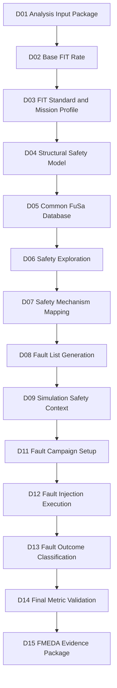
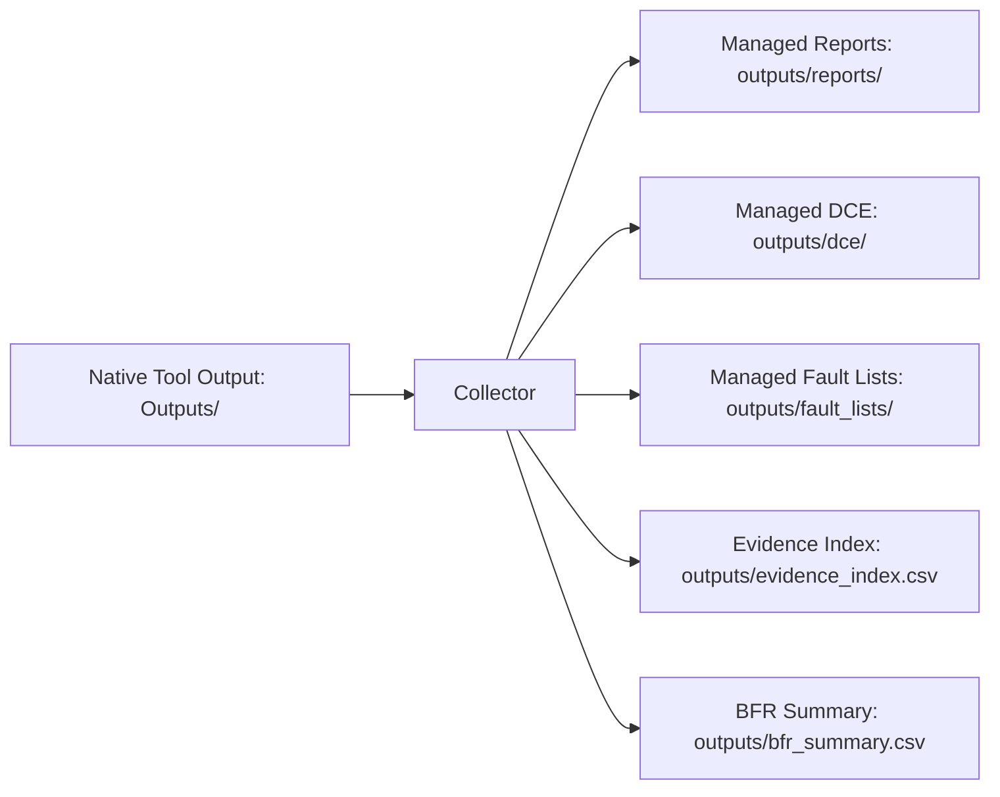
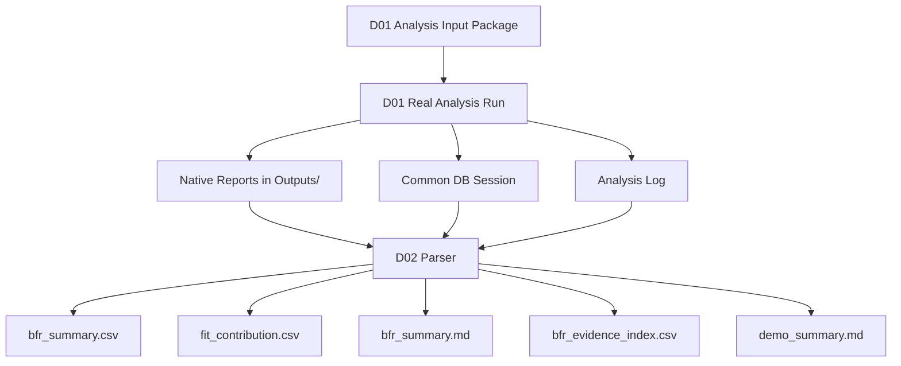

# [Automotive Safe-IC Practice 02] Base FIT Rate: Building the Random Hardware Failure Baseline

**Author**: Darren H. Chen  
**Direction**: Automotive Chip Functional Safety Analysis and Fault Injection Practice  
**Demo**: D02_base_fit_rate  
**Platform**: GitHub technical article + reproducible demo project  
**Tags**: Automotive Chip, Functional Safety, ISO 26262, ASIL, FIT, Base FIT Rate, Diagnostic Coverage, Fault List, DCE, FMEDA, FuSa Database, Evidence Traceability

---

## 1. Problem Context

The first article built a reproducible analysis input package.

D01 answered questions such as:

```text
Which RTL is analyzed?
Which top module is used?
Which clock definition is active?
Which FIT setup is used?
Which FIT standard is selected?
Which initialization file controls the run?
Where are reports, fault lists, logs, and database sessions stored?
```

D02 starts using that input package to build the first quantitative safety baseline:

```text
Base FIT Rate
```

Base FIT Rate, or BFR, is not the final functional safety result.

It is the starting point of the random hardware failure argument.

Before we can discuss diagnostic coverage, residual FIT, safety mechanism effectiveness, fault campaign results, or FMEDA evidence, we must understand the unprotected random hardware failure exposure of the design.

In other words, D02 asks:

> Before any safety mechanism is credited, how much random hardware failure risk does this design structure contribute?

The output of D02 is not only a number.

The output of D02 is an evidence package that connects:

```text
D01 input context
    -> real analysis run
    -> FIT calculation standard
    -> permanent and transient FIT values
    -> DCE-style artifacts
    -> summary reports
    -> database session
    -> machine-readable CSV/Markdown summary
```

This article explains the bottom-level concepts, the tool architecture, the file protocol, and the methodology behind D02.

---

## 2. What Is FIT?

FIT means **Failure In Time**.

A common engineering interpretation is:

```text
1 FIT = 1 failure per 10^9 operating hours
```

Equivalently:

```text
1 FIT = 10^-9 failures / hour
```

If a block has a failure rate of 10 FIT, the intuitive reading is:

```text
10 expected failures per 10^9 operating hours
```

This does not mean a particular chip will fail exactly after a fixed number of hours.

It means that, under the reliability model and operating assumptions used, the statistical failure rate is estimated as a normalized value.

At chip level, FIT depends on many factors:

```text
design structure
technology process
cell type
transistor count
memory size
package model
junction / ambient temperature
mission profile
operating ratio
manufacturing year
reliability prediction standard
```

That is why D01 treated the FIT setup file as a first-class safety artifact.

A FIT number without its input context is not reviewable.

---

## 3. What Is Base FIT Rate?

Base FIT Rate is the initial FIT rate before safety mechanisms are credited.

A useful mental model is:

```text
Base FIT Rate = unprotected random hardware failure exposure
```

It answers:

```text
How much random hardware failure contribution exists in the design before we claim that parity, ECC,
lockstep, duplication, monitors, alarms, or software diagnostics can cover it?
```

Base FIT Rate is therefore the denominator of many later safety arguments.


**Figure 1. Base FIT Rate is the risk baseline before diagnostic coverage is credited.**

A diagnostic coverage value such as `90%` is not meaningful by itself.

It must be connected to the failure-rate population it covers.

For example:

```text
Case A:
Base FIT = 1 FIT
Diagnostic Coverage = 90%
Residual FIT = 0.1 FIT

Case B:
Base FIT = 100 FIT
Diagnostic Coverage = 90%
Residual FIT = 10 FIT
```

The same coverage percentage leads to very different residual risk.

That is why BFR must be established early.

---

## 4. Base FIT Rate in the Safe-IC Lifecycle

D02 is not an isolated calculation.

It belongs to a larger lifecycle.



**Figure 2. D02 creates the quantitative baseline consumed by later safety exploration and FMEDA evidence.**

A mature flow calculates FIT more than once:

```text
early RTL stage:
  calculate Base FIT Rate to understand the raw exposure

after safety mechanisms are planned or inserted:
  re-run analysis to estimate diagnostic coverage and residual risk

after fault campaign:
  validate safety mechanism behavior with injected faults

near final signoff:
  calculate final metrics on the final implementation representation
```

D02 focuses only on the early baseline.

It should not claim final ASIL compliance.

---

## 5. Safety Analysis vs. Safety Verification

D02 is still part of **Safety Analysis**.

It is not yet a fault campaign.

### 5.1 Safety Analysis

Safety Analysis asks:

```text
What is the random hardware failure exposure?
Which design elements contribute to FIT?
Which endpoints and startpoints are relevant?
What diagnostic coverage can be estimated or credited?
Which artifacts should be stored as DCE, reports, fault lists, and database sessions?
```

In this series, the executable is represented by a neutral environment variable:

```text
SAFEIC_ANALYSIS_ENGINE
```

The actual tool is mapped by local demo configuration.

The public article does not need to hard-code a private tool command.

### 5.2 Safety Verification

Safety Verification asks:

```text
If a fault is injected under a real simulation context, does the safety mechanism detect it?
Does an alarm fire?
Does the fault propagate to an observe point?
Does the system enter a safe or unsafe state?
```

That part will be introduced later through:

```text
fault list
VCD / good machine context
alarm list
observe point list
fault campaign configuration
fault outcome classification
```

D02 only prepares the baseline and evidence model that later verification will consume.

---

## 6. Key Terms Used in D02

Before discussing the demo architecture, the following terms should be clear.

### 6.1 Random Hardware Fault

A random hardware fault is a fault that occurs during operation due to random physical effects.

Examples:

```text
transient bit flip
single event upset
permanent stuck-at fault
aging-related defect
interconnect defect
memory cell upset
```

D02 does not inject these faults.

D02 estimates the baseline failure-rate exposure associated with design structures.

### 6.2 Permanent Fault

A permanent fault persists after it occurs.

Examples:

```text
stuck-at-0
stuck-at-1
permanent open
permanent short
aging-induced permanent defect
```

A permanent fault may remain active until repair, reset, redundancy, or system replacement.

### 6.3 Transient Fault

A transient fault is temporary.

Examples:

```text
soft error
single-event upset
temporary storage element corruption
short-duration logic upset
```

It may disappear physically, but its effect can still be latched into the system state.

### 6.4 Lambda

`Lambda` is commonly used to represent failure rate.

D02 reports may contain fields such as:

```text
LambdaPermanent
LambdaTransient
Total LambdaPerm
Total LambdaTran
```

These values should be interpreted as FIT-related failure-rate contributions under the selected reliability model.

### 6.5 Diagnostic Coverage

Diagnostic Coverage, or DC, describes how much of the relevant failure population is detected, controlled, or made safe by safety mechanisms.

A simplified model is:

```text
DC = covered fault contribution / total relevant fault contribution
```

In Base FIT Rate analysis, DC is often zero because no safety mechanism is credited yet.

This is expected.

### 6.6 Residual FIT

Residual FIT is the risk left after diagnostic coverage is applied.

A simple conceptual formula is:

```text
Residual FIT = Base FIT × (1 - Diagnostic Coverage)
```

This is useful for intuition.

Real FMEDA calculations may split the result by failure mode, part, sub-part, safety mechanism, ASIL target, and classification policy.

### 6.7 DCE

DCE means Diagnostic Coverage Element.

A DCE-style artifact stores safety metric information for a module or block.

It enables hierarchical reuse:

```text
analyze IP block once
store block-level DCE
reuse DCE during subsystem or top-level analysis
avoid re-analyzing the same block repeatedly
```

DCE files also carry standard identity.

A DCE generated under one FIT standard should not be mixed with data generated under another standard.

### 6.8 Common FuSa Database Session

A Common FuSa Database is a structured evidence container.

A session is a named partition inside that database.

Example:

```text
outputs/db/toy_counter.fdb::D02_BFR
```

This should be read as:

```text
database file: outputs/db/toy_counter.fdb
session name:  D02_BFR
```

The database session allows D02 evidence to be reused by later analysis, fault campaign, and FMEDA-oriented steps.

---

## 7. D02 Input Contract

D02 consumes the D01 input package and the D01 real-analysis artifacts.

The minimum input contract is:

```text
D01_analysis_input_package/
  inputs/
    rtl/
    filelist/
    clock/
    fit/
    analysis/
  Outputs/
    <top>_SF_SA.metric.summary.rpt
    <top>_Coverage.rpt
    <top>_IEC_62380.DCE
    <top>.DCE
    <top>_Perm_EquivFault.list
    <top>_Perm_PrimaryFault.list
    <top>_Trans_EquivFault.list
    <top>_Trans_PrimaryFault.list
    *_Alarms.list
  outputs/
    db/
    manifest/
    tool_outputs_index.csv
  logs/
    analysis_engine.log
```

D02 should not depend on hidden interactive state.

It should be able to run from:

```text
D01 outputs
D01 logs
D01 manifest
D01 database session
```

If D01 has not been executed in real-analysis mode, D02 can still run in preflight mode, but it cannot claim that real BFR values were extracted.

---

## 8. Native Tool Outputs vs. Demo-Managed Outputs

D01 established an important directory rule:

```text
Outputs/  = native output directory produced by the configured analysis engine
outputs/  = demo-managed output directory used for indexing, normalized summaries, CSV, Markdown, and database paths
```

D02 follows the same rule.

The demo should not assume that the commercial-grade analysis engine will write directly into the repository-friendly directory layout.

Instead, the demo should collect and normalize native artifacts.



**Figure 3. D02 normalizes native analysis artifacts into demo-managed evidence files.**

This separation is practical.

It allows the demo to be readable on GitHub while preserving the real tool output convention.

---

## 9. D02 Tool Architecture

D02 should be implemented as a small evidence extraction and reporting pipeline.

Recommended structure:

```text
D02_base_fit_rate/
├── README.md
├── manifest.yaml
│
├── inputs/
│   ├── from_d01/
│   │   ├── analysis_engine.log
│   │   ├── tool_outputs_index.csv
│   │   ├── toy_counter_SF_SA.metric.summary.rpt
│   │   ├── toy_counter_Coverage.rpt
│   │   └── toy_counter_IEC_62380.DCE
│   │
│   └── analysis/
│       └── d02_config.yaml
│
├── scripts/
│   ├── run_demo.csh
│   └── run_demo.sh
│
├── tools/
│   ├── parse_bfr_report.py
│   ├── parse_analysis_log.py
│   ├── build_bfr_summary.py
│   ├── build_fit_contribution.py
│   └── build_evidence_index.py
│
├── outputs/
│   ├── bfr_summary.csv
│   ├── bfr_summary.md
│   ├── fit_contribution.csv
│   ├── bfr_evidence_index.csv
│   ├── bfr_interpretation.md
│   └── demo_summary.md
│
└── logs/
    └── run_demo.log
```

D02 does not need to rerun the analysis engine by default.

It should first parse and normalize the D01 results.

A later variant can provide an optional rerun mode.

---

## 10. D02 Data Flow

The D02 data flow is:



**Figure 4. D02 turns native BFR evidence into normalized, reviewable GitHub artifacts.**

The important method is:

```text
do not manually copy a number into the article
extract the number from real generated evidence
record the evidence source
make the summary reproducible
```

This turns BFR into an auditable artifact.

---

## 11. BFR Report Parsing Strategy

D02 should parse at least two types of evidence:

```text
metric summary report
analysis log
```

The preferred source is the metric summary report.

The log can be a fallback.

### 11.1 Example Pattern

A real BFR section may look conceptually like this:

```text
Analysis Results for toy_counter for FIT standard IEC_62380
----------------------------------------------------------------
*ModuleName LibType LambdaPermanent LambdaTransient DiagCoveragePerm DiagCoverageTran Nval
toy_counter MOS.ASIC.STDCELL 0.0000000779 0.0040250000 0.0000000000 0.0000000000 513

Total LambdaPerm = 0.0000000779
Total LambdaTran = 0.0040250000
Total DiagCoveragePerm = 0.0000000000
Total DiagCoverageTran = 0.0000000000
----------------------------------------------------------------
```

D02 should extract:

```text
top/module name
FIT standard
library / design type
LambdaPermanent
LambdaTransient
DiagCoveragePerm
DiagCoverageTran
Nval
Total LambdaPerm
Total LambdaTran
Total Diagnostic Coverage
evidence file path
```

### 11.2 Normalized CSV

Example `outputs/bfr_summary.csv`:

```csv
top,fit_standard,lib_type,lambda_permanent,lambda_transient,total_lambda,dc_perm,dc_tran,nval,evidence_source
toy_counter,iec_62380,MOS.ASIC.STDCELL,0.0000000779,0.0040250000,0.0040250779,0.0,0.0,513,inputs/from_d01/toy_counter_SF_SA.metric.summary.rpt
```

### 11.3 Markdown Summary

Example `outputs/bfr_summary.md`:

```md
# Base FIT Rate Summary

Top: toy_counter  
FIT standard: iec_62380  
Permanent FIT contribution: 0.0000000779  
Transient FIT contribution: 0.0040250000  
Total baseline FIT contribution: 0.0040250779  
Diagnostic coverage credited in BFR: 0.0  

## Interpretation

This is an early baseline result. Diagnostic coverage is zero because D02 does not yet credit safety mechanisms.
```

The CSV is for automation.

The Markdown is for review.

Both should be generated from the same parser.

---

## 12. Why Diagnostic Coverage Is Zero in D02

A common misunderstanding is:

```text
If diagnostic coverage is zero, the run failed.
```

This is wrong for BFR.

In D02, zero diagnostic coverage usually means:

```text
no safety mechanism has been credited yet
no safety mechanism map has been applied
no fault campaign result has been validated
the run is measuring baseline exposure
```

This is exactly the point of BFR.

D02 should explicitly state:

```text
BFR is the baseline before safety mechanism credit.
Zero DC in D02 is expected unless the design/configuration already includes credited safety mechanisms.
```

Later demos will introduce:

```text
safety mechanism mapping
safety exploration
fault list generation
fault injection
outcome classification
final DC validation
```

Only then does diagnostic coverage become the central result.

---

## 13. FIT Contribution Methodology

D02 should not stop at a single total value.

It should introduce the idea of FIT contribution.

FIT contribution asks:

```text
Which module, block, library type, memory, register group, or design element contributes how much to the total baseline FIT?
```

At the toy demo scale, there may be only one module row.

For a real SoC, the result may look like:

```csv
object,category,lambda_permanent,lambda_transient,total_lambda,percentage
cpu_core,stdcell,12.5,0.8,13.3,26.6
sram_0,memory,8.2,4.0,12.2,24.4
bus_matrix,stdcell,5.1,0.2,5.3,10.6
safety_ctrl,stdcell,2.7,0.1,2.8,5.6
```

This supports engineering decisions such as:

```text
Which block deserves safety mechanism investment first?
Where is the FIT budget being consumed?
Which memory or interface dominates the transient FIT?
Which block needs better diagnostic coverage?
Which DCE should be reused in top-level analysis?
```

D02 introduces this ranking logic.

D06 and D07 will later decide which safety mechanisms to map.

---

## 14. FIT Standard Identity

D02 must preserve FIT standard identity.

The same design analyzed under different standards or mission profiles may produce different values.

A normalized BFR row should therefore never be:

```csv
top,total_lambda
toy_counter,0.0040250779
```

It should be:

```csv
top,fit_standard,mission_profile,fit_setup,evidence_source,total_lambda
toy_counter,iec_62380,PassengerCompartment,inputs/fit/FIT_inputs.common.txt,metric_summary.rpt,0.0040250779
```

The FIT standard is part of the run identity.

So are:

```text
mission profile
manufacturing year
temperature assumptions
technology process
FIT setup file
analysis initialization file
database session
tool version if available
```

D02 should carry this metadata forward.

---

## 15. FIT Setup: Configuration Protocol

D02 inherits a key distinction from D01:

```text
analysis initialization file:
  key = value

FIT setup file:
  key value
```

The analysis initialization file controls the analysis run.

The FIT setup file controls reliability assumptions.

Example analysis initialization file:

```ini
mode = analysis
top = toy_counter
filelist = inputs/filelist/filelist.f
clkdef = inputs/clock/toy_counter.clk
fit_setup = inputs/fit/FIT_inputs.common.txt
fit_standard = iec_62380

write_fusa_db = true
fusa_db_name = outputs/db/toy_counter.fdb::D02_BFR
overwrite_session = true
```

Example FIT setup file:

```text
MissionProfileType PassengerCompartment
TemperatureJA 65
MFG_YEAR 2026
Process MOS.ASIC.STDCELL
```

This distinction is not cosmetic.

If a FIT setup parser expects `key value`, writing `key = value` can cause the value to be parsed incorrectly.

D02 should document the configuration protocol because BFR credibility depends on correct reliability setup.

---

## 16. Common Database Role in D02

The Common FuSa Database should not be treated as an optional side effect.

D02 should record:

```text
database file
session name
analysis mode
FIT standard
evidence source
```

Example evidence row:

```csv
artifact,type,path,session,used_by
toy_counter.fdb,database,outputs/db/toy_counter.fdb,D02_BFR,D05/D14/D15
```

The database supports later cross-tool flow:

```text
D05: database session organization
D08: fault list storage
D12: fault campaign result storage
D14: final metric validation
D15: FMEDA evidence export
```

The CSV and Markdown outputs help humans.

The database session helps the tool flow.

Both are needed.

---

## 17. DCE Role in D02

D02 should also index DCE artifacts.

Example:

```text
Outputs/toy_counter.DCE
Outputs/toy_counter_IEC_62380.DCE
```

A standard-specific DCE is especially important.

It tells later stages:

```text
this diagnostic coverage / FIT evidence was produced under IEC 62380
```

A D02 evidence index should include:

```csv
artifact,type,fit_standard,source_path,managed_path,used_by
toy_counter_IEC_62380.DCE,dce,iec_62380,Outputs/toy_counter_IEC_62380.DCE,outputs/dce/toy_counter_IEC_62380.DCE,D04/D05/D15
```

This makes hierarchical reuse explicit.

---

## 18. Fault List Outputs in D02

Even though D02 is about BFR, the real analysis run may already produce fault-list files.

Examples:

```text
<top>_Perm_EquivFault.list
<top>_Perm_PrimaryFault.list
<top>_Trans_EquivFault.list
<top>_Trans_PrimaryFault.list
```

D02 should index them, but not over-interpret them.

A small toy design may produce empty or near-empty fault lists.

That does not invalidate BFR.

D02 should state:

```text
Fault list files may exist in D02 because the analysis engine emits them as standard artifacts.
D02 indexes them as evidence, but detailed fault list methodology is handled in D08.
```

This prevents a common confusion:

```text
BFR result exists
fault list is empty
therefore the run failed
```

No.

BFR and fault campaign readiness are different milestones.

---

## 19. D02 Evidence Index

D02 should generate a unified index.

Example `outputs/bfr_evidence_index.csv`:

```csv
artifact,type,purpose,source_path,managed_path,used_by_later_demo
toy_counter_SF_SA.metric.summary.rpt,report,base FIT summary,Outputs/toy_counter_SF_SA.metric.summary.rpt,outputs/reports/toy_counter_SF_SA.metric.summary.rpt,D02/D03/D05
toy_counter_Coverage.rpt,report,coverage and endpoint information,Outputs/toy_counter_Coverage.rpt,outputs/reports/toy_counter_Coverage.rpt,D04/D07
toy_counter_IEC_62380.DCE,dce,standard-specific diagnostic coverage element,Outputs/toy_counter_IEC_62380.DCE,outputs/dce/toy_counter_IEC_62380.DCE,D04/D05/D15
toy_counter.fdb,database,Common FuSa database session,outputs/db/toy_counter.fdb,outputs/db/toy_counter.fdb,D05/D14/D15
analysis_engine.log,log,real analysis execution log,logs/analysis_engine.log,outputs/logs/analysis_engine.log,D19
```

This index becomes the bridge to D19 Evidence Traceability.

---

## 20. D02 Acceptance Criteria

D02 is complete when the demo can prove:

```text
[ ] D01 input package is available.
[ ] D01 real-analysis artifacts are available or preflight reports why they are missing.
[ ] BFR metric summary can be parsed.
[ ] FIT standard is explicitly recorded.
[ ] Permanent and transient lambda values are extracted.
[ ] Diagnostic coverage values are extracted and interpreted.
[ ] DCE files are indexed.
[ ] Common database session is indexed.
[ ] Native Outputs/ artifacts are collected into demo-managed outputs/.
[ ] bfr_summary.csv is generated.
[ ] bfr_summary.md is generated.
[ ] fit_contribution.csv is generated.
[ ] bfr_evidence_index.csv is generated.
[ ] demo_summary.md explains whether the run is preflight-only or real-data mode.
```

The core quality rule is:

> Every BFR value must point back to the file and run context that produced it.

---

## 21. Common Pitfalls

### 21.1 Treating BFR as Final Safety Result

BFR is only the baseline.

It does not prove ASIL compliance.

### 21.2 Ignoring the FIT Standard

The same number without the standard identity is not a stable safety metric.

### 21.3 Mixing Native and Managed Outputs

Keep:

```text
Outputs/ = native tool output
outputs/ = demo-managed output
```

Do not confuse the two.

### 21.4 Assuming Zero DC Means Failure

Zero DC is expected for a baseline run without credited safety mechanisms.

### 21.5 Parsing Logs Only

Prefer structured report files when available.

Use logs as fallback and trace evidence.

### 21.6 Losing Evidence Paths

A CSV number without an `evidence_source` column is not reviewable.

### 21.7 Over-Interpreting Toy Design Results

The toy design proves the flow.

It does not represent a production SoC.

---

## 22. Suggested D02 Demo Commands

The public demo can be run in two modes.

### 22.1 Preflight / Parse-Only Mode

```bash
cd D02_base_fit_rate
bash scripts/run_demo.sh
```

or:

```csh
cd D02_base_fit_rate
csh scripts/run_demo.csh
```

This mode checks whether D01 artifacts are available and attempts to parse them.

### 22.2 Real Data Mode

Real data mode is enabled by pointing D02 to a completed D01 run:

```text
D01_ROOT=/path/to/D01_analysis_input_package
```

Example csh-style setup:

```csh
setenv D01_ROOT /root/demos/D01_analysis_input_package
csh scripts/run_demo.csh
```

D02 should then copy or reference:

```text
$D01_ROOT/Outputs/
$D01_ROOT/outputs/db/
$D01_ROOT/logs/analysis_engine.log
$D01_ROOT/outputs/tool_outputs_index.csv
```

The actual analysis engine remains configured by D01.

D02 does not hard-code it.

---

## 23. Example D02 Summary

A successful D02 run may produce:

```md
# D02 Demo Summary

Demo: D02_base_fit_rate  
Source: ../D01_analysis_input_package  
Top: toy_counter  
FIT standard: iec_62380  
Mode: real-data parse  

## Extracted BFR

Permanent FIT contribution: 0.0000000779  
Transient FIT contribution: 0.0040250000  
Total FIT contribution: 0.0040250779  
Diagnostic coverage credited: 0.0  

## Evidence

- Metric summary report: outputs/reports/toy_counter_SF_SA.metric.summary.rpt
- Coverage report: outputs/reports/toy_counter_Coverage.rpt
- DCE: outputs/dce/toy_counter_IEC_62380.DCE
- Database: outputs/db/toy_counter.fdb::D02_BFR

## Interpretation

This is a baseline run. Diagnostic coverage is not credited yet.
```

This summary is not manually edited.

It is generated from evidence files.

---

## 24. Methodology: Why D02 Is More Than a Parser

It is tempting to view D02 as a small parsing demo.

That would miss the point.

D02 is the first time the series converts raw tool output into normalized safety evidence.

The methodology is:

```text
1. Use a reproducible input package.
2. Run or consume a real analysis result.
3. Extract BFR values from generated evidence.
4. Preserve FIT standard and reliability setup identity.
5. Normalize results into CSV and Markdown.
6. Index DCE, reports, fault lists, database, and logs.
7. Prepare the evidence for later safety exploration and FMEDA.
```

This is an engineering pattern that will repeat later:

```text
D08: parse and normalize fault lists
D13: parse and normalize fault outcomes
D14: parse and normalize final metrics
D19: unify all evidence into traceability index
```

D02 is where that evidence discipline begins.

---

## 25. How D02 Connects to D03

D03 will focus on:

```text
FIT Standards and Mission Profiles
```

D02 extracts one BFR result under one standard.

D03 will explain why that standard matters.

It will compare or at least structure the flow for:

```text
iec_62380
sn_29500
mission profile assumptions
temperature assumptions
manufacturing year
technology process
standard-specific DCE files
```

D02 therefore must preserve the metadata needed by D03.

Do not collapse the result into a single unlabeled number.

---

## 26. How D02 Connects to D04-D08

D04 will use structural safety concepts:

```text
endpoint
startpoint
DCE
diagnostic coverage element
hierarchical reuse
```

D05 will organize Common FuSa Database sessions.

D06 and D07 will plan safety mechanisms.

D08 will focus on fault lists.

D02 prepares these by producing:

```text
DCE index
coverage report index
FIT contribution ranking
database session record
fault list artifact index
```

---

## 27. How D02 Connects to FMEDA

FMEDA needs failure-rate contribution and diagnostic coverage evidence.

A simplified FMEDA row may include:

```text
part
sub-part
failure mode
base FIT
safety mechanism
diagnostic coverage
residual FIT
evidence source
```

D02 only fills the early part:

```text
part / block
base FIT
FIT standard
evidence source
```

Later demos will add:

```text
failure mode
safety mechanism map
fault campaign result
final DC
residual FIT
review status
```

D02 is therefore the first quantitative input to the FMEDA data model.

---

## 28. Review Checklist

A reviewer should be able to answer:

```text
What D01 run did D02 consume?
Which top module was analyzed?
Which FIT standard was used?
Which FIT setup file was used?
Which report produced the BFR value?
What are LambdaPermanent and LambdaTransient?
Is diagnostic coverage expected to be zero?
Which DCE files were generated?
Which database session stores the evidence?
Are native Outputs/ artifacts indexed into outputs/?
Can the BFR summary be regenerated?
Which later demos consume the BFR evidence?
```

If any of these answers are missing, D02 is not reviewable.

---

## 29. Summary

D02 introduces the first quantitative artifact in the Safe-IC practice flow:

```text
Base FIT Rate
```

The goal is not to claim final safety.

The goal is to build a reproducible, reviewable random hardware failure baseline.

D02 turns real analysis output into:

```text
bfr_summary.csv
bfr_summary.md
fit_contribution.csv
bfr_evidence_index.csv
demo_summary.md
```

The main lesson is:

> A Base FIT Rate value is only useful when it is tied to design scope, FIT standard, reliability setup, analysis initialization, DCE artifacts, database session, reports, and logs.

D01 created the input context.

D02 creates the baseline metric evidence.

Together, they form the first stable segment of the automotive Safe-IC analysis flow:

```text
input package
    -> base FIT baseline
    -> evidence index
    -> safety mechanism planning
    -> fault campaign
    -> FMEDA
```

---

## 30. D02 Demo Deliverables

Expected D02 deliverables:

```text
[ ] README.md
[ ] manifest.yaml

[ ] inputs/from_d01/analysis_engine.log
[ ] inputs/from_d01/tool_outputs_index.csv
[ ] inputs/from_d01/<top>_SF_SA.metric.summary.rpt
[ ] inputs/from_d01/<top>_Coverage.rpt
[ ] inputs/from_d01/<top>_IEC_62380.DCE

[ ] scripts/run_demo.csh
[ ] scripts/run_demo.sh

[ ] tools/parse_bfr_report.py
[ ] tools/parse_analysis_log.py
[ ] tools/build_bfr_summary.py
[ ] tools/build_fit_contribution.py
[ ] tools/build_evidence_index.py

[ ] outputs/bfr_summary.csv
[ ] outputs/bfr_summary.md
[ ] outputs/fit_contribution.csv
[ ] outputs/bfr_evidence_index.csv
[ ] outputs/bfr_interpretation.md
[ ] outputs/demo_summary.md

[ ] logs/run_demo.log
```

A successful D02 run should clearly answer:

> What is the baseline random hardware failure exposure of the design, under which FIT standard and reliability assumptions, and where is the evidence that produced it?
