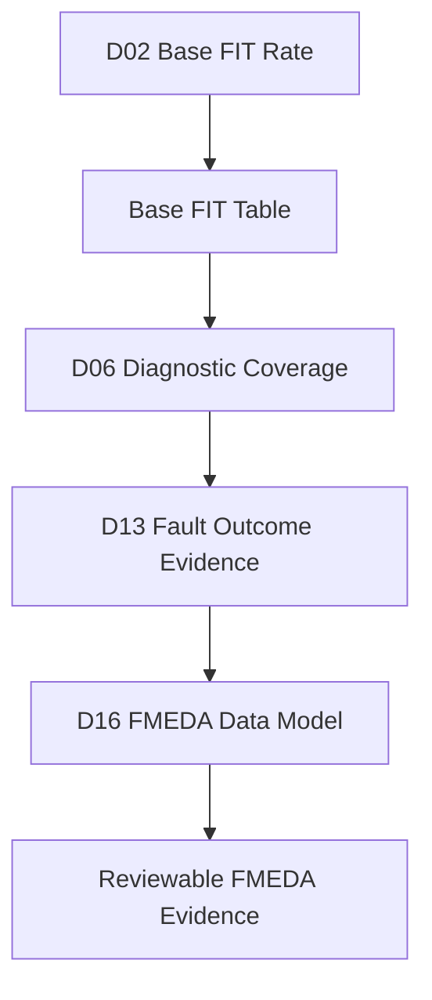
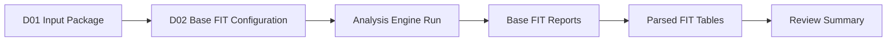
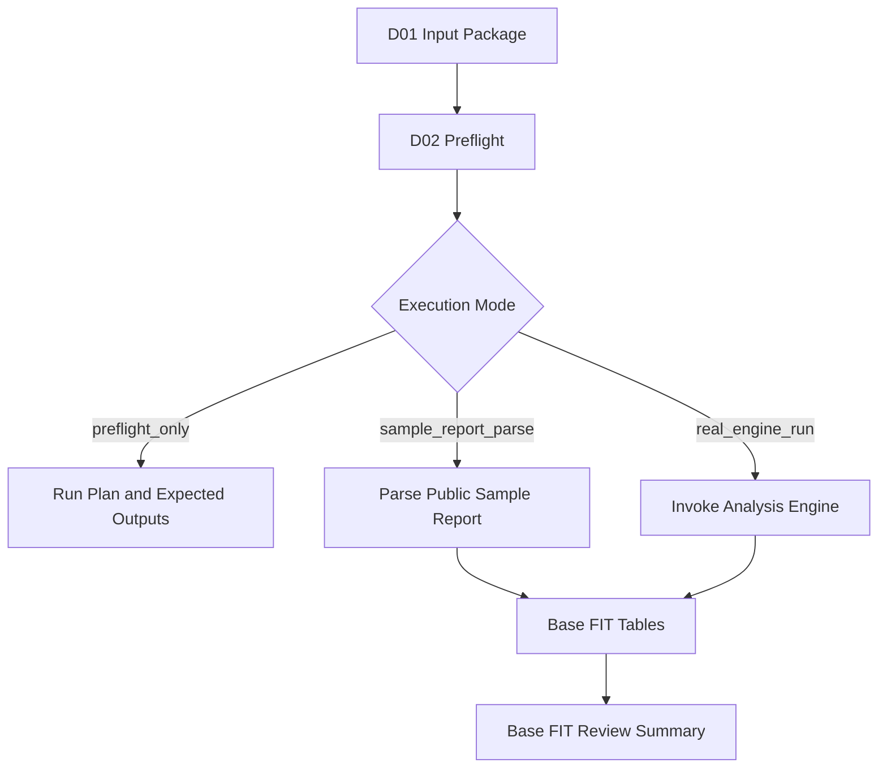
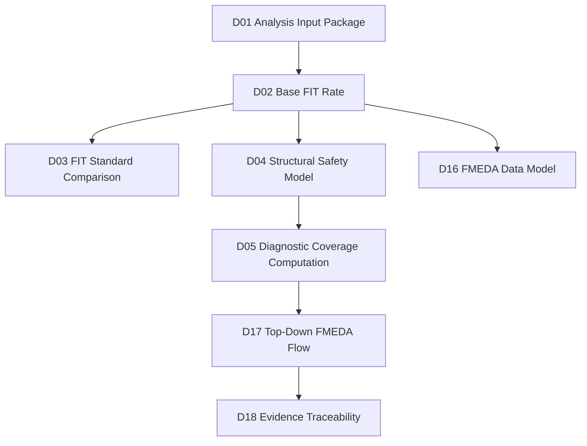

# [Automotive Safe-IC Practice 02] Base FIT Rate: Establishing the Random Hardware Failure Baseline

**Author**: Darren H. Chen  
**Direction**: Automotive Chip Functional Safety Analysis and Fault Injection Practice  
**Demo**: D02_base_fit_rate  
**Tags**: Automotive Chip, Functional Safety, ISO 26262, Random Hardware Failure, FIT, Base FIT Rate, IEC 62380, SN 29500, Diagnostic Coverage, FMEDA, Safety Analysis Flow

---

## 1. Problem Context

The first article built a reproducible analysis input package.

D01 focused on:

```text
RTL
filelist
clock definition
FIT setup
analysis configuration
manifest
preflight check
expected output index
optional analysis command
```

That input package answers:

```text
What design is being analyzed?
Which files are used?
Which clock model is used?
Which FIT setup is used?
Which FIT standard is selected?
How can the run be reproduced?
```

The second demo moves one step forward:

```text
D02_base_fit_rate
```

The goal of D02 is to establish the **Base FIT Rate** of the design.

Base FIT Rate is the random hardware failure baseline before diagnostic coverage and safety mechanisms are credited.

In a safety workflow, this is a foundational result.

Before asking:

```text
How much failure risk can the safety mechanism detect?
```

we must first ask:

```text
How much random hardware failure exposure exists before protection?
```

This article explains the technical meaning of Base FIT Rate, why it is required before diagnostic coverage, how a safety analysis engine consumes the D01 input package, and how the generated reports should be interpreted.

The public article and demo still use neutral names:

```text
analysis_engine
common_safety_database
DCE
coverage_report
base_fit_report
```

The actual tool executable is configured through environment variables and local setup scripts.

---

## 2. Why Base FIT Rate Comes Before Diagnostic Coverage

It is tempting to start functional safety analysis from diagnostic coverage.

For example:

```text
diagnostic coverage = 90%
```

But this number is incomplete by itself.

A 90% coverage value has different meaning depending on the underlying FIT contribution.

Example:

```text
Case A:
  base FIT = 10 FIT
  diagnostic coverage = 90%
  residual FIT = 1 FIT

Case B:
  base FIT = 100 FIT
  diagnostic coverage = 90%
  residual FIT = 10 FIT
```

The same diagnostic coverage leads to very different residual risk.

Therefore, Base FIT Rate must be known before diagnostic coverage can be interpreted.


**Figure 1. Base FIT Rate is the risk baseline that gives diagnostic coverage and residual FIT their meaning.**

The first principle of D02 is:

> Diagnostic coverage is not meaningful without knowing the base failure-rate contribution it covers.

---

## 3. Random Hardware Failure View

Automotive functional safety analysis often distinguishes systematic faults and random hardware faults.

D02 focuses on random hardware faults.

A simplified random hardware failure view is:

```text
hardware structure
  -> failure mechanism
  -> failure rate contribution
  -> failure mode
  -> potential safety impact
```

At chip level, the analysis may consider:

```text
logic cells
sequential elements
memories
clock/reset logic
interconnect
technology assumptions
package assumptions
mission profile
environmental profile
```

The purpose of Base FIT Rate is not to prove that the design is safe.

It answers a narrower question:

```text
What is the unprotected random hardware failure baseline of this design scope?
```

Safety mechanisms are considered later.

This separation is important.

If base failure-rate modeling and diagnostic coverage are mixed too early, the resulting safety argument becomes hard to review.

---

## 4. FIT and Base FIT Rate

FIT means Failure In Time.

A common engineering definition is:

```text
1 FIT = 1 failure per 10^9 operating hours
```

Base FIT Rate means the initial failure rate before safety mechanisms are credited.

In this series, D02 uses:

```text
Base FIT Rate
BFR
initial FIT
unprotected FIT baseline
```

as equivalent conceptual terms.

The Base FIT Rate can be grouped by:

```text
design block
part
sub-part
failure mode
endpoint
technology element
```

A simple output table may look like:

```csv
object,category,base_fit,standard
toy_counter.count,sequential_state,0.052,iec_62380
toy_counter.alarm,combinational_alarm,0.010,iec_62380
toy_counter.control,control_logic,0.016,iec_62380
```

This table is not the final FMEDA.

It is the beginning of a safety evidence chain.

---

## 5. Relationship Between Base FIT and FMEDA

FMEDA is usually where failure modes, FIT values, diagnostic coverage, residual FIT, and safety mechanisms are reviewed together.

Conceptually:

```text
FMEDA row =
  part/sub-part
  failure mode
  base FIT
  safety mechanism
  diagnostic coverage
  residual FIT
  review status
```

D02 only produces the early part of this row:

```text
part/sub-part
failure-rate baseline
possibly failure mode category
```

Later demos will add:

```text
estimated diagnostic coverage
measured diagnostic coverage
selected diagnostic coverage
fault campaign evidence
residual FIT
review actions
```



**Figure 2. Base FIT Rate is the initial quantitative input to later FMEDA evidence.**

The second principle of D02 is:

> FMEDA should not begin from an empty spreadsheet. It should begin from a traceable Base FIT Rate model.

---

## 6. Standards: IEC 62380 and SN 29500

D01 made the FIT standard explicit.

D02 uses that setting.

The two standard identifiers in this series are:

```text
iec_62380
sn_29500
```

The public demo does not need to reproduce the full mathematical content of these standards.

Instead, it demonstrates the engineering discipline:

```text
the selected standard is configured
the selected standard is recorded in the manifest
the selected standard appears in generated output names
the selected standard appears in the report summary
```

Example D02 configuration:

```ini
fit_standard = iec_62380
```

A later demo can compare:

```ini
fit_standard = sn_29500
```

The important point is that the standard is part of the run identity.

A Base FIT result without a standard label is incomplete.

---

## 7. D02 Input Dependency on D01

D02 should consume the D01 input package.

Required D01 artifacts:

```text
manifest.yaml
inputs/rtl/toy_counter.v
inputs/filelist/filelist.f
inputs/clock/toy_counter.clk
inputs/fit/FIT_inputs.common.txt
inputs/analysis/analysis_bfr.fusaini
outputs/preflight_check.csv
outputs/expected_analysis_outputs.csv
```

D02 adds a Base FIT run layer:

```text
inputs/base_fit/base_fit_config.yaml
scripts/run_base_fit.csh
tools/parse_base_fit_report.py
outputs/base_fit_summary.csv
outputs/base_fit_by_object.csv
outputs/base_fit_review.md
```

The flow is:



**Figure 3. D02 consumes D01 input context and produces parsed Base FIT artifacts.**

D02 should not silently recreate D01.

It should explicitly depend on it.

That makes the flow easier to review.

---

## 8. Tool Flow Abstraction

The real execution is abstracted as:

```text
analysis_engine --fusaini inputs/analysis/analysis_bfr.fusaini
```

The public script should call the configured executable:

```csh
$SAFEIC_ANALYSIS_ENGINE \
  --fusaini inputs/analysis/analysis_bfr.fusaini
```

But D02 should also support public preflight mode.

If the real engine is not configured, the demo can still generate:

```text
base_fit_expected_outputs.csv
base_fit_run_plan.md
base_fit_placeholder_summary.csv
```

This keeps the GitHub demo runnable while preserving the real-tool execution path.

Suggested execution modes:

```text
preflight_only
sample_report_parse
real_engine_run
```

### 8.1 preflight_only

Checks whether input package and configuration are complete.

### 8.2 sample_report_parse

Uses a public-safe sample report to demonstrate parsing and interpretation.

### 8.3 real_engine_run

Invokes the configured real analysis engine.

This three-mode design is important for public technical demonstration.

---

## 9. D02 Demo Architecture

D02 should contain three layers.



**Figure 4. D02 supports public preflight, sample report parsing, and optional real-engine execution.**

This structure allows the same demo to serve two audiences:

```text
public reader:
  can inspect methodology and run sample parsing

local engineer:
  can connect the real analysis engine and produce real reports
```

---

## 10. Input Data Model

D02 input data model extends D01.

```text
d01_context:
  manifest
  filelist
  clock_definition
  fit_setup
  analysis_config

base_fit:
  fit_standard
  run_mode
  expected_report_patterns
  sample_report
  output_parser_policy

toolchain:
  analysis_engine_env
  execution_shell
```

Suggested `inputs/base_fit/base_fit_config.yaml`:

```yaml
base_fit:
  name: toy_counter_base_fit
  top_module: toy_counter
  fit_standard: iec_62380
  execution_mode: sample_report_parse

inputs:
  d01_manifest: ../D01_analysis_input_package/manifest.yaml
  analysis_config: ../D01_analysis_input_package/inputs/analysis/analysis_bfr.fusaini
  fit_setup: ../D01_analysis_input_package/inputs/fit/FIT_inputs.common.txt
  sample_report: inputs/base_fit/sample_base_fit_report.rpt

toolchain:
  analysis_engine_env: SAFEIC_ANALYSIS_ENGINE

outputs:
  base_fit_by_object: outputs/base_fit_by_object.csv
  base_fit_by_category: outputs/base_fit_by_category.csv
  base_fit_summary: outputs/base_fit_summary.csv
  review: outputs/base_fit_review.md
```

The demo should not hide whether it used sample mode or real tool mode.

---

## 11. Output Data Model

D02 should produce structured output tables.

### 11.1 Base FIT by Object

```csv
object,object_type,category,base_fit,fit_standard,evidence_source
toy_counter.count[0],reg,sequential_state,0.013,iec_62380,sample_report
toy_counter.count[1],reg,sequential_state,0.013,iec_62380,sample_report
toy_counter.alarm,wire,alarm_logic,0.010,iec_62380,sample_report
```

### 11.2 Base FIT by Category

```csv
category,base_fit,percentage
sequential_state,0.052,66.67
alarm_logic,0.010,12.82
control_logic,0.016,20.51
```

### 11.3 Base FIT Summary

```csv
metric,value,unit
total_base_fit,0.078,FIT
dominant_category,sequential_state,text
fit_standard,iec_62380,text
execution_mode,sample_report_parse,text
```

These tables allow later demos to reason about failure-mode priorities.

---

## 12. Interpreting Base FIT Reports

A Base FIT report should not be treated as a final answer.

It should be interpreted as a quantitative baseline.

Key questions:

```text
What is the total base FIT?
Which objects or categories dominate?
Which failure-rate contributors should be mapped to failure modes?
Which categories require safety mechanisms?
Which values should flow into FMEDA?
Which assumptions should be reviewed?
```

For D02, a review summary may say:

```text
The sequential state category dominates the toy design Base FIT Rate.
This suggests that later failure-mode mapping should pay attention to state corruption and alarm-path observability.
```

This interpretation is more useful than simply printing a number.

---

## 13. Why Grouping Matters

Raw object-level FIT values can be too detailed.

Grouping makes engineering review possible.

Useful grouping dimensions:

```text
object type
design category
part
sub-part
failure mode candidate
safety mechanism candidate
```

For the toy design:

```text
sequential_state:
  count[3:0]

alarm_logic:
  alarm

control_logic:
  en path and update logic
```

The grouping does not have to be perfect in D02.

It only needs to create a traceable bridge from raw design objects to later FMEDA rows.

---

## 14. From Base FIT to Failure Mode Priority

Base FIT results help prioritize failure-mode analysis.

Example:

```csv
failure_mode_candidate,base_fit,priority_reason
FM_COUNTER_STATE_CORRUPTION,0.052,dominant sequential state contribution
FM_ALARM_NOT_ASSERTED,0.010,alarm path directly affects detection
FM_CONTROL_UPDATE_ERROR,0.016,control logic affects state transition
```

This is not yet final FMEDA.

It is an early planning view.


**Figure 5. Base FIT grouping supports failure-mode prioritization and later fault list generation.**

This is how D02 connects quantitative reliability modeling to safety engineering decisions.

---

## 15. Relationship to Diagnostic Coverage

Diagnostic coverage will later answer:

```text
How much of the base failure-rate contribution is detected or controlled?
```

Residual FIT can be simplified as:

```text
residual_fit = base_fit × (1 - diagnostic_coverage)
```

In practice, the actual formula and grouping may be more detailed.

However, the conceptual dependency is clear:

```text
base_fit first
diagnostic_coverage second
residual_fit third
```

This is why D02 must be completed before meaningful DC interpretation.

---

## 16. Relationship to Fault List Generation

Base FIT also informs fault list generation.

A fault list should not be a random set of signals.

It should reflect safety-relevant design objects and failure-mode priorities.

For example, if Base FIT review shows that counter state dominates the toy design risk, later fault list generation should include:

```text
toy_counter.count[0]
toy_counter.count[1]
toy_counter.count[2]
toy_counter.count[3]
```

If alarm logic is safety-relevant, later fault list generation should include:

```text
toy_counter.alarm
```

D02 does not generate the final fault list.

But it tells D08 what must not be ignored.

---

## 17. Relationship to Common Safety Database

A common safety database, or review workspace, is useful because Base FIT is not the final endpoint.

The same evidence must later connect to:

```text
DCE
coverage report
fault list
fault campaign result
FMEDA rows
failure mode mapping
safety mechanism mapping
```

D02 should therefore produce machine-readable outputs.

Do not rely only on human-readable reports.

The key idea is:

> If a Base FIT result cannot be parsed, indexed, and mapped forward, it cannot become reliable FMEDA evidence.

---

## 18. D02 Directory Structure

Recommended D02 structure:

```text
D02_base_fit_rate/
  README.md
  manifest.yaml

  inputs/
    base_fit/
      base_fit_config.yaml
      sample_base_fit_report.rpt

  scripts/
    setup_toolchain.template.csh
    run_demo.csh
    run_demo.sh

  tools/
    preflight_base_fit.py
    parse_base_fit_report.py
    summarize_base_fit.py

  outputs/
    base_fit_by_object.csv
    base_fit_by_category.csv
    base_fit_summary.csv
    failure_mode_priority_seed.csv
    base_fit_expected_outputs.csv
    base_fit_review.md
    demo_summary.md

  logs/
    run_demo.log

  docs/
    design_notes.md
```

The sample report allows public readers to run the parser without a real tool.

The optional real engine path allows local engineers to execute the actual flow.

---

## 19. csh Execution Path

D02 should keep csh as a first-class execution path.

Example:

```csh
#!/bin/csh -f

set DEMO = D02_base_fit_rate
set ROOT = `cd "$0:h/.." && pwd`

cd "$ROOT"

if ( -e scripts/setup_toolchain.local.csh ) then
  source scripts/setup_toolchain.local.csh
else
  source scripts/setup_toolchain.template.csh
endif

mkdir -p outputs logs

python3 tools/preflight_base_fit.py \
  --manifest manifest.yaml \
  |& tee logs/run_demo.log

python3 tools/parse_base_fit_report.py \
  --config inputs/base_fit/base_fit_config.yaml \
  --report inputs/base_fit/sample_base_fit_report.rpt \
  --output-dir outputs \
  |& tee -a logs/run_demo.log
```

If the real engine is configured, the script may optionally generate or invoke:

```text
outputs/base_fit_command.csh
```

But the public run should succeed without it.

---

## 20. Sample Report Parsing

Public demo should include a small sample report.

Example:

```text
# sample_base_fit_report.rpt

Base FIT Rate Report
Top: toy_counter
FIT Standard: iec_62380

Object                         Type        Category           BaseFIT
toy_counter.count[0]           reg         sequential_state   0.013
toy_counter.count[1]           reg         sequential_state   0.013
toy_counter.count[2]           reg         sequential_state   0.013
toy_counter.count[3]           reg         sequential_state   0.013
toy_counter.alarm              wire        alarm_logic        0.010
toy_counter.en_path            logic       control_logic      0.016

Total Base FIT: 0.078
```

The parser should generate CSV tables.

This demonstrates engineering capability:

```text
not only running a tool
but converting tool report content into structured evidence
```

---

## 21. Review Summary

D02 should generate:

```text
outputs/base_fit_review.md
```

It should explain:

```text
total base FIT
dominant category
object-level contributors
failure-mode priority seed
standard used
execution mode
limitations
next step
```

Example:

```md
# Base FIT Review

Top module: toy_counter  
FIT standard: iec_62380  
Total Base FIT: 0.078 FIT  

## Dominant Contributor

The sequential_state category contributes 0.052 FIT, which is 66.67% of the total base FIT.

## Engineering Interpretation

Later structural safety modeling and fault list generation should prioritize counter state corruption and alarm-path behavior.

## Limitations

This public demo uses a simplified sample report and does not represent production FIT signoff.
```

The report should be engineering-readable, not just raw output.

---

## 22. Tool Architecture

D02 helper tools:

```text
tools/
  preflight_base_fit.py
  parse_base_fit_report.py
  summarize_base_fit.py
```

Responsibilities:

| Module | Responsibility |
|---|---|
| `preflight_base_fit.py` | Validate D01 dependency and D02 configuration |
| `parse_base_fit_report.py` | Parse sample or real report into structured CSV |
| `summarize_base_fit.py` | Generate category summary and review markdown |

This modularity matters.

Parsing, summarization, and preflight should not be mixed into one large script.

---

## 23. Common Pitfalls

### 23.1 Treating Base FIT as Final Safety Metric

Base FIT is the unprotected baseline, not the final residual risk.

### 23.2 Forgetting the FIT Standard

A Base FIT number without standard context is incomplete.

### 23.3 Not Grouping Contributors

Object-level FIT tables need grouping to support safety decisions.

### 23.4 Mixing Diagnostic Coverage Too Early

D02 should not credit safety mechanisms prematurely.

### 23.5 Using Unparseable Reports Only

Human-readable reports are useful, but structured CSV outputs are necessary for later flow automation.

### 23.6 Hiding Execution Mode

A sample-report run and a real-engine run must be labeled differently.

---

## 24. Review Checklist

A reviewer should be able to answer:

```text
Which D01 input package is used?
Which FIT standard is selected?
Was the run sample mode or real engine mode?
What is the total Base FIT?
Which objects dominate the Base FIT?
Which categories dominate the Base FIT?
Which failure-mode candidates should be prioritized?
Which outputs will later feed diagnostic coverage and FMEDA?
Are assumptions and limitations visible?
```

If these questions cannot be answered, the Base FIT result is not review-ready.

---

## 25. How D02 Connects to Later Demos

D02 provides the quantitative baseline for the next steps.



**Figure 6. D02 provides the Base FIT baseline for structural analysis, diagnostic coverage, and FMEDA evidence.**

Without D02, later diagnostic coverage and residual FIT discussions are disconnected from quantitative risk.

---

## 26. Summary

D02 introduces the first quantitative safety-analysis result in the series:

```text
D02_base_fit_rate
```

It consumes the D01 input package and establishes:

```text
Base FIT Rate
FIT standard context
object-level FIT contribution
category-level FIT contribution
failure-mode priority seed
structured output tables
review summary
```

The core lesson is:

> Base FIT Rate is the random hardware failure baseline. It must be established before diagnostic coverage, residual FIT, fault prioritization, and FMEDA review can be interpreted.

D02 proves that the flow is not just a collection of commands.

It is a traceable engineering pipeline from input context to quantitative safety baseline.

---

## 27. D02 Demo Checklist

Expected D02 deliverables:

```text
[ ] README.md
[ ] manifest.yaml

[ ] inputs/base_fit/base_fit_config.yaml
[ ] inputs/base_fit/sample_base_fit_report.rpt

[ ] scripts/setup_toolchain.template.csh
[ ] scripts/run_demo.csh
[ ] scripts/run_demo.sh

[ ] tools/preflight_base_fit.py
[ ] tools/parse_base_fit_report.py
[ ] tools/summarize_base_fit.py

[ ] outputs/base_fit_by_object.csv
[ ] outputs/base_fit_by_category.csv
[ ] outputs/base_fit_summary.csv
[ ] outputs/failure_mode_priority_seed.csv
[ ] outputs/base_fit_expected_outputs.csv
[ ] outputs/base_fit_review.md
[ ] outputs/demo_summary.md

[ ] logs/run_demo.log

[ ] docs/design_notes.md
```

A successful D02 run should answer:

```text
Was the Base FIT Rate context complete?
Which FIT standard was used?
What is the total Base FIT?
Which objects and categories dominate?
How should failure-mode analysis be prioritized?
Can the result feed diagnostic coverage and FMEDA?
Can the run be reproduced or replayed?
```
