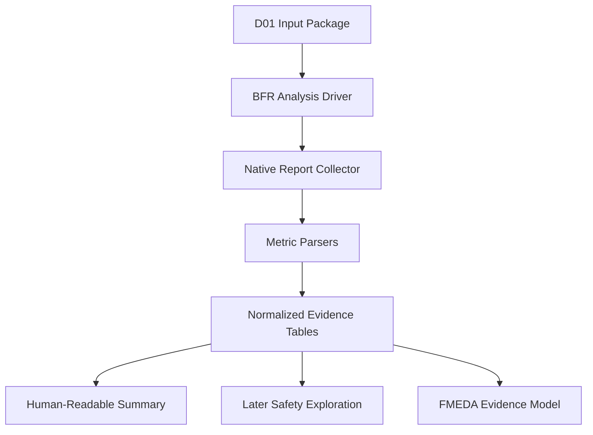

# Automotive Safe-IC Practice 02: Base FIT Rate — From BFR to FIT Contribution Report

Author: Darren H. Chen

Direction: Automotive Chip Functional Safety / Safe-IC Verification Platform

Demo: D02_base_fit_rate

Tags: ISO 26262, Functional Safety, Safe-IC, FIT, BFR, Random Hardware Failure, Mission Profile, IEC 62380, SN 29500, FMEDA, Diagnostic Coverage

---

## 1. Why D02 Starts from Base FIT Rate

In a safety-oriented semiconductor workflow, the first engineering question after building a reproducible input package is not:

```text
Can the design pass a fault campaign?
```

The first question is:

```text
How much random hardware failure exposure does the design have before safety mechanisms are credited?
```

That question is the purpose of **Base FIT Rate**, usually abbreviated as **BFR**.

D01 established the input context:

```text
RTL or netlist
filelist
top module
clock definition
FIT setup
mission profile assumptions
analysis initialization file
common safety database location
expected output index
```

D02 uses that context to compute and interpret the first safety analysis result:

```text
Base FIT Rate
```

BFR is the baseline failure-rate picture of a hardware function before the design team claims diagnostic coverage from safety mechanisms. It tells us which parts of the design contribute most to random hardware failure risk and where later safety work should focus.

This is why D02 is not a “run a command and print a number” demo. It is the first result interpretation stage of the evidence chain.

A mature Safe-IC flow needs three layers around BFR:

```text
1. calculation layer      -> produce base FIT metrics
2. interpretation layer   -> understand high-contribution structures
3. evidence layer         -> preserve reports, assumptions, and summaries for later FMEDA work
```

D02 is about all three layers.

---

## 2. What FIT Means

**FIT** means **Failure In Time**.

The common definition is:

```text
1 FIT = 1 failure per 1,000,000,000 operating hours
```

If the hardware failure rate is represented as lambda per hour:

```text
FIT = lambda × 1,000,000,000
lambda = FIT × 1e-9 failures/hour
```

FIT is not a simulation coverage number. It is not a pass/fail verification result. It is a reliability-oriented failure-rate unit used to quantify the likelihood of random hardware faults over time.

In a semiconductor context, FIT can include several physical or technology-related contributors, such as:

```text
die-related random defects
package-related failures
memory-related failures
interface-related failures
technology-dependent failure mechanisms
temperature and mission profile effects
```

Different reliability models may decompose these contributors differently. The practical engineering rule is simple:

> A FIT value is meaningful only when the calculation standard, mission profile, technology assumptions, and design context are known.

A number without context is not evidence.

---

## 3. Random Hardware Faults vs. Systematic Faults

Functional safety analysis separates two broad fault categories.

### 3.1 Systematic Faults

A **systematic fault** is caused by a development, specification, implementation, verification, manufacturing, or process weakness.

Examples include:

```text
incorrect RTL implementation
wrong reset behavior
wrong requirement interpretation
missing verification scenario
incorrect integration assumption
software bug
incorrect safety manual assumption
```

Systematic faults are mainly controlled by engineering process:

```text
requirements traceability
review
coding rules
static checks
simulation
formal verification
regression
configuration management
change management
tool confidence
```

D02 does not attempt to quantify systematic fault probability with FIT.

### 3.2 Random Hardware Faults

A **random hardware fault** occurs during operation due to physical effects, aging, environmental conditions, radiation, or other probabilistic mechanisms.

Examples include:

```text
stuck-at behavior
transient bit flip
memory cell upset
sequential element upset
package-related failure
interface-related electrical stress
```

Random hardware faults are the primary scope of FIT calculation. BFR gives the baseline view before later steps introduce or validate safety mechanisms.

### 3.3 Why This Distinction Matters

A functional verification pass can show that the RTL behaves correctly under intended stimulus. It does not automatically prove that the design is robust against random hardware faults during operation.

A BFR analysis asks a different question:

```text
If random hardware faults can occur in this design, how much failure-rate exposure exists and where is it concentrated?
```

That is the reason D02 belongs after D01 and before safety mechanism exploration.

---

## 4. What Base FIT Rate Is

**Base FIT Rate** is the initial FIT calculation for a hardware function before diagnostic coverage from inserted or validated safety mechanisms is credited.

A simplified conceptual model is:

```text
Base FIT = FIT_die + FIT_package + FIT_memory + FIT_interface + FIT_other
```

A more detailed implementation may break the result down by:

```text
module
instance
endpoint
startpoint
register group
memory macro
clock domain
technology class
failure mode
```

The important point is that BFR is a **baseline**.

It answers:

```text
How exposed is the design before protection is credited?
Which structures dominate the FIT contribution?
Which structures are likely to need safety mechanisms?
Which reports should feed the next safety exploration stage?
```

It does not answer:

```text
Has the design reached ASIL-D?
Are all safety mechanisms validated?
Is diagnostic coverage proven by fault injection?
Are final SPFM/LFM/PMHF metrics closed?
```

Those questions belong to later stages.

D02 should therefore be read as the **baseline metrics article**, not the final safety sign-off article.

---

## 5. Where D02 Sits in the 20-Demo Flow

This series uses a 20-demo engineering flow for a Safe-IC functional safety platform. D02 is the second step.

The immediate local sequence is:

```text
D01 Analysis Input Package
        ↓
D02 Base FIT Rate
        ↓
D03 FIT Standards and Mission Profile
        ↓
D04 Structural Building Blocks
        ↓
D05 Common Safety Database
```

D02 consumes the D01 input package and creates the first set of metric-oriented evidence.

Later demos reuse D02 outputs:

```text
D06 Safety Exploration
D07 Safety Mechanism Map
D08 Fault List Generation
D14 Fault Campaign Result Back-annotation
D15 FMEDA Data Model
D19 Evidence Traceability
D20 End-to-End Mini Flow
```

D02 is therefore not an isolated report parser. It is the first bridge between raw design inputs and safety decision-making.

---

## 6. D02 Input Contract

D02 should not guess where inputs are located. It should consume a deterministic package produced by D01.

A practical D02 input contract can look like this:

```text
D02_base_fit_rate/
  manifest.yaml
  inputs/
    rtl/
    filelist/
    clock/
    fit/
    analysis/
  outputs/
    db/
    reports/
    dce/
    fault_lists/
  logs/
```

The key input artifacts are:

| Artifact | Purpose |
|---|---|
| RTL or netlist filelist | Defines the design content under analysis |
| top module | Defines the hardware function boundary |
| clock definition | Defines sequential context and clock domains |
| FIT setup | Defines reliability and mission-profile assumptions |
| analysis initialization file | Defines the analysis mode and input references |
| common safety database session | Preserves analysis state for later stages |
| expected output index | Defines which reports should be collected and parsed |

A BFR run is not reproducible unless these are explicit.

---

## 7. Why Clock Definition Affects Safety Analysis

Clock definition is often treated as a minor setup file in ordinary flows. In functional safety analysis, it is more important.

A safety analysis engine needs to understand sequential structure:

```text
which elements are registers
which registers belong to which clock domain
where fault propagation may be observed
which cones are timing-related
which state elements are meaningful for endpoint contribution
```

If a clock is missing or incorrectly defined, the analysis may still parse RTL, but the structural safety interpretation can be wrong.

For example:

```text
same RTL + correct clock definition    -> meaningful sequential structure
same RTL + missing clock definition    -> incomplete structural interpretation
same RTL + wrong clock grouping        -> misleading contribution boundaries
```

This is why D02 should always record the clock definition used for the BFR result.

---

## 8. Mission Profile: The Hidden Multiplier Behind FIT

A **mission profile** describes the assumed operating conditions of the product.

Typical factors include:

```text
operating temperature
junction temperature assumption
on-time and off-time
vehicle usage profile
environment class
technology process assumption
package assumption
voltage or stress condition
lifetime distribution
```

The same design can produce different FIT values under different mission profiles.

A simplified way to think about mission profile is:

```text
intrinsic component reliability × operating stress model = mission-adjusted failure rate
```

The RTL structure tells the tool what exists in the design.

The mission profile tells the tool under what operating assumptions the design is evaluated.

Both are required.

---

## 9. IEC 62380 and SN 29500 in D02

D03 will focus on reliability standards in more detail. D02 only needs the engineering interpretation.

Two reliability standards often appear in automotive semiconductor safety analysis:

```text
IEC 62380
SN 29500
```

At a practical level, both can be used to estimate failure rates, but they rely on different modeling assumptions, parameter tables, and mission-profile handling approaches.

D02 should therefore never compare two FIT numbers unless the report records:

```text
which standard was used
which mission profile was used
which technology assumptions were used
which input design was used
which analysis configuration was used
```

A D02 summary should contain a field such as:

```text
fit_standard: iec_62380
```

or:

```text
fit_standard: sn_29500
```

The important engineering principle is:

> The FIT standard is part of the metric identity. It is not a cosmetic option.

---

## 10. BFR and FIT Contribution

A total FIT value is useful, but it is not enough.

The real engineering value of D02 is the **FIT contribution report**.

A FIT contribution report explains where the total FIT comes from.

A simplified contribution table may look like this:

```text
structure,category,fit,contribution_percent,review_hint
ctrl_fsm,sequential,example_value,example_percent,review state protection
counter_reg,sequential,example_value,example_percent,review endpoint behavior
status_logic,combinational,example_value,example_percent,review alarm propagation
memory_if,interface,example_value,example_percent,review memory protection assumption
```

The numeric values above are placeholders. In a real flow, D02 should parse the actual vendor-native report and convert it into a stable public summary format.

The engineering use of contribution data is:

```text
rank high-contribution structures
identify candidates for safety mechanism exploration
prioritize review of endpoint and startpoint usage
connect structural risk to later FMEDA rows
avoid spending time on low-impact protection first
```

This is the first moment where functional safety analysis becomes architectural guidance.

---

## 11. Endpoint, Startpoint, and Contribution: A Preview

D04 will discuss structural building blocks in more detail. D02 only needs a preview because contribution reports often reference these ideas.

### 11.1 Endpoint

An **endpoint** is a structural observation or destination point in the design where fault propagation becomes relevant to safety analysis.

Examples may include:

```text
state registers
output registers
control outputs
alarm-related signals
interface response signals
```

An endpoint is not necessarily a top-level port. It is a structural point used by the analysis model.

### 11.2 Startpoint

A **startpoint** is a structural source from which fault effects may propagate.

Examples may include:

```text
register outputs
combinational drivers
memory outputs
interface sources
```

### 11.3 Contribution

A contribution report connects the analysis model to design structure:

```text
which startpoints feed which endpoints
which endpoints dominate the FIT contribution
which structures may benefit from safety mechanisms
```

D02 does not close diagnostic coverage. It creates the evidence needed to decide where coverage work should begin.

---

## 12. Diagnostic Coverage Is Not Yet Proven in D02

**Diagnostic Coverage**, or **DC**, measures how effectively safety mechanisms detect or control faults.

A simplified residual-risk model is:

```text
residual FIT = original FIT × (1 - diagnostic coverage)
```

For example, if a structure contributes FIT and a later safety mechanism detects a percentage of relevant faults, the remaining undetected portion becomes residual exposure.

However, D02 does not prove DC.

D02 only establishes the baseline:

```text
before safety mechanism credit
before fault injection campaign
before final fault classification
```

DC-related files may already appear as expected artifacts or DCE-style analysis outputs, but D02 should not claim final DC closure.

The correct D02 statement is:

```text
BFR identifies the baseline failure-rate contribution that later diagnostic coverage work must reduce or justify.
```

---

## 13. DCE-Style Output: Why It Matters Early

A **DCE-style output** can be understood as a structured diagnostic coverage element artifact.

Even when D02 focuses on BFR, a DCE-style file can become important later because it helps connect:

```text
structural elements
failure assumptions
safety mechanism mapping
diagnostic coverage estimates
fault list generation
final metric calculation
```

D02 should treat DCE-style output as a handoff artifact.

It is not the final proof of safety. It is part of the structured evidence chain.

A useful D02 artifact index should record:

```text
artifact path
artifact type
producer stage
consumer stage
standard used
design top
session name
checksum or timestamp
```

This prevents later demos from guessing which file belongs to which run.

---

## 14. Tool Architecture for D02

A robust D02 demo should separate the workflow into five layers.



### 14.1 Analysis Driver

The driver should not hard-code private tool paths.

A neutral execution interface is enough:

```csh
if ( ! $?SAFEIC_ANALYSIS_ENGINE ) then
  echo "[WARN] SAFEIC_ANALYSIS_ENGINE is not configured."
  echo "[WARN] D02 will parse available reports only."
else
  $SAFEIC_ANALYSIS_ENGINE \
    --config inputs/analysis/analysis_bfr.cfg \
    --workdir .
endif
```

This expresses the engineering protocol without exposing vendor-specific commands.

### 14.2 Native Report Collector

Commercial and internal tools often produce their own directory and naming conventions.

D02 should collect native outputs into a managed evidence tree:

```text
native_outputs/      -> tool-native files, not rewritten
outputs/reports/     -> normalized report copies or summaries
outputs/tables/      -> CSV / JSON extracted data
outputs/evidence/    -> evidence index and manifest
```

The rule is:

```text
Never destroy native evidence.
Always create normalized views beside it.
```

### 14.3 Metric Parsers

Parsers should produce stable machine-readable outputs:

```text
outputs/tables/bfr_summary.csv
outputs/tables/fit_contribution.csv
outputs/tables/artifact_index.csv
outputs/tables/run_assumptions.csv
```

The parser should not depend on exact log wording if a structured report exists. Logs are useful for troubleshooting, but reports are better evidence sources.

### 14.4 Human-Readable Summary

A reviewer should not need to inspect every raw report to understand the run.

D02 should generate:

```text
outputs/demo_summary.md
```

It should answer:

```text
Which design was analyzed?
Which top was used?
Which FIT standard was selected?
Which mission profile was referenced?
Was the analysis run, parsed, or only prepared?
What total BFR was extracted?
Which structures dominate contribution?
Which artifacts will D03/D04/D06 consume?
```

---

## 15. Suggested D02 Repository Layout

A GitHub-friendly D02 demo can use this layout:

```text
D02_base_fit_rate/
  README.md
  manifest.yaml

  inputs/
    analysis/
      analysis_bfr.cfg
    fit/
      FIT_inputs.common.txt
    references/
      README.md

  scripts/
    run_demo.csh
    run_demo.sh
    setup_toolchain.template.csh

  tools/
    parse_bfr_summary.py
    parse_fit_contribution.py
    build_evidence_index.py
    summarize_bfr.py

  native_outputs/
    .gitkeep

  outputs/
    tables/
      bfr_summary.csv
      fit_contribution.csv
      run_assumptions.csv
      artifact_index.csv
    reports/
      bfr_summary.md
    evidence/
      base_fit_evidence_index.csv
    demo_summary.md

  logs/
    .gitkeep

  docs/
    bfr_methodology.md
```

The key design rule is that D02 must run in two modes:

```text
report-available mode   -> parse real BFR artifacts if present
preparation mode        -> validate configuration and explain expected artifacts
```

This keeps the demo useful for public readers who do not have access to the private analysis engine.

---

## 16. D02 Command Protocol

The public command protocol should be stable and minimal.

For csh-based EDA environments:

```csh
cd D02_base_fit_rate
csh scripts/run_demo.csh
```

For bash-based public environments:

```bash
cd D02_base_fit_rate
bash scripts/run_demo.sh
```

The csh entry point should follow this principle:

```csh
if ( ! $?SAFEIC_PYTHON ) then
  setenv SAFEIC_PYTHON python3.8
endif

$SAFEIC_PYTHON tools/parse_bfr_summary.py \
  --manifest manifest.yaml \
  --output outputs/tables/bfr_summary.csv
```

The execution command is intentionally small because the workflow logic belongs in tools and configuration files, not in a fragile shell script.

The real analysis engine, when available, should be injected by environment variable:

```csh
setenv SAFEIC_ANALYSIS_ENGINE /path/to/local/analysis_engine
```

This allows the public repository to remain portable.

---

## 17. What the BFR Summary Should Contain

A normalized BFR summary should contain at least:

```text
design_name
top_module
analysis_stage
fit_standard
mission_profile
technology_assumption
package_assumption
base_fit_total
report_path
dce_path
database_session
status
```

A CSV schema can be:

```csv
field,value
analysis_stage,base_fit_rate
design_name,toy_counter
top_module,toy_counter
fit_standard,iec_62380
mission_profile,passenger_compartment_example
technology_assumption,example_technology
base_fit_total,PARSED_FROM_NATIVE_REPORT
metric_report,outputs/reports/metric_summary.rpt
dce_artifact,outputs/dce/design_standard.dce
database_session,outputs/db/design.fdb::D02_BFR
status,parsed_or_prepared
```

The value `PARSED_FROM_NATIVE_REPORT` is not a real result. It indicates where the parser should place the actual value when the native report is available.

---

## 18. What the FIT Contribution Table Should Contain

A normalized contribution table should allow later ranking and review.

A practical schema is:

```csv
rank,structure_path,structure_type,fit,contribution_percent,clock_domain,review_hint,next_stage
1,PARSED_PATH,endpoint_or_instance,PARSED_FIT,PARSED_PERCENT,PARSED_CLOCK,review high contributor,D04/D06
```

The most important fields are:

| Field | Meaning |
|---|---|
| rank | Contribution order, usually descending |
| structure_path | Module, instance, endpoint, or structural path |
| structure_type | Register, memory, endpoint, combinational cone, instance, etc. |
| fit | Failure-rate contribution of this structure |
| contribution_percent | Share of total BFR |
| clock_domain | Sequential context if available |
| review_hint | Human-readable next action |
| next_stage | Which later demo consumes this row |

This table is the bridge from analysis result to engineering action.

---

## 19. Reading FIT Contribution as an Architect

The wrong way to read a FIT contribution report is:

```text
Find the biggest number and blindly duplicate that logic.
```

The better way is to ask a sequence of architectural questions.

### 19.1 Is the Contributor Safety-Relevant?

A high FIT contribution may belong to logic that does not affect a safety goal. It still matters, but the safety relevance must be established.

Ask:

```text
Can this structure influence a hazardous output?
Can it corrupt a control decision?
Can it suppress an alarm?
Can it cause a latent unsafe state?
```

### 19.2 Is It Already Protected?

A high-contribution structure may already be protected by:

```text
lockstep
parity
ECC
redundant computation
range checking
watchdog
protocol checker
software monitor
```

If so, D02 should not claim closure. It should mark the structure for later DC validation.

### 19.3 Is the Protection Assumption Creditable?

A protection mechanism is only useful if it can be justified.

Questions include:

```text
Does the safety mechanism detect the relevant fault model?
Does the alarm arrive within the required time?
Is the checker independent enough?
Can the fault escape through a shared common-cause path?
Is the reaction safe-state behavior defined?
```

These questions are outside D02’s final scope but should guide the review hints.

### 19.4 Is the Structure Better Handled by Architecture or Verification?

Some contributors are best addressed by design changes.

Others are best addressed by better stimulus or observation in a later fault campaign.

D02 should classify follow-up direction:

```text
architecture review
safety mechanism exploration
fault list generation
simulation context improvement
FMEDA row preparation
```

---

## 20. BFR Is a Baseline, Not a Verdict

BFR can create false confidence if misunderstood.

A low total FIT does not automatically mean the design is safe.

A high total FIT does not automatically mean the design is unacceptable.

The safety case depends on:

```text
safety goals
ASIL target
failure mode mapping
fault tolerance time interval
diagnostic coverage
safe-state reaction
fault campaign evidence
FMEDA consistency
system-level assumptions
```

D02 therefore uses careful language:

```text
BFR establishes baseline exposure.
FIT contribution identifies structural priorities.
DCE-style artifacts support later diagnostic coverage modeling.
Final safety claims require later evidence.
```

---

## 21. Relationship Between BFR and FMEDA

FMEDA means **Failure Modes, Effects, and Diagnostic Analysis**.

A simplified FMEDA row contains:

```text
item or part
failure mode
effect
diagnostic mechanism
diagnostic coverage
failure-rate contribution
residual failure rate
safety goal impact
```

D02 does not build the full FMEDA model. That belongs to later demos.

But D02 creates the first quantitative input:

```text
failure-rate contribution
```

A later FMEDA stage can transform D02 output into rows such as:

```text
structure_path -> part/sub-part
contribution -> base failure rate
diagnostic mechanism -> safety mechanism map
DC -> estimated or proven coverage
residual FIT -> base FIT × uncovered portion
```

Without D02, FMEDA becomes a manually filled spreadsheet disconnected from design evidence.

With D02, FMEDA can become evidence-driven.

---

## 22. Relationship Between BFR and Fault Campaign

A fault campaign injects faults and classifies outcomes.

Typical outcome classes include:

```text
detected
safe
unsafe
unresolved
unobserved
```

D02 does not run the fault campaign.

However, BFR helps decide where fault campaign effort should focus.

A later fault campaign can use D02 data to:

```text
select high-contribution areas
prioritize permanent vs transient fault models
connect faults to endpoints
connect endpoints to alarms and observe points
interpret unresolved faults by contribution weight
```

This is why the BFR result must not be stored only as a PDF or log. It must be normalized into tables that later scripts can consume.

---

## 23. Permanent and Transient Faults

D02 may encounter references to permanent and transient fault lists even though it is not yet a fault injection demo.

### 23.1 Permanent Fault

A **permanent fault** persists after it occurs.

Examples:

```text
stuck-at-0
stuck-at-1
permanent bridge-like behavior
permanent memory bit failure
```

Permanent faults are often modeled structurally.

### 23.2 Transient Fault

A **transient fault** appears temporarily.

Examples:

```text
single event upset
temporary register bit flip
temporary combinational glitch
temporary memory upset
```

Transient faults are especially important for advanced automotive electronics because they may occur during operation and then disappear physically while leaving corrupted state.

### 23.3 Why D02 Records Fault-List-Style Artifacts

Some analysis flows can generate fault-list-style files during or around BFR-related analysis.

D02 should index them but not overclaim them.

Correct interpretation:

```text
The artifact exists and is available for later fault campaign setup.
```

Incorrect interpretation:

```text
The fault campaign is complete.
```

---

## 24. Evidence Index: The Most Important D02 Output

A D02 demo should not only generate `bfr_summary.csv`.

It should generate an evidence index.

Example schema:

```csv
artifact_id,artifact_type,path,producer_stage,consumer_stage,required,status
metric_summary,bfr_report,outputs/reports/metric_summary.rpt,D02,D02/D15,yes,available_or_expected
fit_contribution,contribution_table,outputs/tables/fit_contribution.csv,D02,D04/D06/D15,yes,available_or_expected
dce,dce_artifact,outputs/dce/design_standard.dce,D02,D04/D06/D14,optional,available_or_expected
db_session,common_database,outputs/db/design.fdb::D02_BFR,D02,D05/D14/D19,yes,available_or_expected
```

This evidence index turns D02 into a reusable node in the full flow.

It also supports review:

```text
Which artifact proves the BFR value?
Which artifact ranks contributors?
Which artifact will feed structural analysis?
Which artifact will feed FMEDA?
Which artifact is missing?
```

---

## 25. A Methodology for Reviewing D02 Results

A practical D02 review should follow this sequence.

### Step 1: Confirm Input Identity

```text
same design
same top
same filelist
same clock definition
same FIT setup
same mission profile
same standard
same analysis configuration
```

If any item changes, the result is a different metric identity.

### Step 2: Confirm BFR Extraction

Check whether the total Base FIT value was extracted from a structured report, not guessed from a log.

### Step 3: Confirm Contribution Ranking

Sort contributors by contribution percentage.

Review the top contributors first.

### Step 4: Classify Follow-Up Action

Each high contributor should be assigned one of:

```text
no safety relevance identified yet
requires structural review
requires safety mechanism exploration
requires existing mechanism validation
requires fault campaign priority
requires FMEDA mapping
```

### Step 5: Preserve Evidence

The result should be archived with:

```text
raw report
normalized CSV
summary markdown
evidence index
configuration manifest
```

If only a screenshot or console output exists, the evidence chain is weak.

---

## 26. Common Mistakes in Base FIT Work

### 26.1 Treating BFR as a Final Safety Metric

BFR is a baseline, not final safety closure.

### 26.2 Comparing FIT Values Without Matching Assumptions

Different standards or mission profiles can change interpretation.

### 26.3 Ignoring the Contribution Report

The total FIT value tells how large the problem is. The contribution report tells where the problem is.

### 26.4 Mixing BFR and Safety Mechanism Credit Too Early

If a mechanism has not been mapped, justified, or validated, its coverage should not be silently credited.

### 26.5 Depending on Tool-Native Names Only

Vendor-native report names may change or differ across tool versions. A normalized evidence layer protects the demo.

### 26.6 Parsing Logs Instead of Reports

Logs are not ideal metric sources. Prefer structured reports when available.

### 26.7 Losing the Database Session

If the common safety database session is not recorded, later stages cannot reliably connect BFR, DCE, fault lists, and final metrics.

---

## 27. D02 Demo Acceptance Criteria

D02 is complete when a reviewer can answer:

```text
Which D01 package was used?
Which design and top were analyzed?
Which FIT standard was used?
Which mission profile was used?
Where is the native metric report?
Where is the normalized BFR summary?
Where is the contribution table?
Where is the evidence index?
Which artifacts are expected but not yet available?
Which later demos consume the D02 outputs?
```

A practical checklist is:

```text
[ ] D02 can run without private tool access in preparation mode.
[ ] D02 can use SAFEIC_ANALYSIS_ENGINE when configured.
[ ] D02 uses a stable Python interpreter through SAFEIC_PYTHON.
[ ] D02 distinguishes native outputs from managed outputs.
[ ] BFR summary schema is stable.
[ ] FIT contribution schema is stable.
[ ] Evidence index is generated.
[ ] Demo summary is generated.
[ ] No final ASIL compliance claim is made.
[ ] No real private run log is published.
```

---

## 28. D02 Deliverables

The D02 demo should produce:

```text
outputs/tables/bfr_summary.csv
outputs/tables/fit_contribution.csv
outputs/tables/run_assumptions.csv
outputs/tables/artifact_index.csv
outputs/reports/bfr_summary.md
outputs/evidence/base_fit_evidence_index.csv
outputs/demo_summary.md
```

The human-readable summary should include:

```text
D02 stage name
input package source
design name
top module
FIT standard
mission profile
BFR status
contribution status
evidence index status
next recommended stage
```

The recommended next stage is:

```text
D03 FIT Standards and Mission Profile
```

D03 explains why selecting IEC 62380 or SN 29500 is not just a command option but a modeling decision.

---

## 29. Summary

D02 is the first metric interpretation step in the Safe-IC evidence chain.

It turns the D01 input package into a baseline random-hardware-failure view:

```text
D01: prepare the safety analysis context
D02: calculate and interpret Base FIT Rate
```

The central idea is:

```text
BFR is not the final safety result.
BFR is the baseline that tells the engineering team where safety work should start.
```

A good D02 flow does four things:

```text
1. preserves the assumptions behind the FIT number
2. extracts the total Base FIT Rate
3. ranks structural FIT contributors
4. creates evidence artifacts for later structural analysis, safety exploration, fault campaigns, and FMEDA
```

If D01 is the root of the evidence chain, D02 is the first quantitative branch.

From here, the workflow can move from baseline metrics to standard selection, mission-profile sensitivity, structural safety modeling, diagnostic coverage planning, and eventually fault campaign evidence.
