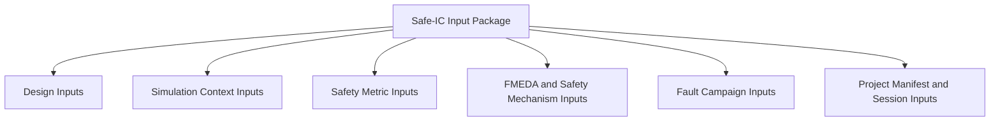
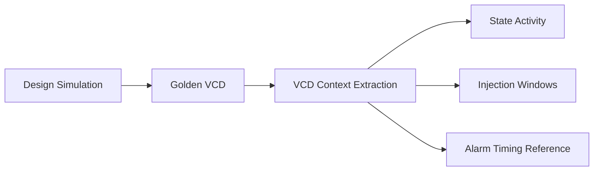
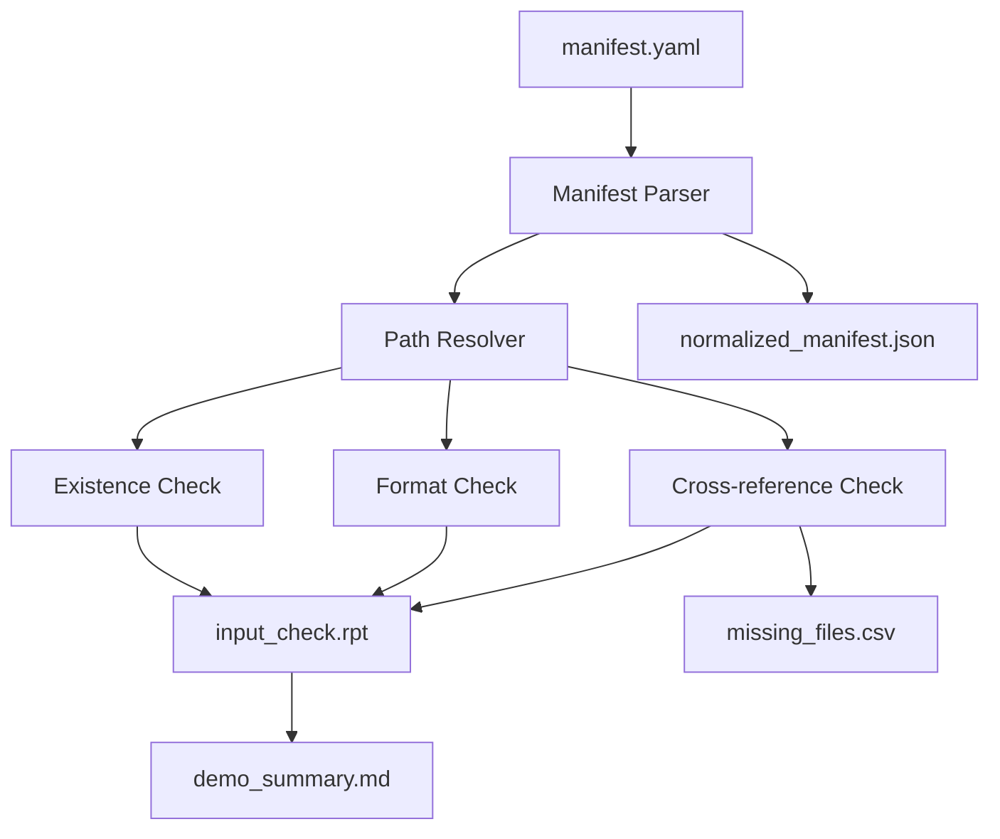
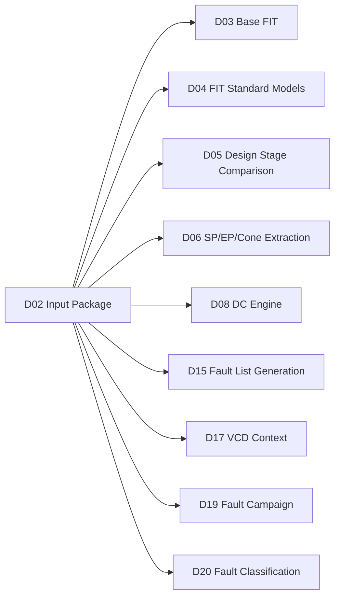

# [Automotive Safe-IC Practice 02] What Input Files Does a Functional Safety Verification Project Need?

**Author:** Darren H. Chen  
**Direction:** Automotive chip functional safety analysis and fault injection practice  
**Demo:** `D02_input_package`  
**Tags:** `Automotive Chip`, `Functional Safety`, `SafeIC`, `Input Package`, `FIT/DC`, `Fault Injection`, `VCD`, `FMEDA`

---

## Demo scope

`D02_input_package` defines a standardized input package for an automotive Safe-IC functional safety and fault injection practice flow.

The corresponding generic tool module is:

```text
safeic-inputcheck
```

Its purpose is not to calculate FIT, run a fault campaign, or classify fault results.

Its purpose is simpler and more fundamental:

```text
Check whether a functional safety verification project has enough well-structured inputs
before any downstream analysis or fault injection step starts.
```

The demo validates the following engineering idea:

```text
No reproducible input package
= no reproducible safety metric
= no reproducible fault campaign
= no credible functional safety evidence
```

`D02_input_package` therefore provides a reusable folder structure, manifest file, example input files, and input checking reports that later demos can consume.

---

## 1. Why the input package is part of the architecture

In a normal RTL verification project, the minimum runnable unit may look like this:

```text
RTL files
+ testbench
+ simulation script
= functional simulation result
```

In a functional safety verification project, this is not enough.

A functional safety flow must connect several evidence domains:

```text
design structure
+ reliability model
+ safety mechanism definition
+ operating context
+ fault model
+ alarm and observation model
+ metric reporting
+ traceable project database
```

The input package is the boundary where all these domains become explicit.

If the input package is weak, every downstream result becomes fragile:

```text
FIT cannot be explained.
Diagnostic coverage cannot be reproduced.
Fault lists cannot be traced back to the design.
Fault campaign results cannot be mapped back to safety mechanisms.
Reports cannot be compared across revisions.
```

This is why the second demo focuses on input organization rather than algorithm complexity.

A safety verification project should not begin with a command line. It should begin with a well-defined input contract.

---

## 2. The core question: what must be known before analysis starts?

Before any functional safety analysis or fault campaign can run, the flow must answer at least seven questions:

| Question | Required input category |
|---|---|
| What design is being analyzed? | Design input |
| Which abstraction level is used? | Architecture / RTL / netlist stage input |
| What operating context is used? | Clock, reset, simulation waveform input |
| What reliability model is used? | FIT setup input |
| What safety mechanisms exist? | Safety mechanism and FMEDA input |
| Where can faults be injected? | Fault list or fault generation input |
| How do we know whether a fault is detected? | Alarm and observe point input |

These questions are not independent.

For example:

```text
A fault node must exist in the design.
An alarm signal should appear in the waveform.
A safety mechanism should map to endpoints or failure modes.
A FIT model should match the design abstraction and technology assumptions.
A report should record which input revision produced which metric.
```

The input package is the engineering mechanism that keeps these relationships explicit.

---

## 3. A Safe-IC input package has six layers

For this practice flow, the input package is divided into six layers.



Each layer answers a different engineering question.

| Layer | Main role | Typical files |
|---|---|---|
| Design inputs | Define the circuit under analysis | RTL, netlist, filelist, top module |
| Simulation context inputs | Define the operating scenario | clkdef, reset, VCD/FSDB, simulation window |
| Safety metric inputs | Define reliability and metric assumptions | FIT setup, lambda file, mission profile, process data |
| FMEDA and safety mechanism inputs | Define failure modes and protection mechanisms | failure mode library, SM library, EP-to-SM map, DCE-like files |
| Fault campaign inputs | Define fault injection and detection evidence | fault list, alarm list, observe points |
| Project manifest and session inputs | Define traceability and reproducibility | manifest.yaml, session name, output directory, database path |

The key point is that these layers should be checked before they are used.

A missing VCD, an invalid top module, or an alarm signal that is absent from the waveform should be detected early, not after a long fault campaign run.

---

## 4. Recommended demo directory structure

`D02_input_package` uses the following project skeleton:

```text
D02_input_package/
  README.md
  run_demo.csh
  run_demo.sh
  manifest.yaml
  inputs/
    design/
      rtl/
        toy_counter.v
        toy_counter_checker.v
      filelist.f
      design.yaml
    sim/
      clkdef.clk
      golden.vcd
    safety/
      fit_inputs.yaml
      sm_library.yaml
      failure_modes.yaml
      ep_to_sm_map.csv
    fault/
      fault.list
      alarm.list
      observe_points.list
  outputs/
    input_check.rpt
    normalized_manifest.json
    missing_files.csv
    demo_summary.md
  expected/
    golden_input_check.rpt
```

This structure makes every input role visible.

It also prevents a common project failure pattern:

```text
all files placed in one directory
+ paths hard-coded inside scripts
+ no manifest
+ no input validation
= difficult to reproduce or compare
```

A functional safety demo should be understandable from the directory structure alone.

---

## 5. Design inputs: RTL, netlist, filelist, and top module

Design inputs answer the first question:

```text
What circuit is being analyzed?
```

A minimal design input package contains:

```text
inputs/design/rtl/toy_counter.v
inputs/design/rtl/toy_counter_checker.v
inputs/design/filelist.f
inputs/design/design.yaml
```

Example `filelist.f`:

```text
./rtl/toy_counter.v
./rtl/toy_counter_checker.v
```

Example `design.yaml`:

```yaml
top: toy_counter_top
language: verilog
stage: rtl
```

The `stage` field is important because the same safety flow may be executed at different abstraction levels:

```text
architecture stage: estimate from counts or abstract configuration
RTL stage: estimate from synthesizable design structure
gate-level netlist stage: validate with implementation-level structure
```

In a practical project, different stages serve different purposes.

| Stage | Main purpose | Typical limitation |
|---|---|---|
| Architecture | Early estimation before RTL is complete | Less structural accuracy |
| RTL | Early safety exploration and mechanism planning | Fault nodes may differ after synthesis |
| Netlist | Final structural metric and fault campaign preparation | Requires synthesis and mapping discipline |

The input checker should not try to perform full synthesis.

It should only verify that the design input contract is valid:

```text
filelist exists
listed files exist
files are readable
top module is specified
stage is valid
language is known
```

This simple check prevents many later failures.

---

## 6. Simulation context inputs: clock, reset, and VCD

Fault injection is meaningful only under an operating context.

A fault injected during reset, idle state, bus transfer, memory access, or safety-critical computation may produce different outcomes.

This is why the waveform is not just a debug artifact.

In this practice flow, the golden VCD is treated as safety context:

```text
RTL or netlist simulation
→ golden waveform
→ state activity extraction
→ fault injection time windows
→ alarm timing comparison
```

A minimal simulation context package contains:

```text
inputs/sim/clkdef.clk
inputs/sim/golden.vcd
```

Example `clkdef.clk`:

```text
clk 10ns rising
reset_n active_low
```

The input checker should verify:

```text
clock definition file exists
at least one clock is specified
golden VCD exists
VCD is not empty
VCD contains expected top-level scope or key signals
```

The flow can be visualized as:



Later demos will use this context for fault result classification.

For D02, we only check that the context is present and structurally usable.

---

## 7. Safety metric inputs: FIT setup and reliability assumptions

Functional safety metrics are not calculated from RTL alone.

A metric calculation also requires reliability assumptions.

A simplified `fit_inputs.yaml` may look like this:

```yaml
fit_standard: simplified_iec62380
mission_profile: passenger_compartment
temperature_ja: 65
manufacturing_year: 2026
default_process: MOS.ASIC.STDCELL
lambda_file: inputs/safety/lambda.csv
transistor_count_file: inputs/safety/lib.tc
```

These fields represent the engineering assumptions behind a FIT calculation.

The input checker should verify:

```text
fit_standard is specified
mission_profile is specified
temperature setting exists
manufacturing year exists
default process exists
referenced reliability files exist when required
```

The important methodology point is this:

```text
A FIT number without its assumptions is not engineering evidence.
It is only a number.
```

Therefore, every metric output should be traceable back to the FIT input configuration that produced it.

---

## 8. Safety mechanism inputs: SM library and coverage model

A safety mechanism is a design feature intended to detect, control, or mitigate a fault.

Examples include:

```text
parity check
ECC
lockstep compare
duplication and comparison
watchdog
timeout monitor
bus protocol checker
range checker
```

In this practice flow, the safety mechanism library defines reusable mechanism types.

Example `sm_library.yaml`:

```yaml
parity_check:
  description: endpoint parity checker
  coverage:
    endpoint: 0.90
    startpoint: 0.00
    cone: 0.00

logic_dup_compare:
  description: duplicated logic with comparator
  coverage:
    endpoint: 0.90
    startpoint: 0.00
    cone: 0.90

lockstep_compare:
  description: redundant execution path with compare alarm
  coverage:
    endpoint: 0.90
    startpoint: 0.90
    cone: 0.90
```

This library is not a replacement for real safety analysis.

It is an explicit modeling layer.

It answers:

```text
When this safety mechanism is mapped to a design object,
which structural regions can receive diagnostic coverage credit?
```

A robust input checker should verify:

```text
SM names are unique
coverage fields are present
coverage values are between 0 and 1
required coverage dimensions are not missing
unknown SM references are reported
```

---

## 9. Failure mode inputs: from system-level hazards to module-level handles

Failure modes provide the semantic bridge between system safety goals and chip-level structures.

A failure mode is not just a free-text description. It is a handle used to organize FMEDA.

Example `failure_modes.yaml`:

```yaml
FM_COUNTER_WRONG_VALUE:
  description: counter output has an erroneous value
  affected_function: counter datapath

FM_COUNTER_STUCK:
  description: counter output is stuck or no longer updates
  affected_function: counter state machine

FM_ALARM_MISSED:
  description: safety mechanism fails to report an internal error
  affected_function: alarm generation path
```

The input checker should verify:

```text
failure mode IDs are unique
description exists
affected function or scope exists
referenced failure modes in mapping files exist
```

The methodology is:

```text
Safety goal
→ failure mode
→ affected design part
→ safety mechanism
→ diagnostic coverage
→ residual risk
```

Without failure modes, the flow becomes a signal-level exercise.

With failure modes, the flow becomes an FMEDA-ready engineering process.

---

## 10. EP-to-SM map: binding structure to safety mechanisms

The safety mechanism library defines what a mechanism means.

The EP-to-SM map defines where the mechanism applies.

Example `ep_to_sm_map.csv`:

```csv
endpoint,safety_mechanism,failure_mode,scope
 top.u_counter.count_reg[0].D,parity_check,FM_COUNTER_WRONG_VALUE,endpoint
 top.u_counter.count_reg[1].D,parity_check,FM_COUNTER_WRONG_VALUE,endpoint
 top.u_counter.next_count,logic_dup_compare,FM_COUNTER_WRONG_VALUE,cone
```

This mapping is central to diagnostic coverage calculation.

A coverage model should not silently assume that a safety mechanism protects the entire design.

It should state:

```text
which endpoint is protected
which failure mode is addressed
which safety mechanism is used
which structural scope receives credit
```

The input checker should verify:

```text
mapped endpoints are syntactically valid
referenced safety mechanisms exist
referenced failure modes exist
scope values are valid
no empty endpoint rows exist
```

Later demos will compute diagnostic coverage from this mapping.

D02 only ensures that the mapping file is readable and internally consistent.

---

## 11. Fault campaign inputs: fault list, alarm list, and observe points

Fault campaign inputs define how evidence is generated.

They answer three questions:

```text
Where is the fault injected?
What kind of fault is injected?
How is detection or propagation observed?
```

### 11.1 Fault list

Example `fault.list`:

```text
top.u_counter.count_reg[0].Q SA0 100 -1
top.u_counter.count_reg[1].Q SA1 100 -1
top.u_counter.valid_reg      1   200 5
```

A practical fault list can use four columns:

```text
fault_node fault_value inject_time duration
```

Where:

```text
SA0 or 0: stuck-at 0
SA1 or 1: stuck-at 1
-1: permanent fault
positive duration: transient fault window
```

### 11.2 Alarm list

Example `alarm.list`:

```text
top.u_checker.parity_error
top.u_checker.compare_error
top.u_checker.timeout_error
```

An alarm is a safety mechanism output that indicates the design detected a fault.

### 11.3 Observe points

Example `observe_points.list`:

```text
top.count_out[0]
top.count_out[1]
top.out_valid
top.bus_error
```

An observe point is not necessarily an alarm.

It is a signal used to determine whether a fault effect propagated to a meaningful observation boundary.

The distinction is important:

| Concept | Meaning |
|---|---|
| Alarm | The safety mechanism explicitly reports an error |
| Observe point | The fault effect reaches a monitored boundary |
| State element | The fault effect changes internal state |
| Output | The fault effect becomes externally visible |

The input checker should verify:

```text
fault list exists
fault list has required columns
fault values are valid
injection times are numeric
alarm list exists
observe point list exists when required
alarm and observe signals follow expected naming format
```

---

## 12. Manifest-driven flow

Passing all files through command-line options is possible, but it does not scale well.

A manifest file makes the project reproducible.

Example `manifest.yaml`:

```yaml
project: automotive_safeic_practice_d02
demo: D02_input_package

session:
  name: input_package_baseline
  database: outputs/safeic.sqlite

design:
  top: toy_counter_top
  stage: rtl
  language: verilog
  filelist: inputs/design/filelist.f
  design_config: inputs/design/design.yaml

simulation:
  clkdef: inputs/sim/clkdef.clk
  golden_vcd: inputs/sim/golden.vcd

safety:
  fit_inputs: inputs/safety/fit_inputs.yaml
  sm_library: inputs/safety/sm_library.yaml
  failure_modes: inputs/safety/failure_modes.yaml
  ep_to_sm_map: inputs/safety/ep_to_sm_map.csv

fault_campaign:
  fault_list: inputs/fault/fault.list
  alarm_list: inputs/fault/alarm.list
  observe_points: inputs/fault/observe_points.list

outputs:
  report_dir: outputs
  normalized_manifest: outputs/normalized_manifest.json
  input_check_report: outputs/input_check.rpt
```

This file becomes the single entry point for the demo:

```bash
safeic-inputcheck --manifest manifest.yaml
```

The manifest should be stored in version control.

This makes the result traceable:

```text
report
→ manifest
→ input files
→ design revision
→ safety assumptions
→ fault campaign configuration
```

---

## 13. Tool architecture of `safeic-inputcheck`

`safeic-inputcheck` is intentionally lightweight.

It does not own the full functional safety flow.

It checks and normalizes the input package so later tools can rely on a stable contract.



The module can be implemented in five internal steps.

| Step | Responsibility |
|---|---|
| Manifest parsing | Load YAML and verify required top-level sections |
| Path resolution | Convert relative paths into normalized project paths |
| File existence check | Report missing or unreadable files |
| Format check | Validate minimal structure of each input file |
| Cross-reference check | Detect broken references across files |

This is not glamorous, but it is essential engineering.

A mature safety flow should fail early when the input package is invalid.

---

## 14. Three validation levels

The input checker uses three validation levels.

### L1: Existence check

```text
Does the file exist?
Can it be opened?
Is it non-empty?
```

### L2: Format check

```text
Does the file have the expected extension?
Does a CSV file have the required columns?
Does a YAML file contain required keys?
Does a fault list line have enough fields?
```

### L3: Cross-reference check

```text
Does ep_to_sm_map reference existing safety mechanisms?
Does ep_to_sm_map reference existing failure modes?
Does the manifest point to a valid filelist?
Does the fault list contain valid fault values?
Does the alarm list have signals that can be searched in the VCD?
```

The tool should produce warnings and errors separately.

Example policy:

| Severity | Meaning | Example |
|---|---|---|
| ERROR | Flow should stop | missing filelist, missing VCD, invalid manifest |
| WARNING | Flow can continue but result may be incomplete | observe point file missing for a simple demo |
| INFO | Helpful normalization message | relative path resolved to absolute path |

This makes the demo useful both for automation and for human learning.

---

## 15. Example input check report

Example `outputs/input_check.rpt`:

```text
[INFO] Project: automotive_safeic_practice_d02
[INFO] Demo: D02_input_package
[INFO] Session: input_package_baseline

[PASS] manifest.yaml loaded successfully
[PASS] design.filelist exists: inputs/design/filelist.f
[PASS] design.top is specified: toy_counter_top
[PASS] simulation.clkdef exists: inputs/sim/clkdef.clk
[PASS] simulation.golden_vcd exists: inputs/sim/golden.vcd
[PASS] safety.fit_inputs exists: inputs/safety/fit_inputs.yaml
[PASS] safety.sm_library exists: inputs/safety/sm_library.yaml
[PASS] safety.failure_modes exists: inputs/safety/failure_modes.yaml
[PASS] safety.ep_to_sm_map exists: inputs/safety/ep_to_sm_map.csv
[PASS] fault_campaign.fault_list exists: inputs/fault/fault.list
[PASS] fault_campaign.alarm_list exists: inputs/fault/alarm.list
[PASS] fault_campaign.observe_points exists: inputs/fault/observe_points.list

[PASS] fault.list format check completed
[PASS] sm_library coverage range check completed
[PASS] failure mode reference check completed
[PASS] safety mechanism reference check completed

Summary:
  errors   : 0
  warnings : 0
  status   : PASS
```

Example `outputs/missing_files.csv` when a problem exists:

```csv
severity,field,path,message
ERROR,simulation.golden_vcd,inputs/sim/golden.vcd,file not found
WARNING,fault_campaign.observe_points,inputs/fault/observe_points.list,optional file missing for this demo profile
```

The report should be readable by both humans and scripts.

---

## 16. How this input package supports later demos

`D02_input_package` is the bridge between the first conceptual closed loop and all later analysis modules.



This means a later demo should not invent its own file structure.

It should reuse the same input contract.

That is how the series becomes a coherent engineering practice rather than a collection of unrelated examples.

---

## 17. Common input package mistakes

The most common mistakes in functional safety demo projects are not advanced mathematical errors.

They are basic input discipline problems.

### Mistake 1: hidden assumptions inside scripts

Bad pattern:

```text
python run.py --top toy_top --vcd ../tmp/a.vcd --fault ../../old/fault.list
```

Better pattern:

```text
python run.py --manifest manifest.yaml
```

### Mistake 2: no versioned reliability assumptions

Bad pattern:

```text
FIT number is generated, but temperature, process, mission profile, and lambda source are unknown.
```

Better pattern:

```text
FIT report records the fit_inputs.yaml used for the run.
```

### Mistake 3: alarm signals not checked against waveform

Bad pattern:

```text
alarm.list contains a signal name that never appears in golden.vcd.
```

Better pattern:

```text
input checker reports a warning before the fault campaign starts.
```

### Mistake 4: fault list not tied to design hierarchy

Bad pattern:

```text
fault.list is copied from an older design revision.
```

Better pattern:

```text
fault nodes are generated from or checked against the current design structure.
```

### Mistake 5: no normalized manifest output

Bad pattern:

```text
Downstream tools parse the original manifest differently.
```

Better pattern:

```text
safeic-inputcheck writes normalized_manifest.json for later tools.
```

---

## 18. Methodology summary

A functional safety verification input package should be:

```text
explicit
structured
checkable
traceable
version-controlled
reusable across demos
```

The core methodology is:

```text
Do not let downstream tools guess the project context.
Make the project context explicit before the flow starts.
```

`D02_input_package` therefore defines the engineering contract for the rest of the practice series.

The key artifact is not only the input files themselves, but also the normalized and checked representation of those files:

```text
manifest.yaml
→ safeic-inputcheck
→ normalized_manifest.json
→ downstream analysis and fault campaign tools
```

This is the foundation for reproducible functional safety analysis and fault injection practice.

---

## 19. Demo deliverables

`D02_input_package` should produce the following files:

```text
outputs/input_check.rpt
outputs/normalized_manifest.json
outputs/missing_files.csv
outputs/demo_summary.md
```

The expected result for a clean demo is:

```text
errors   : 0
warnings : 0
status   : PASS
```

The expected learning outcome is:

```text
A Safe-IC project is not defined by one RTL file or one command.
It is defined by a complete, checkable, and traceable input package.
```

