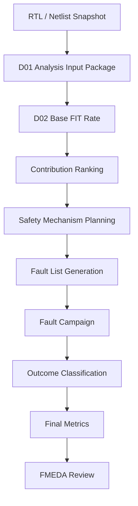
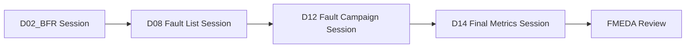
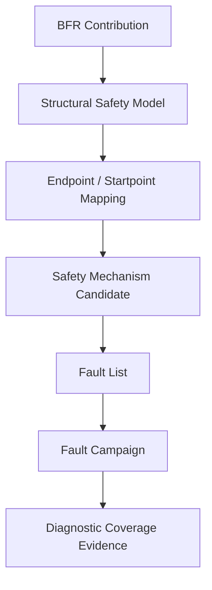

# [Automotive Safe-IC Practice 02] Base FIT Rate: Building the Random Hardware Failure Baseline

**Author**: Darren H. Chen  
**Direction**: Automotive Chip Functional Safety Analysis and Fault Injection Practice  
**Demo**: `D02_base_fit_rate`  
**Tags**: Automotive Chip, Functional Safety, ISO 26262, ASIL, FIT, Base FIT Rate, BFR, IEC 62380, SN 29500, Diagnostic Coverage, Fault List, DCE, Common FuSa Database, FMEDA, Safety Evidence

---

## 1. Why D02 Starts from Base FIT Rate

D01 built the first engineering artifact of this series:

```text
D01_analysis_input_package
```

It answered a basic reproducibility question:

> Which RTL, filelist, clock definition, FIT setup, analysis initialization file, database session, and output policy define this safety-analysis run?

D02 uses that input package to establish the first quantitative safety baseline:

```text
Base FIT Rate
```

Base FIT Rate, or BFR, is the estimated random hardware failure exposure before safety mechanisms are credited. It is not the final safety metric. It is not diagnostic coverage. It is not a fault-campaign result. It is the baseline that tells us how much random hardware failure exposure exists before we start claiming detection, mitigation, or residual-risk reduction.

A practical safety flow should not jump directly to diagnostic coverage or FMEDA conclusions. It should first answer:

```text
How much random hardware failure exposure exists in the design?
Where does that exposure come from?
Which design objects dominate the failure contribution?
Which FIT standard and mission assumptions were used?
Can the result be traced back to the D01 input package?
```

That is the purpose of D02.

---

## 2. Basic Concepts Before the Demo

D02 introduces more numerical concepts than D01, so it is useful to define the terms carefully before discussing the demo.

---

### 2.1 FIT

FIT means **Failure In Time**.

A common engineering interpretation is:

```text
1 FIT = 1 failure per 10^9 operating hours
```

Equivalently:

```text
1 FIT = 1E-09 failures / hour
```

FIT is a failure-rate unit. It is not a pass/fail result.

At chip level, FIT analysis estimates how susceptible the silicon, package, memory, logic, and other design elements are to random hardware failures under a defined reliability model and mission profile.

A simplified mental model is:

```text
FIT = estimated random hardware failure exposure under specified assumptions
```

The assumptions matter. A FIT number without its standard, technology assumptions, mission profile, temperature context, and design scope is not reviewable enough.

---

### 2.2 Base FIT Rate

Base FIT Rate is the initial FIT result before safety mechanisms are added or credited.

In this article, BFR means:

```text
Base FIT Rate = unprotected random hardware failure baseline
```

It answers:

```text
Before claiming diagnostic coverage, how much random hardware failure exposure exists?
```

This is why BFR should appear early in the safety-analysis workflow.

```mermaid
flowchart LR
    A[D01 Input Package] --> B[D02 Base FIT Rate]
    B --> C[D03 FIT Standard Review]
    C --> D[D04 Structural Safety Model]
    D --> E[D05 Common FuSa Database]
    E --> F[D06 Safety Exploration]
    F --> G[D08 Fault List Generation]
    G --> H[D12 Fault Campaign]
    H --> I[D14 Final Metrics]
    I --> J[FMEDA Evidence]
```



**Figure 1. D02 establishes the quantitative baseline used by later safety analysis and verification stages.**

---

### 2.3 Random Hardware Faults

D02 focuses on random hardware faults, not systematic design bugs.

A simplified distinction is:

| Category | Typical Cause | Main Engineering Response |
|---|---|---|
| Systematic fault | Requirement, design, verification, process, or implementation issue | Process discipline, verification, review, traceability |
| Random hardware fault | Physical effect during operation | Safety mechanisms, diagnostic coverage, fault campaign, residual-risk analysis |

Examples of random hardware fault concerns include:

```text
permanent stuck-at behavior
single event upset
memory bit flip
aging-related degradation
package-related failure
electrical overstress-related failure
```

BFR estimates the exposure before the design claims that safety mechanisms can detect or control these events.

---

### 2.4 Diagnostic Coverage Is Not Base FIT Rate

Diagnostic Coverage, or DC, describes how much of the relevant fault exposure is detected, controlled, made safe, or otherwise covered by safety mechanisms.

Base FIT Rate and diagnostic coverage answer different questions.

```text
Base FIT Rate:
  How much random hardware failure exposure exists?

Diagnostic Coverage:
  How much of that exposure can be detected or controlled?

Residual FIT:
  How much exposure remains after credited coverage?
```

A simplified relationship is:

```text
Residual FIT = Base FIT × (1 - Diagnostic Coverage)
```

This equation is only a conceptual explanation. Real FMEDA work may split the calculation by failure mode, part, sub-part, safety mechanism, safety goal, fault class, and ASIL target.

The important lesson is:

> Diagnostic coverage has no engineering meaning unless the failure-rate baseline is known.

---

### 2.5 FIT Contribution

A total FIT value is useful, but it is not enough.

D02 should also expose **FIT contribution**.

FIT contribution answers:

```text
Which objects, blocks, element types, or failure categories dominate the Base FIT Rate?
```

A simple contribution table may look like this:

```csv
object,category,base_fit,percentage
counter_reg[0],sequential,0.013,25.0
counter_reg[1],sequential,0.013,25.0
counter_reg[2],sequential,0.013,25.0
counter_reg[3],sequential,0.013,25.0
```

For a larger design, contribution ranking becomes a design-planning tool.

It helps answer:

```text
Which block deserves safety exploration first?
Which storage elements dominate exposure?
Which memory or logic group may require ECC, parity, lockstep, or duplication?
Which result should be traced into FMEDA rows?
```

---

## 3. D02 in the Complete Safe-IC Flow

D02 is not an isolated metrics demo.

It is the first numerical checkpoint in the evidence chain.



**Figure 2. Base FIT Rate turns the D01 input context into the first quantitative safety baseline.**

D02 should produce results that later demos can consume:

| Later Demo | How It Uses D02 |
|---|---|
| D03 FIT Standards | Compares BFR under IEC 62380 and SN 29500-style assumptions |
| D04 Structural Safety Model | Maps FIT contribution to endpoints, startpoints, and structural building blocks |
| D05 Common FuSa Database | Stores BFR and related evidence into `.fdb::session` |
| D06 Safety Exploration | Uses contribution ranking to decide which safety mechanisms to explore |
| D08 Fault List Generation | Connects FIT baseline to fault population generation |
| D14 Final Metrics | Compares final metrics against the original baseline |
| D16 FMEDA Data Model | Maps BFR and residual contribution into FMEDA rows |

The goal is not just to print a number.

The goal is to create a baseline that remains traceable through the rest of the flow.

---

## 4. What D02 Consumes from D01

D02 should not rebuild the world.

It consumes the D01 input package.

From D01, D02 uses:

```text
manifest.yaml
inputs/rtl/toy_counter.v
inputs/filelist/filelist.f
inputs/clock/toy_counter.clk
inputs/fit/FIT_inputs.common.txt
inputs/analysis/analysis_bfr.fusaini
scripts/setup_toolchain.template.csh
scripts/setup_toolchain.local.csh
```

The D01 package already established:

```text
design scope
clock model
FIT standard
FIT setup
analysis initialization file
toolchain mapping
output directory policy
database/session naming policy
```

D02 adds:

```text
BFR execution wrapper
BFR report parser
FIT contribution table
BFR summary report
BFR evidence index
comparison hooks for later FIT-standard experiments
```

---

## 5. Recommended D02 Directory Structure

The D02 demo should remain small and inspectable.

Recommended layout:

```text
D02_base_fit_rate/
  README.md
  manifest.yaml

  inputs/
    rtl/
      toy_counter.v
    filelist/
      filelist.f
    clock/
      toy_counter.clk
    fit/
      FIT_inputs.common.txt
    analysis/
      analysis_bfr.fusaini

  scripts/
    setup_toolchain.template.csh
    run_demo.csh
    run_demo.sh

  tools/
    parse_analysis_config.py
    run_bfr_preflight.py
    parse_bfr_reports.py
    build_bfr_summary.py

  outputs/
    input_inventory.csv
    analysis_options.csv
    bfr_preflight_check.csv
    expected_bfr_outputs.csv
    bfr_summary.csv
    fit_contribution.csv
    bfr_report.md
    evidence_index.csv
    analysis_command.csh
    demo_summary.md

  logs/
    run_demo.log

  docs/
    bfr_notes.md
```

D02 can either copy the D01 input files or reference a shared D01 package.

For GitHub publication, copying the minimal toy inputs is easier for readers:

```text
D02 is self-contained.
```

For internal regression, a shared input package may be better:

```text
D02 consumes D01 outputs directly.
```

Both approaches are valid as long as the manifest makes the dependency explicit.

---

## 6. D02 Manifest

The manifest should make D02's run identity clear.

Example:

```yaml
project:
  name: automotive_safeic_practice
  article: 02
  demo: D02_base_fit_rate
  top_module: toy_counter

inputs:
  rtl_file: inputs/rtl/toy_counter.v
  filelist: inputs/filelist/filelist.f
  clkdef: inputs/clock/toy_counter.clk
  fit_setup: inputs/fit/FIT_inputs.common.txt
  analysis_config: inputs/analysis/analysis_bfr.fusaini

analysis:
  goal: base_fit_rate
  mode: analysis
  fit_standard: iec_62380
  database_session: outputs/db/toy_counter.fdb::D02_BFR

outputs:
  bfr_summary: outputs/bfr_summary.csv
  fit_contribution: outputs/fit_contribution.csv
  bfr_report: outputs/bfr_report.md
  evidence_index: outputs/evidence_index.csv
  analysis_command: outputs/analysis_command.csh

toolchain:
  analysis_engine_env: SAFEIC_ANALYSIS_ENGINE
  setup_template: scripts/setup_toolchain.template.csh
```

The important point is that BFR is not just a report. It is a run identity.

```text
BFR = design snapshot + FIT standard + FIT setup + clock model + analysis options + evidence location
```

---

## 7. Analysis Initialization File for BFR

D02 continues to use an initialization-file-driven flow.

Example:

```ini
# inputs/analysis/analysis_bfr.fusaini

mode = analysis
top = toy_counter

filelist = inputs/filelist/filelist.f
clkdef = inputs/clock/toy_counter.clk
fit_setup = inputs/fit/FIT_inputs.common.txt

fit_standard = iec_62380
block_level = true
consolidated_report = sparse

write_fusa_db = true
fusa_db_name = outputs/db/toy_counter.fdb::D02_BFR
overwrite_session = true
overwrite_fusa_db = true

ss_save_fault_list_to_db = true
```

D02 does not need to validate a real safety mechanism yet.

However, it should already preserve database and fault-list hooks because later demos will rely on the same evidence chain.

The command generated by the demo can be:

```csh
$SAFEIC_ANALYSIS_ENGINE \
  --fusaini inputs/analysis/analysis_bfr.fusaini \
  |& tee logs/analysis_engine.log
```

This command is intentionally boring.

The methodology is in the input package, the initialization file, and the evidence model.

---

## 8. FIT Setup File

D02 should continue to keep reliability assumptions separate from the command line.

Example:

```text
# inputs/fit/FIT_inputs.common.txt

PROJECT_NAME = automotive_safeic_practice
TOP_MODULE   = toy_counter
FIT_STANDARD = iec_62380
MISSION_PROFILE = demo_motor_control
ASIL_TARGET = ASIL_B_OR_HIGHER_DEMO_PLACEHOLDER

# Public demo placeholders.
# A production setup would provide technology, package, memory,
# transistor count, mission profile, and diagnostic coverage definitions.
```

This file is not a production reliability model.

It is a public-safe placeholder showing where reliability assumptions belong.

The principle is:

> FIT numbers must be traceable to their reliability assumptions.

---

## 9. Expected BFR Outputs

A real BFR run may generate several report files.

D02 should not hard-code one fragile filename. It should model expected outputs by purpose.

Example:

```csv
artifact,purpose,required_for_public_demo,used_by_later_demo
input_inventory.csv,input file inventory,yes,D19
analysis_options.csv,normalized analysis options,yes,D03/D19
bfr_preflight_check.csv,BFR preflight checks,yes,D19
bfr_summary.csv,normalized BFR summary,yes,D03/D14/D16
fit_contribution.csv,object or category FIT contribution,yes,D04/D06/D16
bfr_report.md,human-readable BFR report,yes,D02/D19
evidence_index.csv,index of generated evidence,yes,D19
analysis_command.csh,reproducible real analysis command,yes,D02
analysis_engine.log,real tool log if configured,no,D19
toy_counter_IEC_62380.DCE,DCE-style output if generated,no,D04/D05/D16
toy_counter_SS.summary.rpt,tool summary report if generated,no,D02/D19
toy_counter_Perm_EquivFault.list,permanent fault list if generated,no,D08/D11
SAFA_SA_Alarms.list,alarm list if generated,no,D10/D11
```

The public demo can generate normalized placeholder CSV files in preflight mode.

When the real analysis engine is configured, the same parser interface can ingest real reports.

---

## 10. Preflight Mode and Real Analysis Mode

D02 should follow the same execution philosophy as D01.

There are two modes:

```text
preflight-only mode
real-analysis mode
```

### 10.1 Preflight-Only Mode

Preflight-only mode runs without the real analysis engine.

It checks:

```text
manifest exists
analysis config exists
RTL file exists
filelist exists
clock file exists
FIT setup exists
fit_standard is explicit
mode is analysis
database session is defined
output directory is writable
BFR output schema can be generated
```

It also creates normalized sample outputs so that the downstream data shape is visible.

### 10.2 Real-Analysis Mode

Real-analysis mode runs only when:

```text
SAFEIC_ANALYSIS_ENGINE
```

is configured.

It then generates and optionally executes:

```text
outputs/analysis_command.csh
```

After the real run, D02 parsers should look for:

```text
summary report
FIT report
FIT contribution report
DCE file
fault list
alarm list
database session
analysis log
```

The public demo should not fail just because real tool outputs are absent.

It should report:

```text
PASSED_WITH_WARNINGS
```

when the public preflight is complete but real analysis has not been executed.

---

## 11. Tool Flow Architecture

D02 helper tools can remain simple.

Recommended modules:

```text
tools/
  parse_analysis_config.py
  run_bfr_preflight.py
  parse_bfr_reports.py
  build_bfr_summary.py
```

Responsibilities:

| Module | Responsibility |
|---|---|
| `parse_analysis_config.py` | Parse `key = value` initialization files |
| `run_bfr_preflight.py` | Validate inputs and generate command script |
| `parse_bfr_reports.py` | Parse real or sample BFR report artifacts |
| `build_bfr_summary.py` | Build normalized CSV and Markdown summaries |

A good D02 parser should be conservative:

```text
read real reports if present
otherwise generate placeholder/sample outputs
never pretend placeholder values are certified safety results
always label sample data clearly
```

---

## 12. Example BFR Summary CSV

D02 should normalize the BFR result into a small CSV file.

Example:

```csv
metric,value,unit,source,notes
top_module,toy_counter,,manifest.yaml,design scope
fit_standard,iec_62380,,analysis_bfr.fusaini,run identity
base_fit_total,0.052,FIT,sample_public_demo,illustrative placeholder only
permanent_fit,0.040,FIT,sample_public_demo,illustrative placeholder only
transient_fit,0.012,FIT,sample_public_demo,illustrative placeholder only
database_session,outputs/db/toy_counter.fdb::D02_BFR,,analysis_bfr.fusaini,planned session
```

For a real run, `source` should reference the actual report:

```text
toy_counter_SS.summary.rpt
toy_counter_IEC_62380.FIT.rpt
analysis_engine.log
outputs/db/toy_counter.fdb::D02_BFR
```

The parser should not collapse all information into one number.

BFR is a baseline. It must remain traceable.

---

## 13. Example FIT Contribution CSV

D02 should also create a contribution table.

Example:

```csv
object,category,base_fit,unit,percentage,source,notes
toy_counter.count[0],sequential,0.013,FIT,25.0,sample_public_demo,illustrative placeholder only
toy_counter.count[1],sequential,0.013,FIT,25.0,sample_public_demo,illustrative placeholder only
toy_counter.count[2],sequential,0.013,FIT,25.0,sample_public_demo,illustrative placeholder only
toy_counter.count[3],sequential,0.013,FIT,25.0,sample_public_demo,illustrative placeholder only
```

A real design may group contribution by:

```text
module
instance
register
memory
standard-cell class
failure mode
part/sub-part
safety mechanism boundary
```

D02 should keep the table schema extensible because later demos will map contribution into structural elements and FMEDA rows.

---

## 14. BFR Report Markdown

The human-readable report should explain the result, not only list files.

Suggested `outputs/bfr_report.md`:

```md
# D02 Base FIT Rate Report

## Run Identity

- Demo: D02_base_fit_rate
- Top module: toy_counter
- FIT standard: iec_62380
- Analysis config: inputs/analysis/analysis_bfr.fusaini
- FIT setup: inputs/fit/FIT_inputs.common.txt
- Database session: outputs/db/toy_counter.fdb::D02_BFR

## Result

Base FIT Rate was generated in public demo mode.
Values are illustrative placeholders unless a real analysis report is parsed.

## Key Observations

- The input package is complete.
- FIT standard is explicit.
- BFR output schema is ready for D03, D04, D06, D14, and D16.

## Next Step

D03 compares FIT-standard assumptions and explains why DCE and BFR evidence must not be mixed across standards.
```

This report helps a reader understand D02 without reading the scripts first.

---

## 15. Why `.fdb::session` Still Matters in D02

Even though D02 focuses on BFR, it should already prepare the database evidence path.

The session name:

```text
outputs/db/toy_counter.fdb::D02_BFR
```

means:

```text
database file: outputs/db/toy_counter.fdb
session name:  D02_BFR
```

A database may later contain multiple sessions:

```text
D02_BFR
D08_fault_list
D12_fault_campaign
D14_final_metrics
```

This makes the evidence chain easier to organize.



**Figure 3. D02 should start the database evidence chain even before fault campaigns are executed.**

The key principle is:

> Database planning should not begin after fault campaigns. It should begin when the first baseline metric is generated.

---

## 16. BFR Is Not a Safety Claim

A common mistake is to treat BFR as a final safety claim.

It is not.

BFR does not prove that the design is safe.

BFR does not prove that a safety mechanism works.

BFR does not prove diagnostic coverage.

BFR only provides the baseline exposure.

A better interpretation is:

```text
BFR tells us what needs to be protected, prioritized, or justified.
```

For example:

```text
High BFR contribution in a register group
    -> may require safety mechanism planning

High memory contribution
    -> may suggest ECC or parity exploration

High contribution in a control block
    -> may affect failure-mode priority

Low contribution in an unreachable or non-safety-relevant block
    -> may still require justification, but may not dominate residual risk
```

D02 therefore prepares the design conversation for D06 safety exploration and later fault campaigns.

---

## 17. How BFR Connects to Safety Mechanism Planning

Safety mechanisms should not be inserted randomly.

They should respond to risk, architecture, and diagnostic needs.

D02 helps create a ranked view:

```text
Where is the random hardware failure exposure?
```

Later demos can ask:

```text
Which exposure is safety-relevant?
Which endpoints are affected?
Which failure modes can be produced?
Which safety mechanism should cover them?
Which alarms should be connected?
Which fault campaign should validate the coverage?
```



**Figure 4. BFR contribution becomes useful when it is connected to structure, safety mechanisms, and fault campaign evidence.**

---

## 18. How BFR Connects to FMEDA

FMEDA is not just a spreadsheet.

It is a structured safety argument that connects:

```text
function
failure mode
failure rate
safety mechanism
diagnostic coverage
residual risk
evidence source
```

D02 provides the early failure-rate side of that argument.

A simplified FMEDA-style row may eventually look like this:

```csv
function,failure_mode,base_fit,safety_mechanism,dc,residual_fit,evidence
counter_state,incorrect_count_state,0.052,alarm_monitor,TBD,TBD,D02_BFR + D12_campaign
```

D02 fills only the baseline part.

Later demos fill:

```text
failure mode mapping
safety mechanism mapping
fault campaign result
diagnostic coverage
residual FIT
final FMEDA row evidence
```

The key point is:

> BFR is not the end of the FMEDA story. It is one of the first numeric inputs to the story.

---

## 19. csh Execution Path

D02 should provide a first-class csh wrapper because many EDA environments still rely on csh-based setup scripts.

Example:

```csh
#!/bin/csh -f

set DEMO = D02_base_fit_rate
set ROOT = `cd "$0:h/.." && pwd`

cd "$ROOT"

if ( -e scripts/setup_toolchain.local.csh ) then
  source scripts/setup_toolchain.local.csh
else
  source scripts/setup_toolchain.template.csh
endif

mkdir -p outputs logs outputs/db

python3 tools/run_bfr_preflight.py \
  --manifest manifest.yaml \
  |& tee logs/run_demo.log

python3 tools/build_bfr_summary.py \
  --manifest manifest.yaml \
  --out-dir outputs \
  |& tee -a logs/run_demo.log

if ( $?SAFEIC_ANALYSIS_ENGINE ) then
  echo "[INFO] SAFEIC_ANALYSIS_ENGINE is configured."
  echo "[INFO] Review outputs/analysis_command.csh before executing real analysis."
else
  echo "[WARN] SAFEIC_ANALYSIS_ENGINE is not set. Preflight-only BFR demo completed."
endif
```

The generated `analysis_command.csh` must contain real newlines.

It must not contain literal `\n` text.

---

## 20. Bash Execution Path

A bash wrapper is also useful for general GitHub users.

Example:

```bash
#!/usr/bin/env bash
set -euo pipefail

DEMO=D02_base_fit_rate
ROOT="$(cd "$(dirname "${BASH_SOURCE[0]}")/.." && pwd)"

cd "${ROOT}"
mkdir -p outputs logs outputs/db

python3 tools/run_bfr_preflight.py \
  --manifest manifest.yaml 2>&1 | tee logs/run_demo.log

python3 tools/build_bfr_summary.py \
  --manifest manifest.yaml \
  --out-dir outputs 2>&1 | tee -a logs/run_demo.log
```

Bash is convenient, but the csh path remains important for older EDA environments.

---

## 21. D02 Preflight Checks

D02 preflight should check:

```text
manifest exists
analysis config exists
RTL file exists
filelist exists
clock definition exists
FIT setup exists
mode is analysis
fit_standard is explicit
database session is defined
write_fusa_db policy is defined
output directory is writable
analysis command can be generated
BFR summary schema can be generated
```

Example `bfr_preflight_check.csv`:

```csv
check,status,details
manifest_exists,PASS,manifest.yaml
analysis_config_exists,PASS,inputs/analysis/analysis_bfr.fusaini
rtl_exists,PASS,inputs/rtl/toy_counter.v
filelist_exists,PASS,inputs/filelist/filelist.f
clkdef_exists,PASS,inputs/clock/toy_counter.clk
fit_setup_exists,PASS,inputs/fit/FIT_inputs.common.txt
mode_is_analysis,PASS,analysis
fit_standard_explicit,PASS,iec_62380
database_session_defined,PASS,outputs/db/toy_counter.fdb::D02_BFR
analysis_engine_configured,WARN,SAFEIC_ANALYSIS_ENGINE not set
```

Warnings are acceptable.

Hidden assumptions are not.

---

## 22. D02 Demo Summary

After running D02, the most important human-readable file should be:

```text
outputs/demo_summary.md
```

It should summarize:

```text
design under analysis
top module
FIT standard
BFR mode
input files
preflight status
whether real analysis was executed
where BFR summary is stored
where contribution table is stored
where evidence index is stored
next demo dependency
```

Example:

```md
# D02 Demo Summary

Design: toy_counter  
Top: toy_counter  
FIT standard: iec_62380  
Mode: preflight-only BFR schema generation  

## Result

D02 completed in public demo mode.
BFR output schema was generated.
Sample values are illustrative placeholders.

## Warnings

- SAFEIC_ANALYSIS_ENGINE is not configured.
- Real analysis was not executed.

## Generated Files

- outputs/bfr_summary.csv
- outputs/fit_contribution.csv
- outputs/bfr_report.md
- outputs/evidence_index.csv
- outputs/analysis_command.csh

## Next Step

D03 compares FIT-standard assumptions and explains why BFR/DCE evidence must remain standard-specific.
```

---

## 23. Common Mistakes

### 23.1 Treating BFR as the Final Safety Metric

BFR is only the baseline.

It must later be connected to safety mechanisms, diagnostic coverage, fault-campaign evidence, and residual risk.

---

### 23.2 Reporting a FIT Number Without Run Identity

This is weak:

```csv
top,base_fit
toy_counter,0.052
```

This is better:

```csv
top,base_fit,unit,fit_standard,fit_setup,analysis_config,evidence_session
toy_counter,0.052,FIT,iec_62380,inputs/fit/FIT_inputs.common.txt,inputs/analysis/analysis_bfr.fusaini,outputs/db/toy_counter.fdb::D02_BFR
```

---

### 23.3 Mixing FIT Standards

A BFR result generated under one standard should not be silently compared or merged with a result generated under another standard.

D03 will focus on this problem.

D02 should already record the standard in every normalized output.

---

### 23.4 Ignoring Contribution Ranking

A total FIT number is too coarse.

Contribution ranking is what turns BFR into engineering guidance.

---

### 23.5 Overclaiming Placeholder Demo Values

Public demo values are illustrative unless generated from a real analysis engine.

The report must label them clearly.

---

### 23.6 Forgetting the Database Session

Even if D02 only generates public CSV files, the `.fdb::session` plan should already be present.

Later evidence integration depends on it.

---

## 24. Review Checklist

A reviewer should be able to answer:

```text
Which design was analyzed?
Which top module was used?
Which filelist was used?
Which clock definition was used?
Which FIT setup file was used?
Which FIT standard was selected?
Was this a public preflight run or a real analysis run?
Where is the BFR summary stored?
Where is the FIT contribution table stored?
Is the database session defined?
Are placeholder values clearly labeled?
Can the real analysis command be reproduced?
Which later demos consume the BFR evidence?
```

If these answers are unclear, D02 is not ready.

---

## 25. D02 Acceptance Criteria

D02 is considered complete when:

```text
[ ] The D01 input package is carried forward or referenced.
[ ] The top module is explicit.
[ ] The filelist is explicit.
[ ] The clock definition is explicit.
[ ] The FIT setup file is explicit.
[ ] The FIT standard is explicit.
[ ] The analysis mode is analysis.
[ ] The BFR database session is defined.
[ ] The real analysis command is generated with real newlines.
[ ] The demo runs without a real tool in preflight-only mode.
[ ] Placeholder values are clearly labeled.
[ ] bfr_summary.csv is generated.
[ ] fit_contribution.csv is generated.
[ ] bfr_report.md is generated.
[ ] evidence_index.csv is generated.
[ ] D03 can consume the BFR outputs.
```

---

## 26. How D03 Builds on D02

D03 will focus on FIT-standard control.

D02 uses one selected standard, for example:

```text
iec_62380
```

D03 will compare the effect of changing the FIT-standard context:

```text
iec_62380
sn_29500
```

The key D03 question is:

> What changes when the same design and input package are evaluated under a different FIT standard?

D03 will also explain why DCE-style evidence and BFR outputs must not be mixed across standards unless the flow explicitly supports that comparison.

---

## 27. Summary

D02 introduces the first quantitative checkpoint of the Automotive Safe-IC practice flow:

```text
D02_base_fit_rate
```

It builds on D01 and creates a reproducible Base FIT Rate evidence package.

The main outputs are:

```text
bfr_summary.csv
fit_contribution.csv
bfr_report.md
evidence_index.csv
analysis_command.csh
demo_summary.md
```

The main lessons are:

```text
BFR is the random hardware failure baseline.
BFR is not diagnostic coverage.
BFR is not the final safety claim.
BFR must be tied to FIT standard, mission assumptions, design scope, and evidence source.
FIT contribution is as important as total FIT.
The database session plan should begin at the BFR stage.
```

A mature functional safety flow does not start by claiming coverage.

It first establishes the baseline exposure that coverage must address.

That is the role of D02.

---

## 28. D02 Demo Deliverables

Expected D02 deliverables:

```text
[ ] README.md
[ ] manifest.yaml

[ ] inputs/rtl/toy_counter.v
[ ] inputs/filelist/filelist.f
[ ] inputs/clock/toy_counter.clk
[ ] inputs/fit/FIT_inputs.common.txt
[ ] inputs/analysis/analysis_bfr.fusaini

[ ] scripts/setup_toolchain.template.csh
[ ] scripts/run_demo.csh
[ ] scripts/run_demo.sh

[ ] tools/parse_analysis_config.py
[ ] tools/run_bfr_preflight.py
[ ] tools/parse_bfr_reports.py
[ ] tools/build_bfr_summary.py

[ ] outputs/input_inventory.csv
[ ] outputs/analysis_options.csv
[ ] outputs/bfr_preflight_check.csv
[ ] outputs/expected_bfr_outputs.csv
[ ] outputs/bfr_summary.csv
[ ] outputs/fit_contribution.csv
[ ] outputs/bfr_report.md
[ ] outputs/evidence_index.csv
[ ] outputs/analysis_command.csh
[ ] outputs/demo_summary.md

[ ] logs/run_demo.log

[ ] docs/bfr_notes.md
```

A successful D02 run should answer:

```text
Is the BFR run identity clear?
Is the FIT standard explicit?
Is the baseline traceable to D01 inputs?
Are the BFR summary and contribution table generated?
Are placeholder values clearly separated from real analysis results?
Can later demos consume the BFR evidence?
```
