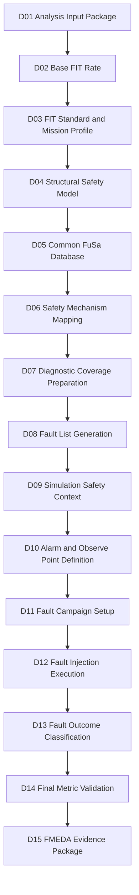

# [Automotive Safe-IC Practice 03] FIT Standard and Mission Profile: Making Reliability Assumptions Explicit

**Author**: Darren H. Chen  
**Direction**: Automotive Chip Functional Safety Analysis and Fault Injection Practice  
**Demo**: `D03_fit_standard_and_mission_profile_fixed_v2`  
**Tags**: Automotive Chip, Functional Safety, ISO 26262, FIT, Base FIT Rate, Mission Profile, IEC 62380, SN 29500, Lambda, Reliability Prediction, DCE, FMEDA, Evidence Flow, Run Identity

---

## 1. Why D03 Exists

D01 built a reproducible **analysis input package**.

D02 consumed the D01 outputs and extracted the **Base FIT Rate** into a structured evidence package.

D03 answers the next question:

> Are the FIT numbers tied to explicit reliability assumptions, or are they accidentally tied to hidden defaults?

This matters because a FIT number is not only a property of RTL.

It is a result of:

```text
design structure
+ technology assumptions
+ reliability prediction standard
+ mission profile
+ temperature assumptions
+ manufacturing year
+ default library data
+ lambda data
+ transistor-count model
+ package and environmental assumptions
```

If those assumptions are not visible, the Base FIT Rate is difficult to review, compare, reproduce, or reuse in FMEDA.

D03 therefore focuses on:

```text
FIT standard
mission profile
temperature context
manufacturing year
FIT setup protocol
default data file dependency
run identity
variant evidence management
```

The goal is not to claim that one standard or profile is universally better.

The goal is to make reliability assumptions explicit, machine-readable, comparable, and traceable.

---

## 2. What Changed in the D03 Demo Design

The D03 demo originally looked like a place to compare:

```text
IEC 62380 vs SN 29500
Passenger compartment vs powertrain
```

That is a valid long-term goal, but a public reproducible demo must not assume that every local installation contains every required reliability data file or every mission profile definition.

During real execution, two important engineering facts became clear:

```text
1. A mission profile name is not enough.
   The profile must be defined in the mission profile file with the required timing/temperature fields.

2. A FIT standard name is not enough.
   The standard-specific or standard-compatible lambda data files must exist in the local installation.
```

For this reason, the default runnable D03 demo uses three stable IEC 62380 variants based on a known available mission profile:

```text
iec62380_passenger_65c
iec62380_passenger_85c
iec62380_passenger_mfg2020
```

The optional ideas remain important:

```text
Powertrain profile
SN 29500 standard
```

But they are treated as **data-dependent optional extensions**, not default runnable variants.

This makes the demo more honest and more reproducible.

---

## 3. Recap: What D01 and D02 Already Established

Before D03, the flow already has two layers.

```text
D01_analysis_input_package
    -> prepares RTL, filelist, clock definition, FIT setup, analysis config, DB session
    -> optionally runs the configured safety analysis engine
    -> generates native tool outputs, database, logs, and managed evidence index

D02_base_fit_rate
    -> consumes D01 outputs
    -> parses the Base FIT Rate table
    -> generates bfr_summary.csv
    -> generates fit_contribution.csv
    -> generates base_fit_evidence_index.csv
```

The important lesson from D02 is:

```text
A Base FIT Rate number is useful only when its source evidence is traceable.
```

D03 extends this idea.

It asks:

```text
If the temperature assumption changes, what changes?
If the manufacturing year changes, what changes?
If the mission profile changes, is the profile actually supported by the data file?
If the FIT standard changes, do the required default data files exist?
Which file recorded the assumption?
Which run generated the evidence?
Which database session stores the result?
```

This is where BFR becomes engineering evidence rather than a number copied from a log.

---

## 4. The Core Concept: FIT Is a Reliability Model Result

FIT means **Failure In Time**.

A common engineering interpretation is:

```text
1 FIT = 1 failure per 10^9 operating hours
```

But this definition alone is not enough.

A FIT value is not measured directly from an RTL file. It is predicted by a reliability model.

That model uses assumptions such as:

```text
component type
technology process
temperature
mission profile
operating ratio
package type
manufacturing year
lambda data
transistor count or design-size model
```

A simplified view is:

```text
FIT = reliability_model(design_structure, technology, environment, mission_profile)
```

So D03 treats FIT as a **model-dependent metric**.

This leads to an important engineering rule:

> Never record a FIT number without recording the reliability model and the assumptions used to compute it.

---

## 5. FIT Standard: What It Means in the Flow

A FIT standard defines or references the method used to estimate failure rate.

In this series, two important identifiers are:

```text
iec_62380
sn_29500
```

They represent different reliability prediction approaches and input assumptions.

The selected standard can affect:

```text
permanent FIT
transient FIT
lambda contribution
required setup files
default data files
report naming
DCE naming
comparison methodology
FMEDA interpretation
```

A dangerous workflow is:

```text
run analysis
copy FIT value
forget which standard was used
```

A better workflow is:

```text
run_id = D03_IEC62380_PASSENGER_65C
fit_standard = iec_62380
mission_profile = PassengerCompartment
temperature_ja = 65
mfg_year = 2026
fit_setup = outputs/variant_fit_setups/FIT_iec62380_passenger_65c.txt
database_session = outputs/db/toy_counter_iec62380_passenger_65c.fdb::D03_IEC62380_PASSENGER_65C
```

D03 makes this run identity explicit.

---

## 6. IEC 62380: Basic Engineering Interpretation

IEC 62380 is often used in reliability prediction for electronic components and systems.

For this article series, the main thing to understand is not the full equation.

The main thing is the **decomposition mindset**.

An IEC 62380-style reliability model typically considers contributions such as:

```text
die-related failure rate
package-related failure rate
electrical overstress contribution
temperature and mission profile scaling
operating and non-operating ratios
```

A simplified mental model:

```text
Total FIT = Die FIT + Package FIT + EOS FIT
```

Where:

```text
Die FIT
    relates to silicon technology, transistor count, junction temperature, and operating profile.

Package FIT
    relates to package type, thermal cycling, mechanical stress, and mission profile.

EOS FIT
    relates to electrical overstress and interface/environment assumptions.
```

This is why mission profile matters.

The RTL can remain unchanged while the predicted reliability changes because the environment and reliability assumptions changed.

---

## 7. SN 29500: Methodology Concept and Demo Boundary

SN 29500 is another reliability prediction method commonly seen in industrial and automotive contexts.

A simplified way to understand it is:

```text
reference failure rate
    -> adjusted by component category, environment, operating condition, and stress factors
```

Key ideas include:

```text
reference condition
component category
temperature factor
operating condition
technology-dependent failure rate
```

The important point for D03 is:

> Switching from IEC 62380 to SN 29500 is not a formatting change. It can change the meaning and source of the FIT value.

However, a runnable demo must also check whether the local installation contains the required SN 29500 support data.

A variant such as:

```text
fit_standard = sn_29500
LambdaFile = <some SN29500 lambda file>
```

is only executable if the referenced lambda file exists and is compatible with the analysis engine.

Therefore, in `D03_fit_standard_and_mission_profile_fixed_v2`, SN 29500 is documented as a **methodology extension**, not a default runnable variant.

The stable default demo focuses on IEC 62380 variants first.

---

## 8. Mission Profile: The Environment Behind the Number

A mission profile describes how and where the device operates during its lifetime.

It may include:

```text
temperature ranges
time ratios at each temperature
operating vs non-operating time
thermal cycles
application location
environmental stress
```

In automotive usage, examples may include:

```text
PassengerCompartment
EngineCompartment
Powertrain
UnderHood
MotorControl
```

But a profile name is not enough.

The profile must be defined in the mission profile file with the fields expected by the analysis engine.

For example:

```text
MissionProfileType PassengerCompartment
MissionProfileFile /root/src/share/defaults/MissionProfile.txt
```

means the engine will look inside the referenced mission profile file for `PassengerCompartment`.

If a profile such as `PowertrainDemo` is not fully defined in that file, the analysis may fail even though the string looks reasonable.

That is an important D03 lesson:

> Mission profile is an input data protocol, not a free-form label.

---

## 9. TemperatureJA, Junction Temperature, and Why Names Matter

Many FIT setup files include a temperature-related field, often something like:

```text
TemperatureJA 65
```

In a demo flow, this can be interpreted as a simplified temperature assumption.

In a production flow, temperature modeling may be more precise:

```text
ambient temperature
junction temperature
junction-to-ambient relationship
board temperature
thermal mission profile
```

The key method is:

```text
Do not hide temperature assumptions in tool defaults.
```

If a run uses a default value, record it.

If a run uses an explicit value, record it.

D03 compares variants such as:

```csv
variant_id,fit_standard,mission_profile_type,temperature_ja,mfg_year
iec62380_passenger_65c,iec_62380,PassengerCompartment,65,2026
iec62380_passenger_85c,iec_62380,PassengerCompartment,85,2026
iec62380_passenger_mfg2020,iec_62380,PassengerCompartment,65,2020
```

This makes the sensitivity study reviewable.

---

## 10. MFG_YEAR: Why Manufacturing Year Appears in FIT Setup

Manufacturing year may look strange to engineers who come from pure RTL verification.

But reliability prediction may include technology maturity, manufacturing period, or default reliability-data assumptions.

A FIT setup may contain:

```text
MFG_YEAR 2026
```

The important D03 rule is:

```text
MFG_YEAR must be written using the FIT setup file protocol expected by the analysis engine.
```

In the demo flow:

```text
FIT setup file protocol: key value
```

Example:

```text
MFG_YEAR 2026
```

Not:

```text
MFG_YEAR = 2026
```

This distinction is important because the analysis initialization file may use `key = value`, while the FIT setup file may use `key value`.

D03 uses this as a concrete example of why file-protocol discipline matters.

---

## 11. Two Different Configuration Protocols

D03 continues a key lesson discovered in D01.

There are two different configuration protocols.

### 11.1 Analysis Initialization File Protocol

The analysis initialization file uses an option style such as:

```ini
mode = analysis
top = toy_counter
filelist = inputs/filelist/filelist.f
clkdef = inputs/clock/toy_counter.clk
fit_setup = outputs/variant_fit_setups/FIT_iec62380_passenger_65c.txt
fit_standard = iec_62380
write_fusa_db = true
fusa_db_name = outputs/db/toy_counter_iec62380_passenger_65c.fdb::D03_IEC62380_PASSENGER_65C
```

This is a **key equals value** style.

### 11.2 FIT Setup File Protocol

The FIT setup file uses a simpler record style:

```text
MissionProfileType PassengerCompartment
TemperatureJA 65
MFG_YEAR 2026
Process MOS.ASIC.STDCELL
LambdaFile /root/src/share/defaults/Lambda_ISO26262.txt
PitFile /root/src/share/defaults/Tech_PiT.txt
MissionProfileFile /root/src/share/defaults/MissionProfile.txt
DiagnosticCoverageFile /root/src/share/defaults/DC.txt
TransistorCountFile /root/src/share/defaults/Lib.tc
```

This is a **key value** style.

D03 explicitly documents this because many engineering failures come from mixing file protocols.

A single wrong delimiter can change the value parsed by the tool.

---

## 12. Default Data Files Are Part of Run Identity

D03 adds another practical lesson:

> Default data files are not invisible implementation details. They are part of the reliability assumption set.

A FIT setup may reference:

```text
LambdaFile
PitFile
MissionProfileFile
DiagnosticCoverageFile
TransistorCountFile
```

These files can affect the result.

Therefore, D03 records them in the variant setup and evidence index.

A robust run identity should not only say:

```text
fit_standard = iec_62380
temperature = 65
```

It should also say:

```text
LambdaFile = /root/src/share/defaults/Lambda_ISO26262.txt
MissionProfileFile = /root/src/share/defaults/MissionProfile.txt
TransistorCountFile = /root/src/share/defaults/Lib.tc
```

In public demos, paths may be generated from:

```text
SAFEIC_DEFAULTS_DIR
```

or a local fallback configured by the user.

The article should not hard-code a private tool command.

The demo can generate the local command from configuration.

---

## 13. Run Identity: The Core Methodology of D03

D03 introduces the idea of a **run identity**.

A run identity is the minimum set of fields needed to uniquely explain a result.

For Base FIT comparison, a run identity should include:

```text
variant_id
top module
FIT standard
mission profile type
temperature assumption
manufacturing year
process / technology type
FIT setup file
analysis config file
default data files
native output directory
managed output directory
database file
database session
source D01/D02 evidence
tool log
```

Example:

```csv
variant_id,fit_standard,mission_profile_type,temperature_ja,mfg_year,database_session
iec62380_passenger_65c,iec_62380,PassengerCompartment,65,2026,outputs/db/toy_counter_iec62380_passenger_65c.fdb::D03_IEC62380_PASSENGER_65C
iec62380_passenger_85c,iec_62380,PassengerCompartment,85,2026,outputs/db/toy_counter_iec62380_passenger_85c.fdb::D03_IEC62380_PASSENGER_85C
iec62380_passenger_mfg2020,iec_62380,PassengerCompartment,65,2020,outputs/db/toy_counter_iec62380_passenger_mfg2020.fdb::D03_IEC62380_PASSENGER_MFG2020
```

The principle is:

> If two runs can produce different FIT results, then the difference must be represented in run identity.

---

## 14. D03 in the Full Safe-IC Flow

D03 sits between Base FIT extraction and deeper structural safety modeling.



D03 is not a fault injection demo.

It is a reliability assumption control demo.

It ensures that later safety metrics do not float without context.

---

## 15. D03 Tool Architecture

D03 is implemented as a small evidence-processing and variant-management layer.

It should not hard-code any commercial tool command.

Instead, it relies on generic environment variables and generated command scripts.

A recommended architecture:

```text
D03_fit_standard_and_mission_profile_fixed_v2/
├── README.md
├── manifest.yaml
│
├── configs/
│   ├── variant_matrix.csv
│   ├── analysis_templates/
│   │   └── analysis_variant.template.fusaini
│   └── fit_setups/
│       ├── FIT_iec62380_passenger_65c.txt
│       ├── FIT_iec62380_passenger_85c.txt
│       └── FIT_iec62380_passenger_mfg2020.txt
│
├── inputs/
│   ├── filelist/
│   │   └── filelist.f
│   ├── clock/
│   │   └── toy_counter.clk
│   └── rtl/
│       └── toy_counter.v
│
├── scripts/
│   ├── run_demo.csh
│   └── run_demo.sh
│
├── tools/
│   └── run_d03_demo.py
│
├── Outputs/
│   └── ... native analysis engine outputs ...
│
├── outputs/
│   ├── design_input_sync.csv
│   ├── run_identity_matrix.csv
│   ├── variant_matrix_expanded.csv
│   ├── variant_expected_outputs.csv
│   ├── evidence_index.csv
│   ├── methodology_notes.csv
│   ├── variant_analysis_configs/
│   ├── variant_fit_setups/
│   ├── variant_commands/
│   ├── variant_tool_outputs/
│   ├── db/
│   └── demo_summary.md
│
└── logs/
    ├── run_demo.log
    └── run_<variant_id>.log
```

This structure separates:

```text
variant definition
FIT setup files
analysis configs
synced design inputs
native tool outputs
managed evidence outputs
logs
```

---

## 16. D03 Design Input Sync Protocol

D03 is not supposed to invent a new RTL design.

It consumes the design context already validated by D01.

Therefore, D03 synchronizes design inputs from D01 into its local package:

```text
D01/inputs/filelist/filelist.f  ->  D03/inputs/filelist/filelist.f
D01/inputs/clock/toy_counter.clk ->  D03/inputs/clock/toy_counter.clk
D01/inputs/rtl/toy_counter.v     ->  D03/inputs/rtl/toy_counter.v
```

This makes each D03 variant runnable from the D03 repository directory.

The key reason is path stability.

A variant analysis config may contain:

```ini
filelist = inputs/filelist/filelist.f
clkdef = inputs/clock/toy_counter.clk
```

Those paths must exist relative to the D03 root.

D03 records this synchronization in:

```text
outputs/design_input_sync.csv
```

That file is part of the evidence chain.

---

## 17. D03 Variant Matrix Protocol

The variant matrix is the main input protocol of D03.

The stable default variant matrix uses three executable IEC 62380 variants:

```csv
variant_id,description,fit_standard,mission_profile_type,temperature_ja,mfg_year,process,fit_setup_template,db_session
iec62380_passenger_65c,IEC 62380 passenger compartment baseline,iec_62380,PassengerCompartment,65,2026,MOS.ASIC.STDCELL,FIT_iec62380_passenger_65c.txt,D03_IEC62380_PASSENGER_65C
iec62380_passenger_85c,IEC 62380 passenger compartment higher temperature variant,iec_62380,PassengerCompartment,85,2026,MOS.ASIC.STDCELL,FIT_iec62380_passenger_85c.txt,D03_IEC62380_PASSENGER_85C
iec62380_passenger_mfg2020,IEC 62380 passenger compartment manufacturing-year variant,iec_62380,PassengerCompartment,65,2020,MOS.ASIC.STDCELL,FIT_iec62380_passenger_mfg2020.txt,D03_IEC62380_PASSENGER_MFG2020
```

This file is important because it turns comparison into a reproducible operation.

Without it, the engineer may say:

```text
I changed some setup and reran the tool.
```

With it, the engineer can say:

```text
I ran these named variants, each with a recorded FIT standard, mission profile, temperature assumption, manufacturing year, FIT setup, config file, and database session.
```

That is the difference between experiment and evidence.

---

## 18. Optional Variant Policy: Powertrain and SN 29500

D03 intentionally separates **default runnable variants** from **optional methodology variants**.

### 18.1 Powertrain Profile

A powertrain mission profile is methodologically important.

But a demo should only run it if the mission profile file contains a complete definition.

A profile such as:

```text
MissionProfileType PowertrainDemo
```

is not automatically valid.

The referenced mission profile file must provide the required fields, such as timing and temperature information.

If the local file does not contain a complete profile, the correct behavior is to mark the variant as optional or unsupported in the current environment.

### 18.2 SN 29500

SN 29500 is also methodologically important.

However, a default runnable demo should not assume that a file such as:

```text
Lambda_SN29500.txt
```

exists.

If the local defaults directory only contains:

```text
Lambda_ISO26262.txt
Lambda.txt
```

then the demo must not reference a nonexistent lambda file.

A future SN 29500 extension can be added when the local data package is validated.

D03 therefore uses stable IEC 62380 variants for the default run and documents SN 29500 as an optional extension.

---

## 19. Native Outputs and Managed Outputs

D01 introduced the distinction between:

```text
Outputs/    native analysis engine outputs
outputs/    demo-managed outputs
```

D03 continues the same convention.

### 19.1 Native Outputs

The configured engine may generate reports into a native directory such as:

```text
Outputs/
```

Typical files may include:

```text
*_DCE
*_Coverage.rpt
*_metric.summary.rpt
*_Perm_PrimaryFault.list
*_Trans_PrimaryFault.list
```

The exact naming depends on the configured tool and analysis mode.

### 19.2 Managed Outputs

D03 copies, indexes, parses, and normalizes evidence into:

```text
outputs/
```

Example managed outputs:

```text
outputs/run_identity_matrix.csv
outputs/variant_matrix_expanded.csv
outputs/variant_expected_outputs.csv
outputs/evidence_index.csv
outputs/demo_summary.md
outputs/variant_tool_outputs/<variant_id>/
```

The method is:

```text
Do not edit native tool outputs.
Collect and index them.
Generate managed summaries separately.
```

This preserves evidence integrity.

---

## 20. Variant Execution Mode

D03 should support both evidence-only and variant execution modes.

### 20.1 Evidence-Only Mode

This mode does not call the analysis engine.

It consumes existing outputs from D01/D02 or bundled fixtures.

It is useful for:

```text
GitHub readers
CI checks
documentation validation
parser testing
methodology review
```

### 20.2 Variant Execution Mode

This mode runs a selected variant using the configured analysis engine.

The exact executable is not hard-coded in the article.

It is generated by the demo based on local configuration.

Conceptually:

```text
for each selected variant:
    generate analysis config
    generate FIT setup
    generate command wrapper
    run configured safety analysis engine
    collect native Outputs/
    copy evidence into outputs/variant_tool_outputs/<variant_id>/
```

The configured executable is selected through:

```text
SAFEIC_ANALYSIS_ENGINE
```

and local environment setup.

This keeps the public article tool-neutral while preserving real engineering usability.

---

## 21. Comparison Methodology

D03 comparison should be conservative.

It should not over-interpret a tiny toy design.

The comparison logic should be:

```text
for each variant:
    validate FIT setup protocol
    validate analysis config protocol
    validate local design input sync
    validate default data file references
    run or locate native outputs
    parse Base FIT values
    record run identity
    index evidence sources

compare:
    permanent FIT
    transient FIT
    total FIT
    ratio vs baseline
    changed assumptions
```

A simple comparison table:

```csv
variant_id,fit_standard,mission_profile_type,temperature_ja,mfg_year,lambda_perm,lambda_tran,total_lambda,ratio_to_baseline
iec62380_passenger_65c,iec_62380,PassengerCompartment,65,2026,...,...,...,1.0000
iec62380_passenger_85c,iec_62380,PassengerCompartment,85,2026,...,...,...,...
iec62380_passenger_mfg2020,iec_62380,PassengerCompartment,65,2020,...,...,...,...
```

This table should not be treated as production signoff.

It is a methodology demonstration.

The value of D03 is the reproducible comparison structure.

---

## 22. Why Diagnostic Coverage May Still Be Zero in D03

D02 explained why Diagnostic Coverage can be zero in a Base FIT run.

D03 keeps the same interpretation.

If no safety mechanism is mapped or credited, then:

```text
DiagCoveragePerm = 0
DiagCoverageTran = 0
```

This is not necessarily a failure.

It means:

```text
the run is calculating baseline random hardware failure exposure
not yet crediting safety mechanisms
```

Diagnostic coverage becomes meaningful after:

```text
safety mechanism mapping
fault list generation
fault campaign execution
fault outcome classification
final metric validation
```

So D03 should not try to force DC closure.

Its job is to stabilize the assumptions behind the baseline.

---

## 23. DCE-Style Artifacts in D03

DCE-style artifacts store diagnostic coverage or safety analysis information that can be reused in later stages.

In D03, the key point is:

```text
DCE artifacts must be tied to the FIT standard and run identity.
```

A file named:

```text
toy_counter_IEC_62380.DCE
```

already suggests that the result is standard-specific.

D03 makes that explicit in the evidence index:

```csv
artifact,type,fit_standard,variant_id,source_path
toy_counter_IEC_62380.DCE,dce,iec_62380,iec62380_passenger_65c,outputs/variant_tool_outputs/iec62380_passenger_65c/toy_counter_IEC_62380.DCE
```

This matters because later stages may import or compare DCE-style evidence.

If the standard is lost, the evidence becomes ambiguous.

---

## 24. Common Database Session Strategy

D03 should avoid overwriting D01, D02, or other D03 variants.

Use named sessions and per-variant database files for the public demo.

Example:

```text
outputs/db/toy_counter_iec62380_passenger_65c.fdb::D03_IEC62380_PASSENGER_65C
outputs/db/toy_counter_iec62380_passenger_85c.fdb::D03_IEC62380_PASSENGER_85C
outputs/db/toy_counter_iec62380_passenger_mfg2020.fdb::D03_IEC62380_PASSENGER_MFG2020
```

Using one database file with multiple sessions is possible, but the demo uses per-variant database files because it is simpler and avoids accidental overwrite.

A good session name encodes:

```text
demo id
standard
mission profile
temperature or variant key
```

This makes database evidence easier to inspect and compare.

---

## 25. D03 Preflight Checks

D03 preflight should verify:

```text
D01 root exists
D02 root exists
design inputs are synchronized into D03/inputs/
variant matrix exists
each variant_id is unique
each FIT standard is supported by the demo
each FIT setup file exists
each FIT setup uses key value protocol
each analysis config template exists
each generated analysis config uses key = value protocol
each config references the expected FIT setup
each config references a unique database session
default data files are resolved
managed output directories are writable
D01/D02 source evidence is available if comparison uses previous baseline
```

Example:

```csv
check,status,details
d01_root_exists,PASS,/root/demos/D01_analysis_input_package
d02_root_exists,PASS,/root/demos/D02_base_fit_rate
sync_design_filelist,PASS,inputs/filelist/filelist.f
sync_design_clkdef,PASS,inputs/clock/toy_counter.clk
sync_rtl_entry,PASS,inputs/rtl/toy_counter.v
variant_matrix_parse,PASS,3 variants
fit_setup_protocol_iec62380_passenger_65c,PASS,key value
database_session_unique,PASS,3 sessions
```

Warnings are acceptable for preflight-only mode.

Protocol errors should be failures.

---

## 26. D03 Output Files

D03 should generate:

```text
outputs/design_input_sync.csv
outputs/run_identity_matrix.csv
outputs/variant_matrix_expanded.csv
outputs/variant_expected_outputs.csv
outputs/evidence_index.csv
outputs/methodology_notes.csv
outputs/demo_summary.md
outputs/variant_analysis_configs/
outputs/variant_fit_setups/
outputs/variant_commands/
outputs/variant_tool_outputs/
outputs/db/
```

Each file has a role.

| Output | Purpose |
|---|---|
| `design_input_sync.csv` | Records D01 design inputs copied into D03 |
| `run_identity_matrix.csv` | Connects variant, config, database session, and evidence |
| `variant_matrix_expanded.csv` | Expanded machine-readable run plan |
| `variant_expected_outputs.csv` | Expected native and managed outputs per variant |
| `evidence_index.csv` | Maps every metric and artifact back to raw evidence |
| `methodology_notes.csv` | Explains concepts used by D03 |
| `demo_summary.md` | Human-readable conclusion |
| `variant_analysis_configs/` | Generated analysis initialization files |
| `variant_fit_setups/` | Generated FIT setup files |
| `variant_commands/` | Generated command wrappers |
| `variant_tool_outputs/` | Per-variant snapshot of native tool outputs |
| `db/` | Per-variant database files |

This structure makes D03 useful even before large designs are introduced.

---

## 27. Example Demo Summary

A successful D03 summary may say:

```md
# D03 Demo Summary

Demo: D03_fit_standard_and_mission_profile_fixed_v2

## Purpose

D03 builds explicit run identities for Base FIT Rate variants.

## Default Runnable Variants

- iec62380_passenger_65c
- iec62380_passenger_85c
- iec62380_passenger_mfg2020

## Key Principle

FIT values are not standalone properties of RTL. They are model-dependent metrics tied to reliability standards, mission profiles, temperature assumptions, manufacturing year, and FIT setup files.

## Result

Preflight passed. Variant configs, FIT setups, commands, and expected evidence indexes were generated.

## Optional Extensions

SN 29500 and powertrain mission profiles can be added after validating local lambda data and mission profile definitions.

## Next Step

Use D04 to inspect structural safety elements and connect BFR evidence to endpoint/startpoint structure.
```

---

## 28. Common Mistakes

### 28.1 Treating FIT as a Pure RTL Property

FIT is not only RTL.

It is RTL plus reliability assumptions.

### 28.2 Comparing Two FIT Numbers Without Comparing Assumptions

A comparison table without standard, mission profile, temperature, manufacturing year, and data-file references is not reviewable.

### 28.3 Mixing FIT Setup Protocol and Initialization Protocol

The analysis initialization file may use:

```text
key = value
```

The FIT setup file may use:

```text
key value
```

Do not mix them.

### 28.4 Using a Mission Profile Name That Is Not Defined

A value like `PowertrainDemo` is not valid unless the mission profile file contains a complete compatible definition.

### 28.5 Referencing a Lambda File That Does Not Exist

A value like `Lambda_SN29500.txt` should not be used unless that file exists in the local installation or project data package.

### 28.6 Reusing One Database Session for Multiple Variants

If variants overwrite the same session, evidence becomes ambiguous.

### 28.7 Editing Native Tool Outputs

Do not edit files in `Outputs/`.

Copy and index them into `outputs/`.

### 28.8 Over-Interpreting a Toy Design

D03 demonstrates method.

It does not claim production reliability signoff.

---

## 29. Review Checklist

A reviewer should be able to answer:

```text
Which variants were generated?
Which FIT standard was used?
Which mission profile was used?
Which temperature assumption was used?
Which manufacturing year was used?
Which FIT setup file recorded the assumption?
Which default data files were referenced?
Which analysis config pointed to that setup?
Which database session stored each result?
Which native output files were generated?
Which managed output files summarized the result?
Are the variant ids unique?
Can the comparison be reproduced?
Can each metric be traced back to raw evidence?
Are optional variants clearly separated from default runnable variants?
```

If these answers are unclear, D03 has not done its job.

---

## 30. D03 Acceptance Criteria

D03 is complete when:

```text
[ ] D01 design inputs are synchronized into D03.
[ ] variant matrix exists.
[ ] each variant has explicit FIT standard.
[ ] each variant has explicit mission profile.
[ ] each variant has explicit temperature assumption.
[ ] each variant has explicit manufacturing year.
[ ] FIT setup files use correct key value protocol.
[ ] analysis configs use correct key = value protocol.
[ ] default data files are resolved through environment or project configuration.
[ ] database sessions are unique.
[ ] per-variant database files are generated or planned.
[ ] native outputs are not edited.
[ ] managed outputs are generated.
[ ] evidence index links metrics to raw files.
[ ] demo can run in evidence-only mode.
[ ] optional real execution is controlled by local configuration.
[ ] optional SN 29500 / powertrain variants are not treated as default runnable variants unless local data support is validated.
```

---

## 31. How D03 Connects to D04

D03 controls the reliability assumptions behind the BFR.

D04 will inspect the design structure behind those numbers.

In other words:

```text
D03 asks:
    Which model, mission profile, temperature, manufacturing year, and data files produced the FIT?

D04 asks:
    Which structural elements contributed to the safety model?
```

Together they form the bridge:

```text
reliability assumption
    -> base failure rate
    -> structural safety model
    -> diagnostic coverage preparation
    -> fault list
    -> fault campaign
    -> final FMEDA evidence
```

---

## 32. Summary

D03 introduces a critical engineering discipline:

> FIT values must be tied to explicit standards, mission profiles, environmental assumptions, data files, and run identities.

A Base FIT Rate is not just a number.

It is a model-dependent result that must carry:

```text
FIT standard
mission profile
temperature assumption
manufacturing year
process / technology type
FIT setup file
default data files
analysis config
database session
raw evidence files
managed summaries
```

D03 turns this into a reproducible demo structure.

It does not try to prove final safety compliance.

It proves that reliability assumptions are visible, comparable, and traceable.

That is the foundation needed before moving into structural safety modeling, diagnostic coverage, fault list generation, fault campaign execution, and FMEDA evidence packaging.
