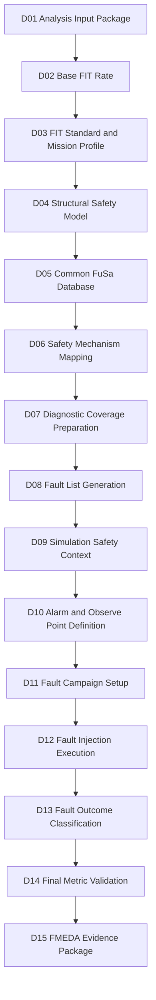

# [Automotive Safe-IC Practice 03] FIT Standard and Mission Profile: Making Reliability Assumptions Explicit

**Author**: Darren H. Chen  
**Direction**: Automotive Chip Functional Safety Analysis and Fault Injection Practice  
**Demo**: `D03_fit_standard_and_mission_profile`  
**Tags**: Automotive Chip, Functional Safety, ISO 26262, FIT, Base FIT Rate, Mission Profile, IEC 62380, SN 29500, Lambda, Reliability Prediction, DCE, FMEDA, Evidence Flow

---

## 1. Why D03 Exists

D01 built a reproducible **analysis input package**.

D02 consumed the D01 evidence and extracted the **Base FIT Rate** into structured outputs.

D03 answers the next question:

> Are the FIT numbers tied to explicit reliability assumptions, or are they accidentally tied to hidden defaults?

This matters because a FIT value is not only a property of RTL.

A FIT value is the result of a reliability model applied to a design under a defined operating context:

```text
design structure
+ technology assumptions
+ reliability prediction standard
+ mission profile
+ temperature assumptions
+ manufacturing year
+ lambda / failure-rate data
+ package and environmental assumptions
```

If these assumptions are not visible, the Base FIT Rate is difficult to review, compare, or reuse in FMEDA.

D03 therefore focuses on:

```text
FIT standard
mission profile
temperature context
manufacturing year
FIT setup protocol
variant matrix
run identity
evidence comparison
```

The goal is not to claim that one reliability standard is universally better than another.

The goal is to make reliability assumptions explicit, machine-readable, comparable, and traceable.

---

## 2. Recap: What D01 and D02 Already Established

Before D03, the flow already has two layers.

```text
D01_analysis_input_package
    -> prepares RTL, filelist, clock definition, FIT setup, analysis config, database session
    -> optionally runs the configured safety analysis engine
    -> generates native tool outputs, database evidence, logs, and managed evidence indexes

D02_base_fit_rate
    -> consumes D01 outputs
    -> parses Base FIT Rate evidence
    -> generates bfr_summary.csv
    -> generates fit_contribution.csv
    -> generates base_fit_evidence_index.csv
```

The key lesson from D02 is:

```text
A Base FIT Rate number is useful only when its source evidence is traceable.
```

D03 extends this idea.

It asks:

```text
If the FIT standard changes, what changes?
If the mission profile changes, what changes?
If the temperature assumption changes, what changes?
If the manufacturing year changes, what changes?
Which file records each assumption?
Which run generated the evidence?
Which database session stores the result?
```

This is where Base FIT Rate becomes engineering evidence rather than a number copied from a report.

---

## 3. The Core Concept: FIT Is a Reliability Model Result

FIT means **Failure In Time**.

A common engineering interpretation is:

```text
1 FIT = 1 failure per 10^9 operating hours
```

But this definition alone is not enough.

A FIT value is not measured directly from one RTL file. It is predicted by a reliability model.

That model uses inputs such as:

```text
component type
technology process
temperature
mission profile
operating ratio
package model
manufacturing year
lambda data
transistor count or design size model
```

A simplified view is:

```text
FIT = reliability_model(design_structure, technology, environment, mission_profile)
```

This leads to a practical engineering rule:

> Never record a FIT number without recording the reliability model and the assumptions used to compute it.

D03 treats FIT as a **model-dependent metric**.

That is why the demo does not only parse numbers. It also generates a run identity matrix and an evidence index.

---

## 4. What a FIT Standard Means

A FIT standard defines or references the method used to estimate failure rate.

In this series, two identifiers are important from a methodology point of view:

```text
iec_62380
sn_29500
```

They represent different reliability prediction approaches and input assumptions.

The selected standard can affect:

```text
permanent FIT
transient FIT
lambda contribution
required setup files
default data files
report naming
DCE naming
comparison methodology
FMEDA interpretation
```

A weak workflow looks like this:

```text
run analysis
copy FIT value
forget which standard was used
```

A stronger workflow looks like this:

```text
variant_id = iec62380_passenger_65c
fit_standard = iec_62380
mission_profile_type = PassengerCompartment
temperature_ja = 65
mfg_year = 2026
source_config = outputs/variant_analysis_configs/analysis_iec62380_passenger_65c.fusaini
fit_setup = outputs/variant_fit_setups/FIT_iec62380_passenger_65c.txt
database_session = outputs/db/toy_counter_iec62380_passenger_65c.fdb::D03_IEC62380_PASSENGER_65C
```

D03 turns this into a repeatable pattern.

---

## 5. IEC 62380: Engineering Interpretation

IEC 62380 is commonly used in reliability prediction for electronic components and systems.

For this article series, the main point is not to reproduce the full mathematical standard.

The main point is to understand the engineering decomposition mindset.

An IEC 62380-style calculation may consider contributions such as:

```text
die-related failure rate
package-related failure rate
electrical overstress contribution
temperature and mission profile scaling
operating and non-operating ratios
```

A simplified mental model is:

```text
Total FIT = Die FIT + Package FIT + EOS FIT
```

Where:

```text
Die FIT
    relates to silicon technology, transistor count, junction temperature, and operating profile.

Package FIT
    relates to package type, thermal cycling, mechanical stress, and mission profile.

EOS FIT
    relates to electrical overstress and interface/environment assumptions.
```

This is why mission profile matters.

A chip used in a passenger compartment and a chip used in a high-temperature environment may have the same RTL, but different reliability assumptions.

The RTL did not change.

The environment changed.

The predicted FIT may change.

---

## 6. SN 29500: Methodology Role and Data Dependency

SN 29500 is another reliability prediction method commonly encountered in industrial and automotive contexts.

A simplified way to understand it is:

```text
reference failure rate
    -> adjusted by component category, temperature, operating condition, and stress factors
```

Key concepts include:

```text
reference failure rate
component category
temperature factor
operating condition
technology-dependent failure rate
PiT or temperature-related scaling
```

The important point for D03 is:

> Switching from IEC 62380 to SN 29500 is not a formatting change. It can change both the meaning and the source of the FIT value.

However, a public demo should not assume that every local installation contains every optional reliability data file.

Therefore, the stable D03 demo keeps SN 29500 as a **methodology concept** and treats any SN 29500 execution path as optional unless the required local data is available.

This is not a weakness of the flow.

It is exactly the lesson D03 is designed to teach:

```text
A FIT standard is not just a string.
It depends on a supported data model and valid setup files.
```

---

## 7. Mission Profile: The Environment Behind the Number

A mission profile describes how and where the device operates during its lifetime.

It may include:

```text
temperature ranges
time ratios at each temperature
operating vs non-operating time
thermal cycles
application location
environmental stress
```

In automotive usage, examples may include:

```text
PassengerCompartment
EngineCompartment
UnderHood
MotorControl
GenericReferenceProfile
```

A mission profile answers questions such as:

```text
How hot is the device expected to run?
How long does it spend at each temperature?
Is it mostly powered on or mostly dormant?
Does it experience thermal cycling?
What automotive location does the assumption represent?
```

D03 uses mission profile as a first-class run-identity field.

The core method is:

```text
mission profile is explicit
mission profile is versioned
mission profile is linked to the FIT setup
mission profile is propagated into the evidence index
```

---

## 8. Tac, Ton, and Why Mission Profile Names Are Not Arbitrary

Mission profile names may look like labels, but they are not arbitrary labels.

A mission profile type must be supported by the mission profile data file used by the analysis flow.

Two common concepts are:

```text
Ton
    Operating time or powered-on time in a mission profile segment.

Tac
    Accumulated time, active time, or temperature-cycle-related time depending on the reliability model and tool data format.
```

The exact interpretation is tool- and model-dependent, but the engineering principle is stable:

> A mission profile type must map to complete time and temperature information.

A bad configuration is:

```text
MissionProfileType SomeNewProfileName
MissionProfileFile defaults/MissionProfile.txt
```

when `SomeNewProfileName` is not defined in that file.

A better configuration is:

```text
MissionProfileType PassengerCompartment
MissionProfileFile defaults/MissionProfile.txt
```

when `PassengerCompartment` is known to be supported by the selected mission profile file.

D03 therefore separates two ideas:

```text
methodology variants
    possible profiles and standards that a project may want to compare

executable variants
    profiles and standards supported by the local data files used by the demo
```

The default demo should prefer stable executable variants.

---

## 9. TemperatureJA, Junction Temperature, and Thermal Assumptions

Many FIT setup files include a temperature-related field, often something like:

```text
TemperatureJA 65
```

In a demo flow, this can be interpreted as a simplified temperature assumption.

In a production flow, thermal modeling may be more precise:

```text
ambient temperature
junction temperature
junction-to-ambient relationship
board temperature
thermal mission profile
thermal cycling
```

The key method is:

```text
Do not hide temperature assumptions in tool defaults.
```

If the run uses a default value, record it.

If the run uses an explicit value, record it.

If D03 compares two variants, make the changed assumption visible:

```csv
variant_id,fit_standard,mission_profile_type,temperature_ja,mfg_year
iec62380_passenger_65c,iec_62380,PassengerCompartment,65,2026
iec62380_passenger_85c,iec_62380,PassengerCompartment,85,2026
```

This makes sensitivity analysis reviewable.

---

## 10. MFG_YEAR: Why Manufacturing Year Appears in FIT Setup

Manufacturing year may look strange to engineers who come from pure RTL verification.

Reliability prediction may include technology maturity, process maturity, or date-dependent assumptions.

A FIT setup may contain:

```text
MFG_YEAR 2026
```

D03 does not ask readers to treat this field as an RTL property.

It asks readers to treat it as part of the reliability assumption set.

A manufacturing-year variant may look like:

```csv
variant_id,fit_standard,mission_profile_type,temperature_ja,mfg_year
iec62380_passenger_65c,iec_62380,PassengerCompartment,65,2026
iec62380_passenger_mfg2020,iec_62380,PassengerCompartment,65,2020
```

This demonstrates an important method:

```text
If a field can affect the reliability model, it belongs in run identity.
```

---

## 11. Lambda Data: What a Lambda File Represents

In reliability analysis, **lambda** is commonly used to represent a failure rate.

A lambda data file may provide reference failure-rate parameters for different technology categories.

Example technology categories may include:

```text
MOS.ASIC.STDCELL
MOS.ASIC.FCUSTOM
MOS.ASIC.GA
MOS.STD.SRAM
MOS.STD.ROM
```

A simplified mental model is:

```text
technology type -> reference lambda parameters -> scaled FIT contribution
```

A FIT setup may include:

```text
LambdaFile /path/to/defaults/Lambda_ISO26262.txt
```

or another supported lambda file.

The important lesson is:

> A lambda file is part of the reliability evidence chain.

Do not treat it as a hidden default.

Record which lambda file was used, and make it visible in the run identity or evidence index.

---

## 12. PiT / Technology Scaling Data

Some reliability models use technology scaling factors.

A setup may include a file such as:

```text
PitFile /path/to/defaults/Tech_PiT.txt
```

The exact meaning of PiT depends on the reliability method and tool implementation, but in an engineering flow it can be treated as:

```text
a technology or temperature scaling data source used by the FIT model
```

D03 does not need to derive the full PiT equation.

It needs to track the input.

A proper evidence index should capture:

```text
variant_id
fit_standard
lambda_file
pit_file
mission_profile_file
diagnostic_coverage_file
transistor_count_file
```

This prevents silent changes in default data from changing FIT results without traceability.

---

## 13. TransistorCountFile and Design Size Modeling

A FIT model often needs some estimate of design size or device count.

For RTL-level analysis, tools may estimate or map design objects into a technology model.

A file such as:

```text
TransistorCountFile /path/to/defaults/Lib.tc
```

can provide technology-level transistor-count information.

A simplified view:

```text
design structure
    -> mapped to technology categories
    -> scaled by transistor count or design size data
    -> contributes to FIT
```

D03 treats the transistor count file as part of the run identity because it can affect the scaling of the predicted failure rate.

---

## 14. DiagnosticCoverageFile in a Baseline FIT Run

A baseline run may still read a diagnostic coverage file.

This can confuse new users.

The reason is that a safety analysis engine may use default diagnostic coverage data structures even when no safety mechanism is credited.

For D03, the key distinction is:

```text
DiagnosticCoverageFile
    input file that defines available coverage assumptions or default mechanism data

DiagCoveragePerm / DiagCoverageTran
    actual coverage values credited in a specific result
```

In a pure baseline run, diagnostic coverage may still be zero:

```text
DiagCoveragePerm = 0
DiagCoverageTran = 0
```

This is not necessarily a failure.

It means:

```text
the run is calculating baseline random hardware failure exposure
not yet crediting safety mechanisms
```

Safety mechanism mapping and fault campaign evidence come later in the flow.

---

## 15. Two Different Configuration Protocols

D03 continues a key lesson from D01.

There are two different configuration protocols.

### 15.1 Analysis Initialization File Protocol

The analysis initialization file uses an option style such as:

```ini
mode = analysis
top = toy_counter
filelist = inputs/filelist/filelist.f
clkdef = inputs/clock/toy_counter.clk
fit_setup = outputs/variant_fit_setups/FIT_iec62380_passenger_65c.txt
fit_standard = iec_62380
write_fusa_db = true
fusa_db_name = outputs/db/toy_counter_iec62380_passenger_65c.fdb::D03_IEC62380_PASSENGER_65C
```

This is a **key equals value** protocol.

### 15.2 FIT Setup File Protocol

The FIT setup file uses a simpler record style:

```text
MissionProfileType PassengerCompartment
TemperatureJA 65
MFG_YEAR 2026
Process MOS.ASIC.STDCELL
LambdaFile /path/to/defaults/Lambda_ISO26262.txt
PitFile /path/to/defaults/Tech_PiT.txt
MissionProfileFile /path/to/defaults/MissionProfile.txt
DiagnosticCoverageFile /path/to/defaults/DC.txt
TransistorCountFile /path/to/defaults/Lib.tc
```

This is a **key value** protocol.

D03 explicitly documents this because many engineering failures come from mixing file protocols.

A single wrong delimiter can change the value parsed by the tool.

---

## 16. Run Identity: The Core Methodology of D03

D03 introduces the idea of a **run identity**.

A run identity is the minimum set of fields needed to uniquely explain a result.

For Base FIT comparison, a run identity should include:

```text
variant_id
top module
FIT standard
mission profile type
temperature assumption
manufacturing year
process
lambda file
PiT file
mission profile file
diagnostic coverage file
transistor count file
FIT setup file
analysis config file
native output directory
managed output directory
database file
database session
source D01/D02 evidence
tool log
```

Example:

```csv
variant_id,fit_standard,mission_profile_type,temperature_ja,mfg_year,database_session
iec62380_passenger_65c,iec_62380,PassengerCompartment,65,2026,D03_IEC62380_PASSENGER_65C
iec62380_passenger_85c,iec_62380,PassengerCompartment,85,2026,D03_IEC62380_PASSENGER_85C
iec62380_passenger_mfg2020,iec_62380,PassengerCompartment,65,2020,D03_IEC62380_PASSENGER_MFG2020
```

The principle is:

> If two runs can produce different FIT results, then the difference must be represented in run identity.

---

## 17. D03 in the Full Safe-IC Flow

D03 sits between Base FIT extraction and deeper structural safety modeling.



D03 is not a fault injection demo.

It is a reliability assumption control demo.

It ensures that later safety metrics do not float without context.

---

## 18. D03 Tool Architecture

D03 is implemented as a small evidence-processing and variant-management layer.

It should not hard-code a concrete commercial tool command.

Instead, it relies on generic environment variables and generated command scripts.

A recommended architecture:

```text
D03_fit_standard_and_mission_profile/
├── README.md
├── manifest.yaml
│
├── configs/
│   ├── variant_matrix.csv
│   ├── fit_setups/
│   │   ├── FIT_iec62380_passenger_65c.txt
│   │   ├── FIT_iec62380_passenger_85c.txt
│   │   └── FIT_iec62380_passenger_mfg2020.txt
│   └── analysis_templates/
│       └── analysis_variant.template.fusaini
│
├── inputs/
│   ├── filelist/
│   ├── clock/
│   └── rtl/
│
├── scripts/
│   ├── run_demo.csh
│   ├── run_demo.sh
│   └── setup_source.local.csh      # local-only, not committed
│
├── tools/
│   └── run_d03_demo.py
│
├── Outputs/
│   └── ... native analysis engine outputs ...
│
├── outputs/
│   ├── design_input_sync.csv
│   ├── run_identity_matrix.csv
│   ├── variant_matrix_expanded.csv
│   ├── variant_expected_outputs.csv
│   ├── evidence_index.csv
│   ├── variant_analysis_configs/
│   ├── variant_fit_setups/
│   ├── variant_commands/
│   ├── variant_tool_outputs/
│   ├── db/
│   └── demo_summary.md
│
└── logs/
    ├── run_demo.log
    └── run_<variant_id>.log
```

This structure separates:

```text
variant definition
FIT setup files
analysis configs
design input snapshot
native tool outputs
managed evidence outputs
logs
```

---

## 19. Design Input Sync Protocol

D03 may need to execute new reliability variants using the same design analyzed in D01.

Therefore, it should not only generate FIT setup files.

It must also make sure the design inputs are available.

D03 uses a design input sync protocol:

```text
D01 input filelist     -> D03 inputs/filelist/
D01 clock definition   -> D03 inputs/clock/
D01 RTL files          -> D03 inputs/rtl/
```

This gives each D03 run package a self-contained design input snapshot.

The benefit is:

```text
variant configs can use local paths
variant commands do not depend on fragile external relative paths
the evidence package is easier to archive
```

D03 records this in:

```text
outputs/design_input_sync.csv
```

This file is part of the evidence chain.

---

## 20. D03 Variant Matrix Protocol

The variant matrix is the main input protocol of D03.

Example:

```csv
variant_id,description,fit_standard,mission_profile_type,temperature_ja,mfg_year,process,fit_setup_template,db_session
iec62380_passenger_65c,IEC 62380 passenger compartment baseline,iec_62380,PassengerCompartment,65,2026,MOS.ASIC.STDCELL,FIT_iec62380_passenger_65c.txt,D03_IEC62380_PASSENGER_65C
iec62380_passenger_85c,IEC 62380 passenger compartment higher temperature variant,iec_62380,PassengerCompartment,85,2026,MOS.ASIC.STDCELL,FIT_iec62380_passenger_85c.txt,D03_IEC62380_PASSENGER_85C
iec62380_passenger_mfg2020,IEC 62380 passenger compartment manufacturing-year variant,iec_62380,PassengerCompartment,65,2020,MOS.ASIC.STDCELL,FIT_iec62380_passenger_mfg2020.txt,D03_IEC62380_PASSENGER_MFG2020
```

This file turns comparison into a reproducible operation.

Without it, an engineer may say:

```text
I changed some setup and reran the tool.
```

With it, an engineer can say:

```text
I ran these named variants, each with a recorded FIT standard, mission profile, temperature assumption, manufacturing year, config file, and database session.
```

That is the difference between experiment and evidence.

---

## 21. Native Outputs and Managed Outputs

D01 introduced the distinction between:

```text
Outputs/    native analysis engine outputs
outputs/    demo-managed outputs
```

D03 continues the same convention.

### 21.1 Native Outputs

The configured engine may generate reports into a native directory such as:

```text
Outputs/
```

Typical files may include:

```text
*_DCE
*_Coverage.rpt
*_metric.summary.rpt
*_Perm_PrimaryFault.list
*_Trans_PrimaryFault.list
```

The exact naming depends on the configured tool and analysis mode.

### 21.2 Managed Outputs

D03 copies, indexes, parses, and normalizes evidence into:

```text
outputs/
```

Example managed outputs:

```text
outputs/run_identity_matrix.csv
outputs/variant_matrix_expanded.csv
outputs/variant_expected_outputs.csv
outputs/evidence_index.csv
outputs/demo_summary.md
```

For variant execution, the native outputs are snapshotted into per-variant folders:

```text
outputs/variant_tool_outputs/<variant_id>/
```

The method is:

```text
Do not edit native tool outputs.
Collect and index them.
Generate managed summaries separately.
```

This preserves evidence integrity.

---

## 22. Per-Variant Database Strategy

D03 should avoid overwriting evidence from one variant with another.

A simple robust strategy is:

```text
one variant
    -> one database file
    -> one named session
```

Example:

```text
outputs/db/toy_counter_iec62380_passenger_65c.fdb::D03_IEC62380_PASSENGER_65C
outputs/db/toy_counter_iec62380_passenger_85c.fdb::D03_IEC62380_PASSENGER_85C
outputs/db/toy_counter_iec62380_passenger_mfg2020.fdb::D03_IEC62380_PASSENGER_MFG2020
```

This is easier for a demo than sharing one database file across all variants.

A larger project may choose a shared database with multiple sessions, but then it must strictly control overwrite behavior.

The D03 principle is:

```text
variant evidence must not be ambiguous
```

---

## 23. Comparison Methodology

D03 comparison should be conservative.

It should not over-interpret a tiny toy design.

The comparison logic should be:

```text
for each variant:
    validate FIT setup protocol
    validate analysis config protocol
    validate design input snapshot
    run or locate native outputs
    parse Base FIT values
    record run identity
    index evidence sources

compare:
    permanent FIT
    transient FIT
    total FIT
    ratio vs baseline
    changed assumptions
```

A simple comparison table:

```csv
variant_id,fit_standard,mission_profile_type,temperature_ja,mfg_year,lambda_perm,lambda_tran,total_lambda,ratio_to_baseline
iec62380_passenger_65c,iec_62380,PassengerCompartment,65,2026,...,...,...,1.0000
iec62380_passenger_85c,iec_62380,PassengerCompartment,85,2026,...,...,...,...
iec62380_passenger_mfg2020,iec_62380,PassengerCompartment,65,2020,...,...,...,...
```

This table should not be treated as production signoff.

It is a methodology demonstration.

The value of D03 is the reproducible comparison structure.

---

## 24. Why Diagnostic Coverage May Still Be Zero in D03

D02 explained why diagnostic coverage can be zero in a Base FIT run.

D03 keeps the same interpretation.

If no safety mechanism is mapped or credited, then:

```text
DiagCoveragePerm = 0
DiagCoverageTran = 0
```

This is not necessarily a failure.

It means:

```text
the run is calculating baseline random hardware failure exposure
not yet crediting safety mechanisms
```

Diagnostic coverage becomes meaningful after:

```text
safety mechanism mapping
fault list generation
fault campaign execution
fault outcome classification
final metric validation
```

So D03 should not try to force DC closure.

Its job is to stabilize the assumptions behind the baseline.

---

## 25. DCE-Style Artifacts in D03

DCE-style artifacts store diagnostic coverage or safety analysis information that can be reused in later stages.

In D03, the key point is:

```text
DCE artifacts must be tied to the FIT standard and run identity.
```

A file named:

```text
toy_counter_IEC_62380.DCE
```

already suggests that the result is standard-specific.

D03 makes that explicit in the evidence index:

```csv
artifact,type,fit_standard,variant_id,source_path
toy_counter_IEC_62380.DCE,dce,iec_62380,iec62380_passenger_65c,outputs/variant_tool_outputs/iec62380_passenger_65c/toy_counter_IEC_62380.DCE
```

This matters because later stages may import or compare DCE-style evidence.

If the standard or variant identity is lost, the evidence becomes ambiguous.

---

## 26. D03 Preflight Checks

D03 preflight should verify:

```text
D01 root exists or fixture data is available
D02 BFR summary exists if D03 references D02 baseline
design filelist is synchronized
clock definition is synchronized
RTL entries are synchronized
variant matrix exists
each variant_id is unique
each FIT standard is supported by the demo
each FIT setup file exists
each FIT setup uses key value protocol
each analysis template exists
each generated analysis config uses key = value protocol
each config references the expected FIT setup
each config references a unique database session
managed output directories are writable
optional analysis engine is configured or warning is issued
```

Example:

```csv
check,status,details
variant_matrix_exists,PASS,configs/variant_matrix.csv
variant_id_unique,PASS,3 variants
fit_setup_protocol_iec62380_passenger_65c,PASS,key value format
analysis_template_exists,PASS,configs/analysis_templates/analysis_variant.template.fusaini
database_session_unique,PASS,3 sessions
design_input_sync,PASS,inputs/filelist, inputs/clock, inputs/rtl
analysis_engine_configured,WARN,SAFEIC_ANALYSIS_ENGINE not set
```

Warnings are acceptable for preflight-only mode.

Protocol errors should be failures.

---

## 27. D03 Execution Modes

D03 should support two modes.

### 27.1 Evidence-Only Mode

This mode does not call the analysis engine.

It consumes existing outputs from D01/D02 or bundled fixtures.

It is useful for:

```text
GitHub readers
CI checks
documentation validation
parser testing
methodology review
```

### 27.2 Variant Execution Mode

This mode runs each variant using the configured analysis engine.

The exact executable is not hard-coded in the article.

It is generated by the demo based on local configuration.

Conceptually:

```text
for each variant in variant_matrix.csv:
    generate FIT setup
    generate analysis config
    generate command wrapper
    run configured safety analysis engine
    collect native Outputs/
    write per-variant evidence snapshot
```

The configured executable is selected through:

```text
SAFEIC_ANALYSIS_ENGINE
```

and local setup such as:

```text
scripts/setup_source.local.csh
```

or a system-level shell environment.

This keeps the public article tool-neutral while preserving real engineering usability.

---

## 28. D03 Output Files

D03 should generate:

```text
outputs/design_input_sync.csv
outputs/run_identity_matrix.csv
outputs/variant_matrix_expanded.csv
outputs/variant_expected_outputs.csv
outputs/evidence_index.csv
outputs/methodology_notes.csv
outputs/demo_summary.md
outputs/variant_analysis_configs/
outputs/variant_fit_setups/
outputs/variant_commands/
outputs/variant_tool_outputs/
outputs/db/
```

Each file has a role.

| Output | Purpose |
|---|---|
| `design_input_sync.csv` | Records synchronized D01 design inputs |
| `run_identity_matrix.csv` | Connects variant, standard, profile, temperature, MFG year, config, and DB |
| `variant_matrix_expanded.csv` | Adds generated paths and run IDs to each variant |
| `variant_expected_outputs.csv` | Lists expected native and managed artifacts |
| `evidence_index.csv` | Maps each metric and run identity back to evidence |
| `methodology_notes.csv` | Explains key concepts used by the demo |
| `demo_summary.md` | Human-readable summary |
| `variant_analysis_configs/` | Generated analysis initialization files |
| `variant_fit_setups/` | Generated FIT setup files |
| `variant_commands/` | Generated command wrappers |
| `variant_tool_outputs/` | Per-variant native output snapshots |
| `db/` | Per-variant database files |

This structure makes D03 useful even before large designs are introduced.

---

## 29. Example Demo Summary

A successful D03 summary may say:

```md
# D03 Demo Summary

Demo: D03_fit_standard_and_mission_profile

## Purpose

D03 makes reliability assumptions explicit by generating a variant matrix and run identity table.

## Variants

- iec62380_passenger_65c
- iec62380_passenger_85c
- iec62380_passenger_mfg2020

## Key Principle

FIT values are not standalone properties of RTL. They are model-dependent metrics tied to reliability standards, mission profiles, temperature assumptions, manufacturing year, and FIT setup files.

## Result

Preflight passed. Variant configs, FIT setups, command wrappers, expected outputs, and evidence indexes were generated.

## Next Step

Use D04 to inspect structural safety elements and connect BFR evidence to endpoint/startpoint structure.
```

---

## 30. Common Mistakes

### 30.1 Treating FIT as a Pure RTL Property

FIT is not only RTL.

It is RTL plus reliability assumptions.

### 30.2 Comparing Two FIT Numbers Without Comparing Assumptions

A comparison table without standard and mission profile fields is not reviewable.

### 30.3 Mixing FIT Setup Protocol and Initialization Protocol

The analysis initialization file may use:

```text
key = value
```

The FIT setup file may use:

```text
key value
```

Do not mix them.

### 30.4 Using Unsupported Mission Profile Names

A mission profile type must exist in the selected mission profile file.

Do not assume that a descriptive name is executable.

### 30.5 Assuming Optional Data Files Exist

A reliability standard may require data files that are not present in every local installation.

Demo defaults should use data files known to exist in the public or local setup, and optional variants should be clearly marked.

### 30.6 Reusing One Database Session for Multiple Variants

If variants overwrite the same session, evidence becomes ambiguous.

### 30.7 Editing Native Tool Outputs

Do not edit files in `Outputs/`.

Copy and index them into `outputs/`.

### 30.8 Over-Interpreting a Toy Design

D03 demonstrates method.

It does not claim production reliability signoff.

---

## 31. Review Checklist

A reviewer should be able to answer:

```text
Which variants are defined?
Which FIT standard is used by each variant?
Which mission profile is used by each variant?
Which temperature assumption is used?
Which manufacturing year is used?
Which lambda file is used?
Which PiT file is used?
Which mission profile file is used?
Which transistor count file is used?
Which FIT setup file records the assumption?
Which analysis config points to that setup?
Which database file and session store each result?
Which native output files are expected?
Which managed output files summarize the result?
Are the variant ids unique?
Can the comparison be reproduced?
Can each metric be traced back to raw evidence?
```

If these answers are unclear, D03 has not done its job.

---

## 32. D03 Acceptance Criteria

D03 is complete when:

```text
[ ] variant matrix exists
[ ] each variant has explicit FIT standard
[ ] each variant has explicit mission profile or documented default
[ ] each variant has explicit temperature assumption or documented default
[ ] each variant has explicit manufacturing year
[ ] each variant has explicit lambda / PiT / mission-profile data files
[ ] FIT setup files use correct key value protocol
[ ] analysis configs use correct key = value protocol
[ ] D01 design inputs are synchronized or clearly referenced
[ ] database files and sessions are unique
[ ] native outputs are not edited
[ ] managed outputs are generated
[ ] evidence index links metrics to raw files
[ ] demo can run in evidence-only mode
[ ] optional real execution is controlled by local configuration
```

---

## 33. How D03 Connects to D04

D03 controls the reliability assumptions behind the BFR.

D04 will inspect the design structure behind those numbers.

In other words:

```text
D03 asks:
    Which model and mission profile produced the FIT?

D04 asks:
    Which structural elements contributed to the safety model?
```

Together they form the bridge:

```text
reliability assumption
    -> base failure rate
    -> structural safety model
    -> diagnostic coverage preparation
    -> fault list
    -> fault campaign
    -> final FMEDA evidence
```

---

## 34. Summary

D03 introduces a critical engineering discipline:

> FIT values must be tied to explicit standards, mission profiles, data files, and run identities.

A Base FIT Rate is not just a number.

It is a model-dependent result that must carry:

```text
FIT standard
mission profile
temperature assumption
manufacturing year
process
lambda file
PiT file
mission profile file
transistor count file
FIT setup file
analysis config
database session
raw evidence files
managed summaries
```

D03 turns this into a reproducible demo structure.

It does not try to prove final safety compliance.

It proves that reliability assumptions are visible, comparable, and traceable.

That is the foundation needed before moving into structural safety modeling, diagnostic coverage, fault list generation, fault campaign execution, and FMEDA evidence packaging.
