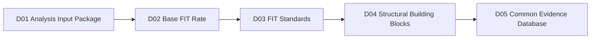
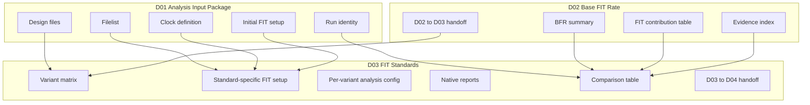
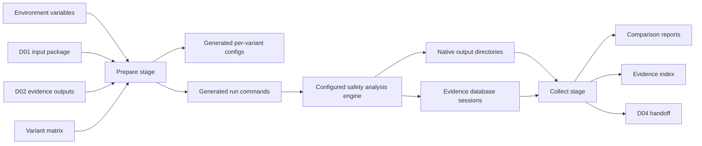

# Automotive Safe-IC Practice 03: FIT Standards — IEC 62380 vs SN 29500

Author: Darren H. Chen

Direction: Automotive Chip Functional Safety / Safe-IC Verification Platform

Demo: D03_fit_standards_real_engine_from_d01_d02

Tags: ISO 26262, Functional Safety, Safe-IC, FIT, BFR, IEC 62380, SN 29500, Mission Profile, Reliability Prediction, FMEDA, Diagnostic Coverage, Evidence Traceability

---

## 1. Why the Third Practice Focuses on FIT Standards

The first practice builds an **analysis input package**. It defines the design boundary, collects RTL or netlist files, captures the filelist, describes clocks, prepares the FIT setup, and records the analysis initialization context.

The second practice calculates the **Base FIT Rate**, usually abbreviated as **BFR**. BFR is the initial failure-rate baseline before any diagnostic benefit from safety mechanisms is credited.

The third practice answers a question that is easy to underestimate:

```text
Which reliability prediction standard produced this FIT value?
```

This question is not cosmetic. It is not merely a report suffix. It is a core part of the engineering identity of a functional-safety result.

Two runs may use the same design, the same top module, the same clock definition, the same filelist, and the same Base FIT workflow. If one run calculates the failure rate using IEC 62380 and another run calculates it using SN 29500, the interpretation of the result changes. The calculation model, required input assumptions, report naming, intermediate parameters, and downstream FMEDA evidence can all change.

Therefore, D03 is not about proving that one standard is universally better than the other. It is about building a disciplined method:

```text
Every FIT result must carry its standard, mission profile, parameter set, design boundary, and evidence identity.
```

D03 sits between D02 and D04:



D02 gives us the Base FIT baseline. D03 makes the standard and mission-profile identity explicit. D04 then starts to examine structural artifacts such as endpoint, startpoint, DCE, and endpoint-to-safety-mechanism mapping.

If D03 is skipped, a later FMEDA table may still contain numbers, but the project may lose confidence in where those numbers came from. In safety engineering, a number without provenance is weak evidence.

---

## 2. FIT, BFR, DC, and Residual FIT

Before comparing IEC 62380 and SN 29500, we need a clear vocabulary.

### 2.1 FIT

**FIT** means **Failure In Time**.

A common definition is:

```text
1 FIT = 1 failure per 1,000,000,000 operating hours
```

or:

```text
1 FIT = 1e-9 failures/hour
```

In automotive semiconductor safety analysis, FIT is used to quantify random hardware failure exposure. It does not describe design bugs. Design bugs belong to systematic fault prevention and verification. FIT focuses on random hardware faults that may occur during the lifetime of the device.

A simplified mental model is:

```text
FIT = how often random hardware defects are expected to affect the hardware over time
```

Real FIT calculation is not guessed. It depends on factors such as:

```text
technology family
component type
transistor count
memory size
package type
temperature
mission profile
operating ratio
non-operating ratio
manufacturing year or technology maturity
reference failure-rate data
```

### 2.2 BFR

**BFR** means **Base FIT Rate**.

It is the failure-rate baseline calculated before safety mechanisms are credited.

A practical question for BFR is:

```text
How much random hardware failure exposure exists in the current design before diagnostic coverage is applied?
```

BFR is important because diagnostic coverage has no engineering meaning if the covered failure-rate population is unknown.

Example:

```text
Design A: Base FIT = 10 FIT, DC = 90%
Design B: Base FIT = 1000 FIT, DC = 90%
```

Both designs have the same DC percentage, but their residual exposure is very different.

### 2.3 DC

**DC** means **Diagnostic Coverage**.

A simplified definition is:

```text
DC = covered relevant faults / total relevant faults
```

In a FIT-weighted flow, a more useful interpretation is:

```text
FIT-weighted DC = covered FIT / total relevant FIT
```

This is why the FIT standard matters. If the FIT contribution of a structure changes under a different reliability model, the meaning of coverage may also shift.

### 2.4 Residual FIT

**Residual FIT** is the failure-rate contribution left after diagnostic coverage is credited.

A simplified conceptual model is:

```text
Residual FIT = Base FIT x (1 - Diagnostic Coverage)
```

In real FMEDA work, the calculation is usually split by part, sub-part, failure mode, safety mechanism, and diagnostic coverage assumption. The conceptual formula is still useful because it shows why BFR, DC, and residual FIT must be kept in the same evidence chain.

---

## 3. The Two FIT Standards in This Practice

The safety analysis flow in this practice uses two supported FIT standard identifiers:

```text
iec_62380
sn_29500
```

These are the **only FIT standards** compared in D03.

A common source of confusion is to mix up **FIT standard** and **experiment variant**.

The FIT standard is one of:

```text
fit_standard = iec_62380
fit_standard = sn_29500
```

A variant is a run identity built from the standard plus its parameter context:

```text
variant_id = fit_standard + mission_profile + parameter_set
```

For example:

```text
iec62380_passenger_65c
iec62380_motorcontrol_85c
sn29500_reference_65c
```

These are not standards. They are scenario names used to separate output directories, database sessions, evidence indexes, and comparison rows.

This distinction is important enough to become a rule:

```text
Never call a parameterized run variant a FIT standard.
```

---

## 4. IEC 62380: Mission-Profile-Oriented Reliability Prediction

IEC 62380 can be understood as a reliability prediction model where the operating environment and mission profile have strong influence on the predicted failure rate.

For integrated circuits, a useful high-level decomposition is:

```text
Total FIT = die-related FIT + package-related FIT + electrical-overstress-related FIT
```

The terms are not merely mathematical details. They represent physical failure contributors.

### 4.1 Die Contribution

The die-related contribution is connected to the silicon technology, design size, and temperature behavior.

Important concepts include:

```text
technology family
base failure rate per transistor
number of transistors or equivalent size
junction temperature
temperature acceleration factor
operating time ratio
non-operating time ratio
technology maturity
```

In a small educational RTL example, the design may have a tiny calculated permanent FIT contribution. In a real SoC, the size, memory content, IP composition, and implementation level can significantly affect the result.

### 4.2 Package Contribution

The package-related contribution reflects mechanical and thermal stress at the package level.

Important concepts include:

```text
package type
thermal expansion mismatch
thermal cycles
mission temperature swings
mounting substrate influence
```

This is especially important in automotive environments because the same semiconductor may experience different thermal stress depending on whether it is located in a passenger compartment, engine control area, powertrain module, or other harsh thermal location.

### 4.3 EOS Contribution

**EOS** means **Electrical Overstress**.

It captures failure contribution related to electrical stress in the application environment. Interface exposure, voltage stress, and external electrical conditions can influence this part of the model.

### 4.4 Mission Profile

A **mission profile** describes how a product is used over its lifetime.

For FIT analysis, it usually includes information such as:

```text
operating temperature distribution
percentage of time powered on
percentage of time powered off
ambient or junction temperature assumptions
thermal cycles
application environment
```

A simple mission-profile idea is:

```text
The device spends part of its life at one temperature, part at another temperature, and part powered off.
```

A more realistic automotive mission profile may include many phases and temperature bands.

The important point is that IEC 62380 should not be treated as a single constant number. It is a calculation model that becomes meaningful only when the design boundary and mission profile are explicit.

---

## 5. SN 29500: Reference Failure Rate and Operating-Condition Conversion

SN 29500 is commonly used for reliability prediction in automotive electronics. It is often described through reference failure rates and conversion from reference conditions to actual operating conditions.

A practical mental model is:

```text
Start from reference failure-rate data.
Adjust the interpretation according to component category and operating conditions.
Use the result as the predicted failure-rate contribution.
```

Important concepts include:

```text
reference failure rate
component category
operating temperature
stress conditions
technology-dependent assumptions
conversion from reference condition to use condition
```

SN 29500 is not simply a report-format alternative to IEC 62380. It can produce a different baseline, and that baseline can affect downstream FMEDA reasoning.

This is why D03 compares the two standards under a controlled design boundary rather than comparing numbers from unrelated runs.

---

## 6. Standard Selection Is a Run Identity Field

A safety-analysis result must be traceable. Traceability means that later engineers can answer:

```text
Which design was analyzed?
Which top module was used?
Which filelist was used?
Which clock definition was used?
Which FIT setup was used?
Which FIT standard was selected?
Which mission profile was used?
Which output directory contains native tool reports?
Which database session stores the structured result?
Which upstream BFR evidence was inherited from D02?
```

The FIT standard belongs in the same category as top module, input filelist, and mission profile. It is not optional metadata.

A weak result table would be:

```csv
variant,total_fit
run1,45.0
```

A stronger result table is:

```csv
variant_id,fit_standard,mission_profile,parameter_set,total_fit,evidence_dir,db_session
sn29500_reference_65c,sn_29500,reference,65c,45.0,outputs/native/sn29500_reference_65c,D03_SN29500_REFERENCE_65C
```

The second table is more reviewable because it preserves engineering context.

---

## 7. D03 Input Protocol: D01 and D02 Are Upstream Requirements

In this practice, D03 is not an isolated demo.

It consumes:

```text
D01 output: analysis input package
D02 output: Base FIT evidence and handoff data
```

This creates a clear data lineage:



Here, the word **protocol** means an engineering contract between stages. It defines what one stage must produce and what the next stage is allowed to consume.

The D03 input protocol is:

```text
D03 must not silently redefine the design boundary.
D03 must not invent a new filelist if D01 already defined one.
D03 must not ignore the BFR evidence produced by D02.
D03 may create standard-specific FIT setup variants.
D03 must preserve enough provenance for D04.
```

This keeps the series coherent. D03 is a standard-sensitivity and evidence-identity practice, not a fresh standalone design run.

---

## 8. Variant Matrix: How to Compare Standards Without Confusing Terms

A **variant matrix** is a table that enumerates controlled experiments.

A typical D03 variant matrix contains fields like:

```text
variant_id
fit_standard
mission_profile_type
temperature_assumption
manufacturing_year_assumption
fit_setup_template
analysis_session
native_output_dir
description
```

A conceptual example:

```csv
variant_id,fit_standard,mission_profile_type,parameter_set
iec62380_passenger_65c,iec_62380,passenger_compartment,temperature_65c
iec62380_motorcontrol_85c,iec_62380,motor_control,temperature_85c
sn29500_reference_65c,sn_29500,reference,temperature_65c
```

This table does not claim that there are three FIT standards. It says there are three experiment scenarios.

The comparison should be interpreted as:

```text
What changes when the reliability prediction standard changes?
What changes when the mission-profile assumptions change?
Which outputs must carry standard identifiers?
Which downstream artifacts must not be mixed across standards?
```

---

## 9. D03 Tool Architecture

D03 uses a small orchestration layer around a configured safety analysis engine.

The architecture is intentionally simple:



The orchestration layer does not replace the analysis engine. It performs the work that is usually messy in real projects:

```text
checking upstream inputs
copying snapshots for reproducibility
expanding variants
rendering per-variant configuration files
building per-variant commands
executing runs in a repeatable order
collecting native reports
classifying logs
creating comparison tables
creating evidence indexes
creating handoff files
```

This separation matters. The analysis engine calculates FIT and structural safety metrics. The orchestration layer manages evidence.

---

## 10. Neutral Execution Interface

The demo uses a neutral execution interface so that public repository scripts do not hard-code private installation paths.

Conceptually:

```csh
setenv SAFEIC_ANALYSIS_ENGINE /path/to/safety_analysis_engine
setenv D01_ROOT /path/to/D01_analysis_input_package
setenv D02_ROOT /path/to/D02_base_fit_rate

csh scripts/run_demo.csh
```

The generated per-variant command follows this idea:

```csh
$SAFEIC_ANALYSIS_ENGINE \
  --config outputs/variant_analysis_configs/analysis_<variant_id>.cfg \
  --filelist outputs/resolved_inputs/filelist.f \
  --fit_setup outputs/variant_fit_setups/FIT_<variant_id>.txt \
  --fit_standard <iec_62380_or_sn_29500> \
  --output_dir outputs/native/<variant_id>
```

The command above is a neutral representation of the run contract. The important ideas are:

```text
one design boundary
one resolved filelist
one standard-specific FIT setup
one explicit fit_standard value
one native output directory per variant
one evidence database session per variant
```

This is the pattern that prevents data mixing.

---

## 11. Configuration Generation

A practical D03 implementation should avoid editing many run files manually.

Instead, it should use templates.

### 11.1 Analysis Initialization Template

The analysis initialization template contains stable fields:

```ini
top = <top_module>
mode = analysis
clkdef = <resolved_clock_definition>
fit_setup = <generated_fit_setup>
fit_standard = <iec_62380_or_sn_29500>
verbose_fit = true
block_level = true
write_evidence_db = true
evidence_db_name = <db_file>::<session_name>
```

This is a conceptual configuration example. Field names may be adapted to the actual analysis engine. The engineering principles remain the same:

```text
make the standard explicit
make the clock definition explicit
make the FIT setup explicit
make the database session explicit
make the run repeatable
```

### 11.2 FIT Setup Template

The FIT setup template contains reliability-prediction inputs.

For IEC 62380-oriented runs, the setup may include:

```text
process or technology category
mission profile type
mission profile file
temperature assumptions
manufacturing year assumption
transistor-count or library information
package-related assumptions
DC definition file
```

For SN 29500-oriented runs, the setup may include:

```text
reference failure-rate data
component category
operating temperature
technology category
conversion factors or derating assumptions
DC definition file
```

The point is not to make both standards use identical inputs. The point is to make each run explicit and reviewable.

---

## 12. Why Per-Variant Output Isolation Matters

A common mistake in automation is to run multiple scenarios into the same output directory.

That creates several risks:

```text
report overwrite
ambiguous latest file
mixed database sessions
unclear log ownership
manual post-processing mistakes
```

D03 avoids this by assigning one native output area per variant:

```text
outputs/native/iec62380_passenger_65c/
outputs/native/iec62380_motorcontrol_85c/
outputs/native/sn29500_reference_65c/
```

It also assigns one database session per variant:

```text
outputs/db/iec62380_passenger_65c.fdb::D03_IEC62380_PASSENGER_65C
outputs/db/iec62380_motorcontrol_85c.fdb::D03_IEC62380_MOTORCONTROL_85C
outputs/db/sn29500_reference_65c.fdb::D03_SN29500_REFERENCE_65C
```

This structure is not just neat. It supports auditability.

A reviewer can ask:

```text
Which run produced this DCE file?
Which standard was used?
Which log belongs to that run?
Which comparison row references it?
Which database session stores it?
```

The repository should answer these questions without manual detective work.

---

## 13. The DCE Boundary: Why D03 Must Prepare D04 Carefully

D04 will discuss structural building blocks:

```text
Endpoint
Startpoint
DCE
EP-to-SM Map
```

D03 must therefore hand off standard-tagged structural evidence carefully.

### 13.1 Endpoint

An **endpoint** is a design observation or storage boundary where a fault effect may be evaluated for diagnostic coverage.

Typical examples include:

```text
registers
latches
output ports
state elements
selected observation points
```

### 13.2 Startpoint

A **startpoint** is a source-side structure from which a fault may propagate toward an endpoint.

A simplified path is:

```text
startpoint --> logic cone --> endpoint
```

### 13.3 DCE

**DCE** means **Diagnostic Coverage Element**.

A DCE-style artifact describes structural elements and coverage-related information that can later be used to compute or validate diagnostic coverage.

DCE artifacts must not be mixed across incompatible FIT standards. If a DCE file was generated under one standard and a later hierarchical analysis assumes another standard, the evidence chain becomes inconsistent.

### 13.4 EP-to-SM Map

**EP-to-SM Map** means **Endpoint-to-Safety-Mechanism Map**.

It connects structural endpoints to safety mechanisms that detect, control, or mitigate faults.

Example concept:

```text
endpoint: state_reg[3]
safety mechanism: parity_checker_A
alarm: safety_alarm_0
coverage assumption: permanent error endpoint coverage
```

D03 does not fully build the EP-to-SM map. It prepares the standard-specific evidence context that D04 will use.

---

## 14. Log Diagnostics: Warnings Are Not All Failures

A real safety-analysis flow produces messages. Some are fatal errors. Some are warnings. Some warnings are known and explainable. Some terms contain the word “Error” because they describe safety categories, not execution failures.

A robust D03 flow should not simply execute:

```text
grep -i error log
```

and declare the run failed.

That approach is too naive.

### 14.1 Fatal Conditions

The run should be treated as failed if the engine exits with a nonzero status or if the log contains unambiguous fatal execution messages such as:

```text
fatal tool error
configuration parse failure
missing required design input
unsupported standard value
missing required reliability setup
missing top module
missing required clock or package data for the selected mode
```

### 14.2 Known Diagnostic Warnings

Some warnings may describe duplicated default definitions or ignored repeated safety-mechanism entries. If the tool uses the first definition and completes the run successfully, this warning may be recorded as an explained diagnostic rather than treated as a run failure.

A good evidence practice is:

```text
record the warning
classify it
explain whether it affects the run
keep the exit code and output evidence
avoid silently hiding important diagnostics
```

For a clean public demo, known benign warning classes may also be suppressed in the generated analysis configuration, but only if the suppression itself is traceable.

### 14.3 Safety Terminology Containing “Error”

Terms such as the following may appear in reports:

```text
Permanent Error EP
Transient Error SP
Permanent Error Cone
Transient Error Cone
```

These are not necessarily execution errors. They are categories in the diagnostic coverage model.

The correct log policy is:

```text
execution error != safety error category
```

This distinction matters because functional safety tools often discuss error propagation, error detection, and error coverage. Those words are part of the domain language.

---

## 15. Comparison Report Design

D03 should produce a comparison table that is useful for both engineers and reviewers.

A recommended comparison table contains:

```text
variant_id
fit_standard
mission_profile_type
parameter_set
exit_code
run_status
summary_report
dce_file
database_session
parsed_total_lambda_permanent
parsed_total_lambda_transient
warnings_classified
handoff_ready
```

The exact extracted metric names may depend on the native report format. The design goal is not to overfit one report parser. The design goal is to create a stable index.

A useful Markdown comparison table may look like:

| Variant | FIT Standard | Mission Profile | Status | Evidence |
|---|---|---|---|---|
| `iec62380_passenger_65c` | `iec_62380` | passenger compartment | pass/fail | native report + DB session |
| `iec62380_motorcontrol_85c` | `iec_62380` | motor control | pass/fail | native report + DB session |
| `sn29500_reference_65c` | `sn_29500` | reference condition | pass/fail | native report + DB session |

The table should not present toy values as product conclusions. It should present evidence structure and reproducible method.

---

## 16. Methodology: How to Read the Results

When the D03 comparison is complete, the interpretation should follow this order.

### 16.1 Check the Run Boundary

Before comparing values, verify:

```text
same design boundary
same top module
same upstream D01 input package
same upstream D02 BFR context
same output isolation policy
```

If the input boundary changes, the comparison is no longer purely about standard and mission-profile sensitivity.

### 16.2 Check the Standard

Confirm that each run explicitly records:

```text
fit_standard = iec_62380
```

or:

```text
fit_standard = sn_29500
```

No row should rely on a hidden default.

### 16.3 Check the Mission Profile

For IEC 62380-oriented runs, mission profile is central. The comparison should state whether the run represents a passenger-compartment-like, motor-control-like, or other application-style profile.

### 16.4 Check Permanent and Transient Contributions Separately

Permanent and transient FIT contributions should not be merged too early.

A useful reading strategy is:

```text
permanent FIT: process, technology, package, mission-profile assumptions
transient FIT: memory/register/gate soft-error assumptions
```

### 16.5 Check Evidence Consistency

Every comparison row should point back to:

```text
command identity
analysis configuration
FIT setup
native output directory
database session
summary report
DCE artifact
log diagnostics
```

The result is stronger when the table acts as an index into evidence, not just a numeric display.

---

## 17. Why This Matters for FMEDA

**FMEDA** means **Failure Modes, Effects, and Diagnostic Analysis**.

In a semiconductor functional-safety flow, FMEDA is the place where architectural failure modes, diagnostic mechanisms, FIT contribution, residual FIT, and safety metrics are brought together.

A simplified FMEDA row may need:

```text
part
sub-part
failure mode
effect
safety mechanism
base FIT
diagnostic coverage
residual FIT
ASIL relevance
evidence source
```

D03 affects several of these fields:

```text
base FIT
residual FIT interpretation
standard identity
evidence source
DCE naming
hierarchical reuse
```

If D03 is weak, FMEDA evidence becomes fragile. If D03 is strong, later FMEDA tables can point to a clear standard-specific calculation lineage.

---

## 18. Practical Repository Layout for D03

A practical D03 repository structure is:

```text
D03_fit_standards_real_engine_from_d01_d02/
├── README.md
├── configs/
│   ├── variant_matrix.csv
│   ├── analysis_templates/
│   │   └── analysis_variant.template.cfg
│   └── fit_setups/
│       ├── FIT_iec62380_passenger_65c.txt
│       ├── FIT_iec62380_motorcontrol_85c.txt
│       └── FIT_sn29500_reference_65c.txt
│
├── inputs/
│   ├── from_D01/
│   │   └── input_package/
│   └── from_D02/
│       └── outputs_snapshot/
│
├── scripts/
│   └── run_demo.csh
│
├── tools/
│   └── run_d03_real_from_d01_d02.py
│
├── outputs/
│   ├── resolved_inputs/
│   ├── variant_fit_setups/
│   ├── variant_analysis_configs/
│   ├── variant_commands/
│   ├── native/
│   ├── db/
│   ├── variant_status/
│   ├── source_provenance.csv
│   ├── run_status.csv
│   ├── fit_standard_real_comparison.csv
│   ├── fit_standard_real_comparison.md
│   ├── log_diagnostics.csv
│   ├── evidence_index.csv
│   ├── d03_handoff_to_d04.csv
│   └── demo_summary.md
│
└── logs/
    ├── run_<variant_id>.console.log
    └── collect.log
```

The directory names are not the method. The method is the separation of responsibilities:

```text
configs/  = experiment intent
inputs/   = upstream snapshots
scripts/  = user entry points
tools/    = orchestration logic
outputs/  = managed evidence
logs/     = execution records
```

---

## 19. D03 Output Protocol

D03 should end with a small set of stable outputs.

### 19.1 Source Provenance

```text
outputs/source_provenance.csv
```

This file records which D01 and D02 files were consumed, where they were copied, and whether they were available.

### 19.2 Run Status

```text
outputs/run_status.csv
```

This file records each variant’s exit code and high-level status.

### 19.3 Standard Comparison

```text
outputs/fit_standard_real_comparison.csv
outputs/fit_standard_real_comparison.md
```

These files compare standard and mission-profile variants under a controlled design boundary.

### 19.4 Log Diagnostics

```text
outputs/log_diagnostics.csv
```

This file classifies fatal errors, known warnings, and domain terminology containing the word “error”.

### 19.5 Evidence Index

```text
outputs/evidence_index.csv
```

This file links variants to generated commands, configurations, FIT setup files, logs, native outputs, reports, and database sessions.

### 19.6 Handoff to D04

```text
outputs/d03_handoff_to_d04.csv
```

This file tells D04 which standard-specific structural artifacts and sessions are ready for endpoint/startpoint/DCE analysis.

---

## 20. Quality Gates

D03 should have explicit quality gates.

A run should be considered acceptable only if:

```text
D01 input package is available
D02 BFR evidence is available
all required variants have explicit fit_standard values
no variant relies on an implicit default standard
per-variant output directories are isolated
per-variant database sessions are isolated
native engine exit codes are captured
fatal errors are detected
known warnings are classified
comparison tables are generated
D04 handoff is generated
```

A run should not be considered acceptable if:

```text
a variant has an unsupported fit_standard
D01 and D02 are bypassed without explanation
outputs from different variants are mixed
DCE artifacts are reused across incompatible standards
logs are only checked with a naive grep
summary values are copied without evidence links
```

These quality gates make the demo closer to an engineering workflow than a one-off script.

---

## 21. What D03 Does Not Prove

D03 does not prove that a chip satisfies an ASIL target.

D03 does not prove final diagnostic coverage.

D03 does not prove safety mechanism effectiveness.

D03 does not replace fault injection.

D03 does not finalize FMEDA.

Instead, D03 proves something narrower but essential:

```text
The same design boundary and BFR context can be analyzed under explicit FIT standards and parameterized mission-profile variants, with traceable evidence for each run.
```

That is the right scope for the third practice.

---

## 22. Connection to the Next Practice

D04 will move from standard identity to structural analysis.

The next questions are:

```text
Which endpoints dominate the diagnostic coverage problem?
Which startpoints feed those endpoints?
Which DCE-style artifacts were produced?
How can endpoints be mapped to safety mechanisms?
Which structures should be protected first?
```

D03 prepares D04 by ensuring that every structural artifact is tied to the correct standard and run identity.

The handoff is:

```text
D03: Which standard and mission profile produced this structural evidence?
D04: Which structural elements explain the safety-analysis result?
```

---

## 23. Summary

The main lesson of D03 is simple:

```text
A FIT number is incomplete without its standard and mission-profile identity.
```

IEC 62380 and SN 29500 are the two FIT standards compared in this practice. Parameterized names such as `iec62380_passenger_65c` are not standards; they are variant identifiers.

D03 connects D01 and D02 to later structural safety work. It reuses the D01 design boundary, consumes the D02 BFR evidence, expands standard-specific variants, runs the configured analysis engine, isolates outputs, builds comparison tables, classifies diagnostics, and produces the D04 handoff.

The deeper engineering principle is:

```text
Functional safety evidence is not only about calculation.
It is about preserving the identity, assumptions, and traceability of every calculation.
```

That is why FIT standard selection deserves its own practice before endpoint, startpoint, DCE, safety mechanism mapping, fault campaign setup, and FMEDA closure.
