# [Automotive Safe-IC Practice 03] Why Safety Analysis Starts with Base FIT Rate

**Author**: Darren H. Chen  
**Direction**: Automotive Chip Functional Safety Analysis and Fault Injection Practice  
**Demo**: D03_base_fit_rate  
**Tags**: Automotive Chip, Functional Safety, ISO 26262, FIT, BFR, Base FIT Rate, Random Hardware Fault, IEC 62380, SN 29500, Mission Profile, FMEDA

---

## 1. Why This Article Matters

Before we talk about diagnostic coverage, safety mechanisms, fault campaigns, alarm lists, or fault injection results, we must answer a more basic question:

> How much random hardware failure exposure does the chip have before protection is considered?

This question is answered by the **Base FIT Rate**, usually abbreviated as **BFR**.

The third demo in this repository is:

```text
D03_base_fit_rate
```

The generic tool introduced in this article is:

```text
safeic-bfr
```

The purpose of `safeic-bfr` is not to prove that a design is safe. Its purpose is to build the initial quantified baseline for later safety analysis.

The key idea is:

> BFR is the starting point of chip-level functional safety analysis because it defines the unprotected or baseline random hardware failure exposure that safety mechanisms must reduce, detect, correct, mask, or control.

Without BFR, diagnostic coverage has no real weight. A 90% coverage claim is much more meaningful when we know what amount of FIT it covers.

---

## 2. FIT: A Failure Rate, Not a Simulation Result

FIT means **Failure In Time**.

A common engineering definition is:

```text
1 FIT = 1 failure per 1,000,000,000 hours
      = 1 × 10^-9 failures / hour
```

FIT is not a simulation waveform result. It is a reliability estimate.

It answers:

```text
How frequently can random hardware faults be expected under defined assumptions?
```

For chip-level functional safety, FIT can be associated with:

```text
logic gates
flip-flops
latches
memory bits
analog or mixed-signal blocks
interfaces
package contribution
permanent fault sources
transient fault sources
```

A simplified view:

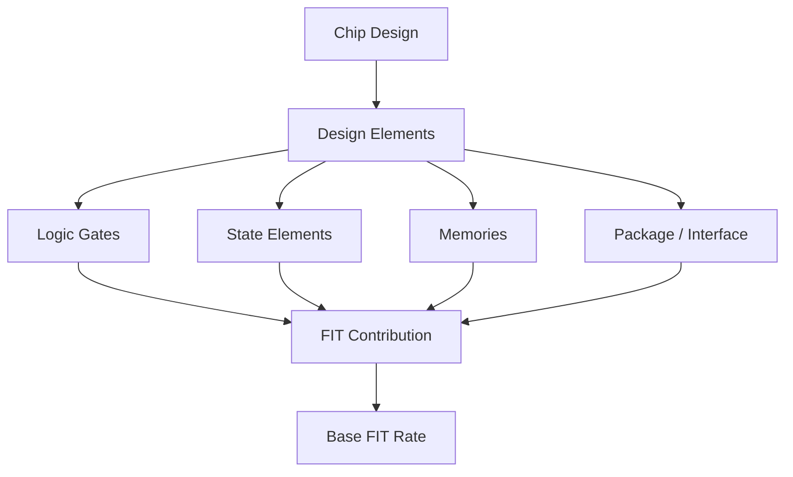

**Figure 1. FIT is an estimated random hardware failure contribution from design elements and reliability assumptions.**

FIT is not enough by itself. It must later be combined with:

```text
failure mode
fault propagation
diagnostic coverage
safety mechanism behavior
fault injection evidence
FMEDA metric roll-up
```

But the first quantitative anchor is BFR.

---

## 3. What Is Base FIT Rate?

Base FIT Rate means the failure rate baseline before additional safety mitigation is applied.

In an idealized safety workflow:

```text
BFR = estimated random hardware failure exposure before safety mechanism credit
```

It is called “base” because it establishes the reference point.

Later, after safety mechanisms are defined and validated, the workflow estimates or measures how much of this exposure is:

```text
detected
corrected
masked
controlled
safe
unsafe
residual
```

Conceptually:

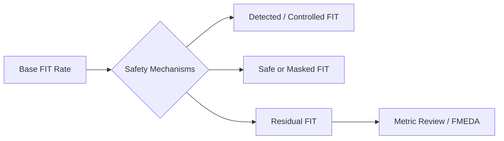

**Figure 2. BFR is split by safety mechanisms into detected, safe, controlled, and residual contribution.**

A safety mechanism cannot be evaluated in isolation. It must be evaluated against the baseline exposure it is expected to reduce.

---

## 4. Why BFR Comes Before Diagnostic Coverage

Diagnostic Coverage, or DC, is often discussed as a percentage:

```text
90% DC
95% DC
99% DC
```

But a percentage alone is not enough.

For example:

```text
Case A:
  90% DC applied to 1 FIT
  residual contribution ≈ 0.1 FIT

Case B:
  90% DC applied to 100 FIT
  residual contribution ≈ 10 FIT
```

The same DC percentage has very different safety meaning.

This is why BFR must come first.

A simplified residual model is:

```text
residual_fit = base_fit × (1 - diagnostic_coverage)
```

This simplified model does not replace full standard-compliant metric computation, but it captures the core engineering intuition.

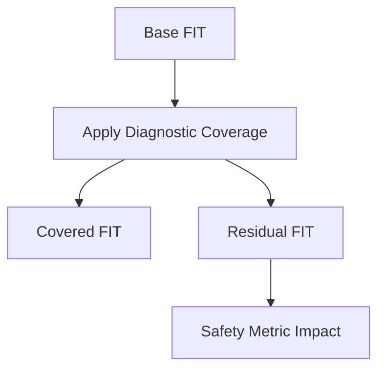

**Figure 3. Diagnostic coverage only becomes meaningful when applied to a quantified FIT baseline.**

Therefore, the order matters:

```text
first quantify the baseline exposure
then estimate or validate the coverage
then compute residual contribution
then review the metric result
```

---

## 5. Permanent vs Transient FIT

A practical BFR model should distinguish at least two broad types of random hardware faults:

```text
permanent faults
transient faults
```

### 5.1 Permanent Faults

Permanent faults persist after they occur.

Examples:

```text
stuck-at behavior
aging-induced degradation
electrical overstress damage
permanent memory cell damage
permanent interface failure
```

Permanent FIT usually relates to long-term reliability of silicon, package, process, stress, and operating environment.

### 5.2 Transient Faults

Transient faults occur temporarily.

Examples:

```text
single-event upset
soft error
temporary memory bit flip
temporary flip-flop state corruption
temporary combinational logic disturbance
```

Transient FIT is important because a transient event may corrupt state even if no permanent damage exists.

A simplified model:

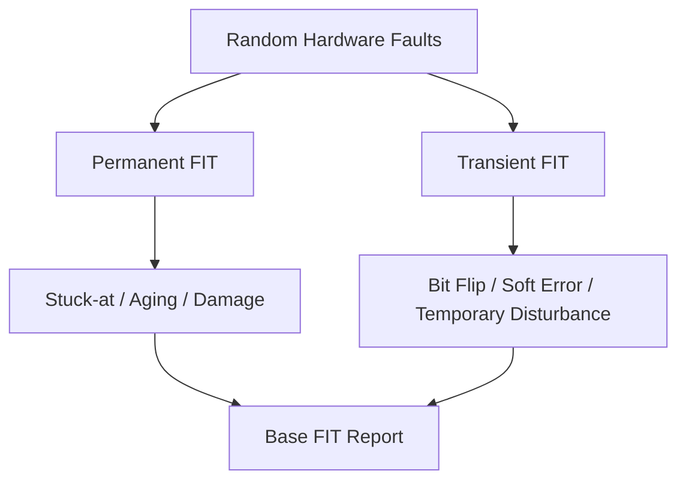

**Figure 4. A useful BFR report separates permanent and transient failure contributions.**

The safety mechanisms may also differ:

| Fault Type | Common Protection Examples |
|---|---|
| Permanent logic fault | Duplication, lockstep, built-in self-test, monitor |
| Transient flip-flop fault | Parity, duplication, temporal redundancy |
| Memory bit upset | ECC, parity, memory scrubbing |
| Interface data corruption | CRC, bus integrity check |
| Control state corruption | Protocol check, safe-state encoding, lockstep |

This is why BFR should not be a single opaque number. It should be decomposed.

---

## 6. Design Statistics: What Must Be Counted?

A BFR engine needs design statistics.

For a simplified demo, the statistics may include:

```text
number of logic gates
number of flip-flops
number of latches
number of memory bits
number of black-box instances
number of interface cells
```

For a more realistic flow, the statistics may come from:

```text
RTL elaboration
internal synthesis
gate-level netlist
library mapping
memory definition files
LVS or SPICE-level information
technology mapping files
```

The generic tool in D03 is:

```text
safeic-bfr
```

A minimal input file can look like:

```yaml
design_statistics:
  top: toy_counter
  abstraction: rtl
  logic_gates: 120
  flip_flops: 16
  latches: 0
  memory_bits: 0
  black_boxes: 0
```

For an RTL-level demo, these numbers may be estimated or derived from a lightweight synthesis step. For a gate-level flow, they should be derived from mapped netlist and library information.

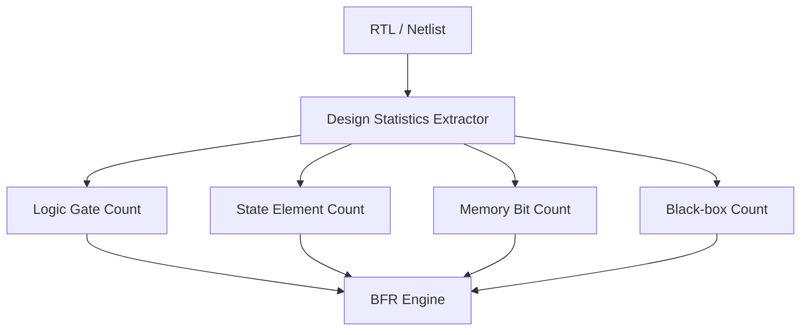

**Figure 5. BFR calculation begins by turning the design into countable reliability-relevant elements.**

The key principle is:

> BFR quality depends heavily on the quality of the design statistics.

---

## 7. Reliability Assumptions: What Must Be Assumed?

Design statistics are not enough.

A BFR engine also needs reliability assumptions.

Typical assumptions include:

```text
FIT model or standard
mission profile
temperature profile
operating ratio
technology class
package model
logic transient rate
flip-flop transient rate
memory bit transient rate
process assumptions
design type classification
```

A simplified D03 input can be:

```yaml
fit_model:
  name: demo_fit_model
  type: simplified

mission_profile:
  name: demo_automotive_profile
  operating_ratio: 0.65
  dormant_ratio: 0.35
  temperature_points:
    - temp_c: 40
      ratio: 0.50
    - temp_c: 85
      ratio: 0.40
    - temp_c: 125
      ratio: 0.10

transient_rates:
  logic_gate_fit: 1.0e-6
  flip_flop_fit: 1.0e-3
  memory_bit_fit: 1.0e-6

permanent_rates:
  logic_base_fit: 2.0e-4
  flip_flop_base_fit: 3.0e-3
  package_fit: 0.01
```

In a real project, these assumptions must be reviewed by reliability and safety engineers. For a demo, they are simplified so that the flow is understandable.

The input checker should always record them explicitly.

---

## 8. Mission Profile: Why Operating Context Changes FIT

A mission profile describes how the product is used over time.

It may include:

```text
temperature distribution
operating time
non-operating time
thermal cycles
environmental stress
application mode
vehicle location assumptions
```

Two chips with the same gate count can have different FIT if they operate under different temperature and mission profiles.

Example:

```text
Passenger compartment:
  moderate temperature distribution

Engine compartment:
  higher temperature and stronger thermal stress

Always-on safety monitor:
  high operating ratio

Dormant backup unit:
  high dormant ratio
```

Conceptually:

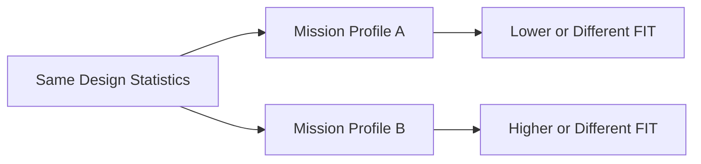

**Figure 6. The same design can produce different FIT results under different mission profiles.**

This is why `safeic-bfr` should never hide the mission profile.

The output report should always include:

```text
which mission profile was used
which temperature points were used
which operating ratios were used
which assumptions were defaulted
which assumptions were user-supplied
```

---

## 9. Design Type Classification

Not all elements should be treated the same.

A BFR model may classify design elements as:

```text
standard-cell logic
flip-flop
latch
RAM
ROM
non-volatile memory
analog block
interface block
black-box IP
package-related contribution
```

Why does this matter?

Because different design types can have different reliability models and different failure-rate assumptions.

Example:

| Design Type | Possible BFR Input |
|---|---|
| Standard-cell logic | gate count, transistor count, logic transient rate |
| Flip-flop / latch | state element count, transient state upset rate |
| RAM | bit count, memory transient rate, memory macro model |
| ROM | bit count, memory type model |
| Analog block | custom FIT assumption or supplier-provided value |
| Black-box IP | user-supplied FIT or supplier safety data |
| Package | package model and stress assumptions |

For D03, we can keep the model simple:

```yaml
design_types:
  logic:
    count: 120
    permanent_fit_per_unit: 2.0e-4
    transient_fit_per_unit: 1.0e-6
  flip_flop:
    count: 16
    permanent_fit_per_unit: 3.0e-3
    transient_fit_per_unit: 1.0e-3
  memory_bit:
    count: 0
    permanent_fit_per_unit: 0.0
    transient_fit_per_unit: 1.0e-6
```

The result should be traceable by design type.

---

## 10. Bottom-Up FIT Computation

A practical BFR flow is usually bottom-up.

It computes local contributions and then rolls them up.

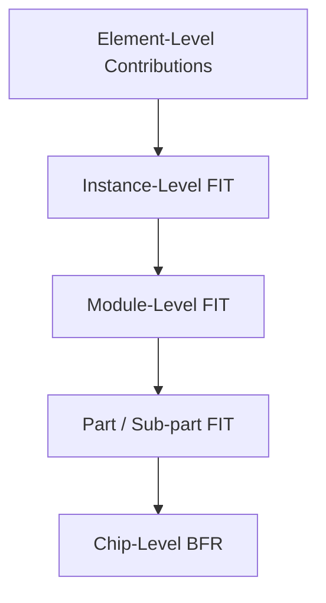

**Figure 7. BFR should be computed bottom-up so that local contribution can be traced to chip-level FIT.**

A simplified equation:

```text
BFR_total = Σ FIT(element_i) + FIT(package) + FIT(black_box_j)
```

For design types:

```text
FIT_logic      = logic_gate_count × logic_fit_per_gate
FIT_ff         = flip_flop_count × ff_fit_per_element
FIT_memory     = memory_bit_count × memory_fit_per_bit
FIT_package    = package_fit
FIT_black_box  = user_supplied_black_box_fit

BFR_total      = FIT_logic + FIT_ff + FIT_memory + FIT_package + FIT_black_box
```

A demo calculation:

```text
logic_gate_count = 120
logic_fit_per_gate = 2.0e-4
FIT_logic = 0.024

flip_flop_count = 16
ff_fit_per_element = 3.0e-3
FIT_ff = 0.048

package_fit = 0.010

BFR_total = 0.024 + 0.048 + 0.010 = 0.082 FIT
```

The exact numbers are demo assumptions. The important point is traceability.

---

## 11. BFR Output Should Not Be One Number

A weak BFR report says:

```text
Base FIT = 0.082
```

A useful BFR report says:

```text
Base FIT = 0.082

Breakdown:
  logic      = 0.024
  flip-flop  = 0.048
  memory     = 0.000
  package    = 0.010

Permanent / transient:
  permanent  = 0.066
  transient  = 0.016

Top contributors:
  toy_counter.ff = 0.048
  toy_counter.logic = 0.024
  package = 0.010
```

The BFR report should expose:

```text
total FIT
permanent FIT
transient FIT
design-type breakdown
module-level breakdown
part/sub-part breakdown
assumption summary
default values used
warnings
```

Example `base_fit_report.csv`:

```csv
scope,type,count,permanent_fit,transient_fit,total_fit
toy_counter,logic,120,0.024,0.00012,0.02412
toy_counter,flip_flop,16,0.048,0.016,0.064
package,package,1,0.010,0.000,0.010
TOTAL,all,,0.082,0.01612,0.09812
```

Example `base_fit_summary.md`:

```md
# Base FIT Summary

Total BFR: 0.09812 FIT

Main contributors:
1. Flip-flops: 0.064 FIT
2. Logic: 0.02412 FIT
3. Package: 0.010 FIT

Assumptions:
- Simplified demo model
- Mission profile: demo_automotive_profile
- No memory bits
- No black-box FIT override
```

---

## 12. BFR and Endpoint Contribution

BFR is not only a chip-level number. It should later support endpoint contribution analysis.

Endpoint contribution asks:

```text
Which endpoints contribute most to the safety-relevant failure exposure?
```

This requires mapping FIT contribution through structure.

Conceptually:


**Figure 8. BFR becomes more useful when contributions can be propagated toward endpoints.**

For D03, we do not need a full endpoint contribution engine yet. But the BFR output should be structured so that later steps can use it.

For example:

```csv
instance,type,count,total_fit
toy_counter.count_reg[0],flip_flop,1,0.004
toy_counter.count_reg[1],flip_flop,1,0.004
toy_counter.count_reg[2],flip_flop,1,0.004
toy_counter.count_logic,logic,120,0.02412
```

This instance-level output can later feed:

```text
safeic-structure
safeic-epcont
safeic-dc
safeic-faultgen
```

The methodology is:

> Do not generate only final numbers. Generate reusable intermediate safety data.

---

## 13. BFR and Safety Mechanism Selection

BFR influences safety mechanism selection.

A high FIT contribution area may justify stronger protection:

```text
ECC
duplication
lockstep
end-to-end CRC
protocol checker
monitoring
```

A low FIT contribution area may only need lightweight detection or no additional protection, depending on the safety goal.

The selection is not based only on FIT, but FIT is a key factor.

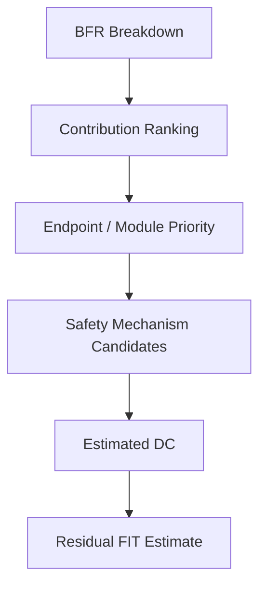

**Figure 9. BFR helps prioritize where stronger safety mechanisms may be needed.**

Example:

```text
If memory bits dominate transient FIT:
  consider ECC, parity, scrubbing, memory test

If CPU control state dominates contribution:
  consider lockstep, parity, protocol check, safe-state encoding

If bus datapath dominates contribution:
  consider CRC, parity, end-to-end protection

If package or black-box dominates:
  consider supplier data, assumptions, external safety concept
```

BFR does not choose the safety mechanism by itself. It prioritizes the problem.

---

## 14. BFR and FMEDA

FMEDA needs failure-rate information.

A simplified FMEDA row contains:

```text
part
sub-part
failure mode
failure rate
safety mechanism
diagnostic coverage
residual contribution
```

Without BFR, the failure-rate column is unsupported.

Example:

```csv
part,subpart,failure_mode,base_fit,safety_mechanism,dc,residual_fit
Counter,toy_counter,FM_DATA_CORRUPTION,0.09812,endpoint_parity,0.90,0.009812
```

This simple row is not a complete industrial FMEDA, but it shows the relationship:

```text
BFR provides the failure-rate baseline
SM map provides the protection model
DC estimates or validates coverage
residual FIT supports metric review
```

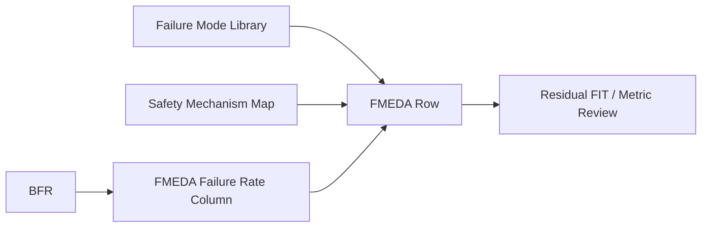

**Figure 10. BFR is one of the quantitative foundations of FMEDA.**

This is why D03 should generate outputs that later FMEDA demos can reuse.

---

## 15. The `safeic-bfr` Tool Architecture

The demo tool `safeic-bfr` is a small BFR calculation and reporting engine.

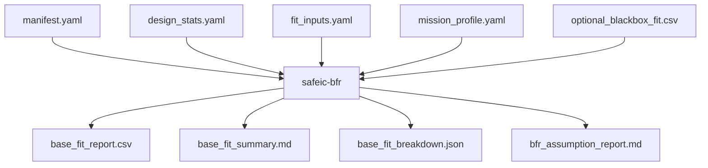

**Figure 11. `safeic-bfr` converts design statistics and FIT assumptions into reusable BFR artifacts.**

Suggested internal modules:

```text
safeic_bfr/
  cli.py
  manifest.py
  load_inputs.py
  validate_fit_inputs.py
  design_stats.py
  fit_model.py
  mission_profile.py
  calculator.py
  report.py
```

Responsibilities:

| Module | Responsibility |
|---|---|
| `manifest.py` | Load paths and project metadata |
| `validate_fit_inputs.py` | Check units, missing values, negative values, unsupported model |
| `design_stats.py` | Load or derive count data |
| `fit_model.py` | Apply simplified reliability model |
| `mission_profile.py` | Normalize mission profile assumptions |
| `calculator.py` | Compute permanent, transient, and total FIT |
| `report.py` | Generate CSV, JSON, and Markdown reports |

The first implementation can be deliberately simple. The priority is traceable calculation, not model sophistication.

---

## 16. D03 Input Files

D03 uses a minimal input package.

```text
D03_base_fit_rate/
  README.md
  run_demo.sh
  run_demo.csh
  manifest.yaml

  inputs/
    design_stats.yaml
    fit_inputs.yaml
    mission_profile.yaml
    optional_blackbox_fit.csv

  outputs/
    base_fit_report.csv
    base_fit_summary.md
    base_fit_breakdown.json
    bfr_assumption_report.md
```

Example `manifest.yaml`:

```yaml
project:
  name: automotive_safeic_practice
  demo: D03_base_fit_rate
  top_module: toy_counter

inputs:
  design_stats: inputs/design_stats.yaml
  fit_inputs: inputs/fit_inputs.yaml
  mission_profile: inputs/mission_profile.yaml
  blackbox_fit: inputs/optional_blackbox_fit.csv

outputs:
  report_csv: outputs/base_fit_report.csv
  summary_md: outputs/base_fit_summary.md
  breakdown_json: outputs/base_fit_breakdown.json
  assumptions_md: outputs/bfr_assumption_report.md
```

Example `design_stats.yaml`:

```yaml
design:
  top: toy_counter
  abstraction: rtl
  source: demo_manual_count

counts:
  logic:
    gates: 120
  sequential:
    flip_flops: 16
    latches: 0
  memory:
    ram_bits: 0
    rom_bits: 0
  black_boxes:
    count: 0
```

Example `fit_inputs.yaml`:

```yaml
fit_model:
  name: simplified_demo_model
  version: 0.1

rates:
  permanent:
    logic_gate_fit: 2.0e-4
    flip_flop_fit: 3.0e-3
    latch_fit: 3.0e-3
    ram_bit_fit: 1.0e-6
    rom_bit_fit: 5.0e-7
    package_fit: 1.0e-2

  transient:
    logic_gate_fit: 1.0e-6
    flip_flop_fit: 1.0e-3
    latch_fit: 1.0e-3
    ram_bit_fit: 1.0e-6
    rom_bit_fit: 1.0e-6
```

Example `mission_profile.yaml`:

```yaml
mission_profile:
  name: demo_automotive_profile
  description: Simplified profile for educational BFR calculation.
  operating_ratio: 0.65
  dormant_ratio: 0.35
  temperature_points:
    - temp_c: 40
      ratio: 0.50
    - temp_c: 85
      ratio: 0.40
    - temp_c: 125
      ratio: 0.10
```

For D03, the mission profile can be reported but not deeply modeled. Later model complexity can be added without changing the output philosophy.

---

## 17. D03 Execution Flow

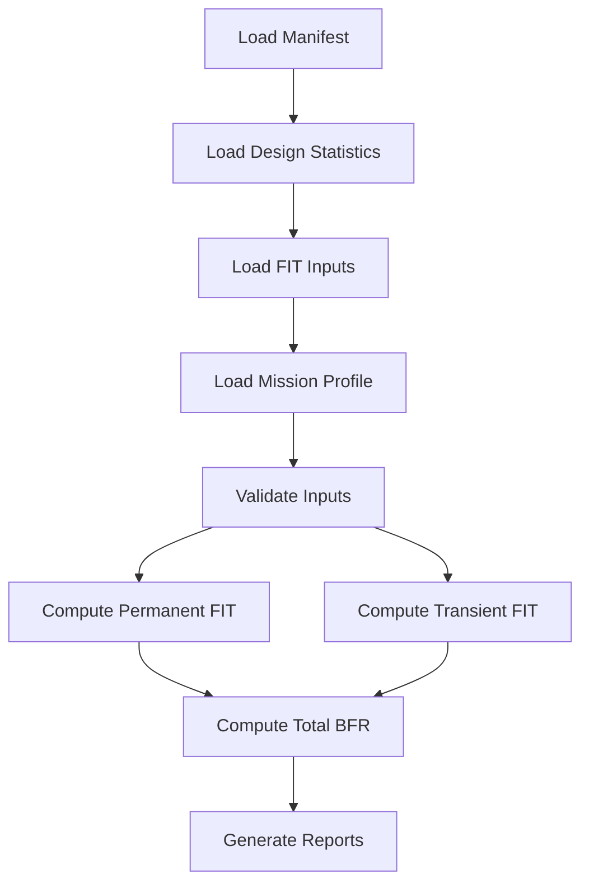

**Figure 12. D03 execution flow: load, validate, calculate, and report.**

Example bash script:

```bash
#!/usr/bin/env bash
set -euo pipefail

safeic-bfr \
  --manifest manifest.yaml \
  --output-dir outputs
```

Example csh script:

```csh
#!/bin/csh -f

set DEMO = D03_base_fit_rate
echo "Running $DEMO"

safeic-bfr \
  --manifest manifest.yaml \
  --output-dir outputs
```

Expected outputs:

```text
outputs/base_fit_report.csv
outputs/base_fit_summary.md
outputs/base_fit_breakdown.json
outputs/bfr_assumption_report.md
```

---

## 18. Example Output

Example `base_fit_report.csv`:

```csv
scope,type,count,permanent_fit,transient_fit,total_fit
toy_counter,logic_gate,120,0.024000,0.000120,0.024120
toy_counter,flip_flop,16,0.048000,0.016000,0.064000
toy_counter,latch,0,0.000000,0.000000,0.000000
toy_counter,ram_bit,0,0.000000,0.000000,0.000000
toy_counter,rom_bit,0,0.000000,0.000000,0.000000
package,package,1,0.010000,0.000000,0.010000
TOTAL,all,,0.082000,0.016120,0.098120
```

Example `base_fit_summary.md`:

```md
# Base FIT Summary

Project: automotive_safeic_practice
Demo: D03_base_fit_rate
Top: toy_counter

Total Base FIT: 0.098120 FIT

Breakdown:
- Permanent FIT: 0.082000
- Transient FIT: 0.016120
- Logic FIT: 0.024120
- Flip-flop FIT: 0.064000
- Package FIT: 0.010000

Top Contributor:
- flip_flop: 65.23% of total BFR

Assumptions:
- Simplified demo model
- Mission profile: demo_automotive_profile
- No memory bits
- No black-box FIT override
```

Example `base_fit_breakdown.json`:

```json
{
  "project": "automotive_safeic_practice",
  "demo": "D03_base_fit_rate",
  "top": "toy_counter",
  "total_fit": 0.09812,
  "permanent_fit": 0.082,
  "transient_fit": 0.01612,
  "contributors": [
    {
      "type": "logic_gate",
      "count": 120,
      "total_fit": 0.02412
    },
    {
      "type": "flip_flop",
      "count": 16,
      "total_fit": 0.064
    },
    {
      "type": "package",
      "count": 1,
      "total_fit": 0.01
    }
  ]
}
```

The report is intentionally transparent. Every number should be explainable.

---

## 19. Input Validation Rules

`safeic-bfr` should be strict about assumptions.

Validation rules:

```text
design_stats.yaml must exist
fit_inputs.yaml must exist
mission_profile.yaml must exist
all counts must be non-negative integers
all FIT rates must be non-negative numbers
operating_ratio + dormant_ratio should be close to 1.0
temperature point ratios should sum to 1.0 if used
package FIT must be explicitly provided or explicitly disabled
black-box FIT must not be silently ignored
units must be recorded
```

Example warnings:

```text
[WARN] mission_profile.temperature_points ratio sum is 0.98, expected 1.0
[WARN] package_fit is not provided; using 0.0 only because package_model is disabled
[WARN] black_boxes.count > 0 but optional_blackbox_fit.csv is missing
[ERROR] flip_flops count is negative
[ERROR] transient.flip_flop_fit is missing
```

A BFR tool should not silently invent important reliability assumptions.

---

## 20. Common Mistakes in BFR Modeling

### 20.1 Treating BFR as a Final Safety Metric

BFR is a baseline, not the final residual risk.

A design with high BFR may still meet safety goals if safety mechanisms provide strong coverage and validation supports the claim.

A design with low BFR may still be unsafe if a small number of faults directly violate safety goals and remain undetected.

### 20.2 Hiding Assumptions

A BFR report without assumptions is not reviewable.

Always report:

```text
model used
mission profile
design statistics source
default values
user-provided values
excluded blocks
black-box handling
```

### 20.3 Mixing Permanent and Transient Faults

Permanent and transient faults may require different safety mechanisms and different validation strategies.

They should be reported separately.

### 20.4 Ignoring Memory Bits

Memory may dominate transient FIT in many designs.

Even in a toy demo with zero memory bits, the input schema should explicitly contain memory fields. This prevents the flow from being memory-blind.

### 20.5 Ignoring Black Boxes

Third-party IP, analog blocks, and black boxes may not be analyzable structurally.

They still need FIT assumptions.

Do not silently drop them.

### 20.6 Reporting Only Chip-Level Total

A single total number is not enough.

Useful BFR reporting must show contribution breakdown.

---

## 21. Methodology: BFR as a Review Artifact

BFR should be treated as a review artifact, not just a tool output.

Review questions:

```text
Where did the design statistics come from?
Which abstraction level was used?
Which FIT model was selected?
Which mission profile was used?
Which assumptions are defaulted?
Which assumptions are user-supplied?
Are memory bits included?
Are package contributions included?
Are black boxes included?
Which contributors dominate?
Can the result feed FMEDA and DC analysis?
```

The output should support both machine consumption and human review:

```text
CSV for tools
JSON for later flow integration
Markdown for engineers
Report warnings for review
```

This is the design principle behind D03.

---

## 22. How D03 Connects to the Closed Loop

D03 is not an isolated demo.

It provides the quantitative baseline for later steps.

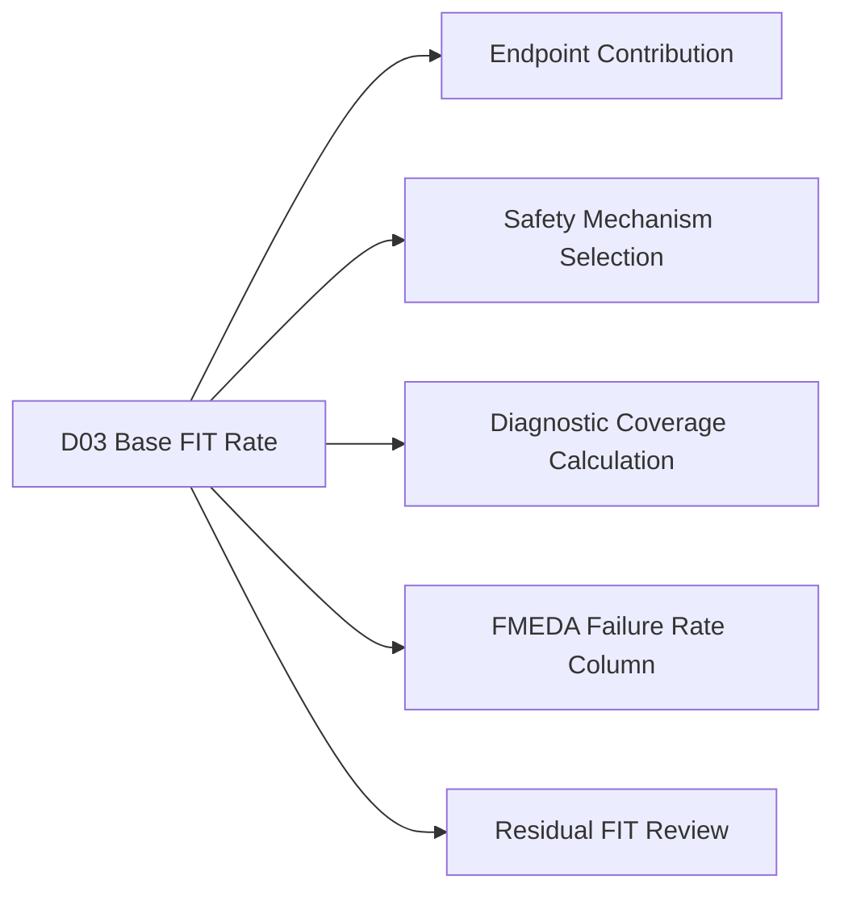

**Figure 13. D03 BFR outputs become inputs to contribution analysis, DC, FMEDA, and residual FIT review.**

The most important output is not only the number:

```text
0.098120 FIT
```

The most important output is the structured evidence:

```text
what contributed to that number
what assumptions generated that number
what artifacts can be reused later
```

---

## 23. Recommended Demo Implementation Strategy

D03 should be implemented in three stages.

### Stage 1: Manual Statistics

Use hand-written `design_stats.yaml`.

This keeps the first implementation simple and focused on methodology.

### Stage 2: Generated Statistics

Use a lightweight parser or synthesis tool to generate design statistics.

Possible output:

```text
design_stats.generated.yaml
```

### Stage 3: Instance-Level FIT

Generate instance-level contribution:

```text
instance_fit.csv
```

This prepares for endpoint contribution and fault list prioritization.

The staged approach avoids overbuilding too early.

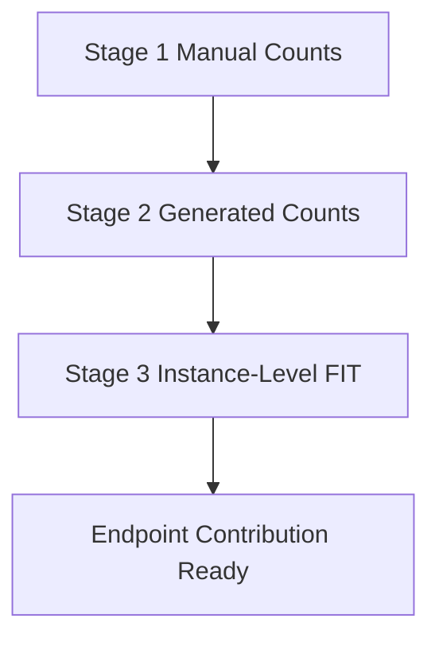

**Figure 14. D03 should start simple and evolve toward instance-level contribution analysis.**

---

## 24. Summary

Base FIT Rate is the first quantitative anchor in chip-level functional safety analysis.

It answers:

```text
How much random hardware failure exposure exists before protection is considered?
```

A useful BFR workflow must include:

```text
design statistics
reliability assumptions
mission profile
permanent FIT
transient FIT
design-type breakdown
module or instance contribution
assumption reporting
reviewable artifacts
```

The D03 demo:

```text
D03_base_fit_rate
```

introduces a generic tool:

```text
safeic-bfr
```

The tool converts:

```text
design_stats.yaml
fit_inputs.yaml
mission_profile.yaml
```

into:

```text
base_fit_report.csv
base_fit_summary.md
base_fit_breakdown.json
bfr_assumption_report.md
```

The central lesson is:

> Diagnostic coverage and safety mechanism effectiveness cannot be interpreted correctly without a quantified FIT baseline.

BFR does not prove safety. It defines the baseline risk that later analysis and fault injection must reduce, validate, and report.

---

## 25. D03 Demo Checklist

For `D03_base_fit_rate`, the expected deliverables are:

```text
[ ] README.md
[ ] run_demo.sh
[ ] run_demo.csh
[ ] manifest.yaml

[ ] inputs/design_stats.yaml
[ ] inputs/fit_inputs.yaml
[ ] inputs/mission_profile.yaml
[ ] inputs/optional_blackbox_fit.csv

[ ] outputs/base_fit_report.csv
[ ] outputs/base_fit_summary.md
[ ] outputs/base_fit_breakdown.json
[ ] outputs/bfr_assumption_report.md

[ ] schemas/design_stats_schema.yaml
[ ] schemas/fit_inputs_schema.yaml
[ ] schemas/mission_profile_schema.yaml
```

A successful D03 run should answer:

```text
What is the total Base FIT Rate?
How much is permanent FIT?
How much is transient FIT?
Which design type contributes most?
Which assumptions were used?
Which assumptions were defaulted?
Are memory and package contributions included?
Are black boxes handled?
Can the result feed later DC, FMEDA, and fault-list steps?
```
