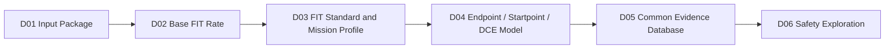
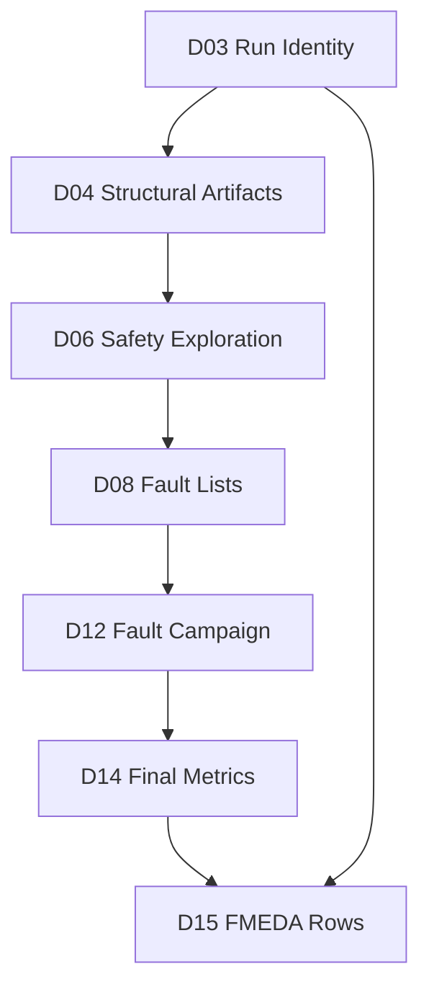
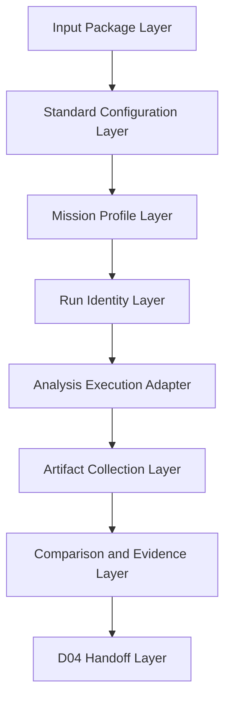

# Automotive Safe-IC Practice 03: FIT Standards — IEC 62380 vs SN 29500

Author: Darren H. Chen

Direction: Automotive Chip Functional Safety / Safe-IC Verification Platform

Demo: D03_fit_standards_iec62380_vs_sn29500

Tags: ISO 26262, Functional Safety, Safe-IC, FIT, BFR, IEC 62380, SN 29500, Mission Profile, Reliability Prediction, FMEDA, Diagnostic Coverage, Evidence Traceability

---

## 1. Why D03 Focuses on FIT Standards

D01 built a reproducible **analysis input package**. It organized the RTL or netlist, filelist, clock definition, FIT setup, mission profile assumptions, analysis configuration, database session, output index, and execution wrapper.

D02 used that package to explain **Base FIT Rate**, or **BFR**. BFR answers a first safety-analysis question:

```text
How much random hardware failure exposure exists before any safety mechanism is credited?
```

D03 goes one layer deeper. It asks:

```text
Under which reliability prediction standard was that FIT value calculated?
```

That question is not a reporting detail. It is part of the engineering identity of the run.

A Base FIT number without a FIT standard is incomplete. Two safety-analysis runs may use the same RTL, the same top module, the same clock definition, and the same mission profile name, but if one run uses IEC 62380 and the other uses SN 29500, the final FIT values, intermediate assumptions, report interpretation, and downstream evidence may differ.

In this series, D03 is the third step in a 20-demo Safe-IC flow:

```text
D01  Analysis Input Package
D02  Base FIT Rate
D03  FIT Standards: IEC 62380 vs SN 29500
D04  Structural Building Blocks
D05  Common FuSa Database
...
D20  End-to-End Mini Flow
```

D03 sits between **BFR interpretation** and **structural safety modeling**:



**Figure 1. D03 makes the FIT standard explicit before structural safety artifacts become evidence.**

The reason is simple: once a flow starts producing DCE-style artifacts, endpoint contribution reports, diagnostic coverage estimates, fault lists, database sessions, and FMEDA summaries, the selected FIT standard must travel with the evidence. Otherwise, later stages may mix data that look similar but were produced under different reliability assumptions.

D03 therefore treats the FIT standard as a first-class control point:

```text
not a comment
not a hidden default
not only a report suffix
not a late-stage documentation field
```

It is part of the run identity.

---

## 2. The Engineering Meaning of FIT

**FIT** means **Failure In Time**.

The common definition is:

```text
1 FIT = 1 failure per 1,000,000,000 hours
```

Equivalently:

```text
1 FIT = 1e-9 failures/hour
```

If a hardware element has a failure rate represented by lambda per hour, then:

```text
FIT = lambda × 1e9
lambda = FIT × 1e-9 failures/hour
```

FIT is a reliability unit. It is not the same as functional coverage, code coverage, assertion coverage, ATPG coverage, or fault-simulation coverage.

A design can have excellent functional coverage and still have a high random hardware failure exposure. Conversely, a design can have a small Base FIT value and still be unsafe if its few critical faults are not detected or controlled within the required time.

In a chip-level safety flow, FIT is used to reason about random hardware failures such as:

```text
permanent stuck-at behavior
transient soft errors
memory bit upsets
logic gate vulnerability
package-related failures
interface-related electrical overstress
technology-dependent random failure effects
```

D02 focused on computing and reading the base FIT baseline. D03 focuses on the standard behind that computation.

A mature engineering statement should not be:

```text
The design has 18.2 FIT.
```

It should be closer to:

```text
The design has a Base FIT result calculated with a specified reliability prediction standard,
under a specified mission profile, using a specified technology setup, package model,
clock definition, design boundary, and evidence database session.
```

That second form may look more verbose, but it is reviewable. It can be reproduced. It can be compared. It can be traced into FMEDA.

---

## 3. Why IEC 62380 and SN 29500 Both Appear in Automotive Safety Work

Automotive functional safety requires a quantitative treatment of random hardware failures. The exact project may be driven by a customer safety plan, an OEM expectation, an IP vendor safety manual, a Tier-1 integration rule, or an internal methodology.

In practice, reliability prediction is often based on a recognized method or handbook. In this D03 demo, the two standards are:

```text
IEC 62380
SN 29500
```

They both support reliability prediction, but they organize the calculation differently.

At an engineering level, this means the following:

| Topic | IEC 62380 Perspective | SN 29500 Perspective |
|---|---|---|
| Typical use | Reliability prediction for electronic equipment, PCBs, and components | Component failure-rate prediction based on reference failure rates and conversion models |
| Strong focus | Mission profile, temperature phases, die/package/EOS decomposition | Component classification, reference conditions, stress conversion factors |
| Important inputs | technology, transistor count, package, thermal mission profile, operating and non-operating ratios | component category, reference failure rate, voltage/current/temperature/load/environment factors |
| Practical risk | Using the wrong mission profile can distort the result | Misclassifying the component or using wrong stress assumptions can distort the result |
| Evidence concern | Need to preserve mission profile and decomposition assumptions | Need to preserve classification and conversion assumptions |

The goal of D03 is not to declare one standard universally superior. The goal is to build a repeatable comparison and evidence protocol so that the selected standard is visible, reproducible, and downstream-safe.

---

## 4. IEC 62380: A Structural View of Die, Package, and EOS Contribution

IEC 62380 can be understood as a reliability prediction model that decomposes failure-rate contribution into physical and environmental parts.

A useful conceptual decomposition is:

```text
Total FIT = Die FIT + Package FIT + EOS FIT
```

Where:

```text
Die FIT      -> contribution related to the silicon die and technology
Package FIT  -> contribution related to package and thermo-mechanical stress
EOS FIT      -> contribution related to electrical overstress and external interface environment
```

This decomposition is important for chip safety analysis because different design and system decisions affect different portions of the failure rate.

### 4.1 Die-Related Contribution

Die-related FIT can depend on items such as:

```text
IC technology
technology family
transistor count
junction temperature
mission profile temperature phases
operating time ratio
non-operating time ratio
year or technology maturity assumptions
```

From a tool-architecture perspective, this means the safety-analysis engine needs a bridge between:

```text
logical design structure
technology mapping or design type
transistor count or equivalent N value
mission profile
reliability model
```

A register, a memory macro, a logic cone, or a standard-cell block is not only a functional object. In FIT analysis, it also becomes a contributor to a statistical failure-rate model.

### 4.2 Package-Related Contribution

Package-related FIT is usually tied less to RTL structure and more to thermo-mechanical conditions.

Relevant concepts include:

```text
package type
package material
thermal expansion difference
thermal cycles
mission profile phases
ambient temperature swing
day/night or power-cycle behavior
```

This is why mission profile cannot be treated as a cosmetic label.

A chip in a passenger compartment, a powertrain controller, an inverter, or a sensor module may experience different thermal ranges and different cycle counts. Those differences can affect package-related contribution even if the RTL is identical.

### 4.3 EOS Contribution

**EOS** means **Electrical Overstress**.

It represents failure-rate contribution associated with electrical stress beyond normal intended operating conditions. At chip level, EOS is often relevant to interface circuits, external pins, board-level exposure, and system integration assumptions.

In a Safe-IC evidence package, it is not enough to say:

```text
EOS was included.
```

A reviewable package should record:

```text
which interfaces are considered
which assumptions are used
which input file describes the package/interface model
which report contains the calculated contribution
whether EOS is included in the comparison table
```

---

## 5. SN 29500: Reference Failure Rate and Conversion to Operating Conditions

SN 29500 is often used as a basis for component failure-rate prediction. A useful way to understand it is:

```text
start from a reference failure rate
classify the component correctly
convert from reference conditions to operating conditions using stress factors
```

A simplified conceptual expression is:

```text
lambda_operating = lambda_reference × stress_factor_1 × stress_factor_2 × ...
```

The exact factors depend on the component class and the applicable part of the standard.

Commonly discussed factors include:

```text
voltage dependence factor
current dependence factor
temperature dependence factor
quality factor
load dependence factor
environment dependence factor
switching rate factor
failure criterion factor
```

For an integrated circuit, the tool or methodology must know which SN 29500 part and which model are being applied. For mixed hardware systems, a board-level reliability prediction may classify many component categories, such as ICs, discrete semiconductors, passive components, connectors, relays, switches, lamps, optical components, and electromechanical devices.

At chip-level safety analysis, the relevant concern is usually narrower than a full board BOM, but the same principle remains:

```text
classification and conversion assumptions must be explicit.
```

A number is not enough. The calculation path matters.

---

## 6. Why Switching the FIT Standard Is Not Just Changing a Report Format

It is tempting to treat the FIT standard as a report option:

```text
produce IEC style output
produce SN style output
```

That is not safe engineering.

Switching the FIT standard may change:

```text
input files required by the flow
technology parameter interpretation
mission profile interpretation
package contribution handling
summary report naming
DCE-style artifact naming
breakdown of lambda values
FIT contribution ranking
failure-mode prioritization
FMEDA residual FIT interpretation
downstream comparison baseline
```

A structural block that looks like the largest contributor under one model may not have the same relative priority under another model. This matters when D06 later performs safety exploration and D07 maps failure modes to safety mechanisms.

Consider the following simplified scenario.

```text
Block A has many registers and logic gates.
Block B has fewer gates but is attached to a safety-critical interface.
Block C contains memory and state retention.
```

Depending on the reliability model and inputs:

```text
Block A may dominate because of logic/transistor count.
Block B may dominate because of interface or EOS assumptions.
Block C may dominate because of memory bit count or transient rate assumptions.
```

If the standard is implicit, engineers may debate the wrong problem. They may think they are discussing safety architecture, while they are actually mixing reliability model assumptions.

D03 avoids that by making the standard selector visible in:

```text
configuration
run identity
output file naming
comparison tables
evidence index
handoff file to D04
```

---

## 7. Mission Profile: The Hidden Multiplier Behind FIT

A **mission profile** describes how a product is used over its lifetime.

For FIT analysis, a mission profile may include:

```text
application type
operating temperature phases
junction temperature assumptions
ambient temperature assumptions
powered-on ratio
powered-off or storage ratio
thermal cycle counts
duration ratios per temperature bucket
package stress assumptions
```

A simple mission profile table may look like this:

```csv
profile,phase,ambient_c,junction_delta_c,time_ratio,powered_state
passenger_compartment,low,25,12,0.55,on
passenger_compartment,high,45,12,0.20,on
passenger_compartment,storage,30,0,0.25,off
motor_control,low,40,18,0.35,on
motor_control,high,85,18,0.40,on
motor_control,storage,45,0,0.25,off
```

The example is not a real product profile. It is a schema showing what kind of information D03 needs to preserve.

The key point is:

```text
same design + different mission profile = different FIT result
```

A mission profile is not only an input to a formula. It is also a safety-assumption artifact.

Later, in FMEDA review, an auditor or customer may ask:

```text
Which mission profile was used?
Why is that profile appropriate for this item?
Was the same profile used in all relevant calculations?
Which result table proves it?
```

D03 prepares the answer.

---

## 8. Run Identity: The Evidence Protocol of D03

The word **protocol** here does not refer to a communication protocol such as CAN, LIN, SPI, AXI, AHB, or APB. In this article, protocol means:

```text
a stable engineering agreement for how data moves from one stage to the next
```

D03 introduces a **FIT standard evidence protocol**.

Every run should record at least:

```text
run_id
demo_id
design_name
top_module
input_package_id
base_fit_source
fit_standard
mission_profile
technology_setup
package_setup
memory_setup
clock_definition
analysis_config
output_database_session
report_directory
dce_directory
created_artifacts
handoff_target
```

This protocol avoids silent mixing.

A weak record would be:

```csv
run_id,total_fit
run_001,18.2
```

A stronger record would be:

```csv
run_id,design,top,fit_standard,mission_profile,total_fit,report,database_session
D03_IEC_PC,toy_counter,toy_counter,IEC_62380,passenger_compartment,<computed>,outputs/reports/...,safeicdb::D03_IEC_PC
D03_SN_PC,toy_counter,toy_counter,SN_29500,passenger_compartment,<computed>,outputs/reports/...,safeicdb::D03_SN_PC
```

D03 does not need to prove final diagnostic coverage. It needs to prove that the standard and mission-profile assumptions are explicit and traceable.

---

## 9. D03 Demo Goal

The demo is named:

```text
D03_fit_standards_iec62380_vs_sn29500
```

It demonstrates how a Safe-IC flow should compare or select FIT standards without losing evidence traceability.

D03 consumes D01 and D02 style artifacts:

```text
D01 input package
D02 base FIT summaries
D02 FIT contribution tables
D02 evidence index
```

D03 produces:

```text
standard comparison matrix
mission profile index
run identity table
standard-specific output expectation table
standard-specific evidence index
handoff file to D04 structural model
```

The central idea is:

```text
D03 does not only ask “what is the FIT?”
D03 asks “what exactly did this FIT mean under a selected standard and mission profile?”
```

---

## 10. Recommended D03 Repository Layout

A practical D03 demo layout can be:

```text
D03_fit_standards_iec62380_vs_sn29500/
├── README.md
├── manifest.yaml
│
├── inputs/
│   ├── from_d01/
│   │   ├── manifest.yaml
│   │   ├── filelist.f
│   │   ├── clock_definition.clk
│   │   └── analysis_config.ini
│   │
│   ├── from_d02/
│   │   ├── bfr_summary.csv
│   │   ├── fit_contribution.csv
│   │   └── base_fit_evidence_index.csv
│   │
│   ├── standards/
│   │   └── fit_standard_matrix.yaml
│   │
│   ├── mission_profiles/
│   │   ├── passenger_compartment.yaml
│   │   └── motor_control.yaml
│   │
│   └── fit/
│       ├── fit_inputs_iec62380.txt
│       └── fit_inputs_sn29500.txt
│
├── scripts/
│   ├── run_demo.csh
│   ├── run_demo.sh
│   └── setup_toolchain.template.csh
│
├── tools/
│   ├── validate_d03_inputs.py
│   ├── build_standard_matrix.py
│   ├── build_run_identity.py
│   ├── compare_fit_standards.py
│   └── build_d04_handoff.py
│
├── outputs/
│   ├── d03_standard_matrix.csv
│   ├── d03_mission_profile_index.csv
│   ├── d03_run_identity.csv
│   ├── d03_fit_standard_comparison.csv
│   ├── d03_evidence_index.csv
│   ├── d03_handoff_to_d04.csv
│   └── d03_quality_gate.csv
│
└── logs/
    └── README.md
```

The directory design follows a simple rule:

```text
inputs/    -> assumptions and upstream evidence
scripts/   -> reproducible execution wrappers
tools/     -> small reviewable helpers
outputs/   -> normalized evidence generated by this demo
logs/      -> execution records, not article content
```

The demo does not require publishing real engineering logs. It should publish the evidence schema and normalized tables.

---

## 11. Neutral Command Interface

D03 uses a neutral analysis-engine interface.

A typical command shape is:

```csh
setenv SAFEIC_ANALYSIS_ENGINE /path/to/local/analysis_engine
setenv SAFEIC_PYTHON python3.8

$SAFEIC_PYTHON tools/validate_d03_inputs.py
$SAFEIC_PYTHON tools/build_standard_matrix.py
$SAFEIC_PYTHON tools/build_run_identity.py
```

If a real local analysis engine is available, the command template can be:

```csh
$SAFEIC_ANALYSIS_ENGINE run-base-fit \
  --input-package inputs/from_d01/manifest.yaml \
  --fit-standard IEC_62380 \
  --mission-profile inputs/mission_profiles/passenger_compartment.yaml \
  --fit-setup inputs/fit/fit_inputs_iec62380.txt \
  --output-db outputs/db/safeicdb.sqlite::D03_IEC_62380_PC \
  --out-dir outputs/native/iec62380_pc
```

And for SN 29500:

```csh
$SAFEIC_ANALYSIS_ENGINE run-base-fit \
  --input-package inputs/from_d01/manifest.yaml \
  --fit-standard SN_29500 \
  --mission-profile inputs/mission_profiles/passenger_compartment.yaml \
  --fit-setup inputs/fit/fit_inputs_sn29500.txt \
  --output-db outputs/db/safeicdb.sqlite::D03_SN_29500_PC \
  --out-dir outputs/native/sn29500_pc
```

These command names are intentionally generic. The methodology is not tied to a public-facing commercial command line. A local project can map the neutral interface to its actual toolchain through environment variables and templates.

The important engineering property is not the executable name. The important property is that the selected FIT standard is explicitly carried in the run.

---

## 12. Standard Matrix

The first D03 output is a standard matrix.

Example schema:

```csv
standard_id,display_name,primary_model_focus,requires_mission_profile,requires_package_model,requires_component_classification,expected_report_suffix,expected_dce_suffix
IEC_62380,IEC 62380,die/package/EOS decomposition,yes,yes,partial,_IEC_62380,_IEC_62380
SN_29500,SN 29500,reference failure rate and conversion factors,yes,project-dependent,yes,_SN_29500,_SN_29500
```

This table is not just documentation. It becomes a machine-readable index for later checks.

For example, D04 can reject a DCE-style artifact if:

```text
artifact_standard != run_identity_standard
```

D05 can prevent database session mixing if:

```text
same session contains rows from different fit_standard values without explicit grouping
```

D15 can generate an FMEDA data table only after confirming:

```text
part/sub-part residual FIT values all reference a known standard_id
```

This is how D03 becomes useful beyond the article.

---

## 13. Mission Profile Index

The second D03 output is the mission profile index.

Example schema:

```csv
mission_profile_id,application_context,temperature_source,contains_on_off_ratio,contains_thermal_cycles,used_by_standard,review_status
passenger_compartment,interior ECU,example_profile,yes,yes,IEC_62380/SN_29500,review_required
motor_control,powertrain or inverter-related context,example_profile,yes,yes,IEC_62380/SN_29500,review_required
```

The profile itself can be YAML:

```yaml
mission_profile_id: passenger_compartment
application_context: interior_ecu
phases:
  - name: normal_operation_low
    ambient_temperature_c: 27
    junction_delta_c: 15
    time_ratio: 0.006
    powered_state: on
  - name: normal_operation_mid
    ambient_temperature_c: 30
    junction_delta_c: 15
    time_ratio: 0.046
    powered_state: on
  - name: high_temperature_operation
    ambient_temperature_c: 85
    junction_delta_c: 15
    time_ratio: 0.006
    powered_state: on
  - name: dormant_or_storage
    ambient_temperature_c: 30
    junction_delta_c: 0
    time_ratio: 0.942
    powered_state: off
```

The numbers shown here are an example profile structure. In a real project, the values should come from system requirements, safety manuals, product use assumptions, customer guidance, or internal reliability engineering decisions.

D03 should keep profile data in a file, not buried in Python code or shell scripts.

---

## 14. Standard-Specific Output Expectations

D03 should maintain a table of expected artifacts by standard.

Example:

```csv
standard_id,artifact_kind,expected_pattern,purpose,used_by
IEC_62380,metric_summary,*IEC_62380*.summary*.rpt,summary metrics,D03/D05/D15
IEC_62380,dce,*IEC_62380*.DCE,diagnostic coverage related artifact,D04/D05/D15
SN_29500,metric_summary,*SN_29500*.summary*.rpt,summary metrics,D03/D05/D15
SN_29500,dce,*SN_29500*.DCE,diagnostic coverage related artifact,D04/D05/D15
```

This is especially important because many functional safety tools embed the standard identifier in output names. That naming behavior is useful only if the flow preserves it instead of renaming everything into ambiguous generic files.

A bad managed-output collection might do this:

```text
outputs/result.rpt
outputs/result.dce
```

A better collection keeps the standard identity:

```text
outputs/reports/toy_counter.metric.summary_IEC_62380.rpt
outputs/reports/toy_counter.metric.summary_SN_29500.rpt
outputs/dce/toy_counter_IEC_62380.DCE
outputs/dce/toy_counter_SN_29500.DCE
```

If a demo uses synthetic or preflight-only data, it can still preserve the naming protocol.

---

## 15. FIT Standard Comparison Is a Controlled Experiment

A useful comparison must vary one major factor at a time.

Bad comparison:

```text
Run A: IEC 62380, passenger compartment, RTL version 1, old clock file
Run B: SN 29500, motor control, RTL version 2, new clock file
```

No clear conclusion can be drawn from that.

Better comparison:

```text
Run A: IEC 62380, passenger compartment, same design, same top, same clock
Run B: SN 29500, passenger compartment, same design, same top, same clock
```

Then another comparison:

```text
Run C: IEC 62380, motor control, same design, same top, same clock
Run D: IEC 62380, passenger compartment, same design, same top, same clock
```

This separates two questions:

```text
What changes when the FIT standard changes?
What changes when the mission profile changes?
```

D03 should generate a comparison table that makes this distinction visible.

Example schema:

```csv
comparison_id,baseline_run,variant_run,changed_dimension,expected_interpretation
cmp_standard_pc,D03_IEC_PC,D03_SN_PC,fit_standard,standard-model sensitivity
cmp_profile_iec,D03_IEC_PC,D03_IEC_MC,mission_profile,mission-profile sensitivity
cmp_profile_sn,D03_SN_PC,D03_SN_MC,mission_profile,mission-profile sensitivity
```

A comparison without a changed-dimension field is weak evidence.

---

## 16. How D03 Connects to D04 Structural Building Blocks

D04 will discuss structural safety artifacts such as:

```text
Endpoint
Startpoint
DCE-style artifact
EP-to-SM map
```

D03 must hand off a clean standard-specific context to D04.

The handoff table can be:

```csv
handoff_id,selected_run_id,fit_standard,mission_profile,dce_artifact,fit_contribution_artifact,next_demo
D03_TO_D04_IEC_PC,D03_IEC_PC,IEC_62380,passenger_compartment,outputs/dce/toy_counter_IEC_62380.DCE,outputs/d03_fit_standard_comparison.csv,D04_structural_building_blocks
```

This table has a clear purpose:

```text
D04 should not have to guess which DCE artifact to read.
D04 should not have to guess which standard produced it.
D04 should not have to infer mission profile from a filename alone.
```

A later structural model will be much easier to debug if D03 already standardized the handoff.

---

## 17. What the Demo Helper Tools Should Do

D03 helper tools should stay small and reviewable.

### 17.1 validate_d03_inputs.py

This tool checks:

```text
D01 manifest exists
D02 BFR summary exists
standard matrix exists
mission profile files exist
fit setup files exist
standard identifiers are valid
no required field is empty
```

It should not perform the reliability calculation itself. It validates the data contract.

### 17.2 build_standard_matrix.py

This tool reads:

```text
inputs/standards/fit_standard_matrix.yaml
```

And writes:

```text
outputs/d03_standard_matrix.csv
```

It normalizes display names, identifiers, and output patterns.

### 17.3 build_run_identity.py

This tool builds:

```text
outputs/d03_run_identity.csv
```

It should combine:

```text
input package identity
D02 baseline identity
fit standard
mission profile
expected database session
expected output directory
```

### 17.4 compare_fit_standards.py

This tool builds:

```text
outputs/d03_fit_standard_comparison.csv
```

If real metric reports are available, it can parse them. If not, it can build a schema-only comparison table with empty metric fields and explicit status.

Important principle:

```text
missing metric values should be represented as missing values, not invented successful results.
```

### 17.5 build_d04_handoff.py

This tool builds:

```text
outputs/d03_handoff_to_d04.csv
```

It selects the standard-specific artifact set that D04 should use.

---

## 18. Quality Gate for D03

D03 should have a quality gate.

Example output:

```csv
check_id,check_name,status,details
QG_D03_001,d01_manifest_present,PASS,inputs/from_d01/manifest.yaml
QG_D03_002,d02_bfr_summary_present,PASS,inputs/from_d02/bfr_summary.csv
QG_D03_003,fit_standard_matrix_present,PASS,inputs/standards/fit_standard_matrix.yaml
QG_D03_004,iec62380_profile_present,PASS,inputs/mission_profiles/passenger_compartment.yaml
QG_D03_005,sn29500_setup_present,PASS,inputs/fit/fit_inputs_sn29500.txt
QG_D03_006,standard_identity_exported,PASS,outputs/d03_run_identity.csv
QG_D03_007,d04_handoff_created,PASS,outputs/d03_handoff_to_d04.csv
```

The quality gate is not a claim that a production chip meets an ASIL target. It is a claim that this D03 evidence package is internally consistent.

A good D03 failure is also useful. For example:

```csv
check_id,check_name,status,details
QG_D03_005,sn29500_setup_present,FAIL,missing inputs/fit/fit_inputs_sn29500.txt
```

That failure tells the engineer exactly what to fix.

---

## 19. Common Mistakes in FIT Standard Handling

### 19.1 Relying on the Tool Default

A default may be convenient, but it is weak evidence.

Bad:

```text
The tool used its default FIT standard.
```

Good:

```text
The run identity explicitly records IEC_62380.
```

### 19.2 Comparing Standards While Changing Other Inputs

If standard, mission profile, design revision, clock definition, and technology setup all change together, the comparison is not meaningful.

D03 should isolate comparison dimensions.

### 19.3 Removing the Standard Name from Collected Reports

Renaming standard-specific outputs into generic names destroys useful evidence.

Do not collapse:

```text
*_IEC_62380.*
*_SN_29500.*
```

Into:

```text
result.*
```

### 19.4 Treating Mission Profile as a Comment

Mission profile is a calculation input. It belongs in structured data and run identity.

### 19.5 Mixing Database Sessions

If a common database or evidence database is used, the standard and mission profile should be part of the session identity or table columns.

Example:

```text
safeicdb.sqlite::D03_IEC_62380_PC
safeicdb.sqlite::D03_SN_29500_PC
```

Or at minimum:

```text
session_name,fit_standard,mission_profile
```

### 19.6 Assuming FIT Ranking Equals Safety Priority

FIT contribution ranking is important, but it is not the whole safety story.

A high-FIT block is a likely candidate for safety mechanism planning, but the final decision also depends on:

```text
safety goal relevance
failure mode
controllability
observability
alarm path
FTTI
existing protection
FMEDA allocation
area/power/timing cost
```

D03 prepares the standard-aware baseline. D06 and later demos refine safety mechanism decisions.

---

## 20. How to Decide Which Standard to Use

The selection depends on project context.

Common decision inputs include:

```text
customer or OEM requirement
safety plan
IP vendor safety manual
existing FMEDA basis
company methodology
available technology data
available package data
available mission profile data
need for consistency with previous product lines
audit expectations
```

A practical decision table can be:

| Question | Effect on Standard Selection |
|---|---|
| Does the customer require one method? | Follow the customer safety plan unless a deviation is approved. |
| Does existing FMEDA use one method? | Prefer consistency or document the migration. |
| Is mission profile detail available? | IEC 62380-style decomposition may benefit from explicit thermal profile data. |
| Is component classification data the main source? | SN 29500-style reference/conversion workflow may be more natural. |
| Is the flow chip-level or board-level? | Chip-level and board-level evidence may need different granularity. |
| Will DCE-style artifacts be reused hierarchically? | Preserve the standard in artifact identity and database session. |
| Are transient and permanent contributions both tracked? | Check how each method and tool setup reports them. |

No article or demo can replace a project safety plan. D03 provides a structure for making the decision explicit.

---

## 21. Why D03 Matters for FMEDA

**FMEDA** means **Failure Modes, Effects, and Diagnostic Analysis**.

At a simplified level, FMEDA connects:

```text
part or sub-part
failure mode
failure rate
safety mechanism
diagnostic coverage
residual failure rate
safety goal relevance
evidence source
```

FIT standard selection affects the failure-rate side of this chain.

A simplified FMEDA row may contain:

```csv
part,sub_part,failure_mode,fit_standard,base_fit,diagnostic_coverage,residual_fit,evidence
```

If `fit_standard` is missing, the row is incomplete.

D03 therefore prepares FMEDA-friendly evidence even before D15 introduces the FMEDA data model.

The long-term evidence chain looks like this:



**Figure 2. FIT standard identity must survive until FMEDA evidence is generated.**

---

## 22. Example D03 Output Set

A clean D03 output directory may contain:

```text
outputs/d03_standard_matrix.csv
outputs/d03_mission_profile_index.csv
outputs/d03_run_identity.csv
outputs/d03_fit_standard_comparison.csv
outputs/d03_evidence_index.csv
outputs/d03_quality_gate.csv
outputs/d03_handoff_to_d04.csv
```

### 22.1 d03_standard_matrix.csv

Purpose:

```text
List supported FIT standards and expected artifact naming conventions.
```

### 22.2 d03_mission_profile_index.csv

Purpose:

```text
List mission profiles, application contexts, and review status.
```

### 22.3 d03_run_identity.csv

Purpose:

```text
Bind design, top module, standard, mission profile, setup files, output directory, and database session.
```

### 22.4 d03_fit_standard_comparison.csv

Purpose:

```text
Compare selected standard/profile combinations under controlled dimensions.
```

### 22.5 d03_evidence_index.csv

Purpose:

```text
Track every D03 output artifact, its producer, its purpose, and its downstream consumer.
```

### 22.6 d03_quality_gate.csv

Purpose:

```text
Provide a simple PASS/FAIL style consistency summary for the demo package.
```

### 22.7 d03_handoff_to_d04.csv

Purpose:

```text
Tell D04 which standard-specific artifact set should be used for structural safety modeling.
```

---

## 23. Bottom-Up Tool Architecture

D03 can be implemented using a layered architecture.



**Figure 3. D03 architecture separates assumptions, execution, artifacts, and handoff.**

### 23.1 Input Package Layer

This layer imports D01 outputs:

```text
manifest
filelist
clock definition
analysis setup
common database policy
```

### 23.2 Standard Configuration Layer

This layer defines:

```text
IEC_62380
SN_29500
expected setup files
expected report suffixes
expected DCE suffixes
supported comparison dimensions
```

### 23.3 Mission Profile Layer

This layer holds profile data outside scripts.

It should support multiple profiles without changing code:

```text
passenger_compartment.yaml
motor_control.yaml
future_profile.yaml
```

### 23.4 Run Identity Layer

This layer creates a stable key for every run.

A run ID should be human-readable and machine-parseable:

```text
D03_IEC_62380_PASSENGER_COMPARTMENT
D03_SN_29500_PASSENGER_COMPARTMENT
D03_IEC_62380_MOTOR_CONTROL
D03_SN_29500_MOTOR_CONTROL
```

### 23.5 Analysis Execution Adapter

This layer maps neutral commands to the local toolchain.

It should keep all local paths in environment variables or local setup scripts.

### 23.6 Artifact Collection Layer

This layer collects outputs but preserves standard-specific naming.

### 23.7 Comparison and Evidence Layer

This layer produces normalized CSV/Markdown summaries.

### 23.8 D04 Handoff Layer

This layer selects which run becomes the structural analysis source for the next demo.

---

## 24. What D03 Should Not Claim

D03 should stay focused.

It should not claim:

```text
final ASIL compliance
final PMHF compliance
final diagnostic coverage closure
fault campaign completion
production-grade reliability numbers
customer-approved mission profile
safety mechanism effectiveness
```

Those claims belong to later stages and real project signoff.

D03 should claim only:

```text
FIT standard selection is explicit.
Mission profile identity is explicit.
Comparison dimensions are controlled.
Evidence artifacts preserve standard identity.
The next structural-safety step receives a clean handoff.
```

That is already a meaningful engineering deliverable.

---

## 25. Summary

D03 is about making FIT analysis reviewable.

The main engineering lessons are:

```text
FIT values depend on reliability prediction standards.
IEC 62380 and SN 29500 organize assumptions differently.
Mission profile is a calculation input, not a label.
The FIT standard is part of run identity.
Standard-specific reports and DCE-style artifacts should keep their identity.
Comparison requires controlled dimensions.
FMEDA evidence needs the standard to remain traceable.
```

D01 made the input package reproducible.

D02 explained the Base FIT Rate baseline.

D03 turns the FIT standard and mission profile into explicit evidence.

This is the correct bridge into D04, where the flow starts reading structural safety artifacts such as endpoints, startpoints, DCE-style outputs, and endpoint-to-safety-mechanism maps.

A Safe-IC platform becomes credible when it can answer not only:

```text
What number did the tool calculate?
```

But also:

```text
Which standard produced it?
Which mission profile shaped it?
Which assumptions supported it?
Which artifact carries it forward?
Which later FMEDA row will cite it?
```

That is the real purpose of D03.

---

## 26. D03 Demo Deliverables

The expected D03 deliverables are:

```text
[ ] README.md
[ ] manifest.yaml

[ ] inputs/from_d01/manifest.yaml
[ ] inputs/from_d01/filelist.f
[ ] inputs/from_d01/clock_definition.clk
[ ] inputs/from_d01/analysis_config.ini

[ ] inputs/from_d02/bfr_summary.csv
[ ] inputs/from_d02/fit_contribution.csv
[ ] inputs/from_d02/base_fit_evidence_index.csv

[ ] inputs/standards/fit_standard_matrix.yaml
[ ] inputs/mission_profiles/passenger_compartment.yaml
[ ] inputs/mission_profiles/motor_control.yaml
[ ] inputs/fit/fit_inputs_iec62380.txt
[ ] inputs/fit/fit_inputs_sn29500.txt

[ ] scripts/setup_toolchain.template.csh
[ ] scripts/run_demo.csh
[ ] scripts/run_demo.sh

[ ] tools/validate_d03_inputs.py
[ ] tools/build_standard_matrix.py
[ ] tools/build_run_identity.py
[ ] tools/compare_fit_standards.py
[ ] tools/build_d04_handoff.py

[ ] outputs/d03_standard_matrix.csv
[ ] outputs/d03_mission_profile_index.csv
[ ] outputs/d03_run_identity.csv
[ ] outputs/d03_fit_standard_comparison.csv
[ ] outputs/d03_evidence_index.csv
[ ] outputs/d03_quality_gate.csv
[ ] outputs/d03_handoff_to_d04.csv
```

D03 is complete when a reviewer can open the repository and immediately understand:

```text
which FIT standards are modeled
which mission profiles are available
which runs are comparable
which assumptions are carried into evidence
which artifact should be used by D04
```

That is the foundation for reliable structural safety modeling in the next step.
