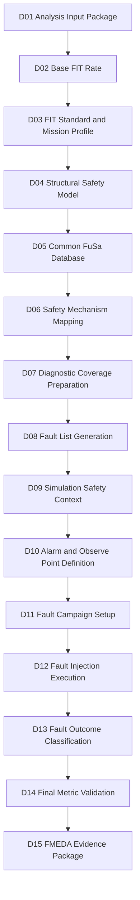

# [Automotive Safe-IC Practice 03] FIT Standard and Mission Profile: Making Reliability Assumptions Explicit

**Author**: Darren H. Chen  
**Direction**: Automotive Chip Functional Safety Analysis and Fault Injection Practice  
**Demo**: D03_fit_standard_and_mission_profile  
**Platform**: GitHub technical article + reproducible demo project  

**demo**: `D03_fit_standard_and_mission_profile`  
**Tags**: Automotive Chip, Functional Safety, ISO 26262, FIT, Base FIT Rate, Mission Profile, IEC 62380, SN 29500, Lambda, Reliability Prediction, DCE, FMEDA, Evidence Flow

---

## 1. Why D03 Exists

D01 built a reproducible **analysis input package**.

D02 consumed the D01 outputs and extracted the **Base FIT Rate** into a structured evidence package.

D03 answers the next question:

> Are the FIT numbers tied to explicit reliability assumptions, or are they accidentally tied to hidden defaults?

This matters because a FIT number is not just a property of RTL.

It is a result of:

```text
design structure
+ technology assumptions
+ reliability prediction standard
+ mission profile
+ temperature assumptions
+ manufacturing year
+ default libraries / lambda data
+ package and environmental assumptions
```

If those assumptions are not visible, the Base FIT Rate is difficult to review, compare, or reuse in FMEDA.

D03 therefore focuses on:

```text
FIT standard
mission profile
temperature context
manufacturing year
FIT setup protocol
run identity
evidence comparison
```

The goal is not to claim that one standard is universally better than another.

The goal is to make reliability assumptions explicit, machine-readable, comparable, and traceable.

---

## 2. Recap: What D01 and D02 Already Established

Before D03, the flow already has two layers.

```text
D01_analysis_input_package
    -> prepares RTL, filelist, clock definition, FIT setup, analysis config, DB session
    -> optionally runs the configured safety analysis engine
    -> generates native tool outputs, database, logs, and managed evidence index

D02_base_fit_rate
    -> consumes D01 outputs
    -> parses Base FIT Rate table
    -> generates bfr_summary.csv
    -> generates fit_contribution.csv
    -> generates base_fit_evidence_index.csv
```

The important lesson from D02 is:

```text
A Base FIT Rate number is useful only when its source evidence is traceable.
```

D03 extends this idea.

It asks:

```text
If the FIT standard changes, what changes?
If the mission profile changes, what changes?
If temperature assumptions change, what changes?
Which file recorded the assumption?
Which run generated the evidence?
Which database session stores the result?
```

This is where BFR becomes engineering evidence rather than a number copied from a log.

---

## 3. The Core Concept: FIT Is a Reliability Model Result

FIT means **Failure In Time**.

A common engineering interpretation is:

```text
1 FIT = 1 failure per 10^9 operating hours
```

But this definition alone is not enough.

A FIT value is not measured directly from one RTL file. It is predicted by a reliability model.

That model uses assumptions such as:

```text
component type
technology process
temperature
mission profile
operating ratio
package type
manufacturing year
lambda data
transistor count or design size model
```

A simplified view is:

```text
FIT = reliability_model(design_structure, technology, environment, mission_profile)
```

So D03 treats FIT as a **model-dependent metric**.

This leads to an important engineering rule:

> Never record a FIT number without recording the reliability model and the assumptions used to compute it.

---

## 4. FIT Standard: What It Means in the Flow

A FIT standard defines or references the method used to estimate failure rate.

In this series, D03 focuses on two commonly encountered identifiers:

```text
iec_62380
sn_29500
```

They represent different reliability prediction approaches and input assumptions.

The selected standard can affect:

```text
permanent FIT
transient FIT
lambda contribution
required setup files
default data files
report naming
DCE naming
comparison methodology
FMEDA interpretation
```

A dangerous workflow is:

```text
run analysis
copy FIT value
forget which standard was used
```

A better workflow is:

```text
run_id = D03_IEC62380_PC_65C
fit_standard = iec_62380
mission_profile = PassengerCompartment
temperature_ja = 65
mfg_year = 2026
source_config = inputs/fit/FIT_inputs.iec62380.pc65.txt
database_session = outputs/db/safeic_demo.fdb::D03_IEC62380_PC_65C
```

D03 makes this run identity explicit.

---

## 5. IEC 62380: Basic Engineering Interpretation

IEC 62380 is often used in reliability prediction for electronic components and systems.

For this article series, the main thing to understand is not the full equation.

The main thing is the **decomposition mindset**.

An IEC 62380-style reliability model typically considers contributions such as:

```text
die-related failure rate
package-related failure rate
electrical overstress contribution
temperature and mission profile scaling
operating and non-operating ratios
```

A simplified mental model:

```text
Total FIT = Die FIT + Package FIT + EOS FIT
```

Where:

```text
Die FIT
    relates to silicon technology, transistor count, junction temperature, and operating profile.

Package FIT
    relates to package type, thermal cycling, mechanical stress, and mission profile.

EOS FIT
    relates to electrical overstress and interface/environment assumptions.
```

This is why mission profile matters.

A chip in a passenger compartment and a chip near a high-temperature actuator may have the same RTL, but different reliability assumptions.

The RTL did not change.

The environment changed.

The predicted FIT may change.

---

## 6. SN 29500: Basic Engineering Interpretation

SN 29500 is another reliability prediction method commonly seen in industrial and automotive contexts.

A simplified way to understand it is:

```text
reference failure rate
    -> adjusted by component category, environment, operating condition, and stress factors
```

Key ideas include:

```text
reference condition
component category
temperature factor
operating condition
technology-dependent failure rate
```

The important point for D03 is:

> Switching from IEC 62380 to SN 29500 is not a formatting change. It can change the meaning and source of the FIT value.

Therefore, in D03, the standard is not a comment.

It is part of the run identity.

---

## 7. Mission Profile: The Environment Behind the Number

A mission profile describes how and where the device operates during its lifetime.

It may include:

```text
temperature ranges
time ratios at each temperature
operating vs non-operating time
thermal cycles
application location
environmental stress
```

In automotive usage, examples may include:

```text
PassengerCompartment
EngineCompartment
MotorControl
UnderHood
GenericDemoProfile
```

A mission profile answers questions such as:

```text
How hot is the device expected to run?
How long does it spend at each temperature?
Is it mostly powered on or mostly dormant?
Does it experience thermal cycling?
What automotive location does the assumption represent?
```

D03 does not need to prove a production mission profile.

It needs to prove the flow discipline:

```text
mission profile is explicit
mission profile is versioned
mission profile is linked to the FIT setup
mission profile is propagated into the evidence index
```

---

## 8. TemperatureJA, Junction Temperature, and Why Names Matter

Many FIT setup files include a temperature-related field, often something like:

```text
TemperatureJA 65
```

In a demo flow, this can be interpreted as a simplified temperature assumption.

In a production flow, temperature modeling may be more precise:

```text
ambient temperature
junction temperature
junction-to-ambient relationship
board temperature
thermal mission profile
```

The key method is:

```text
Do not hide temperature assumptions in tool defaults.
```

If the run uses a default value, record it.

If the run uses an explicit value, record it.

If D03 compares two variants, make the changed assumption obvious:

```csv
variant_id,fit_standard,mission_profile_type,temperature_ja,mfg_year
D03_IEC62380_PC_65C,iec_62380,PassengerCompartment,65,2026
D03_IEC62380_PC_85C,iec_62380,PassengerCompartment,85,2026
```

This makes the sensitivity study reviewable.

---

## 9. MFG_YEAR: Why Manufacturing Year Appears in FIT Setup

Manufacturing year may look strange to engineers who come from pure RTL verification.

But reliability prediction often includes technology maturity or aging-related assumptions.

A FIT setup may contain:

```text
MFG_YEAR 2026
```

The important D03 rule is:

```text
MFG_YEAR must be written using the FIT setup file protocol expected by the analysis engine.
```

In the demo flow:

```text
FIT setup file protocol: key value
```

Example:

```text
MFG_YEAR 2026
```

Not:

```text
MFG_YEAR = 2026
```

This distinction is important because the analysis initialization file may use `key = value`, while the FIT setup file may use `key value`.

D03 uses this as a concrete example of why file protocol discipline matters.

---

## 10. Two Different Configuration Protocols

D03 continues a key lesson discovered in D01.

There are two different configuration protocols:

### 10.1 Analysis Initialization File Protocol

The analysis initialization file uses an option style such as:

```ini
mode = analysis
top = toy_counter
filelist = inputs/filelist/filelist.f
clkdef = inputs/clock/toy_counter.clk
fit_setup = inputs/fit/FIT_inputs.iec62380.pc65.txt
fit_standard = iec_62380
write_fusa_db = true
fusa_db_name = outputs/db/toy_counter.fdb::D03_IEC62380_PC65
```

This is a **key equals value** style.

### 10.2 FIT Setup File Protocol

The FIT setup file uses a simpler record style:

```text
MissionProfileType PassengerCompartment
TemperatureJA 65
MFG_YEAR 2026
Process MOS.ASIC.STDCELL
LambdaFile /path/to/defaults/Lambda_ISO26262.txt
PitFile /path/to/defaults/Tech_PiT.txt
MissionProfileFile /path/to/defaults/MissionProfile.txt
DiagnosticCoverageFile /path/to/defaults/DC.txt
TransistorCountFile /path/to/defaults/Lib.tc
```

This is a **key value** style.

D03 explicitly documents this because many engineering failures come from mixing file protocols.

A single wrong delimiter can change the value parsed by the tool.

---

## 11. Run Identity: The Core Methodology of D03

D03 introduces the idea of a **run identity**.

A run identity is the minimum set of fields needed to uniquely explain a result.

For Base FIT comparison, a run identity should include:

```text
variant_id
top module
FIT standard
mission profile type
temperature assumption
manufacturing year
FIT setup file
analysis config file
native output directory
managed output directory
database file
database session
source D01/D02 evidence
tool log
```

Example:

```csv
variant_id,fit_standard,mission_profile_type,temperature_ja,mfg_year,database_session
D03_IEC62380_PC65,iec_62380,PassengerCompartment,65,2026,outputs/db/toy_counter.fdb::D03_IEC62380_PC65
D03_IEC62380_PC85,iec_62380,PassengerCompartment,85,2026,outputs/db/toy_counter.fdb::D03_IEC62380_PC85
D03_SN29500_PC65,sn_29500,PassengerCompartment,65,2026,outputs/db/toy_counter.fdb::D03_SN29500_PC65
```

The principle is:

> If two runs can produce different FIT results, then the difference must be represented in run identity.

---

## 12. D03 in the Full Safe-IC Flow

D03 sits between Base FIT extraction and deeper structural safety modeling.



D03 is not a fault injection demo.

It is a reliability assumption control demo.

It ensures that later safety metrics do not float without context.

---

## 13. D03 Tool Architecture

D03 is implemented as a small evidence-processing and variant-management layer.

It should not hard-code any commercial tool command.

Instead, it relies on generic environment variables and generated command scripts.

A recommended architecture:

```text
D03_fit_standard_and_mission_profile/
├── README.md
├── manifest.yaml
│
├── inputs/
│   ├── variants/
│   │   └── fit_variant_matrix.csv
│   ├── fit/
│   │   ├── FIT_inputs.iec62380.pc65.txt
│   │   ├── FIT_inputs.iec62380.pc85.txt
│   │   └── FIT_inputs.sn29500.pc65.txt
│   └── analysis/
│       ├── analysis_iec62380_pc65.fusaini
│       ├── analysis_iec62380_pc85.fusaini
│       └── analysis_sn29500_pc65.fusaini
│
├── scripts/
│   ├── setup_toolchain.template.csh
│   ├── setup_toolchain.local.csh      # not committed
│   ├── run_demo.csh
│   ├── run_variant_matrix.csh
│   └── run_demo.sh
│
├── tools/
│   ├── build_fit_variants.py
│   ├── validate_fit_setup_protocol.py
│   ├── parse_bfr_outputs.py
│   ├── compare_fit_variants.py
│   ├── build_evidence_index.py
│   └── write_demo_summary.py
│
├── Outputs/
│   └── ... native analysis engine outputs ...
│
├── outputs/
│   ├── variant_run_plan.csv
│   ├── fit_setup_inventory.csv
│   ├── bfr_variant_summary.csv
│   ├── fit_standard_comparison.csv
│   ├── mission_profile_sensitivity.csv
│   ├── run_identity_matrix.csv
│   ├── evidence_index.csv
│   └── demo_summary.md
│
└── logs/
    ├── run_demo.log
    └── variant_logs/
```

This structure separates:

```text
variant definition
FIT setup files
analysis configs
native tool outputs
managed evidence outputs
logs
```

---

## 14. D03 Variant Matrix Protocol

The variant matrix is the main input protocol of D03.

Example:

```csv
variant_id,fit_standard,mission_profile_type,temperature_ja,mfg_year,fit_setup,analysis_config,database_session
D03_IEC62380_PC65,iec_62380,PassengerCompartment,65,2026,inputs/fit/FIT_inputs.iec62380.pc65.txt,inputs/analysis/analysis_iec62380_pc65.fusaini,outputs/db/toy_counter.fdb::D03_IEC62380_PC65
D03_IEC62380_PC85,iec_62380,PassengerCompartment,85,2026,inputs/fit/FIT_inputs.iec62380.pc85.txt,inputs/analysis/analysis_iec62380_pc85.fusaini,outputs/db/toy_counter.fdb::D03_IEC62380_PC85
D03_SN29500_PC65,sn_29500,PassengerCompartment,65,2026,inputs/fit/FIT_inputs.sn29500.pc65.txt,inputs/analysis/analysis_sn29500_pc65.fusaini,outputs/db/toy_counter.fdb::D03_SN29500_PC65
```

This file is important because it turns comparison into a reproducible operation.

Without it, the engineer may say:

```text
I changed some setup and reran the tool.
```

With it, the engineer can say:

```text
I ran these named variants, each with a recorded FIT standard, mission profile, temperature assumption, config file, and database session.
```

That is the difference between experiment and evidence.

---

## 15. Native Outputs and Managed Outputs

D01 introduced the distinction between:

```text
Outputs/    native analysis engine outputs
outputs/    demo-managed outputs
```

D03 continues the same convention.

### 15.1 Native Outputs

The configured engine may generate reports into a native directory such as:

```text
Outputs/
```

Typical files may include:

```text
*_DCE
*_Coverage.rpt
*_metric.summary.rpt
*_Perm_PrimaryFault.list
*_Trans_PrimaryFault.list
```

The exact naming depends on the configured tool and analysis mode.

### 15.2 Managed Outputs

D03 copies, indexes, parses, and normalizes evidence into:

```text
outputs/
```

Example managed outputs:

```text
outputs/bfr_variant_summary.csv
outputs/fit_standard_comparison.csv
outputs/mission_profile_sensitivity.csv
outputs/evidence_index.csv
outputs/demo_summary.md
```

The method is:

```text
Do not edit native tool outputs.
Collect and index them.
Generate managed summaries separately.
```

This preserves evidence integrity.

---

## 16. Comparison Methodology

D03 comparison should be conservative.

It should not over-interpret a tiny toy design.

The comparison logic should be:

```text
for each variant:
    validate FIT setup protocol
    validate analysis config protocol
    run or locate native outputs
    parse Base FIT values
    record run identity
    index evidence sources

compare:
    permanent FIT
    transient FIT
    total FIT
    ratio vs baseline
    changed assumptions
```

A simple comparison table:

```csv
variant_id,fit_standard,mission_profile_type,temperature_ja,lambda_perm,lambda_tran,total_lambda,ratio_to_baseline
D03_IEC62380_PC65,iec_62380,PassengerCompartment,65,0.0000000779,0.0040250000,0.0040250779,1.0000
D03_IEC62380_PC85,iec_62380,PassengerCompartment,85,...,...,...,...
D03_SN29500_PC65,sn_29500,PassengerCompartment,65,...,...,...,...
```

This table should not be treated as production signoff.

It is a methodology demonstration.

The value of D03 is the reproducible comparison structure.

---

## 17. Why Diagnostic Coverage May Still Be Zero in D03

D02 explained why Diagnostic Coverage can be zero in a Base FIT run.

D03 keeps the same interpretation.

If no safety mechanism is mapped or credited, then:

```text
DiagCoveragePerm = 0
DiagCoverageTran = 0
```

This is not necessarily a failure.

It means:

```text
the run is calculating baseline random hardware failure exposure
not yet crediting safety mechanisms
```

Diagnostic coverage becomes meaningful after:

```text
safety mechanism mapping
fault list generation
fault campaign execution
fault outcome classification
final metric validation
```

So D03 should not try to force DC closure.

Its job is to stabilize the assumptions behind the baseline.

---

## 18. DCE-Style Artifacts in D03

DCE-style artifacts store diagnostic coverage or safety analysis information that can be reused in later stages.

In D03, the key point is:

```text
DCE artifacts must be tied to the FIT standard and run identity.
```

A file named:

```text
toy_counter_IEC_62380.DCE
```

already suggests that the result is standard-specific.

D03 makes that explicit in the evidence index:

```csv
artifact,type,fit_standard,variant_id,source_path
toy_counter_IEC_62380.DCE,dce,iec_62380,D03_IEC62380_PC65,Outputs/toy_counter_IEC_62380.DCE
```

This matters because later stages may import or compare DCE-style evidence.

If the standard is lost, the evidence becomes ambiguous.

---

## 19. Common Database Session Strategy

D03 should avoid overwriting D01 and D02 evidence.

Use named sessions.

Example:

```text
outputs/db/toy_counter.fdb::D03_IEC62380_PC65
outputs/db/toy_counter.fdb::D03_IEC62380_PC85
outputs/db/toy_counter.fdb::D03_SN29500_PC65
```

The database file can be shared.

The session names should be distinct.

A good session name encodes:

```text
demo id
standard
mission profile
temperature or variant key
```

This makes database evidence easier to inspect and compare.

Bad session name:

```text
BFR
```

Better session name:

```text
D03_IEC62380_PC65
```

Best session name for a large project may include:

```text
project block name
demo id
standard
mission profile
variant id
date or revision id
```

---

## 20. D03 Preflight Checks

D03 preflight should verify:

```text
variant matrix exists
each variant_id is unique
each FIT standard is supported by the demo
each FIT setup file exists
each FIT setup uses key value protocol
each analysis config exists
each analysis config uses key = value protocol
each config references the expected FIT setup
each config references a unique database session
managed output directories are writable
optional analysis engine is configured or warning is issued
D01/D02 source evidence is available if comparison uses previous baseline
```

Example:

```csv
check,status,details
variant_matrix_exists,PASS,inputs/variants/fit_variant_matrix.csv
variant_id_unique,PASS,3 variants
fit_setup_protocol_D03_IEC62380_PC65,PASS,key value format
analysis_config_protocol_D03_IEC62380_PC65,PASS,key = value format
database_session_unique,PASS,3 sessions
analysis_engine_configured,WARN,SAFEIC_ANALYSIS_ENGINE not set
```

Warnings are acceptable for preflight-only mode.

Protocol errors should be failures.

---

## 21. D03 Execution Modes

D03 should support two modes.

### 21.1 Evidence-Only Mode

This mode does not call the analysis engine.

It consumes existing outputs from D01/D02 or bundled fixtures.

It is useful for:

```text
GitHub readers
CI checks
documentation validation
parser testing
methodology review
```

### 21.2 Variant Execution Mode

This mode runs each variant using the configured analysis engine.

The exact command is not hard-coded in the article.

It is generated by the demo based on local configuration.

Conceptually:

```text
for each variant in fit_variant_matrix.csv:
    generate analysis command
    run configured safety analysis engine
    collect native Outputs/
    parse BFR table
    write managed output summaries
```

The configured executable is selected through:

```text
SAFEIC_ANALYSIS_ENGINE
```

and local setup such as:

```text
scripts/setup_toolchain.local.csh
```

This keeps the public article tool-neutral while preserving real engineering usability.

---

## 22. D03 Output Files

D03 should generate:

```text
outputs/variant_run_plan.csv
outputs/fit_setup_inventory.csv
outputs/run_identity_matrix.csv
outputs/bfr_variant_summary.csv
outputs/fit_standard_comparison.csv
outputs/mission_profile_sensitivity.csv
outputs/evidence_index.csv
outputs/demo_summary.md
```

Each file has a role.

| Output | Purpose |
|---|---|
| `variant_run_plan.csv` | Lists all planned standard/profile variants |
| `fit_setup_inventory.csv` | Records setup files and parsed assumption fields |
| `run_identity_matrix.csv` | Connects variant, config, database session, and evidence |
| `bfr_variant_summary.csv` | Extracts lambda values per variant |
| `fit_standard_comparison.csv` | Compares BFR across standards |
| `mission_profile_sensitivity.csv` | Compares BFR across environment/profile assumptions |
| `evidence_index.csv` | Maps every metric back to raw evidence |
| `demo_summary.md` | Human-readable conclusion |

This structure makes D03 useful even before large designs are introduced.

---

## 23. Example Demo Summary

A successful D03 summary may say:

```md
# D03 Demo Summary

Demo: D03_fit_standard_and_mission_profile

## Purpose

D03 compares Base FIT Rate evidence across explicit FIT standard and mission profile variants.

## Variants

- D03_IEC62380_PC65
- D03_IEC62380_PC85
- D03_SN29500_PC65

## Key Principle

FIT values are not standalone properties of RTL. They are model-dependent metrics tied to reliability standards, mission profiles, temperature assumptions, and FIT setup files.

## Result

Preflight passed. Variant evidence was parsed and indexed.

## Next Step

Use D04 to inspect structural safety elements and connect BFR evidence to endpoint/startpoint structure.
```

---

## 24. Common Mistakes

### 24.1 Treating FIT as a Pure RTL Property

FIT is not only RTL.

It is RTL plus reliability assumptions.

### 24.2 Comparing Two FIT Numbers Without Comparing Assumptions

A comparison table without standard and mission profile fields is not reviewable.

### 24.3 Mixing FIT Setup Protocol and Initialization Protocol

The analysis initialization file may use:

```text
key = value
```

The FIT setup file may use:

```text
key value
```

Do not mix them.

### 24.4 Reusing One Database Session for Multiple Variants

If variants overwrite the same session, evidence becomes ambiguous.

### 24.5 Editing Native Tool Outputs

Do not edit files in `Outputs/`.

Copy and index them into `outputs/`.

### 24.6 Over-Interpreting a Toy Design

D03 demonstrates method.

It does not claim production reliability signoff.

---

## 25. Review Checklist

A reviewer should be able to answer:

```text
Which FIT standards were compared?
Which mission profile was used?
Which temperature assumption was used?
Which manufacturing year was used?
Which FIT setup file recorded the assumption?
Which analysis config pointed to that setup?
Which database session stored each result?
Which native output files were generated?
Which managed output files summarized the result?
Are the variant ids unique?
Can the comparison be reproduced?
Can each metric be traced back to raw evidence?
```

If these answers are unclear, D03 has not done its job.

---

## 26. D03 Acceptance Criteria

D03 is complete when:

```text
[ ] variant matrix exists
[ ] each variant has explicit FIT standard
[ ] each variant has explicit mission profile or documented default
[ ] each variant has explicit temperature assumption or documented default
[ ] FIT setup files use correct key value protocol
[ ] analysis configs use correct key = value protocol
[ ] database sessions are unique
[ ] native outputs are not edited
[ ] managed outputs are generated
[ ] BFR values are parsed into structured CSV
[ ] standard/profile comparison tables are generated
[ ] evidence index links metrics to raw files
[ ] demo can run in evidence-only mode
[ ] optional real execution is controlled by local configuration
```

---

## 27. How D03 Connects to D04

D03 controls the reliability assumptions behind the BFR.

D04 will inspect the design structure behind those numbers.

In other words:

```text
D03 asks:
    Which model and mission profile produced the FIT?

D04 asks:
    Which structural elements contributed to the safety model?
```

Together they form the bridge:

```text
reliability assumption
    -> base failure rate
    -> structural safety model
    -> diagnostic coverage preparation
    -> fault list
    -> fault campaign
    -> final FMEDA evidence
```

---

## 28. Summary

D03 introduces a critical engineering discipline:

> FIT values must be tied to explicit standards, mission profiles, and run identities.

A Base FIT Rate is not just a number.

It is a model-dependent result that must carry:

```text
FIT standard
mission profile
temperature assumption
manufacturing year
FIT setup file
analysis config
database session
raw evidence files
managed summaries
```

D03 turns this into a reproducible demo structure.

It does not try to prove final safety compliance.

It proves that reliability assumptions are visible, comparable, and traceable.

That is the foundation needed before moving into structural safety modeling, diagnostic coverage, fault list generation, fault campaign execution, and FMEDA evidence packaging.
