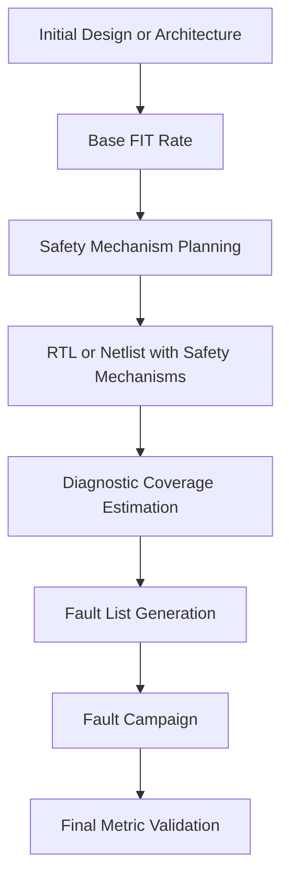
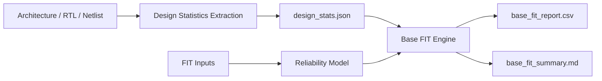
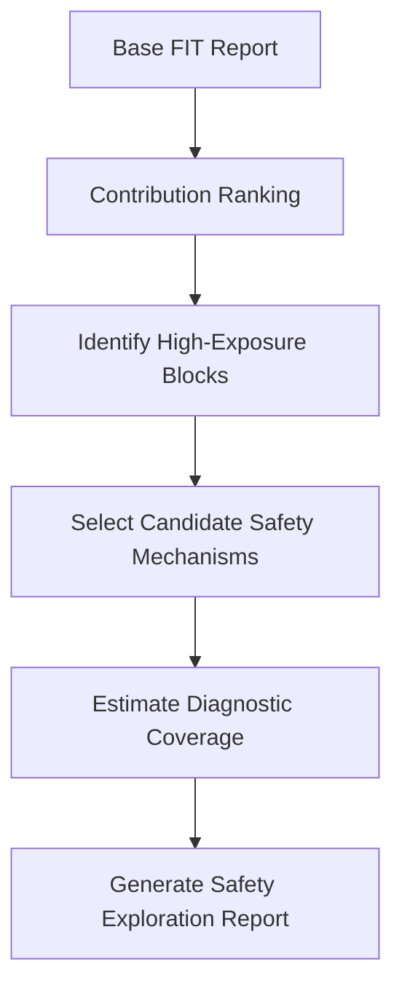
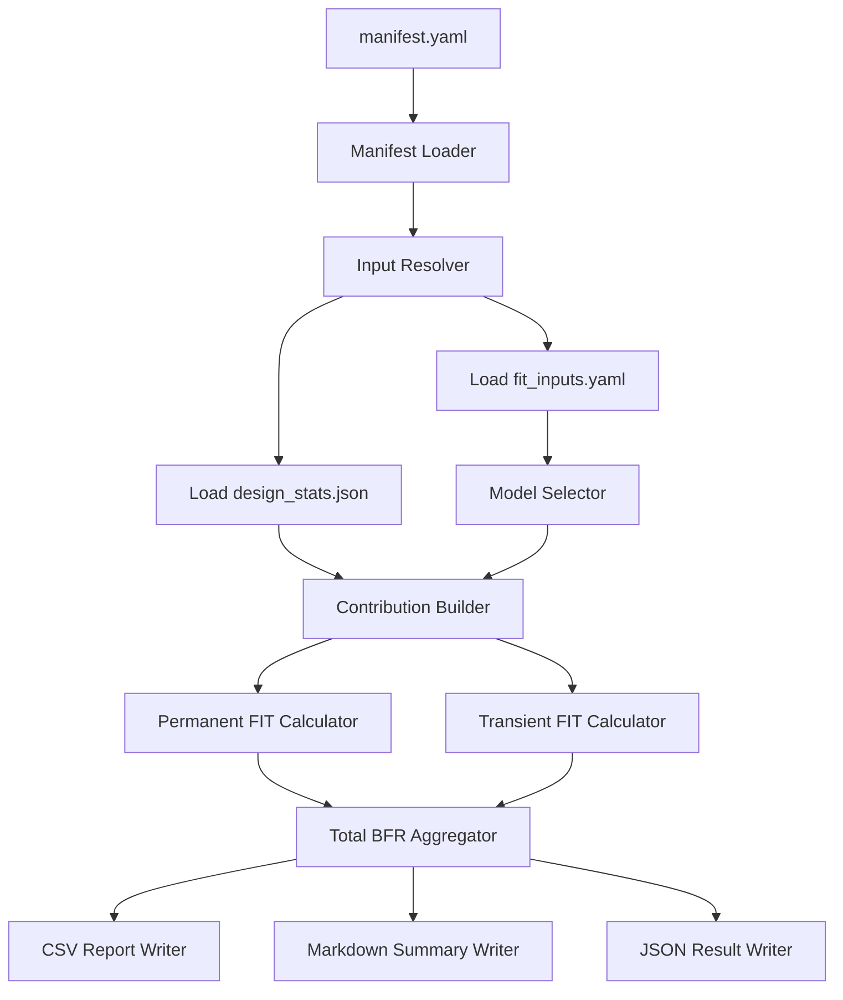
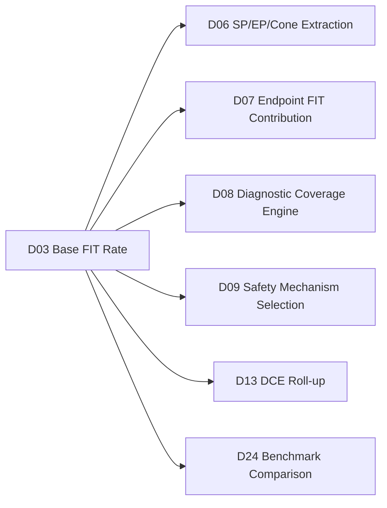

# [Automotive Safe-IC Practice 03] Starting from Base FIT Rate: Why Safety Analysis Begins with BFR

**Author:** Darren H. Chen  
**Direction:** Automotive chip functional safety analysis and fault injection practice  
**Demo:** `D03_base_fit_rate`  
**Tags:** `Automotive Chip`, `Functional Safety`, `SafeIC`, `Base FIT Rate`, `BFR`, `FIT/DC`, `ISO 26262`, `IEC 62380`, `SN 29500`

---

## Demo scope

`D03_base_fit_rate` implements the first metric-oriented step in the automotive Safe-IC practice flow.

The corresponding generic tool module is:

```text
safeic-bfr
```

Its purpose is not to validate a safety mechanism and not to run a fault campaign.

Its purpose is more fundamental:

```text
Estimate the base random hardware failure rate of a design before diagnostic coverage credit is applied.
```

In this demo, Base FIT Rate is treated as the baseline metric that answers one simple question:

```text
If this design existed without safety mechanism coverage,
how much random hardware failure exposure would it have?
```

This baseline is important because later safety analysis steps only make sense when we can compare them against something.

```text
Base FIT Rate
→ safety mechanism planning
→ diagnostic coverage estimation
→ fault campaign evidence
→ final metric validation
```

Without BFR, a safety flow may still generate many reports, but it loses the ability to explain how much improvement was achieved by adding protection.

---

## 1. Why Base FIT Rate comes before fault injection

Fault injection is often the most visible part of a functional safety verification flow.

It feels concrete:

```text
inject a stuck-at fault
observe an alarm
classify the result
produce a fault report
```

However, fault injection should not be the first conceptual step.

Before injecting faults, the safety engineer should understand the design's random hardware failure exposure.

This is what BFR provides.

A simplified view is:

```text
BFR is about exposure.
Fault campaign is about detection evidence.
Diagnostic coverage is about how much exposure is controlled.
```

The three questions are different:

| Question | Metric / activity |
|---|---|
| How much random hardware failure exposure does the design have? | Base FIT Rate |
| Which parts of the design contribute most to that exposure? | FIT contribution analysis |
| Which failures are detected by safety mechanisms? | Diagnostic coverage and fault campaign |

If we skip BFR and jump directly into fault injection, we may know that some faults are detected, but we may not know whether they are the important faults.

This leads to a common mistake:

```text
large number of injected faults
+ impressive detected fault count
+ no baseline failure-rate weighting
= weak safety argument
```

A useful safety argument should not only count faults.

It should also explain the safety relevance of the design regions where those faults occur.

---

## 2. What FIT means at chip level

FIT means Failure In Time.

In reliability engineering, one FIT is commonly understood as:

```text
1 FIT = 1 failure per 1,000,000,000 device-hours
```

At chip level, FIT is used to express how likely a hardware element is to experience a random hardware failure under an assumed technology, package, environment, and mission profile.

For an automotive chip, a FIT value is not calculated from RTL syntax alone.

It depends on several domains:

```text
design structure
+ design size
+ technology assumptions
+ reliability model
+ temperature profile
+ mission profile
+ package assumptions
+ permanent/transient failure assumptions
```

That is why BFR is not simply a parser result.

It is a structured reliability computation based on both design-derived data and user-supplied assumptions.

---

## 3. The role of BFR in the full Safe-IC flow

In a practical automotive chip development cycle, safety metrics are evaluated multiple times.

The initial BFR is calculated early, before safety mechanisms are fully designed or validated.

Later, the design is re-analyzed after safety mechanisms are added.

Finally, implementation-level analysis and fault campaign evidence are used to validate the safety case.



The baseline function of BFR can be summarized as:

```text
BFR does not prove the design is safe.
BFR defines the amount of failure exposure that later safety mechanisms must address.
```

This is why the third demo in this series focuses on BFR before introducing SP/EP/Cone extraction, DC calculation, and fault campaign execution in later demos.

---

## 4. BFR is a baseline, not a final safety metric

A common misconception is to treat FIT as a single final number.

In practice, BFR is only the starting point.

It answers:

```text
What is the design's raw failure-rate exposure?
```

It does not answer:

```text
Which failures violate a safety goal?
Which failures are detected?
Which failures are safe?
Which failures remain residual?
Which failures are latent?
```

Those questions belong to later stages.

A useful distinction is:

| Metric / evidence | Main meaning |
|---|---|
| BFR | Raw baseline failure-rate exposure before coverage credit |
| DC | How much of the relevant failure exposure is detected or controlled |
| SPFM | Robustness against single point and residual faults |
| LFM | Robustness against latent multi-point faults |
| PMHF | Residual risk contribution for random hardware failure |
| Fault campaign result | Simulation-based evidence for detection or non-detection |

In this demo, we do not try to calculate all final ISO-style safety metrics.

Instead, we build a clean BFR foundation that later demos can extend.

---

## 5. Permanent and transient failure exposure

A BFR model usually distinguishes between at least two major classes of random hardware faults:

```text
permanent faults
transient faults
```

### 5.1 Permanent failure exposure

Permanent failure exposure represents hardware failures that remain after they occur.

Examples include:

```text
stuck-at behavior
open or short behavior
permanent transistor-level defect
permanent memory cell failure
permanent package or interconnect-related failure
```

A simplified permanent FIT model may use:

```text
technology lambda values
+ number of transistors or memory bits
+ temperature or mission profile factors
+ package-related contribution
```

### 5.2 Transient failure exposure

Transient failure exposure represents temporary disturbances.

Examples include:

```text
single event upset
temporary bit flip
temporary logic value corruption
temporary register value change
```

A simplified transient FIT model may use:

```text
transient failure rate per gate
transient failure rate per flip-flop or latch
transient failure rate per memory bit
```

The distinction matters because safety mechanisms may cover permanent and transient failures differently.

A parity checker may be very useful for some transient data corruptions.

A lockstep or duplicated execution path may cover a larger logic region.

A watchdog may detect some control-flow failures but not all data corruption cases.

Therefore, BFR should preserve the separation between permanent and transient exposure instead of collapsing everything into one opaque number too early.

---

## 6. Design abstraction levels and BFR accuracy

A BFR calculation can be performed at different design stages.

```text
Architecture
RTL
Gate-level netlist
```

Each stage has a different purpose.

| Stage | What is available | BFR purpose | Limitation |
|---|---|---|---|
| Architecture | block counts, rough transistor estimates, memory size | early planning | low structural accuracy |
| RTL | synthesizable design hierarchy and registers | early safety exploration | final gates may differ |
| Gate-level netlist | implementation-level cells and mapped structure | final metric refinement | requires synthesis and mapping discipline |

The methodology used in `D03_base_fit_rate` is intentionally stage-aware.

The demo does not assume that every project already has a final netlist.

Instead, it allows BFR to be estimated from a normalized `design_stats.json` file, which can be produced from different sources.

```text
architecture count file
or RTL-derived estimate
or netlist-derived count
→ design_stats.json
→ safeic-bfr
→ base_fit_report.csv
```

This keeps the BFR engine independent of a specific design parser.

---

## 7. Design statistics as the bridge between design and reliability model

The BFR tool should not read arbitrary RTL and immediately produce a magic number.

A better architecture is to separate design statistics from reliability computation.



The file `design_stats.json` is the interface between design analysis and BFR computation.

Example:

```json
{
  "design": "toy_counter_top",
  "stage": "rtl_estimate",
  "lib_types": [
    {
      "name": "STD_CELL",
      "gate_count": 120,
      "ff_count": 16,
      "estimated_transistors": 760
    },
    {
      "name": "SRAM",
      "memory_bits": 0
    }
  ]
}
```

This file makes the BFR computation auditable.

If the FIT result changes, we can ask:

```text
Did the design statistics change?
Did the reliability assumptions change?
Did the model implementation change?
```

Without this interface, debugging FIT differences becomes difficult.

---

## 8. FIT input assumptions

The second major input to BFR is the reliability assumption package.

Example `fit_inputs.yaml`:

```yaml
fit_standard: simplified_iec62380
mission_profile: passenger_compartment
temperature_ja: 65
manufacturing_year: 2026
default_process: MOS.ASIC.STDCELL

lambda:
  std_cell_per_transistor_perm: 3.0e-6
  sram_per_bit_perm: 1.7e-7
  logicgate_transient: 1.0e-6
  ff_transient: 1.0e-3
  memory_bit_transient: 1.0e-6

package:
  enabled: false
  package_fit: 0.0
```

This file records the assumptions behind the result.

The key methodology is:

```text
A BFR number without its FIT input assumptions is not reusable evidence.
```

In a real project, the input values may come from technology files, library data, mission profiles, package data, and company-approved reliability assumptions.

In this demo, we use simplified values to show the data path and methodology rather than to claim production-grade metric accuracy.

---

## 9. Reliability model abstraction

The BFR engine should support multiple model profiles.

For this practice series, the initial profiles are simplified:

```text
simplified_iec62380
simplified_sn29500
custom_linear
```

The reason is architectural:

```text
The flow should not hard-code one reliability model into the tool core.
```

Instead, the tool should separate:

```text
input parsing
model selection
model parameter loading
design statistics mapping
report generation
```

A generic model interface can look like this:

```text
model_inputs = design_stats + fit_inputs
model_outputs = permanent_fit + transient_fit + breakdown
```

The internal BFR engine does not need to know whether the model is derived from IEC-style assumptions, SN-style assumptions, or a company-specific conservative approximation.

It only needs a stable model contract.

---

## 10. Simplified BFR computation model used in the demo

`D03_base_fit_rate` uses a deliberately simple calculation model.

For demonstration purposes:

```text
permanent FIT ≈ Σ(size_i × permanent_lambda_i × environment_factor_i)
transient FIT ≈ Σ(count_i × transient_lambda_i)
total BFR ≈ permanent FIT + transient FIT + package FIT
```

The point is not to replace an industry-grade reliability model.

The point is to make the data flow explicit.

```text
size_i
→ represents transistor count, memory bit count, or estimated object count

lambda_i
→ represents failure-rate assumption for that object type

environment_factor_i
→ represents temperature, mission profile, manufacturing year, or model-specific adjustment
```

For example:

```text
STD_CELL permanent contribution
= estimated_transistors × std_cell_per_transistor_perm × environment_factor

SRAM permanent contribution
= memory_bits × sram_per_bit_perm × environment_factor

FF transient contribution
= ff_count × ff_transient
```

The demo keeps each contribution visible in the output report.

A black-box single number is avoided.

---

## 11. Why bottom-up contribution matters

A useful BFR result should not only show total FIT.

It should also show where the FIT comes from.

Consider two designs with the same total BFR:

```text
Design A: most FIT comes from one memory block
Design B: most FIT comes from distributed control logic
```

The same total FIT may lead to very different safety mechanism strategies.

For Design A, ECC or memory parity may be the first protection candidate.

For Design B, control-flow monitoring, lockstep, duplicated compare, or endpoint-level checkers may be more relevant.

Therefore, BFR should produce a contribution breakdown.

Example `base_fit_report.csv`:

```csv
design,stage,lib_type,item,permanent_fit,transient_fit,total_fit,percentage
 toy_counter_top,rtl_estimate,STD_CELL,logic_gates,0.00036,0.00012,0.00048,36.92
 toy_counter_top,rtl_estimate,STD_CELL,flip_flops,0.00008,0.00016,0.00024,18.46
 toy_counter_top,rtl_estimate,PACKAGE,package,0.00058,0.00000,0.00058,44.62
```

This turns BFR from a scalar metric into an engineering decision aid.

---

## 12. BFR and safety mechanism planning

BFR should influence safety mechanism planning.

The relationship is:

```text
high contribution region
→ candidate for safety mechanism protection
→ estimated diagnostic coverage
→ residual risk reduction
```

A simple planning flow is:



Examples:

| High contribution source | Possible safety mechanism direction |
|---|---|
| SRAM or register file | ECC, parity, memory BIST, scrubbing |
| datapath logic cone | duplication and compare, reasonableness check |
| control FSM | state encoding check, watchdog, control-flow monitor |
| bus interface | protocol checker, timeout monitor, parity on payload |
| sensor input path | range check, plausibility check, redundant input comparison |

The key is that safety mechanisms should be selected based on exposure and functional criticality, not only based on design habit.

---

## 13. Tool architecture of `safeic-bfr`

The `safeic-bfr` module is a metric computation tool.

It consumes normalized inputs and produces auditable reports.



The tool should have a small number of responsibilities:

| Component | Responsibility |
|---|---|
| Manifest loader | Find normalized input paths |
| FIT input loader | Parse reliability assumptions |
| Design stats loader | Parse design size and object counts |
| Model selector | Choose simplified IEC-style, SN-style, or custom model |
| Contribution builder | Map design objects to model categories |
| Permanent FIT calculator | Compute permanent contribution breakdown |
| Transient FIT calculator | Compute transient contribution breakdown |
| Aggregator | Compute total BFR and percentages |
| Report writer | Generate CSV, JSON, and Markdown outputs |

The tool should not perform fault injection.

It should not compute final diagnostic coverage.

It should not silently modify the input assumptions.

---

## 14. Recommended demo directory structure

`D03_base_fit_rate` uses the following structure:

```text
D03_base_fit_rate/
  README.md
  run_demo.csh
  run_demo.sh
  manifest.yaml
  inputs/
    design_stats.json
    fit_inputs.yaml
    lambda.csv
    mission_profile.csv
  outputs/
    base_fit_report.csv
    base_fit_result.json
    base_fit_summary.md
    contribution_rank.csv
  expected/
    golden_base_fit_report.csv
```

This demo intentionally starts from `design_stats.json` rather than raw RTL.

Raw RTL extraction belongs to later structural demos.

The focus here is:

```text
Given design statistics and reliability assumptions,
can we compute and explain a baseline FIT number?
```

---

## 15. Example manifest

Example `manifest.yaml`:

```yaml
project: automotive_safeic_practice_d03
demo: D03_base_fit_rate

session:
  name: base_fit_baseline
  database: outputs/safeic.sqlite

design:
  top: toy_counter_top
  stage: rtl_estimate
  design_stats: inputs/design_stats.json

safety:
  fit_inputs: inputs/fit_inputs.yaml

outputs:
  report_dir: outputs
  base_fit_report: outputs/base_fit_report.csv
  base_fit_result: outputs/base_fit_result.json
  base_fit_summary: outputs/base_fit_summary.md
```

The demo is executed with:

```bash
safeic-bfr --manifest manifest.yaml
```

The C shell version can be:

```csh
#!/bin/csh -f
set DEMO_HOME = `pwd`
python3 ../../tools/safeic_bfr.py --manifest $DEMO_HOME/manifest.yaml
```

This keeps the demo compatible with older EDA-style shell environments while still allowing a normal shell script version.

---

## 16. Example input: design statistics

Example `inputs/design_stats.json`:

```json
{
  "design": "toy_counter_top",
  "stage": "rtl_estimate",
  "units": {
    "fit": "failure_per_1e9_hours"
  },
  "objects": [
    {
      "name": "counter_datapath",
      "lib_type": "STD_CELL",
      "gate_count": 120,
      "ff_count": 16,
      "estimated_transistors": 760
    },
    {
      "name": "checker_logic",
      "lib_type": "STD_CELL",
      "gate_count": 48,
      "ff_count": 4,
      "estimated_transistors": 280
    },
    {
      "name": "memory_none",
      "lib_type": "SRAM",
      "memory_bits": 0
    }
  ]
}
```

This format intentionally separates design objects by logical role.

Later demos can refine this into endpoint-level and cone-level contributions.

For D03, block-level contribution is enough.

---

## 17. Example input: FIT assumptions

Example `inputs/fit_inputs.yaml`:

```yaml
fit_standard: custom_linear
mission_profile: demo_passenger_compartment
temperature_ja: 65
manufacturing_year: 2026
default_process: MOS.ASIC.STDCELL

environment:
  permanent_factor: 1.0
  transient_factor: 1.0

lambda:
  std_cell_per_transistor_perm: 3.0e-6
  sram_per_bit_perm: 1.7e-7
  logicgate_transient: 1.0e-6
  ff_transient: 1.0e-3
  memory_bit_transient: 1.0e-6

package:
  enabled: true
  package_fit: 0.00058
```

The values above are demonstration parameters.

A production flow should replace them with project-approved reliability inputs.

The important point is that the values are explicit and version controlled.

---

## 18. Example output: base FIT report

Example `outputs/base_fit_report.csv`:

```csv
object,lib_type,permanent_fit,transient_fit,package_fit,total_fit,percentage
counter_datapath,STD_CELL,0.002280,0.016120,0.000000,0.018400,74.80
checker_logic,STD_CELL,0.000840,0.004048,0.000000,0.004888,19.87
package,PACKAGE,0.000000,0.000000,0.000580,0.000580,2.36
memory_none,SRAM,0.000000,0.000000,0.000000,0.000000,0.00
```

Example `outputs/base_fit_summary.md`:

```md
# Base FIT Summary

Design: toy_counter_top
Stage: rtl_estimate
Model: custom_linear

## Result

- Permanent FIT: 0.003120
- Transient FIT: 0.020168
- Package FIT: 0.000580
- Total BFR: 0.023868

## Top contributor

counter_datapath contributes 74.80% of total BFR.

## Engineering interpretation

The counter datapath should be reviewed first when selecting candidate safety mechanisms.
```

The summary file is intentionally written in human language.

A safety metric report should support review, not only automation.

---

## 19. What the result means

Suppose the demo reports:

```text
Total BFR = 0.023868 FIT
```

This does not mean the design is safe.

It means:

```text
Under the demo assumptions,
the raw baseline failure exposure is estimated as 0.023868 failures per 1e9 device-hours.
```

The next question is not simply whether this number is large or small.

The next question is:

```text
Which part of this exposure can violate safety goals,
and which safety mechanisms can detect or control those failures?
```

That is why BFR should feed later analysis steps.

```text
BFR result
→ contribution ranking
→ safety mechanism planning
→ diagnostic coverage estimation
→ fault campaign evidence
```

---

## 20. BFR and diagnostic coverage are connected but different

BFR is the denominator-side thinking.

Diagnostic coverage is the protection-side thinking.

A simplified relationship is:

```text
residual exposure ≈ base exposure × (1 - diagnostic coverage)
```

This is not a full safety metric formula, but it captures the intuition.

If a design region has high base exposure but no safety mechanism, it may dominate residual risk.

If a region has high exposure and strong coverage, residual exposure may be much smaller.

If a region has low exposure, adding expensive protection may not be the first priority unless its functional criticality is very high.

This leads to a practical methodology:

```text
Do not select safety mechanisms only by intuition.
Use BFR contribution to guide where coverage matters most.
```

---

## 21. BFR and fault campaign are connected but different

A fault campaign injects specific faults and observes behavior.

BFR estimates random hardware failure exposure.

The two should be connected, but they should not be confused.

| Item | BFR | Fault campaign |
|---|---|---|
| Main question | How much raw failure exposure exists? | What happens when faults are injected? |
| Main input | design stats and reliability assumptions | design, VCD context, fault list, alarm list |
| Main output | FIT breakdown | fault classification report |
| Typical timing | early and repeated | after usable stimulus and fault list exist |
| Main use | planning and weighting | validation evidence |

A mature flow should use both.

BFR provides failure-rate weighting.

Fault campaign provides behavior evidence.

Final safety metrics need both structural/reliability reasoning and simulation-based validation.

---

## 22. BFR quality checklist

A BFR result is only useful if the following questions can be answered.

```text
Which design version produced the design statistics?
Which abstraction stage was used?
Which reliability model was used?
Which mission profile was assumed?
Which temperature assumptions were used?
Which technology or process categories were mapped?
Which package contribution was included?
How much came from permanent exposure?
How much came from transient exposure?
Which block contributed most?
```

The demo report should make these answers visible.

If a BFR report cannot answer them, it is difficult to use as engineering evidence.

---

## 23. Common BFR mistakes

### Mistake 1: treating BFR as a final safety result

Bad pattern:

```text
The BFR number is low, so the design is safe.
```

Better pattern:

```text
BFR defines raw exposure. Safety still depends on safety relevance, coverage, and validation evidence.
```

### Mistake 2: ignoring transient contribution

Bad pattern:

```text
Only permanent FIT is reported.
```

Better pattern:

```text
Permanent and transient contributions are reported separately.
```

### Mistake 3: hiding model assumptions

Bad pattern:

```text
FIT result appears in a report, but lambda, temperature, process, and mission profile are unknown.
```

Better pattern:

```text
The report links back to fit_inputs.yaml and design_stats.json.
```

### Mistake 4: no contribution breakdown

Bad pattern:

```text
Only total FIT is reported.
```

Better pattern:

```text
Block-level and later endpoint-level contribution reports guide safety mechanism selection.
```

### Mistake 5: mixing abstraction stages without labels

Bad pattern:

```text
Architecture estimate and gate-level result are compared without stage information.
```

Better pattern:

```text
Every result records architecture, RTL, or netlist stage explicitly.
```

---

## 24. How D03 supports later demos

`D03_base_fit_rate` produces the baseline metric data that later demos can consume.



The most important downstream connection is D07.

D03 provides block-level BFR.

D07 refines the idea into endpoint-level contribution.

That transition is important:

```text
block-level BFR tells us where to look.
endpoint-level contribution tells us what to protect.
```

---

## 25. Demo deliverables

`D03_base_fit_rate` should produce:

```text
outputs/base_fit_report.csv
outputs/base_fit_result.json
outputs/base_fit_summary.md
outputs/contribution_rank.csv
```

The expected clean result is:

```text
status: PASS
model: custom_linear or simplified_iec62380
permanent_fit: reported
transient_fit: reported
total_bfr: reported
top_contributor: reported
```

The expected learning outcome is:

```text
Base FIT Rate is the starting point of Safe-IC metric reasoning.
It defines raw random hardware failure exposure before safety mechanism coverage is applied.
```

---

## 26. Methodology summary

The core methodology of this article is:

```text
Start with exposure before claiming protection.
```

A functional safety analysis should not begin by asking only:

```text
Can my checker detect injected faults?
```

It should first ask:

```text
What is the raw failure-rate exposure of the design?
Which objects dominate that exposure?
Which assumptions produced that estimate?
```

`D03_base_fit_rate` turns those questions into a reproducible demo.

The BFR output is not the end of the safety story.

It is the baseline that makes the rest of the story measurable.

