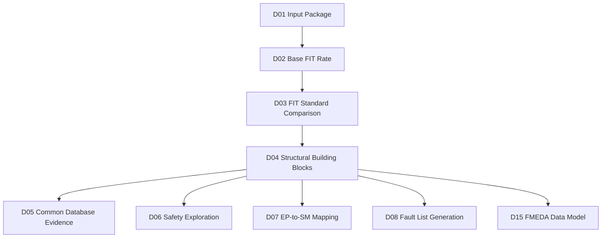
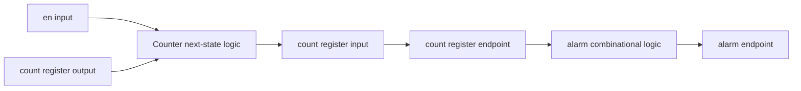
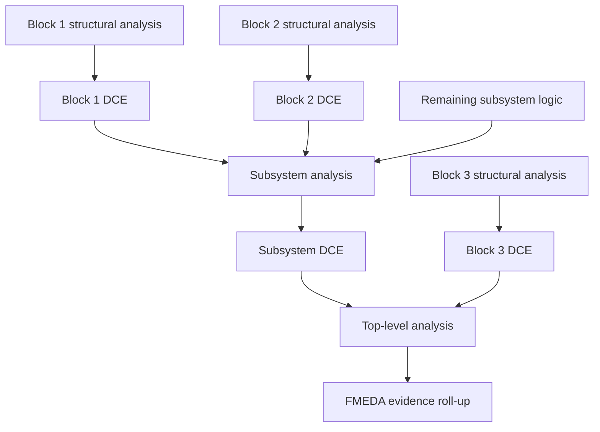
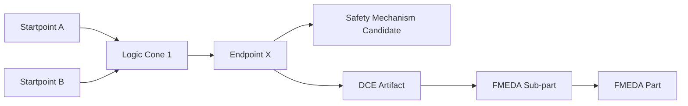
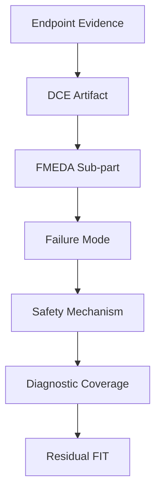

# Automotive Safe-IC Practice 04: Structural Building Blocks — Endpoint, Startpoint, DCE, and EP-to-SM Map

Author: Darren H. Chen  
Direction: Automotive chip functional safety analysis and fault injection  
Demo: D04_structural_building_blocks  
Tags: Safe-IC, ISO 26262, Functional Safety, FIT, Diagnostic Coverage, Endpoint, Startpoint, DCE, Safety Mechanism, FMEDA, Fault Injection, Automotive Semiconductor

---

## 1. Why D04 Starts from Structure Instead of Fault Injection

After the first three practices, the flow has already established a reproducible safety-analysis context.

D01 defines the input package: RTL boundary, filelist, clock definition, FIT setup, analysis configuration, output identity, and evidence directory structure.

D02 calculates the Base FIT Rate and builds the first quantitative baseline: which parts of the design contribute to random hardware failure exposure before safety mechanisms are considered.

D03 compares the two supported FIT standards used by the analysis flow, namely IEC 62380 and SN 29500, under the same design boundary and the same upstream evidence chain. It also makes one important engineering distinction clear:

```text
fit_standard = iec_62380 | sn_29500
variant_id   = fit_standard + mission profile + parameter set
```

D04 now moves from **numbers** to **structure**.

This is an important transition. Functional safety analysis is not only about asking, “What is the total FIT value?” It is also about asking:

```text
Where can a fault start?
Where can the effect of that fault be observed?
Which sequential or output element becomes a safety-relevant endpoint?
Which upstream logic cone contributes to that endpoint?
Which safety mechanism is expected to detect or control faults in that cone?
Which structural evidence can be reused later in FMEDA and fault campaign planning?
```

If D02 is the FIT baseline and D03 is the standard-selection baseline, D04 is the **structural baseline**.

In a real automotive semiconductor project, structural analysis is the bridge between design implementation and safety reasoning. Without this bridge, a FIT number is difficult to review, a fault list is difficult to justify, and an FMEDA table becomes disconnected from the actual RTL or netlist.

D04 therefore focuses on four building blocks:

```text
Endpoint
Startpoint
DCE
EP-to-SM Map
```

These four terms are simple on the surface, but they form the backbone of many safety-analysis, safety-exploration, fault-list, and FMEDA workflows.

---

## 2. The D04 Position in the 20-Part Practice Flow

D04 is named:

```text
Structural Building Blocks: Endpoint, Startpoint, DCE, EP-to-SM Map
```

It belongs to the safety-analysis part of the flow. It is not a fault campaign yet. It does not require a VCD, a good-machine simulation, alarm timing, observe points, or fault outcome classification. Those belong to later practices.

The position of D04 is:

```text
D01  Analysis Input Package
D02  Base FIT Rate
D03  FIT Standards: IEC 62380 vs SN 29500
D04  Structural Building Blocks: Endpoint, Startpoint, DCE, EP-to-SM Map
D05  FuSa Common Database as Evidence Center
D06  Safety Exploration
D07  Safety Mechanism Map
D08  Fault List Generation
...
D20  End-to-End Mini Flow
```

The key purpose of D04 is to prepare the structural information that later practices will use.

A simplified dependency view is:



D04 therefore does not try to prove final safety metrics. It prepares the objects that make later safety metrics explainable.

---

## 3. The Core Problem: FIT Is Quantitative, but Safety Review Is Structural

A total FIT number is useful, but it is not enough for engineering review.

A reviewer will eventually ask:

```text
Which endpoints dominate the FIT contribution?
Which startpoints feed those endpoints?
Which logic cones are safety-critical?
Which endpoints already have a protection mechanism?
Which endpoints still need exploration?
Which DCE files represent reusable safety evidence?
Which structural units map naturally to FMEDA parts and sub-parts?
```

The underlying issue is that hardware safety is not only measured at the chip level. It is reasoned about through **structure**:

```text
registers
latches
output ports
state machines
bus response signals
alarm signals
memory interfaces
control cones
data cones
protocol-visible outputs
sub-block boundaries
```

D04 introduces a structure-first way of reading safety-analysis output.

---

## 4. Endpoint: Where a Fault Effect Becomes Visible

An **endpoint** is a structural location where the effect of a fault can be observed or accumulated.

In digital design terms, common endpoints include:

```text
registers
latches
output ports
state-holding elements
interface-visible status signals
alarm-like outputs
```

The exact endpoint definition depends on the analysis engine and its structural model. For practical safety reasoning, an endpoint is the place where the design state or interface state can diverge from the expected behavior.

Consider a small counter:

```verilog
module toy_counter (
    input  wire       clk,
    input  wire       rst_n,
    input  wire       en,
    output reg  [3:0] count,
    output wire       alarm
);

always @(posedge clk or negedge rst_n) begin
    if (!rst_n) begin
        count <= 4'd0;
    end else if (en) begin
        count <= count + 4'd1;
    end
end

assign alarm = (count == 4'hF);

endmodule
```

Possible endpoints include:

```text
count[0]
count[1]
count[2]
count[3]
alarm
```

But the safety meaning of these endpoints is not identical.

`count[0]` is a state bit. A fault there may affect future state evolution.

`alarm` is an output derived from the counter state. A fault there may be directly visible to a monitor or to downstream logic.

A useful mental model is:

```text
Endpoint = where fault effect can be measured, accumulated, or exported
```

Endpoint analysis matters because many safety mechanisms are endpoint-oriented. Parity, duplication, comparison, ECC, lockstep, and alarm-generation logic all ultimately need some endpoint where detection or control can be credited.

---

## 5. Startpoint: Where the Fault Influence Begins

A **startpoint** is a structural source that can influence an endpoint through combinational or sequential logic.

Common startpoints include:

```text
primary inputs
register outputs
memory outputs
black-box outputs
constant-driving structures
interface request signals
configuration signals
control state bits
```

A startpoint is not necessarily a fault site in the final fault campaign. It is a structural origin used to build a dependency relationship.

A simplified relationship is:

```text
startpoint --> logic cone --> endpoint
```

For example:



In this graph:

```text
en input                = startpoint-like source
count register output   = startpoint-like source
next-state logic         = cone
count register endpoint = endpoint
alarm output            = endpoint
```

Startpoint analysis helps answer:

```text
Which upstream sources feed a safety-relevant endpoint?
How wide is the cone feeding that endpoint?
How many endpoints share the same startpoint?
Which startpoints are high fanout and therefore important for safety exploration?
```

A startpoint with high fanout can influence many endpoints. In safety analysis, such a startpoint may deserve special attention because a fault there can propagate broadly.

---

## 6. Logic Cone: The Structural Path Between Startpoint and Endpoint

The word **cone** is used heavily in safety and EDA analysis.

A cone is the set of logic that connects a group of sources to a target.

There are two common views:

```text
fanin cone  = logic feeding into a target endpoint
fanout cone = logic affected by a source startpoint
```

For D04, the fanin view is especially useful:

```text
Endpoint fanin cone = the upstream logic that can affect the endpoint value
```

The cone is where many structural safety mechanisms operate.

Examples:

```text
Endpoint parity       -> protects endpoint-related data/state
Endpoint duplication  -> duplicates endpoint cone logic and compares results
Startpoint duplication -> duplicates logic from selected startpoints to endpoint
TMR                   -> triplicates a structure and votes
ECC                   -> protects encoded storage or memory-like data
```

A cone is not just an implementation detail. It affects:

```text
area cost
power cost
fault propagation behavior
diagnostic coverage estimation
fault list size
safety mechanism selection
FMEDA residual FIT allocation
```

A small cone may be protected with a localized checker. A large shared cone may require architectural change, partitioning, or redundancy at a higher level.

---

## 7. Endpoint Contribution: Why Some Endpoints Matter More Than Others

Endpoint contribution is the structural explanation behind FIT distribution.

A design can have many endpoints, but not all endpoints contribute equally.

An endpoint may have high contribution because:

```text
its cone is large
it collects logic from many startpoints
it belongs to a safety-critical control path
it drives visible system behavior
it is replicated across many similar structures
it uses technology elements with higher failure-rate assumptions
it sits near an interface where malfunction is directly observable
```

D04 does not simply list endpoints. It turns endpoint information into reviewable evidence.

A useful endpoint index contains fields like:

```csv
endpoint_id,endpoint_path,endpoint_type,clock_domain,bit_width,cone_size,startpoint_count,fit_contribution_rank,safety_relevance_hint
EP0001,toy_counter.count[0],register,clk,1,small,3,medium,state_bit
EP0002,toy_counter.count[3],register,clk,1,small,3,medium,state_bit
EP0003,toy_counter.alarm,output,clk,1,small,4,high,alarm_like_output
```

The values above are illustrative. The point is not the exact number. The point is the schema.

A good structural index lets later demos ask:

```text
Which endpoints should be mapped to safety mechanisms first?
Which endpoints are purely internal and which are externally visible?
Which endpoints should be included in fault-list generation?
Which endpoints need alarm or observe-point treatment later?
```

---

## 8. Startpoint Usage: Finding Shared Sources and High-Impact Logic

Startpoint usage complements endpoint contribution.

Endpoint contribution asks:

```text
Which endpoints are important?
```

Startpoint usage asks:

```text
Which sources influence many endpoints?
```

A startpoint with broad usage may represent:

```text
a shared control signal
a state-machine bit
a mode/configuration register
a bus-valid or bus-ready signal
a reset or enable path
a memory read-data path
a high-fanout internal condition
```

For safety analysis, these sources are important because a fault in a shared source can create correlated effects.

A practical startpoint index may look like:

```csv
startpoint_id,startpoint_path,startpoint_type,clock_domain,fanout_endpoint_count,dominant_endpoint_group,review_priority
SP0001,toy_counter.en,input,clk,4,counter_state,medium
SP0002,toy_counter.count[2],register_output,clk,2,alarm_and_state,high
SP0003,toy_counter.rst_n,input,async_reset,4,all_state,high
```

Again, the point is not to invent final metrics here. The point is to expose the structural dependency graph that later safety exploration needs.

---

## 9. DCE: Diagnostic Coverage Element as Reusable Evidence

A **Diagnostic Coverage Element**, or DCE, is a reusable safety-analysis artifact.

In practice, a DCE-style artifact stores safety metric information for a module or analysis boundary. It is especially important for hierarchical analysis.

The basic idea is:

```text
Analyze a lower-level block once.
Store its safety-analysis evidence in a DCE-style artifact.
Reuse that artifact when analyzing a higher-level subsystem or chip.
```

This prevents repeated analysis of the same sub-block and allows a top-level flow to roll up block-level evidence.

A hierarchical DCE flow can be viewed as:



For an automotive SoC, this is not optional. A full chip may contain CPUs, accelerators, bus fabrics, memories, peripheral controllers, safety islands, clock/reset blocks, and monitoring logic. Re-analyzing everything from scratch at every level is inefficient and often impractical.

DCE also creates a stronger evidence story:

```text
block-level analysis evidence
    -> subsystem evidence
        -> chip-level evidence
            -> FMEDA evidence
```

D04 treats DCE as a first-class object, not as a side file.

---

## 10. DCE and FIT Standard Consistency

D03 established that FIT analysis can be performed using IEC 62380 or SN 29500.

D04 must preserve that distinction.

A DCE-style artifact is not just a structural file. It is tied to the assumptions used when it was created.

Those assumptions may include:

```text
FIT standard
mission profile
temperature assumptions
manufacturing year or reference conditions
process/library assumptions
memory and package assumptions
analysis boundary
clock definition
```

The important rule is:

```text
Do not mix DCE evidence created under different FIT standards or incompatible mission-profile assumptions.
```

A practical DCE index should therefore include:

```csv
dce_id,module_name,fit_standard,mission_profile,variant_id,source_run,artifact_path,usable_for_d04,usable_for_fmeda
DCE001,toy_counter,iec_62380,passenger_65c,iec62380_passenger_65c,D03,outputs/dce/toy_counter_IEC_62380.DCE,yes,yes
DCE002,toy_counter,sn_29500,reference_65c,sn29500_reference_65c,D03,outputs/dce/toy_counter_SN_29500.DCE,yes,yes
```

This kind of indexing prevents a common review failure:

```text
A report says one standard was used, but a reused block artifact came from another standard.
```

D04 should catch that mismatch before it reaches FMEDA.

---

## 11. EP-to-SM Map: Connecting Structure to Safety Mechanism Intent

An **EP-to-SM Map** maps an endpoint to one or more safety mechanisms.

The map answers:

```text
For this endpoint, which safety mechanism is expected to detect, control, or reduce the effect of a fault?
```

A simplified map may look like:

```csv
endpoint_path,safety_mechanism,mechanism_role,coverage_source,review_status
server_core.status_error,parity_check,primary_detection,estimated,pending_exploration
server_core.ctrl_state,lockstep_compare,primary_detection,estimated,pending_exploration
memory_subsystem.data_out,ecc,correction_and_detection,architectural,pending_validation
bus_bridge.response_valid,protocol_checker,detection,estimated,pending_exploration
```

D04 does not claim that the map is final. It builds the initial structural relationship.

Later practices will refine it:

```text
D06 Safety Exploration estimates what-if DC impact.
D07 Safety Mechanism Map formalizes failure-mode-to-SM mapping.
D08 Fault List Generation uses structural targets.
D11-D13 Fault Campaign validates detection behavior.
D14 Final Metrics uses fault classification results.
D15 FMEDA Data Model connects part/sub-part/failure-mode/SM/residual FIT.
```

The EP-to-SM map is therefore a bridge:

```text
Endpoint structure --> safety mechanism intent --> diagnostic coverage evidence
```

---

## 12. What Is a Safety Mechanism?

A **Safety Mechanism**, or SM, is a technical mechanism that detects, controls, corrects, or mitigates the effect of faults.

Common hardware safety mechanisms include:

```text
parity
ECC
duplication with comparison
lockstep
triple modular redundancy
watchdog timer
range checker
protocol checker
BIST
CRC
end-to-end data protection
alarm generation
```

Different safety mechanisms have different cost and coverage properties.

For example:

| Safety Mechanism | Typical Role | Cost Pattern | Common Scope |
|---|---|---|---|
| Parity | Detects odd-bit corruption | Low to medium | Registers, buses, encoded data |
| ECC | Detects and may correct errors | Medium | Memories, data arrays, cache-like structures |
| Duplication + compare | Detects mismatch | High | Control logic, endpoints, datapath blocks |
| Lockstep | Detects divergence between redundant channels | High | CPUs, controllers, safety-critical state machines |
| TMR | Masks and votes | Very high | Extreme safety or availability cases |
| Protocol checker | Detects illegal handshakes or transactions | Low to medium | Bus and interface logic |
| Watchdog | Detects timing or progress failure | Low to medium | Software/hardware control paths |

D04 does not select the final mechanism. It prepares the structure that makes selection rational.

---

## 13. Protocols in Structural Safety Analysis

The word **protocol** can mean different things depending on context.

In D04, a protocol means a set of rules that define valid signal behavior across an interface.

Examples:

```text
valid/ready handshake
request/acknowledge handshake
read/write transaction protocol
interrupt protocol
alarm protocol
memory access protocol
clock/reset sequencing protocol
bus response protocol
```

A protocol-visible endpoint is important because its failure can be seen outside a local logic cone.

For example:

```text
bus_resp_valid
bus_resp_error
alarm_out
irq
watchdog_expired
fsm_illegal_state
```

These endpoints are not just ordinary wires. They participate in a contract with another block.

A protocol checker may verify properties like:

```text
valid must remain stable until ready
response must follow request within a bounded time
error response must be raised for illegal address
alarm must remain asserted until acknowledged
reset release must follow clock-stability conditions
```

In a safety context, protocol endpoints are candidates for:

```text
observe points
alarm list entries
safety mechanism mapping
fault campaign classification boundaries
FMEDA failure-mode mapping
```

D04 introduces protocol awareness early so that later fault-injection demos do not treat every endpoint as equally meaningful.

---

## 14. Endpoint vs Alarm vs Observe Point

It is useful to distinguish three terms early:

```text
Endpoint
Alarm
Observe Point
```

They are related but not identical.

| Term | Meaning | Used Mainly In |
|---|---|---|
| Endpoint | Structural location where fault effect can be observed or accumulated | Structural analysis, DC estimation |
| Alarm | Signal indicating that a safety mechanism detected a fault or abnormal condition | Fault campaign setup and classification |
| Observe Point | Signal or state used to compare golden and faulty behavior | Fault simulation and outcome classification |

An alarm can be an endpoint. An observe point can be an endpoint. But not every endpoint is an alarm, and not every endpoint should become an observe point.

D04 focuses on endpoints. D09 and D10 will later focus on simulation safety context, alarm lists, and observe points.

This separation avoids a common mistake:

```text
Mistake: Treat every endpoint as an alarm.
Better: Classify endpoints first, then decide which endpoints are alarms, observe points, or structural-only evidence.
```

---

## 15. D04 Input Model

D04 should not create a new isolated design input.

It should consume the evidence chain from D01-D03.

A practical D04 input model is:

```text
D01 input package
    RTL / filelist / top / clock definition / analysis configuration

D02 Base FIT evidence
    BFR summary / FIT contribution / endpoint contribution / evidence index

D03 FIT standard evidence
    fit_standard variant matrix / standard-specific output directories / DCE index / run identity

D04 structural configuration
    endpoint extraction policy / startpoint usage policy / DCE selection policy / EP-to-SM seed map
```

The D04 demo should therefore take upstream roots explicitly:

```csh
setenv D01_ROOT /path/to/D01_analysis_input_package
setenv D02_ROOT /path/to/D02_base_fit_rate
setenv D03_ROOT /path/to/D03_fit_standards_real_engine
```

Then D04 can build its local snapshot:

```text
inputs/from_D01/
inputs/from_D02/
inputs/from_D03/
```

This keeps the demo reproducible while preserving upstream provenance.

---

## 16. D04 Output Model

D04 should produce structural evidence, not final safety conclusions.

Recommended outputs:

```text
outputs/endpoint_index.csv
outputs/startpoint_usage.csv
outputs/cone_summary.csv
outputs/dce_inventory.csv
outputs/dce_standard_consistency.csv
outputs/ep_to_sm_seed_map.csv
outputs/structural_review.md
outputs/d04_handoff_to_d05.csv
outputs/d04_handoff_to_d06.csv
outputs/d04_handoff_to_d08.csv
outputs/evidence_index.csv
outputs/demo_summary.md
```

Each file has a specific purpose.

| Output | Purpose |
|---|---|
| `endpoint_index.csv` | Canonical endpoint list with type, path, clock, and relevance hints |
| `startpoint_usage.csv` | Startpoint fanout and endpoint-dependency summary |
| `cone_summary.csv` | Cone-level relationship between startpoints and endpoints |
| `dce_inventory.csv` | DCE-style artifacts available from upstream analysis |
| `dce_standard_consistency.csv` | Checks whether DCE artifacts match standard and variant assumptions |
| `ep_to_sm_seed_map.csv` | Initial endpoint-to-safety-mechanism mapping candidates |
| `structural_review.md` | Human-readable review of structural findings |
| `d04_handoff_to_d05.csv` | Evidence handoff to common database practice |
| `d04_handoff_to_d06.csv` | Structural handoff to safety exploration |
| `d04_handoff_to_d08.csv` | Structural handoff to fault-list generation |
| `evidence_index.csv` | Index of all input and output evidence used by D04 |

This output model makes D04 useful even before final diagnostic coverage is proven.

---

## 17. Structural Evidence as a Graph

A strong way to think about D04 is to model the design as a graph.

```text
Nodes:
  startpoints
  logic cones
  endpoints
  safety mechanisms
  DCE artifacts
  FMEDA parts/sub-parts

Edges:
  startpoint feeds endpoint
  endpoint belongs to DCE
  endpoint is covered by safety mechanism
  DCE maps to sub-part
  sub-part belongs to part
```

The graph view is:



This graph mindset is useful because it prevents safety analysis from becoming a collection of unrelated CSV files.

Every evidence file in D04 should help answer one graph question:

```text
What is connected to what, under which assumptions, and for what safety purpose?
```

---

## 18. Methodology: How to Build a Structural Index

A practical D04 structural-indexing method has five stages.

### Stage 1: Load Upstream Run Identity

D04 first loads upstream identity:

```text
design_name
top_module
fit_standard
variant_id
clock_definition
source filelist
DCE files
summary reports
coverage reports
FIT contribution reports
```

This prevents D04 from accidentally mixing evidence from different runs.

### Stage 2: Normalize Paths

Structural reports often contain hierarchical paths in different styles.

Examples:

```text
top.u_core.u_fsm.state[2]
top/u_core/u_fsm/state[2]
top.u_bus.resp_valid
top/u_bus/resp_valid
```

D04 should normalize path strings so that downstream joins are reliable.

A normalized schema may include:

```text
raw_path
normalized_path
instance_path
signal_name
bit_index
module_name
```

### Stage 3: Classify Endpoints and Startpoints

The structural index should classify objects instead of leaving them as raw strings.

Endpoint classes:

```text
register
latch
output_port
alarm_like_output
protocol_output
memory_related
unknown
```

Startpoint classes:

```text
primary_input
register_output
memory_output
blackbox_output
constant_source
configuration_source
unknown
```

Classification does not have to be perfect in D04. It should be reviewable and correctable.

### Stage 4: Build Relationship Tables

The core structural relationship is:

```text
startpoint -> endpoint
endpoint -> DCE
endpoint -> safety mechanism candidate
```

This should be represented with stable IDs:

```csv
relation_id,startpoint_id,endpoint_id,relation_type,source_artifact,confidence
REL0001,SP0001,EP0003,feeds,coverage_report,high
REL0002,EP0003,DCE001,belongs_to,dce_inventory,high
REL0003,EP0003,SM_CAND_001,candidate_map,seed_rule,medium
```

Stable IDs are important because later practices can refer to the same objects.

### Stage 5: Generate Review Artifacts

CSV is useful for machines, but reviewers need a narrative.

D04 should generate a review note:

```text
largest endpoint cones
highest fanout startpoints
DCE standard mismatch risks
unmapped endpoints
protocol-visible endpoints
candidate safety mechanisms
handoff risks
```

This becomes the starting point for safety exploration.

---

## 19. EP-to-SM Seed Rules

D04 can generate a seed map using simple rules.

These are not final safety decisions. They are review candidates.

Example rule set:

| Endpoint Pattern | Suggested SM Candidate | Reason |
|---|---|---|
| State register in control FSM | duplication or lockstep comparison | Control corruption can cause unsafe sequence |
| Counter or timer state | range checker or duplicated counter | Timing and watchdog paths often need detection |
| Alarm output | parity/protocol stability check | Alarm corruption affects detection path |
| Bus response error signal | protocol checker | Protocol-visible safety behavior |
| Memory data output | ECC or parity | Storage and data integrity |
| Configuration register | parity or readback check | Persistent mode/configuration corruption |

An illustrative seed map:

```csv
endpoint_id,endpoint_path,endpoint_class,suggested_sm,reason,review_status
EP0001,toy_counter.count[0],state_register,parity_or_duplication,state_storage,pending
EP0002,toy_counter.count[3],state_register,parity_or_duplication,state_storage,pending
EP0003,toy_counter.alarm,alarm_like_output,protocol_or_alarm_check,detection_visibility,pending
```

The rule-based seed map helps D06 and D07 begin with structured candidates instead of blank tables.

---

## 20. What D04 Should Not Claim

D04 is not a final safety signoff.

It should not claim:

```text
ASIL target achieved
final SPFM/LFM achieved
fault campaign completed
diagnostic coverage validated by injection
all endpoints are protected
all warnings are fatal
all warnings are harmless
FMEDA is complete
```

D04 should claim only:

```text
structural objects are indexed
endpoint/startpoint relationships are reviewable
DCE artifacts are inventoried
standard consistency is checked
candidate EP-to-SM mapping is initialized
handoff files are ready for D05/D06/D08
```

This boundary is important because premature safety claims weaken credibility.

---

## 21. DCE-to-FMEDA Relationship

FMEDA organizes safety evidence around:

```text
part
sub-part
failure mode
safety mechanism
diagnostic coverage
residual FIT
```

DCE artifacts provide a way to connect implementation-level analysis to FMEDA-level organization.

A DCE can be mapped to a part or sub-part so that block-level safety metrics roll up into a higher-level FMEDA structure.

Conceptually:



D04 prepares this relationship, while D15 will build the fuller FMEDA data model.

---

## 22. D04 Demo Architecture

The D04 demo should remain small but realistic.

A practical directory structure:

```text
D04_structural_building_blocks/
  README.md
  manifest.yaml

  inputs/
    from_D01/
    from_D02/
    from_D03/
    structural/
      endpoint_class_rules.csv
      startpoint_class_rules.csv
      ep_to_sm_seed_rules.csv
      dce_selection_policy.csv

  scripts/
    run_demo.csh
    run_demo.sh

  tools/
    collect_upstream_evidence.py
    normalize_structural_paths.py
    build_endpoint_index.py
    build_startpoint_usage.py
    build_dce_inventory.py
    build_ep_to_sm_seed_map.py
    build_d04_handoff.py

  outputs/
    endpoint_index.csv
    startpoint_usage.csv
    cone_summary.csv
    dce_inventory.csv
    dce_standard_consistency.csv
    ep_to_sm_seed_map.csv
    structural_review.md
    d04_handoff_to_d05.csv
    d04_handoff_to_d06.csv
    d04_handoff_to_d08.csv
    evidence_index.csv
    demo_summary.md
```

The demo should be able to run even if the upstream analysis output is small. If the minimal design produces only a few endpoints, that is acceptable. The purpose is to show the method, schema, and evidence chain.

---

## 23. Neutral Execution Model

The execution model can use environment-based tool mapping and local scripts.

Example:

```csh
setenv D01_ROOT /path/to/D01_analysis_input_package
setenv D02_ROOT /path/to/D02_base_fit_rate
setenv D03_ROOT /path/to/D03_fit_standards_real_engine

csh scripts/run_demo.csh
```

The script should not hard-code a commercial installation path.

A neutral internal command sequence may be:

```text
collect upstream evidence
normalize structural paths
build endpoint index
build startpoint usage
build DCE inventory
check DCE standard consistency
build EP-to-SM seed map
build handoff files
build demo summary
```

This keeps the public demo portable while allowing a private environment to bind the actual analysis engine through local setup.

---

## 24. Quality Gates for D04

D04 quality gates should focus on structural correctness.

Recommended checks:

```text
D01/D02/D03 roots exist
D03 variant identity is available
at least one DCE-style artifact or DCE placeholder is indexed
fit_standard is explicitly recorded for every DCE record
endpoint index is generated
startpoint usage table is generated
EP-to-SM seed map is generated
no DCE standard mismatch is silently ignored
handoff files are generated
```

A quality gate file might look like:

```csv
check_id,check_name,status,details
QG001,upstream_roots_present,PASS,D01/D02/D03 roots detected
QG002,fit_standard_recorded,PASS,all DCE records include fit_standard
QG003,endpoint_index_available,PASS,endpoint_index.csv generated
QG004,dce_standard_consistency,REVIEW,manual review required for cross-standard reuse
QG005,ep_to_sm_seed_map_available,PASS,seed map generated
```

A `REVIEW` status is not necessarily a failure. It means engineering judgment is required.

---

## 25. How D04 Helps D06 Safety Exploration

D06 will ask:

```text
If we add a safety mechanism here, how much diagnostic coverage might improve?
```

D04 provides the inputs needed to ask that question rationally:

```text
which endpoints exist
which endpoints have high contribution
which startpoints feed many endpoints
which cones may be expensive to protect
which endpoints have candidate safety mechanisms
which DCE artifacts represent reusable analysis boundaries
```

Without D04, safety exploration becomes a trial-and-error exercise.

With D04, exploration becomes a structured what-if process.

---

## 26. How D04 Helps D08 Fault List Generation

Fault list generation should not be detached from structure.

D08 will need to know:

```text
which endpoints are safety-relevant
which cones should be targeted
which faults are permanent vs transient candidates
which endpoints are related to alarms or observe points later
which DCE boundaries are reused
```

D04 does not generate the final fault campaign setup. It provides the structural inventory that makes D08 explainable.

A useful D04-to-D08 handoff might include:

```csv
endpoint_id,endpoint_path,endpoint_class,safety_relevance_hint,sm_candidate,include_in_fault_planning
EP0001,toy_counter.count[0],state_register,state_storage,parity_or_duplication,yes
EP0003,toy_counter.alarm,alarm_like_output,detection_visibility,protocol_or_alarm_check,yes
```

This keeps fault planning connected to safety intent.

---

## 27. How D04 Helps D15 FMEDA

FMEDA needs traceability from failure modes to safety mechanisms and residual FIT.

D04 contributes three important links:

```text
endpoint -> structural block
DCE -> part/sub-part
endpoint -> safety mechanism candidate
```

Later, D15 can extend this into:

```text
part/sub-part -> failure mode -> safety mechanism -> diagnostic coverage -> residual FIT
```

This is why D04 should not be treated as a small parsing exercise. It is a foundation for later audit evidence.

---

## 28. Common Mistakes in Structural Safety Analysis

### Mistake 1: Treating FIT Summary as the Whole Story

A summary report gives the top-level metric, but it does not explain the structure behind the metric.

D04 fixes this by indexing endpoints, startpoints, cones, DCE artifacts, and EP-to-SM relationships.

### Mistake 2: Mixing DCE Files Across FIT Standards

A DCE artifact created under IEC 62380 assumptions should not be silently reused under SN 29500 assumptions.

D04 must record standard identity for every DCE record.

### Mistake 3: Treating Every Endpoint as Equally Safety-Relevant

Some endpoints are internal state bits. Some are protocol-visible outputs. Some are alarm-like outputs.

Classification matters.

### Mistake 4: Mapping SMs Before Understanding Cones

A safety mechanism is not selected in isolation. Its cost and effectiveness depend on the cone it protects.

### Mistake 5: Ignoring Protocol Meaning

A bus response signal or alarm output may have stronger safety significance than an internal temporary wire.

### Mistake 6: Losing Path Identity

If hierarchical paths are not normalized, later joins between reports, DCE artifacts, and FMEDA tables become fragile.

### Mistake 7: Making Final Safety Claims Too Early

D04 is structural preparation, not final diagnostic coverage validation.

---

## 29. Review Checklist

A reviewer should be able to answer the following after opening the D04 outputs:

```text
What design boundary is D04 analyzing?
Which D01/D02/D03 evidence was used?
Which FIT standard and variant identity is associated with each DCE artifact?
What endpoints were indexed?
What startpoints feed major endpoint groups?
Which endpoints are protocol-visible or alarm-like?
Which endpoints have candidate safety mechanisms?
Which DCE artifacts can be handed to FMEDA?
Which structural assumptions require manual review?
Which files are handed to D05, D06, and D08?
```

If these questions can be answered, D04 has done its job.

---

## 30. Summary

D04 is the structural turning point of the Safe-IC practice flow.

D01 creates the analysis input package.

D02 calculates the Base FIT baseline.

D03 establishes standard-aware comparison between IEC 62380 and SN 29500.

D04 explains the structural objects behind the metrics:

```text
Endpoint
Startpoint
Logic cone
DCE
EP-to-SM Map
```

These objects allow the flow to move from numerical FIT analysis into explainable safety engineering.

A mature automotive chip safety workflow cannot rely only on final reports. It must preserve the structure that connects RTL or netlist implementation to safety mechanisms, diagnostic coverage, fault lists, fault campaign setup, and FMEDA evidence.

That is the role of D04.

It does not close the safety case.

It builds the structural language needed to close the safety case later.
