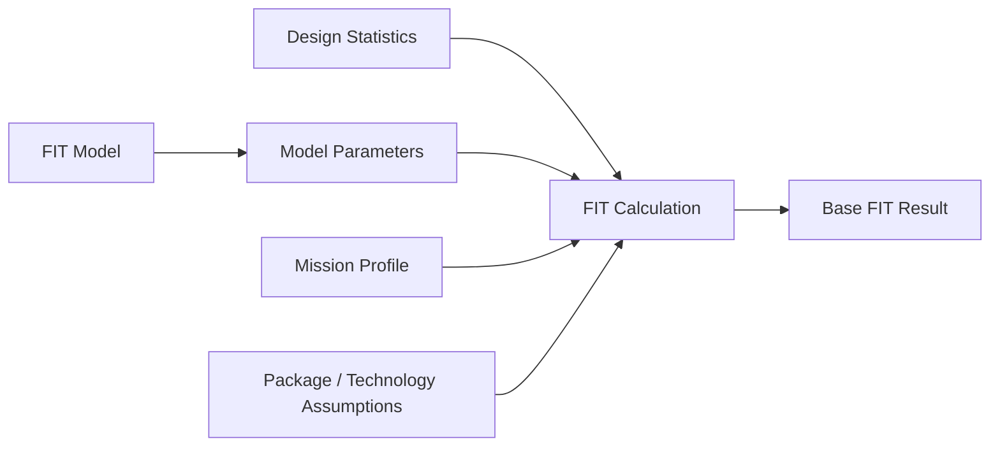
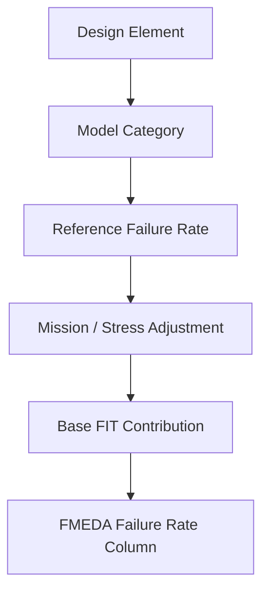
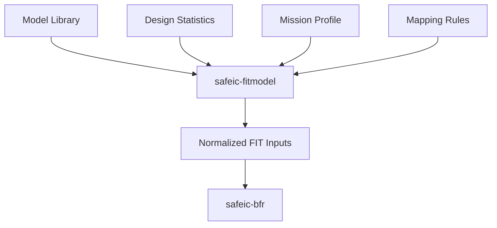
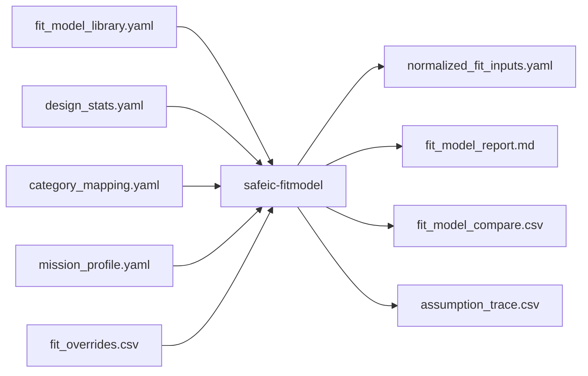
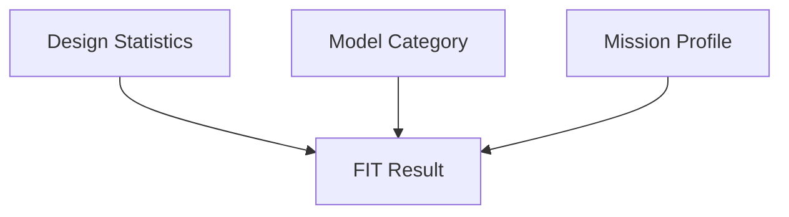
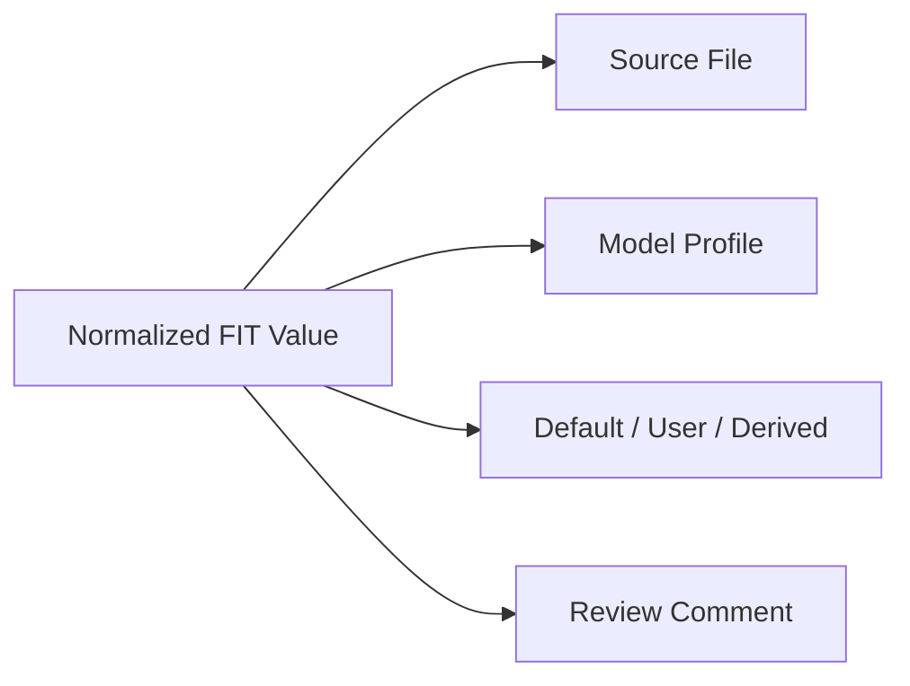
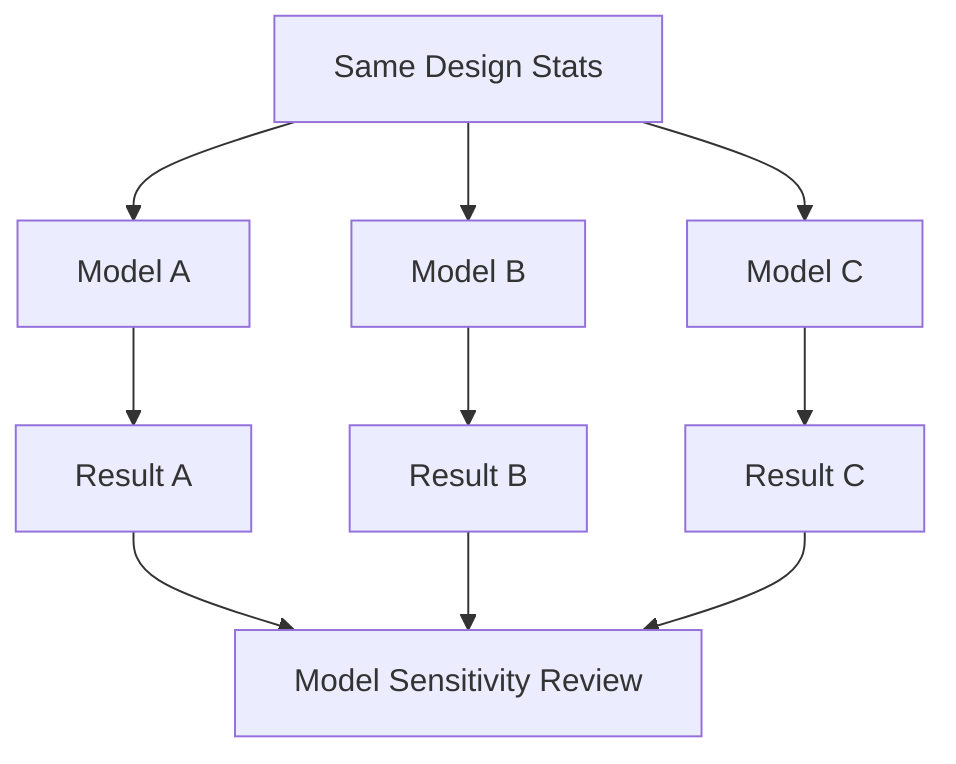
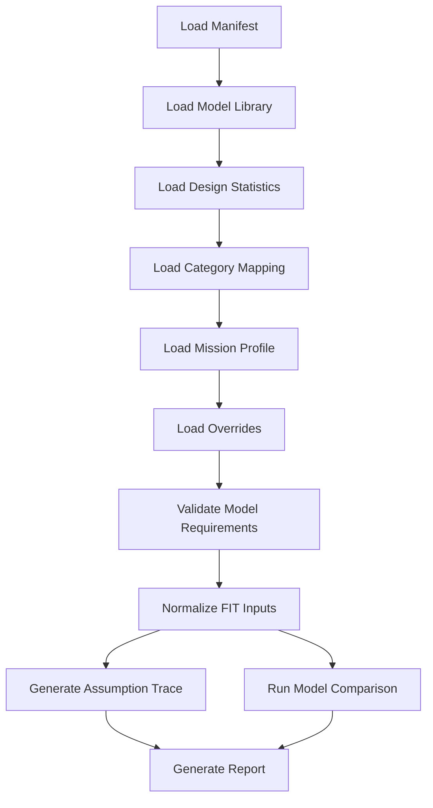
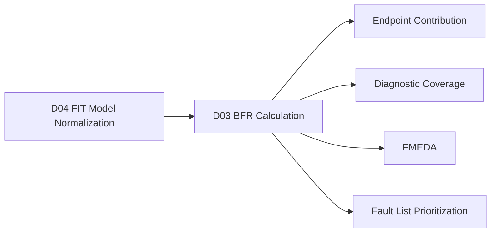

# [Automotive Safe-IC Practice 04] IEC 62380 and SN 29500: How FIT Models Become Engineering Inputs

**Author**: Darren H. Chen  
**Direction**: Automotive Chip Functional Safety Analysis and Fault Injection Practice  
**Demo**: D04_fit_standard_models  
**Tags**: Automotive Chip, Functional Safety, FIT, IEC 62380, SN 29500, Mission Profile, Reliability Prediction, Base FIT Rate, FMEDA, Safety Metrics

---

## 1. Why This Article Matters

In the previous article, we introduced the Base FIT Rate, or BFR.

BFR answers:

```text
How much random hardware failure exposure exists before protection is considered?
```

However, a new question immediately appears:

> Where does the FIT number come from?

A useful BFR workflow cannot simply invent numbers. It needs a reliability model. In automotive electronics, public discussions often reference reliability prediction methods such as:

```text
IEC 62380
SN 29500
```

In a real project, the exact model, coefficients, component categories, operating assumptions, mission profile, and supplier-provided reliability data must be reviewed by reliability and functional safety experts.

The fourth demo in this repository is:

```text
D04_fit_standard_models
```

The generic tool introduced in this article is:

```text
safeic-fitmodel
```

The goal of `safeic-fitmodel` is not to reproduce any copyrighted standard in full. The goal is to build a clean engineering abstraction for FIT model inputs, so that BFR calculation becomes:

```text
explicit
reviewable
versioned
traceable
comparable
```

The central idea is:

> A FIT standard model should not be hidden inside a spreadsheet or script. It should be transformed into explicit engineering inputs that can be reviewed, versioned, and connected to design statistics and FMEDA.

---

## 2. FIT Model vs FIT Calculation

A **FIT model** defines how failure rate should be estimated.

A **FIT calculation** applies that model to a specific design under specific assumptions.

They are not the same.



**Figure 1. A FIT model provides the rules and parameters; a FIT calculation applies them to a specific design context.**

A FIT model may require:

```text
component category
technology type
reference failure rate
temperature profile
operating ratio
voltage or stress factor
package assumptions
environment assumptions
mission profile
```

A FIT calculation requires:

```text
which model is selected
which component categories exist in the design
how design statistics map to model categories
which mission profile is used
which assumptions are defaulted or user-provided
```

This separation is important because the same design can produce different BFR values under different model assumptions.

---

## 3. Why FIT Models Are Needed in Functional Safety

Functional safety metrics need failure-rate information.

For a simplified FMEDA row:

```text
part
sub-part
failure mode
base failure rate
safety mechanism
diagnostic coverage
residual failure rate
```

The base failure rate comes from a reliability prediction process.

Without a defined FIT model, the failure-rate column becomes arbitrary.



**Figure 2. FIT model abstraction connects design elements to FMEDA failure-rate inputs.**

A safety flow must therefore record:

```text
which model was used
which model version was used
which input categories were mapped
which mission profile was applied
which assumptions were reviewed
which values were defaulted
```

If those details are not explicit, the BFR number is difficult to review.

---

## 4. IEC 62380 and SN 29500 as Engineering References

In automotive electronics, reliability prediction often references model families such as:

```text
IEC 62380
SN 29500
```

For this practice repository, we should treat them as engineering references, not as copied formulas.

The demo should capture the workflow shape:

```text
model selection
component categorization
reference rate selection
mission profile input
temperature or operating condition adjustment
failure rate aggregation
reporting
```

The actual coefficients and detailed equations should come from authorized standards, supplier data, or reviewed internal reliability data in real projects.

This article therefore focuses on the abstraction:

```text
How do we represent a FIT model cleanly?
How do we map design statistics to model categories?
How do we expose assumptions?
How do we compare model results?
How do we generate reviewable artifacts?
```

---

## 5. The Model Abstraction Layer

The key design choice is to create a model abstraction layer.

Instead of hardcoding a formula into a script, we represent the selected model in structured files.



**Figure 3. `safeic-fitmodel` normalizes model-specific assumptions into a BFR-ready input package.**

This layer allows the workflow to support:

```text
simplified demo model
IEC-like model abstraction
SN-like model abstraction
supplier-provided FIT override
black-box IP FIT input
what-if comparison
```

The output of `safeic-fitmodel` should not be an opaque number. It should be a normalized input package that `safeic-bfr` can consume.

---

## 6. Why Not Put Everything into `safeic-bfr`?

It is tempting to put all model logic directly into the BFR calculator.

That would make the first version faster to implement, but it creates long-term problems.

A better separation is:

```text
safeic-fitmodel:
  normalize model assumptions and category mapping

safeic-bfr:
  calculate base FIT from normalized inputs and design statistics
```

This separation gives several benefits:

| Separation | Benefit |
|---|---|
| Model normalization separated from calculation | Easier to review assumptions |
| Multiple models supported | Easier comparison |
| Supplier FIT override supported | Better black-box handling |
| BFR engine stays simple | Easier testing |
| Reports become clearer | Easier audit and debugging |

The engineering principle is:

> Keep reliability model interpretation separate from base FIT arithmetic.

---

## 7. Input Domain of `safeic-fitmodel`

The demo tool consumes five categories of input:

```text
model library
design statistics
mapping rules
mission profile
override data
```



**Figure 4. D04 input and output artifacts for FIT model normalization.**

Suggested input directory:

```text
D04_fit_standard_models/
  inputs/
    fit_model_library.yaml
    design_stats.yaml
    category_mapping.yaml
    mission_profile.yaml
    fit_overrides.csv
```

Suggested output directory:

```text
D04_fit_standard_models/
  outputs/
    normalized_fit_inputs.yaml
    fit_model_report.md
    fit_model_compare.csv
    assumption_trace.csv
```

---

## 8. Model Library

A model library describes available model profiles.

For the demo, the library can include:

```text
simplified_demo
iec62380_like_demo
sn29500_like_demo
supplier_override
```

Important: the demo names `iec62380_like_demo` and `sn29500_like_demo` represent simplified educational abstractions. They should not claim to implement full official standards.

Example:

```yaml
models:
  simplified_demo:
    description: Simplified educational model for toy designs.
    type: demo
    supports:
      - logic
      - flip_flop
      - memory_bit
      - package

  iec62380_like_demo:
    description: Educational abstraction inspired by IEC-style reliability prediction workflows.
    type: standard_abstraction
    supports:
      - integrated_circuit
      - package
      - memory
      - discrete_component
    requires:
      - mission_profile
      - temperature_profile
      - operating_ratio

  sn29500_like_demo:
    description: Educational abstraction inspired by SN-style reference-rate workflows.
    type: standard_abstraction
    supports:
      - integrated_circuit
      - semiconductor
      - passive_component
      - connector
    requires:
      - reference_condition
      - conversion_factor
      - operating_condition

  supplier_override:
    description: Direct supplier-provided FIT data.
    type: override
    supports:
      - black_box_ip
      - analog_block
      - memory_macro
```

The model library should answer:

```text
Which models exist?
What design categories do they support?
What assumptions are required?
What outputs can they produce?
Which model is allowed for which block type?
```

---

## 9. Category Mapping

Design statistics rarely match reliability model categories directly.

For example, the design may say:

```text
logic_gate
flip_flop
ram_bit
black_box
```

But the reliability model may require:

```text
integrated_circuit_logic
sequential_element
memory_array
supplier_ip
package
```

The category mapping file bridges this gap.

Example:

```yaml
category_mapping:
  logic_gate:
    model_category: integrated_circuit_logic
    count_field: logic_gates
    default_model: simplified_demo

  flip_flop:
    model_category: sequential_element
    count_field: flip_flops
    default_model: simplified_demo

  ram_bit:
    model_category: memory_array
    count_field: ram_bits
    default_model: simplified_demo

  black_box:
    model_category: supplier_ip
    count_field: black_boxes
    default_model: supplier_override
```

This mapping is important because a mismatch here can completely change the FIT result.

The input checker should report:

```text
unmapped design type
unsupported model category
missing count field
missing supplier override for black-box category
```

---

## 10. Mission Profile

The mission profile describes the product operating context.

A simplified mission profile:

```yaml
mission_profile:
  name: demo_automotive_profile
  description: Simplified automotive-like profile for educational use.

  operating_ratio: 0.65
  dormant_ratio: 0.35

  temperature_profile:
    - temp_c: 40
      ratio: 0.50
    - temp_c: 85
      ratio: 0.40
    - temp_c: 125
      ratio: 0.10

  environment:
    location: passenger_compartment_demo
    vibration: low
    humidity: normal
```

A mission profile should be explicit even in a toy demo.

Why?

Because FIT values are not purely structural. They depend on operating assumptions.



**Figure 5. FIT depends on design statistics, model category, and mission profile.**

If the mission profile is hidden, the FIT result is not reviewable.

---

## 11. Reference Rates and Conversion Factors

A reliability model often contains reference failure rates and conversion factors.

A simplified abstraction:

```text
reference_failure_rate
× operating_condition_factor
× temperature_factor
× mission_profile_factor
= adjusted_failure_rate
```

For demo purposes, we can express this as:

```yaml
reference_rates:
  integrated_circuit_logic:
    reference_fit_per_unit: 2.0e-4
    unit: gate
  sequential_element:
    reference_fit_per_unit: 3.0e-3
    unit: flip_flop
  memory_array:
    reference_fit_per_unit: 1.0e-6
    unit: bit

conversion_factors:
  default_temperature_factor: 1.0
  default_operating_factor: 1.0
  default_mission_factor: 1.0
```

A more advanced demo can allow:

```yaml
conversion_factors:
  temperature:
    "40": 0.7
    "85": 1.0
    "125": 2.5
  operating:
    operating: 1.0
    dormant: 0.2
```

Then the mission-weighted factor can be computed.

For D04, the goal is not formula accuracy. The goal is to make the idea visible:

```text
reference condition
actual condition
conversion factor
adjusted rate
```

---

## 12. Normalized FIT Input

The main output of `safeic-fitmodel` is:

```text
normalized_fit_inputs.yaml
```

This file should be simple enough for `safeic-bfr` to consume.

Example:

```yaml
normalized_fit_inputs:
  model_profile: sn29500_like_demo
  mission_profile: demo_automotive_profile
  generated_by: safeic-fitmodel
  schema_version: 0.1

  rates:
    permanent:
      logic_gate_fit: 2.0e-4
      flip_flop_fit: 3.0e-3
      ram_bit_fit: 1.0e-6
      package_fit: 1.0e-2

    transient:
      logic_gate_fit: 1.0e-6
      flip_flop_fit: 1.0e-3
      ram_bit_fit: 1.0e-6

  assumptions:
    temperature_factor: 1.0
    mission_factor: 1.0
    package_model: demo_package
    blackbox_policy: require_override
```

This normalized format is deliberately model-independent.

It allows `safeic-bfr` to stay stable even if the model library evolves.

---

## 13. Assumption Traceability

Every normalized value should be traceable.

A useful output is:

```text
assumption_trace.csv
```

Example:

```csv
field,value,source,model,comment
rates.permanent.logic_gate_fit,2.0e-4,fit_model_library.yaml,simplified_demo,demo educational value
rates.permanent.flip_flop_fit,3.0e-3,fit_model_library.yaml,simplified_demo,demo educational value
mission_profile.name,demo_automotive_profile,mission_profile.yaml,all,user supplied
assumptions.temperature_factor,1.0,default,simplified_demo,no temperature scaling in stage 1
assumptions.blackbox_policy,require_override,category_mapping.yaml,all,black boxes require explicit FIT
```

Why is this important?

Because a safety result must answer:

```text
Where did this number come from?
Was it defaulted?
Was it user-supplied?
Was it derived?
Was it overridden?
Was it reviewed?
```



**Figure 6. Each normalized FIT value should have traceability to source, model, and assumption status.**

This is one of the most important differences between a safety engineering flow and an ad-hoc spreadsheet.

---

## 14. Comparing Model Profiles

D04 should support model comparison.

For the same design statistics and mission profile, we may run:

```text
simplified_demo
iec62380_like_demo
sn29500_like_demo
supplier_override
```

The output:

```text
fit_model_compare.csv
```

Example:

```csv
model,total_fit,logic_fit,ff_fit,memory_fit,package_fit,blackbox_fit,notes
simplified_demo,0.09812,0.02412,0.06400,0.00000,0.01000,0.00000,baseline demo
iec62380_like_demo,0.11240,0.03000,0.07000,0.00000,0.01240,0.00000,educational abstraction
sn29500_like_demo,0.08790,0.02000,0.05790,0.00000,0.01000,0.00000,educational abstraction
```

The comparison should not be presented as which standard is “better.” Different models may have different assumptions, categories, and intended use.

The useful question is:

```text
How sensitive is our BFR result to reliability model assumptions?
```



**Figure 7. Model comparison helps review sensitivity to reliability assumptions.**

---

## 15. Supplier FIT Override

Not all design blocks can be analyzed from internal structure.

Examples:

```text
third-party IP
analog block
memory macro
hard macro
PHY
PLL
sensor interface
black-box safety island
```

For these blocks, FIT values may come from supplier documentation, safety manual, or reviewed assumptions.

D04 should support an override file:

```csv
instance,block_type,fit_permanent,fit_transient,source,review_status,comment
top.u_pll,analog_block,0.12,0.00,supplier_doc,draft,placeholder until official data
top.u_sram,memory_macro,0.05,0.20,supplier_doc,reviewed,macro-level FIT
top.u_crypto,black_box_ip,0.08,0.03,internal_assumption,draft,needs supplier confirmation
```

Override policy should be explicit:

```yaml
blackbox_policy:
  require_override: true
  allow_zero_fit_without_review: false
  require_review_status: true
```

A safe workflow should never silently ignore black boxes.

If a block is not analyzable and no override exists, the tool should produce an error or at least a strong warning.

---

## 16. Package FIT and Non-Logic Contributions

A chip-level BFR may include contributions beyond RTL logic.

Examples:

```text
package contribution
electrical connection contribution
I/O contribution
analog block contribution
hard macro contribution
memory macro contribution
```

In early RTL demos, it is easy to focus only on logic and flip-flops.

That is acceptable for a toy flow, but the input schema should still allow non-logic contributions.

Example:

```yaml
non_logic_contributions:
  package:
    enabled: true
    fit_per_device: 0.01
    source: demo_assumption

  io_ring:
    enabled: false
    reason: not modeled in D04

  analog_blocks:
    enabled: true
    source: fit_overrides.csv
```

The report should clearly state:

```text
included
excluded
not modeled
requires override
```

This avoids accidental under-reporting.

---

## 17. Output Report Structure

The human-readable report should include:

```text
1. Selected model profile
2. Design statistics summary
3. Category mapping summary
4. Mission profile summary
5. Reference rates and conversion assumptions
6. Override summary
7. Normalized FIT input summary
8. Model comparison table
9. Warnings and review items
```

Example section:

```md
## Selected Model

Model profile: sn29500_like_demo  
Purpose: Educational abstraction for reference-rate-style FIT normalization.

## Mission Profile

Name: demo_automotive_profile  
Operating ratio: 0.65  
Dormant ratio: 0.35

## Warnings

- Black-box count is zero.
- Temperature scaling is disabled in this stage.
- This model profile is an educational abstraction and not a full standard implementation.
```

The report should make it impossible to confuse a demo abstraction with an official standard implementation.

---

## 18. D04 Directory Structure

Suggested directory:

```text
D04_fit_standard_models/
  README.md
  run_demo.sh
  run_demo.csh
  manifest.yaml

  inputs/
    fit_model_library.yaml
    design_stats.yaml
    category_mapping.yaml
    mission_profile.yaml
    fit_overrides.csv

  outputs/
    normalized_fit_inputs.yaml
    fit_model_report.md
    fit_model_compare.csv
    assumption_trace.csv

  schemas/
    fit_model_library_schema.yaml
    category_mapping_schema.yaml
    mission_profile_schema.yaml
    fit_overrides_schema.yaml
```

This structure keeps model definition, design statistics, mapping, mission profile, and overrides separate.

That separation matters because each of these files is reviewed by different stakeholders.

---

## 19. D04 Manifest

Example `manifest.yaml`:

```yaml
project:
  name: automotive_safeic_practice
  demo: D04_fit_standard_models
  top_module: toy_counter

fit_model:
  selected_model: sn29500_like_demo
  model_library: inputs/fit_model_library.yaml
  category_mapping: inputs/category_mapping.yaml
  mission_profile: inputs/mission_profile.yaml
  design_stats: inputs/design_stats.yaml
  overrides: inputs/fit_overrides.csv

comparison:
  enabled: true
  models:
    - simplified_demo
    - iec62380_like_demo
    - sn29500_like_demo

outputs:
  normalized_fit_inputs: outputs/normalized_fit_inputs.yaml
  model_report: outputs/fit_model_report.md
  model_compare: outputs/fit_model_compare.csv
  assumption_trace: outputs/assumption_trace.csv
```

The manifest should make the selected model explicit.

Do not hide the model selection in a command-line option that disappears from the report.

---

## 20. D04 Execution Flow



**Figure 8. D04 execution flow: normalize model assumptions before BFR calculation.**

Example bash script:

```bash
#!/usr/bin/env bash
set -euo pipefail

safeic-fitmodel \
  --manifest manifest.yaml \
  --output-dir outputs
```

Example csh script:

```csh
#!/bin/csh -f

set DEMO = D04_fit_standard_models
echo "Running $DEMO"

safeic-fitmodel \
  --manifest manifest.yaml \
  --output-dir outputs
```

Expected outputs:

```text
outputs/normalized_fit_inputs.yaml
outputs/fit_model_report.md
outputs/fit_model_compare.csv
outputs/assumption_trace.csv
```

---

## 21. Validation Rules

`safeic-fitmodel` should validate both file-level and engineering-level consistency.

### 21.1 File and Schema Checks

```text
model library exists
selected model exists
design stats exist
category mapping exists
mission profile exists
override file exists if required
YAML files parse successfully
CSV override has required columns
```

### 21.2 Model Requirement Checks

```text
selected model supports all mapped categories
required mission profile fields exist
temperature profile exists if model requires it
operating ratio exists if model requires it
reference rates exist for all required categories
conversion factors exist or are explicitly disabled
```

### 21.3 Cross-Reference Checks

```text
design type in design_stats has mapping
mapping refers to known model category
model category has reference rate
black-box category has override
override instance exists or is explicitly external
review status is present for supplier overrides
```

### 21.4 Assumption Safety Checks

```text
zero FIT values require explicit justification
black-box FIT cannot be silently zero
package FIT cannot be silently omitted
demo model must be labeled as demo
standard-like abstraction must not claim official completeness
```

Example report messages:

```text
[PASS] selected model sn29500_like_demo exists
[PASS] design type logic_gate mapped to integrated_circuit_logic
[WARN] temperature scaling disabled for selected model profile
[WARN] model is educational abstraction, not official standard implementation
[ERROR] black_box count > 0 but fit_overrides.csv has no matching entry
```

---

## 22. Engineering Methodology

D04 introduces an important methodology:

```text
Separate model selection from BFR calculation.
Separate design statistics from reliability assumptions.
Separate standard-like model abstraction from supplier overrides.
Separate normalized machine inputs from human-readable reports.
```

This allows a workflow to be:

```text
reviewable
auditable
debuggable
model-comparable
portable
extensible
```

A practical review checklist:

```text
Which model profile was selected?
Is it a demo abstraction or reviewed project model?
Which mission profile was used?
Which design categories were mapped?
Which reference rates were applied?
Which conversion factors were applied?
Which values were overridden?
Which assumptions are still draft?
Which black boxes require supplier confirmation?
Can the normalized FIT inputs feed BFR calculation?
```

The goal is not to make FIT modeling look simple. The goal is to make assumptions explicit.

---

## 23. Common Mistakes

### 23.1 Treating Standard Names as Magic Words

Writing:

```text
model = IEC62380
```

or

```text
model = SN29500
```

is not enough.

A model name must be accompanied by:

```text
model version
component category mapping
mission profile
reference conditions
conversion assumptions
data source
review status
```

### 23.2 Hardcoding FIT Coefficients in Scripts

Hardcoded constants are difficult to review.

Bad:

```python
ff_fit = ff_count * 0.003
```

Better:

```yaml
flip_flop_fit: 3.0e-3
source: fit_model_library.yaml
review_status: draft
```

The calculation should be separated from the data.

### 23.3 Ignoring Model Sensitivity

If two reasonable model profiles produce significantly different BFR values, this should be reviewed.

The goal is not to hide the difference. The goal is to understand it.

### 23.4 Ignoring Supplier FIT Data

Hard macros and black boxes may dominate safety analysis.

If supplier data is unavailable, the gap should be documented as a review item, not silently replaced with zero.

### 23.5 Confusing Demo Abstraction with Official Standard Implementation

This repository should clearly distinguish:

```text
educational abstraction
project-specific reviewed model
official standard implementation
supplier-provided data
```

The D04 demo uses educational abstractions only.

---

## 24. How D04 Connects to the Closed Loop

D04 feeds D03 and later safety stages.



**Figure 9. D04 normalizes model assumptions so D03 and later stages can use reviewed FIT inputs.**

D04 answers:

```text
Which FIT model profile are we using?
How are design categories mapped to model categories?
Which mission profile is applied?
Which supplier overrides are used?
Which assumptions are defaulted or reviewed?
```

D03 then answers:

```text
What is the resulting Base FIT Rate?
```

The two demos should remain separate.

---

## 25. Recommended Implementation Stages

D04 can be implemented in stages.

### Stage 1: Demo Model Normalization

Support only:

```text
simplified_demo
basic category mapping
basic mission profile
no real temperature scaling
```

### Stage 2: Standard-Like Profiles

Add educational abstraction profiles:

```text
iec62380_like_demo
sn29500_like_demo
```

These should still be labeled clearly as demo abstractions.

### Stage 3: Override Handling

Add:

```text
fit_overrides.csv
black-box policy
review status
supplier source tracking
```

### Stage 4: Model Comparison

Add:

```text
fit_model_compare.csv
model sensitivity report
```

### Stage 5: Integration with BFR

Generate:

```text
normalized_fit_inputs.yaml
```

and feed it into:

```text
safeic-bfr
```

This staged approach makes the demo implementable without overclaiming.

---

## 26. Summary

BFR needs reliable input assumptions.

Reliability prediction models such as IEC 62380 and SN 29500 are often used as references in automotive electronics, but an engineering flow must not hide model assumptions inside scripts or spreadsheets.

The D04 demo:

```text
D04_fit_standard_models
```

introduces a generic tool:

```text
safeic-fitmodel
```

Its purpose is to normalize FIT model assumptions into reviewable artifacts:

```text
normalized_fit_inputs.yaml
fit_model_report.md
fit_model_compare.csv
assumption_trace.csv
```

The central lesson is:

> A FIT model is not just a formula. It is a set of categorized assumptions, mission profiles, reference conditions, conversion choices, supplier overrides, and review decisions.

Once those assumptions are explicit, BFR calculation becomes traceable and reusable.

---

## 27. D04 Demo Checklist

For `D04_fit_standard_models`, the expected deliverables are:

```text
[ ] README.md
[ ] run_demo.sh
[ ] run_demo.csh
[ ] manifest.yaml

[ ] inputs/fit_model_library.yaml
[ ] inputs/design_stats.yaml
[ ] inputs/category_mapping.yaml
[ ] inputs/mission_profile.yaml
[ ] inputs/fit_overrides.csv

[ ] outputs/normalized_fit_inputs.yaml
[ ] outputs/fit_model_report.md
[ ] outputs/fit_model_compare.csv
[ ] outputs/assumption_trace.csv

[ ] schemas/fit_model_library_schema.yaml
[ ] schemas/category_mapping_schema.yaml
[ ] schemas/mission_profile_schema.yaml
[ ] schemas/fit_overrides_schema.yaml
```

A successful D04 run should answer:

```text
Which model profile was selected?
Is the model a demo abstraction or reviewed project model?
How are design statistics mapped to reliability categories?
Which mission profile is used?
Which values are defaulted, derived, or overridden?
Are black boxes handled explicitly?
Are package and non-logic contributions included or intentionally excluded?
Can the normalized output feed BFR calculation?
```
