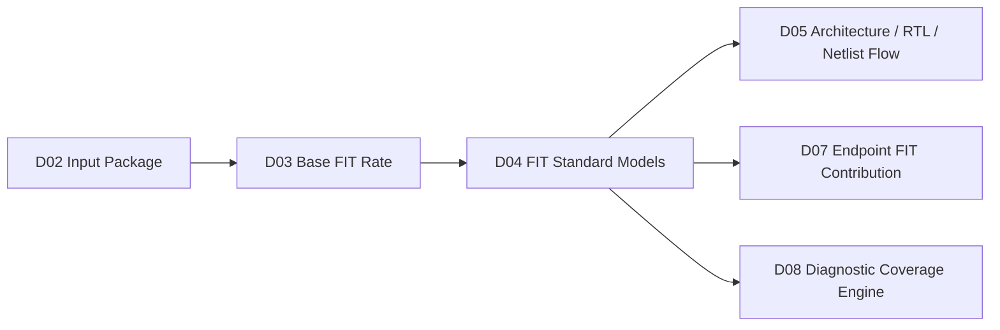
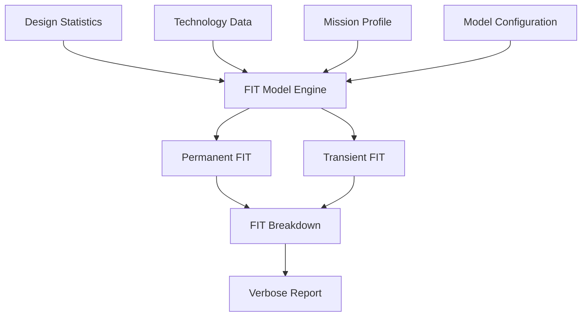
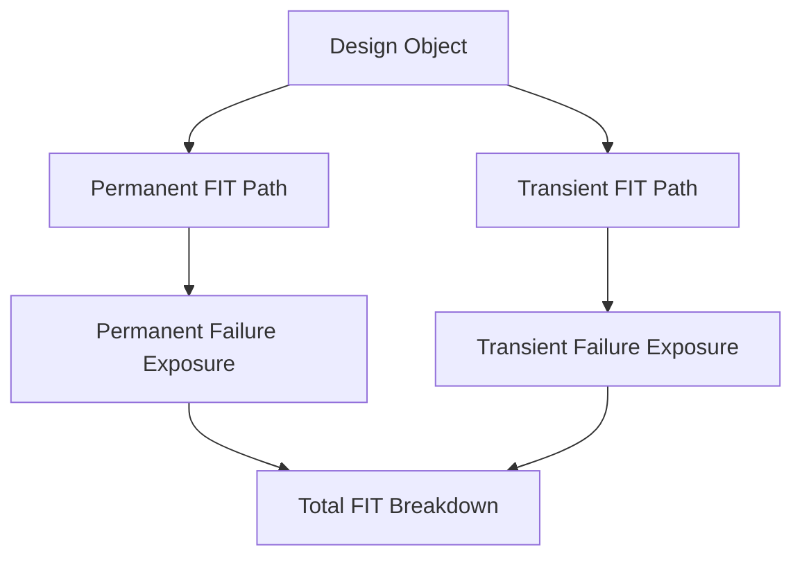
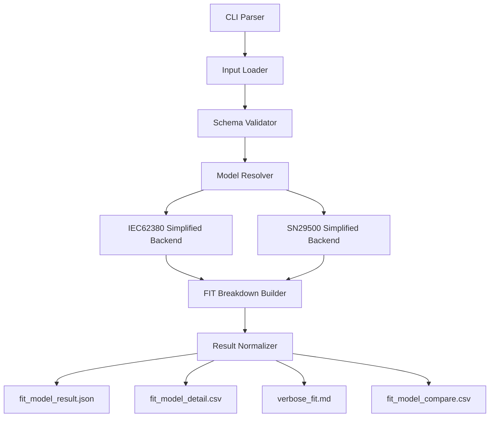

# [Automotive Safe-IC Practice 04] IEC 62380 and SN 29500: Engineering FIT Models for Automotive Chip Safety Analysis

**Author:** Darren H. Chen  
**Direction:** Automotive chip functional safety analysis and fault injection practice  
**Demo:** `D04_fit_standard_models`  
**Tags:** `Automotive Chip`, `Functional Safety`, `SafeIC`, `FIT Model`, `IEC 62380`, `SN 29500`, `Mission Profile`, `Reliability Modeling`

---

## Demo scope

`D04_fit_standard_models` focuses on one core problem:

```text
How do we turn reliability standards and project assumptions into a reproducible FIT model engine?
```

The corresponding generic tool module is:

```text
safeic-fitmodel
```

This demo does not attempt to implement every detail of a certification-grade reliability model in the first step.

Instead, it builds an engineering framework that is:

```text
configurable
traceable
replaceable
comparable
reviewable
```

The goal is to make FIT modeling a structured tool function rather than a hidden formula embedded in a script.

A practical FIT model engine should accept design-derived statistics and user-supplied reliability assumptions, then produce not only a total FIT number but also a detailed explanation of how the number was produced.

The central idea is:

```text
reliability input data
+ design statistics
+ model selection
+ permanent / transient FIT calculation
+ verbose reporting
= explainable FIT model engine
```

---

## 1. Why FIT modeling needs engineering discipline

In functional safety analysis, FIT is often treated as a metric.

But in real chip projects, FIT is more than a number.

It is the result of a chain of assumptions:

```text
technology family
+ design object type
+ transistor count or memory bit count
+ temperature condition
+ mission profile
+ manufacturing year
+ package assumption
+ permanent failure model
+ transient failure model
+ safety-related scope
```

If these assumptions are scattered across scripts, spreadsheets, emails, or hard-coded constants, the result becomes difficult to audit.

A total FIT value may appear precise, but the engineering argument behind it is weak.

For example:

```text
Total FIT = 0.128
```

This number alone does not tell us:

```text
Which model was used?
Which technology data was used?
Was memory included?
Were transient faults included?
Was the mission profile passenger compartment or engine compartment?
Was the design counted at RTL, netlist, or architecture level?
Which block contributed most?
```

For automotive chip safety work, that is not enough.

A useful FIT model must be explainable.

It should make every important assumption visible.

---

## 2. FIT model is not the same as FIT report

A FIT report is an output.

A FIT model is the computation system that produces the output.

This distinction matters.

```text
FIT model
  = input assumptions
  + reliability equations
  + design statistics
  + classification rules
  + aggregation rules

FIT report
  = result generated by the model
```

A weak implementation may only generate a report.

A stronger implementation preserves the full reasoning path:

```text
input files
→ normalized configuration
→ resolved model
→ intermediate variables
→ component-level FIT
→ block-level FIT
→ total FIT
→ verbose report
```

This is the engineering direction of `D04_fit_standard_models`.

---

## 3. Where D04 sits in the Safe-IC practice flow

The previous article, `D03_base_fit_rate`, introduced Base FIT Rate as the initial exposure estimate before safety mechanism credit is applied.

D04 goes one layer deeper.

It asks:

```text
What model produced that Base FIT Rate?
```

The flow relationship is:



`D03` defines why BFR matters.

`D04` defines how the FIT model should be engineered.

`D05` then discusses how the same model should be used across architectural, RTL, and netlist stages.

---

## 4. IEC 62380 and SN 29500 as engineering strategies

In this demo, IEC 62380 and SN 29500 are treated as two different reliability modeling strategies.

The purpose is not to reproduce the full standard text.

The purpose is to understand how a tool architecture should support different reliability models.

| Aspect | IEC 62380-oriented modeling | SN 29500-oriented modeling |
|---|---|---|
| Main engineering view | Mission profile, temperature, technology, package, operating conditions | Reference-condition failure rate converted to operating-condition failure rate |
| Input style | More project-environment driven | More reference-condition driven |
| Typical concern | Mission phase, temperature factor, package influence, technology assumptions | Voltage / temperature / drift conversion factors depending on component type |
| Implementation challenge | Many project-specific parameters must be organized | Model equations must be cleanly mapped by device class |
| Demo implementation | `simplified_iec62380` | `simplified_sn29500` |

The first version of this demo uses simplified models.

That is intentional.

The most important first step is not formula completeness.

The most important first step is model architecture.

A good architecture allows a simplified model to be replaced later by a more accurate one without changing the entire flow.

---

## 5. The four-layer input model

A practical FIT engine should avoid mixing all input assumptions into one script.

`safeic-fitmodel` uses four conceptual input layers.



The four layers are:

```text
1. design statistics
2. technology data
3. mission profile
4. model configuration
```

Each layer has a different responsibility.

---

## 6. Layer 1: design statistics

Design statistics describe what exists in the design.

They should not contain FIT equations.

They should not contain mission assumptions.

They should only describe design size and design object categories.

Example:

```json
{
  "top": "toy_soc",
  "stage": "rtl",
  "objects": {
    "stdcell_gate_count": 1200,
    "sequential_count": 96,
    "memory_bits": 2048,
    "blackbox_count": 1,
    "analog_block_count": 0
  }
}
```

This file answers:

```text
What is being analyzed?
How large is it?
Which object types exist?
```

It does not answer:

```text
How reliable is it?
Which mission profile applies?
Which safety mechanism covers it?
```

Keeping this boundary clean is important.

Later, `D05_arch_rtl_netlist_flow` can generate different `design_stats.json` files from architecture, RTL, or netlist stages while reusing the same FIT model engine.

---

## 7. Layer 2: technology data

Technology data describes reliability parameters associated with object types.

A simplified configuration may look like this:

```yaml
technology:
  default_process: MOS.ASIC.STDCELL

lambda:
  MOS.ASIC.STDCELL:
    permanent_per_gate: 1.0e-6
    transient_per_gate: 1.0e-6

  MOS.STD.SRAM:
    permanent_per_bit: 1.7e-7
    transient_per_bit: 1.0e-6

  MOS.STD.ROM:
    permanent_per_bit: 1.7e-7
    transient_per_bit: 1.0e-6
```

In a more advanced implementation, this layer may include:

```text
lambda1
lambda2
technology type
library type
cell class
memory type
process mapping
soft error rate override
```

The important engineering rule is:

```text
Technology data should be data, not code.
```

If technology assumptions are embedded in source code, later comparison becomes painful.

If they are externalized into configuration files, the same tool can run different technology assumptions and produce comparable reports.

---

## 8. Layer 3: mission profile

Mission profile describes how the chip is used.

A simplified file may look like this:

```yaml
mission_profile:
  name: passenger_compartment
  temperature_ja: 65
  active_ratio: 0.80
  dormant_ratio: 0.20
  lifetime_hours: 120000
```

Different automotive use cases may have different assumptions:

```text
passenger compartment
engine compartment
body control
motor control
ADAS controller
battery management
```

Even when the RTL is identical, the FIT result can change if the mission profile changes.

That is why mission profile must not be hidden.

The report should always state the mission profile used in the calculation.

---

## 9. Layer 4: model configuration

Model configuration selects which FIT model strategy to run.

Example for a simplified IEC-oriented run:

```yaml
fit_model:
  standard: simplified_iec62380
  include_permanent: true
  include_transient: true
  include_package: false
  verbose: true
```

Example for a simplified SN-oriented run:

```yaml
fit_model:
  standard: simplified_sn29500
  include_permanent: true
  include_transient: true
  verbose: true
```

This layer answers:

```text
Which model should be used?
Which failure categories should be included?
Should detailed computation traces be emitted?
```

The model configuration should be explicit because safety analysis results are not meaningful without knowing which model generated them.

---

## 10. Permanent FIT and transient FIT should be separated

A practical Safe-IC flow should distinguish permanent and transient FIT.

Permanent failures are associated with lasting hardware defects or degradation effects.

Transient failures are associated with temporary events such as soft errors.

The two should not be mixed too early.



The report should show at least:

```text
permanent FIT
transient FIT
total FIT
```

A better report should also show:

```text
permanent FIT by object type
transient FIT by object type
permanent FIT by block
transient FIT by block
```

This separation becomes important later when diagnostic coverage is computed separately for permanent and transient faults.

---

## 11. A simplified IEC-oriented model

For the first demo, `simplified_iec62380` can be implemented as a structured approximation.

A conceptual model may be:

```text
permanent_fit(object)
= object_count
× base_lambda(object_type)
× technology_factor
× temperature_factor
× mission_factor
```

Transient FIT may be computed separately:

```text
transient_fit(object)
= object_count
× transient_lambda(object_type)
× activity_or_exposure_factor
```

This is not a full standard implementation.

It is an engineering placeholder with the correct interface shape.

The benefit is that every input factor is visible.

For example:

```text
stdcell_gate_count = 1200
base_lambda = 1.0e-6
temperature_factor = 1.2
mission_factor = 0.8
permanent_fit = 0.001152
```

The key is not the exact numeric value in the first version.

The key is that the computation path is inspectable.

---

## 12. A simplified SN-oriented model

For the simplified SN-oriented model, the conceptual view is different.

The computation starts from a reference failure rate and converts it into an operating-condition failure rate.

A conceptual model may be:

```text
operating_fit
= reference_fit
× voltage_factor
× temperature_factor
× drift_factor
```

Not all object types need all factors.

For example:

```text
digital CMOS object: reference_fit × temperature_factor
analog object: reference_fit × voltage_factor × temperature_factor × drift_factor
```

A simplified configuration may look like this:

```yaml
sn29500_factors:
  MOS.ASIC.STDCELL:
    reference_fit_per_gate: 0.9e-6
    temperature_factor: 1.1

  ANALOG.LINEAR:
    reference_fit_per_block: 0.02
    voltage_factor: 1.05
    temperature_factor: 1.2
    drift_factor: 1.1
```

Again, the first goal is not full coverage of all component classes.

The first goal is a replaceable model interface.

---

## 13. Tool architecture of `safeic-fitmodel`

`safeic-fitmodel` should be designed as a small but well-structured tool module.

A suggested architecture is:



The internal components are:

| Component | Responsibility |
|---|---|
| CLI Parser | Receives input paths and selected model |
| Input Loader | Loads JSON/YAML/CSV inputs |
| Schema Validator | Checks required fields and units |
| Model Resolver | Selects the correct model backend |
| Model Backend | Computes permanent and transient FIT |
| Breakdown Builder | Groups results by object type and block |
| Result Normalizer | Produces stable machine-readable outputs |
| Verbose Reporter | Produces human-readable explanation |

The model backend should not write files directly.

It should return structured data.

File generation should happen in a reporting layer.

This makes the computation easier to test.

---

## 14. Suggested command-line interface

A practical demo command may look like this:

```bash
safeic-fitmodel \
  --design-stats inputs/design_stats.json \
  --technology inputs/technology.yaml \
  --mission-profile inputs/mission_profile.yaml \
  --model-config inputs/model_config_iec.yaml \
  --output-dir outputs/iec62380
```

For SN-style comparison:

```bash
safeic-fitmodel \
  --design-stats inputs/design_stats.json \
  --technology inputs/technology.yaml \
  --mission-profile inputs/mission_profile.yaml \
  --model-config inputs/model_config_sn.yaml \
  --output-dir outputs/sn29500
```

The tool should support a comparison mode:

```bash
safeic-fitmodel compare \
  --result-a outputs/iec62380/fit_model_result.json \
  --result-b outputs/sn29500/fit_model_result.json \
  --output outputs/fit_model_compare.csv
```

This makes the demo useful not only as a calculator, but also as an engineering comparison framework.

---

## 15. Output file design

`D04_fit_standard_models` should generate at least four outputs.

```text
outputs/
  fit_model_result.json
  fit_model_detail.csv
  verbose_fit.md
  fit_model_compare.csv
```

### 15.1 `fit_model_result.json`

A machine-readable summary:

```json
{
  "top": "toy_soc",
  "stage": "rtl",
  "model": "simplified_iec62380",
  "mission_profile": "passenger_compartment",
  "permanent_fit": 0.0012,
  "transient_fit": 0.0980,
  "total_fit": 0.0992
}
```

### 15.2 `fit_model_detail.csv`

A detailed table:

```csv
object_type,count,lambda_type,base_lambda,factor,fit
stdcell_gate,1200,permanent,1.0e-6,1.0,0.0012
flipflop,96,transient,1.0e-3,1.0,0.0960
sram_bit,2048,transient,1.0e-6,1.0,0.002048
```

### 15.3 `verbose_fit.md`

A human-readable explanation:

```text
FIT Model: simplified_iec62380
Top: toy_soc
Stage: rtl
Mission Profile: passenger_compartment
TemperatureJA: 65

Breakdown:
- STD cell permanent FIT: 0.0012
- FF transient FIT: 0.0960
- SRAM transient FIT: 0.002048
- Total permanent FIT: 0.0012
- Total transient FIT: 0.098048
```

### 15.4 `fit_model_compare.csv`

A comparison output:

```csv
model,total_permanent_fit,total_transient_fit,total_fit
simplified_iec62380,0.0012,0.0980,0.0992
simplified_sn29500,0.0010,0.0950,0.0960
```

---

## 16. Why verbose reporting is mandatory

A FIT model engine should never behave like a black box.

For engineering use, the total number is less useful than the explanation behind it.

A verbose report should answer:

```text
Which input files were used?
Which model was selected?
Which design stage was analyzed?
Which technology entries were resolved?
Which mission profile was applied?
Which object type dominated permanent FIT?
Which object type dominated transient FIT?
Which assumptions were defaulted?
```

This is especially important when results are compared across:

```text
different design stages
different mission profiles
different technology assumptions
different tool versions
different commercial tool flows
```

The first rule of engineering FIT analysis is:

```text
If the result cannot be explained, it cannot be trusted.
```

---

## 17. Input validation is part of the FIT model

A FIT model engine should not silently accept incomplete assumptions.

For example, the tool should detect:

```text
missing mission profile
unknown process name
missing lambda entry
negative object count
unsupported model name
unit mismatch
missing transient assumption
```

A good validation report may look like this:

```text
[PASS] design_stats.json exists
[PASS] model_config.yaml exists
[PASS] mission_profile.temperature_ja found
[PASS] process MOS.ASIC.STDCELL found in technology.yaml
[WARN] package model disabled
[WARN] analog_block_count is 0
[PASS] transient FIT enabled
```

This connects D04 back to D02.

`D02_input_package` checks whether the input package is complete.

`D04_fit_standard_models` checks whether the FIT model assumptions are internally usable.

---

## 18. Model independence from design parsing

A common mistake is to mix design parsing with FIT modeling.

For example:

```text
parse RTL
count registers
assign lambda
compute FIT
write report
```

all inside one script.

This is fragile.

A better architecture is:

```text
safeic-designstats
  produces design_stats.json

safeic-fitmodel
  consumes design_stats.json
  produces FIT reports
```

Even if `safeic-designstats` is not yet fully implemented, `safeic-fitmodel` can still be tested with manually prepared design statistics.

This gives us a useful development strategy:

```text
1. manually create design_stats.json
2. implement FIT model engine
3. validate output format
4. later connect to automatic RTL/netlist statistics
```

This avoids blocking FIT model development on parser completeness.

---

## 19. FIT model and diagnostic coverage must stay separate

FIT modeling answers:

```text
How much raw random hardware failure exposure exists?
```

Diagnostic coverage answers:

```text
How much of that exposure is detected or controlled by safety mechanisms?
```

They should be separate modules.


If FIT and DC are mixed too early, the tool becomes hard to debug.

When a metric changes, the engineer cannot easily determine whether the cause was:

```text
changed lambda data
changed mission profile
changed object statistics
changed safety mechanism coverage
changed fault campaign result
```

A clean flow keeps these concerns separate:

```text
D04 = FIT model
D08 = diagnostic coverage
D20 = fault result classification
D21 = final report
```

---

## 20. Permanent, transient, and object-type breakdown

A useful FIT report should be structured by both failure category and object type.

Example breakdown:

| Object type | Permanent FIT | Transient FIT | Total FIT |
|---|---:|---:|---:|
| STD cell combinational | 0.0012 | 0.0012 | 0.0024 |
| Flip-flop / latch | 0.0004 | 0.0960 | 0.0964 |
| SRAM bit | 0.0003 | 0.0020 | 0.0023 |
| Blackbox | 0.0000 | 0.0000 | 0.0000 |

This kind of breakdown is much more useful than a single total number because it helps answer:

```text
Should I focus on memory protection?
Should I focus on sequential logic?
Is transient exposure dominating?
Is the top contributor related to design structure or model assumptions?
```

This also prepares the data for `D07_ep_contribution`.

---

## 21. How this demo supports later commercial-flow comparison

A benchmark comparison cannot start from screenshots.

It needs normalized inputs and normalized outputs.

`D04_fit_standard_models` provides one important benchmark foundation:

```text
same design statistics
same mission profile
same technology assumptions
multiple model outputs
normalized comparison table
```

Later, when comparing against a commercial functional safety flow, we can ask:

```text
Did both flows use the same mission profile?
Did both flows include transient FIT?
Did both flows use the same memory bit assumptions?
Did both flows calculate at RTL or netlist level?
Did both flows output permanent and transient separately?
```

Without this normalization, tool comparison becomes subjective.

With this normalization, tool comparison becomes engineering work.

---

## 22. Demo directory structure

The suggested directory is:

```text
D04_fit_standard_models/
  README.md
  run_demo.csh
  run_demo.sh
  inputs/
    design_stats.json
    technology.yaml
    mission_profile.yaml
    model_config_iec.yaml
    model_config_sn.yaml
  scripts/
    safeic_fitmodel.py
  outputs/
    iec62380/
      fit_model_result.json
      fit_model_detail.csv
      verbose_fit.md
    sn29500/
      fit_model_result.json
      fit_model_detail.csv
      verbose_fit.md
    fit_model_compare.csv
  expected/
    expected_compare.csv
```

For compatibility with older EDA scripting environments, `run_demo.csh` can be the primary demonstration script.

Example:

```csh
#!/bin/csh -f

set DEMO = D04_fit_standard_models
set OUT  = outputs

mkdir -p $OUT/iec62380
mkdir -p $OUT/sn29500

python3 scripts/safeic_fitmodel.py \
  --design-stats inputs/design_stats.json \
  --technology inputs/technology.yaml \
  --mission-profile inputs/mission_profile.yaml \
  --model-config inputs/model_config_iec.yaml \
  --output-dir $OUT/iec62380

python3 scripts/safeic_fitmodel.py \
  --design-stats inputs/design_stats.json \
  --technology inputs/technology.yaml \
  --mission-profile inputs/mission_profile.yaml \
  --model-config inputs/model_config_sn.yaml \
  --output-dir $OUT/sn29500

python3 scripts/safeic_fitmodel.py compare \
  --result-a $OUT/iec62380/fit_model_result.json \
  --result-b $OUT/sn29500/fit_model_result.json \
  --output $OUT/fit_model_compare.csv
```

---

## 23. Suggested implementation skeleton

A clean Python skeleton may look like this:

```python
from dataclasses import dataclass
from typing import Dict, Any


@dataclass
class FitResult:
    model: str
    permanent_fit: float
    transient_fit: float
    total_fit: float
    breakdown: list[dict]


class FitModelBackend:
    def compute(self, design_stats: Dict[str, Any], tech: Dict[str, Any], mission: Dict[str, Any]) -> FitResult:
        raise NotImplementedError


class SimplifiedIEC62380Backend(FitModelBackend):
    def compute(self, design_stats, tech, mission):
        # Resolve object counts, lambda values, and mission factors.
        # Return a normalized FitResult.
        pass


class SimplifiedSN29500Backend(FitModelBackend):
    def compute(self, design_stats, tech, mission):
        # Resolve reference FIT and operating-condition factors.
        # Return a normalized FitResult.
        pass


def resolve_backend(model_name: str) -> FitModelBackend:
    if model_name == "simplified_iec62380":
        return SimplifiedIEC62380Backend()
    if model_name == "simplified_sn29500":
        return SimplifiedSN29500Backend()
    raise ValueError(f"Unsupported FIT model: {model_name}")
```

The important design principle is:

```text
model backend computes
report layer writes files
CLI layer connects inputs and outputs
```

This makes the tool easier to test and easier to replace.

---

## 24. Testing strategy

The FIT model engine should be tested with small deterministic cases.

Example test case:

```json
{
  "stdcell_gate_count": 1000,
  "sequential_count": 100,
  "memory_bits": 1000
}
```

With fixed lambda and factors, expected results should be easy to calculate manually.

Test cases should include:

```text
empty design statistics
stdcell-only design
memory-only design
mixed stdcell + memory design
transient disabled
permanent disabled
unknown process name
unknown model name
```

The goal is not just numerical correctness.

The goal is predictable behavior under incomplete or invalid inputs.

---

## 25. What D04 should not do yet

`D04_fit_standard_models` should not try to solve everything.

It should not yet focus on:

```text
full standard compliance
advanced package modeling
cell-level foundry-accurate reliability data
complete analog modeling
full RTL parser implementation
fault campaign result ingestion
final PMHF calculation
```

Those can be added later.

The first version should focus on:

```text
clear input model
clear model resolver
separate permanent/transient paths
repeatable output format
verbose report
model comparison
```

This keeps the demo achievable and useful.

---

## 26. Methodology: interface first, precision later

In engineering tool development, a common mistake is to start with maximum formula detail before the data flow is stable.

That often leads to:

```text
complex code
unclear inputs
hard-coded assumptions
no reproducible demo
slow iteration
```

A better method is:

```text
1. define model inputs
2. define normalized outputs
3. implement simplified models
4. generate verbose reports
5. validate with toy examples
6. replace simplified backends with more accurate models later
```

This approach allows early delivery while preserving a path to higher accuracy.

The first version should be simple enough to explain.

If the simplified version cannot be explained, the full version will not be trustworthy either.

---

## 27. Key engineering takeaways

The core idea of this article is:

```text
A FIT model is an engineering system, not just an equation.
```

A practical automotive Safe-IC FIT model should provide:

```text
explicit design statistics
explicit technology assumptions
explicit mission profile
explicit model selection
separate permanent and transient FIT
object-type breakdown
verbose calculation trace
stable machine-readable outputs
comparison between model strategies
```

`D04_fit_standard_models` turns reliability modeling into a reproducible demo.

It gives later articles a stable foundation:

```text
D05 uses this model across architecture / RTL / netlist stages.
D07 uses its output to rank endpoint contribution.
D08 combines raw exposure with diagnostic coverage.
D24 uses normalized outputs for benchmark-style comparison.
```

---

## 28. Demo deliverables

The expected deliverables of `D04_fit_standard_models` are:

```text
inputs/design_stats.json
inputs/technology.yaml
inputs/mission_profile.yaml
inputs/model_config_iec.yaml
inputs/model_config_sn.yaml
outputs/iec62380/fit_model_result.json
outputs/iec62380/fit_model_detail.csv
outputs/iec62380/verbose_fit.md
outputs/sn29500/fit_model_result.json
outputs/sn29500/fit_model_detail.csv
outputs/sn29500/verbose_fit.md
outputs/fit_model_compare.csv
```

The expected learning outcome is:

```text
FIT modeling becomes useful only when the assumptions, model path, and contribution breakdown are visible.
```

A safety analysis flow should not ask engineers to trust a single number.

It should help them understand where the number came from.

That is the engineering purpose of `D04_fit_standard_models`.

