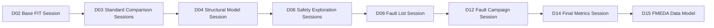
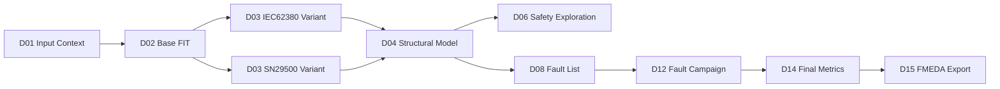

# Automotive Safe-IC Practice 05: FuSa Common Database — `.fdb::session` as the Evidence Center

Author: Darren H. Chen  
Direction: Automotive chip functional safety analysis and fault injection  
Demo: D05_fusa_common_database_evidence_center  
Tags: Safe-IC, ISO 26262, Functional Safety, FuSa Database, Evidence Traceability, FMEDA, FIT, Diagnostic Coverage, Fault Campaign, Safety Mechanism, Automotive Semiconductor

---

## 1. From Report Files to Reviewable Safety Evidence

The first four practices establish the essential engineering context for a safety-oriented semiconductor flow.

D01 defines a reproducible analysis input package: design boundary, filelist, clock definition, FIT setup, initialization configuration, and run identity.

D02 derives the Base FIT Rate and begins to explain where random hardware failure exposure comes from.

D03 compares the supported FIT standards under the same upstream design boundary and separates the true standard selector from experiment variants.

D04 turns the design into structural safety objects: endpoints, startpoints, logic cones, DCE artifacts, and seed maps between endpoints and safety mechanisms.

D05 is the point where these artifacts stop being a loose group of files and become a managed evidence system.

A safety analysis flow can generate many reports, CSV files, logs, markdown summaries, and intermediate artifacts. That is useful, but it is not enough. In a real review, the problem is rarely that there is no file. The problem is usually that the relationship between files is unclear.

A reviewer may ask:

```text
Which FIT setup produced this number?
Which design boundary was used?
Which standard was selected?
Which DCE artifact belongs to which analysis run?
Which fault list was generated from which safety-mechanism assumption?
Which fault campaign result should be used for final metrics?
Which FMEDA part or sub-part consumes this diagnostic-coverage result?
```

If every artifact is only a standalone file, these questions become manual investigation. D05 introduces the common safety database as the evidence center so that the flow can answer these questions with an explicit session model.

The central pattern is:

```text
<database_file>.fdb::<session_name>
```

The database file is the container. The session name is the partition of evidence inside that container.

This sounds simple, but it changes the architecture of the entire flow.

---

## 2. What D05 Adds to the Flow

D05 is named:

```text
FuSa Common Database: .fdb::session as Evidence Center
```

It is not a new FIT standard. It is not a new structural extraction algorithm. It is not a fault campaign yet. It is the evidence-management layer that connects the earlier analysis stages with the later safety-exploration, fault-list, fault-campaign, final-metrics, and FMEDA stages.

The practical role of D05 is:

```text
D01 -> input package evidence
D02 -> Base FIT evidence
D03 -> FIT-standard comparison evidence
D04 -> structural safety evidence
D05 -> database/session evidence center
D06 -> safety exploration
D07 -> safety mechanism map
D08 -> fault list generation
D09-D14 -> simulation context, fault campaign, classification, final metrics
D15-D16 -> FMEDA data model and top-down FMEDA flow
D17-D20 -> closure, regression gate, traceability, end-to-end mini flow
```

D05 therefore has one main responsibility:

```text
make every important safety artifact addressable, traceable, and reusable through a database/session identity.
```

A report file is still useful. A CSV file is still useful. A log file is still useful. D05 does not replace them. It gives them a stable relationship.

The engineering objective is to move from this:

```text
reports/
logs/
outputs/
csv/
manual_notes/
```

to this:

```text
Database: project_safety.fdb
  Session: D01_INPUT_CONTEXT
  Session: D02_BASE_FIT
  Session: D03_FIT_STANDARD_IEC62380_PASSENGER
  Session: D03_FIT_STANDARD_SN29500_REFERENCE
  Session: D04_STRUCTURAL_MODEL
  Session: D06_EXPLORATION_CANDIDATE_A
  Session: D08_FAULT_LIST
  Session: D12_FAULT_CAMPAIGN
  Session: D14_FINAL_METRICS
  Session: D15_FMEDA_EXPORT
```

The second model is much easier to audit, reproduce, compare, and automate.

---

## 3. Understanding `.fdb::session`

A database-session reference should be read as two different pieces of identity.

Example:

```text
outputs/db/project_safety.fdb::D05_EVIDENCE_INDEX
```

This means:

```text
Database file: outputs/db/project_safety.fdb
Session name:  D05_EVIDENCE_INDEX
```

The database file represents a container for the safety workflow. The session represents a particular run, stage, assumption set, or result partition.

This distinction matters because many stages may use the same database file while writing different sessions:

```text
project_safety.fdb::D02_BASE_FIT
project_safety.fdb::D03_IEC62380_PASSENGER_65C
project_safety.fdb::D03_SN29500_REFERENCE
project_safety.fdb::D04_STRUCTURAL_MODEL
project_safety.fdb::D08_FAULT_LIST
project_safety.fdb::D12_FAULT_CAMPAIGN
project_safety.fdb::D14_FINAL_METRICS
```

A session should not be treated as a temporary scratch area. It should be treated as an evidence partition with a clear meaning.

A good session name usually includes:

```text
stage id
analysis purpose
standard or variant identity when relevant
major assumption set
```

A poor session name looks like this:

```text
run1
test
new
final
final2
```

Those names are convenient for local debugging, but they become unusable in review.

A better session name looks like this:

```text
D03_IEC62380_PASSENGER_65C
D04_STRUCTURAL_MODEL_IEC62380
D08_FAULT_LIST_MAIN
D12_FAULT_CAMPAIGN_REGRESSION_A
D14_FINAL_METRICS_FROM_D12
```

The key idea is simple:

```text
session identity is part of safety evidence.
```

---

## 4. Why a Common Database Is Needed

A functional safety flow crosses several domains.

It starts with design files and reliability assumptions. It moves into structural analysis. It then enters safety-mechanism exploration, fault-list generation, simulation context, fault injection, classification, final metric calculation, and FMEDA.

Each domain has a different data shape.

| Domain | Typical Evidence |
|---|---|
| Design input | RTL, filelist, clock definition, blackbox list, memory definition |
| Reliability setup | FIT setup, mission profile, process model, package data, temperature assumptions |
| Quantitative analysis | FIT, BFR, permanent and transient contribution, diagnostic coverage |
| Structural analysis | endpoint, startpoint, cone, DCE, hierarchy boundary |
| Safety mechanism reasoning | EP-to-SM map, diagnostic coverage assumption, mechanism type |
| Fault campaign setup | fault list, alarm list, observe point, FTTI window, simulation stimulus |
| Fault campaign result | detected, safe, unsafe, unresolved, not-triggered, not-observed |
| Final metric validation | final DC, residual FIT, SPFM/LFM/PMHF-style metrics |
| FMEDA | part, sub-part, failure mode, safety mechanism, residual contribution |

A common database gives the flow a way to carry these data types across tools and across stages.

The main benefit is not only storage. The main benefit is continuity.

```text
analysis output -> fault-list input -> fault-campaign input -> final metric input -> FMEDA evidence
```

Without this continuity, engineers often end up doing manual joins between reports. Manual joins are dangerous because they are easy to make once and hard to review later.

---

## 5. File-Based Evidence and Database-Based Evidence

A mature safety flow should keep both file-based evidence and database-based evidence.

They solve different problems.

### 5.1 File-Based Evidence

File-based evidence is human-friendly and Git-friendly.

Examples:

```text
summary reports
FIT contribution reports
DCE files
fault-list exports
fault-campaign summaries
CSV indexes
markdown summaries
run manifests
quality-gate reports
```

File evidence is good for:

```text
review
side-by-side diff
publication demo
CI archive
manual inspection
minimal reproducibility package
```

### 5.2 Database-Based Evidence

Database-based evidence is tool-friendly and workflow-friendly.

Examples:

```text
coverage metrics
fault lists
fault simulation results
part and sub-part mapping
alarm and observe-point settings
FTTI settings
safety-mechanism maps
session identity
```

Database evidence is good for:

```text
cross-tool handoff
fault campaign reuse
final metric validation
GUI visualization
FMEDA assembly
session-level traceability
```

D05 should not choose one and discard the other. It should bind the two.

A practical pattern is:

```text
outputs/evidence_index.csv      -> file-level index
outputs/session_catalog.csv     -> session-level index
outputs/db/project_safety.fdb   -> structured database container
outputs/demo_summary.md         -> human-readable explanation
```

The evidence index explains where the files are. The session catalog explains what each database session means. The database stores structured data for later stages. The summary explains the engineering interpretation.

---

## 6. The Session Catalog as a First-Class Artifact

The session catalog is the heart of D05.

A session catalog is a table that describes every session written to or read from the common database.

A useful schema is:

| Column | Meaning |
|---|---|
| `session_name` | Logical session identity |
| `stage_id` | D01, D02, D03, D04, D05, etc. |
| `session_role` | input, analysis, structural, fault_list, campaign_result, final_metric, FMEDA |
| `database_path` | Path to `.fdb` container |
| `source_stage` | Upstream stage that produced the session |
| `fit_standard` | Standard identity when applicable |
| `variant_id` | Experiment variant when applicable |
| `design_top` | Top-level design boundary |
| `input_manifest` | File describing input provenance |
| `derived_from` | Parent session or parent artifact |
| `overwrite_policy` | Whether overwrite is allowed |
| `quality_status` | PASS, WARN, FAIL |
| `notes` | Human-readable explanation |

This catalog is separate from the database itself. That is intentional.

The database may be optimized for tool access. The catalog is optimized for engineering review.

A reviewer should be able to open the catalog and understand the flow without reverse-engineering every command.

---

## 7. Database Session Design Principles

### 7.1 One Session Has One Responsibility

A session should not mix unrelated purposes.

For example, this is not ideal:

```text
project_safety.fdb::ALL_RESULTS
```

It hides the difference between BFR, structural analysis, fault list, fault campaign result, and final metric validation.

A better model is:

```text
project_safety.fdb::D02_BASE_FIT
project_safety.fdb::D04_STRUCTURAL_MODEL
project_safety.fdb::D08_FAULT_LIST
project_safety.fdb::D12_FAULT_CAMPAIGN
project_safety.fdb::D14_FINAL_METRICS
```

Each session has a clear owner and a clear consumer.

### 7.2 Treat Sessions as Evidence, Not Scratch Space

During early debugging, it is tempting to overwrite the same session repeatedly.

That is acceptable only for local experiments. For a reviewable flow, the session naming strategy should make the run identity explicit.

For example:

```text
D03_IEC62380_PASSENGER_65C
D03_IEC62380_MOTORCONTROL_85C
D03_SN29500_REFERENCE_65C
```

These session names tell the reviewer what changed.

### 7.3 Do Not Mix Standards in a Single Analysis Session

D03 already established that `fit_standard` and `variant_id` are different concepts.

A database session should preserve this distinction.

The wrong approach is:

```text
project_safety.fdb::D03_STANDARD_COMPARISON
```

if that single session internally mixes IEC 62380-derived and SN 29500-derived values without a clear separation.

The better approach is:

```text
project_safety.fdb::D03_IEC62380_PASSENGER_65C
project_safety.fdb::D03_SN29500_REFERENCE_65C
```

Then a separate comparison table can reference both sessions.

### 7.4 Record Both Producer and Consumer

Every session should have a producer and a consumer.

Example:

| Session | Producer | Consumer |
|---|---|---|
| `D02_BASE_FIT` | analysis engine | D03, D05, FMEDA pre-check |
| `D04_STRUCTURAL_MODEL` | structural collector | D06, D08, D15 |
| `D08_FAULT_LIST` | analysis engine | fault campaign engine |
| `D12_FAULT_CAMPAIGN` | fault campaign engine | final metric analysis |
| `D14_FINAL_METRICS` | analysis engine | FMEDA / review |

If a session has no known consumer, it may be a temporary artifact rather than safety evidence.

---

## 8. The Read/Write Pattern Across the Flow

A common database becomes powerful when stages read from and write to different sessions.

The pattern is:

```text
write analysis evidence
read analysis evidence
write fault-list evidence
read fault-list evidence
write fault-campaign evidence
read fault-campaign evidence
write final metric evidence
export FMEDA evidence
```

Conceptually:



D05 does not need to execute all these stages. It defines the evidence architecture that allows these stages to work together.

A neutral analysis-stage invocation may look like this:

```bash
safeic_analyze \
  --config inputs/analysis/base_fit.ini \
  --filelist inputs/filelist/design.f \
  --output-dir outputs/native/d02_base_fit
```

The initialization file defines database writing:

```ini
mode = analysis
top = demo_top
clkdef = inputs/clock/clocks.clk
fit_setup = inputs/fit/FIT_inputs.txt
fit_standard = iec_62380

write_fusa_db = true
fusa_db_name = outputs/db/project_safety.fdb::D02_BASE_FIT
overwrite_session = true
```

A later fault-campaign stage may read from a fault-list session and write to a campaign-result session:

```ini
mode = fault_campaign
top = demo_top
clkdef = inputs/clock/clocks.clk

fault_db_name = outputs/db/project_safety.fdb::D08_FAULT_LIST
write_fusa_db = true
fusa_db_name = outputs/db/project_safety.fdb::D12_FAULT_CAMPAIGN
overwrite_session = true
```

Then a final-metric stage may read the campaign result and write a final metric session:

```ini
mode = analysis
top = demo_top
clkdef = inputs/clock/clocks.clk

read_campaign_db = outputs/db/project_safety.fdb::D12_FAULT_CAMPAIGN
write_fusa_db = true
fusa_db_name = outputs/db/project_safety.fdb::D14_FINAL_METRICS
overwrite_session = true
```

The exact option names depend on the configured engine, but the architecture is stable:

```text
read from one session
write to another session
keep session responsibility explicit
```

---

## 9. What Belongs in D05

D05 should package and explain database-centered evidence, not repeat all previous computations.

The D05 demo should consume upstream outputs such as:

```text
D01 input inventory
D01 analysis options
D02 BFR summary
D02 FIT contribution
D03 FIT-standard comparison
D03 database sessions
D04 endpoint inventory
D04 startpoint inventory
D04 DCE catalog
D04 EP-to-SM seed map
D04 quality gate
```

Then it should generate:

```text
outputs/session_catalog.csv
outputs/session_catalog.md
outputs/evidence_graph.csv
outputs/database_write_plan.csv
outputs/database_read_plan.csv
outputs/db_session_manifest.csv
outputs/fmeda_bridge_seed.csv
outputs/d05_quality_gate.csv
outputs/d05_handoff_to_d06.csv
outputs/d05_handoff_to_d08.csv
outputs/d05_handoff_to_d15.csv
outputs/demo_summary.md
```

This is a different kind of demo from D02 or D03.

D02 and D03 focus on numerical analysis. D04 focuses on structural extraction. D05 focuses on evidence architecture.

---

## 10. The Evidence Graph

A database session is useful only if its lineage is known.

D05 should build an evidence graph.

A minimal evidence graph has four kinds of nodes:

```text
input artifact
run configuration
output artifact
database session
```

And several kinds of edges:

```text
used_by
produced_by
derived_from
stored_in
read_by
consumed_by
```

Example:

```text
FIT setup file
  used_by -> D03 IEC62380 run configuration
  produced_by -> D03 IEC62380 summary report
  stored_in -> project_safety.fdb::D03_IEC62380_PASSENGER_65C
```

Another example:

```text
D04 endpoint inventory
  derived_from -> D03 DCE artifacts
  stored_in -> project_safety.fdb::D04_STRUCTURAL_MODEL
  consumed_by -> D06 safety exploration
  consumed_by -> D08 fault-list generation
  consumed_by -> D15 FMEDA mapping
```

This is the difference between a demo folder and an engineering evidence system.

A demo folder tells you what files exist.

An evidence graph tells you why they exist and how they are allowed to be used.

---

## 11. Why the Database Matters for FMEDA

FMEDA is not only a spreadsheet. It is a model that connects:

```text
part
sub-part
failure mode
safety mechanism
diagnostic coverage
residual FIT
final metric evidence
```

The common database is important because it can carry the information needed to connect analysis results to FMEDA rows.

A simplified FMEDA bridge looks like this:

| FMEDA Concept | Database-Backed Evidence |
|---|---|
| Part | design hierarchy, instance grouping, structural catalog |
| Sub-part | module or function-level partition |
| Failure mode | safety analysis assumption or FMEDA library entry |
| Safety mechanism | EP-to-SM map, diagnostic coverage assumption |
| DC value | estimated or validated diagnostic coverage |
| Residual FIT | FIT contribution after diagnostic coverage |
| Fault result | campaign classification session |

D05 does not complete the FMEDA. That will come later. But D05 prepares the path.

If the database already contains structured metrics, fault lists, campaign results, part/sub-part mapping, alarm and observe-point settings, and safety-mechanism maps, then the FMEDA stage becomes a controlled export rather than a manual reconstruction.

This is the difference between:

```text
copy numbers into FMEDA manually
```

and:

```text
export FMEDA evidence from traceable sessions
```

---

## 12. Alarms, Observe Points, and FTTI as Database-Centered Evidence

D05 also prepares the vocabulary for later fault-campaign stages.

These terms appear later, but the database architecture should reserve a place for them now.

### 12.1 Alarm

An alarm is a signal, event, status bit, interrupt, or protocol-visible indication that a fault has been detected or controlled.

An alarm is not just a waveform signal. In safety reasoning, it is evidence that the safety mechanism reached a detection or control boundary.

Examples:

```text
error interrupt
ECC error flag
lockstep mismatch flag
watchdog timeout
bus response error
safety monitor alert
```

### 12.2 Observe Point

An observe point is a location where the effect of a fault is checked.

An observe point may be a primary output, a register, a protocol response, a status signal, a memory interface, or an internal monitor boundary.

In later fault campaigns, observe points help decide whether the machine state differs from the expected golden safety context.

### 12.3 FTTI

FTTI means Fault Tolerant Time Interval.

It is the time window in which a fault must be detected, controlled, or made safe before it can violate the safety goal.

FTTI connects digital timing to safety reasoning.

For example:

```text
fault occurs at T0
fault effect propagates to safety-critical state at T1
alarm is expected before T0 + FTTI
system enters safe state before the hazardous event becomes unacceptable
```

D05 should not run a fault campaign. But it should reserve database/session fields and evidence indexes for alarm lists, observe-point specifications, timescale settings, and FTTI assumptions.

---

## 13. Protocol-Visible Evidence

D04 introduced protocol-visible endpoints. D05 explains why they matter in a database-centered flow.

A protocol is an agreed behavioral contract at an interface.

In digital SoC design, common protocol ideas include:

```text
valid / ready handshake
request / grant arbitration
address / data / response phase
interrupt / acknowledge sequence
error response semantics
reset and initialization sequence
```

Functional safety does not only care whether an internal register changed. It also cares whether the fault effect became visible at a meaningful interface boundary.

For example:

```text
A wrong internal state may be harmless if it is overwritten before any observable transaction.
A wrong response on a safety-critical bus may be unsafe even if the internal state later recovers.
An alarm flag may be meaningful only if software can observe it within the FTTI.
```

Therefore, D05 should keep protocol-visible evidence traceable:

```text
endpoint -> protocol boundary -> observe point -> alarm or no alarm -> fault classification -> FMEDA row
```

This chain becomes critical in D09 to D14.

---

## 14. Common Database Quality Gates

D05 should introduce quality gates for database evidence.

A suggested D05 quality gate includes:

| Gate | Meaning |
|---|---|
| `DB_PATH_DEFINED` | A database path exists for all planned sessions |
| `SESSION_NAMES_UNIQUE` | No duplicate session names for different meanings |
| `STAGE_ID_VALID` | Every session belongs to a known stage |
| `PRODUCER_DEFINED` | Every session has a known producer |
| `CONSUMER_DEFINED` | Every durable session has a planned consumer |
| `FIT_STANDARD_SEPARATED` | IEC 62380 and SN 29500 evidence are not mixed silently |
| `DCE_STANDARD_MATCH` | DCE artifacts are not reused across incompatible standard contexts |
| `UPSTREAM_EVIDENCE_LINKED` | D01-D04 artifacts are linked to D05 session catalog |
| `OVERWRITE_POLICY_REVIEWED` | Overwrite behavior is explicit |
| `HANDOFF_READY` | D06, D08, and D15 have enough input references |

The quality gate should not require that all later sessions already exist. D05 happens before D06-D20.

Instead, it should distinguish between:

```text
existing session
planned session
external session
future session
```

A good session catalog can include planned future sessions as long as they are clearly marked.

---

## 15. A Practical D05 Directory Layout

A clean D05 demo package can use this structure:

```text
D05_fusa_common_database_evidence_center/
  README.md
  scripts/
    run_demo.csh
    run_demo.sh
  tools/
    build_session_catalog.py
    build_evidence_graph.py
    validate_database_plan.py
    export_handoff.py
  inputs/
    from_D01/
    from_D02/
    from_D03/
    from_D04/
  configs/
    session_naming_rules.csv
    database_plan.csv
    handoff_rules.csv
  outputs/
    session_catalog.csv
    session_catalog.md
    evidence_graph.csv
    evidence_graph.md
    database_write_plan.csv
    database_read_plan.csv
    db_session_manifest.csv
    fmeda_bridge_seed.csv
    d05_quality_gate.csv
    d05_handoff_to_d06.csv
    d05_handoff_to_d08.csv
    d05_handoff_to_d15.csv
    evidence_index.csv
    demo_summary.md
```

The D05 demo should not depend on a hidden local path.

It should read upstream locations from environment variables or default sibling paths:

```text
D01_ROOT
D02_ROOT
D03_ROOT
D04_ROOT
```

The shell wrapper should remain simple:

```csh
csh scripts/run_demo.csh
```

The underlying workflow is:

```text
collect upstream evidence
normalize session references
build session catalog
build evidence graph
validate database plan
create handoff files
summarize quality gate
```

D05 is therefore a data-modeling and evidence-orchestration demo.

---

## 16. Example Session Catalog

A simplified D05 session catalog may look like this:

| stage_id | session_name | role | status | producer | consumer |
|---|---|---|---|---|---|
| D01 | `D01_INPUT_CONTEXT` | input_context | existing | input package builder | D02, D03, D05 |
| D02 | `D02_BASE_FIT` | base_fit | existing | analysis engine | D03, D05, D15 |
| D03 | `D03_IEC62380_PASSENGER_65C` | fit_standard_variant | existing | analysis engine | D04, D05 |
| D03 | `D03_SN29500_REFERENCE_65C` | fit_standard_variant | existing | analysis engine | D04, D05 |
| D04 | `D04_STRUCTURAL_MODEL` | structural_model | existing | structural collector | D06, D08, D15 |
| D06 | `D06_EXPLORATION_CANDIDATE_A` | safety_exploration | planned | analysis engine | D07, D08 |
| D08 | `D08_FAULT_LIST` | fault_list | planned | analysis engine | D11, D12 |
| D12 | `D12_FAULT_CAMPAIGN` | campaign_result | planned | fault campaign engine | D14 |
| D14 | `D14_FINAL_METRICS` | final_metrics | planned | analysis engine | D15, D17 |
| D15 | `D15_FMEDA_EXPORT` | fmeda | planned | FMEDA exporter | review |

This table is not a replacement for the database. It is a review-friendly index of the database strategy.

---

## 17. Example Evidence Graph

A simplified evidence graph can be represented as CSV:

```csv
source_node,edge_type,target_node
D01_INPUT_CONTEXT,used_by,D02_BASE_FIT
D02_BASE_FIT,used_by,D03_IEC62380_PASSENGER_65C
D03_IEC62380_PASSENGER_65C,produces,D04_STRUCTURAL_MODEL
D04_STRUCTURAL_MODEL,feeds,D06_EXPLORATION_CANDIDATE_A
D04_STRUCTURAL_MODEL,feeds,D08_FAULT_LIST
D08_FAULT_LIST,feeds,D12_FAULT_CAMPAIGN
D12_FAULT_CAMPAIGN,feeds,D14_FINAL_METRICS
D14_FINAL_METRICS,feeds,D15_FMEDA_EXPORT
```

The same graph can be visualized:



This graph should be built from real upstream artifacts and configured future sessions, not manually drawn after the fact.

---

## 18. Handling Overwrite Policy

Overwrite policy is a deceptively important topic.

During active development, engineers often use:

```ini
overwrite_session = true
```

This keeps the demo easy to rerun.

However, in a reviewable flow, overwrite policy must be controlled.

There are three common modes.

### 18.1 Development Mode

```text
overwrite_session = true
overwrite_fusa_db = true
```

This is convenient for local iteration.

It is not ideal for long-term evidence retention.

### 18.2 Append Mode

```text
overwrite_session = false
new session name per run
```

This is safer for preserving historical evidence.

The cost is that the session catalog must manage more sessions.

### 18.3 Release Mode

```text
immutable database snapshot
frozen session catalog
signed or hashed evidence index
```

This is appropriate for review checkpoints, customer delivery, or certification-oriented archives.

D05 should at least record which mode is being used.

A demo may use development mode, but the methodology should explain how to move toward append or release mode.

---

## 19. Session Naming Rules

A session naming rule should be deterministic.

A good rule can be:

```text
D<stage>_<purpose>[_<standard>][_<variant>]
```

Examples:

```text
D02_BASE_FIT
D03_IEC62380_PASSENGER_65C
D03_SN29500_REFERENCE_65C
D04_STRUCTURAL_MODEL
D06_EXPLORATION_LOCKSTEP_A
D08_FAULT_LIST_MAIN
D12_CAMPAIGN_GOODMACHINE_A
D14_FINAL_METRICS_MAIN
D15_FMEDA_EXPORT_MAIN
```

Avoid:

```text
session1
latest
old
try2
abc
```

Names should be machine-readable and review-readable at the same time.

---

## 20. How D05 Supports D06 Safety Exploration

D06 will evaluate safety-mechanism candidates.

It needs:

```text
structural endpoint inventory
startpoint/cone relationships
DCE artifacts
Base FIT contribution
standard-specific analysis context
candidate safety mechanism assumptions
```

D05 should provide a handoff table:

```text
outputs/d05_handoff_to_d06.csv
```

A useful schema is:

| Column | Meaning |
|---|---|
| `source_session` | Session containing upstream metrics or structure |
| `endpoint_catalog` | Endpoint inventory file |
| `dce_catalog` | DCE catalog file |
| `fit_context` | FIT standard and variant context |
| `candidate_sm_map_seed` | Seed map for safety mechanism exploration |
| `evidence_status` | PASS, WARN, FAIL |

D06 should not have to rediscover D04 structure. It should consume D05 handoff.

---

## 21. How D05 Supports D08 Fault List Generation

D08 will generate or organize the fault list for later fault campaigns.

It needs:

```text
endpoint/startpoint/cone evidence
selected safety mechanism assumptions
fault model assumptions
database write target for fault list
future read target for fault campaign
```

D05 should provide:

```text
outputs/d05_handoff_to_d08.csv
```

A useful row may say:

```text
D04_STRUCTURAL_MODEL -> D08_FAULT_LIST -> D12_FAULT_CAMPAIGN
```

This makes the later fault campaign flow explicit before fault injection begins.

---

## 22. How D05 Supports D15 FMEDA

D15 will build the FMEDA data model.

It needs:

```text
part / sub-part mapping seed
failure mode mapping seed
safety mechanism mapping seed
FIT contribution references
DC references
residual FIT references
final metrics references
```

D05 can already prepare:

```text
outputs/fmeda_bridge_seed.csv
```

A useful schema is:

| Column | Meaning |
|---|---|
| `part_name` | FMEDA part candidate |
| `sub_part_name` | FMEDA sub-part candidate |
| `design_scope` | RTL/module/hierarchy mapping |
| `endpoint_group` | Related endpoint group |
| `fit_session` | Session containing FIT evidence |
| `structural_session` | Session containing DCE/endpoint evidence |
| `future_metric_session` | Planned final metric source |

This is not the final FMEDA. It is a bridge from analysis evidence to FMEDA structure.

---

## 23. Common Mistakes

### 23.1 Treating Logs as the Main Evidence

Logs are useful, but they are not the database model.

A log tells us what happened during execution. A database session tells us which structured safety evidence is available for the next stage.

A strong flow keeps both.

### 23.2 Reusing a DCE Without Checking Its Context

DCE artifacts may depend on design boundary, standard context, hierarchy assumptions, and tool configuration.

D05 should not allow blind reuse.

A good DCE catalog records:

```text
design_top
source_stage
source_session
fit_standard
variant_id
generation_config
quality_status
```

### 23.3 Mixing Experiment Variant and Standard Identity

The true standard selector is not the same as an experiment variant.

A standard identity might be:

```text
iec_62380
sn_29500
```

A variant identity might be:

```text
iec62380_passenger_65c
sn29500_reference_65c
```

D05 should store both fields separately.

### 23.4 Overwriting Review Evidence

Overwriting is convenient during development, but dangerous during review.

D05 should make overwrite policy visible.

### 23.5 Creating a Database Without a Session Catalog

A database without a session catalog is hard to review.

The session catalog is the human-readable contract for the database.

---

## 24. D05 Quality Summary

At the end of D05, the demo should be able to answer:

```text
Which upstream artifacts were consumed?
Which database file is the evidence center?
Which sessions exist now?
Which sessions are planned for later stages?
Which stage produced each session?
Which stage consumes each session?
Are standard-specific results separated?
Are DCE artifacts linked to the correct context?
Are handoff files ready for D06, D08, and D15?
```

If these questions are answerable, D05 has done its job.

D05 is not about producing the largest number of files. It is about making the safety flow reviewable.

---

## 25. Conclusion

D05 turns the earlier practices into a coherent evidence system.

D01 provides the input context. D02 provides Base FIT evidence. D03 provides standard-specific analysis evidence. D04 provides structural safety evidence. D05 binds them through a common database and explicit sessions.

The key engineering idea is:

```text
A safety artifact is not complete until its provenance, session identity, producer, consumer, and review status are known.
```

The `.fdb::session` pattern is the backbone of that idea.

Once D05 is in place, the later stages can become much cleaner:

```text
D06 can explore safety mechanisms using known structural and FIT evidence.
D08 can generate fault lists with a clear database write target.
D12 can read those fault lists and write campaign results.
D14 can read campaign results and compute final metrics.
D15 can export FMEDA evidence from traceable sessions.
```

That is why D05 is the evidence center of the Safe-IC practice flow.
