# [Automotive Safe-IC Practice 05] Structural Safety Modeling: From RTL Hierarchy to Startpoints, Endpoints, and Cones

**Author**: Darren H. Chen  
**Direction**: Automotive Chip Functional Safety Analysis and Fault Injection Practice  
**Demo**: D05_structural_safety_model  
**Tags**: Automotive Chip, Functional Safety, Structural Analysis, Startpoint, Endpoint, Cone, Diagnostic Coverage, FMEDA, Fault Propagation, RTL, Netlist, Safety Mechanism

---

## 1. Why This Article Matters

In the previous articles, we built the quantitative side of the safety workflow:

```text
input package
→ FIT model normalization
→ Base FIT Rate
```

However, FIT alone does not tell us whether a design is safe.

FIT tells us:

```text
How much random hardware failure exposure exists?
```

But it does not answer:

```text
Where can a fault start?
Where can the error be observed?
Which logic region can propagate the error?
Which endpoint is safety-relevant?
Which safety mechanism protects that endpoint?
Which failure mode does the endpoint map to?
```

To answer these questions, we need a **structural safety model**.

The fifth demo in this repository is:

```text
D05_structural_safety_model
```

The generic tool introduced in this article is:

```text
safeic-structure
```

The purpose of `safeic-structure` is to transform RTL or netlist information into a safety-oriented graph:

```text
design hierarchy
→ signals and state elements
→ startpoints
→ endpoints
→ cones
→ part/sub-part mapping
→ safety mechanism mapping
→ diagnostic coverage input
```

The central idea is:

> Functional safety analysis cannot rely on a flat list of signals. It needs a structural model that explains how faults propagate from possible origin points to safety-relevant endpoints.

---

## 2. Why Structure Comes After FIT

Base FIT Rate gives a quantitative baseline.

But without structure, BFR remains too coarse.

Example:

```text
total BFR = 120 FIT
```

This number does not tell us:

```text
which registers dominate the risk
which endpoints are protected
which cones are uncovered
which faults should be injected first
which failure modes are affected
```

A structural safety model connects quantitative contribution to design topology.

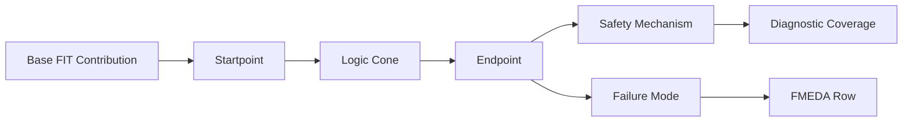

**Figure 1. Structural safety modeling connects FIT contribution to endpoint, safety mechanism, failure mode, and FMEDA evidence.**

In a practical workflow:

```text
D03/D04 provide the failure-rate baseline.
D05 explains where that baseline can propagate.
Later demos estimate DC, generate fault lists, and run fault campaigns.
```

---

## 3. The Three Core Structural Objects

The three most important structural objects are:

```text
startpoint
endpoint
cone
```

### 3.1 Startpoint

A startpoint is a location where a fault can originate or begin propagating.

Examples:

```text
flip-flop output
memory bit
latch output
input port
black-box output
internal net
state register bit
```

A startpoint answers:

```text
Where can the fault effect begin?
```

### 3.2 Endpoint

An endpoint is a location where a propagated error becomes observable or safety-relevant.

Examples:

```text
state register input
output port
safety-critical control signal
alarm-related state
bus response signal
memory write data
interface transaction field
```

An endpoint answers:

```text
Where does the fault effect matter?
```

### 3.3 Cone

A cone is the logic region between startpoints and endpoints.

It answers:

```text
Through which logic can an error propagate?
```

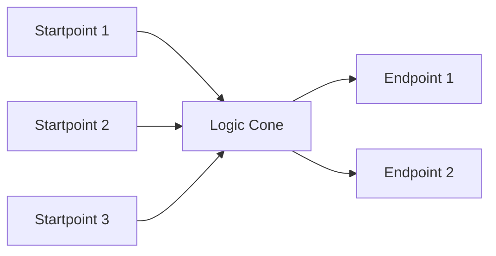

**Figure 2. A cone captures the propagation region from startpoints to endpoints.**

The structural model is not only a graph. It is the basis for safety reasoning.

---

## 4. Fault Propagation Is a Graph Problem

At the RTL or netlist level, a digital design can be viewed as a graph.

```text
nodes:
  wires
  ports
  registers
  memories
  cells
  module instances

edges:
  signal dependencies
  driver-to-load connections
  register-to-combinational paths
  memory read/write dependencies
  module port connections
```

A simplified dependency graph:

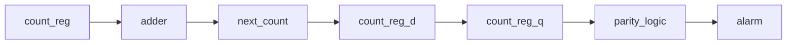

**Figure 3. RTL structure can be represented as a dependency graph for safety analysis.**

Once the graph is built, structural analysis can answer:

```text
Which startpoints can reach this endpoint?
Which endpoints can be affected by this startpoint?
How large is the cone?
Is the cone protected?
Is the endpoint protected?
Is the alarm path part of the protected cone?
```

This is why a structural safety tool needs graph algorithms, not just text parsing.

---

## 5. Structural Model vs Functional Simulation

Functional simulation tells us how the design behaves for a specific stimulus.

Structural analysis tells us what can potentially propagate independent of one specific run.

They are complementary.

| Method | What It Answers | Limitation |
|---|---|---|
| Functional simulation | What happened under this stimulus? | May not activate all paths |
| Structural analysis | What can potentially propagate through design topology? | May over-approximate real behavior |
| Fault injection | What happens when a specific fault is injected under a context? | Can be expensive |
| FMEDA | How results map to safety metrics and failure modes | Depends on input quality |

Structural analysis is useful before fault injection because it helps prioritize where to inject faults.

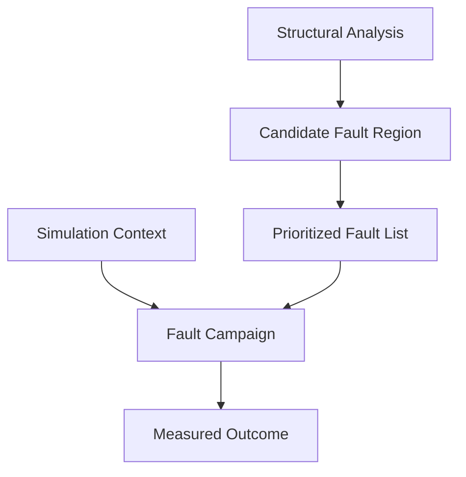

**Figure 4. Structural analysis narrows and prioritizes the fault campaign.**

A naive fault campaign may inject faults everywhere.

A structural safety campaign should inject faults where the safety argument needs evidence.

---

## 6. RTL-Level vs Netlist-Level Structure

A structural safety model can be built at different abstraction levels:

```text
architectural level
RTL level
gate-level netlist
post-synthesis netlist
post-layout netlist
```

Each level has different tradeoffs.

| Level | Advantage | Limitation |
|---|---|---|
| Architectural | Early safety exploration | Coarse structure |
| RTL | Early design feedback, readable hierarchy | Some implementation details missing |
| Gate-level netlist | More accurate logic structure | Less readable, larger graph |
| Post-layout netlist | Closest to implementation | Expensive and late |
| Final signoff netlist | Most accurate for final metrics | Least flexible for design changes |

A good safety workflow should support multiple levels.

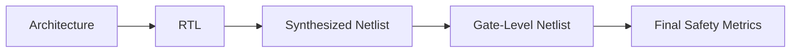

**Figure 5. Structural safety analysis should start early at RTL and become more accurate near signoff.**

The first implementation of D05 can use a toy RTL design.

Later versions can use an open-source synthesis frontend to produce a normalized structural representation.

---

## 7. Why RTL Hierarchy Matters

Safety reports are usually reviewed by humans.

A flat netlist is difficult to review because names become transformed, optimized, and sometimes unrecognizable.

RTL hierarchy helps preserve intent:

```text
top.u_ctrl.state_reg
top.u_timer.timeout_cnt
top.u_bus.wdata_reg
top.u_alarm.err_pending
```

These names tell an engineer what the signal means.

Hierarchy also helps map design structure to FMEDA:

```text
top.u_ctrl      → Control Part
top.u_timer     → Timer Part
top.u_bus       → Bus Interface Part
top.u_mem       → Memory Subsystem Part
top.u_alarm     → Diagnostic Part
```

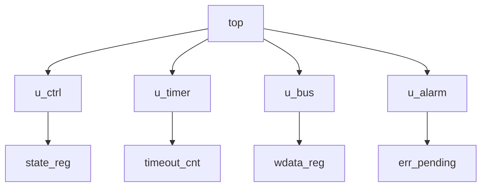

**Figure 6. RTL hierarchy provides reviewable names for safety mapping.**

However, hierarchy alone is not enough.

We still need connectivity.

---

## 8. Connectivity Is the Key

A hierarchy tree says:

```text
where something is located
```

A connectivity graph says:

```text
how something can influence something else
```

Both are needed.

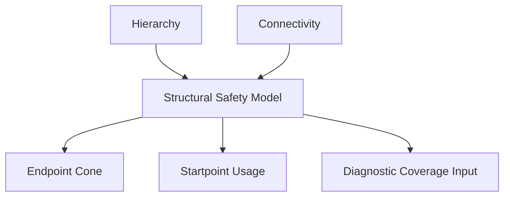

**Figure 7. A structural safety model combines hierarchy and connectivity.**

For example:

```text
top.u_cfg.mode_reg
```

may be in a configuration block, but it may influence:

```text
top.u_ctrl.state_reg
top.u_bus.access_grant
top.u_alarm.mask_enable
```

The safety relevance of `mode_reg` is not determined only by its module name. It is determined by what it can influence.

---

## 9. Startpoint Discovery

A first implementation of `safeic-structure` should discover candidate startpoints.

Candidate startpoints may include:

```text
sequential elements
memory bits
primary inputs
black-box outputs
selected internal nets
safety-critical configuration registers
```

Example startpoint table:

```csv
startpoint,type,module,width,reason
toy_counter.count_reg,flip_flop_array,toy_counter,8,state element
toy_counter.en,input,toy_counter,1,primary input
toy_counter.rst_n,input,toy_counter,1,reset input
toy_counter.parity_reg,flip_flop,toy_counter,1,state element
```

Startpoint discovery should be configurable because not every node should be injected in every campaign.

Possible policies:

```text
all_state_elements
all_primary_inputs
all_memory_bits
only_safety_relevant
manual_allowlist
exclude_reset_clock
exclude_test_logic
```

A practical tool should support both automatic discovery and manual override.

---

## 10. Endpoint Discovery

Endpoints define where safety-relevant effects are observed.

Candidate endpoints may include:

```text
state register inputs
output ports
alarm signals
safety-critical control signals
bus response fields
memory write enables
interface valid/ready signals
FSM state variables
```

Example endpoint table:

```csv
endpoint,type,module,width,reason
toy_counter.count,output,toy_counter,8,observable state
toy_counter.alarm,output,toy_counter,1,diagnostic alarm
toy_counter.count_parity,output,toy_counter,1,diagnostic state
```

Automatic endpoint discovery is useful, but safety relevance often requires human input.

Therefore D05 should support endpoint tags:

```yaml
endpoints:
  - name: toy_counter.count
    type: observable_state
    safety_relevance: safety_related
    failure_modes:
      - FM_DATA_CORRUPTION

  - name: toy_counter.alarm
    type: diagnostic_alarm
    safety_relevance: diagnostic
    failure_modes:
      - FM_ALARM_NOT_ASSERTED
```

The structural model should not assume every endpoint has the same safety meaning.

---

## 11. Cone Extraction

Cone extraction is the core structural operation.

For each endpoint, find the upstream logic that can influence it.

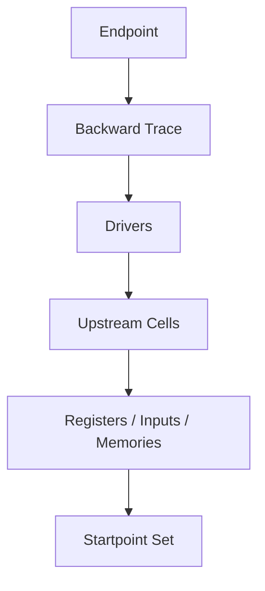

**Figure 8. Cone extraction traces backward from endpoint to upstream startpoints.**

Example:

```text
endpoint:
  toy_counter.alarm

upstream cone:
  toy_counter.count
  toy_counter.count_parity
  toy_counter.expected_parity
  parity_logic
```

Output:

```json
{
  "endpoint": "toy_counter.alarm",
  "cone": {
    "startpoints": [
      "toy_counter.count_reg",
      "toy_counter.parity_reg"
    ],
    "internal_nodes": [
      "toy_counter.expected_parity",
      "toy_counter.parity_logic"
    ],
    "cone_size": 4
  }
}
```

Cone extraction can support:

```text
backward cone
forward cone
bounded-depth cone
clock-domain-limited cone
reset-excluded cone
black-box boundary cone
```

For D05, a simple backward cone is enough.

---

## 12. Forward Impact Analysis

Backward cone answers:

```text
What can influence this endpoint?
```

Forward impact analysis answers:

```text
What endpoints can this startpoint influence?
```

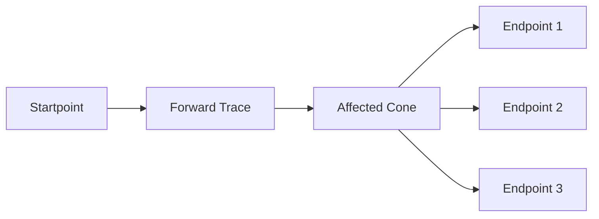

**Figure 9. Forward impact analysis helps rank startpoints by how many safety-relevant endpoints they can affect.**

Example:

```csv
startpoint,affected_endpoints,count
toy_counter.count_reg,toy_counter.count;toy_counter.alarm,2
toy_counter.parity_reg,toy_counter.alarm,1
toy_counter.en,toy_counter.count;toy_counter.alarm,2
```

Forward impact is useful for:

```text
fault list prioritization
startpoint usage reporting
endpoint contribution estimation
identifying high-fanout safety-critical nodes
debugging unsafe fault propagation
```

A startpoint that affects many safety-critical endpoints may deserve stronger protection or earlier fault injection.

---

## 13. Startpoint Usage

Startpoint usage measures how startpoints participate in endpoint cones.

It can answer:

```text
Which startpoints appear in many endpoint cones?
Which startpoints are unused?
Which startpoints dominate safety-relevant propagation?
Which startpoints are only diagnostic-path related?
```

Example report:

```csv
startpoint,type,used_by_endpoints,usage_count
toy_counter.count_reg,flip_flop_array,toy_counter.count;toy_counter.alarm,2
toy_counter.parity_reg,flip_flop,toy_counter.alarm,1
toy_counter.rst_n,input,all,2
```

In safety review, startpoint usage helps identify:

```text
common propagation sources
single-point weakness
unprotected configuration state
global control signals
dangerous diagnostic masking paths
```

This is why structural analysis is not only a pre-processing step. It is a safety review tool.

---

## 14. Diagnostic Coverage Needs Structure

Diagnostic Coverage is often described as a percentage.

But the percentage is meaningful only when the covered structure is clear.

For example:

```text
endpoint parity covers endpoint state
CRC covers transaction path
lockstep covers duplicated compute path
ECC covers memory array
watchdog covers temporal response
```

Each mechanism has a structural scope.

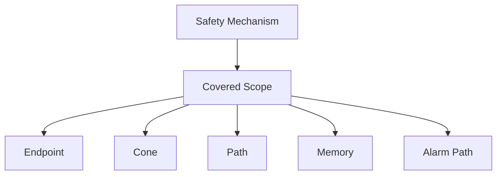

**Figure 10. A safety mechanism must be mapped to the structure it actually covers.**

Examples:

| Safety Mechanism | Structural Scope |
|---|---|
| Endpoint parity | Endpoint state |
| Memory ECC | Memory array and read/write data path |
| Bus CRC | Transaction path |
| Lockstep | Duplicated compute path and comparator |
| Protocol checker | Control sequence and state transition |
| Watchdog | Temporal progress and response path |
| Alarm monitor | Diagnostic reporting path |

This is why D05 prepares the input for later DC computation.

---

## 15. Endpoint-to-Safety-Mechanism Mapping

The endpoint-to-safety-mechanism map connects structure to protection.

Example:

```csv
endpoint,safety_mechanism,coverage_scope,alarm,assumption
toy_counter.count,endpoint_parity,endpoint,toy_counter.alarm,parity protects counter state
toy_counter.alarm,none,diagnostic_path,,alarm path protection not modeled
```

This mapping answers:

```text
Which endpoint is protected?
Which mechanism protects it?
What scope does the mechanism cover?
Which alarm reports the diagnostic result?
Which assumptions are made?
```

A stronger map can include:

```csv
endpoint,safety_mechanism,scope,dc_estimate,alarm,failure_mode,review_status
toy_counter.count,endpoint_parity,endpoint,0.90,toy_counter.alarm,FM_DATA_CORRUPTION,draft
toy_counter.alarm,none,diagnostic_path,0.00,,FM_ALARM_NOT_ASSERTED,draft
```

The structural model should validate this map:

```text
endpoint exists
safety mechanism exists
alarm exists
failure mode exists
scope is supported
coverage value is within range
```

---

## 16. Part and Sub-part Mapping

Functional safety reports are usually organized by parts and sub-parts.

A structural tool should support this mapping.

Example:

```yaml
parts:
  - id: PART_COUNTER
    name: Counter Block
    instances:
      - toy_counter

subparts:
  - id: SUBPART_COUNTER_STATE
    parent: PART_COUNTER
    name: Counter State
    objects:
      - toy_counter.count

  - id: SUBPART_COUNTER_DIAG
    parent: PART_COUNTER
    name: Counter Diagnostic Logic
    objects:
      - toy_counter.count_parity
      - toy_counter.alarm
```

This mapping connects signal-level structure to FMEDA structure.

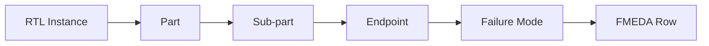

**Figure 11. Part/sub-part mapping converts signal-level structure into FMEDA-ready organization.**

Without this mapping, a fault result remains too low-level:

```text
toy_counter.count[3] stuck_at_1 detected
```

With this mapping, the same result can become:

```text
PART_COUNTER / SUBPART_COUNTER_STATE / FM_DATA_CORRUPTION / detected
```

That is much more useful for safety reporting.

---

## 17. Failure Mode Mapping

Failure mode mapping adds semantics.

Example:

```yaml
failure_mode_map:
  - object: toy_counter.count
    failure_modes:
      - FM_DATA_CORRUPTION
      - FM_WRONG_COUNT_VALUE

  - object: toy_counter.alarm
    failure_modes:
      - FM_ALARM_NOT_ASSERTED
      - FM_FALSE_ALARM
```

The same structural object may have multiple failure modes.

For example, an alarm signal can fail in at least two opposite ways:

```text
alarm not asserted when needed
alarm asserted when not needed
```

These have different safety implications.

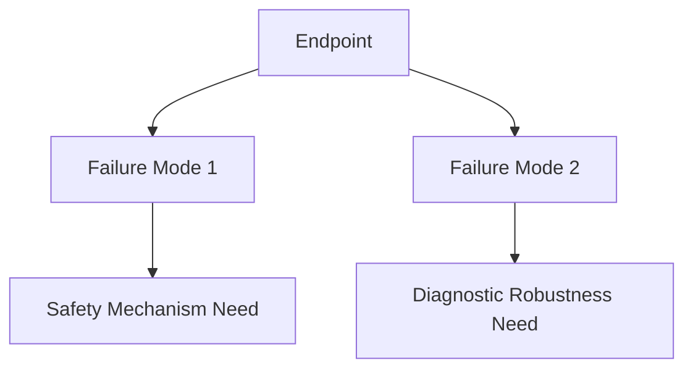

**Figure 12. Failure mode mapping adds safety semantics to structural endpoints.**

D05 should not try to compute all metrics yet. It should prepare the mapping so later demos can use it.

---

## 18. Black-Box Boundaries

Real designs contain black boxes.

Examples:

```text
memory macro
PLL
analog block
third-party IP
encrypted IP
hard macro
external interface
```

A structural tool must handle black boxes explicitly.

Possible policies:

```text
stop at black-box input
treat black-box output as startpoint
use user-supplied summary model
require supplier safety data
mark cone as incomplete
```

Example black-box summary:

```yaml
blackboxes:
  - instance: top.u_sram
    type: memory_macro
    policy: user_summary
    outputs_as_startpoints: true
    fit_source: supplier_override
    review_status: draft
```

If a cone crosses a black-box boundary, the report should say so.

Example:

```csv
endpoint,blackbox_boundary,status,comment
top.u_bus.rdata,top.u_sram,incomplete,user summary required
```

A safe engineering flow should never silently pretend that black-box structure is known.

---

## 19. Clock, Reset, and Test Logic Exclusions

Structural analysis must be careful with global signals.

Signals such as:

```text
clock
reset
scan enable
test mode
DFT control
power isolation enable
```

can appear in many cones.

If not handled carefully, they can dominate reports and obscure the real safety structure.

D05 should support exclusion or special classification:

```yaml
special_signals:
  clocks:
    - clk
  resets:
    - rst_n
  test_controls:
    - scan_en
    - test_mode
```

Policy examples:

```text
exclude clocks from fault startpoints
include resets only if reset safety is being analyzed
exclude scan/test logic in functional safety mode
tag test-mode paths separately
```

This is not just a tool convenience. It affects safety interpretation.

---

## 20. Structural Output Artifacts

D05 should generate machine-readable and human-readable outputs.

Suggested outputs:

```text
outputs/structure_summary.md
outputs/hierarchy.json
outputs/connectivity_graph.json
outputs/startpoints.csv
outputs/endpoints.csv
outputs/cones.csv
outputs/startpoint_usage.csv
outputs/endpoint_to_sm_check.csv
outputs/part_subpart_map_check.csv
outputs/blackbox_boundary_report.csv
```

Example `startpoints.csv`:

```csv
startpoint,type,module,width,reason
toy_counter.count_reg,flip_flop_array,toy_counter,8,state element
toy_counter.parity_reg,flip_flop,toy_counter,1,state element
toy_counter.en,input,toy_counter,1,primary input
```

Example `endpoints.csv`:

```csv
endpoint,type,module,width,safety_relevance
toy_counter.count,output,toy_counter,8,safety_related
toy_counter.alarm,output,toy_counter,1,diagnostic
toy_counter.count_parity,output,toy_counter,1,diagnostic_state
```

Example `cones.csv`:

```csv
endpoint,startpoints,internal_nodes,cone_size
toy_counter.count,toy_counter.count_reg;toy_counter.en,next_count_logic,3
toy_counter.alarm,toy_counter.count_reg;toy_counter.parity_reg,expected_parity;parity_compare,4
```

---

## 21. The `safeic-structure` Tool Architecture

The tool can be implemented as a staged pipeline.

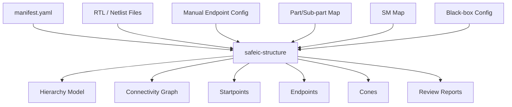

**Figure 13. `safeic-structure` converts design files and safety mappings into structural safety artifacts.**

Suggested internal modules:

```text
safeic_structure/
  cli.py
  manifest.py
  rtl_frontend.py
  hierarchy.py
  connectivity.py
  startpoint.py
  endpoint.py
  cone.py
  partmap.py
  smmap_check.py
  blackbox.py
  report.py
```

Responsibilities:

| Module | Responsibility |
|---|---|
| `rtl_frontend.py` | Load normalized RTL/netlist representation |
| `hierarchy.py` | Build instance and module hierarchy |
| `connectivity.py` | Build signal dependency graph |
| `startpoint.py` | Discover or load startpoint candidates |
| `endpoint.py` | Discover or load endpoint candidates |
| `cone.py` | Extract backward and forward cones |
| `partmap.py` | Validate part/sub-part mapping |
| `smmap_check.py` | Validate endpoint-to-safety-mechanism mapping |
| `blackbox.py` | Identify black-box boundaries |
| `report.py` | Generate CSV, JSON, and Markdown outputs |

---

## 22. Using Open-Source Frontends

For an open educational implementation, the structural frontend can be built in stages.

### Stage 1: Manual Toy Graph

Use a small hand-written structural graph for `toy_counter`.

This keeps the first demo simple.

### Stage 2: RTL Parsing

Use a lightweight parser to identify modules, ports, assignments, and registers.

### Stage 3: Yosys-Based Normalization

Use an open-source synthesis frontend to convert RTL into a normalized representation.

A normalized intermediate representation can make structural analysis easier because it exposes cells, wires, connections, memories, and processes in a consistent form.

### Stage 4: Netlist-Based Graph

Use synthesized netlist output to build a more accurate graph.

### Stage 5: Name Mapping

Add RTL-to-netlist name mapping so reports remain reviewable.

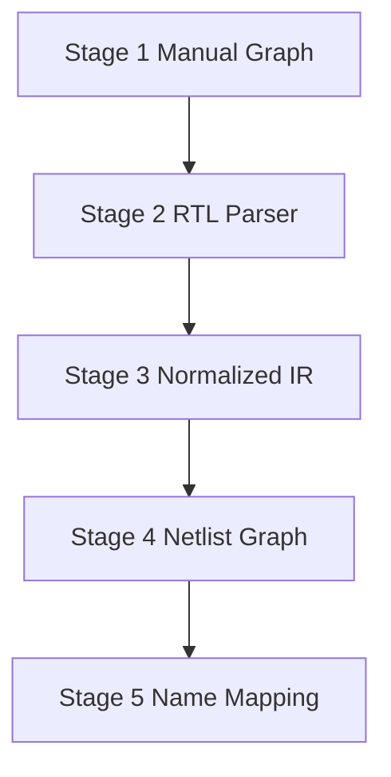

**Figure 14. D05 can start with a simple graph and evolve toward normalized RTL/netlist structural analysis.**

The staged approach avoids overbuilding while still pointing toward a realistic architecture.

---

## 23. D05 Directory Structure

Suggested directory:

```text
D05_structural_safety_model/
  README.md
  run_demo.sh
  run_demo.csh
  manifest.yaml

  inputs/
    rtl/
      toy_counter.v
    filelist.f
    top.yaml
    endpoints.yaml
    startpoint_policy.yaml
    safety_mechanisms.yaml
    ep_to_sm_map.csv
    failure_modes.yaml
    part_subpart_map.yaml
    blackbox.yaml
    special_signals.yaml

  intermediate/
    normalized_design.json
    hierarchy.json
    connectivity_graph.json

  outputs/
    structure_summary.md
    startpoints.csv
    endpoints.csv
    cones.csv
    startpoint_usage.csv
    endpoint_to_sm_check.csv
    part_subpart_map_check.csv
    blackbox_boundary_report.csv
```

This structure separates:

```text
design input
manual safety mapping
intermediate structural model
reviewable reports
```

---

## 24. D05 Manifest

Example `manifest.yaml`:

```yaml
project:
  name: automotive_safeic_practice
  demo: D05_structural_safety_model
  top_module: toy_counter

design:
  filelist: inputs/filelist.f
  top_config: inputs/top.yaml

structure:
  endpoint_config: inputs/endpoints.yaml
  startpoint_policy: inputs/startpoint_policy.yaml
  special_signals: inputs/special_signals.yaml
  blackbox_config: inputs/blackbox.yaml

safety:
  safety_mechanisms: inputs/safety_mechanisms.yaml
  ep_to_sm_map: inputs/ep_to_sm_map.csv
  failure_modes: inputs/failure_modes.yaml
  part_subpart_map: inputs/part_subpart_map.yaml

outputs:
  structure_summary: outputs/structure_summary.md
  hierarchy: intermediate/hierarchy.json
  connectivity_graph: intermediate/connectivity_graph.json
  startpoints: outputs/startpoints.csv
  endpoints: outputs/endpoints.csv
  cones: outputs/cones.csv
  startpoint_usage: outputs/startpoint_usage.csv
```

The manifest ensures the structural run is reproducible.

---

## 25. D05 Execution Flow

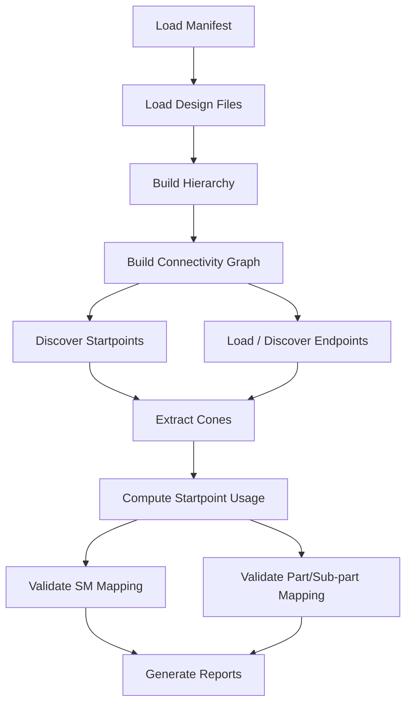

**Figure 15. D05 execution flow: from design files to cones, mappings, and structural reports.**

Example bash script:

```bash
#!/usr/bin/env bash
set -euo pipefail

safeic-structure \
  --manifest manifest.yaml \
  --output-dir outputs
```

Example csh script:

```csh
#!/bin/csh -f

set DEMO = D05_structural_safety_model
echo "Running $DEMO"

safeic-structure \
  --manifest manifest.yaml \
  --output-dir outputs
```

Expected outputs:

```text
outputs/structure_summary.md
outputs/startpoints.csv
outputs/endpoints.csv
outputs/cones.csv
outputs/startpoint_usage.csv
outputs/endpoint_to_sm_check.csv
outputs/part_subpart_map_check.csv
outputs/blackbox_boundary_report.csv
```

---

## 26. Example Toy Design

A small counter with parity remains useful for D05.

```verilog
module toy_counter (
  input  logic clk,
  input  logic rst_n,
  input  logic en,
  output logic [7:0] count,
  output logic count_parity,
  output logic alarm
);

  logic expected_parity;

  always_ff @(posedge clk or negedge rst_n) begin
    if (!rst_n) begin
      count <= 8'h00;
      count_parity <= 1'b0;
    end else if (en) begin
      count <= count + 8'h01;
      count_parity <= ^(count + 8'h01);
    end
  end

  assign expected_parity = ^count;
  assign alarm = (expected_parity != count_parity);

endmodule
```

Structural interpretation:

```text
startpoints:
  count
  count_parity
  en

endpoints:
  count
  count_parity
  alarm

cone for alarm:
  count
  count_parity
  expected_parity
  parity compare
```

This design is small enough to inspect manually but still demonstrates:

```text
state endpoint
diagnostic endpoint
alarm path
parity safety mechanism
unprotected alarm path
```

---

## 27. Example `structure_summary.md`

A useful summary report:

```md
# D05 Structural Safety Model Summary

Project: automotive_safeic_practice
Demo: D05_structural_safety_model
Top: toy_counter

## Hierarchy

- toy_counter

## Startpoints

Total startpoints: 3

- toy_counter.count
- toy_counter.count_parity
- toy_counter.en

## Endpoints

Total endpoints: 3

- toy_counter.count
- toy_counter.count_parity
- toy_counter.alarm

## Cones

Endpoint: toy_counter.count
Startpoints:
- toy_counter.count
- toy_counter.en

Endpoint: toy_counter.alarm
Startpoints:
- toy_counter.count
- toy_counter.count_parity

## Safety Mechanism Mapping

- toy_counter.count → endpoint_parity → toy_counter.alarm
- toy_counter.alarm → no protection modeled

## Review Items

- Alarm path is not protected.
- Reset path excluded by policy.
- Clock path excluded by policy.
```

The goal is to make the structural assumptions visible.

---

## 28. Validation Rules

`safeic-structure` should validate:

```text
filelist exists
top module exists
RTL files exist
endpoint names are syntactically valid
startpoint policy is valid
special signal policy is valid
part/sub-part map references existing objects
safety mechanism map references existing endpoints
alarm signals exist
black-box policy is explicit
cones are generated for all endpoints
unresolved endpoints are reported
```

Example messages:

```text
[PASS] top module toy_counter found
[PASS] endpoint toy_counter.alarm found
[PASS] safety mechanism endpoint_parity exists
[WARN] endpoint toy_counter.alarm has no safety mechanism mapping
[WARN] reset signal rst_n excluded from startpoints by policy
[ERROR] endpoint top.u_ctrl.hidden_state not found in design
```

A structural tool should never silently drop unknown endpoints.

---

## 29. Common Mistakes

### 29.1 Treating Signal Lists as Structure

A list of signals is not a structural model.

Structure requires connectivity:

```text
who drives whom
which nodes influence which endpoints
which cones contain which startpoints
```

### 29.2 Ignoring Hierarchy

Flat names are hard to review.

Keep hierarchy where possible.

### 29.3 Ignoring Black Boxes

Black boxes should be explicitly marked and summarized.

Do not silently assume they have no fault contribution.

### 29.4 Treating All Endpoints as Equal

Some endpoints are safety-critical outputs.

Some endpoints are diagnostic alarms.

Some endpoints are internal state.

Their failure modes are different.

### 29.5 Mixing Test Logic with Functional Safety Logic

Scan/test logic may not be active in operational mode.

It should be excluded or tagged according to policy.

### 29.6 Assuming Coverage Without Scope

A safety mechanism name is not enough.

Always define whether it covers:

```text
endpoint
cone
path
memory
alarm path
```

---

## 30. How D05 Connects to Later Demos

D05 produces structural artifacts that later stages consume.

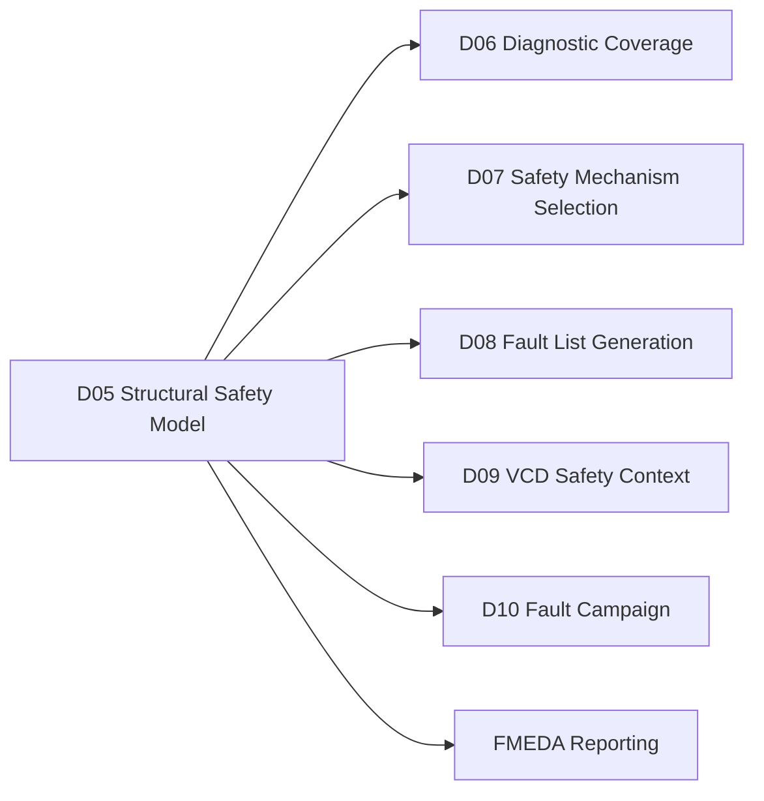

**Figure 16. D05 creates the structural foundation for DC, fault generation, fault campaign, and FMEDA.**

The output of D05 is not the final safety answer.

It is the map that makes later answers meaningful.

---

## 31. Recommended Implementation Stages

D05 should be implemented in stages.

### Stage 1: Hand-Written Toy Structure

Use a manually defined graph for `toy_counter`.

Deliverables:

```text
startpoints.csv
endpoints.csv
cones.csv
structure_summary.md
```

### Stage 2: Simple RTL Extraction

Parse modules, ports, assignments, and simple always blocks.

Deliverables:

```text
hierarchy.json
connectivity_graph.json
```

### Stage 3: Normalized IR Frontend

Use a normalized synthesis representation to improve accuracy.

Deliverables:

```text
normalized_design.json
```

### Stage 4: Cone and Usage Reports

Generate:

```text
cones.csv
startpoint_usage.csv
blackbox_boundary_report.csv
```

### Stage 5: Mapping Validation

Validate:

```text
ep_to_sm_map.csv
part_subpart_map.yaml
failure_modes.yaml
```

This staged path makes D05 practical while keeping future expansion clear.

---

## 32. Summary

A functional safety workflow cannot be built only on FIT numbers or raw fault lists.

It needs a structural safety model.

The D05 demo:

```text
D05_structural_safety_model
```

introduces the generic tool:

```text
safeic-structure
```

The tool converts design and safety mapping inputs into:

```text
hierarchy model
connectivity graph
startpoints
endpoints
cones
startpoint usage
part/sub-part validation
endpoint-to-safety-mechanism validation
black-box boundary report
```

The central lesson is:

> FIT tells us how much random hardware failure exposure exists. Structural safety modeling tells us where that exposure can propagate and which endpoints require protection.

This structural layer is the bridge between:

```text
BFR
→ diagnostic coverage
→ safety mechanism mapping
→ fault list generation
→ fault campaign
→ FMEDA
```

Without this bridge, later safety metrics become disconnected from the actual design.

---

## 33. D05 Demo Checklist

For `D05_structural_safety_model`, the expected deliverables are:

```text
[ ] README.md
[ ] run_demo.sh
[ ] run_demo.csh
[ ] manifest.yaml

[ ] inputs/rtl/toy_counter.v
[ ] inputs/filelist.f
[ ] inputs/top.yaml
[ ] inputs/endpoints.yaml
[ ] inputs/startpoint_policy.yaml
[ ] inputs/safety_mechanisms.yaml
[ ] inputs/ep_to_sm_map.csv
[ ] inputs/failure_modes.yaml
[ ] inputs/part_subpart_map.yaml
[ ] inputs/blackbox.yaml
[ ] inputs/special_signals.yaml

[ ] intermediate/normalized_design.json
[ ] intermediate/hierarchy.json
[ ] intermediate/connectivity_graph.json

[ ] outputs/structure_summary.md
[ ] outputs/startpoints.csv
[ ] outputs/endpoints.csv
[ ] outputs/cones.csv
[ ] outputs/startpoint_usage.csv
[ ] outputs/endpoint_to_sm_check.csv
[ ] outputs/part_subpart_map_check.csv
[ ] outputs/blackbox_boundary_report.csv
```

A successful D05 run should answer:

```text
What hierarchy is being analyzed?
Which objects are startpoints?
Which objects are endpoints?
Which startpoints can reach which endpoints?
Which cones are safety-relevant?
Which endpoints are protected by which safety mechanisms?
Which endpoints have no protection modeled?
Which objects map to FMEDA parts and sub-parts?
Which black-box boundaries remain unresolved?
Can the structural output feed DC, fault list generation, and FMEDA?
```
