# [Automotive Safe-IC Practice 06] Diagnostic Coverage Is Not Just a Percentage: Computing DC from Structure, Scope, and Safety Mechanisms

**Author**: Darren H. Chen  
**Direction**: Automotive Chip Functional Safety Analysis and Fault Injection Practice  
**Demo**: D06_diagnostic_coverage  
**Tags**: Automotive Chip, Functional Safety, Diagnostic Coverage, DC, Safety Mechanism, FIT, FMEDA, Startpoint, Endpoint, Cone, Fault Injection, Residual FIT

---

## 1. Why This Article Matters

Diagnostic Coverage, usually abbreviated as **DC**, is one of the most frequently mentioned concepts in automotive chip functional safety.

It is also one of the easiest concepts to misuse.

A common but dangerous statement is:

```text
This block has 90% diagnostic coverage.
```

This statement is incomplete.

A better engineering question is:

```text
90% coverage of what?
Which fault type?
Which structure?
Which endpoint?
Which cone?
Which safety mechanism?
Which failure mode?
Under which assumption?
Was it estimated or measured?
```

The sixth demo in this repository is:

```text
D06_diagnostic_coverage
```

The generic tool introduced in this article is:

```text
safeic-dc
```

The purpose of `safeic-dc` is to compute a reviewable diagnostic coverage estimate from:

```text
structural safety model
safety mechanism library
endpoint-to-safety-mechanism map
failure mode mapping
BFR / FIT contribution data
coverage assumptions
```

The central idea is:

> Diagnostic Coverage is not a standalone percentage. It is a structured claim that a specific safety mechanism covers a specific fault effect over a specific design scope.

---

## 2. Why DC Comes After Structural Modeling

In the previous article, we built the structural safety model:

```text
startpoints
endpoints
cones
startpoint usage
part/sub-part mapping
endpoint-to-safety-mechanism mapping
```

This structure is necessary because diagnostic coverage has a scope.

A safety mechanism may cover:

```text
only an endpoint
a logic cone
a memory array
a transaction path
a duplicated compute path
a protocol sequence
an alarm path
```

Without structure, we cannot know what the mechanism actually covers.

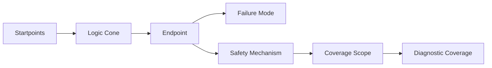

**Figure 1. Diagnostic coverage depends on the structural scope protected by the safety mechanism.**

This is why D06 consumes D05 outputs.

D05 tells us:

```text
where faults can propagate
```

D06 estimates:

```text
how much of that propagation is detected, corrected, masked, or controlled
```

---

## 3. A Minimal Definition of Diagnostic Coverage

A simplified engineering definition is:

```text
DC = covered relevant faults / total relevant faults
```

However, each word in this definition requires care.

```text
covered:
  detected, corrected, masked, or controlled by a safety mechanism

relevant:
  meaningful for a failure mode, endpoint, cone, part, or safety goal

faults:
  not only raw fault nodes, but fault effects under defined assumptions
```

A more useful form is:

```text
DC(scope, mechanism, fault_model, failure_mode)
```

This means:

```text
Diagnostic coverage is a function of scope, mechanism, fault model, and failure semantics.
```

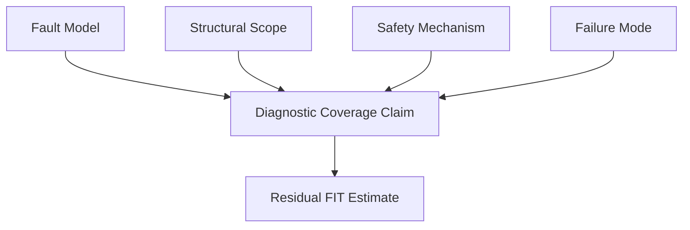

**Figure 2. A DC claim should specify fault model, structural scope, safety mechanism, and failure mode.**

A percentage without these dimensions is not reviewable.

---

## 4. Estimated DC vs Measured DC

A disciplined safety workflow must distinguish:

```text
estimated DC
calculated DC
measured DC
```

| Type | Meaning | Source |
|---|---|---|
| Estimated DC | Claimed or assumed coverage before validation | Safety architecture, SM library, expert assumption |
| Calculated DC | Coverage computed from structure and mapping assumptions | Structural model, EP-to-SM map, FIT data |
| Measured DC | Coverage derived from fault campaign outcomes | Fault injection results |

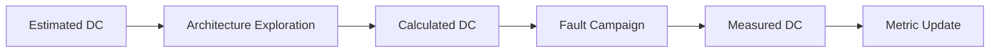

**Figure 3. Estimated DC guides architecture; measured DC comes from fault campaign evidence.**

D06 focuses mainly on estimated and calculated DC.

Later fault campaign demos will measure whether these assumptions are valid under simulation context.

The key rule is:

> Never confuse a coverage assumption with validated evidence.

---

## 5. Safety Mechanism Scope

Different safety mechanisms protect different scopes.

A parity check, ECC decoder, bus CRC, lockstep comparator, protocol checker, and watchdog are not interchangeable.

| Safety Mechanism | Typical Scope | Example |
|---|---|---|
| Endpoint parity | Endpoint state | Register group parity |
| ECC | Memory or register file state | SRAM ECC, register file ECC |
| End-to-end CRC | Transaction path | Bus command/response integrity |
| Duplication | Logic cone or endpoint | Redundant combinational or sequential logic |
| Lockstep | Duplicated compute path | CPU core lockstep comparison |
| Protocol checker | Temporal/control behavior | FSM transition check |
| Watchdog | Temporal progress | Missing response detection |
| Alarm monitor | Diagnostic path | Alarm stuck or masked detection |

A safety mechanism library must describe this scope.

Example:

```yaml
mechanisms:
  endpoint_parity:
    type: endpoint
    coverage_scope:
      endpoint: 0.90
      cone: 0.00
      path: 0.00
      alarm_path: 0.00
    detects:
      - single_bit_error
    corrects: false

  memory_ecc:
    type: memory
    coverage_scope:
      memory: 0.99
      endpoint: 0.95
      alarm_path: 0.00
    detects:
      - single_bit_error
      - selected_multi_bit_error
    corrects: true

  end_to_end_crc:
    type: path
    coverage_scope:
      path: 0.95
      endpoint: 0.80
      cone: 0.00
    detects:
      - data_corruption
      - transaction_corruption
    corrects: false

  lockstep:
    type: compute_path
    coverage_scope:
      cone: 0.95
      endpoint: 0.95
      comparator: 0.90
      alarm_path: 0.00
    detects:
      - logic_error
      - state_divergence
    corrects: false
```

The numeric values are demo assumptions. In a real project, they must be justified and validated.

---

## 6. Coverage Scope Is Not the Same as Signal Location

A safety mechanism can be physically near an endpoint but not cover the whole cone.

Example:

```text
endpoint parity on register output
```

may detect corruption of stored endpoint state, but it may not detect errors created in the upstream combinational logic before the next capture.

Another example:

```text
bus CRC
```

may protect transaction data from source to destination, but it may not protect local control state outside the transaction path.

A lockstep comparator may compare core outputs, but:

```text
comparator fault
alarm path fault
reset response fault
common-cause fault
```

may still need separate consideration.


**Figure 4. Endpoint protection does not automatically imply cone protection.**

Therefore, `safeic-dc` must compute coverage according to declared scope, not according to mechanism name alone.

---

## 7. Structural Units for DC Calculation

D06 uses three major structural units:

```text
endpoint
startpoint
cone
```

A practical DC engine should be able to compute coverage at multiple levels:

```text
endpoint-level DC
startpoint-level DC
cone-level DC
path-level DC
part/sub-part-level DC
failure-mode-level DC
```

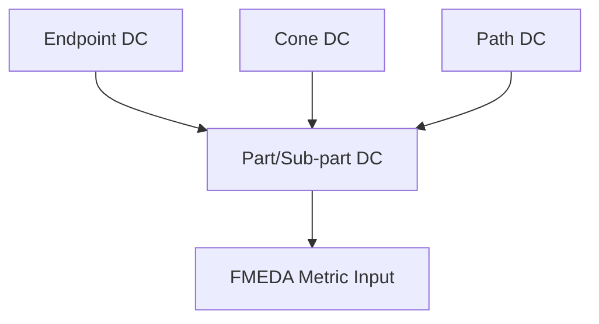

**Figure 5. Diagnostic coverage can be computed at endpoint, cone, path, part, and failure-mode levels.**

For a toy design, endpoint-level and cone-level DC are enough.

For a real SoC, path-level, part-level, and failure-mode-level roll-up become important.

---

## 8. Endpoint-Level DC

Endpoint-level DC focuses on whether the endpoint state or value is protected.

Example:

```text
Endpoint:
  toy_counter.count

Safety mechanism:
  endpoint_parity

Assumption:
  endpoint parity detects 90% of relevant single-bit endpoint corruptions

Endpoint DC:
  0.90
```

Input mapping:

```csv
endpoint,safety_mechanism,scope,dc_estimate,alarm,failure_mode
toy_counter.count,endpoint_parity,endpoint,0.90,toy_counter.alarm,FM_DATA_CORRUPTION
```

Output:

```csv
endpoint,failure_mode,mechanism,endpoint_dc,alarm,review_status
toy_counter.count,FM_DATA_CORRUPTION,endpoint_parity,0.90,toy_counter.alarm,draft
```

Endpoint DC is useful, but it is not enough if the safety mechanism does not cover upstream logic.

---

## 9. Cone-Level DC

Cone-level DC asks:

```text
Does the safety mechanism cover the upstream logic that can influence the endpoint?
```

Example:

```text
Endpoint:
  toy_counter.alarm

Cone:
  toy_counter.count
  toy_counter.count_parity
  expected_parity
  parity_compare

Safety mechanism:
  none for alarm path

Cone DC:
  0.00 for alarm path protection
```

Another example:

```text
Safety mechanism:
  duplication of compute cone

Coverage:
  cone = 0.95
  endpoint = 0.90
```

Cone-level output:

```csv
endpoint,cone_size,covered_cone_nodes,total_cone_nodes,cone_dc,mechanism
toy_counter.alarm,4,0,4,0.00,none
top.u_ctrl.safe_state,180,171,180,0.95,cone_duplication
```

The key idea is:

> A safety mechanism that only checks the endpoint may leave the cone uncovered.

---

## 10. Startpoint-Level DC

Startpoint-level DC asks:

```text
If a fault starts here, is its effect detected or controlled before reaching a safety-relevant endpoint?
```

This is useful for prioritization.

Example:

```csv
startpoint,affected_endpoints,mechanisms,max_dc,min_dc,comment
toy_counter.count_reg,toy_counter.count;toy_counter.alarm,endpoint_parity,0.90,0.00,count protected but alarm path unprotected
toy_counter.parity_reg,toy_counter.alarm,none,0.00,0.00,parity state fault can block diagnosis
```

Startpoint-level DC helps identify:

```text
high-impact unprotected startpoints
common-cause propagation sources
diagnostic path weaknesses
configuration registers that affect many endpoints
```

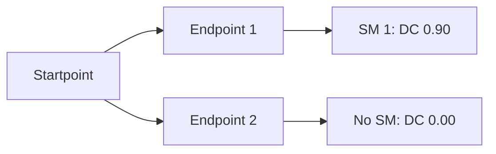

**Figure 6. One startpoint may have different coverage depending on which endpoint path is considered.**

This is why DC roll-up must be careful.

---

## 11. Combining Endpoint and Cone Coverage

A safety mechanism may cover multiple scopes.

A simplified combined DC model can use weighted contribution:

```text
combined_dc =
  (endpoint_weight × endpoint_dc +
   cone_weight × cone_dc +
   path_weight × path_dc) /
  (endpoint_weight + cone_weight + path_weight)
```

The weights can be based on:

```text
FIT contribution
fault count
cone node count
endpoint criticality
manual safety weighting
failure mode severity
```

For a demo, use a simple weight model:

```yaml
dc_weighting:
  endpoint_weight: 1.0
  cone_weight: 1.0
  path_weight: 1.0
```

For a more useful model, use FIT-based weights:

```text
combined_dc =
  Σ(covered_fit_i × dc_i) / Σ(total_fit_i)
```

This is more meaningful because it weights coverage by failure-rate contribution.

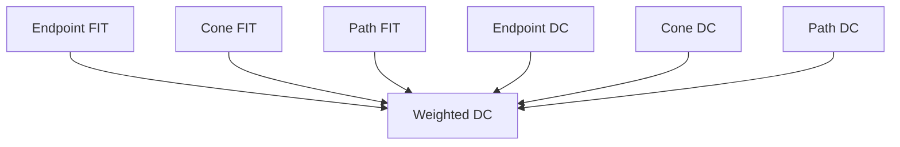

**Figure 7. FIT-weighted DC is more meaningful than simple fault-count averaging.**

For D06, both simple and FIT-weighted modes can be supported.

---

## 12. Residual FIT from DC

Once DC is known, residual contribution can be estimated.

A simplified formula:

```text
residual_fit = base_fit × (1 - dc)
```

Example:

```text
base_fit = 10 FIT
dc = 0.90
residual_fit = 10 × (1 - 0.90) = 1 FIT
```

For endpoint-level contribution:

```csv
endpoint,base_fit,dc,residual_fit
toy_counter.count,0.064,0.90,0.0064
toy_counter.alarm,0.010,0.00,0.0100
```

This residual estimate is not final proof of safety. It is a structured safety-analysis estimate.

Later fault injection can replace or refine the DC value.


**Figure 8. DC converts base FIT into residual FIT estimate.**

---

## 13. Failure Mode Matters

The same endpoint can have multiple failure modes.

Example:

```text
Endpoint:
  toy_counter.alarm

Failure mode A:
  alarm_not_asserted

Failure mode B:
  false_alarm
```

A safety mechanism may cover one failure mode but not another.

Example:

```text
Alarm monitor:
  may detect alarm_not_asserted

Debounce or filtering:
  may reduce false_alarm

Redundant alarm:
  may help both, depending on design
```

Therefore DC should be indexed by failure mode.

Example:

```csv
endpoint,failure_mode,mechanism,dc
toy_counter.alarm,FM_ALARM_NOT_ASSERTED,none,0.00
toy_counter.alarm,FM_FALSE_ALARM,none,0.00
toy_counter.count,FM_DATA_CORRUPTION,endpoint_parity,0.90
```

This is more precise than:

```text
toy_counter.alarm has 0% DC
```

because it says which failure mode is uncovered.

---

## 14. Alarm Path Coverage

An alarm signal is part of the safety mechanism evidence chain.

But alarm paths themselves can fail.

Example:

```text
fault occurs
parity mismatch happens
alarm logic should assert
alarm path stuck at 0
system never receives the diagnostic event
```

If the alarm path is not modeled, a DC estimate may be too optimistic.

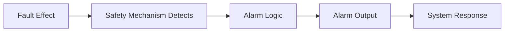

**Figure 9. Detection is not complete if the alarm reporting path is broken or unmodeled.**

For D06, alarm path coverage can be represented as:

```yaml
alarm_paths:
  - alarm: toy_counter.alarm
    protected_by: none
    dc_estimate: 0.00
    review_status: draft
```

The output should flag:

```text
mechanism requires alarm but alarm path has no protection modeled
```

This is a common and important safety weakness.

---

## 15. Diagnostic Coverage and Safe Faults

Fault injection often classifies faults as:

```text
detected
safe
unsafe
unresolved
```

For calculated DC, we may not yet have fault injection results.

But conceptually:

```text
Detected faults contribute to diagnostic coverage.
Safe faults may reduce safety-relevant exposure.
Unsafe faults remain residual risk.
Unresolved faults require further evidence.
```

A measured DC formula may look like:

```text
measured_dc = detected / (detected + unsafe)
```

Another metric may account for safe faults differently, depending on the reporting rule.

D06 does not define final measured DC. It prepares estimated/calculated DC before campaign.

Later measured results should be compared against D06 estimates.

---

## 16. Input Files for D06

D06 consumes outputs from D05 and earlier demos.

Suggested inputs:

```text
inputs/
  safety_mechanisms.yaml
  ep_to_sm_map.csv
  failure_modes.yaml
  dc_policy.yaml

intermediate/
  structure_graph.json
  startpoints.csv
  endpoints.csv
  cones.csv
  startpoint_usage.csv

optional/
  base_fit_report.csv
  instance_fit.csv
```

`dc_policy.yaml` defines how to compute coverage.

Example:

```yaml
dc_policy:
  mode: fit_weighted
  default_unprotected_dc: 0.0
  require_failure_mode: true
  require_alarm_for_detecting_mechanism: true

  rollup:
    method: weighted_average
    weight_source: base_fit
    unresolved_policy: report_separately

  validation:
    reject_dc_out_of_range: true
    warn_if_alarm_path_unprotected: true
    warn_if_endpoint_unmapped: true
```

This policy file is important because DC calculation contains assumptions.

---

## 17. The `safeic-dc` Tool Architecture

The generic tool `safeic-dc` can be implemented as a staged pipeline.

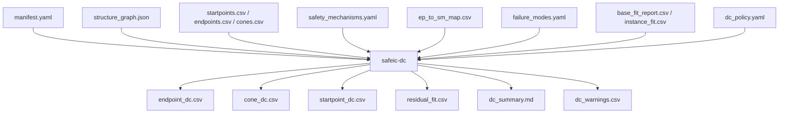

**Figure 10. `safeic-dc` computes coverage and residual estimates from structure, SM mapping, and FIT contribution.**

Suggested internal modules:

```text
safeic_dc/
  cli.py
  manifest.py
  load_structure.py
  load_sm_library.py
  load_mapping.py
  validate_mapping.py
  endpoint_dc.py
  cone_dc.py
  startpoint_dc.py
  fit_weighting.py
  rollup.py
  report.py
```

Responsibilities:

| Module | Responsibility |
|---|---|
| `load_structure.py` | Load endpoints, startpoints, cones |
| `load_sm_library.py` | Load safety mechanism definitions |
| `load_mapping.py` | Load EP-to-SM map |
| `validate_mapping.py` | Check missing endpoints, alarms, mechanisms, ranges |
| `endpoint_dc.py` | Compute endpoint-level DC |
| `cone_dc.py` | Compute cone-level DC |
| `startpoint_dc.py` | Compute startpoint-level coverage |
| `fit_weighting.py` | Apply BFR or instance FIT weights |
| `rollup.py` | Generate part/sub-part/failure-mode roll-up |
| `report.py` | Produce CSV, JSON, and Markdown reports |

---

## 18. D06 Directory Structure

Suggested directory:

```text
D06_diagnostic_coverage/
  README.md
  run_demo.sh
  run_demo.csh
  manifest.yaml

  inputs/
    safety_mechanisms.yaml
    ep_to_sm_map.csv
    failure_modes.yaml
    dc_policy.yaml

  intermediate/
    structure_graph.json
    startpoints.csv
    endpoints.csv
    cones.csv
    startpoint_usage.csv
    base_fit_report.csv
    instance_fit.csv

  outputs/
    endpoint_dc.csv
    cone_dc.csv
    startpoint_dc.csv
    residual_fit.csv
    dc_rollup_by_failure_mode.csv
    dc_rollup_by_part.csv
    dc_summary.md
    dc_warnings.csv
```

The key point is that D06 does not re-extract structure.

It consumes D05 artifacts.

---

## 19. D06 Manifest

Example `manifest.yaml`:

```yaml
project:
  name: automotive_safeic_practice
  demo: D06_diagnostic_coverage
  top_module: toy_counter

inputs:
  safety_mechanisms: inputs/safety_mechanisms.yaml
  ep_to_sm_map: inputs/ep_to_sm_map.csv
  failure_modes: inputs/failure_modes.yaml
  dc_policy: inputs/dc_policy.yaml

structure:
  graph: intermediate/structure_graph.json
  startpoints: intermediate/startpoints.csv
  endpoints: intermediate/endpoints.csv
  cones: intermediate/cones.csv
  startpoint_usage: intermediate/startpoint_usage.csv

fit:
  base_fit_report: intermediate/base_fit_report.csv
  instance_fit: intermediate/instance_fit.csv

outputs:
  endpoint_dc: outputs/endpoint_dc.csv
  cone_dc: outputs/cone_dc.csv
  startpoint_dc: outputs/startpoint_dc.csv
  residual_fit: outputs/residual_fit.csv
  summary: outputs/dc_summary.md
```

The manifest makes the DC run reproducible.

---

## 20. D06 Execution Flow

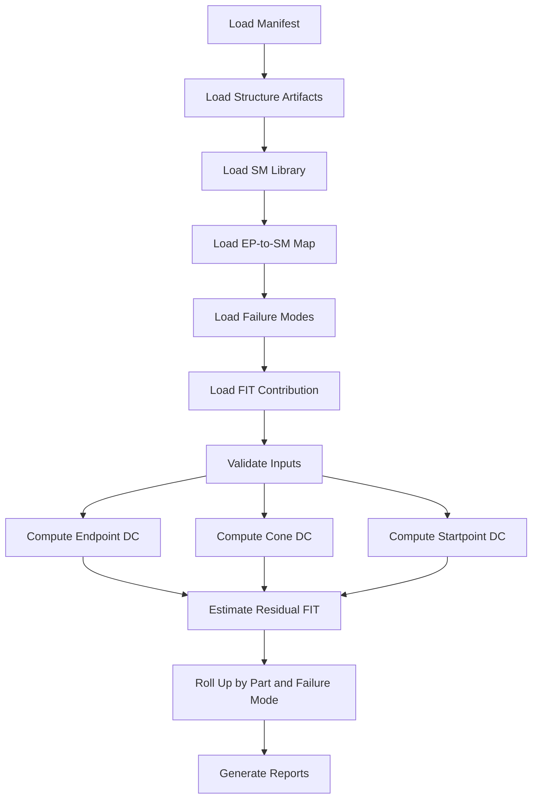

**Figure 11. D06 execution flow: validate, compute coverage, estimate residual FIT, and roll up reports.**

Example bash script:

```bash
#!/usr/bin/env bash
set -euo pipefail

safeic-dc \
  --manifest manifest.yaml \
  --output-dir outputs
```

Example csh script:

```csh
#!/bin/csh -f

set DEMO = D06_diagnostic_coverage
echo "Running $DEMO"

safeic-dc \
  --manifest manifest.yaml \
  --output-dir outputs
```

Expected outputs:

```text
outputs/endpoint_dc.csv
outputs/cone_dc.csv
outputs/startpoint_dc.csv
outputs/residual_fit.csv
outputs/dc_rollup_by_failure_mode.csv
outputs/dc_rollup_by_part.csv
outputs/dc_summary.md
outputs/dc_warnings.csv
```

---

## 21. Example Safety Mechanism Library

For the toy counter:

```yaml
mechanisms:
  endpoint_parity:
    description: Parity check on counter state.
    type: endpoint
    coverage_scope:
      endpoint: 0.90
      cone: 0.00
      path: 0.00
      alarm_path: 0.00
    alarm_required: true
    corrects: false
    detects:
      - single_bit_error

  none:
    description: No safety mechanism modeled.
    type: none
    coverage_scope:
      endpoint: 0.00
      cone: 0.00
      path: 0.00
      alarm_path: 0.00
    alarm_required: false
    corrects: false
```

Endpoint mapping:

```csv
endpoint,safety_mechanism,scope,dc_estimate,alarm,failure_mode,review_status
toy_counter.count,endpoint_parity,endpoint,0.90,toy_counter.alarm,FM_DATA_CORRUPTION,draft
toy_counter.count_parity,none,endpoint,0.00,,FM_DIAGNOSTIC_STATE_CORRUPTION,draft
toy_counter.alarm,none,alarm_path,0.00,,FM_ALARM_NOT_ASSERTED,draft
```

This mapping intentionally exposes that:

```text
the counter state is protected by parity
the parity state itself is not protected
the alarm path is not protected
```

That is the kind of insight D06 should produce.

---

## 22. Example Output: `endpoint_dc.csv`

```csv
endpoint,failure_mode,safety_mechanism,scope,dc,alarm,status,comment
toy_counter.count,FM_DATA_CORRUPTION,endpoint_parity,endpoint,0.90,toy_counter.alarm,PASS,endpoint parity mapped
toy_counter.count_parity,FM_DIAGNOSTIC_STATE_CORRUPTION,none,endpoint,0.00,,WARN,no protection modeled
toy_counter.alarm,FM_ALARM_NOT_ASSERTED,none,alarm_path,0.00,,WARN,alarm path unprotected
```

This report is more useful than saying:

```text
overall DC = 90%
```

because it shows what is and is not covered.

---

## 23. Example Output: `cone_dc.csv`

```csv
endpoint,cone_size,safety_mechanism,endpoint_dc,cone_dc,path_dc,alarm_path_dc,comment
toy_counter.count,3,endpoint_parity,0.90,0.00,0.00,0.00,endpoint protected but cone not covered
toy_counter.alarm,4,none,0.00,0.00,0.00,0.00,diagnostic path has no separate protection
```

This output highlights an important point:

```text
endpoint protection does not automatically imply cone protection
```

For a more advanced mechanism such as duplication, cone DC could be non-zero.

---

## 24. Example Output: `residual_fit.csv`

Assume instance FIT data:

```csv
endpoint,base_fit
toy_counter.count,0.064
toy_counter.count_parity,0.004
toy_counter.alarm,0.010
```

Then residual output:

```csv
endpoint,failure_mode,base_fit,dc,residual_fit,comment
toy_counter.count,FM_DATA_CORRUPTION,0.064,0.90,0.0064,protected by parity
toy_counter.count_parity,FM_DIAGNOSTIC_STATE_CORRUPTION,0.004,0.00,0.0040,no protection modeled
toy_counter.alarm,FM_ALARM_NOT_ASSERTED,0.010,0.00,0.0100,alarm path unprotected
```

The residual result shows where safety work should focus next.

---

## 25. Roll-Up by Failure Mode

DC should be summarized by failure mode.

Example:

```csv
failure_mode,total_base_fit,covered_fit,residual_fit,weighted_dc
FM_DATA_CORRUPTION,0.064,0.0576,0.0064,0.90
FM_DIAGNOSTIC_STATE_CORRUPTION,0.004,0.0000,0.0040,0.00
FM_ALARM_NOT_ASSERTED,0.010,0.0000,0.0100,0.00
```

Failure-mode roll-up is useful because safety review is usually concerned with functional consequences, not only signal names.

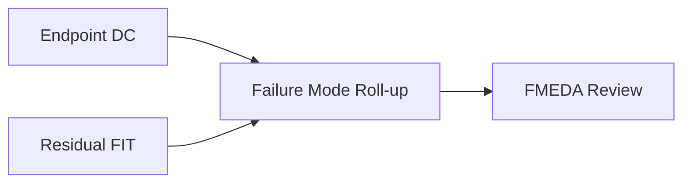

**Figure 12. Failure-mode roll-up connects signal-level DC to safety review semantics.**

---

## 26. Roll-Up by Part and Sub-part

DC can also be summarized by part and sub-part.

Example:

```csv
part,subpart,total_base_fit,residual_fit,weighted_dc,comment
PART_COUNTER,SUBPART_COUNTER_STATE,0.064,0.0064,0.90,state protected by parity
PART_COUNTER,SUBPART_COUNTER_DIAG,0.014,0.0140,0.00,diagnostic state and alarm path unprotected
```

This helps answer:

```text
Which part has the weakest coverage?
Which sub-part dominates residual FIT?
Which diagnostic block is itself unprotected?
```

This is especially important for FMEDA-style reporting.

---

## 27. `dc_summary.md`

A good summary report:

```md
# D06 Diagnostic Coverage Summary

Project: automotive_safeic_practice
Demo: D06_diagnostic_coverage
Top: toy_counter

## Overall Result

Total base FIT: 0.078
Total residual FIT: 0.0204
Weighted DC: 0.738

## Key Findings

1. toy_counter.count is protected by endpoint_parity.
2. toy_counter.count_parity has no protection modeled.
3. toy_counter.alarm path has no protection modeled.
4. Endpoint protection does not cover upstream cone logic.
5. Alarm path coverage should be reviewed.

## Warnings

- Mechanism endpoint_parity requires alarm toy_counter.alarm.
- Alarm toy_counter.alarm has no separate alarm-path protection.
- Cone DC for toy_counter.count is 0.00 because endpoint_parity scope is endpoint-only.
```

The summary should be written for engineering review, not only machine parsing.

---

## 28. Validation Rules

`safeic-dc` should validate:

```text
all endpoints in ep_to_sm_map exist
all safety mechanisms exist
all failure modes exist
all DC values are between 0 and 1
all alarm signals exist if required
all scopes are supported
unmapped endpoints are reported
unprotected endpoints are reported
alarm paths are checked
FIT data is available if fit_weighted mode is selected
roll-up categories are valid
```

Example messages:

```text
[PASS] endpoint toy_counter.count found
[PASS] safety mechanism endpoint_parity found
[PASS] dc_estimate 0.90 is within range
[WARN] endpoint toy_counter.alarm has no protection modeled
[WARN] endpoint_parity requires alarm toy_counter.alarm, but alarm path protection is not modeled
[ERROR] endpoint top.u_ctrl.hidden_state not found in structure graph
[ERROR] dc_estimate 1.25 is out of range
```

A DC tool should never silently ignore unmapped endpoints.

---

## 29. Common Mistakes

### 29.1 Treating DC as a Mechanism Name Property

Bad:

```text
ECC = 99% DC
```

Better:

```text
ECC on this memory array for this fault model under this assumption gives 99% estimated DC.
```

### 29.2 Ignoring Coverage Scope

Endpoint protection does not imply cone protection.

Path protection does not imply unrelated control protection.

### 29.3 Ignoring Alarm Path

Detection is incomplete if the alarm cannot be delivered or observed.

### 29.4 Averaging Percentages Without Weights

Simple arithmetic average can be misleading.

FIT-weighted roll-up is usually more meaningful.

### 29.5 Mixing Estimated and Measured Coverage

Estimated DC comes from assumptions.

Measured DC comes from fault injection evidence.

They should be compared, not mixed.

### 29.6 Hiding Unprotected Endpoints

Unprotected endpoints are not embarrassing. They are engineering review items.

They should be reported explicitly.

---

## 30. Recommended Implementation Stages

D06 can be implemented in stages.

### Stage 1: Endpoint DC

Compute endpoint-level DC from `ep_to_sm_map.csv`.

Deliverables:

```text
endpoint_dc.csv
dc_summary.md
```

### Stage 2: Cone DC

Use D05 cone data to distinguish endpoint coverage from cone coverage.

Deliverables:

```text
cone_dc.csv
dc_warnings.csv
```

### Stage 3: FIT-Weighted Residual

Use base FIT or instance FIT to compute residual FIT.

Deliverables:

```text
residual_fit.csv
```

### Stage 4: Roll-Up

Roll up by failure mode and part/sub-part.

Deliverables:

```text
dc_rollup_by_failure_mode.csv
dc_rollup_by_part.csv
```

### Stage 5: Compare with Measured Results

Later, compare estimated DC with fault campaign measured DC.

Deliverables:

```text
dc_estimated_vs_measured.csv
```

This staged implementation keeps D06 practical while preserving long-term expansion.

---

## 31. How D06 Connects to Later Demos

D06 produces coverage and residual FIT estimates.

These outputs feed later stages:

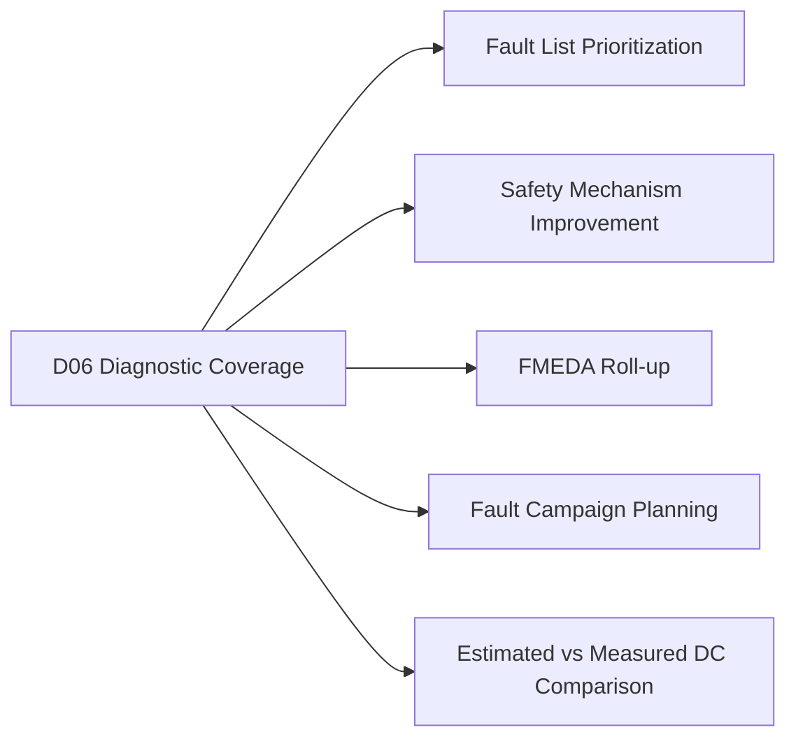

**Figure 13. D06 outputs guide fault list generation, FMEDA roll-up, and fault campaign planning.**

The most important output is not one overall DC number.

The most important output is:

```text
which structure is covered
which structure is not covered
which assumptions produced the result
which residual FIT remains
```

---

## 32. Summary

Diagnostic Coverage is not just a percentage.

It is a structured claim about:

```text
fault model
structural scope
safety mechanism
endpoint
cone
path
failure mode
alarm behavior
coverage assumption
validation status
```

The D06 demo:

```text
D06_diagnostic_coverage
```

introduces the generic tool:

```text
safeic-dc
```

The tool consumes:

```text
D05 structural artifacts
safety_mechanisms.yaml
ep_to_sm_map.csv
failure_modes.yaml
dc_policy.yaml
base_fit_report.csv
instance_fit.csv
```

and generates:

```text
endpoint_dc.csv
cone_dc.csv
startpoint_dc.csv
residual_fit.csv
dc_rollup_by_failure_mode.csv
dc_rollup_by_part.csv
dc_summary.md
dc_warnings.csv
```

The central lesson is:

> A DC value is meaningful only when its structural scope, safety mechanism, failure mode, alarm behavior, and residual FIT impact are explicit.

This is the bridge from structural safety modeling to quantitative safety review.

---

## 33. D06 Demo Checklist

For `D06_diagnostic_coverage`, the expected deliverables are:

```text
[ ] README.md
[ ] run_demo.sh
[ ] run_demo.csh
[ ] manifest.yaml

[ ] inputs/safety_mechanisms.yaml
[ ] inputs/ep_to_sm_map.csv
[ ] inputs/failure_modes.yaml
[ ] inputs/dc_policy.yaml

[ ] intermediate/structure_graph.json
[ ] intermediate/startpoints.csv
[ ] intermediate/endpoints.csv
[ ] intermediate/cones.csv
[ ] intermediate/startpoint_usage.csv
[ ] intermediate/base_fit_report.csv
[ ] intermediate/instance_fit.csv

[ ] outputs/endpoint_dc.csv
[ ] outputs/cone_dc.csv
[ ] outputs/startpoint_dc.csv
[ ] outputs/residual_fit.csv
[ ] outputs/dc_rollup_by_failure_mode.csv
[ ] outputs/dc_rollup_by_part.csv
[ ] outputs/dc_summary.md
[ ] outputs/dc_warnings.csv
```

A successful D06 run should answer:

```text
Which endpoints are protected?
Which endpoints are unprotected?
Which safety mechanisms are mapped?
What structural scope does each mechanism cover?
What is endpoint-level DC?
What is cone-level DC?
What residual FIT remains?
Which failure modes have weak coverage?
Which parts or sub-parts dominate residual risk?
Which alarm paths are unprotected?
Can the result guide fault list generation and FMEDA review?
```
