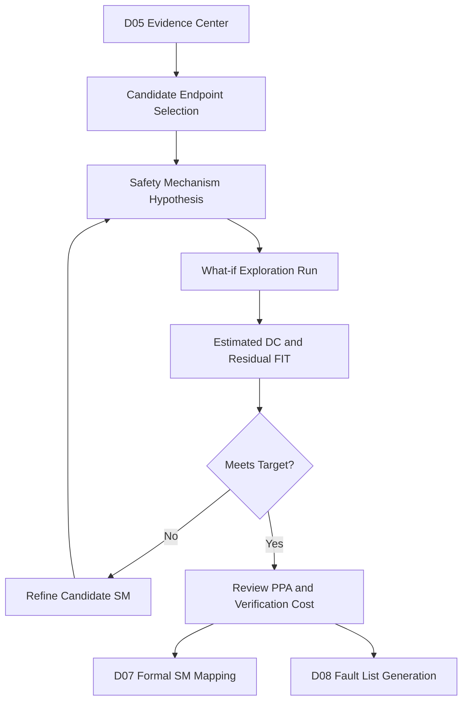

# Automotive Safe-IC Practice 06: Safety Exploration — What-if Safety Mechanism Evaluation and Diagnostic Coverage Estimation
Author: Darren H. Chen
Direction: Automotive Safe-IC Functional Safety Analysis and Fault-Injection Practice
Demo: D06_safety_exploration_what_if_sm_dc_estimation
Tags: ISO 26262, Functional Safety, Safe-IC, Safety Exploration, Diagnostic Coverage, Safety Mechanism, FMEDA, FIT, SPFM, LFM, PMHF

## 1. From Evidence Center to Design Decision

By D05, the flow has already moved beyond isolated CSV reports. The project now has a structured evidence center: design boundary, FIT-standard identity, Base FIT results, structural endpoints, startpoints, logic cones, DCE-style artifacts, and session-oriented evidence records.

D06 is the first point where the flow starts to answer a design question rather than merely organizing data:

> Which safety mechanisms should be considered, and how much diagnostic coverage could they contribute before the design is modified?

This is the purpose of **Safety Exploration**.

Safety Exploration is not final signoff. It is an engineering decision stage. It evaluates proposed safety mechanisms in a controlled “what-if” mode, estimates their effect on diagnostic coverage, and turns structural analysis data into a ranked set of implementation candidates.

A useful mental model is:

```text
D02 Base FIT Rate
    tells us where random hardware failure exposure exists.

D04 Structural Building Blocks
    tells us which endpoints, startpoints, cones, and DCEs carry that exposure.

D05 Common Evidence Center
    keeps those objects traceable across sessions.

D06 Safety Exploration
    asks: what if we protect selected objects with candidate safety mechanisms?
```

The output of D06 should not be “we are safe now.”

The output should be:

```text
candidate safety mechanisms
estimated diagnostic coverage
residual FIT trend
PPA and complexity trade-off notes
review decisions
handoff data for D07, D08, and later fault campaigns
```

## 2. What Safety Exploration Means

Safety Exploration is the process of estimating the metric impact of potential or already inserted safety mechanisms.

The core question is:

```text
If endpoint EP_A is protected by mechanism M,
what diagnostic coverage can be credited,
and how much residual FIT may remain?
```

A simplified formula is:

```text
Residual FIT ≈ Base FIT × (1 - Diagnostic Coverage)
```

In real functional safety work, the calculation is more structured. It may be separated by:

```text
permanent fault contribution
transient fault contribution
endpoint
startpoint
logic cone
DCE
part / sub-part
failure mode
safety mechanism
ASIL target
fault classification policy
```

Safety Exploration exists because it is expensive to implement every possible safety mechanism directly in RTL, synthesize the design, rerun verification, run fault injection, and only then discover that the selected mechanism is too weak or too expensive.

Instead, D06 provides an early exploration loop:



**Figure 1. Safety Exploration is an iterative what-if loop before implementation and fault campaign closure.**

## 3. Safety Analysis, Safety Exploration, SM Validation, and Fault Campaign

The terms are close, but they should not be mixed.

### 3.1 Safety Analysis

Safety Analysis evaluates the current design state.

It answers:

```text
What is the FIT rate?
Where are the high-contribution structures?
What are the current diagnostic coverage metrics?
Which endpoints and cones dominate the risk?
```

D02, D03, and D04 are mainly safety analysis stages.

### 3.2 Safety Exploration

Safety Exploration evaluates proposed safety mechanisms.

It answers:

```text
What if endpoint A had parity?
What if cone B were duplicated?
What if memory C had ECC?
What if a protocol checker protected a state machine?
How much diagnostic coverage would be estimated?
```

The design may not yet contain the actual inserted logic.

### 3.3 Safety Mechanism Validation

Safety Mechanism Validation evaluates a design where safety mechanisms are already present or inserted.

It asks:

```text
Given the safe design, what FIT and DC are estimated now?
Does the added logic change the FIT baseline?
Does the implemented protection match the intended mechanism?
```

This is later and more concrete than D06.

### 3.4 Fault Campaign

A fault campaign injects faults and classifies outcomes.

It answers:

```text
Was the fault detected?
Was it safe?
Was it unsafe?
Was it unresolved?
Did the alarm fire within the expected observation window?
```

D06 estimates. Fault campaign validates through execution. The two must not be confused.

## 4. The Inputs D06 Should Consume

D06 should not start from scratch. It should consume upstream evidence.

### 4.1 From D02: Base FIT and FIT Contribution

D02 provides the baseline.

Typical inputs include:

```text
bfr_summary.csv
fit_contribution.csv
base_fit_evidence_index.csv
```

These files answer:

```text
How much FIT exists before safety mechanisms are credited?
Which modules or structures contribute more?
Which FIT standard and mission profile were used?
```

Without this baseline, a diagnostic coverage percentage is not meaningful.

A 90% DC over a negligible FIT region may matter less than a 60% DC over a dominant safety-critical cone.

### 4.2 From D03: FIT Standard Identity and Run Variants

D03 provides the standard and mission-profile context.

Typical inputs include:

```text
fit_standard_real_comparison.csv
d03_handoff_to_d04.csv
evidence_index.csv
```

D06 should preserve the distinction:

```text
fit_standard = iec_62380 or sn_29500
variant_id   = fit_standard + mission_profile + parameter_set
```

Safety Exploration results from different FIT standards or mission profiles must not be merged without an explicit comparison policy.

### 4.3 From D04: Structural Building Blocks

D04 provides the structural model.

Typical inputs include:

```text
structural_endpoint_inventory.csv
structural_startpoint_inventory.csv
logic_cone_map.csv
dce_catalog.csv
ep_to_sm_seed_map.csv
protocol_visible_endpoint_map.csv
```

These files answer:

```text
What are the endpoints?
What are the startpoints?
Which logic cone feeds each endpoint?
Which endpoints are protocol-visible?
Which DCE artifacts are available?
Which endpoints are likely candidates for safety mechanisms?
```

### 4.4 From D05: Common Evidence Center

D05 provides the evidence registry.

Typical inputs include:

```text
common_db_session_manifest.csv
common_db_object_catalog.csv
common_db_link_graph.csv
d05_handoff_to_d06.csv
```

These files answer:

```text
Which session contains which data?
Which artifact is derived from which upstream run?
Which object IDs are stable across stages?
Which evidence links must be preserved?
```

D06 must keep this traceability. Otherwise, the same endpoint may appear under different names across D04, D06, D07, and D08.

## 5. Core Concepts Introduced in D06

### 5.1 Safety Mechanism

A **Safety Mechanism**, or SM, is a technical mechanism used to detect, control, correct, or mitigate faults.

Examples include:

```text
parity
ECC
duplication
triplication
lockstep comparison
watchdog
protocol checker
range checker
timeout checker
memory scrubbing
built-in self-test
```

A safety mechanism can be implemented in hardware, software, firmware, or a combination of them. In this series, D06 focuses on RTL and hardware-oriented safety mechanisms.

### 5.2 What-if Safety Mechanism

A **what-if safety mechanism** is a proposed mechanism that may not yet be inserted into the design.

It is an exploration hypothesis:

```text
Endpoint counter_reg[3] could be protected by endpoint parity.
State machine control_state could be protected by a protocol checker.
Memory status_ram could be protected by ECC.
Critical cone feeding alarm_o could be duplicated.
```

The word “what-if” is important. It means D06 is estimating the effect of the idea, not proving the final implementation.

### 5.3 Diagnostic Coverage

**Diagnostic Coverage**, or DC, is the portion of relevant failures that are detected or controlled by a safety mechanism.

Conceptually:

```text
DC = failures detected or controlled by SM / total relevant failures
```

In a FIT-weighted context:

```text
FIT-weighted DC = FIT contribution covered by SM / total relevant FIT contribution
```

DC is not a standalone number. It depends on:

```text
fault model
fault population
structural boundary
observation rule
alarm definition
FTTI requirement
failure-mode classification
FIT standard
mission profile
safety mechanism assumptions
```

### 5.4 Residual FIT

**Residual FIT** is the failure-rate contribution remaining after diagnostic coverage is credited.

A conceptual expression is:

```text
Residual FIT = Base FIT - Covered FIT
```

or:

```text
Residual FIT ≈ Base FIT × (1 - DC)
```

D06 should report residual FIT as a directional estimate, not as final signoff.

### 5.5 Endpoint, Startpoint, and Cone

D04 introduced these structural objects. D06 uses them to place candidate mechanisms.

A practical interpretation:

```text
endpoint
    a structurally relevant observation or state boundary to protect

startpoint
    a source boundary from which fault effects may propagate

logic cone
    the combinational dependency region between startpoints and endpoints
```

A parity mechanism may protect the endpoint value. A duplication mechanism may protect more of the cone. A triplication mechanism may provide correction capability but at higher area cost.

### 5.6 Alarm

An **alarm** is a signal or event that indicates a safety mechanism has detected an abnormal condition.

In early Safety Exploration, the physical alarm signal may not exist yet. The candidate map can use an abstract placeholder:

```text
alarm = TBD
alarm = virtual_alarm_counter_parity
alarm = NULL
```

This is acceptable in what-if analysis, but it must be resolved before fault campaign setup.

### 5.7 Protocol Checker

A **protocol checker** verifies that a state machine, transaction interface, or control flow obeys allowed behavior.

For example, a simple bus protocol may require:

```text
request must remain stable until acknowledge
response cannot occur before request
error response must not be combined with valid data
state machine must not transition from IDLE directly to ERROR_CLEAR without ERROR_DETECTED
```

A protocol checker is different from parity or ECC. Parity protects encoded values; a protocol checker protects legal temporal behavior.

### 5.8 Safety Exploration Scenario

A **scenario** is one exploration hypothesis.

Example:

```yaml
scenario_id: exp_001
fit_standard: iec_62380
variant_id: iec62380_passenger_65c
target_endpoint_group: high_fit_register_endpoints
candidate_mechanism: endpoint_parity
alarm_policy: virtual_alarm
review_goal: improve permanent and transient DC with low area cost
```

A D06 demo should evaluate multiple scenarios and rank them.

## 6. Safety Mechanism Families

D06 should explain the mechanism families at a conceptual level.

### 6.1 Endpoint Parity

Endpoint parity protects endpoint state by adding a parity relation.

Typical use:

```text
register arrays
control state bits
status fields
small datapath registers
```

Strength:

```text
low area overhead
simple alarm generation
good for single-bit corruption detection
```

Limitation:

```text
may not protect the full fan-in cone
may not correct the fault
may be insufficient for multi-bit corruption
```

### 6.2 Endpoint ECC

Endpoint ECC extends the parity idea by supporting stronger error detection and sometimes correction.

Typical use:

```text
wider registers
configuration state
control tables
critical status vectors
```

Strength:

```text
better coverage than simple parity for wider data
possible correction depending on code
```

Limitation:

```text
more area and logic
decoder/checker complexity
timing impact
```

### 6.3 Memory ECC

Memory ECC protects memory arrays or RAM-like structures.

Typical use:

```text
SRAM
register files
FIFO storage
lookup tables
buffer memories
```

Strength:

```text
strong protection for storage-dominated FIT
well understood failure model
can support correction and scrubbing
```

Limitation:

```text
not enough for logic around the memory
requires memory wrapper integration
needs read/write timing consideration
```

### 6.4 Endpoint-Cone Duplication

Endpoint-cone duplication protects the logic cone feeding the endpoint by duplicating logic and comparing results.

Typical use:

```text
control cones
safety-critical combinational logic
data transformation logic
```

Strength:

```text
covers more than endpoint value
detects faults in cone logic
clear comparator alarm model
```

Limitation:

```text
higher area and power
comparator and alarm path must be considered
common-cause failures require review
```

### 6.5 Endpoint-Cone Startpoint Duplication

This is a broader duplication strategy that considers startpoints as part of the protected boundary.

Typical use:

```text
cones where startpoint corruption also matters
logic with significant upstream influence
multi-stage control paths
```

Strength:

```text
broader structural protection
more complete cone-level reasoning
```

Limitation:

```text
higher implementation cost
larger verification burden
more complex mapping to failure modes
```

### 6.6 Triplication and Majority Voting

Triplication creates three copies and uses a voter.

Typical use:

```text
high-criticality control
small safety islands
fault-tolerant state machines
```

Strength:

```text
can correct certain faults
may support fail-operational behavior
```

Limitation:

```text
large area and power overhead
voter becomes safety-critical
common-cause failure and physical independence must be reviewed
```

### 6.7 Protocol Checking

Protocol checking verifies legal behavior.

Typical use:

```text
FSM transitions
bus handshakes
control sequencing
transaction ordering
safety monitor state machines
```

Strength:

```text
captures semantic errors
often cheaper than full duplication
useful for control-dominated designs
```

Limitation:

```text
requires explicit protocol definition
may miss data corruption unless combined with parity/ECC
alarm timing must be designed carefully
```

## 7. The Candidate Selection Problem

The hardest part of D06 is not running the exploration. The hardest part is choosing candidates.

A poor candidate map can produce a large number of mechanisms with little metric improvement, or a small number of mechanisms that look good on paper but are impractical to implement.

A good candidate selection policy combines:

```text
FIT contribution
endpoint criticality
cone size
fanout impact
protocol visibility
memory vs logic classification
current observability
existing alarm potential
implementation cost
verification cost
ASIL relevance
FMEDA failure-mode mapping
```

A practical ranking score can be:

```text
candidate_score =
    FIT_weight
  × criticality_weight
  × observability_weight
  × mechanism_effectiveness
  ÷ estimated_cost
```

This is not a standard formula. It is an engineering prioritization method.

The important principle is:

> Do not select safety mechanisms purely by endpoint count. Select them by risk contribution, functional criticality, and implementation feasibility.

## 8. D06 Data Protocols

Here, “protocol” means a data exchange contract between stages.

### 8.1 Scenario Matrix Protocol

D06 should define a scenario matrix.

Example:

```csv
scenario_id,variant_id,fit_standard,target_group,candidate_mechanism,alarm_policy,review_goal
EXP001,iec62380_passenger_65c,iec_62380,top_fit_endpoints,endpoint_parity,virtual_alarm,low_cost_detection
EXP002,iec62380_passenger_65c,iec_62380,control_cones,endpoint_cone_duplication,virtual_alarm,cone_level_detection
EXP003,sn29500_reference_65c,sn_29500,memory_like_storage,memory_ecc,virtual_alarm,storage_protection
```

The scenario matrix makes exploration reproducible.

### 8.2 Candidate Safety Mechanism Map Protocol

A candidate map should be explicit.

Example:

```csv
scenario_id,object_type,object_name,candidate_mechanism,alarm_name,use_factor,notes
EXP001,endpoint,toy_counter.count[0],endpoint_parity,virtual_alarm_count_parity,1.0,control-visible counter bit
EXP001,endpoint,toy_counter.count[1],endpoint_parity,virtual_alarm_count_parity,1.0,control-visible counter bit
EXP002,cone,toy_counter.count_cone,endpoint_cone_duplication,virtual_alarm_count_dup,1.0,cone-level protection
```

This file is not yet the final production mechanism map. It is a what-if exploration input.

### 8.3 Metric Delta Protocol

D06 should compare each scenario against a baseline.

Example:

```csv
scenario_id,baseline_perm_fit,estimated_perm_dc,estimated_perm_residual_fit,baseline_tran_fit,estimated_tran_dc,estimated_tran_residual_fit
EXP001,100.0,0.70,30.0,80.0,0.55,36.0
EXP002,100.0,0.90,10.0,80.0,0.85,12.0
```

A review should focus on deltas:

```text
How much DC improved?
How much residual FIT decreased?
What mechanism produced the improvement?
What cost is expected?
Is the improvement concentrated in the right failure modes?
```

### 8.4 Decision Record Protocol

D06 should not only output metrics. It should also output decisions.

Example:

```csv
scenario_id,decision,reason,next_action
EXP001,review,low cost but insufficient cone protection,combine with protocol checker
EXP002,accept_for_D07,strong DC improvement with manageable cone size,formalize EP-to-SM mapping
EXP003,defer,no memory macro in current design boundary,revisit after memory integration
```

This becomes engineering memory.

## 9. What-if Evaluation Methodology

A practical D06 flow can be organized as follows.

### 9.1 Build Candidate Groups

Group endpoints and cones before assigning mechanisms.

Example groups:

```text
top_fit_endpoints
protocol_visible_endpoints
control_state_endpoints
alarm_related_endpoints
memory_related_objects
large_fanout_cones
unprotected_high_risk_cones
```

This reduces random manual selection.

### 9.2 Assign Mechanism Families

Use simple heuristics:

```text
state bits
    endpoint parity or protocol checker

wide control/status vectors
    endpoint ECC or parity

memory-like storage
    memory ECC

critical logic cones
    endpoint-cone duplication

high-criticality small controllers
    triplication or lockstep-style checking

transaction interfaces
    protocol checker plus parity/ECC on payload
```

### 9.3 Estimate Coverage

Run the exploration engine with the candidate map and baseline context.

The command name should be stable at the project level:

```text
safeic_explore
```

A conceptual invocation may look like:

```text
safeic_explore
  --input-package inputs/from_D01/
  --baseline outputs/from_D02/bfr_summary.csv
  --structural-model outputs/from_D04/structural_model.csv
  --common-db outputs/from_D05/common_db_manifest.csv
  --scenario-matrix inputs/exploration/scenario_matrix.csv
  --output outputs/
```

This is a project-level orchestration interface. The local environment decides how it maps to the configured analysis engine.

### 9.4 Compare Against Baseline

For each scenario:

```text
baseline FIT
estimated DC
estimated residual FIT
estimated SPFM trend
estimated LFM trend
candidate cost
review decision
```

A useful comparison table is:

```text
baseline
candidate parity
candidate duplication
candidate triplication
candidate protocol checker
hybrid candidate
```

### 9.5 Review Before Implementation

A candidate should not be accepted solely because it has the highest estimated DC.

Review criteria include:

```text
Does it protect the right failure mode?
Can it generate an alarm within FTTI?
Does it create unacceptable timing pressure?
Does it add too much area or power?
Is the comparator or checker itself protected?
Does it require software reaction?
Can it be verified with available tests?
Does it map cleanly into FMEDA?
```

## 10. Diagnostic Coverage Is Not Just a Number

A common mistake is to treat DC as a single percentage.

A better view is:

```text
DC(object, fault_type, mechanism, observation_policy, timing_window)
```

This means DC depends on five dimensions:

```text
object
    endpoint, startpoint, cone, memory, part, sub-part

fault_type
    permanent, transient, stuck-at, bit flip, delay-like effect

mechanism
    parity, ECC, duplication, protocol checker, triplication

observation_policy
    alarm, safe state, output equivalence, monitor state

timing_window
    immediate, within FTTI, within diagnostic test interval
```

D06 estimates coverage under assumptions. Those assumptions must be recorded.

A good D06 report should state:

```text
This scenario estimates endpoint-level detection.
This scenario estimates cone-level detection.
This scenario assumes a virtual alarm.
This scenario does not yet validate alarm timing.
This scenario requires D09-D13 fault campaign evidence later.
```

## 11. Relationship to FMEDA

FMEDA needs a connection between:

```text
part / sub-part
failure mode
failure rate
safety mechanism
diagnostic coverage
residual FIT
```

D06 begins to build that bridge.

A candidate mechanism is not just a circuit idea. It should become an FMEDA candidate row.

Example:

```csv
part,sub_part,failure_mode,base_fit,candidate_sm,estimated_dc,residual_fit,decision
control_unit,state_register,state_bit_corruption,12.0,endpoint_parity,0.90,1.2,accept_for_mapping
control_unit,next_state_logic,illegal_transition,8.0,protocol_checker,0.85,1.2,review
```

D15 will build the FMEDA data model in more detail. D06 prepares the candidate evidence.

## 12. Relationship to Fault List Generation

Safety Exploration can influence fault list generation.

If a mechanism candidate protects a particular endpoint or cone, D08 should know:

```text
which object was targeted
which mechanism was assumed
which fault type matters
which alarm is expected
which fault population should be generated
```

D06 does not need to run the fault campaign. But it should prepare handoff data for D08:

```csv
scenario_id,target_object,fault_scope,expected_alarm,priority
EXP001,toy_counter.count[3],endpoint,virtual_alarm_count_parity,high
EXP002,toy_counter.count_cone,cone,virtual_alarm_count_dup,high
```

This keeps fault list generation aligned with safety mechanism exploration.

## 13. Relationship to Alarm and Observe Points

D06 can use virtual alarms, but later stages cannot stop there.

D10 will need concrete alarm and observe point definitions.

D06 should classify alarm maturity:

```text
virtual
    proposed only, no physical signal yet

candidate
    RTL signal exists but not yet validated

implemented
    signal exists and is connected to a safety response

validated
    fault campaign has confirmed behavior under injection
```

The same applies to observe points:

```text
critical_output
safe_state
error_status
watchdog_reset
interrupt_status
system_response
```

D06 should record what must be made concrete later.

## 14. Permanent vs Transient Fault Exploration

Safety mechanisms may behave differently for permanent and transient faults.

### 14.1 Permanent Fault

A permanent fault persists.

Examples:

```text
stuck-at fault
permanent short
permanent open
aging-induced stuck behavior
```

A mechanism may detect it continuously or during periodic tests.

### 14.2 Transient Fault

A transient fault is temporary.

Examples:

```text
single event upset
temporary bit flip
temporary logic glitch
radiation-induced soft error
```

A mechanism must detect it within the relevant window, or the system must tolerate its effect.

### 14.3 Why D06 Should Separate Them

A mechanism that looks strong for endpoint storage may not cover combinational transient propagation well. A protocol checker may detect illegal state behavior but miss transient data corruption that does not violate the protocol.

D06 should therefore report:

```text
estimated permanent DC
estimated transient DC
estimated permanent residual FIT
estimated transient residual FIT
```

## 15. Use Factor and Partial Coverage

Some mechanisms do not protect all behavior equally.

A practical example:

```text
A data path has parity for payload traffic,
but control register writes are only partly protected.
```

This is where a use factor or weighting factor becomes useful.

Conceptually:

```text
Effective transient DC = min(sum(use_factor_i × dc_i), max_credit)
```

The exact calculation depends on the configured methodology and coverage definition file, but the engineering idea is simple:

```text
not every mechanism is active for every usage mode;
not every coverage claim applies to all traffic;
partial coverage must be represented explicitly.
```

D06 should not hide partial coverage.

## 16. Cost Model for Exploration

A safety mechanism is not free.

D06 should attach a simple cost model:

```csv
mechanism_family,area_cost,power_cost,timing_cost,verification_cost,software_dependency
endpoint_parity,low,low,low,medium,possible
endpoint_ecc,medium,medium,medium,medium,possible
memory_ecc,medium,medium,medium,high,possible
cone_duplication,high,high,medium_to_high,high,low
triplication,very_high,very_high,high,very_high,low
protocol_checker,low_to_medium,low,medium,high,possible
```

This does not replace synthesis or implementation data. It gives early review structure.

A candidate with slightly lower estimated DC may be better if it has much lower timing risk and clearer verification closure.

## 17. D06 Demo Architecture

The D06 demo should be organized as an evidence transformation pipeline.

```text
D06_safety_exploration_what_if_sm_dc_estimation/
├── README.md
├── manifest.yaml
├── inputs/
│   ├── from_D02/
│   ├── from_D03/
│   ├── from_D04/
│   ├── from_D05/
│   └── exploration/
│       ├── scenario_matrix.csv
│       ├── candidate_sm_map.csv
│       ├── mechanism_cost_model.csv
│       └── review_policy.yaml
├── scripts/
│   ├── run_demo.csh
│   └── run_demo.sh
├── tools/
│   ├── build_candidate_groups.py
│   ├── generate_exploration_inputs.py
│   ├── collect_exploration_metrics.py
│   ├── rank_scenarios.py
│   └── build_d07_d08_handoff.py
├── outputs/
│   ├── candidate_endpoint_groups.csv
│   ├── candidate_cone_groups.csv
│   ├── exploration_scenario_manifest.csv
│   ├── estimated_dc_summary.csv
│   ├── residual_fit_estimate.csv
│   ├── scenario_ranking.csv
│   ├── safety_mechanism_review_matrix.csv
│   ├── d06_handoff_to_d07.csv
│   ├── d06_handoff_to_d08.csv
│   ├── d06_handoff_to_d15.csv
│   ├── d06_quality_gate.csv
│   └── demo_summary.md
└── logs/
```

The demo should not require private paths in source files. Local execution should map the project-level orchestration to the installed safety analysis engine.

## 18. Example Scenario Design

Suppose D04 found these structural objects:

```text
toy_counter.count[0]
toy_counter.count[1]
toy_counter.count[2]
toy_counter.count[3]
toy_counter.alarm
toy_counter.count_cone
```

D06 may create scenarios:

```csv
scenario_id,target_group,candidate_mechanism,description
EXP001,count_state_bits,endpoint_parity,protect counter state bits using parity-style detection
EXP002,count_cone,endpoint_cone_duplication,duplicate the cone feeding the count state
EXP003,alarm_output,protocol_checker,check legal alarm behavior against counter state
EXP004,count_state_bits,triplication,high-cost correction-oriented candidate
```

Then D06 ranks them:

```csv
scenario_id,estimated_dc_gain,cost_class,review_decision
EXP001,medium,low,accept_for_D07_seed
EXP002,high,high,review_for_timing_and_area
EXP003,medium,medium,accept_if_protocol_rule_is_defined
EXP004,very_high,very_high,defer_for_small_high_criticality_blocks
```

These are demonstration numbers and categories, not real signoff results.

## 19. Quality Gates

D06 should have quality gates.

A minimal quality gate set:

```text
[PASS] D05 handoff exists
[PASS] D04 endpoint inventory exists
[PASS] D04 cone map exists
[PASS] D02 baseline FIT summary exists
[PASS] scenario matrix exists
[PASS] candidate SM map exists
[PASS] every scenario has a target group
[PASS] every candidate mechanism has a cost model
[PASS] every estimated metric links to a baseline run
[PASS] every accepted scenario has a handoff entry
```

Warning-level gates:

```text
[WARN] scenario uses virtual alarm
[WARN] scenario has high cost class
[WARN] scenario improves transient DC but not permanent DC
[WARN] scenario has no FMEDA failure-mode placeholder
```

Failure-level gates:

```text
[FAIL] missing baseline FIT
[FAIL] missing structural endpoint object
[FAIL] unsupported mechanism family
[FAIL] scenario cannot be traced to a common evidence session
[FAIL] accepted scenario has no D07 handoff
```

## 20. Common Mistakes

### 20.1 Treating Safety Exploration as Signoff

Safety Exploration estimates. Fault campaigns validate. FMEDA integrates. Final metrics close the loop.

### 20.2 Selecting Mechanisms by Count Instead of Risk

Protecting many low-risk endpoints may look impressive but may not reduce residual FIT meaningfully.

### 20.3 Ignoring Alarm Realism

A virtual alarm is useful in D06. But by D10 and D11, alarm and observe point definitions must be concrete.

### 20.4 Mixing FIT Standards

Do not mix exploration metrics from different FIT standards or mission profiles without explicit labeling.

### 20.5 Hiding Cost

A high-coverage mechanism with unacceptable PPA cost may not be the best engineering choice.

### 20.6 Forgetting Latent Faults

A safety mechanism itself can fail. D06 can note latent-mechanism concerns, even if final LFM analysis is later.

### 20.7 Not Preserving Object Identity

Endpoint names, DCE IDs, scenario IDs, and session IDs must remain traceable.

## 21. D06 Outputs

A strong D06 demo should produce:

```text
candidate_endpoint_groups.csv
candidate_cone_groups.csv
exploration_scenario_manifest.csv
candidate_sm_map.csv
estimated_dc_summary.csv
residual_fit_estimate.csv
scenario_ranking.csv
safety_mechanism_review_matrix.csv
alarm_maturity_matrix.csv
d06_handoff_to_d07.csv
d06_handoff_to_d08.csv
d06_handoff_to_d15.csv
d06_quality_gate.csv
evidence_index.csv
demo_summary.md
```

These outputs answer:

```text
Which safety mechanism candidates were considered?
Which endpoint or cone does each candidate protect?
What estimated DC improvement was observed?
What residual FIT trend remains?
What is the expected cost?
Which candidates are accepted, reviewed, deferred, or rejected?
What should D07 formalize?
What should D08 use for fault-list generation?
What should D15 use for FMEDA data modeling?
```

## 22. D06 Handoff to D07

D07 will focus on mapping failure modes to safety mechanisms and endpoints.

D06 should hand off accepted or review-worthy candidates:

```csv
scenario_id,target_object,candidate_mechanism,estimated_dc,decision,d07_action
EXP001,toy_counter.count[3],endpoint_parity,0.90,accept,create_failure_mode_to_sm_mapping
EXP002,toy_counter.count_cone,endpoint_cone_duplication,0.95,review,define_cone_failure_mode
EXP003,toy_counter.alarm,protocol_checker,0.85,accept,define_protocol_failure_mode
```

D07 turns these candidates into a more formal safety mechanism map.

## 23. D06 Handoff to D08

D08 will focus on fault list generation.

D06 should hand off fault-list priorities:

```csv
scenario_id,target_object,fault_scope,fault_type_priority,expected_alarm
EXP001,toy_counter.count[3],endpoint,permanent_and_transient,virtual_alarm_count_parity
EXP002,toy_counter.count_cone,cone,permanent,virtual_alarm_count_dup
EXP003,toy_counter.alarm,protocol_endpoint,transient,virtual_alarm_protocol
```

D08 can then generate fault populations aligned with the exploration intent.

## 24. D06 Handoff to D15

D15 will focus on FMEDA data modeling.

D06 should hand off candidate FMEDA rows:

```csv
part,sub_part,failure_mode,candidate_sm,estimated_dc,residual_fit_class,decision
control_block,counter_state,state_bit_corruption,endpoint_parity,high,low,accept
control_block,count_logic,wrong_next_count,endpoint_cone_duplication,high,low,review
control_block,alarm_logic,missed_alarm,protocol_checker,medium,medium,review
```

This keeps FMEDA connected to structural evidence rather than manual spreadsheet guesswork.

## 25. Summary

D06 is the bridge between structural evidence and safety mechanism decisions.

It takes:

```text
Base FIT from D02
FIT-standard context from D03
endpoint / startpoint / cone / DCE evidence from D04
common database traceability from D05
```

and turns them into:

```text
candidate safety mechanism scenarios
estimated diagnostic coverage
residual FIT trends
cost and complexity review
decision records
handoff to D07, D08, and D15
```

The central principle is:

> Safety Exploration is not final proof. It is disciplined engineering search.

A mature Safe-IC workflow does not randomly insert safety logic and hope for metric closure. It first asks structured what-if questions, records assumptions, compares candidate mechanisms, ranks trade-offs, and preserves traceability into later fault injection and FMEDA stages.

That is the role of D06.
