# [Automotive Safe-IC Practice 07] Safety Mechanism Selection: From Residual FIT and Weak Coverage to Protection Strategy

**Author**: Darren H. Chen  
**Direction**: Automotive Chip Functional Safety Analysis and Fault Injection Practice  
**Demo**: D07_safety_mechanism_selection  
**Tags**: Automotive Chip, Functional Safety, Safety Mechanism, Diagnostic Coverage, Residual FIT, FMEDA, Fault Injection, ECC, Parity, CRC, Lockstep, Watchdog, Alarm

---

## 1. Why This Article Matters

In the previous article, we discussed Diagnostic Coverage.

We emphasized that DC is not just a percentage. It must be tied to:

```text
fault model
structural scope
endpoint
cone
path
failure mode
alarm behavior
FIT contribution
validation status
```

Once diagnostic coverage and residual FIT are visible, the next engineering question appears:

> What should we do with the uncovered or weakly covered risk?

This is the purpose of safety mechanism selection.

The seventh demo in this repository is:

```text
D07_safety_mechanism_selection
```

The generic tool introduced in this article is:

```text
safeic-smselect
```

The purpose of `safeic-smselect` is to recommend candidate safety mechanisms based on:

```text
structural safety model
failure modes
diagnostic coverage gaps
residual FIT
endpoint criticality
cone/path scope
alarm requirements
implementation cost assumptions
review policy
```

The central idea is:

> Safety mechanism selection is not a naming exercise. It is a structured engineering decision that maps uncovered failure risk to feasible detection, correction, masking, or control strategies.

---

## 2. Safety Mechanism Selection Is a Design Decision

A safety mechanism is not automatically good because it sounds strong.

For example:

```text
ECC
CRC
lockstep
duplication
watchdog
parity
protocol checker
```

Each of these mechanisms has a different scope, cost, latency, detection capability, and integration burden.

A good selection process must answer:

```text
What failure mode is being addressed?
Where does the fault originate?
Where does it propagate?
What endpoint is affected?
Is the issue data corruption, control corruption, timing violation, alarm failure, or diagnostic failure?
Is detection enough, or is correction required?
How fast must the response occur?
What is the cost of the mechanism?
What residual risk remains?
Can the mechanism be validated by fault injection?
```

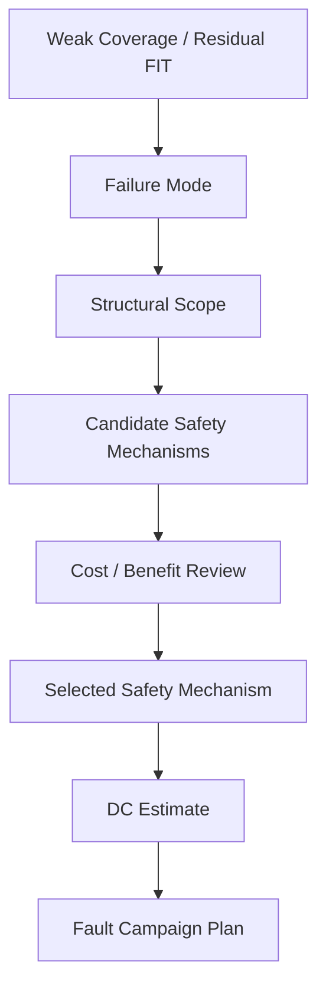

**Figure 1. Safety mechanism selection converts weak coverage and residual risk into an engineering protection strategy.**

A safety mechanism should be selected because it addresses a specific risk, not because it is a familiar keyword.

---

## 3. Inputs to Safety Mechanism Selection

`safeic-smselect` consumes artifacts from previous demos.

```text
D03 / D04:
  Base FIT and FIT model assumptions

D05:
  structural safety model

D06:
  diagnostic coverage and residual FIT

D07:
  safety mechanism recommendation and selection review
```

Suggested inputs:

```text
intermediate/
  endpoints.csv
  cones.csv
  startpoint_usage.csv
  residual_fit.csv
  dc_rollup_by_failure_mode.csv
  dc_rollup_by_part.csv

inputs/
  safety_mechanism_library.yaml
  failure_modes.yaml
  sm_selection_policy.yaml
  implementation_cost_model.yaml
  safety_target.yaml
```

The selection engine should not look only at one input.

A realistic recommendation needs multiple dimensions:

| Input | Why It Matters |
|---|---|
| Residual FIT | Prioritizes where risk remains |
| Failure mode | Defines what kind of failure must be controlled |
| Structural scope | Determines endpoint, cone, path, memory, or alarm coverage need |
| Existing DC | Shows what is already protected |
| Startpoint usage | Identifies common propagation sources |
| Alarm mapping | Ensures detection can be observed |
| Cost model | Avoids over-designed solutions |
| Safety target | Determines required strength of protection |

---

## 4. Safety Mechanism Taxonomy

A safety mechanism can be classified by what it does.

```text
detect
correct
mask
control
recover
prevent
diagnose
```

### 4.1 Detection Mechanisms

Detection mechanisms identify that something is wrong.

Examples:

```text
parity
CRC
ECC detection
lockstep mismatch
protocol checker
range checker
watchdog timeout
alarm monitor
```

### 4.2 Correction Mechanisms

Correction mechanisms restore correct behavior or correct corrupted data.

Examples:

```text
single-error correction ECC
retry mechanism
recompute mechanism
state recovery
memory scrubbing
```

### 4.3 Masking Mechanisms

Masking mechanisms hide the fault effect from system behavior.

Examples:

```text
triple modular redundancy
voting
redundant datapath selection
temporal redundancy with majority vote
```

### 4.4 Control and Recovery Mechanisms

Control mechanisms move the system into a controlled state.

Examples:

```text
safe-state transition
reset
shutdown
degraded mode
limp-home mode
alarm escalation
```

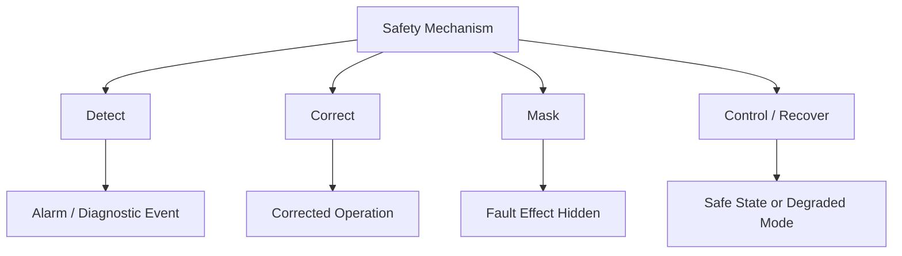

**Figure 2. Safety mechanisms can detect, correct, mask, control, or recover from fault effects.**

A selection engine must understand these categories.

---

## 5. Structural Scope Taxonomy

Safety mechanisms also differ by structural scope.

```text
endpoint scope
cone scope
path scope
memory scope
compute scope
temporal scope
alarm path scope
system response scope
```

| Scope | Meaning | Candidate Mechanisms |
|---|---|---|
| Endpoint | Protects a stored or observable value | Parity, ECC, duplication |
| Cone | Protects logic feeding an endpoint | Duplication, lockstep, checker |
| Path | Protects transfer from source to destination | CRC, bus integrity, end-to-end protection |
| Memory | Protects storage array or memory macro | ECC, parity, scrubbing, BIST |
| Compute | Protects computation unit | Lockstep, duplication, TMR |
| Temporal | Protects timing/progress behavior | Watchdog, timeout monitor |
| Alarm path | Protects diagnostic reporting | Redundant alarm, alarm monitor |
| System response | Protects reaction after detection | Safe state, reset, escalation |

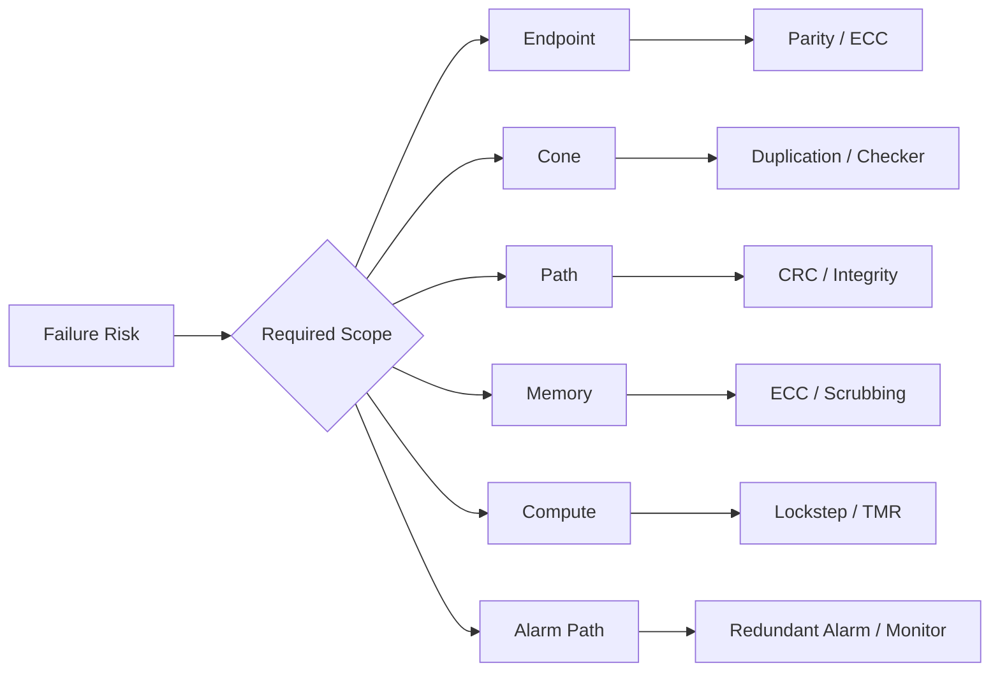

**Figure 3. Safety mechanism selection begins by identifying the required structural scope.**

This is why D07 depends on D05 and D06.

---

## 6. Failure Mode Drives Mechanism Choice

The same endpoint may need different mechanisms for different failure modes.

Example:

```text
Endpoint:
  toy_counter.count
```

Failure mode:

```text
FM_DATA_CORRUPTION
```

Candidate mechanisms:

```text
endpoint parity
ECC
duplication
range checker
```

Another endpoint:

```text
toy_counter.alarm
```

Failure mode:

```text
FM_ALARM_NOT_ASSERTED
```

Candidate mechanisms:

```text
redundant alarm
alarm path monitor
periodic diagnostic test
latched alarm
diagnostic self-test
```

Another failure mode:

```text
FM_FALSE_ALARM
```

Candidate mechanisms:

```text
debounce/filter
voting
confirmation sequence
temporal consistency check
```

The mechanism is chosen for the failure mode, not merely for the signal.

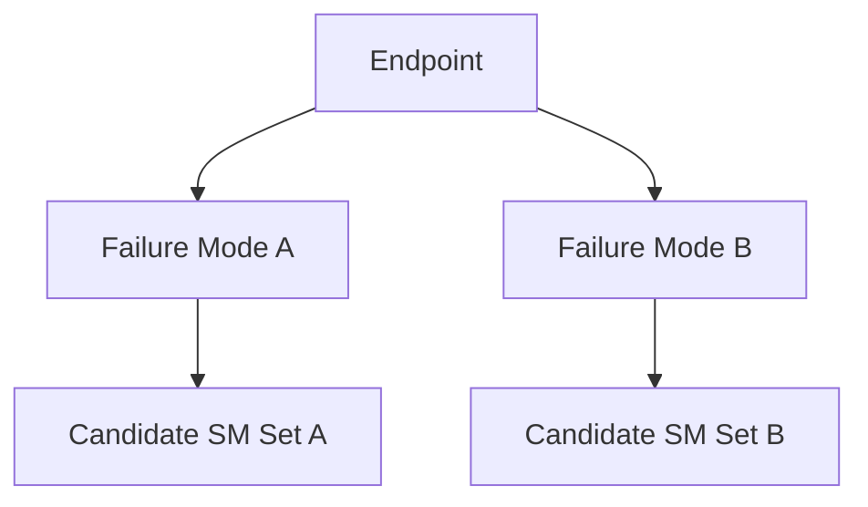

**Figure 4. A single endpoint can require different mechanism candidates for different failure modes.**

This is why `safeic-smselect` must read failure mode mappings.

---

## 7. The Safety Mechanism Library

A mechanism library describes what mechanisms are available.

It should not only list names.

A useful entry includes:

```text
mechanism ID
mechanism type
structural scope
fault models addressed
failure modes addressed
estimated DC range
alarm behavior
correction ability
latency
implementation cost
verification cost
suitability rules
limitations
review status
```

Example:

```yaml
mechanisms:
  endpoint_parity:
    type: detection
    structural_scope:
      - endpoint
    suitable_for:
      - register_group
      - scalar_ff
    detects:
      - single_bit_error
    failure_mode_categories:
      - data_integrity
      - state_integrity
    estimated_dc:
      min: 0.80
      typical: 0.90
      max: 0.95
    alarm_required: true
    corrects: false
    cost:
      area: low
      timing: low
      verification: low
    limitations:
      - does_not_cover_upstream_cone
      - parity_bit_itself_needs_consideration
    review_status: draft
```

Another example:

```yaml
  lockstep:
    type: detection
    structural_scope:
      - compute
      - cone
      - endpoint
    suitable_for:
      - cpu_core
      - control_engine
      - safety_controller
    detects:
      - state_divergence
      - logic_error
      - control_flow_error
    failure_mode_categories:
      - control_integrity
      - compute_integrity
    estimated_dc:
      min: 0.90
      typical: 0.95
      max: 0.99
    alarm_required: true
    corrects: false
    cost:
      area: high
      timing: medium
      verification: high
    limitations:
      - common_cause_faults_need_separate_analysis
      - comparator_and_alarm_path_must_be_protected
    review_status: draft
```

A mechanism library is the knowledge base of the selection engine.

---

## 8. Matching Rules

`safeic-smselect` should use matching rules.

A candidate mechanism is suitable only if it matches:

```text
endpoint type
failure mode category
structural scope need
fault model
latency requirement
cost constraint
alarm requirement
verification feasibility
```

Example rule:

```yaml
selection_rules:
  - id: R_DATA_ENDPOINT_PARITY
    if:
      endpoint_type:
        - register_group
        - scalar_ff
      failure_mode_category:
        - data_integrity
        - state_integrity
      required_scope:
        - endpoint
    then:
      candidates:
        - endpoint_parity
        - endpoint_ecc
        - duplication

  - id: R_BUS_PATH_INTEGRITY
    if:
      endpoint_type:
        - bus
        - interface
      failure_mode_category:
        - data_integrity
        - transaction_integrity
      required_scope:
        - path
    then:
      candidates:
        - end_to_end_crc
        - bus_parity
        - protocol_checker

  - id: R_ALARM_PATH
    if:
      failure_mode_category:
        - diagnostic_failure
      required_scope:
        - alarm_path
    then:
      candidates:
        - redundant_alarm
        - alarm_path_monitor
        - periodic_alarm_test
```

The output should include why each mechanism was recommended.

---

## 9. Ranking Candidate Mechanisms

Selection is not only matching. It is ranking.

Ranking may consider:

```text
residual FIT reduction
expected DC improvement
scope match
failure mode match
implementation cost
verification cost
latency
alarm path requirements
reuse of existing mechanism
design intrusiveness
review maturity
```

A simple scoring model:

```text
score =
  risk_weight × residual_fit_reduction_score
+ coverage_weight × expected_dc_score
+ match_weight × scope_match_score
- cost_weight × implementation_cost_score
- verification_weight × verification_cost_score
- uncertainty_weight × assumption_uncertainty_score
```

Example configuration:

```yaml
ranking_policy:
  weights:
    residual_fit_reduction: 0.35
    expected_dc: 0.25
    scope_match: 0.20
    implementation_cost: 0.10
    verification_cost: 0.05
    uncertainty: 0.05
```

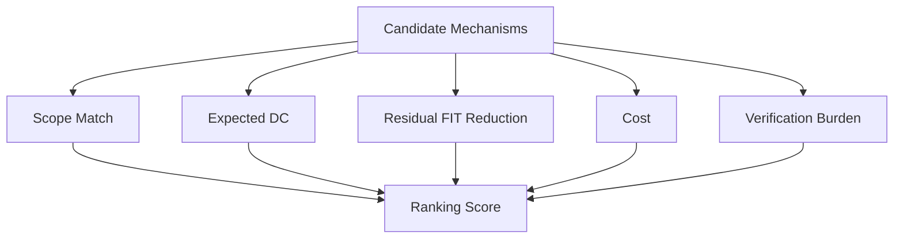

**Figure 5. Safety mechanism recommendation should rank candidates using both risk reduction and engineering cost.**

The first demo can use a simple transparent score.

A transparent simple model is better than a hidden complex model.

---

## 10. Residual FIT Drives Priority

Residual FIT is one of the most important selection inputs.

If two endpoints are weakly covered, the one with higher residual FIT usually deserves earlier attention.

Example:

```csv
endpoint,failure_mode,residual_fit,current_dc
toy_counter.count,FM_DATA_CORRUPTION,0.0064,0.90
toy_counter.alarm,FM_ALARM_NOT_ASSERTED,0.0100,0.00
toy_counter.count_parity,FM_DIAGNOSTIC_STATE_CORRUPTION,0.0040,0.00
```

A selection engine may prioritize:

```text
1. toy_counter.alarm
2. toy_counter.count_parity
3. toy_counter.count
```

because the alarm path has the largest residual contribution and no protection.

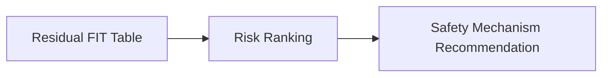

**Figure 6. Residual FIT helps prioritize where safety mechanisms should be added or improved.**

However, residual FIT is not the only factor. Safety goals, failure severity, FTTI, and system-level assumptions may override simple numerical ranking.

---

## 11. Endpoint Example: Counter State

Consider:

```text
Endpoint:
  toy_counter.count

Failure mode:
  FM_DATA_CORRUPTION

Current mechanism:
  endpoint_parity

Current estimated DC:
  0.90

Residual FIT:
  0.0064
```

Candidate mechanisms:

```text
endpoint_parity
endpoint_ecc
duplication
range_checker
temporal_redundancy
```

A recommendation table:

```csv
endpoint,failure_mode,candidate,expected_dc,area_cost,verification_cost,rank,reason
toy_counter.count,FM_DATA_CORRUPTION,endpoint_parity,0.90,low,low,1,already suitable for simple endpoint corruption
toy_counter.count,FM_DATA_CORRUPTION,duplication,0.95,medium,medium,2,improves cone/endpoint protection
toy_counter.count,FM_DATA_CORRUPTION,endpoint_ecc,0.95,medium,medium,3,stronger but excessive for simple counter
toy_counter.count,FM_DATA_CORRUPTION,range_checker,0.70,low,low,4,only detects illegal range
```

The result should not automatically select the strongest mechanism.

It should select the most appropriate mechanism for the risk, scope, and cost.

---

## 12. Diagnostic Path Example: Alarm Signal

Consider:

```text
Endpoint:
  toy_counter.alarm

Failure mode:
  FM_ALARM_NOT_ASSERTED

Current mechanism:
  none

Current estimated DC:
  0.00

Residual FIT:
  0.0100
```

Candidate mechanisms:

```text
redundant_alarm
alarm_path_monitor
latched_alarm
periodic_alarm_test
software_readback
```

Recommendation:

```csv
endpoint,failure_mode,candidate,expected_dc,area_cost,verification_cost,rank,reason
toy_counter.alarm,FM_ALARM_NOT_ASSERTED,latched_alarm,0.70,low,low,1,low-cost improvement for transient alarm miss
toy_counter.alarm,FM_ALARM_NOT_ASSERTED,redundant_alarm,0.90,medium,medium,2,stronger coverage for alarm path failure
toy_counter.alarm,FM_ALARM_NOT_ASSERTED,alarm_path_monitor,0.85,medium,medium,3,detects alarm propagation failure
toy_counter.alarm,FM_ALARM_NOT_ASSERTED,periodic_alarm_test,0.60,low,medium,4,detects stuck diagnostic path during test interval
```

This example shows that diagnostic logic itself needs safety consideration.

A safety mechanism can fail, and its reporting path can fail.

---

## 13. Data Path Example: Bus Integrity

For a bus or interface path, endpoint parity is usually not enough.

Failure mode:

```text
FM_TRANSACTION_DATA_CORRUPTION
```

Relevant structure:

```text
source register
bus payload
valid/ready handshake
destination register
response path
```

Candidate mechanisms:

```text
end_to_end_crc
bus_parity
protocol_checker
transaction_id_check
timeout_monitor
```

A path-oriented mechanism may be more suitable than an endpoint-only mechanism.

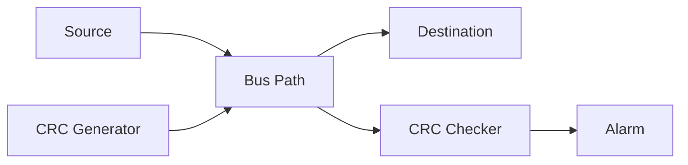

**Figure 7. A path failure mode often requires end-to-end or transaction-level safety mechanisms.**

This is why mechanism selection must understand structural scope.

---

## 14. Control Path Example: FSM State Corruption

For a control FSM, a simple data integrity mechanism may not be enough.

Failure modes:

```text
illegal_state_transition
wrong_control_decision
deadlock
unsafe_enable_assertion
```

Candidate mechanisms:

```text
safe-state encoding
FSM transition checker
duplication
lockstep controller
watchdog
timeout monitor
range checker
```

Example mapping:

```csv
failure_mode,required_scope,candidates
FM_ILLEGAL_STATE_TRANSITION,control_sequence,safe_state_encoding;fsm_transition_checker
FM_DEADLOCK,temporal,watchdog;timeout_monitor
FM_WRONG_CONTROL_DECISION,cone,duplication;lockstep;control_checker
```

Control failure modes are often temporal and semantic, not just bit-level.

This is why failure mode mapping is essential.

---

## 15. Memory Example: ECC, Parity, and Scrubbing

For memory-like structures, the typical mechanisms are:

```text
parity
SECDED ECC
stronger ECC
memory scrubbing
BIST
redundant memory
address/data integrity check
```

Mechanism choice depends on:

```text
memory size
bit upset rate
read frequency
write frequency
data lifetime
correction requirement
latency requirement
area budget
safety goal
```

A small register bank may use parity.

A large safety-critical memory may require ECC and scrubbing.

A memory storing configuration that is rarely read may need periodic diagnostic reads.

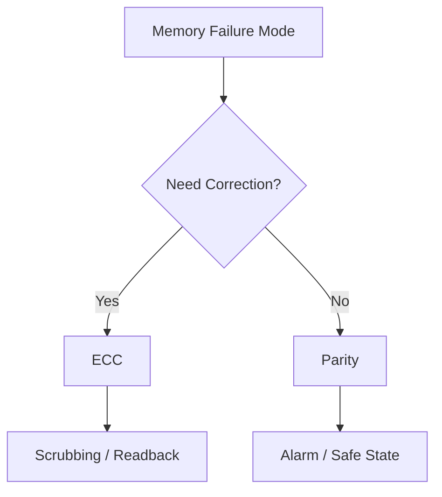

**Figure 8. Memory safety mechanism selection depends on correction need, usage pattern, and safety criticality.**

---

## 16. Compute Path Example: Lockstep vs Duplication

For CPU cores, safety controllers, and compute engines, stronger mechanisms may be needed.

Candidate mechanisms:

```text
dual-core lockstep
dual modular redundancy
triple modular redundancy
software redundancy
temporal redundancy
control flow checking
instruction/data integrity checks
```

Lockstep can provide strong coverage for many internal faults, but it is expensive.

It also requires:

```text
comparator
diversity or delay strategy
alarm reporting
reset/recovery response
common-cause fault consideration
debug/test handling
```

A selection engine should not simply say:

```text
Use lockstep.
```

It should say:

```text
Use lockstep because compute-path residual FIT and control failure modes exceed target,
but comparator and alarm path must also be protected and validated.
```

This distinction matters.

---

## 17. Alarm and Response Are Part of the Mechanism

A detection mechanism is not complete without a response path.

Detection chain:

```text
fault effect
→ safety mechanism detects
→ alarm asserts
→ alarm is transported
→ safety controller receives it
→ response occurs in time
```

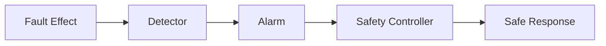

**Figure 9. A safety mechanism includes detection and response assumptions, not only local comparison logic.**

When selecting a mechanism, the tool should check:

```text
Does it require an alarm?
Is the alarm already listed?
Is the alarm path protected?
Is response latency modeled?
Is there a safe state?
Is the response observable in fault campaign?
```

For D07, response modeling can stay simple, but alarm requirement should already be explicit.

---

## 18. Cost Model

Safety mechanisms have costs.

Cost dimensions:

```text
area
power
timing
verification complexity
implementation complexity
latency
software dependency
test impact
integration risk
```

A simple cost model:

```yaml
cost_levels:
  low: 1
  medium: 2
  high: 3

mechanism_cost:
  endpoint_parity:
    area: low
    power: low
    timing: low
    verification: low

  memory_ecc:
    area: medium
    power: medium
    timing: medium
    verification: medium

  lockstep:
    area: high
    power: high
    timing: medium
    verification: high

  watchdog:
    area: low
    power: low
    timing: low
    verification: medium
```

A recommendation engine should not always choose maximum coverage.

It should expose the tradeoff.

Example output:

```csv
candidate,expected_dc,total_cost,score
endpoint_parity,0.90,4,0.82
duplication,0.95,8,0.78
lockstep,0.98,11,0.70
```

This helps engineers make a design decision.

---

## 19. Selection Policy

A project may define selection policy.

Example:

```yaml
selection_policy:
  target_dc_by_failure_mode:
    FM_DATA_CORRUPTION: 0.90
    FM_ALARM_NOT_ASSERTED: 0.85
    FM_CONTROL_FLOW_ERROR: 0.95

  residual_fit_threshold:
    warn: 0.005
    critical: 0.010

  allowed_cost:
    default_max_area: medium
    default_max_verification: medium

  alarm_policy:
    require_alarm_for_detection_mechanisms: true
    warn_if_alarm_path_unprotected: true

  recommendation:
    max_candidates_per_endpoint: 3
    include_reason: true
    include_limitations: true
```

The policy turns selection from ad-hoc judgment into repeatable engineering reasoning.

---

## 20. Output: Recommendation Table

The main output of D07 should be:

```text
sm_recommendations.csv
```

Example:

```csv
endpoint,failure_mode,residual_fit,current_dc,candidate,expected_dc,expected_residual_fit,cost,rank,reason
toy_counter.alarm,FM_ALARM_NOT_ASSERTED,0.0100,0.00,redundant_alarm,0.90,0.0010,medium,1,alarm path unprotected and residual FIT exceeds threshold
toy_counter.alarm,FM_ALARM_NOT_ASSERTED,0.0100,0.00,latched_alarm,0.70,0.0030,low,2,low-cost improvement but lower coverage
toy_counter.count_parity,FM_DIAGNOSTIC_STATE_CORRUPTION,0.0040,0.00,endpoint_parity,0.80,0.0008,low,1,diagnostic state is unprotected
toy_counter.count,FM_DATA_CORRUPTION,0.0064,0.90,duplication,0.95,0.0032,medium,2,improves cone coverage beyond endpoint parity
```

A good recommendation table should include:

```text
current weakness
candidate mechanism
expected improvement
expected residual FIT
cost
rank
reason
limitations
review status
```

---

## 21. Output: Selected Safety Mechanism Map

The recommendation is not the final decision.

An engineer may choose one candidate.

The selected result can be stored as:

```text
selected_sm_map.csv
```

Example:

```csv
endpoint,failure_mode,selected_mechanism,selected_dc,alarm,decision_status,decision_reason
toy_counter.alarm,FM_ALARM_NOT_ASSERTED,redundant_alarm,0.90,toy_counter.alarm_red,proposed,highest risk uncovered diagnostic path
toy_counter.count_parity,FM_DIAGNOSTIC_STATE_CORRUPTION,endpoint_parity,0.80,toy_counter.diag_alarm,proposed,protect diagnostic state
toy_counter.count,FM_DATA_CORRUPTION,endpoint_parity,0.90,toy_counter.alarm,keep_existing,current mechanism acceptable for demo
```

This file becomes input to later DC recalculation and fault campaign planning.

---

## 22. Output: Mechanism Improvement Delta

A useful report compares before and after selection.

Example:

```csv
endpoint,failure_mode,current_dc,proposed_dc,current_residual_fit,proposed_residual_fit,delta_residual_fit
toy_counter.alarm,FM_ALARM_NOT_ASSERTED,0.00,0.90,0.0100,0.0010,0.0090
toy_counter.count_parity,FM_DIAGNOSTIC_STATE_CORRUPTION,0.00,0.80,0.0040,0.0008,0.0032
toy_counter.count,FM_DATA_CORRUPTION,0.90,0.90,0.0064,0.0064,0.0000
```

This makes the benefit visible.

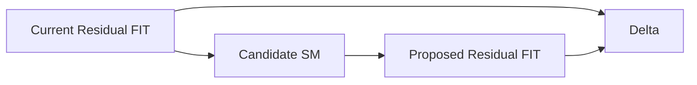

**Figure 10. Mechanism selection should show expected residual FIT improvement.**

---

## 23. Tool Architecture

The generic tool `safeic-smselect` can be implemented as a staged pipeline.

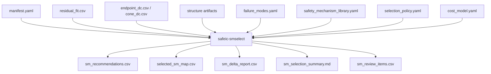

**Figure 11. `safeic-smselect` converts residual risk and weak coverage into ranked safety mechanism recommendations.**

Suggested internal modules:

```text
safeic_smselect/
  cli.py
  manifest.py
  load_dc.py
  load_structure.py
  load_failure_modes.py
  load_sm_library.py
  load_policy.py
  matcher.py
  scorer.py
  residual_delta.py
  report.py
```

Responsibilities:

| Module | Responsibility |
|---|---|
| `load_dc.py` | Load residual FIT and DC reports |
| `load_structure.py` | Load endpoints, cones, startpoint usage |
| `load_failure_modes.py` | Load failure mode taxonomy |
| `load_sm_library.py` | Load mechanism capabilities |
| `load_policy.py` | Load project selection policy |
| `matcher.py` | Generate candidate mechanism list |
| `scorer.py` | Rank candidates |
| `residual_delta.py` | Estimate residual FIT improvement |
| `report.py` | Generate CSV and Markdown outputs |

---

## 24. D07 Directory Structure

Suggested directory:

```text
D07_safety_mechanism_selection/
  README.md
  run_demo.sh
  run_demo.csh
  manifest.yaml

  inputs/
    safety_mechanism_library.yaml
    failure_modes.yaml
    selection_policy.yaml
    cost_model.yaml

  intermediate/
    endpoints.csv
    cones.csv
    startpoint_usage.csv
    endpoint_dc.csv
    cone_dc.csv
    residual_fit.csv
    dc_rollup_by_failure_mode.csv
    dc_rollup_by_part.csv

  outputs/
    sm_recommendations.csv
    selected_sm_map.csv
    sm_delta_report.csv
    sm_selection_summary.md
    sm_review_items.csv
```

D07 should not recompute DC. It consumes D06 outputs and recommends improvements.

---

## 25. D07 Manifest

Example:

```yaml
project:
  name: automotive_safeic_practice
  demo: D07_safety_mechanism_selection
  top_module: toy_counter

inputs:
  safety_mechanism_library: inputs/safety_mechanism_library.yaml
  failure_modes: inputs/failure_modes.yaml
  selection_policy: inputs/selection_policy.yaml
  cost_model: inputs/cost_model.yaml

dc_inputs:
  endpoint_dc: intermediate/endpoint_dc.csv
  cone_dc: intermediate/cone_dc.csv
  residual_fit: intermediate/residual_fit.csv
  rollup_by_failure_mode: intermediate/dc_rollup_by_failure_mode.csv
  rollup_by_part: intermediate/dc_rollup_by_part.csv

structure:
  endpoints: intermediate/endpoints.csv
  cones: intermediate/cones.csv
  startpoint_usage: intermediate/startpoint_usage.csv

outputs:
  recommendations: outputs/sm_recommendations.csv
  selected_map: outputs/selected_sm_map.csv
  delta_report: outputs/sm_delta_report.csv
  summary: outputs/sm_selection_summary.md
  review_items: outputs/sm_review_items.csv
```

The manifest makes the decision context explicit.

---

## 26. D07 Execution Flow

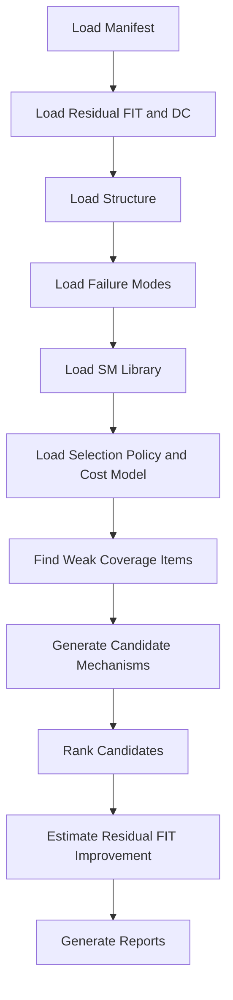

**Figure 12. D07 execution flow: identify weak coverage, recommend candidates, rank them, and estimate improvement.**

Example bash script:

```bash
#!/usr/bin/env bash
set -euo pipefail

safeic-smselect \
  --manifest manifest.yaml \
  --output-dir outputs
```

Example csh script:

```csh
#!/bin/csh -f

set DEMO = D07_safety_mechanism_selection
echo "Running $DEMO"

safeic-smselect \
  --manifest manifest.yaml \
  --output-dir outputs
```

Expected outputs:

```text
outputs/sm_recommendations.csv
outputs/selected_sm_map.csv
outputs/sm_delta_report.csv
outputs/sm_selection_summary.md
outputs/sm_review_items.csv
```

---

## 27. Example `sm_selection_summary.md`

A good summary report:

```md
# D07 Safety Mechanism Selection Summary

Project: automotive_safeic_practice
Demo: D07_safety_mechanism_selection
Top: toy_counter

## Key Weaknesses

1. toy_counter.alarm has no alarm-path protection.
2. toy_counter.count_parity is diagnostic state but has no protection.
3. toy_counter.count has endpoint parity, but upstream cone is not covered.

## Top Recommendations

### 1. Protect alarm path

Endpoint: toy_counter.alarm  
Failure mode: FM_ALARM_NOT_ASSERTED  
Recommended mechanism: redundant_alarm  
Expected DC: 0.90  
Expected residual FIT reduction: 0.0090  

### 2. Protect diagnostic state

Endpoint: toy_counter.count_parity  
Failure mode: FM_DIAGNOSTIC_STATE_CORRUPTION  
Recommended mechanism: endpoint_parity  
Expected DC: 0.80  

## Review Items

- Confirm whether alarm path protection is required at this design level.
- Confirm whether endpoint parity is sufficient for the counter state.
- Decide whether cone-level protection is needed for higher ASIL targets.
```

The report should help engineers make a design choice, not merely display a score.

---

## 28. Validation Rules

`safeic-smselect` should validate:

```text
residual_fit.csv exists
endpoint_dc.csv exists
mechanism library exists
failure mode file exists
selection policy exists
candidate mechanisms reference known failure modes
candidate mechanisms have valid scope
expected DC values are between 0 and 1
cost values are valid
alarm requirements are explicit
selected mechanisms have decision status
```

Example messages:

```text
[PASS] residual FIT data loaded
[PASS] endpoint toy_counter.alarm has weak coverage and residual FIT above warning threshold
[PASS] candidate redundant_alarm matches FM_ALARM_NOT_ASSERTED
[WARN] candidate lockstep has high cost for low residual FIT item
[WARN] mechanism endpoint_parity does not cover cone scope
[ERROR] failure mode FM_UNKNOWN referenced by selection rule but not defined
```

A recommendation tool should explain both recommended and rejected mechanisms.

---

## 29. Common Mistakes

### 29.1 Selecting Mechanisms by Name

Bad:

```text
Use ECC because ECC is strong.
```

Better:

```text
Use ECC because the failure mode is memory data corruption, correction is required, and memory transient FIT dominates residual risk.
```

### 29.2 Ignoring Structural Scope

Endpoint parity cannot solve every upstream cone problem.

CRC cannot protect unrelated control state.

Watchdog cannot detect all data corruption.

### 29.3 Ignoring Alarm Path

A detector without a reliable alarm and response path may not provide useful diagnostic coverage.

### 29.4 Always Choosing the Strongest Mechanism

Lockstep or TMR may be excessive for low-risk structures.

Selection should balance risk reduction and engineering cost.

### 29.5 Ignoring Verification Cost

A mechanism that cannot be validated is weak safety evidence.

Mechanism selection should include fault campaign feasibility.

### 29.6 Treating Recommendation as Final Approval

Tool recommendation is not final safety approval.

It is an input to engineering review.

---

## 30. How D07 Connects to Later Demos

D07 outputs proposed safety mechanism improvements.

These feed later steps:

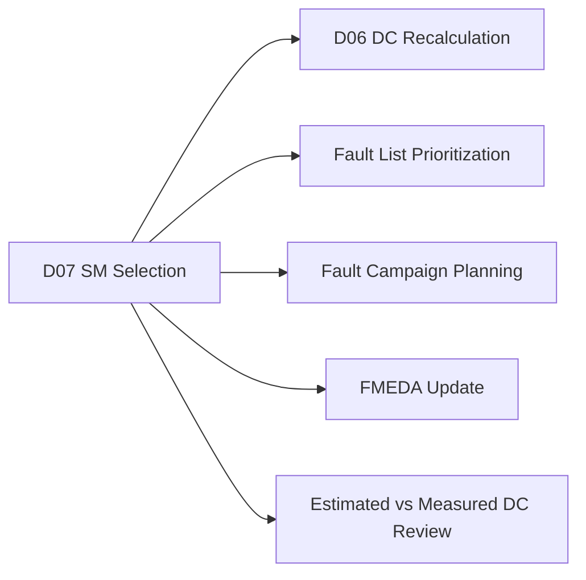

**Figure 13. D07 recommendations become inputs to DC recalculation, fault campaign planning, and FMEDA update.**

After selection, the workflow should:

```text
update endpoint-to-safety-mechanism map
recompute estimated DC
generate targeted fault list
run fault campaign
compare measured coverage against expected coverage
update FMEDA evidence
```

D07 is not the end of the loop. It is the design-improvement step.

---

## 31. Recommended Implementation Stages

D07 can be implemented in stages.

### Stage 1: Rule-Based Candidate Matching

Use failure mode and endpoint type to generate candidate mechanisms.

Deliverables:

```text
sm_recommendations.csv
sm_selection_summary.md
```

### Stage 2: Residual FIT Ranking

Use residual FIT to prioritize recommendations.

Deliverables:

```text
ranked_sm_recommendations.csv
```

### Stage 3: Cost-Aware Scoring

Add implementation and verification cost.

Deliverables:

```text
sm_score_breakdown.csv
```

### Stage 4: Delta Report

Estimate residual FIT improvement.

Deliverables:

```text
sm_delta_report.csv
```

### Stage 5: Selected Map Generation

Generate proposed selected SM map for later DC recalculation.

Deliverables:

```text
selected_sm_map.csv
```

This staged implementation keeps the demo practical and extensible.

---

## 32. Summary

Safety mechanism selection is the engineering step that turns weak coverage into design action.

The D07 demo:

```text
D07_safety_mechanism_selection
```

introduces the generic tool:

```text
safeic-smselect
```

The tool consumes:

```text
D05 structural artifacts
D06 diagnostic coverage outputs
residual FIT reports
failure mode library
safety mechanism library
selection policy
cost model
```

and generates:

```text
sm_recommendations.csv
selected_sm_map.csv
sm_delta_report.csv
sm_selection_summary.md
sm_review_items.csv
```

The central lesson is:

> A safety mechanism should be selected because it addresses a specific residual risk, failure mode, and structural scope, under explicit cost and validation assumptions.

This step connects quantitative safety analysis back to design improvement.

---

## 33. D07 Demo Checklist

For `D07_safety_mechanism_selection`, the expected deliverables are:

```text
[ ] README.md
[ ] run_demo.sh
[ ] run_demo.csh
[ ] manifest.yaml

[ ] inputs/safety_mechanism_library.yaml
[ ] inputs/failure_modes.yaml
[ ] inputs/selection_policy.yaml
[ ] inputs/cost_model.yaml

[ ] intermediate/endpoints.csv
[ ] intermediate/cones.csv
[ ] intermediate/startpoint_usage.csv
[ ] intermediate/endpoint_dc.csv
[ ] intermediate/cone_dc.csv
[ ] intermediate/residual_fit.csv
[ ] intermediate/dc_rollup_by_failure_mode.csv
[ ] intermediate/dc_rollup_by_part.csv

[ ] outputs/sm_recommendations.csv
[ ] outputs/selected_sm_map.csv
[ ] outputs/sm_delta_report.csv
[ ] outputs/sm_selection_summary.md
[ ] outputs/sm_review_items.csv
```

A successful D07 run should answer:

```text
Which endpoints or failure modes have weak coverage?
Which residual FIT items should be prioritized?
Which safety mechanisms are suitable candidates?
Why was each candidate recommended?
What coverage improvement is expected?
What residual FIT reduction is expected?
What implementation and verification cost is assumed?
Which mechanisms are proposed for selection?
Can the result feed DC recalculation, fault list generation, and FMEDA update?
```
