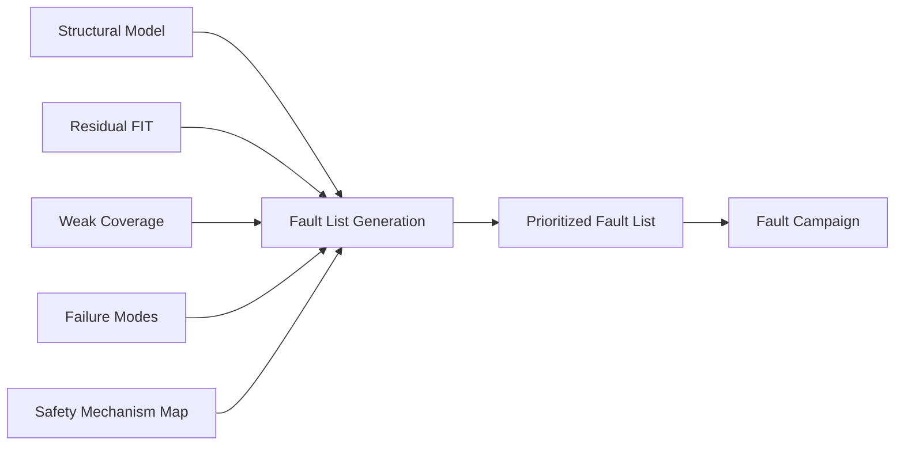
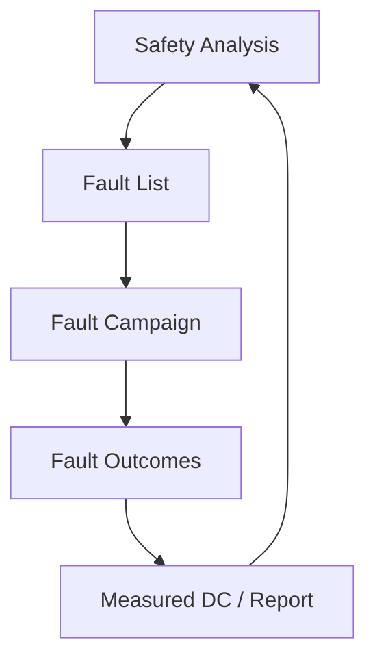
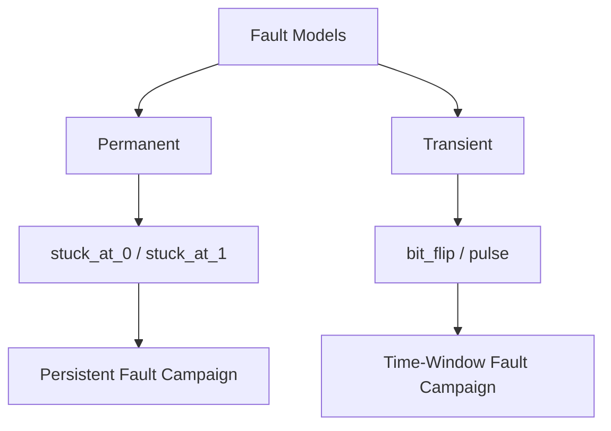
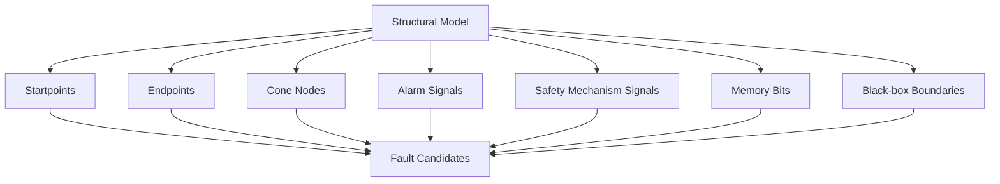
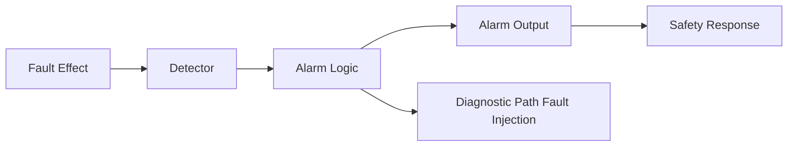
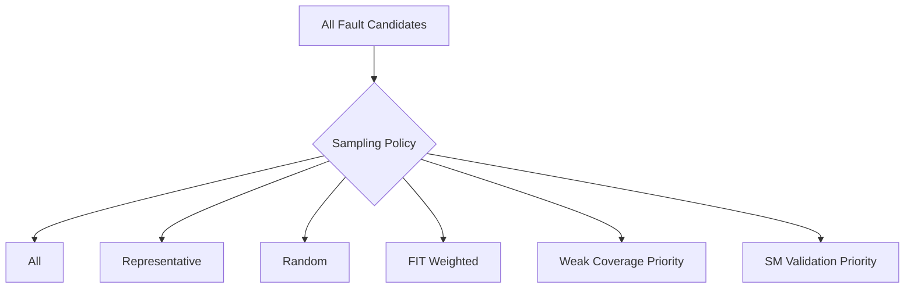
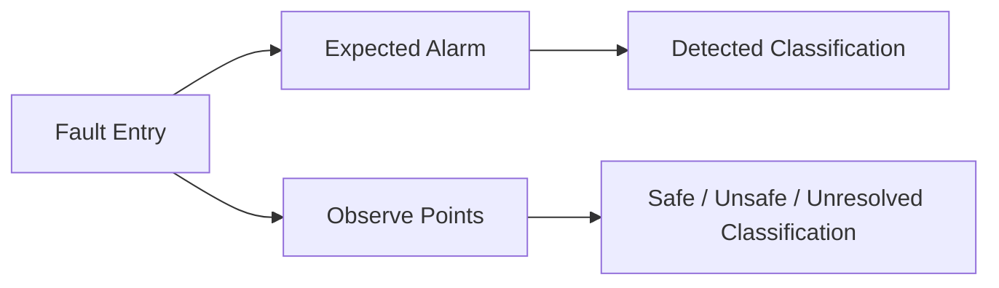
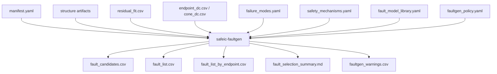
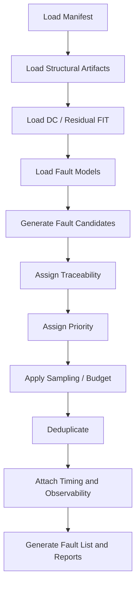
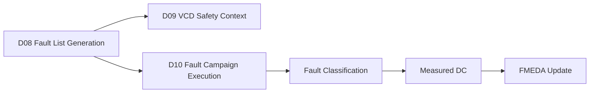

# [Automotive Safe-IC Practice 08] Fault List Generation: Turning Safety Analysis into a Targeted Fault Campaign

**Author**: Darren H. Chen  
**Direction**: Automotive Chip Functional Safety Analysis and Fault Injection Practice  
**Demo**: D08_fault_list_generation  
**Tags**: Automotive Chip, Functional Safety, Fault List, Fault Injection, Fault Campaign, Diagnostic Coverage, Residual FIT, Startpoint, Endpoint, Cone, FMEDA, Safety Mechanism

---

## 1. Why This Article Matters

In the previous articles, we built the analysis side of the functional safety workflow:

```text
Input package
→ FIT model
→ Base FIT Rate
→ Structural safety model
→ Diagnostic Coverage
→ Safety Mechanism Selection
```

Now we need to convert that analysis into validation work.

The key question becomes:

> Which faults should we actually inject?

A fault campaign cannot be effective if the fault list is random, too broad, too small, or disconnected from the safety argument.

The eighth demo in this repository is:

```text
D08_fault_list_generation
```

The generic tool introduced in this article is:

```text
safeic-faultgen
```

The purpose of `safeic-faultgen` is to generate a traceable, prioritized fault list from:

```text
structural safety model
startpoints
endpoints
cones
failure modes
diagnostic coverage gaps
residual FIT
safety mechanism mappings
fault model policy
campaign budget
```

The central idea is:

> A fault list is not merely a list of nodes. It is the bridge between safety analysis and fault injection validation.

---

## 2. Why Fault List Generation Comes After Safety Analysis

A naive approach is:

```text
Inject faults into all nodes.
```

This may sound complete, but it is often inefficient and sometimes misleading.

A better approach is:

```text
Inject faults where safety evidence is needed.
```

Safety analysis tells us where evidence is needed:

```text
high residual FIT
weak diagnostic coverage
safety-critical endpoints
unprotected cones
diagnostic path weakness
important failure modes
high-impact startpoints
black-box boundaries
```



**Figure 1. Fault list generation converts analysis artifacts into validation targets.**

This is why D08 consumes D05, D06, and D07 outputs.

---

## 3. What Is a Fault List?

At the simplest level, a fault list defines:

```text
where to inject
what fault type to inject
how to inject it
when to inject it
how to observe the result
why this fault matters
```

A minimal fault entry may look like:

```text
toy_counter.count[0] stuck_at_0
toy_counter.count[0] stuck_at_1
toy_counter.alarm stuck_at_0
```

But this is too weak for a safety workflow.

A safety-oriented fault entry should also include:

```text
fault_id
node
fault_type
fault_model
injection_scope
related_endpoint
related_failure_mode
related_safety_mechanism
expected_alarm
observe_points
priority
reason
```

Example:

```csv
fault_id,node,fault_type,endpoint,failure_mode,expected_alarm,priority,reason
F001,toy_counter.count[0],stuck_at_0,toy_counter.count,FM_DATA_CORRUPTION,toy_counter.alarm,HIGH,residual FIT and endpoint parity validation
F002,toy_counter.alarm,stuck_at_0,toy_counter.alarm,FM_ALARM_NOT_ASSERTED,,HIGH,alarm path unprotected
```

The extra columns are not decoration. They make the fault list traceable.

---

## 4. Fault List as a Contract

A fault list is a contract between safety analysis and fault injection.

Safety analysis says:

```text
These structures and failure modes require evidence.
```

Fault injection says:

```text
I will inject these faults and classify the outcomes.
```



**Figure 2. The fault list is the contract between analysis assumptions and validation evidence.**

If the fault list is not traceable, the fault campaign result cannot easily be mapped back to:

```text
FMEDA
diagnostic coverage
residual FIT
safety mechanism validation
failure mode review
```

Therefore, D08 emphasizes traceability from the beginning.

---

## 5. Fault Models

A fault model defines how a fault behaves.

Common digital fault models include:

```text
stuck-at-0
stuck-at-1
transient bit flip
pulse
delay fault
open fault abstraction
bridging fault abstraction
memory bit upset
register corruption
force/release fault
```

For early functional safety demos, we can start with:

```text
stuck_at_0
stuck_at_1
transient_flip
```

These are enough to demonstrate the methodology.

A practical fault model library:

```yaml
fault_models:
  stuck_at_0:
    type: permanent
    description: Force the target node to logic 0.
    applies_to:
      - net
      - reg
      - output
      - alarm
    campaign_use:
      - permanent_fault_validation

  stuck_at_1:
    type: permanent
    description: Force the target node to logic 1.
    applies_to:
      - net
      - reg
      - output
      - alarm
    campaign_use:
      - permanent_fault_validation

  transient_flip:
    type: transient
    description: Flip a state element or sampled value for a bounded time.
    applies_to:
      - flip_flop
      - memory_bit
      - register_bit
    campaign_use:
      - soft_error_validation
```

The fault list generator should not blindly apply every fault model to every node.

It should check whether the fault model is meaningful for the target node.

---

## 6. Permanent vs Transient Fault List Generation

Permanent and transient faults require different campaign logic.

### 6.1 Permanent Faults

Permanent faults persist after injection.

Examples:

```text
node stuck at 0
node stuck at 1
alarm output stuck inactive
configuration bit permanently corrupted
```

Permanent faults are useful for validating:

```text
stuck-at behavior
diagnostic tests
BIST assumptions
alarm path robustness
persistent logic corruption
```

### 6.2 Transient Faults

Transient faults exist for a limited duration.

Examples:

```text
flip a register bit for one cycle
corrupt memory bit during active window
inject pulse on control signal
temporarily corrupt bus payload
```

Transient faults are useful for validating:

```text
soft error response
ECC behavior
parity detection
temporal monitors
state recovery
```



**Figure 3. Permanent and transient fault models require different generation and campaign strategies.**

D08 should generate both types, but keep the first demo small.

---

## 7. Structural Sources of Fault Candidates

The primary source of fault candidates is the structural safety model.

Candidate nodes may come from:

```text
startpoints
endpoints
cone internal nodes
alarm signals
safety mechanism signals
diagnostic state
configuration state
memory bits
black-box outputs
```

Each source has different meaning.

| Candidate Source | Why It Matters |
|---|---|
| Startpoint | Fault effect origin |
| Endpoint | Safety-relevant observation point |
| Cone internal node | Propagation logic |
| Alarm signal | Diagnostic reporting path |
| Safety mechanism state | Protection logic may fail |
| Configuration register | May affect many endpoints |
| Memory bit | High transient fault relevance |
| Black-box output | Unknown internal structure boundary |



**Figure 4. Fault candidates are generated from multiple safety-relevant structural sources.**

A good fault list generator should tag the source of each candidate.

---

## 8. Endpoint-Driven Fault Selection

Endpoint-driven selection starts from safety-relevant endpoints.

It asks:

```text
Which nodes can affect this endpoint?
Which fault models should be injected?
Which safety mechanism is expected to detect the effect?
Which failure mode is being validated?
```

Example:

```text
endpoint:
  toy_counter.count

failure mode:
  FM_DATA_CORRUPTION

candidate startpoints:
  toy_counter.count_reg
  toy_counter.en
  next_count_logic

expected safety mechanism:
  endpoint_parity
```

Generated faults:

```csv
fault_id,node,fault_type,endpoint,failure_mode,expected_alarm,reason
F001,toy_counter.count[0],transient_flip,toy_counter.count,FM_DATA_CORRUPTION,toy_counter.alarm,validate endpoint parity
F002,toy_counter.count[1],transient_flip,toy_counter.count,FM_DATA_CORRUPTION,toy_counter.alarm,validate endpoint parity
```

Endpoint-driven generation keeps the campaign aligned with safety review.

---

## 9. Residual-FIT-Driven Fault Selection

Residual FIT tells us where risk remains after estimated coverage.

A residual-FIT-driven generator prioritizes fault candidates that contribute to residual risk.

Example input:

```csv
endpoint,failure_mode,base_fit,dc,residual_fit
toy_counter.alarm,FM_ALARM_NOT_ASSERTED,0.010,0.00,0.010
toy_counter.count_parity,FM_DIAGNOSTIC_STATE_CORRUPTION,0.004,0.00,0.004
toy_counter.count,FM_DATA_CORRUPTION,0.064,0.90,0.0064
```

Priority result:

```text
1. alarm path faults
2. counter state faults
3. diagnostic state faults
```

This ordering may surprise people because `toy_counter.count` has high base FIT but lower residual risk after parity.


**Figure 5. Residual FIT is often a better prioritization signal than raw base FIT.**

Fault generation should allow ranking by residual risk, not only structural size.

---

## 10. Weak-Coverage-Driven Fault Selection

Weak coverage means:

```text
low DC
unprotected endpoint
unprotected alarm path
uncovered cone
unmapped failure mode
unverified safety mechanism
```

Weak-coverage-driven generation focuses on validating or exposing these gaps.

Example:

```csv
endpoint,weakness,recommended_faults
toy_counter.alarm,alarm path unprotected,stuck_at_0;stuck_at_1
toy_counter.count_parity,diagnostic state unprotected,transient_flip;stuck_at_0
toy_counter.count,cone not covered,cone_internal_stuck_at;transient_flip
```

This style is important because safety engineering is often about finding the weakest link.

---

## 11. Safety-Mechanism-Driven Fault Selection

Sometimes the goal is to validate a safety mechanism.

For example:

```text
Validate endpoint parity.
Validate ECC.
Validate CRC.
Validate lockstep comparator.
Validate watchdog timeout.
Validate alarm path monitor.
```

The fault list should include faults that are expected to trigger the mechanism.

Example:

```text
Safety mechanism:
  endpoint_parity

Expected alarm:
  toy_counter.alarm

Target nodes:
  toy_counter.count[0]
  toy_counter.count[1]
  toy_counter.count_parity
```

Generated entries:

```csv
fault_id,node,fault_type,safety_mechanism,expected_alarm,expected_outcome
F010,toy_counter.count[0],transient_flip,endpoint_parity,toy_counter.alarm,detected
F011,toy_counter.count_parity,stuck_at_0,endpoint_parity,toy_counter.alarm,detected_or_unsafe
```

The second case is interesting because corrupting the diagnostic state may either trigger an alarm or break detection.

This is why the expected outcome can be:

```text
detected
safe
unsafe
unresolved
needs_review
```

---

## 12. Diagnostic Path Faults

A common mistake is to inject faults only into functional logic and ignore diagnostic logic.

But diagnostic logic can fail too.

Diagnostic path targets include:

```text
alarm signal
alarm latch
alarm enable
alarm mask
diagnostic status register
safety controller input
interrupt output
error aggregation logic
```

Example:

```csv
fault_id,node,fault_type,failure_mode,reason
F020,toy_counter.alarm,stuck_at_0,FM_ALARM_NOT_ASSERTED,alarm path can be blocked
F021,toy_counter.alarm,stuck_at_1,FM_FALSE_ALARM,alarm path can falsely assert
```



**Figure 6. Diagnostic path faults validate whether the safety mechanism reporting chain can fail.**

A safety campaign that ignores alarm-path faults may overestimate diagnostic coverage.

---

## 13. Configuration and Masking Faults

Many safety mechanisms have configuration or enable signals.

Examples:

```text
alarm_mask
ecc_enable
parity_enable
watchdog_enable
safe_mode_enable
fault_response_enable
interrupt_enable
```

A fault on these signals may disable the safety mechanism.

Example fault entries:

```csv
fault_id,node,fault_type,failure_mode,reason
F030,toy_counter.alarm_mask,stuck_at_1,FM_DIAGNOSTIC_MASKED,alarm may be masked
F031,toy_counter.parity_enable,stuck_at_0,FM_DETECTION_DISABLED,parity mechanism disabled
```

These are important because a safety mechanism is only useful if it remains enabled and observable.

D08 should support a policy:

```yaml
include_configuration_faults: true
include_diagnostic_masking_faults: true
```

---

## 14. Sampling Strategy

A full fault list can become very large.

Even a modest RTL block can contain:

```text
thousands of signals
many bits per bus
multiple fault types per bit
many injection time points
```

Therefore, fault list generation often needs sampling.

Sampling policies may include:

```text
all bits
representative bits
random sample
FIT-weighted sample
endpoint-priority sample
cone-size-weighted sample
failure-mode-priority sample
safety-mechanism-validation sample
```



**Figure 7. Sampling policy controls campaign size while preserving safety intent.**

For D08, the demo can use:

```text
representative bits
high residual FIT endpoints
alarm path faults
one or two safety mechanism validation faults
```

This makes the campaign small but meaningful.

---

## 15. Fault Campaign Budget

A fault campaign may be constrained by:

```text
simulation runtime
license availability
machine resources
CI time
schedule
review scope
demo simplicity
```

Therefore, `safeic-faultgen` should support a campaign budget.

Example:

```yaml
campaign_budget:
  max_faults_total: 50
  max_faults_per_endpoint: 10
  max_faults_per_failure_mode: 15
  max_alarm_path_faults: 5
  include_high_priority_first: true
```

A budget makes the generated fault list realistic.

The tool should report what was included and what was excluded.

Example:

```csv
category,total_candidates,selected,excluded,policy
endpoint_faults,120,20,100,max_faults_per_endpoint
alarm_path_faults,6,5,1,max_alarm_path_faults
diagnostic_state_faults,12,8,4,priority
```

This avoids pretending that a small demo fault list is exhaustive.

---

## 16. Injection Timing

Fault list entries may require timing information.

Permanent stuck-at faults may be injected at time zero or after reset.

Transient faults need a time or time window.

Timing should be tied to VCD safety context.

Examples:

```text
inject after reset release
inject during active operation
inject when bus valid is high
inject when memory read occurs
inject when watchdog is counting
inject during safety-critical state
```

Example timing policy:

```yaml
injection_timing:
  default:
    start_after_reset: true
    active_window: [30, 200]

  transient_flip:
    mode: active_window_sample
    cycles_per_fault: 1

  stuck_at:
    mode: persistent_after_reset
```

Fault list output:

```csv
fault_id,node,fault_type,injection_time,injection_window
F001,toy_counter.count[0],transient_flip,60,30:200
F002,toy_counter.alarm,stuck_at_0,30,30:200
```

D08 can generate timing placeholders; D09 will focus on VCD context in more detail.

---

## 17. Expected Alarm and Observe Points

A safety-oriented fault list should include expected alarm and observe points.

Example:

```csv
fault_id,node,fault_type,expected_alarm,observe_points
F001,toy_counter.count[0],transient_flip,toy_counter.alarm,toy_counter.count;toy_counter.alarm
F020,toy_counter.alarm,stuck_at_0,,toy_counter.alarm
```

Why?

Because fault classification needs to know:

```text
what alarm should fire
what behavior should be compared
which signal proves propagation
which signal proves detection
```

This connects fault generation to later result classification.



**Figure 8. Expected alarms and observe points make fault classification traceable.**

---

## 18. Traceability Columns

A good fault list should contain enough traceability columns.

Recommended columns:

```text
fault_id
node
bit
fault_type
fault_model
fault_class
injection_mode
injection_time
injection_window
source
related_startpoint
related_endpoint
related_cone
related_failure_mode
related_safety_mechanism
expected_alarm
observe_points
priority
reason
selection_policy
review_status
```

This may look large, but it prevents later ambiguity.

Example:

```csv
fault_id,node,bit,fault_type,source,endpoint,failure_mode,safety_mechanism,expected_alarm,priority,reason
F001,toy_counter.count,0,transient_flip,endpoint,toy_counter.count,FM_DATA_CORRUPTION,endpoint_parity,toy_counter.alarm,HIGH,validate parity detection on counter state
```

For GitHub demos, the CSV can be simplified. But the data model should already anticipate industrial traceability.

---

## 19. Priority Assignment

Fault priority can be derived from:

```text
residual FIT
failure mode criticality
low diagnostic coverage
endpoint criticality
cone size
startpoint usage
alarm path involvement
safety mechanism validation need
manual override
```

A simple priority model:

```text
priority_score =
  residual_fit_weight × normalized_residual_fit
+ dc_gap_weight × (1 - dc)
+ criticality_weight × endpoint_criticality
+ usage_weight × normalized_startpoint_usage
+ alarm_path_weight × alarm_path_flag
```

Example policy:

```yaml
priority_policy:
  weights:
    residual_fit: 0.35
    dc_gap: 0.25
    endpoint_criticality: 0.15
    startpoint_usage: 0.10
    alarm_path: 0.15

  thresholds:
    high: 0.75
    medium: 0.40
    low: 0.00
```

Priority labels:

```text
HIGH
MEDIUM
LOW
DEFERRED
```

The scoring should be transparent and reported.

---

## 20. Avoiding Duplicate Faults

When candidates come from multiple sources, duplicates can occur.

Example:

```text
toy_counter.alarm
```

may appear as:

```text
endpoint
alarm signal
diagnostic path
observe point
failure mode target
```

The fault generator should deduplicate entries while preserving reasons.

Example output:

```csv
fault_id,node,fault_type,sources,reasons
F020,toy_counter.alarm,stuck_at_0,endpoint;alarm_path;failure_mode,alarm path unprotected;FM_ALARM_NOT_ASSERTED
```

This is better than generating duplicate fault entries with no explanation.

---

## 21. Black-Box Fault Candidates

Black boxes require special handling.

If internal structure is unknown, fault candidates may be generated at:

```text
black-box outputs
black-box inputs
interface signals
summary model pins
supplier-provided fault points
```

Example:

```yaml
blackbox_fault_policy:
  treat_outputs_as_startpoints: true
  inject_on_interface_only: true
  require_supplier_fault_model: false
```

Example fault entries:

```csv
fault_id,node,fault_type,source,reason
F100,top.u_sram.rdata[0],transient_flip,blackbox_output,memory macro internal faults abstracted at output
F101,top.u_pll.lock,stuck_at_1,blackbox_output,PLL lock false indication
```

The report should clearly state that internal black-box faults are abstracted.

---

## 22. Fault List Output Formats

D08 should produce several output files.

Suggested outputs:

```text
outputs/fault_candidates.csv
outputs/fault_list.csv
outputs/fault_list_by_endpoint.csv
outputs/fault_list_by_failure_mode.csv
outputs/fault_selection_summary.md
outputs/faultgen_warnings.csv
```

`fault_candidates.csv` contains all candidates before sampling.

`fault_list.csv` contains selected faults for the campaign.

`fault_selection_summary.md` explains selection logic.

This separation is important:

```text
candidate generation
selection / sampling
campaign execution
```

should not be mixed.

---

## 23. The `safeic-faultgen` Tool Architecture

The generic tool `safeic-faultgen` can be implemented as a staged pipeline.



**Figure 9. `safeic-faultgen` converts safety analysis artifacts into traceable campaign-ready fault lists.**

Suggested internal modules:

```text
safeic_faultgen/
  cli.py
  manifest.py
  load_structure.py
  load_dc.py
  load_failure_modes.py
  load_fault_models.py
  candidate_generator.py
  priority.py
  sampler.py
  deduplicate.py
  timing.py
  report.py
```

Responsibilities:

| Module | Responsibility |
|---|---|
| `load_structure.py` | Load startpoints, endpoints, cones, alarms |
| `load_dc.py` | Load DC and residual FIT |
| `load_fault_models.py` | Load supported fault models |
| `candidate_generator.py` | Generate raw candidates |
| `priority.py` | Assign priority scores |
| `sampler.py` | Select candidates under campaign budget |
| `deduplicate.py` | Merge duplicate fault requests |
| `timing.py` | Attach injection timing policy |
| `report.py` | Generate CSV and Markdown outputs |

---

## 24. D08 Directory Structure

Suggested directory:

```text
D08_fault_list_generation/
  README.md
  run_demo.sh
  run_demo.csh
  manifest.yaml

  inputs/
    fault_model_library.yaml
    faultgen_policy.yaml
    failure_modes.yaml
    safety_mechanisms.yaml

  intermediate/
    startpoints.csv
    endpoints.csv
    cones.csv
    startpoint_usage.csv
    endpoint_dc.csv
    cone_dc.csv
    residual_fit.csv
    selected_sm_map.csv

  outputs/
    fault_candidates.csv
    fault_list.csv
    fault_list_by_endpoint.csv
    fault_list_by_failure_mode.csv
    fault_selection_summary.md
    faultgen_warnings.csv
```

D08 should consume previous artifacts and not recompute everything.

---

## 25. D08 Manifest

Example:

```yaml
project:
  name: automotive_safeic_practice
  demo: D08_fault_list_generation
  top_module: toy_counter

inputs:
  fault_model_library: inputs/fault_model_library.yaml
  faultgen_policy: inputs/faultgen_policy.yaml
  failure_modes: inputs/failure_modes.yaml
  safety_mechanisms: inputs/safety_mechanisms.yaml

analysis_inputs:
  startpoints: intermediate/startpoints.csv
  endpoints: intermediate/endpoints.csv
  cones: intermediate/cones.csv
  startpoint_usage: intermediate/startpoint_usage.csv
  endpoint_dc: intermediate/endpoint_dc.csv
  cone_dc: intermediate/cone_dc.csv
  residual_fit: intermediate/residual_fit.csv
  selected_sm_map: intermediate/selected_sm_map.csv

outputs:
  candidates: outputs/fault_candidates.csv
  selected_faults: outputs/fault_list.csv
  by_endpoint: outputs/fault_list_by_endpoint.csv
  by_failure_mode: outputs/fault_list_by_failure_mode.csv
  summary: outputs/fault_selection_summary.md
  warnings: outputs/faultgen_warnings.csv
```

The manifest keeps the generation context reviewable.

---

## 26. D08 Execution Flow



**Figure 10. D08 execution flow: generate, trace, prioritize, sample, deduplicate, and report.**

Example bash script:

```bash
#!/usr/bin/env bash
set -euo pipefail

safeic-faultgen \
  --manifest manifest.yaml \
  --output-dir outputs
```

Example csh script:

```csh
#!/bin/csh -f

set DEMO = D08_fault_list_generation
echo "Running $DEMO"

safeic-faultgen \
  --manifest manifest.yaml \
  --output-dir outputs
```

Expected outputs:

```text
outputs/fault_candidates.csv
outputs/fault_list.csv
outputs/fault_list_by_endpoint.csv
outputs/fault_list_by_failure_mode.csv
outputs/fault_selection_summary.md
outputs/faultgen_warnings.csv
```

---

## 27. Example `faultgen_policy.yaml`

```yaml
faultgen_policy:
  candidate_sources:
    include_startpoints: true
    include_endpoints: true
    include_cone_nodes: true
    include_alarm_paths: true
    include_safety_mechanism_signals: true
    include_configuration_faults: true
    include_blackbox_outputs: true

  fault_models:
    default:
      - stuck_at_0
      - stuck_at_1
    state_elements:
      - transient_flip
      - stuck_at_0
      - stuck_at_1
    alarm_paths:
      - stuck_at_0
      - stuck_at_1

  priority:
    use_residual_fit: true
    use_dc_gap: true
    use_alarm_path_boost: true

  campaign_budget:
    max_faults_total: 50
    max_faults_per_endpoint: 10
    max_alarm_path_faults: 5

  timing:
    default_window: [30, 200]
    transient_duration_cycles: 1
    stuck_at_mode: persistent_after_reset

  output:
    include_candidates: true
    include_reasons: true
    include_traceability: true
```

The policy makes generation repeatable.

---

## 28. Example `fault_list.csv`

```csv
fault_id,node,bit,fault_type,endpoint,failure_mode,safety_mechanism,expected_alarm,observe_points,priority,reason
F001,toy_counter.count,0,transient_flip,toy_counter.count,FM_DATA_CORRUPTION,endpoint_parity,toy_counter.alarm,toy_counter.count;toy_counter.alarm,HIGH,validate endpoint parity on counter state
F002,toy_counter.count,1,transient_flip,toy_counter.count,FM_DATA_CORRUPTION,endpoint_parity,toy_counter.alarm,toy_counter.count;toy_counter.alarm,HIGH,representative counter state bit
F003,toy_counter.count_parity,,stuck_at_0,toy_counter.count_parity,FM_DIAGNOSTIC_STATE_CORRUPTION,none,,toy_counter.count_parity;toy_counter.alarm,HIGH,diagnostic state unprotected
F004,toy_counter.alarm,,stuck_at_0,toy_counter.alarm,FM_ALARM_NOT_ASSERTED,none,,toy_counter.alarm,HIGH,alarm path unprotected
F005,toy_counter.alarm,,stuck_at_1,toy_counter.alarm,FM_FALSE_ALARM,none,,toy_counter.alarm,MEDIUM,false alarm behavior review
```

This list is small, but it is traceable.

---

## 29. Example `fault_selection_summary.md`

```md
# D08 Fault List Generation Summary

Project: automotive_safeic_practice
Demo: D08_fault_list_generation
Top: toy_counter

## Candidate Summary

Total candidates: 42
Selected faults: 5

## Selection Strategy

- Prioritize residual FIT and weak coverage.
- Include alarm path stuck-at faults.
- Include representative transient flips for counter state.
- Include diagnostic state fault.
- Respect max_faults_total = 50.

## High-Priority Reasons

1. toy_counter.alarm has no alarm-path protection.
2. toy_counter.count_parity is diagnostic state and unprotected.
3. toy_counter.count is protected by endpoint parity but requires validation.

## Excluded Candidates

- Some cone internal nodes excluded by campaign budget.
- Reset and clock signals excluded by special signal policy.
```

This report helps reviewers understand why the campaign contains these faults.

---

## 30. Validation Rules

`safeic-faultgen` should validate:

```text
all structural input files exist
fault model library exists
faultgen policy exists
fault models are valid for node types
endpoints referenced by faults exist
failure modes referenced by faults exist
expected alarms exist if specified
observe points exist or are explicitly unresolved
campaign budget is valid
priority policy is valid
timing window is valid
duplicate faults are merged
black-box abstraction is explicit
```

Example messages:

```text
[PASS] endpoint toy_counter.count found
[PASS] fault model transient_flip applies to state element toy_counter.count
[WARN] alarm toy_counter.alarm is expected but alarm path is unprotected
[WARN] cone internal nodes sampled due to campaign budget
[WARN] black-box output fault generated using interface abstraction
[ERROR] fault model transient_flip cannot be applied to constant net top.const_zero
```

A fault generator should never silently generate meaningless faults.

---

## 31. Common Mistakes

### 31.1 Generating Faults Without Traceability

Bad:

```text
node1 stuck_at_0
node2 stuck_at_1
```

Better:

```text
node, fault type, endpoint, failure mode, expected alarm, observe points, priority, reason
```

### 31.2 Injecting Everywhere Without Priority

A huge campaign is not automatically a good campaign.

Priority should come from safety analysis.

### 31.3 Ignoring Diagnostic Logic

Safety mechanisms can fail.

Alarm paths, mask signals, and diagnostic states should be considered.

### 31.4 Ignoring Timing

Transient faults require meaningful injection windows.

A fault injected during reset may not validate the intended safety behavior.

### 31.5 Ignoring Campaign Budget

If the generated list is too large to run, it is not useful.

Sampling and budgeting should be explicit.

### 31.6 Confusing Candidate List with Final Campaign List

Candidate generation and campaign selection are different steps.

Both should be reported.

---

## 32. How D08 Connects to Later Demos

D08 produces the fault list consumed by fault campaign execution.



**Figure 11. D08 prepares the campaign-ready fault list for simulation context and fault injection.**

D09 will refine timing and observability using VCD context.

D10 will execute or emulate the fault campaign.

Later demos will classify outcomes and compare measured coverage with estimated DC.

---

## 33. Recommended Implementation Stages

D08 can be implemented in stages.

### Stage 1: Manual Fault List from Toy Structure

Generate a small traceable fault list for `toy_counter`.

Deliverables:

```text
fault_list.csv
fault_selection_summary.md
```

### Stage 2: Candidate Generation from D05 Artifacts

Generate candidates from startpoints, endpoints, cones, and alarms.

Deliverables:

```text
fault_candidates.csv
```

### Stage 3: Priority and Residual FIT Ranking

Use D06 residual FIT and DC gaps.

Deliverables:

```text
prioritized_fault_candidates.csv
```

### Stage 4: Campaign Budget and Sampling

Apply campaign budget.

Deliverables:

```text
fault_list.csv
excluded_faults.csv
```

### Stage 5: Timing and Observability

Attach injection window, expected alarm, and observe points.

Deliverables:

```text
fault_list_campaign_ready.csv
```

This staged implementation makes D08 practical and extensible.

---

## 34. Summary

Fault list generation is the bridge between safety analysis and fault injection validation.

The D08 demo:

```text
D08_fault_list_generation
```

introduces the generic tool:

```text
safeic-faultgen
```

The tool consumes:

```text
structural safety artifacts
diagnostic coverage results
residual FIT reports
failure mode library
safety mechanism mapping
fault model library
fault generation policy
campaign budget
```

and generates:

```text
fault_candidates.csv
fault_list.csv
fault_list_by_endpoint.csv
fault_list_by_failure_mode.csv
fault_selection_summary.md
faultgen_warnings.csv
```

The central lesson is:

> A useful fault list is not large because it contains many nodes. It is useful because each fault is traceable to a safety question, failure mode, endpoint, expected alarm, and validation purpose.

This is what turns functional safety analysis into executable fault campaign evidence.

---

## 35. D08 Demo Checklist

For `D08_fault_list_generation`, the expected deliverables are:

```text
[ ] README.md
[ ] run_demo.sh
[ ] run_demo.csh
[ ] manifest.yaml

[ ] inputs/fault_model_library.yaml
[ ] inputs/faultgen_policy.yaml
[ ] inputs/failure_modes.yaml
[ ] inputs/safety_mechanisms.yaml

[ ] intermediate/startpoints.csv
[ ] intermediate/endpoints.csv
[ ] intermediate/cones.csv
[ ] intermediate/startpoint_usage.csv
[ ] intermediate/endpoint_dc.csv
[ ] intermediate/cone_dc.csv
[ ] intermediate/residual_fit.csv
[ ] intermediate/selected_sm_map.csv

[ ] outputs/fault_candidates.csv
[ ] outputs/fault_list.csv
[ ] outputs/fault_list_by_endpoint.csv
[ ] outputs/fault_list_by_failure_mode.csv
[ ] outputs/fault_selection_summary.md
[ ] outputs/faultgen_warnings.csv
```

A successful D08 run should answer:

```text
Which fault candidates were generated?
Which candidates were selected for the campaign?
Which endpoint and failure mode does each fault target?
Which safety mechanism is expected to detect it?
Which alarm and observe points are used?
Which faults are high priority and why?
Which candidates were excluded by budget or policy?
Can the generated list be consumed by VCD context extraction and fault campaign execution?
```
