# [Automotive Safe-IC Practice 09] VCD Safety Context: Turning Waveforms into Fault Injection Evidence

**Author**: Darren H. Chen  
**Direction**: Automotive Chip Functional Safety Analysis and Fault Injection Practice  
**Demo**: D09_vcd_safety_context  
**Tags**: Automotive Chip, Functional Safety, VCD, Waveform, Fault Injection, Fault Campaign, Golden Simulation, Alarm, Observe Point, Injection Window, Diagnostic Coverage

---

## 1. Why This Article Matters

In the previous article, we generated a traceable fault list.

The fault list answered:

```text
which fault to inject
where to inject it
which endpoint it targets
which failure mode it relates to
which alarm is expected
which observe points should be checked
why this fault is included
```

However, a fault list alone is still not enough.

Fault injection needs a meaningful simulation context.

A fault injected during reset may be overwritten.  
A bus fault injected when no transaction is active may not propagate.  
A memory fault injected into a location that is never read may appear safe.  
An alarm signal that is not dumped in the waveform may make a detected fault look unresolved.

Therefore, before executing a fault campaign, we need to extract a **VCD Safety Context**.

The ninth demo in this repository is:

```text
D09_vcd_safety_context
```

The generic tool introduced in this article is:

```text
safeic-vcdctx
```

The purpose of `safeic-vcdctx` is to transform a golden simulation waveform into structured fault-campaign context:

```text
clock and reset behavior
active windows
signal presence
signal activity
golden values
alarm baseline
observe point availability
fault injection windows
transaction windows
missing signal report
context summary
```

The central idea is:

> In functional safety fault injection, a VCD is not just a waveform file. It is the golden behavioral context that makes fault timing, propagation, detection, and classification meaningful.

---

## 2. Why VCD Context Comes After Fault List Generation

D08 generated the campaign targets.

D09 asks whether the campaign can be executed and interpreted under a real simulation context.

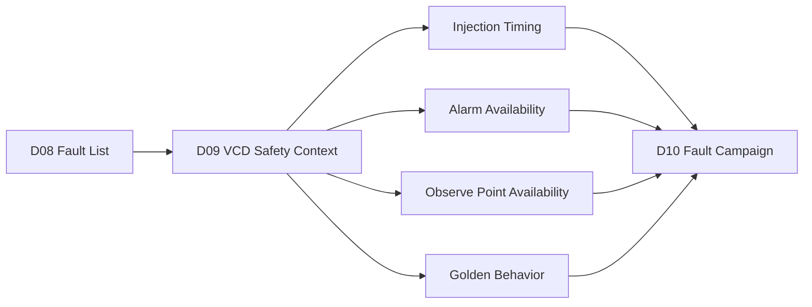

**Figure 1. VCD safety context converts a fault list into campaign-ready injection and observation data.**

A fault list may say:

```text
Inject transient_flip on toy_counter.count[0].
Expected alarm is toy_counter.alarm.
Observe toy_counter.count and toy_counter.alarm.
```

But the VCD context must answer:

```text
Is toy_counter.count[0] present in the waveform?
Is toy_counter.alarm present in the waveform?
When is reset released?
When is toy_counter.count active?
Does toy_counter.alarm ever toggle in the golden run?
What is the legal injection window?
What golden values should be used for comparison?
```

Without these answers, fault campaign classification becomes unreliable.

---

## 3. VCD Is More Than a Waveform

A Value Change Dump file records signal value changes over time.

In normal debug, engineers use it to inspect waveforms.

In fault injection, it becomes a structured reference.

It defines:

```text
golden behavior
baseline signal values
active operation windows
clock cycles
reset release
expected alarm state
observable signal set
missing signal set
candidate injection timing
```

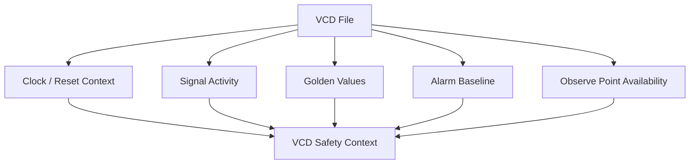

**Figure 2. A VCD file becomes safety context when clock, reset, activity, golden values, alarms, and observe points are extracted.**

The VCD context is the baseline used later to decide whether a faulted run is:

```text
detected
safe
unsafe
unresolved
```

---

## 4. Golden Simulation Context

Fault injection is usually compared against a golden simulation.

The golden simulation is the non-fault reference run.

It answers:

```text
What should the design do without injected faults?
```

For each observe point, the golden context can provide:

```text
initial value
value changes
cycle-by-cycle values
final value
active-cycle values
stable windows
unexpected X/Z behavior
```

Example:

```json
{
  "signal": "toy_counter.count",
  "present": true,
  "toggles": 17,
  "first_value": "0",
  "last_value": "17",
  "has_unknown": false,
  "active_window_values": {
    "30": "1",
    "40": "2",
    "50": "3"
  }
}
```

Golden context is essential because classification requires comparison:

```text
golden behavior vs faulted behavior
```

A faulted run cannot be classified safely if the golden behavior is unknown or incomplete.

---

## 5. Clock Context

A digital fault campaign usually needs cycle information.

The VCD context should identify:

```text
clock signal
clock period
clock edges
cycle count
first active edge
last active edge
cycle-to-time mapping
```

Example:

```yaml
clock:
  name: clk
  period: 10ns
  edge: rising
  first_edge: 5
  last_edge: 245
  cycle_count: 25
```

Why does this matter?

Because many faults are cycle-based:

```text
flip this register for one cycle
inject after reset release
inject during transaction
check alarm within N cycles
observe response after M cycles
```

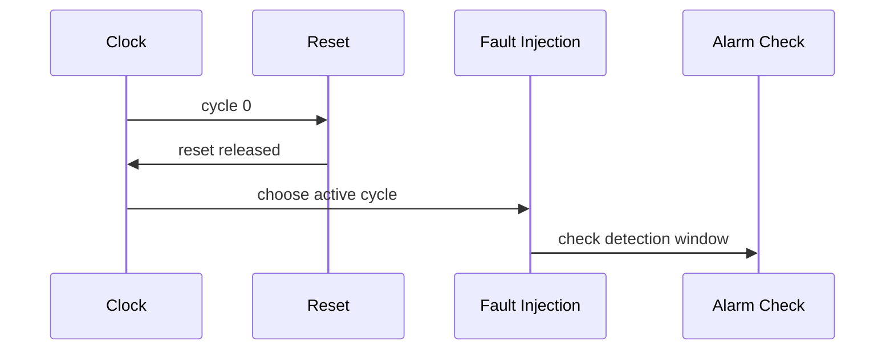

**Figure 3. Clock context connects simulation time to cycle-based fault injection and alarm checking.**

Without a clock context, injection timing is just a timestamp, not an operational event.

---

## 6. Reset Context

Reset behavior is one of the most important parts of VCD context.

The tool should identify:

```text
reset signal
reset polarity
reset assertion window
reset release time
first stable cycle after reset
whether reset is reasserted
whether observe points are valid after reset
```

Example:

```yaml
reset:
  name: rst_n
  active: low
  asserted_intervals:
    - [0, 20]
  release_time: 20
  first_active_time: 30
```

Fault injection during reset can be misleading.

A transient fault injected before reset release may be cleared and classified as safe even though it did not test the intended behavior.

Therefore, D09 should create default injection windows after reset release.


**Figure 4. Fault injection should usually occur after reset release and stabilization.**

A good report should warn if the selected injection window overlaps reset.

---

## 7. Active Windows

Not all simulation time is equally useful.

An active window is a time interval where the design is performing meaningful work.

Examples:

```text
counter enabled
bus transaction active
memory read active
FSM in operational state
watchdog counting
safety monitor enabled
diagnostic check active
```

A simple active window can be manually configured:

```yaml
active_windows:
  - name: counter_enabled
    start: 30
    end: 200
    condition: toy_counter.en == 1
```

The VCD context extractor can also infer activity from signal toggles.

Example output:

```csv
window_name,start,end,reason
post_reset_active,30,200,after reset release
counter_enabled,30,200,en high and count toggles
alarm_observation,30,220,include detection latency margin
```

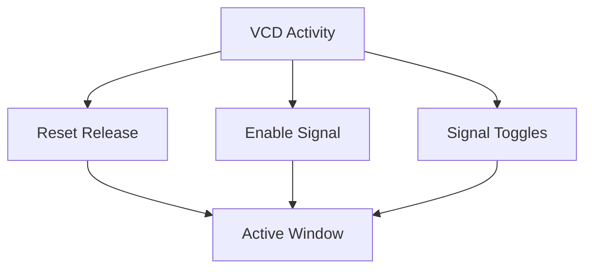

**Figure 5. Active windows can be derived from reset release, enables, and signal activity.**

Fault injection should usually be sampled inside active windows.

---

## 8. Signal Presence Check

A fault campaign depends on specific signals.

From the fault list, D09 can derive:

```text
fault nodes
expected alarms
observe points
clock signal
reset signal
safety mechanism signals
diagnostic status signals
```

`safeic-vcdctx` should check whether these signals exist in the VCD.

Example output:

```csv
signal,role,present,status,comment
clk,clock,true,PASS,
rst_n,reset,true,PASS,
toy_counter.count,observe_point,true,PASS,
toy_counter.alarm,alarm,true,PASS,
toy_counter.hidden_state,observe_point,false,WARN,missing from VCD
```

A missing signal does not always block the campaign, but it affects classification.

For example:

```text
missing expected alarm
  -> detected classification may become impossible

missing observe point
  -> safe vs unsafe classification may become unresolved

missing fault node
  -> injection may be impossible or require name mapping
```

The tool should not silently ignore missing signals.

---

## 9. Signal Naming and Hierarchy Problems

VCD signal names may not match the names used in the fault list.

Reasons include:

```text
RTL hierarchy changes
testbench wrapping
escaped identifiers
bus naming differences
flattened hierarchy
synthesis renaming
generate block naming
simulator naming conventions
```

Examples:

```text
fault list:
  toy_counter.count[0]

VCD:
  tb.dut.count[0]
```

or:

```text
fault list:
  top.u_ctrl.state_reg[2]

VCD:
  testbench.dut.u_ctrl.state_reg[2]
```

A VCD context tool should support name mapping:

```yaml
name_mapping:
  - fault_prefix: toy_counter
    vcd_prefix: tb.dut

  - fault_name: toy_counter.count
    vcd_name: tb.dut.count
```

Output:

```csv
fault_name,vcd_name,status
toy_counter.count,tb.dut.count,MAPPED
toy_counter.alarm,tb.dut.alarm,MAPPED
toy_counter.hidden_state,,MISSING
```

Name mapping is not a cosmetic issue. It determines whether fault injection and observation can be connected to the golden context.

---

## 10. Signal Activity Analysis

Signal presence is not enough.

A signal may exist in the VCD but never toggle.

Activity analysis should compute:

```text
toggle count
first toggle time
last toggle time
active ratio
unknown value count
stable intervals
value distribution
```

Example:

```csv
signal,toggles,first_toggle,last_toggle,has_x,activity_status
toy_counter.count,17,30,190,false,ACTIVE
toy_counter.alarm,0,,false,STABLE_ZERO
toy_counter.en,1,30,30,false,ENABLE_STATIC_HIGH
```

Signal activity helps interpret results.

For example:

```text
An alarm that is stable zero in the golden run is normal.
A counter that never toggles may indicate missing stimulus.
An observe point with X values may make classification unreliable.
A bus valid signal that is never high means bus faults cannot be meaningfully validated.
```

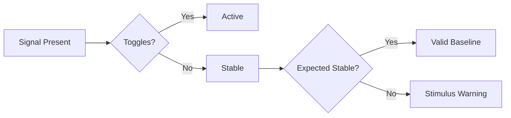

**Figure 6. Signal activity analysis distinguishes useful baseline behavior from missing stimulus.**

---

## 11. Alarm Baseline

An alarm signal is special.

In many golden runs, alarms should remain inactive.

For each alarm, D09 should record:

```text
present or missing
golden active value
inactive value
toggle count
unexpected golden assertion
time intervals where alarm is active
whether alarm is X/Z
```

Example:

```csv
alarm,present,inactive_value,golden_asserted,toggles,status
toy_counter.alarm,true,0,false,0,PASS
top.u_mem.ecc_error,true,0,false,0,PASS
top.u_alarm.global_alert,true,0,true,2,WARN
```

An alarm active in the golden run requires review.

It may mean:

```text
the testbench intentionally triggers a diagnostic event
the design has an issue
the alarm polarity is misconfigured
the checker is not reset properly
the VCD context is not suitable for this campaign
```

Fault campaign classification needs a clean alarm baseline.

If the golden alarm is already asserted, a faulted alarm assertion may not prove detection.

---

## 12. Observe Point Context

Observe points are used to decide whether the fault changed relevant behavior.

They may include:

```text
outputs
state variables
bus signals
memory data
control signals
safe-state indicators
alarm signals
diagnostic status registers
```

For each observe point, D09 should record:

```text
presence
activity
golden values
unknown values
valid windows
comparison policy
```

Example:

```yaml
observe_points:
  - name: toy_counter.count
    present: true
    compare_mode: cycle_value
    valid_window: [30, 200]
    has_unknown: false

  - name: toy_counter.alarm
    present: true
    compare_mode: alarm_event
    valid_window: [30, 220]
    has_unknown: false
```

Observe point context later supports classification:

```text
No deviation at observe points
  -> safe or no-effect

Deviation with alarm
  -> detected

Deviation without alarm
  -> unsafe or unresolved

Missing observe point
  -> unresolved
```

---

## 13. Injection Window Generation

D09 should generate candidate injection windows for each fault.

Input from fault list:

```text
fault type
target node
related endpoint
expected alarm
priority
```

Input from VCD context:

```text
reset release
active windows
signal activity
valid observe windows
clock cycles
```

Output:

```text
fault_id
recommended injection time
recommended injection window
reason
```

Example:

```csv
fault_id,node,fault_type,injection_window,recommended_time,reason
F001,toy_counter.count[0],transient_flip,30:200,60,active counter window
F004,toy_counter.alarm,stuck_at_0,30:220,30,persistent after reset
```

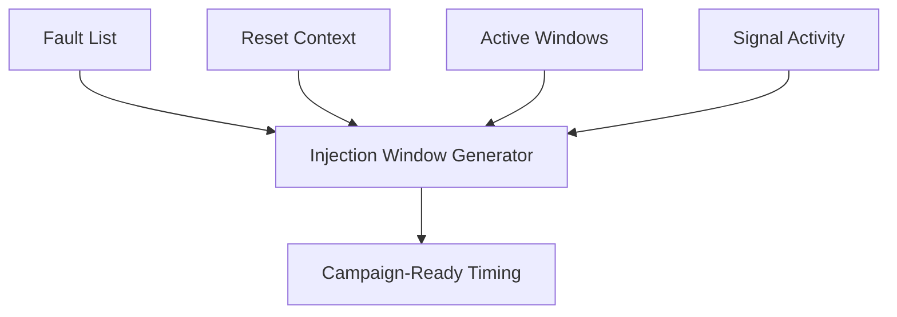

**Figure 7. Injection windows should be derived from fault list intent and golden activity context.**

For transient faults, time selection matters a lot.

---

## 14. Detection Window

Fault detection may not be immediate.

A parity alarm might assert in the same cycle.  
A watchdog timeout may require many cycles.  
A software-visible diagnostic register may update later.  
A system response may need a reaction window.

Therefore, the VCD context should define detection windows.

Example:

```yaml
detection_policy:
  default_detection_cycles: 3
  mechanisms:
    endpoint_parity:
      detection_cycles: 1
    watchdog:
      detection_cycles: 20
    memory_ecc:
      detection_cycles: 2
```

Output:

```csv
fault_id,inject_time,check_start,check_end,expected_alarm
F001,60,60,70,toy_counter.alarm
F010,80,80,100,top.u_wdog.timeout_alarm
```

Detection window is important for classification.

If the alarm asserts after the allowed detection window, the result may not count as detected for the intended safety requirement.

---

## 15. Golden X and Z Handling

Unknown values can make classification difficult.

The VCD context should report X/Z conditions:

```text
which signals contain X/Z
when X/Z occurs
whether X/Z is inside active window
whether X/Z affects observe points
whether X/Z affects alarms
```

Example:

```csv
signal,has_unknown,unknown_intervals,status
toy_counter.count,false,,PASS
toy_counter.alarm,false,,PASS
top.u_bus.rdata,true,0:25,WARN_RESET_ONLY
top.u_ctrl.state,true,80:90,WARN_ACTIVE_WINDOW
```

Unknown values during reset may be acceptable.

Unknown values during active operation may make fault classification unreliable.

D09 should not hide X/Z problems.

---

## 16. Transaction Context

For bus or interface fault injection, simple active windows may not be enough.

The tool may need transaction context:

```text
valid high
ready high
read/write active
address stable
data sampled
response valid
transaction ID active
```

Example transaction window:

```csv
transaction_id,start,end,kind,signals
T001,50,70,write,bus.valid;bus.ready;bus.wdata
T002,90,110,read,bus.valid;bus.ready;bus.rdata
```

A fault on bus data should ideally be injected when the transaction is meaningful.

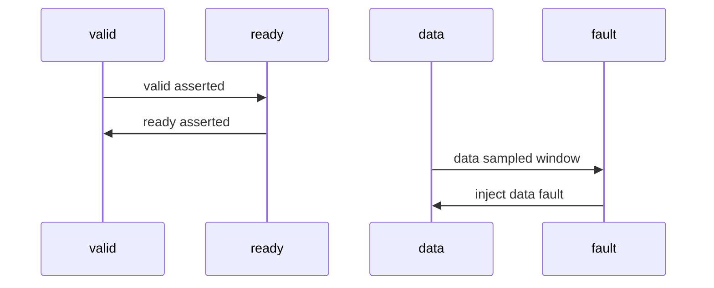

**Figure 8. Interface fault injection should align with transaction windows.**

For D09, transaction extraction can be simple or optional, but the architecture should support it.

---

## 17. Memory Access Context

For memory-related faults, VCD context may include memory access windows.

Important signals:

```text
read enable
write enable
address
write data
read data
ECC error
parity error
scrub enable
```

Example:

```csv
memory,access_type,start,end,address,comment
u_sram,write,40,50,0x10,initial data write
u_sram,read,90,100,0x10,read after possible corruption
```

A memory bit flip is meaningful if:

```text
the corrupted location is later read
the data affects an observe point
ECC/parity is checked
an alarm can be observed
```

If the memory location is never read, the fault may classify as safe or no-effect, but that may not prove coverage.

D09 should report memory access context when available.

---

## 18. Context for Fault Classification

D09 does not classify fault outcomes yet, but it prepares the data needed for classification.

Outcome classification needs:

```text
golden observe values
faulted observe values
golden alarm baseline
faulted alarm behavior
expected detection window
valid comparison window
missing signal status
X/Z status
```

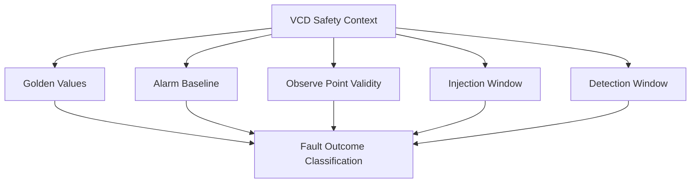

**Figure 9. Fault outcome classification depends on the context extracted before campaign execution.**

If D09 is weak, D10 and later classification will be weak.

---

## 19. Output Artifacts

D09 should generate both machine-readable and human-readable outputs.

Suggested outputs:

```text
outputs/vcd_context.json
outputs/signal_presence.csv
outputs/signal_activity.csv
outputs/alarm_baseline.csv
outputs/observe_context.csv
outputs/injection_windows.csv
outputs/detection_windows.csv
outputs/missing_signals.csv
outputs/xz_report.csv
outputs/vcd_context_summary.md
```

Each output serves a purpose:

| Artifact | Purpose |
|---|---|
| `vcd_context.json` | Main machine-readable context |
| `signal_presence.csv` | Signal availability check |
| `signal_activity.csv` | Toggle and activity summary |
| `alarm_baseline.csv` | Golden alarm behavior |
| `observe_context.csv` | Observe point validity |
| `injection_windows.csv` | Campaign-ready timing |
| `detection_windows.csv` | Alarm checking windows |
| `missing_signals.csv` | Missing or unmapped signals |
| `xz_report.csv` | Unknown-value warnings |
| `vcd_context_summary.md` | Human-readable review report |

---

## 20. Example `vcd_context.json`

```json
{
  "project": "automotive_safeic_practice",
  "demo": "D09_vcd_safety_context",
  "top": "toy_counter",
  "vcd": "inputs/sim.vcd",
  "timescale": "1ns",
  "clock": {
    "name": "clk",
    "period": 10,
    "edge": "rising",
    "first_edge": 5,
    "last_edge": 245
  },
  "reset": {
    "name": "rst_n",
    "active": "low",
    "release_time": 20,
    "first_active_time": 30
  },
  "active_windows": [
    {
      "name": "post_reset_active",
      "start": 30,
      "end": 200
    }
  ],
  "alarms": [
    {
      "name": "toy_counter.alarm",
      "present": true,
      "golden_asserted": false,
      "toggles": 0
    }
  ],
  "observe_points": [
    {
      "name": "toy_counter.count",
      "present": true,
      "toggles": 17,
      "has_unknown": false
    }
  ]
}
```

This file becomes a shared context for campaign execution and classification.

---

## 21. Example `signal_presence.csv`

```csv
signal,role,fault_list_name,vcd_name,present,status,comment
clk,clock,clk,clk,true,PASS,
rst_n,reset,rst_n,rst_n,true,PASS,
toy_counter.count,observe_point,toy_counter.count,tb.dut.count,true,PASS,mapped by prefix rule
toy_counter.alarm,alarm,toy_counter.alarm,tb.dut.alarm,true,PASS,mapped by prefix rule
toy_counter.hidden_state,observe_point,toy_counter.hidden_state,,false,WARN,missing from VCD
```

This report immediately tells whether campaign observability is complete.

---

## 22. Example `injection_windows.csv`

```csv
fault_id,node,fault_type,default_window,recommended_time,detection_window,reason
F001,toy_counter.count[0],transient_flip,30:200,60,60:70,active after reset and counter toggling
F002,toy_counter.count[1],transient_flip,30:200,70,70:80,active after reset and counter toggling
F004,toy_counter.alarm,stuck_at_0,30:220,30,30:220,persistent alarm path fault after reset
F005,toy_counter.alarm,stuck_at_1,30:220,30,30:220,persistent false alarm test
```

This turns the D08 fault list into a campaign-ready list.

---

## 23. The `safeic-vcdctx` Tool Architecture

The generic tool `safeic-vcdctx` can be implemented as a staged pipeline.

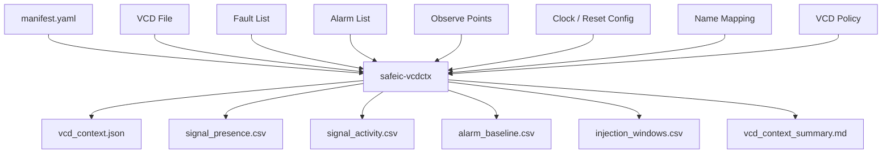

**Figure 10. `safeic-vcdctx` converts waveform data and campaign intent into structured safety context.**

Suggested internal modules:

```text
safeic_vcdctx/
  cli.py
  manifest.py
  vcd_reader.py
  name_mapping.py
  clock_reset.py
  signal_presence.py
  signal_activity.py
  alarm_context.py
  observe_context.py
  active_window.py
  injection_window.py
  xz_report.py
  report.py
```

Responsibilities:

| Module | Responsibility |
|---|---|
| `vcd_reader.py` | Parse VCD header and value changes |
| `name_mapping.py` | Map fault-list names to VCD names |
| `clock_reset.py` | Extract clock/reset behavior |
| `signal_presence.py` | Check required signal availability |
| `signal_activity.py` | Compute toggles and activity windows |
| `alarm_context.py` | Build alarm baseline |
| `observe_context.py` | Build observe point context |
| `active_window.py` | Infer or load active windows |
| `injection_window.py` | Assign injection and detection windows |
| `xz_report.py` | Detect X/Z conditions |
| `report.py` | Generate CSV, JSON, and Markdown outputs |

---

## 24. D09 Directory Structure

Suggested directory:

```text
D09_vcd_safety_context/
  README.md
  run_demo.sh
  run_demo.csh
  manifest.yaml

  inputs/
    sim.vcd
    fault_list.csv
    alarm.list
    observe_points.list
    clkdef.clk
    reset.yaml
    name_mapping.yaml
    vcd_policy.yaml

  outputs/
    vcd_context.json
    signal_presence.csv
    signal_activity.csv
    alarm_baseline.csv
    observe_context.csv
    injection_windows.csv
    detection_windows.csv
    missing_signals.csv
    xz_report.csv
    vcd_context_summary.md
```

This demo focuses on waveform context extraction, not fault execution.

---

## 25. D09 Manifest

Example:

```yaml
project:
  name: automotive_safeic_practice
  demo: D09_vcd_safety_context
  top_module: toy_counter

inputs:
  vcd: inputs/sim.vcd
  fault_list: inputs/fault_list.csv
  alarm_list: inputs/alarm.list
  observe_points: inputs/observe_points.list
  clock_def: inputs/clkdef.clk
  reset_config: inputs/reset.yaml
  name_mapping: inputs/name_mapping.yaml
  vcd_policy: inputs/vcd_policy.yaml

outputs:
  context_json: outputs/vcd_context.json
  signal_presence: outputs/signal_presence.csv
  signal_activity: outputs/signal_activity.csv
  alarm_baseline: outputs/alarm_baseline.csv
  observe_context: outputs/observe_context.csv
  injection_windows: outputs/injection_windows.csv
  summary: outputs/vcd_context_summary.md
```

The manifest makes the context extraction reproducible.

---

## 26. D09 Execution Flow

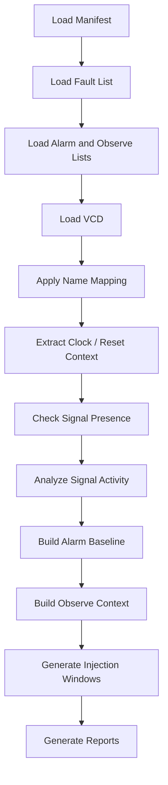

**Figure 11. D09 execution flow: load campaign intent, extract waveform context, and generate campaign-ready timing and observability data.**

Example bash script:

```bash
#!/usr/bin/env bash
set -euo pipefail

safeic-vcdctx \
  --manifest manifest.yaml \
  --output-dir outputs
```

Example csh script:

```csh
#!/bin/csh -f

set DEMO = D09_vcd_safety_context
echo "Running $DEMO"

safeic-vcdctx \
  --manifest manifest.yaml \
  --output-dir outputs
```

Expected outputs:

```text
outputs/vcd_context.json
outputs/signal_presence.csv
outputs/signal_activity.csv
outputs/alarm_baseline.csv
outputs/observe_context.csv
outputs/injection_windows.csv
outputs/detection_windows.csv
outputs/missing_signals.csv
outputs/xz_report.csv
outputs/vcd_context_summary.md
```

---

## 27. Example `vcd_policy.yaml`

```yaml
vcd_policy:
  require_clock: true
  require_reset: true
  require_expected_alarms: true
  require_observe_points: true

  active_window:
    mode: after_reset
    stabilization_cycles: 1
    end_margin_cycles: 2

  signal_presence:
    missing_alarm_is_error: true
    missing_observe_point_is_warning: true
    missing_fault_node_is_warning: true

  xz_handling:
    allow_xz_during_reset: true
    warn_xz_in_active_window: true
    error_xz_on_alarm: true

  injection:
    default_transient_duration_cycles: 1
    default_detection_cycles: 3
    avoid_reset_window: true
```

This policy makes waveform interpretation explicit.

---

## 28. Example `vcd_context_summary.md`

```md
# D09 VCD Safety Context Summary

Project: automotive_safeic_practice
Demo: D09_vcd_safety_context
Top: toy_counter

## VCD

File: inputs/sim.vcd  
Timescale: 1ns  

## Clock / Reset

Clock: clk  
Period: 10ns  
Reset: rst_n active low  
Reset release time: 20ns  
First active time: 30ns  

## Active Windows

- post_reset_active: 30ns to 200ns

## Signal Presence

Required signals: 5  
Present: 4  
Missing: 1  

Missing:
- toy_counter.hidden_state

## Alarm Baseline

- toy_counter.alarm: present, inactive in golden run

## Injection Windows

Generated windows for 5 faults.

## Warnings

- toy_counter.hidden_state is missing from VCD.
- Some observe points may be unresolved if not dumped.
```

This summary should be short enough for engineers to review before running the campaign.

---

## 29. Validation Rules

`safeic-vcdctx` should validate:

```text
VCD file exists
fault list exists
alarm list exists
observe point list exists
clock definition exists
reset definition exists
clock is present in VCD
reset is present in VCD
expected alarms are present or reported
observe points are present or reported
VCD covers injection windows
reset release can be determined
active window is non-empty
X/Z behavior is reported
name mapping is applied
missing signals are not silently ignored
```

Example messages:

```text
[PASS] VCD file inputs/sim.vcd loaded
[PASS] clock clk found
[PASS] reset rst_n found
[PASS] reset release time detected at 20ns
[PASS] alarm toy_counter.alarm found and inactive in golden run
[WARN] observe point toy_counter.hidden_state missing from VCD
[WARN] signal top.u_bus.rdata has X in active window
[ERROR] expected alarm top.u_alarm.fatal not found in VCD
```

The tool should fail early when required context is missing.

---

## 30. Common Mistakes

### 30.1 Treating VCD as Optional Debug Data

For fault campaign classification, VCD context is evidence infrastructure.

It should be treated as an input artifact, not a debug side product.

### 30.2 Ignoring Reset

Faults injected during reset may be overwritten.

Always identify reset release and active windows.

### 30.3 Missing Alarm Signals

If alarms are not dumped, detected classification may become impossible.

### 30.4 Missing Observe Points

If observe points are not dumped, safe vs unsafe classification may become unresolved.

### 30.5 Assuming Signal Names Match

Fault list names and VCD names may differ.

Name mapping should be explicit.

### 30.6 Ignoring X/Z Values

Unknown values inside active windows can invalidate classification.

### 30.7 Ignoring Transaction Timing

Bus and memory faults should align with meaningful transactions or access windows.

---

## 31. How D09 Connects to Later Demos

D09 prepares context for campaign execution and classification.

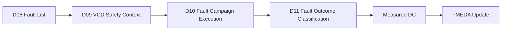

**Figure 12. D09 connects the generated fault list to executable and classifiable fault campaign evidence.**

D10 will execute or emulate injection.

D11 will classify results using the context created here.

If D09 is incomplete, later measured coverage will be weak.

---

## 32. Recommended Implementation Stages

D09 can be implemented in stages.

### Stage 1: Signal Presence and Basic Timing

Parse VCD header, check signals, identify clock/reset.

Deliverables:

```text
signal_presence.csv
vcd_context_summary.md
```

### Stage 2: Activity Analysis

Compute toggles and active windows.

Deliverables:

```text
signal_activity.csv
active_windows.csv
```

### Stage 3: Alarm and Observe Context

Build alarm baseline and observe point context.

Deliverables:

```text
alarm_baseline.csv
observe_context.csv
```

### Stage 4: Injection and Detection Windows

Generate campaign-ready timing.

Deliverables:

```text
injection_windows.csv
detection_windows.csv
```

### Stage 5: X/Z and Name Mapping Robustness

Add unknown-value reporting and robust name mapping.

Deliverables:

```text
xz_report.csv
missing_signals.csv
name_mapping_report.csv
```

This staged path makes D09 practical and directly useful for D10.

---

## 33. Summary

VCD safety context is the bridge between a generated fault list and a meaningful fault campaign.

The D09 demo:

```text
D09_vcd_safety_context
```

introduces the generic tool:

```text
safeic-vcdctx
```

The tool consumes:

```text
sim.vcd
fault_list.csv
alarm.list
observe_points.list
clock/reset configuration
name mapping
VCD policy
```

and generates:

```text
vcd_context.json
signal_presence.csv
signal_activity.csv
alarm_baseline.csv
observe_context.csv
injection_windows.csv
detection_windows.csv
missing_signals.csv
xz_report.csv
vcd_context_summary.md
```

The central lesson is:

> A waveform becomes safety evidence only after it is converted into clock/reset context, activity context, alarm baseline, observe-point availability, injection windows, and classification-ready golden behavior.

Without this context, fault injection results may look precise but remain difficult to trust.

---

## 34. D09 Demo Checklist

For `D09_vcd_safety_context`, the expected deliverables are:

```text
[ ] README.md
[ ] run_demo.sh
[ ] run_demo.csh
[ ] manifest.yaml

[ ] inputs/sim.vcd
[ ] inputs/fault_list.csv
[ ] inputs/alarm.list
[ ] inputs/observe_points.list
[ ] inputs/clkdef.clk
[ ] inputs/reset.yaml
[ ] inputs/name_mapping.yaml
[ ] inputs/vcd_policy.yaml

[ ] outputs/vcd_context.json
[ ] outputs/signal_presence.csv
[ ] outputs/signal_activity.csv
[ ] outputs/alarm_baseline.csv
[ ] outputs/observe_context.csv
[ ] outputs/injection_windows.csv
[ ] outputs/detection_windows.csv
[ ] outputs/missing_signals.csv
[ ] outputs/xz_report.csv
[ ] outputs/vcd_context_summary.md
```

A successful D09 run should answer:

```text
Is the VCD usable for this fault campaign?
Are clock and reset available?
When is reset released?
What is the active injection window?
Are all expected alarms present?
Are all observe points present?
Which signals are missing?
Which signals contain X/Z values?
Which faults have recommended injection windows?
Which detection windows should be used?
Can D10 execute the fault campaign using this context?
```
