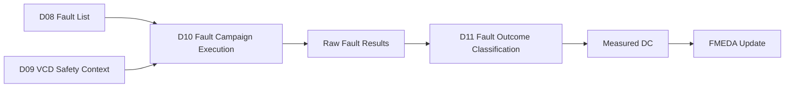
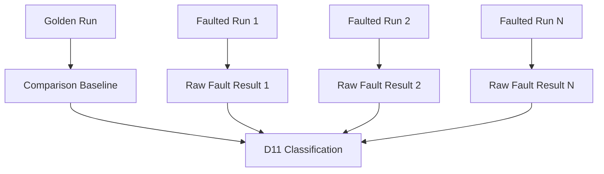
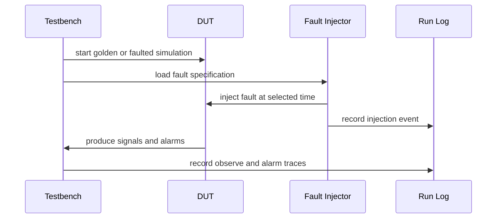
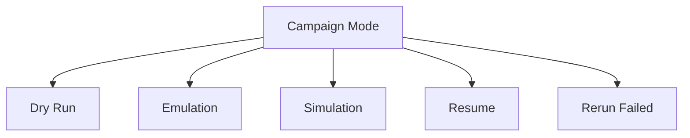
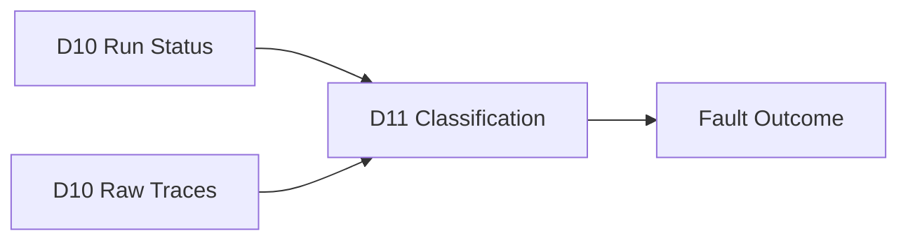
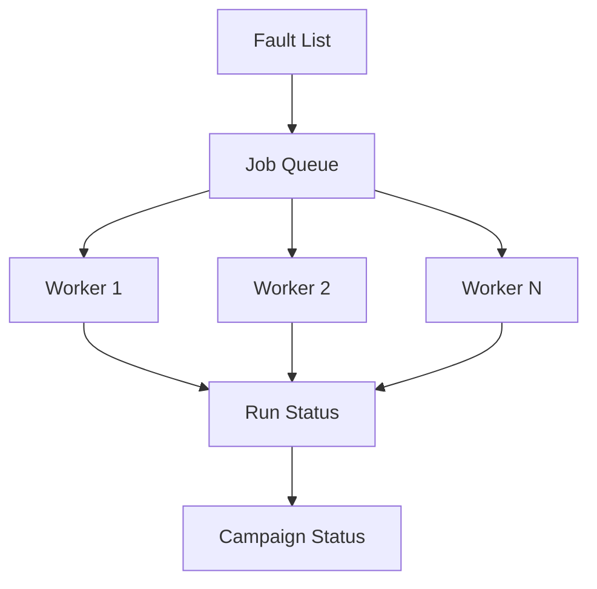
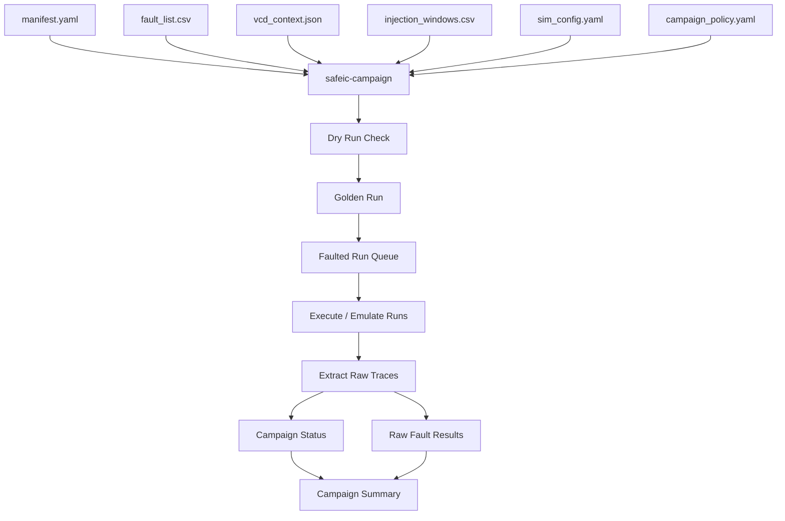
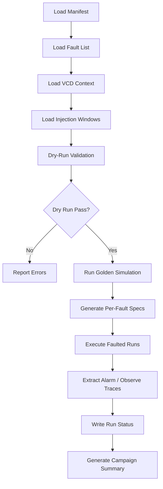
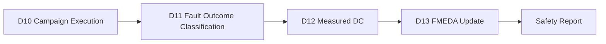

# [Automotive Safe-IC Practice 10] Fault Campaign Execution: From Fault List and VCD Context to Reproducible Injection Runs

**Author**: Darren H. Chen  
**Direction**: Automotive Chip Functional Safety Analysis and Fault Injection Practice  
**Demo**: D10_fault_campaign_execution  
**Tags**: Automotive Chip, Functional Safety, Fault Campaign, Fault Injection, Simulation, VCD Context, Golden Run, Faulted Run, Alarm, Observe Point, Diagnostic Coverage

---

## 1. Why This Article Matters

In the previous articles, we prepared the major inputs for functional safety fault injection:

```text
D08:
  traceable fault list

D09:
  VCD safety context
```

Now we need to execute the campaign.

The key question becomes:

> How do we turn a fault list and waveform context into repeatable golden and faulted simulation runs?

The tenth demo in this repository is:

```text
D10_fault_campaign_execution
```

The generic tool introduced in this article is:

```text
safeic-campaign
```

The purpose of `safeic-campaign` is to run or emulate a fault campaign from:

```text
fault_list.csv
vcd_context.json
injection_windows.csv
detection_windows.csv
RTL/testbench simulation command
fault injection policy
campaign execution policy
```

and generate:

```text
golden run result
faulted run results
raw fault logs
alarm traces
observe point traces
run manifest
campaign status report
```

The central idea is:

> Fault campaign execution is not merely running simulations many times. It is a controlled experiment that compares a golden run against many faulted runs under a reproducible injection, observation, and logging policy.

---

## 2. Where D10 Fits in the Flow

D10 is the execution point of the early safety validation loop.



**Figure 1. D10 executes the campaign and produces raw results for later classification.**

D10 does not yet finalize safety metrics.

Its job is to produce high-quality raw evidence:

```text
which fault was injected
when it was injected
whether the run completed
what alarm behavior was observed
what observe point behavior was captured
whether the run failed
where logs are stored
```

D11 will classify the outcomes.

D10 must therefore focus on execution reproducibility and data integrity.

---

## 3. Golden Run and Faulted Runs

A fault campaign usually has one golden run and many faulted runs.

### 3.1 Golden Run

The golden run is the reference simulation without injected faults.

It provides:

```text
expected behavior
golden waveform
golden alarm baseline
golden observe point values
reference exit status
reference log
```

### 3.2 Faulted Runs

Each faulted run injects one or more faults.

For early demos, use one fault per run.

A faulted run provides:

```text
faulted waveform
fault injection log
faulted alarm trace
faulted observe point trace
simulation exit status
runtime information
raw comparison hints
```



**Figure 2. Golden and faulted runs are separated so raw results can later be classified consistently.**

The campaign executor should never overwrite golden artifacts.

---

## 4. What Does “Execute a Fault” Mean?

In simulation, fault execution can be implemented in different ways.

Common approaches include:

```text
force/release signal in simulator
modify RTL or testbench wrapper
insert fault injection hooks
use simulator callback interface
use DPI/VPI/PLI-based injection
use gate-level fault simulator
use emulation or acceleration environment
use fault effect emulation from precomputed traces
```

For a simple open demo, we can use a simplified model:

```text
testbench reads fault specification
at injection time, force or perturb target signal
after duration, release or restore signal
dump waveform and trace
```

Conceptually:



**Figure 3. Fault execution injects a controlled perturbation into the DUT and records its effect.**

D10 should define the execution contract even if the first implementation only emulates injection.

---

## 5. Execution Contract

A campaign run should have a strict execution contract.

For each fault, the executor must know:

```text
fault_id
target node
fault type
injection mode
injection time
duration
expected alarm
observe points
detection window
simulation command
output directory
timeout
retry policy
```

Example fault execution spec:

```yaml
fault_run:
  fault_id: F001
  node: toy_counter.count[0]
  fault_type: transient_flip
  injection_time: 60
  duration_cycles: 1
  expected_alarm: toy_counter.alarm
  observe_points:
    - toy_counter.count
    - toy_counter.alarm
  detection_window:
    start: 60
    end: 70
```

The executor should convert this into a simulator-specific command or a testbench configuration.

---

## 6. Campaign Manifest

A campaign manifest records the full execution context.

Example:

```yaml
project:
  name: automotive_safeic_practice
  demo: D10_fault_campaign_execution
  top_module: toy_counter

campaign:
  name: d10_toy_counter_campaign
  mode: simulation
  one_fault_per_run: true
  max_parallel_jobs: 4
  timeout_seconds: 60

inputs:
  fault_list: inputs/fault_list.csv
  vcd_context: inputs/vcd_context.json
  injection_windows: inputs/injection_windows.csv
  detection_windows: inputs/detection_windows.csv
  sim_config: inputs/sim_config.yaml
  campaign_policy: inputs/campaign_policy.yaml

outputs:
  run_dir: runs
  raw_results: outputs/raw_fault_results.csv
  campaign_status: outputs/campaign_status.csv
  campaign_summary: outputs/campaign_summary.md
```

This manifest should be stored with the results so the campaign can be reproduced later.

---

## 7. Campaign Execution Modes

D10 can support multiple execution modes.

```text
dry-run
emulation
simulation
batch simulation
parallel simulation
resume
rerun-failed
```

### 7.1 Dry-Run Mode

Dry-run mode validates the campaign without executing simulation.

It checks:

```text
fault list readability
injection window availability
signal mapping
output directory creation
command generation
estimated number of runs
```

### 7.2 Emulation Mode

Emulation mode creates synthetic raw results for demo and pipeline testing.

It is useful before a real simulator integration is complete.

### 7.3 Simulation Mode

Simulation mode actually runs the testbench and injects faults.

### 7.4 Resume Mode

Resume mode continues a partially completed campaign without rerunning successful faults.



**Figure 4. Campaign execution should support staged modes so the flow can be developed safely.**

For the first D10 demo, dry-run and emulation modes are sufficient. Simulation mode can be added when the RTL/testbench injection hook is ready.

---

## 8. Why Dry-Run Mode Is Important

Dry-run mode catches many errors before expensive simulation.

It can report:

```text
missing fault node
missing observe point
missing expected alarm
invalid injection time
detection window outside VCD range
unsupported fault model
output path conflict
duplicate fault ID
```

Example output:

```csv
fault_id,status,comment
F001,PASS,command generated
F002,PASS,command generated
F004,WARN,expected alarm is empty because this is alarm-path stuck-at test
F099,ERROR,node not mapped to simulation name
```

Dry-run is a quality gate.

A fault campaign should not start large-scale execution if basic inputs are inconsistent.

---

## 9. Simulation Command Generation

A campaign executor should generate simulation commands from templates.

Example `sim_config.yaml`:

```yaml
simulator:
  name: verilator_demo
  mode: command_template

commands:
  build: "./build_sim.sh"
  golden: "./simv +MODE=golden +VCD=golden.vcd"
  faulted: "./simv +MODE=fault +FAULT_SPEC={fault_spec} +VCD={fault_vcd}"

paths:
  build_dir: build
  run_dir: runs
```

For a commercial simulator, the command may look different.

The key is to separate:

```text
campaign logic
simulator command template
fault specification file
run output directory
```

Do not hardcode simulator commands inside the campaign engine.

---

## 10. Fault Specification Files

Each faulted run should have an explicit fault specification file.

Example:

```yaml
fault:
  id: F001
  node: tb.dut.count[0]
  original_name: toy_counter.count[0]
  type: transient_flip
  inject_time: 60
  duration: 10
  duration_unit: ns

observation:
  expected_alarm: tb.dut.alarm
  observe_points:
    - tb.dut.count
    - tb.dut.alarm
  detection_window:
    start: 60
    end: 70
```

The run command should reference this file:

```bash
./simv +MODE=fault +FAULT_SPEC=runs/F001/fault_spec.yaml +VCD=runs/F001/faulted.vcd
```

This makes each run independently reproducible.

---

## 11. Run Directory Layout

A clean directory layout is essential.

Suggested layout:

```text
D10_fault_campaign_execution/
  runs/
    golden/
      command.sh
      sim.log
      golden.vcd
      status.json

    F001/
      fault_spec.yaml
      command.sh
      sim.log
      faulted.vcd
      alarm_trace.csv
      observe_trace.csv
      status.json

    F002/
      fault_spec.yaml
      command.sh
      sim.log
      faulted.vcd
      alarm_trace.csv
      observe_trace.csv
      status.json
```

Each run directory should be self-contained.

This makes debugging, rerun, and evidence review much easier.

---

## 12. Run Status

Each run should produce a `status.json`.

Example:

```json
{
  "fault_id": "F001",
  "status": "PASS",
  "mode": "simulation",
  "start_time": "2026-05-01T10:00:00",
  "end_time": "2026-05-01T10:00:03",
  "runtime_seconds": 3.1,
  "exit_code": 0,
  "artifacts": {
    "log": "runs/F001/sim.log",
    "vcd": "runs/F001/faulted.vcd",
    "alarm_trace": "runs/F001/alarm_trace.csv",
    "observe_trace": "runs/F001/observe_trace.csv"
  }
}
```

Possible run statuses:

```text
PASS
FAIL
TIMEOUT
SKIPPED
INVALID_INPUT
UNSUPPORTED_FAULT
SIM_ERROR
NEEDS_RETRY
```

Do not mix run status with fault outcome.

A run can pass execution but later classify as unsafe.

---

## 13. Run Status Is Not Fault Outcome

This distinction is critical.

Run status answers:

```text
Did the simulation run complete correctly?
```

Fault outcome answers:

```text
Was the fault detected, safe, unsafe, or unresolved?
```

Example:

| Run Status | Fault Outcome | Meaning |
|---|---|---|
| PASS | detected | Simulation completed; alarm detected fault |
| PASS | unsafe | Simulation completed; fault caused deviation without alarm |
| PASS | safe | Simulation completed; no relevant deviation |
| PASS | unresolved | Simulation completed; insufficient evidence |
| SIM_ERROR | not classified | Simulation failed; cannot classify |
| TIMEOUT | not classified | Run did not complete |

D10 only produces run status and raw traces.

D11 classifies fault outcomes.



**Figure 5. Run execution status and fault outcome classification must remain separate.**

---

## 14. Alarm Trace Extraction

For each faulted run, the executor should extract alarm traces.

Example:

```csv
time,alarm,value
60,toy_counter.alarm,0
65,toy_counter.alarm,1
70,toy_counter.alarm,1
```

Or summarized:

```csv
fault_id,alarm,present,asserted,first_assert_time,within_detection_window
F001,toy_counter.alarm,true,true,65,true
F004,toy_counter.alarm,true,false,,false
```

Alarm traces are later used by D11.

The executor should not decide final classification unless the campaign is intentionally running in quick-evaluate mode.

---

## 15. Observe Trace Extraction

Observe traces record selected observe point behavior.

Example:

```csv
time,signal,value
60,toy_counter.count,6
70,toy_counter.count,7
80,toy_counter.count,8
```

A summarized version:

```csv
fault_id,observe_point,changed_from_golden,first_deviation_time,last_deviation_time
F001,toy_counter.count,true,60,70
F001,toy_counter.alarm,true,65,70
```

Observe trace extraction can be implemented as:

```text
waveform post-processing
simulation-time logging
testbench monitor logging
lightweight event trace logging
```

For a demo, simple CSV logs are enough.

---

## 16. Golden Trace Storage

D10 should preserve golden traces in a structured form.

Example:

```text
runs/golden/
  golden.vcd
  golden_alarm_trace.csv
  golden_observe_trace.csv
  status.json
```

The golden trace should be tied to the exact simulation command and input files.

Why?

Because faulted results are only meaningful relative to the same golden baseline.

If the testbench or RTL changes, old faulted results may no longer be comparable.

---

## 17. Fault Injection Implementation Strategies

There are several ways to implement fault injection.

### 17.1 Testbench-Based Injection

The testbench reads fault specs and uses simulator force/release or procedural assignments.

Advantages:

```text
simple
transparent
easy to demo
works at RTL
```

Limitations:

```text
depends on simulator features
name mapping can be tricky
may not scale to optimized netlists
```

### 17.2 RTL Instrumentation

The RTL is modified or wrapped with fault injection muxes.

Advantages:

```text
portable
works with simple simulators
explicit
```

Limitations:

```text
intrusive
may change design behavior
requires generated wrappers
```

### 17.3 VPI/DPI/PLI-Based Injection

A simulator interface is used to access and force signals.

Advantages:

```text
powerful
less RTL modification
can support large campaigns
```

Limitations:

```text
simulator-specific
more complex implementation
```

### 17.4 Fault Effect Emulation

Instead of truly injecting into simulation, emulate fault effects using recorded traces.

Advantages:

```text
fast
useful for early pipeline testing
```

Limitations:

```text
not real validation evidence
limited accuracy
```

D10 can start with emulation or testbench-based injection, then evolve.

---

## 18. One Fault per Run vs Multiple Faults per Run

For early safety campaigns, use one fault per run.

Benefits:

```text
simple classification
clear traceability
easy rerun
easy debugging
clean mapping to fault ID
```

Multiple faults per run may be useful for stress testing or common-cause scenarios, but they complicate classification.

D10 should default to:

```yaml
one_fault_per_run: true
```

Later demos can add:

```text
multi-fault scenarios
common-cause fault campaigns
dependent fault sequences
diagnostic self-test sequences
```

---

## 19. Parallel Campaign Execution

Fault campaigns can be parallelized because many faulted runs are independent.

A simple scheduler can support:

```text
max_parallel_jobs
job queue
run status tracking
timeout
retry failed jobs
resume campaign
```



**Figure 6. Faulted runs are naturally parallelizable when each fault has an independent run directory.**

For the first demo, parallel execution can be optional.

But the directory and status model should be designed for it from the beginning.

---

## 20. Timeout and Retry Policy

Some simulations may hang or fail.

Campaign policy should define:

```text
timeout seconds
max retries
retry only simulation errors
do not retry invalid input
mark unsupported faults
preserve failed logs
```

Example:

```yaml
retry_policy:
  timeout_seconds: 60
  max_retries: 1
  retry_status:
    - SIM_ERROR
    - TIMEOUT
  no_retry_status:
    - INVALID_INPUT
    - UNSUPPORTED_FAULT
```

The executor should never delete failed evidence automatically.

Failed runs can reveal real tool, model, or testbench problems.

---

## 21. Campaign Status Table

The campaign should generate a status table.

Example:

```csv
fault_id,status,exit_code,runtime_seconds,log,vcd,comment
GOLDEN,PASS,0,2.1,runs/golden/sim.log,runs/golden/golden.vcd,
F001,PASS,0,3.0,runs/F001/sim.log,runs/F001/faulted.vcd,
F002,PASS,0,3.1,runs/F002/sim.log,runs/F002/faulted.vcd,
F004,PASS,0,2.9,runs/F004/sim.log,runs/F004/faulted.vcd,
F099,INVALID_INPUT,,0.0,,,target node not mapped
```

This table is the main handoff from D10 to D11.

---

## 22. Raw Fault Results

Raw fault results are not final outcomes.

They should contain execution facts and trace summaries.

Example:

```csv
fault_id,node,fault_type,run_status,alarm_asserted,alarm_time,observe_deviation,first_deviation_time
F001,toy_counter.count[0],transient_flip,PASS,true,65,true,60
F002,toy_counter.count[1],transient_flip,PASS,true,75,true,70
F004,toy_counter.alarm,stuck_at_0,PASS,false,,false,
F005,toy_counter.alarm,stuck_at_1,PASS,true,30,true,30
```

D11 will use:

```text
expected alarm
detection window
golden baseline
observe deviation
run status
```

to classify these into outcomes.

---

## 23. Campaign Summary

A human-readable summary should include:

```text
total faults
executed faults
passed runs
failed runs
timeouts
invalid inputs
unsupported faults
artifact locations
next-step classification readiness
```

Example:

```md
# D10 Fault Campaign Execution Summary

Project: automotive_safeic_practice
Demo: D10_fault_campaign_execution
Top: toy_counter

## Run Summary

Golden run: PASS  
Faulted runs requested: 5  
Faulted runs executed: 5  
PASS: 5  
FAIL: 0  
TIMEOUT: 0  
INVALID_INPUT: 0  

## Artifacts

- Golden run: runs/golden
- Raw results: outputs/raw_fault_results.csv
- Campaign status: outputs/campaign_status.csv

## Next Step

Use D11 to classify fault outcomes using:
- raw_fault_results.csv
- campaign_status.csv
- vcd_context.json
- fault_list.csv
```

This makes the campaign reviewable before classification.

---

## 24. The `safeic-campaign` Tool Architecture

The generic tool `safeic-campaign` can be implemented as a staged pipeline.



**Figure 7. `safeic-campaign` executes or emulates faulted runs and produces raw evidence for classification.**

Suggested internal modules:

```text
safeic_campaign/
  cli.py
  manifest.py
  load_inputs.py
  dry_run.py
  command_builder.py
  fault_spec.py
  scheduler.py
  runner.py
  trace_extract.py
  status.py
  resume.py
  report.py
```

Responsibilities:

| Module | Responsibility |
|---|---|
| `dry_run.py` | Validate campaign readiness |
| `command_builder.py` | Generate simulator commands |
| `fault_spec.py` | Create per-fault spec files |
| `scheduler.py` | Manage run queue and parallelism |
| `runner.py` | Execute or emulate runs |
| `trace_extract.py` | Extract alarm and observe traces |
| `status.py` | Write per-run status and campaign status |
| `resume.py` | Skip completed runs and rerun failed ones |
| `report.py` | Generate CSV and Markdown outputs |

---

## 25. D10 Directory Structure

Suggested directory:

```text
D10_fault_campaign_execution/
  README.md
  run_demo.sh
  run_demo.csh
  manifest.yaml

  inputs/
    fault_list.csv
    vcd_context.json
    injection_windows.csv
    detection_windows.csv
    sim_config.yaml
    campaign_policy.yaml

  runs/
    golden/
    F001/
    F002/
    F003/

  outputs/
    dry_run_report.csv
    campaign_status.csv
    raw_fault_results.csv
    campaign_summary.md
    campaign_warnings.csv
```

D10 is execution-heavy, so separating inputs, runs, and outputs is very important.

---

## 26. D10 Manifest

Example:

```yaml
project:
  name: automotive_safeic_practice
  demo: D10_fault_campaign_execution
  top_module: toy_counter

inputs:
  fault_list: inputs/fault_list.csv
  vcd_context: inputs/vcd_context.json
  injection_windows: inputs/injection_windows.csv
  detection_windows: inputs/detection_windows.csv
  sim_config: inputs/sim_config.yaml
  campaign_policy: inputs/campaign_policy.yaml

execution:
  mode: emulation
  run_golden: true
  one_fault_per_run: true
  max_parallel_jobs: 2
  resume: true

outputs:
  run_dir: runs
  dry_run_report: outputs/dry_run_report.csv
  campaign_status: outputs/campaign_status.csv
  raw_fault_results: outputs/raw_fault_results.csv
  summary: outputs/campaign_summary.md
```

For the initial GitHub demo, use:

```text
execution.mode = emulation
```

This allows the pipeline to run without requiring a commercial simulator.

---

## 27. Campaign Policy

Example `campaign_policy.yaml`:

```yaml
campaign_policy:
  require_golden_run: true
  one_fault_per_run: true
  preserve_run_artifacts: true

  execution:
    mode: emulation
    timeout_seconds: 60
    max_retries: 1

  validation:
    require_injection_window: true
    require_observe_points: true
    require_expected_alarm_if_defined: true
    warn_on_missing_expected_alarm: true

  outputs:
    dump_alarm_trace: true
    dump_observe_trace: true
    dump_run_status: true
    keep_logs: true
```

The policy makes execution assumptions explicit.

---

## 28. D10 Execution Flow



**Figure 8. D10 execution flow: validate, run golden, run faulted simulations, extract traces, and report status.**

Example bash script:

```bash
#!/usr/bin/env bash
set -euo pipefail

safeic-campaign \
  --manifest manifest.yaml \
  --output-dir outputs
```

Example csh script:

```csh
#!/bin/csh -f

set DEMO = D10_fault_campaign_execution
echo "Running $DEMO"

safeic-campaign \
  --manifest manifest.yaml \
  --output-dir outputs
```

Expected outputs:

```text
outputs/dry_run_report.csv
outputs/campaign_status.csv
outputs/raw_fault_results.csv
outputs/campaign_summary.md
outputs/campaign_warnings.csv
```

---

## 29. Emulation Mode for the Demo

The first D10 demo can use emulation mode.

In emulation mode, the tool does not run a real simulator. Instead, it creates synthetic but structured raw results based on fault type and expected alarm rules.

Example:

```text
fault on toy_counter.count[0]
  -> observe deviation true
  -> expected alarm asserted

fault on toy_counter.alarm stuck_at_0
  -> alarm asserted false
  -> observe deviation depends on alarm signal
```

This is not final safety validation evidence.

But it is valuable for:

```text
testing file formats
testing campaign orchestration
testing D11 classification
testing report generation
demonstrating the methodology without simulator dependency
```

The report must clearly label emulated results:

```csv
fault_id,run_status,result_source,comment
F001,PASS,emulated,not real simulator evidence
```

This avoids overclaiming.

---

## 30. Simulation Mode Later

After emulation mode works, simulation mode can be added.

For open-source demo implementation, possible integration choices include:

```text
Verilator-based RTL testbench
Icarus Verilog for simple Verilog demos
cocotb-based Python testbench
VPI-based signal force for supported simulators
testbench instrumentation with fault-spec reader
```

Simulation mode should keep the same output schema as emulation mode.

That way, D11 classification does not need to know whether the raw results came from real simulation or emulation.

---

## 31. Validation Rules

`safeic-campaign` should validate:

```text
fault_list.csv exists
vcd_context.json exists
injection_windows.csv exists
fault IDs are unique
each selected fault has an injection window
each expected alarm is available or explicitly missing
each observe point is available or explicitly missing
execution mode is supported
run directory is writable
golden run artifacts are preserved
per-fault output paths are unique
timeout and retry policy are valid
```

Example messages:

```text
[PASS] fault list loaded: 5 faults
[PASS] VCD context loaded
[PASS] injection windows loaded for all selected faults
[PASS] run directory is writable
[WARN] F004 has no expected alarm because it is an alarm stuck-at test
[WARN] execution mode is emulation; results are not final validation evidence
[ERROR] duplicate fault_id F001 found
[ERROR] no injection window found for fault F099
```

A campaign executor should fail before running if the campaign is inconsistent.

---

## 32. Common Mistakes

### 32.1 Mixing Execution Status with Safety Outcome

A simulation passing does not mean the fault was safe.

It only means the run completed.

### 32.2 Overwriting Golden Artifacts

Golden run artifacts must be preserved and versioned.

### 32.3 Running Faults Without Injection Windows

Fault timing must be meaningful.

Do not inject blindly at arbitrary time zero.

### 32.4 Losing Per-Fault Logs

Every fault should have its own run directory and logs.

### 32.5 Ignoring Failed Runs

Failed runs should be reported and debugged, not silently dropped.

### 32.6 Overclaiming Emulation Results

Emulation mode validates the pipeline, not the design safety.

### 32.7 Hardcoding Simulator Commands

Simulator command templates should be configurable.

---

## 33. How D10 Connects to Later Demos

D10 produces raw run evidence.



**Figure 9. D10 produces raw evidence; later stages classify, measure, and report safety metrics.**

D10 output must be clean enough for D11 to classify outcomes without guessing.

---

## 34. Recommended Implementation Stages

D10 can be implemented in stages.

### Stage 1: Dry-Run Campaign Validator

Validate inputs and generate per-fault run specs.

Deliverables:

```text
dry_run_report.csv
runs/Fxxx/fault_spec.yaml
```

### Stage 2: Emulated Execution

Generate synthetic raw results for pipeline testing.

Deliverables:

```text
raw_fault_results.csv
campaign_status.csv
campaign_summary.md
```

### Stage 3: Testbench-Based Simulation

Integrate a simple RTL testbench and inject faults.

Deliverables:

```text
faulted.vcd
sim.log
alarm_trace.csv
observe_trace.csv
```

### Stage 4: Parallel Execution and Resume

Support queue-based parallel jobs and resume.

Deliverables:

```text
campaign_state.json
rerun_failed mode
```

### Stage 5: Simulator Adapter Layer

Add adapter interface for different simulators.

Deliverables:

```text
sim_adapter.py
sim_config.yaml templates
```

This staged path makes D10 practical and avoids overdependence on a simulator from day one.

---

## 35. Summary

Fault campaign execution is the point where analysis becomes experimental evidence.

The D10 demo:

```text
D10_fault_campaign_execution
```

introduces the generic tool:

```text
safeic-campaign
```

The tool consumes:

```text
fault_list.csv
vcd_context.json
injection_windows.csv
detection_windows.csv
sim_config.yaml
campaign_policy.yaml
```

and generates:

```text
dry_run_report.csv
campaign_status.csv
raw_fault_results.csv
campaign_summary.md
campaign_warnings.csv
per-fault run directories
```

The central lesson is:

> A fault campaign is a controlled experiment. It must preserve the golden run, isolate each faulted run, record injection intent, capture alarm and observe traces, and separate execution status from safety outcome.

D10 does not prove safety by itself.

It produces the raw evidence that later classification and metric computation depend on.

---

## 36. D10 Demo Checklist

For `D10_fault_campaign_execution`, the expected deliverables are:

```text
[ ] README.md
[ ] run_demo.sh
[ ] run_demo.csh
[ ] manifest.yaml

[ ] inputs/fault_list.csv
[ ] inputs/vcd_context.json
[ ] inputs/injection_windows.csv
[ ] inputs/detection_windows.csv
[ ] inputs/sim_config.yaml
[ ] inputs/campaign_policy.yaml

[ ] runs/golden/status.json
[ ] runs/golden/command.sh
[ ] runs/golden/sim.log
[ ] runs/golden/golden.vcd

[ ] runs/F001/fault_spec.yaml
[ ] runs/F001/command.sh
[ ] runs/F001/status.json
[ ] runs/F001/alarm_trace.csv
[ ] runs/F001/observe_trace.csv

[ ] outputs/dry_run_report.csv
[ ] outputs/campaign_status.csv
[ ] outputs/raw_fault_results.csv
[ ] outputs/campaign_summary.md
[ ] outputs/campaign_warnings.csv
```

A successful D10 run should answer:

```text
Was the campaign input valid?
Was the golden run completed or emulated?
Which faults were executed?
Which faults failed to execute and why?
Where are per-fault logs stored?
Which alarms and observe traces were captured?
Which runs are ready for D11 classification?
Are any results emulated rather than simulated?
Can the campaign be resumed or rerun?
```
