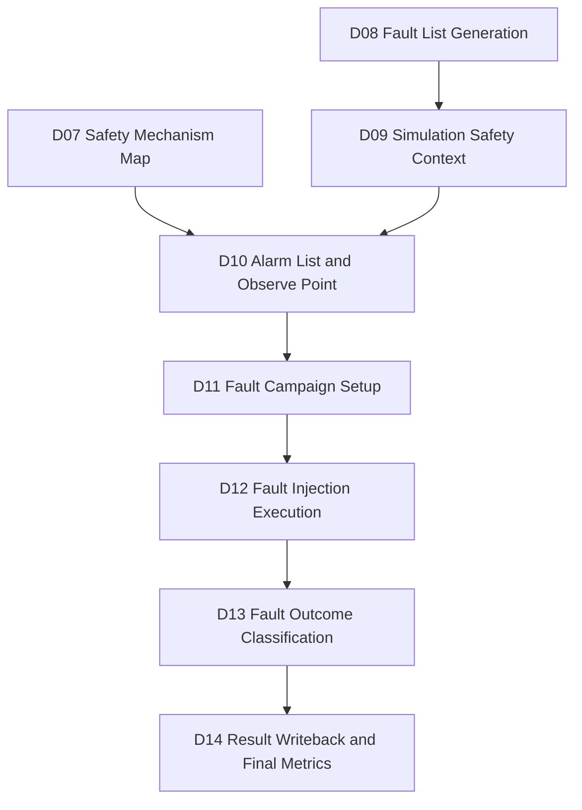
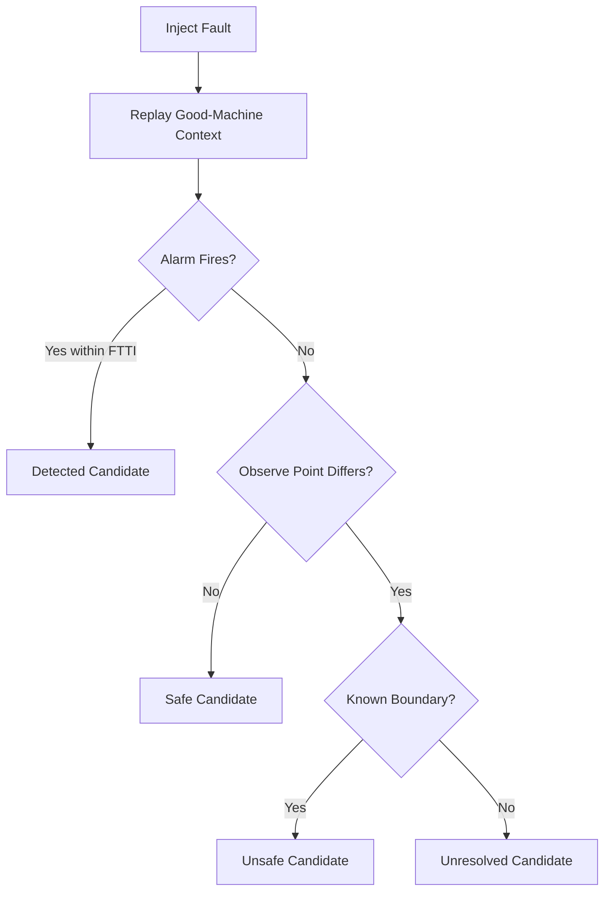
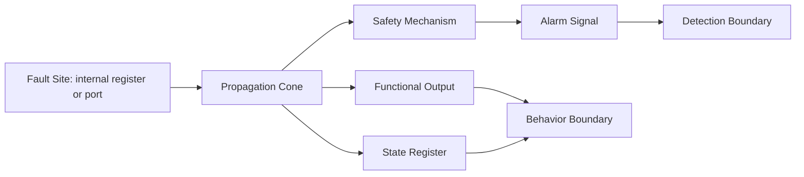
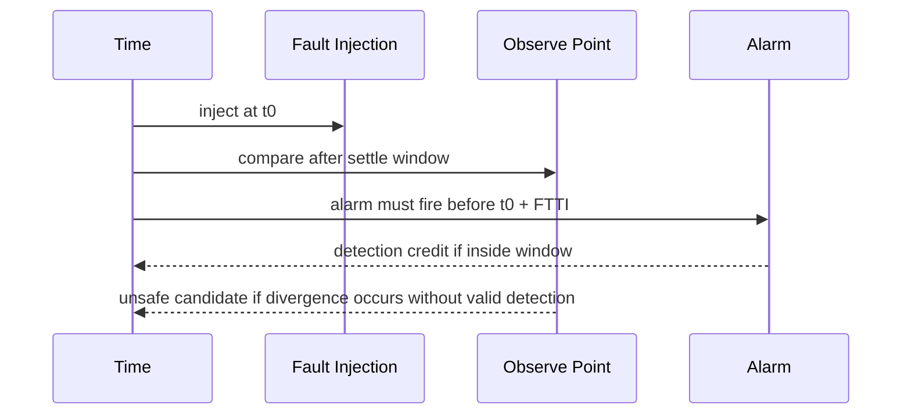
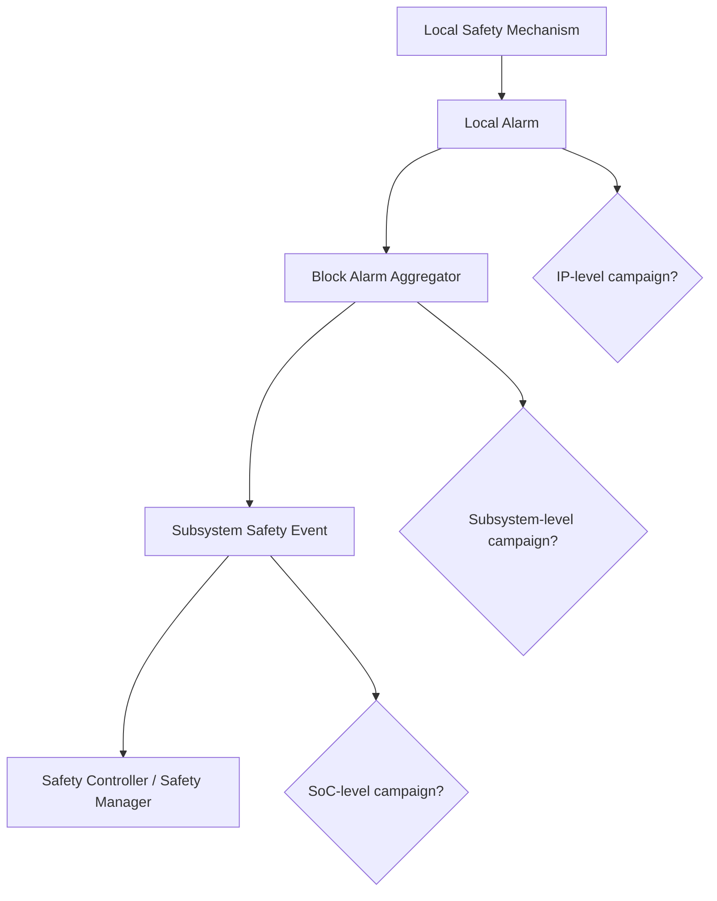
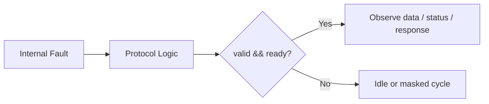
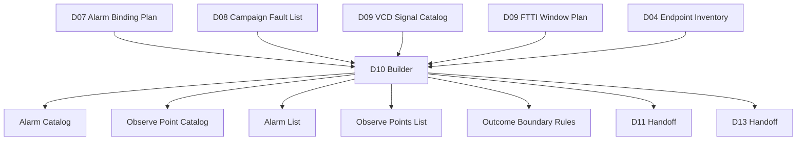
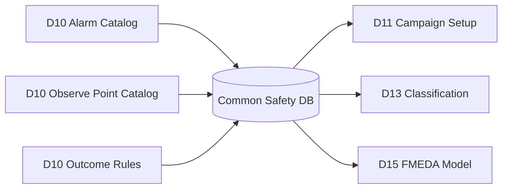

Title: Automotive Safe-IC Practice 10: Alarm List and Observe Point — Observation Boundaries for Fault Outcomes
Author: Darren H. Chen
Direction: Automotive Chip Functional Safety, Fault Campaign Preparation, Safety Verification Infrastructure
Demo: D10_alarm_list_and_observe_point_fault_outcome_boundary
Tags: ISO 26262, Safe-IC, Functional Safety, Fault Injection, Alarm List, Observe Point, FTTI, VCD, Fault Campaign, Diagnostic Coverage, FMEDA

---

## 1. From a Fault List to an Observable Safety Experiment

D08 turns safety analysis outputs into a campaign-ready fault list. D09 then creates the simulation safety context: the good-machine waveform, candidate observation signals, activity windows, and FTTI windows. D10 is the stage where the flow decides **what it means to observe a fault correctly**.

A fault campaign is not just a large loop over fault nodes. Each injected fault must be interpreted under a controlled observation model:

```text
fault injected
  -> design state may change
  -> safety mechanism may detect it
  -> alarm may fire
  -> observe point may change
  -> outcome can be classified
```

D10 focuses on the boundary between raw fault propagation and meaningful classification. It defines two central artifacts:

```text
alarm list
observe point specification
```

These two artifacts are different but connected. The alarm list tells the fault campaign engine which signals represent successful detection by safety mechanisms. The observe point specification tells the campaign where to compare or monitor the machine state when deciding whether a fault affects safety-relevant behavior.

Without D10, D11 can still build a fault campaign input package, but the campaign will be ambiguous. It may inject faults, replay a VCD, and produce reports, but the team cannot reliably answer:

```text
Was the fault detected?
Was it safe?
Was it unsafe?
Was it unresolved?
Was it merely unobservable within the selected context?
```

D10 is therefore the observation contract for later fault injection.

---

## 2. Position of D10 in the Evidence Flow

D10 sits between simulation context preparation and fault campaign setup.



D10 receives:

```text
D07 safety mechanism map
D07 alarm binding plan
D08 campaign fault list
D09 VCD signal catalog
D09 good-machine context
D09 FTTI window plan
D09 observe point candidates
```

D10 emits:

```text
alarm list
observe point list
alarm-to-SM map
observe-point-to-failure-mode map
FTTI-aware observation windows
D11 fault campaign setup handoff
D13 outcome-classification rules
D15 FMEDA trace hooks
```

The important engineering point is that D10 does not merely generate another input file. It converts safety intent into machine-checkable observation rules.

---

## 3. Alarm and Observe Point Are Not the Same Thing

An alarm is a signal that indicates a safety mechanism has detected an abnormal condition. It is usually driven by a checker, comparator, parity monitor, ECC decoder, watchdog, lockstep comparator, timeout monitor, protocol checker, or safety aggregator.

An observe point is a signal or state element used to judge whether machine behavior deviated from the good-machine reference.

They often overlap, but they are not equivalent.

| Concept | Main Question | Typical Example | Role in Fault Outcome |
|---|---|---|---|
| Alarm | Did a safety mechanism detect the fault? | `sm_alarm_o`, `ecc_error_o`, `lockstep_mismatch_o` | Supports detected classification |
| Observe point | Did safety-relevant machine behavior change? | `safe_state_o`, `control_state_q`, `critical_data_o` | Supports safe / unsafe / unresolved classification |
| Good-machine reference | What should the design do without a fault? | VCD golden trace | Baseline for comparison |
| FTTI window | How long may the design take to detect/control the fault? | injection time + N cycles | Timing boundary for detection |

A fault can propagate to an internal state element but never reach an alarm. A fault can trigger an alarm while the external output remains unchanged. A fault can affect an output but still be controlled by a safe-state transition. D10 must model these cases explicitly.

---

## 4. Fault Outcome Needs an Observation Boundary

A fault outcome is meaningful only relative to a boundary.

Consider a fault injected into an internal register:

```text
count_q[2] flips at cycle 12
```

Several things may happen:

```text
Case A: parity checker fires at cycle 13
Case B: state differs internally, but no safety-relevant output changes
Case C: output changes and no alarm fires
Case D: signal enters a black-box region and cannot be classified
```

These cases correspond to different outcome families:

```text
detected
safe
unsafe
unresolved
```

However, the campaign engine cannot classify them unless it knows:

```text
which signal is the alarm
which signal is safety-relevant behavior
which cycle range is allowed for detection
which VCD signal names correspond to design objects
which signals should be ignored during reset or initialization
```

D10 defines that boundary.

---

## 5. The Observation Model

The observation model used in D10 can be written as a simple relation:

```text
Outcome = classify(
    fault_site,
    injected_fault_type,
    good_machine_context,
    alarm_observation,
    state_observation,
    observe_window,
    FTTI_policy
)
```

In practical terms:

```text
if alarm fires within the allowed window:
    outcome candidate = detected
elif observe point differs from golden and no alarm fires:
    outcome candidate = unsafe
elif observe point does not differ from golden:
    outcome candidate = safe
else:
    outcome candidate = unresolved
```

Real tools apply additional details, but this model explains the essence.



The word “candidate” is intentional. D13 performs the final outcome classification. D10 prepares the rules that make classification possible.

---

## 6. Alarm List as a Detection Contract

An alarm list is the fault campaign input that declares which signals represent successful detection.

A minimal alarm list may be as simple as:

```text
sm_alarm_o
error_flag_o
fatal_fault_o
```

A more structured alarm catalog may include:

```text
alarm_id
alarm_signal
alarm_source
mapped_sm
mapped_failure_mode
mapped_endpoint
latency_budget_cycles
active_level
mask_policy
reset_behavior
aggregation_level
review_status
```

The list answers:

```text
What signal should be watched?
What safety mechanism drives it?
Which failure mode does it cover?
Is the alarm direct or aggregated?
Is it active-high or active-low?
Can it be masked during reset?
What is the expected detection latency?
```

This is why D10 should not treat the alarm list as a plain text afterthought. It should be generated from the safety mechanism map, checked against the VCD signal catalog, and tied back to failure modes and endpoints.

---

## 7. Observe Point as a Behavior Boundary

An observe point specification declares where the campaign should judge machine behavior.

An observe point may be:

```text
primary output
safety-relevant state register
protocol response signal
safe-state indicator
fault containment boundary
black-box boundary output
alarm aggregator output
```

A simple observe point list may look like:

```text
safe_state_o
critical_output_o
control_state_q
status_valid_o
```

A structured observe-point catalog may include:

```text
observe_id
observe_signal
observe_role
failure_mode_id
endpoint_id
comparison_policy
window_start_cycle
window_end_cycle
reset_mask_cycles
stability_requirement
classification_use
review_status
```

Observe points are not always the same as fault sites. A fault site is where the fault is injected. An observe point is where effect is judged.



---

## 8. Detection Boundary vs Behavior Boundary

D10 should separate two boundaries:

```text
detection boundary: alarm signal set
behavior boundary: observe point set
```

Detection boundary tells whether a safety mechanism responded. Behavior boundary tells whether the design behavior became safety-relevant.

This separation prevents a common mistake:

```text
alarm did not fire -> automatically unsafe
```

That is not always true. If a fault never affects safety-relevant behavior under the selected stimulus, it may be safe. Conversely:

```text
alarm fired -> automatically acceptable
```

That is also too simplistic. If the alarm fires too late, or if the machine violates safety behavior before the alarm, the result may need further review.

D10 makes these distinctions explicit.

---

## 9. FTTI as the Timing Contract

FTTI means **Fault Tolerant Time Interval**. It is the time interval in which the system must detect, control, or transition to a safe state before a fault can cause a hazardous effect.

For D10, FTTI is not just a documentation value. It affects whether alarm timing is acceptable.

```text
fault injection cycle = 100
FTTI window          = 20 cycles
alarm fires at cycle = 108
result               = detection within FTTI
```

But:

```text
fault injection cycle = 100
FTTI window          = 20 cycles
alarm fires at cycle = 130
result               = late detection review
```

D10 therefore needs a time-window model:

```text
observe_window_start
observe_window_end
alarm_window_start
alarm_window_end
reset_mask_window
initialization_mask_window
stable_context_window
```



---

## 10. Reset and Initialization Masking

A good fault campaign should not judge alarms and observe points during unstable initialization unless that is the intended test scenario.

Signals can be invalid during:

```text
reset assertion
reset release
clock warm-up
memory initialization
protocol training
firmware boot
scan-to-functional transition
```

D10 should define masks such as:

```text
reset_mask_cycles = 0..2
init_mask_cycles  = 0..5
observe_enable    = cycle >= 6
alarm_enable      = cycle >= 6
```

Otherwise, an alarm that toggles during reset may be misinterpreted as fault detection, or a normal initialization mismatch may be classified as unsafe behavior.

A robust D10 artifact includes mask policy fields.

---

## 11. Alarm Active Level and Polarity

Alarm signals can be active-high or active-low.

```text
active-high: alarm_o == 1 means alarm fired
active-low:  alarm_n == 0 means alarm fired
```

D10 should not infer polarity only from naming. Names such as `alarm_n`, `err_n`, or `fault_b` may suggest active-low behavior, but naming conventions are not proof.

A structured alarm file should include:

```text
alarm_signal, active_level
sm_alarm_o, 1
fault_n, 0
```

This prevents false classification when a campaign engine interprets all alarms as active-high by default.

---

## 12. Direct Alarm, Aggregated Alarm, and Safety Controller Alarm

Not all alarms are generated at the same level.

```text
local checker alarm
    -> block-level alarm aggregator
        -> subsystem safety interrupt
            -> safety controller action
```

A fault campaign may credit detection at different levels depending on the validation target.

For IP-level validation, local alarms may be acceptable:

```text
parity_error_o
ecc_sbe_o
lockstep_mismatch_o
```

For subsystem-level validation, aggregated alarms may be more appropriate:

```text
subsys_fatal_alarm_o
safety_irq_o
```

For SoC-level validation, the visible alarm may be routed into a safety controller:

```text
safe_mgr_event_valid
safe_mgr_event_id
```

D10 should encode the selected level.



---

## 13. Multi-Bit Alarm Buses

Some designs do not expose one alarm bit per safety mechanism. They expose an alarm bus:

```text
alarm_valid
alarm_id[7:0]
alarm_severity[1:0]
alarm_source[15:0]
```

D10 should model this as a decoded alarm condition rather than a single bit.

Example:

```text
alarm_condition = alarm_valid == 1 && alarm_id == 8'h12
```

The D10 catalog can represent this with fields:

```text
alarm_signal
qualifier_signal
qualifier_value
encoded_id_signal
encoded_id_value
```

This is important for SoC-level safety systems where alarms are transported as events rather than simple wires.

---

## 14. Protocol-Visible Observe Points

Observe points often include protocol signals.

Examples:

```text
valid
ready
req
ack
error
response
status
interrupt
```

Protocol-visible observe points are important because they define what the surrounding system can see. A fault that changes an internal register but does not change protocol-visible behavior may be safe under the current context. A fault that changes a protocol response may be unsafe if not detected.

For simple ready/valid style protocols, D10 may define observe rules such as:

```text
observe valid only when ready is high
observe data only when valid && ready
observe response only during transaction window
ignore idle cycles
```



This avoids over-classifying harmless idle-cycle changes.

---

## 15. Observe Point Granularity

Observe points can be coarse or fine.

Coarse observe points:

```text
safe_state_o
fatal_alarm_o
system_error_o
```

Fine observe points:

```text
state_q[3]
counter_q[2]
control_fsm.current_state
protocol_rsp[1]
```

Coarse observe points reduce noise and align better with system safety goals. Fine observe points improve debug visibility but can produce many differences that are not safety-relevant.

D10 should choose observe granularity based on validation intent:

| Intent | Recommended Observe Boundary |
|---|---|
| IP early debug | Fine state and local outputs |
| Safety mechanism validation | Alarms and mechanism outputs |
| Subsystem safety validation | Aggregated alarms and protocol-visible outputs |
| FMEDA evidence | Failure-mode-linked safety outputs |

---

## 16. Mapping Alarm to Safety Mechanism

D07 creates a safety mechanism map. D10 turns it into alarm bindings.

A typical mapping chain is:

```text
failure mode
  -> endpoint
    -> safety mechanism
      -> alarm signal
        -> FTTI window
          -> fault outcome rule
```

Example:

```text
FM_STATE_CORRUPTION
  -> counter_state_q
    -> endpoint parity
      -> counter_parity_error_o
        -> 3 cycles
          -> detected if alarm fires within 3 cycles
```

This mapping should be explicit because later reports may only show alarm behavior. Without the chain, a reviewer cannot determine which failure mode received detection credit.

---

## 17. Mapping Observe Point to Failure Mode

D10 also maps observe points back to failure modes.

Example:

```text
FM_OUTPUT_DATA_CORRUPTION
  -> observe point: data_o
  -> compare policy: golden mismatch during valid transaction
```

```text
FM_PROTOCOL_HANDSHAKE_CORRUPTION
  -> observe point: valid_o, ready_i, error_o
  -> compare policy: transaction-level semantic mismatch
```

This mapping helps D13 decide whether a mismatch is safety-relevant.

Not every mismatch is equal. A data mismatch during invalid protocol cycles may be irrelevant. A status mismatch during a safety-critical transaction may be unsafe.

---

## 18. Name Mapping Between RTL, Gate, and VCD

D10 must consider name consistency.

The same logical signal may have different names in different artifacts:

```text
RTL name
VCD hierarchical name
gate-level netlist name
fault-list node name
report name
FMEDA object name
```

A signal mapping table is often needed:

```text
logical_signal, rtl_path, vcd_path, gate_path, role
counter_state, top.u_counter.count_q, tb.dut.count_q, U_COUNTER/count_reg[0], observe
counter_alarm, top.u_counter.parity_error_o, tb.dut.parity_error_o, U_COUNTER/parity_error, alarm
```

D10 should produce or consume such a mapping so that D11 can configure the campaign without path ambiguity.

---

## 19. Black Boxes and Unresolved Outcomes

If a fault propagates into a black box, analog block, encrypted IP, or unmodeled boundary, the campaign may not be able to classify it fully.

D10 can reduce unresolved results by placing observe points at boundaries:

```text
blackbox_input
blackbox_output
wrapper_status
boundary_alarm
interface_error
```

However, an observe point at a black-box boundary may not prove internal behavior. It only proves whether the effect became visible at the selected boundary.

The D10 review should classify such observe points as:

```text
boundary observe point
not internal proof
requires design-owner review
```

---

## 20. Alarm List File Model

A public demo can use a simple alarm list file:

```text
# alarm.list
sm_alarm_o
counter_parity_error_o
protocol_error_o
```

A stronger demo should also generate a structured CSV:

```csv
alarm_id,alarm_signal,active_level,sm_id,failure_mode_id,endpoint_id,latency_cycles,mask_policy,review_status
A001,counter_parity_error_o,1,SM_ENDPOINT_PARITY,FM_STATE_CORRUPTION,EP_COUNT_Q,3,after_reset,reviewed
A002,protocol_error_o,1,SM_PROTOCOL_PARITY,FM_PROTOCOL_HANDSHAKE,EP_VALID_READY,5,transaction_window,reviewed
```

The plain list feeds tools. The CSV supports review, traceability, and article explanation.

---

## 21. Observe Point File Model

A public observe point file may look like:

```text
# observe_points.list
safe_state_o
critical_output_o
count_q
status_valid_o
```

A structured observe catalog may look like:

```csv
observe_id,observe_signal,role,failure_mode_id,endpoint_id,compare_policy,window_policy,review_status
O001,safe_state_o,safe_state,FM_STATE_CORRUPTION,EP_COUNT_Q,compare_to_golden,ftti_window,reviewed
O002,critical_output_o,primary_output,FM_OUTPUT_DATA_CORRUPTION,EP_DATA_OUT,valid_transaction_only,active_window,reviewed
O003,status_valid_o,protocol,FM_PROTOCOL_HANDSHAKE,EP_VALID_READY,semantic_compare,transaction_window,reviewed
```

Again, D10 should keep both:

```text
machine-consumable simple list
human-reviewable structured catalog
```

---

## 22. FTTI Window File Model

FTTI should be represented separately from signal lists.

Example:

```csv
rule_id,failure_mode_id,alarm_id,observe_id,injection_offset_cycle,latency_budget_cycles,settle_cycles,window_policy
T001,FM_STATE_CORRUPTION,A001,O001,0,3,1,alarm_before_observe_violation
T002,FM_OUTPUT_DATA_CORRUPTION,A002,O002,0,5,1,detect_or_safe_state
```

This makes it clear that a signal appearing in the alarm list is not enough. Its timing must also be acceptable.

---

## 23. Observation Windows and Activity Windows

D09 provides activity information. D10 should use it.

If a signal never toggles in the good-machine VCD, it may not be a good observe point for the current campaign. If a protocol transaction occurs only between cycles 20 and 30, observing the signal outside that window may be misleading.

D10 therefore combines:

```text
VCD signal catalog
activity window report
observe point candidates
FTTI window policy
```

The resulting observe plan should avoid:

```text
signals absent from VCD
signals inactive during injection window
signals valid only during reset
signals unrelated to selected failure modes
signals that are internal debug-only artifacts
```

---

## 24. Late Alarm and Early Violation

A subtle case is late alarm.

```text
fault changes critical output at cycle 10
alarm fires at cycle 15
FTTI budget is 8 cycles
```

If the critical output changed at cycle 10 but the alarm fired at cycle 15, the result may still be acceptable if the hazard is not realized before cycle 18. But if the output causes immediate unsafe behavior, the alarm may be too late.

D10 cannot solve system-level hazard timing by itself, but it can expose the evidence:

```text
first observe mismatch time
first alarm time
latency between mismatch and alarm
latency between injection and alarm
FTTI budget
review classification
```

D13 can then classify the outcome more accurately.

---

## 25. Spurious Alarm

A spurious alarm is an alarm that fires even though no fault effect reaches a safety-relevant boundary.

In some designs, spurious alarms are acceptable but costly. In others, they may trigger unnecessary safe shutdown.

D10 can prepare fields for this:

```text
alarm_without_observe_mismatch
alarm_during_reset
alarm_during_idle
alarm_persistence_cycles
alarm_clear_behavior
```

This helps distinguish useful detection from noisy or poorly timed alarm behavior.

---

## 26. Persistent vs Pulse Alarms

Alarms may be level-style or pulse-style.

```text
persistent alarm: stays high until cleared
pulse alarm: high for one or more cycles
encoded event: valid/id handshake
```

D10 should define sampling expectations:

```text
minimum_pulse_width
sample_clock
event_valid_signal
clear_condition
```

If a campaign samples only at coarse intervals, a one-cycle alarm pulse may be missed. If a design uses event handshakes, the alarm cannot be judged by a single bit alone.

---

## 27. D10 Demo Architecture

The D10 demo should not call a fault campaign engine by default. Its role is to prepare the alarm and observation boundary.



Expected D10 outputs:

```text
outputs/alarm_catalog.csv
outputs/alarm_list.list
outputs/observe_point_catalog.csv
outputs/observe_points.list
outputs/alarm_to_sm_trace.csv
outputs/observe_to_failure_mode_trace.csv
outputs/ftti_observation_rules.csv
outputs/outcome_boundary_rules.csv
outputs/d10_handoff_to_d11.csv
outputs/d10_handoff_to_d13.csv
outputs/d10_handoff_to_d15.csv
outputs/d10_quality_gate.csv
outputs/evidence_index.csv
outputs/demo_summary.md
```

---

## 28. Quality Gates for D10

D10 quality gates should check both completeness and consistency.

```text
Every reviewed alarm must exist in VCD signal catalog.
Every alarm should map to a safety mechanism or review reason.
Every observe point should map to a failure mode or endpoint.
Every selected fault scope should have at least one observation route.
Every FTTI rule should reference valid alarm and observe IDs.
No reset-only signal should be used as final observe point.
No unknown polarity alarm should be treated as reviewed.
No duplicate alarm ID should exist.
No duplicate observe ID should exist.
```

A strong D10 quality gate does not require all alarms to be final. It may allow review-status rows such as:

```text
reviewed
needs_rtl_signal_confirmation
needs_vcd_presence
needs_alarm_owner_review
not_applicable
```

But it should not silently pass missing observation boundaries.

---

## 29. Configuration Philosophy

D10 should use configuration files for policies that are design-dependent:

```text
alarm naming rules
alarm active-level rules
observe point selection rules
FTTI default rules
protocol signal semantic rules
reset mask rules
activity window thresholds
review severity policy
```

This prevents hard-coding assumptions into scripts.

A typical directory layout is:

```text
configs/
  alarm_selection_policy.csv
  observe_point_policy.csv
  ftti_policy.csv
  signal_role_rules.csv
  outcome_boundary_policy.csv

outputs/
  alarm_catalog.csv
  observe_point_catalog.csv
  ftti_observation_rules.csv
  outcome_boundary_rules.csv
```

The script should be deterministic. Given the same D07, D08, and D09 inputs, it should produce the same D10 artifacts.

---

## 30. Boundary Rules for D13

D10 should prepare rules for D13 fault outcome classification.

Example rule set:

```text
R1: If mapped alarm fires within FTTI and no earlier unsafe observe violation occurs, classify as detected candidate.
R2: If observe point remains equivalent to good-machine behavior throughout the relevant window, classify as safe candidate.
R3: If observe point differs from good-machine behavior and no valid alarm fires within the allowed window, classify as unsafe candidate.
R4: If signal coverage is missing, VCD context is insufficient, or effect reaches an unmodeled boundary, classify as unresolved candidate.
R5: If alarm fires only during masked reset/init window, do not credit detection.
R6: If alarm polarity is unknown, require review before credit.
```

These rules should be exported as data, not buried in prose.

```csv
rule_id,condition,classification_candidate,review_required
R1,alarm_within_ftti_and_no_prior_violation,detected,no
R2,no_observe_mismatch,safe,no
R3,observe_mismatch_without_valid_alarm,unsafe,no
R4,missing_context_or_unknown_boundary,unresolved,yes
R5,alarm_only_in_mask_window,no_credit,yes
R6,unknown_alarm_polarity,no_credit,yes
```

---

## 31. Database and Session Hooks

D10 is still mostly file-oriented, but it should prepare database session metadata.

A trace hook can be expressed as:

```text
common_db_file
session_name
artifact_type
source_stage
downstream_stage
trace_key
```

D10 may not write the final campaign results, but it should tell D11 and D13 where alarm and observe definitions came from.



The database is useful only if the file artifacts carry stable identifiers.

---

## 32. A Minimal Example

Suppose D07 selected endpoint parity for a counter register and D09 generated a good-machine VCD containing:

```text
clk
rst_n
count[3:0]
counter_parity_error_o
safe_state_o
```

D10 can generate:

```csv
alarm_id,alarm_signal,active_level,sm_id,failure_mode_id,latency_cycles
A001,counter_parity_error_o,1,SM_ENDPOINT_PARITY,FM_STATE_CORRUPTION,3
```

And:

```csv
observe_id,observe_signal,role,failure_mode_id,compare_policy
O001,count,state,FM_STATE_CORRUPTION,compare_to_golden_after_reset
O002,safe_state_o,safe_state,FM_STATE_CORRUPTION,asserted_on_controlled_fault
```

Then D11 can package:

```text
fault list
VCD
alarm list
observe point list
campaign config
```

And D13 can later interpret:

```text
alarm fired within 3 cycles -> detected candidate
count differs without alarm -> unsafe candidate
count unchanged -> safe candidate
missing signal -> unresolved candidate
```

---

## 33. Engineering Pitfalls

Common mistakes in D10 include:

```text
using every output as an observe point
using no observe point and relying only on alarms
treating active-low alarms as active-high
using alarm signals that are absent from VCD
ignoring reset and initialization windows
failing to distinguish local and aggregated alarms
not mapping alarms back to safety mechanisms
not mapping observe points back to failure modes
using internal debug signals as signoff boundaries without review
mixing generated files and hand-written review decisions without provenance
```

The purpose of D10 is to remove these ambiguities before D11 builds the campaign package.

---

## 34. What D10 Should Hand Off to D11

D11 needs campaign setup inputs. D10 should hand off:

```text
alarm list path
observe point list path
alarm catalog path
observe point catalog path
FTTI rules path
outcome boundary rules path
VCD signal catalog reference
fault list reference
review status summary
```

A handoff row may look like:

```csv
artifact,role,path,required_by,review_status
alarm_list,detection_boundary,outputs/alarm_list.list,D11,reviewed
observe_points,behavior_boundary,outputs/observe_points.list,D11,reviewed
ftti_rules,timing_boundary,outputs/ftti_observation_rules.csv,D11,reviewed
outcome_rules,classification_boundary,outputs/outcome_boundary_rules.csv,D13,reviewed
```

D11 should not rediscover these files by convention. It should read the handoff.

---

## 35. What D10 Should Hand Off to D15

D15 is the FMEDA data model stage. It needs to know which diagnostic mechanism covers which failure mode and how that coverage will be justified.

D10 contributes:

```text
alarm-to-SM trace
observe-to-failure-mode trace
FTTI rule trace
classification rule trace
review status
```

This is the bridge from simulation evidence to FMEDA rows.

```text
Failure Mode -> Safety Mechanism -> Alarm -> Fault Campaign Evidence -> Diagnostic Coverage Credit
```

Without D10 traceability, a later FMEDA row may claim diagnostic coverage without a clear path to the fault campaign evidence.

---

## 36. Summary

D10 transforms fault campaign preparation from a file collection task into an observation-boundary definition task.

The main outputs are:

```text
alarm list
observe point list
alarm catalog
observe point catalog
FTTI observation rules
outcome boundary rules
D11 handoff
D13 handoff
D15 trace hooks
```

The core method is:

```text
D07 tells what should detect.
D08 tells what should be injected.
D09 tells what can be observed in time.
D10 defines how detection and behavior will be judged.
```

This is why D10 is a critical step before fault campaign setup. A campaign without a well-defined alarm list and observe point model may still run, but its results will be difficult to classify, audit, and connect to FMEDA evidence.
