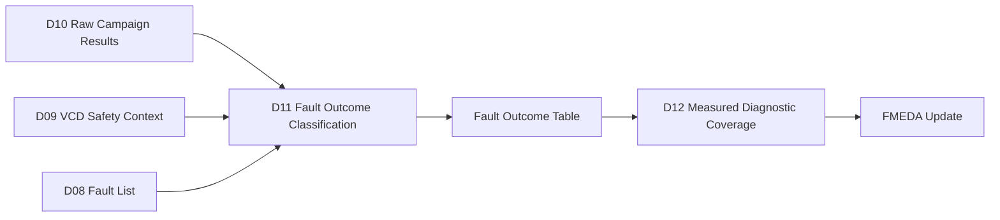
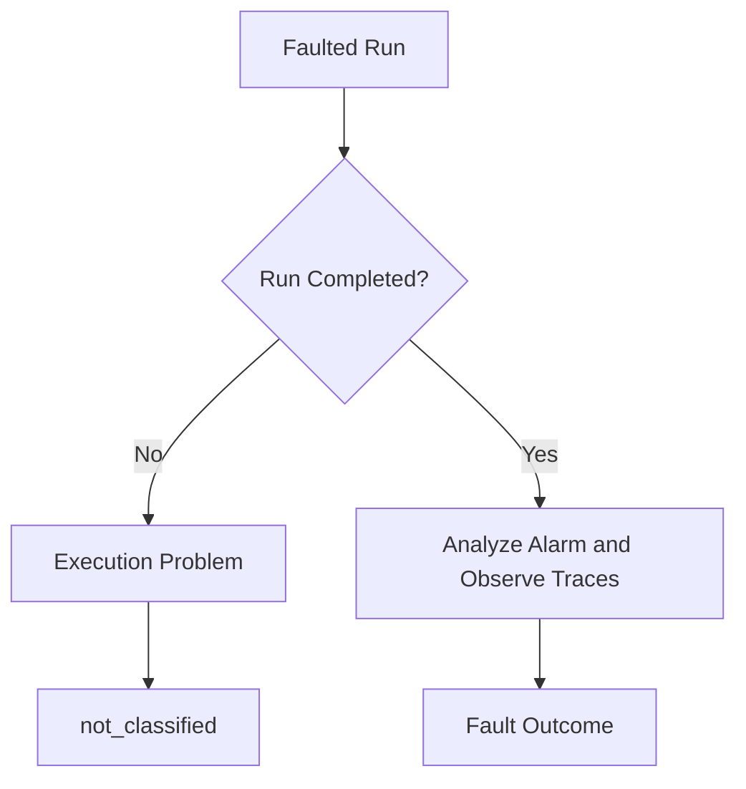
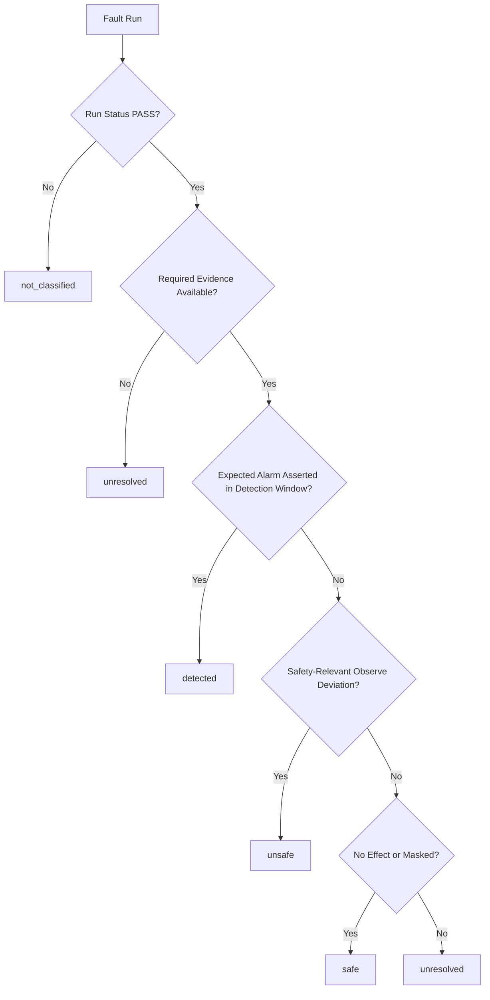
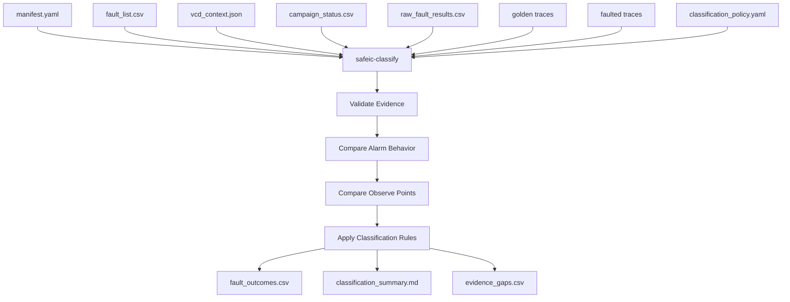
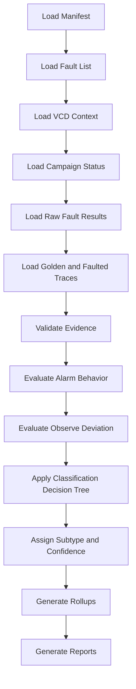
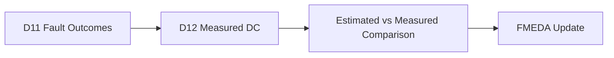

# [Automotive Safe-IC Practice 11] Fault Outcome Classification: From Raw Campaign Results to Detected, Safe, Unsafe, and Unresolved

**Author**: Darren H. Chen  
**Direction**: Automotive Chip Functional Safety Analysis and Fault Injection Practice  
**Demo**: D11_fault_outcome_classification  
**Tags**: Automotive Chip, Functional Safety, Fault Injection, Fault Campaign, Fault Classification, Detected Fault, Safe Fault, Unsafe Fault, Unresolved Fault, Diagnostic Coverage, FMEDA

---

## 1. Why This Article Matters

In the previous article, we executed or emulated a fault campaign.

D10 produced raw execution evidence:

```text
campaign_status.csv
raw_fault_results.csv
alarm_trace.csv
observe_trace.csv
per-fault status.json
golden traces
faulted traces
```

However, raw results are not yet safety conclusions.

A simulator run can complete successfully, but the injected fault may still be:

```text
detected
safe
unsafe
unresolved
```

The eleventh demo in this repository is:

```text
D11_fault_outcome_classification
```

The generic tool introduced in this article is:

```text
safeic-classify
```

The purpose of `safeic-classify` is to convert raw fault campaign data into structured fault outcomes using:

```text
fault_list.csv
vcd_context.json
campaign_status.csv
raw_fault_results.csv
golden traces
faulted alarm traces
faulted observe traces
detection windows
classification policy
```

The central idea is:

> Fault outcome classification is the step that turns raw simulation behavior into functional safety evidence. It must separate execution status, alarm behavior, observable deviation, golden comparison, and evidence completeness.

---

## 2. Where D11 Fits in the Flow

D11 sits after campaign execution and before measured diagnostic coverage.



**Figure 1. D11 converts raw campaign evidence into classified outcomes that can later be used for measured DC and FMEDA.**

D10 answers:

```text
Did the run execute?
What alarm traces and observe traces were captured?
```

D11 answers:

```text
Was the fault detected?
Was the fault safe?
Was the fault unsafe?
Was the result unresolved?
Why was it classified that way?
```

This distinction is critical.

A fault campaign is not useful until results are classified with a clear policy.

---

## 3. Execution Status Is Not Fault Outcome

Before classification, we must separate two different concepts.

### 3.1 Execution Status

Execution status describes whether the simulation run completed.

Examples:

```text
PASS
SIM_ERROR
TIMEOUT
INVALID_INPUT
UNSUPPORTED_FAULT
SKIPPED
```

### 3.2 Fault Outcome

Fault outcome describes the safety meaning of the injected fault.

Examples:

```text
detected
safe
unsafe
unresolved
not_classified
```

A run can have:

```text
run_status = PASS
fault_outcome = unsafe
```

or:

```text
run_status = PASS
fault_outcome = detected
```

or:

```text
run_status = SIM_ERROR
fault_outcome = not_classified
```



**Figure 2. A completed simulation is only a prerequisite for classification; it is not a safety outcome.**

This is why `safeic-classify` consumes both `campaign_status.csv` and raw traces.

---

## 4. The Four Core Outcomes

A simple and useful classification set is:

```text
detected
safe
unsafe
unresolved
```

### 4.1 Detected

A fault is detected if the relevant diagnostic mechanism reports the fault within the allowed detection window.

Example:

```text
Fault:
  toy_counter.count[0] transient_flip

Expected alarm:
  toy_counter.alarm

Observed:
  alarm asserted within detection window

Outcome:
  detected
```

### 4.2 Safe

A fault is safe if it does not cause a safety-relevant deviation at the observe points, or its effect is masked/controlled without requiring diagnostic credit.

Example:

```text
Fault injected into inactive logic.
No relevant observe point deviation.
No alarm required.

Outcome:
  safe
```

### 4.3 Unsafe

A fault is unsafe if it causes a relevant deviation without being detected or controlled.

Example:

```text
Fault changes safety-related output.
Expected alarm does not assert.
Deviation appears within valid observe window.

Outcome:
  unsafe
```

### 4.4 Unresolved

A fault is unresolved if the evidence is insufficient to decide.

Reasons include:

```text
missing observe point
missing alarm signal
X/Z in active window
simulation log incomplete
fault effect ambiguous
detection window unavailable
golden baseline unavailable
```

Unresolved is not the same as safe.

It means:

```text
the campaign result cannot support a strong safety conclusion
```

---

## 5. Classification Is Policy-Driven

Different projects may use slightly different classification rules.

Therefore, D11 must be policy-driven.

Example `classification_policy.yaml`:

```yaml
classification_policy:
  outcomes:
    detected: true
    safe: true
    unsafe: true
    unresolved: true

  detected_rule:
    require_expected_alarm: true
    require_alarm_within_detection_window: true

  unsafe_rule:
    observe_deviation_without_alarm: true
    require_safety_relevant_observe_point: true

  safe_rule:
    no_observe_deviation: true
    no_alarm_required: false
    allow_no_effect_as_safe: true

  unresolved_rule:
    missing_alarm: unresolved
    missing_observe_point: unresolved
    xz_in_active_window: unresolved
    sim_error: not_classified

  timing:
    use_detection_windows: true
    allow_late_alarm_as_detected: false
```

The policy should be explicit because classification results feed measured DC and FMEDA.

---

## 6. Inputs to Fault Classification

D11 consumes artifacts from D08, D09, and D10.

```text
D08:
  fault_list.csv

D09:
  vcd_context.json
  injection_windows.csv
  detection_windows.csv
  alarm_baseline.csv
  observe_context.csv

D10:
  campaign_status.csv
  raw_fault_results.csv
  per-fault alarm_trace.csv
  per-fault observe_trace.csv
```

Suggested input directory:

```text
D11_fault_outcome_classification/
  inputs/
    fault_list.csv
    vcd_context.json
    campaign_status.csv
    raw_fault_results.csv
    classification_policy.yaml

  runs/
    golden/
      golden_alarm_trace.csv
      golden_observe_trace.csv

    F001/
      alarm_trace.csv
      observe_trace.csv
      status.json

    F002/
      alarm_trace.csv
      observe_trace.csv
      status.json
```

The classifier should not rely on a single CSV if detailed traces are available.

A summary CSV is useful, but trace-backed classification is stronger.

---

## 7. Classification Decision Tree

A simplified classification decision tree is:



**Figure 3. A simple classification decision tree separates execution problems, missing evidence, alarm detection, unsafe deviation, and safe/no-effect behavior.**

This tree is intentionally conservative.

When evidence is missing, the result should become unresolved rather than safe.

---

## 8. Alarm-Based Detection

Many diagnostic mechanisms are represented by alarms.

A detected classification usually requires:

```text
expected alarm exists
alarm is present in traces
alarm is inactive in golden baseline
alarm asserts in the faulted run
alarm asserts within detection window
alarm polarity is known
```

Example alarm trace summary:

```csv
fault_id,expected_alarm,present,asserted,first_assert_time,within_detection_window
F001,toy_counter.alarm,true,true,65,true
F002,toy_counter.alarm,true,true,75,true
F004,toy_counter.alarm,true,false,,false
```

Detected classification:

```csv
fault_id,outcome,reason
F001,detected,expected alarm asserted within detection window
F002,detected,expected alarm asserted within detection window
F004,unsafe,alarm stuck-at fault prevented expected diagnostic reporting
```

A key rule is:

> Alarm assertion is diagnostic evidence only if the alarm is expected, present, correctly interpreted, and timely.

---

## 9. Detection Window Matters

An alarm that asserts too late may not count as detected for the intended safety requirement.

Example:

```text
fault injection time:
  60 ns

detection window:
  60 ns to 70 ns

alarm first assertion:
  90 ns
```

Depending on policy:

```text
strict classification:
  unsafe or unresolved

lenient classification:
  late_detected

recommended demo classification:
  unresolved or unsafe with late_alarm flag
```

D11 can include an extended classification field:

```text
outcome = unsafe
subtype = late_alarm
```

or:

```text
outcome = unresolved
evidence_gap = alarm_late
```

For early demos, keep the main outcome set simple and record late alarm as a reason.

Example:

```csv
fault_id,outcome,alarm_time,detection_window,reason
F010,unsafe,90,60:70,alarm asserted after allowed detection window
```

Timing is not a minor detail. Functional safety often requires response within a fault tolerant time interval or project-specific reaction window.

---

## 10. Observe-Point Deviation

An observe point is a signal used to determine whether the injected fault affected relevant behavior.

Examples:

```text
safety-related output
state variable
bus response
memory data
diagnostic status
safe-state indicator
alarm output
```

Observe comparison asks:

```text
Did the faulted run deviate from the golden run?
Was the deviation in a valid comparison window?
Was the observe point safety-relevant?
Was the deviation masked before becoming relevant?
```

Example observe summary:

```csv
fault_id,observe_point,changed_from_golden,first_deviation_time,valid_window
F001,toy_counter.count,true,60,30:200
F001,toy_counter.alarm,true,65,30:220
F004,toy_counter.alarm,false,,30:220
```

A fault can be detected and still cause an observe deviation.

That is not necessarily unsafe if the alarm is timely and the system response is acceptable.

Therefore, classification must consider both:

```text
alarm evidence
observable deviation
```

---

## 11. Safe Faults

Safe faults are often misunderstood.

A fault may be safe because:

```text
it does not propagate to any safety-relevant observe point
it is masked by logic
it occurs during inactive operation
it is overwritten before use
it affects non-safety-relevant logic
it causes a deviation only outside valid safety window
it is controlled by design response without requiring diagnostic credit
```

Example:

```csv
fault_id,observe_deviation,alarm_asserted,outcome,reason
F020,false,false,safe,no safety-relevant observe point deviation
```

However, the classifier should be conservative.

If the observe point is missing, do not classify as safe.

Use:

```text
unresolved
```

because the campaign did not collect enough evidence.

---

## 12. Unsafe Faults

Unsafe faults represent the most important evidence for design improvement.

A fault may be unsafe if:

```text
it causes safety-relevant deviation
no expected alarm asserts
alarm asserts too late
alarm path is stuck or masked
safe-state response does not occur
diagnostic mechanism fails
failure mode is exposed
```

Example:

```csv
fault_id,outcome,reason
F004,unsafe,alarm path stuck-at-0 prevents diagnostic reporting
F030,unsafe,observe point deviates and no expected alarm observed
```

Unsafe faults should be traceable to:

```text
fault node
failure mode
endpoint
expected safety mechanism
expected alarm
residual FIT contribution
recommended design action
```

D11 should not merely count unsafe faults.

It should explain them.

---

## 13. Unresolved Faults

Unresolved faults are common in real campaigns.

Reasons include:

```text
missing alarm trace
missing observe point trace
fault node not observable
VCD name mapping incomplete
X/Z values during active window
simulation timeout
unsupported fault model
no valid golden comparison
fault effect not clearly propagated
expected alarm not defined
classification policy conflict
```

Example:

```csv
fault_id,outcome,evidence_gap,reason
F099,unresolved,missing_observe_point,toy_counter.hidden_state not dumped
F100,unresolved,xz_in_active_window,observe point contains X from 80ns to 90ns
```

Unresolved faults should not be hidden.

They are evidence gaps and should drive improvements to:

```text
testbench
waveform dumping
name mapping
fault list quality
classification policy
fault campaign execution
```

---

## 14. Not Classified

Some runs should not enter outcome metrics.

Examples:

```text
SIM_ERROR
TIMEOUT
INVALID_INPUT
UNSUPPORTED_FAULT
SKIPPED
```

These should be marked:

```text
not_classified
```

Example:

```csv
fault_id,run_status,outcome,reason
F200,SIM_ERROR,not_classified,simulation failed
F201,TIMEOUT,not_classified,run exceeded timeout
F202,INVALID_INPUT,not_classified,target node not found
```

This prevents execution failures from being incorrectly treated as unsafe or unresolved safety behavior.

However, the campaign summary should still report these runs because they affect campaign quality.

---

## 15. Outcome Subtypes

The main outcome set should remain simple.

But subtypes help engineering review.

Suggested subtypes:

```text
detected_by_expected_alarm
detected_by_secondary_alarm
safe_no_effect
safe_masked
safe_inactive_window
unsafe_no_alarm
unsafe_late_alarm
unsafe_alarm_masked
unresolved_missing_alarm
unresolved_missing_observe
unresolved_xz
unresolved_no_golden
not_classified_sim_error
not_classified_timeout
```

Example:

```csv
fault_id,outcome,subtype,reason
F001,detected,detected_by_expected_alarm,alarm asserted at 65ns within 60:70
F020,safe,safe_no_effect,no observe deviation in valid window
F030,unsafe,unsafe_no_alarm,observe deviation without alarm
F099,unresolved,unresolved_missing_observe,observe point not available
```

Subtypes make the result table much more actionable.

---

## 16. Classification Confidence

Some classifications are stronger than others.

A useful tool may assign confidence:

```text
high
medium
low
```

Example:

```csv
fault_id,outcome,confidence,reason
F001,detected,high,expected alarm and observe deviation both captured
F020,safe,medium,no observe deviation but limited observe points
F099,unresolved,high,required observe point missing
```

Confidence can be based on:

```text
trace availability
alarm availability
observe point completeness
X/Z absence
golden comparison quality
timing validity
policy clarity
```

This is not mandatory for the first demo, but it improves review quality.

---

## 17. Golden vs Faulted Comparison

Classification depends on comparing faulted traces to golden traces.

Comparison modes may include:

```text
cycle_value
event_presence
final_value
stable_value
alarm_event
transaction_field
safe_state_entered
```

Example policy:

```yaml
comparison_policy:
  default_mode: cycle_value

  observe_points:
    toy_counter.count:
      mode: cycle_value
      valid_window: [30, 200]

    toy_counter.alarm:
      mode: alarm_event
      valid_window: [30, 220]

    top.u_ctrl.safe_state:
      mode: event_presence
      valid_window: [30, 300]
```

This allows D11 to classify different signal types correctly.

A data bus and an alarm signal should not be compared in the same way.

---

## 18. Alarm Polarity and Baseline

Alarm polarity must be known.

An alarm may be:

```text
active high
active low
level-based
pulse-based
sticky/latching
clear-on-read
multi-bit encoded
```

A classifier should avoid assuming all alarms are active high.

Example alarm definition:

```yaml
alarms:
  toy_counter.alarm:
    polarity: active_high
    type: level
    sticky: false

  top.u_alarm.fatal_n:
    polarity: active_low
    type: level
    sticky: true
```

Classification should compare faulted alarm behavior against golden baseline.

If the alarm is active in golden, then an active faulted alarm may not prove detection.

---

## 19. Detection by Secondary Alarm

Sometimes the expected alarm does not assert, but another relevant alarm asserts.

Policy options:

```text
count as detected
count as detected_secondary
count as unresolved
count as unsafe
```

For traceability, record it separately.

Example:

```csv
fault_id,expected_alarm,observed_alarm,outcome,subtype
F050,top.u_mem.ecc_error,top.u_alarm.global_alert,detected,detected_by_secondary_alarm
```

This can be useful in real systems where local alarms feed a global alert.

But it should be controlled by policy:

```yaml
secondary_alarm_policy:
  allow_secondary_alarm_detection: true
  require_alarm_mapping: true
```

---

## 20. Safe-State Response

Some designs respond to faults by entering a safe state.

In that case, detection may not be represented only by an alarm.

Observe points may include:

```text
safe_state
shutdown_req
reset_req
degraded_mode
output_disable
limp_home_mode
```

Example classification:

```text
Fault causes output corruption.
Alarm does not assert.
But safe_state asserted within allowed response window.
```

Depending on policy, this may be:

```text
detected_controlled
safe_controlled
```

For the simplified D11 outcome set, classify as:

```text
detected
```

with subtype:

```text
controlled_by_safe_state
```

or classify separately later if the project needs more granularity.

---

## 21. Classification Output Table

The main D11 output should be:

```text
fault_outcomes.csv
```

Recommended columns:

```text
fault_id
node
fault_type
endpoint
failure_mode
run_status
outcome
subtype
confidence
expected_alarm
observed_alarm
alarm_time
detection_window
observe_deviation
first_deviation_time
evidence_gap
reason
```

Example:

```csv
fault_id,node,fault_type,endpoint,failure_mode,run_status,outcome,subtype,confidence,reason
F001,toy_counter.count[0],transient_flip,toy_counter.count,FM_DATA_CORRUPTION,PASS,detected,detected_by_expected_alarm,high,alarm asserted within detection window
F004,toy_counter.alarm,stuck_at_0,toy_counter.alarm,FM_ALARM_NOT_ASSERTED,PASS,unsafe,unsafe_no_alarm,high,alarm path fault prevents detection
F020,toy_counter.unused,stuck_at_0,toy_counter.count,FM_DATA_CORRUPTION,PASS,safe,safe_no_effect,medium,no observe deviation in valid window
F099,toy_counter.hidden_state,transient_flip,toy_counter.count,FM_DATA_CORRUPTION,PASS,unresolved,unresolved_missing_observe,high,observe point missing
```

This table is the main handoff to measured DC computation.

---

## 22. Classification Summary

A summary by outcome is needed.

Example:

```csv
outcome,count,percentage
detected,20,50.0
safe,10,25.0
unsafe,6,15.0
unresolved,4,10.0
not_classified,0,0.0
```

A summary by failure mode is more useful:

```csv
failure_mode,detected,safe,unsafe,unresolved,total
FM_DATA_CORRUPTION,12,5,2,1,20
FM_ALARM_NOT_ASSERTED,1,0,4,0,5
FM_DIAGNOSTIC_STATE_CORRUPTION,2,1,0,2,5
```

A summary by safety mechanism:

```csv
safety_mechanism,detected,unsafe,unresolved,total
endpoint_parity,12,1,0,13
none,0,5,1,6
redundant_alarm,5,0,1,6
```

These summaries help identify weak mechanisms and weak failure modes.

---

## 23. Evidence Gaps Report

Unresolved and not-classified results should be summarized separately.

Example:

```csv
evidence_gap,count,recommended_action
missing_observe_point,3,add waveform dump or observe monitor
missing_alarm,2,dump alarm signal or update alarm mapping
xz_in_active_window,1,fix testbench initialization
sim_error,2,debug simulator or fault injection hook
no_detection_window,1,update VCD context extraction
```

This report is important because unresolved faults are often fixable by improving the campaign infrastructure.

A high unresolved rate usually means the campaign is not yet mature enough for strong safety conclusions.

---

## 24. The `safeic-classify` Tool Architecture

The generic tool `safeic-classify` can be implemented as a staged pipeline.



**Figure 4. `safeic-classify` validates evidence, compares alarm and observe behavior, applies rules, and produces classified outcomes.**

Suggested internal modules:

```text
safeic_classify/
  cli.py
  manifest.py
  load_inputs.py
  validate_evidence.py
  alarm_compare.py
  observe_compare.py
  decision_tree.py
  subtype.py
  confidence.py
  rollup.py
  report.py
```

Responsibilities:

| Module | Responsibility |
|---|---|
| `validate_evidence.py` | Check run status, missing signals, missing traces |
| `alarm_compare.py` | Evaluate expected alarm and detection windows |
| `observe_compare.py` | Compare golden and faulted observe behavior |
| `decision_tree.py` | Apply classification rules |
| `subtype.py` | Assign detailed subtype |
| `confidence.py` | Estimate evidence confidence |
| `rollup.py` | Summarize by outcome, failure mode, and mechanism |
| `report.py` | Generate CSV and Markdown outputs |

---

## 25. D11 Directory Structure

Suggested directory:

```text
D11_fault_outcome_classification/
  README.md
  run_demo.sh
  run_demo.csh
  manifest.yaml

  inputs/
    fault_list.csv
    vcd_context.json
    campaign_status.csv
    raw_fault_results.csv
    classification_policy.yaml

  runs/
    golden/
      golden_alarm_trace.csv
      golden_observe_trace.csv

    F001/
      alarm_trace.csv
      observe_trace.csv
      status.json

    F002/
      alarm_trace.csv
      observe_trace.csv
      status.json

  outputs/
    fault_outcomes.csv
    outcome_summary.csv
    outcome_by_failure_mode.csv
    outcome_by_safety_mechanism.csv
    evidence_gaps.csv
    classification_summary.md
    classification_warnings.csv
```

D11 should not rerun simulations.

It classifies existing evidence.

---

## 26. D11 Manifest

Example:

```yaml
project:
  name: automotive_safeic_practice
  demo: D11_fault_outcome_classification
  top_module: toy_counter

inputs:
  fault_list: inputs/fault_list.csv
  vcd_context: inputs/vcd_context.json
  campaign_status: inputs/campaign_status.csv
  raw_fault_results: inputs/raw_fault_results.csv
  classification_policy: inputs/classification_policy.yaml

traces:
  run_dir: runs
  golden_alarm_trace: runs/golden/golden_alarm_trace.csv
  golden_observe_trace: runs/golden/golden_observe_trace.csv

outputs:
  fault_outcomes: outputs/fault_outcomes.csv
  outcome_summary: outputs/outcome_summary.csv
  by_failure_mode: outputs/outcome_by_failure_mode.csv
  by_safety_mechanism: outputs/outcome_by_safety_mechanism.csv
  evidence_gaps: outputs/evidence_gaps.csv
  summary: outputs/classification_summary.md
```

The manifest ensures classification can be reproduced without rerunning the campaign.

---

## 27. D11 Execution Flow



**Figure 5. D11 execution flow: load evidence, validate it, evaluate alarm and observe behavior, classify, and report.**

Example bash script:

```bash
#!/usr/bin/env bash
set -euo pipefail

safeic-classify \
  --manifest manifest.yaml \
  --output-dir outputs
```

Example csh script:

```csh
#!/bin/csh -f

set DEMO = D11_fault_outcome_classification
echo "Running $DEMO"

safeic-classify \
  --manifest manifest.yaml \
  --output-dir outputs
```

Expected outputs:

```text
outputs/fault_outcomes.csv
outputs/outcome_summary.csv
outputs/outcome_by_failure_mode.csv
outputs/outcome_by_safety_mechanism.csv
outputs/evidence_gaps.csv
outputs/classification_summary.md
outputs/classification_warnings.csv
```

---

## 28. Example `classification_policy.yaml`

```yaml
classification_policy:
  main_outcomes:
    - detected
    - safe
    - unsafe
    - unresolved
    - not_classified

  run_status:
    classify_only_if_pass: true
    non_pass_outcome: not_classified

  detected:
    require_expected_alarm: true
    require_alarm_present: true
    require_alarm_within_detection_window: true
    allow_secondary_alarm: false

  unsafe:
    observe_deviation_without_detection: true
    late_alarm_counts_as_unsafe: true

  safe:
    no_observe_deviation_counts_as_safe: true
    require_observe_point_present: true

  unresolved:
    missing_alarm: true
    missing_observe_point: true
    xz_in_active_window: true
    missing_detection_window: true

  confidence:
    enable: true
```

This policy is intentionally explicit and conservative.

---

## 29. Example `fault_outcomes.csv`

```csv
fault_id,node,fault_type,endpoint,failure_mode,run_status,outcome,subtype,confidence,reason
F001,toy_counter.count[0],transient_flip,toy_counter.count,FM_DATA_CORRUPTION,PASS,detected,detected_by_expected_alarm,high,alarm asserted at 65ns within 60:70
F002,toy_counter.count[1],transient_flip,toy_counter.count,FM_DATA_CORRUPTION,PASS,detected,detected_by_expected_alarm,high,alarm asserted at 75ns within 70:80
F003,toy_counter.count_parity,stuck_at_0,toy_counter.count_parity,FM_DIAGNOSTIC_STATE_CORRUPTION,PASS,unsafe,unsafe_no_alarm,high,diagnostic state corrupted and no alarm observed
F004,toy_counter.alarm,stuck_at_0,toy_counter.alarm,FM_ALARM_NOT_ASSERTED,PASS,unsafe,unsafe_no_alarm,high,alarm stuck inactive
F005,toy_counter.alarm,stuck_at_1,toy_counter.alarm,FM_FALSE_ALARM,PASS,detected,detected_by_observed_alarm,medium,false alarm behavior observed
```

This file is the main machine-readable classification result.

---

## 30. Example `classification_summary.md`

```md
# D11 Fault Outcome Classification Summary

Project: automotive_safeic_practice
Demo: D11_fault_outcome_classification
Top: toy_counter

## Outcome Summary

Total classified faults: 5

- detected: 3
- safe: 0
- unsafe: 2
- unresolved: 0
- not_classified: 0

## Key Unsafe Faults

1. F003: toy_counter.count_parity stuck_at_0
   - Failure mode: FM_DIAGNOSTIC_STATE_CORRUPTION
   - Reason: diagnostic state corrupted and no alarm observed

2. F004: toy_counter.alarm stuck_at_0
   - Failure mode: FM_ALARM_NOT_ASSERTED
   - Reason: alarm stuck inactive

## Evidence Quality

- Missing alarms: 0
- Missing observe points: 0
- X/Z evidence gaps: 0

## Next Step

Use D12 to compute measured diagnostic coverage from fault_outcomes.csv.
```

This summary is designed for review before measured DC computation.

---

## 31. Validation Rules

`safeic-classify` should validate:

```text
fault_list.csv exists
campaign_status.csv exists
raw_fault_results.csv exists
classification_policy.yaml exists
fault IDs match across inputs
each PASS run has trace evidence or raw result evidence
expected alarms are present or explicitly missing
observe points are present or explicitly missing
detection windows exist when required
golden baseline exists
X/Z context is available
outcome values are valid
subtype values are valid
```

Example messages:

```text
[PASS] fault F001 exists in fault list and raw results
[PASS] F001 expected alarm toy_counter.alarm asserted within detection window
[WARN] F020 has no observe trace; classification set to unresolved
[WARN] F021 alarm asserted after detection window
[ERROR] raw result references unknown fault_id F999
[ERROR] classification policy missing detected rule
```

The classifier should fail on inconsistent IDs and unsupported policy values.

---

## 32. Common Mistakes

### 32.1 Treating Alarm Assertion as Always Detected

Alarm assertion only counts if:

```text
it is the expected or allowed alarm
it occurs within the detection window
it is not already active in golden baseline
its polarity is known
```

### 32.2 Treating No Deviation as Always Safe

No deviation is safe only if observe points are sufficient and valid.

Missing observe points should lead to unresolved.

### 32.3 Counting Simulation Failures as Unsafe Faults

Simulation errors are execution problems, not safety outcomes.

### 32.4 Ignoring Late Alarms

A late alarm may not satisfy the safety requirement.

Timing must be included.

### 32.5 Hiding Unresolved Faults

Unresolved faults are evidence gaps.

They should be visible and fixed where possible.

### 32.6 Mixing Estimated DC and Measured Outcomes

D11 produces measured outcomes.

D06 produced estimated coverage.

These should be compared later, not mixed.

---

## 33. How D11 Connects to Measured Diagnostic Coverage

D11 produces classified outcomes.

D12 will compute measured DC.

A simplified measured DC can be based on:

```text
detected
unsafe
safe
unresolved
```

Example:

```text
measured_dc = detected / (detected + unsafe)
```

Some methodologies may treat safe faults separately.

For this demo flow, D11 should not hardcode final metric formulas.

It should provide the outcome table needed by D12.



**Figure 6. D11 creates the outcome evidence required for measured diagnostic coverage.**

---

## 34. Recommended Implementation Stages

D11 can be implemented in stages.

### Stage 1: Rule-Based Classification from Raw Results

Classify using `raw_fault_results.csv`.

Deliverables:

```text
fault_outcomes.csv
classification_summary.md
```

### Stage 2: Trace-Backed Alarm Evaluation

Read per-fault alarm traces and detection windows.

Deliverables:

```text
alarm_evaluation.csv
```

### Stage 3: Observe Point Comparison

Compare golden and faulted observe traces.

Deliverables:

```text
observe_evaluation.csv
```

### Stage 4: Evidence Gap Reporting

Summarize unresolved and not-classified reasons.

Deliverables:

```text
evidence_gaps.csv
```

### Stage 5: Confidence and Rollups

Add confidence and roll up by failure mode and safety mechanism.

Deliverables:

```text
outcome_by_failure_mode.csv
outcome_by_safety_mechanism.csv
```

This staged path makes D11 useful even before full waveform-based comparison is implemented.

---

## 35. Summary

Fault outcome classification is the step that turns raw campaign execution data into functional safety evidence.

The D11 demo:

```text
D11_fault_outcome_classification
```

introduces the generic tool:

```text
safeic-classify
```

The tool consumes:

```text
fault_list.csv
vcd_context.json
campaign_status.csv
raw_fault_results.csv
golden traces
faulted traces
classification_policy.yaml
```

and generates:

```text
fault_outcomes.csv
outcome_summary.csv
outcome_by_failure_mode.csv
outcome_by_safety_mechanism.csv
evidence_gaps.csv
classification_summary.md
classification_warnings.csv
```

The central lesson is:

> Classification must be conservative, traceable, and policy-driven. A fault should be called detected, safe, unsafe, or unresolved only after checking execution status, alarm behavior, observe-point deviation, golden baseline, timing windows, and evidence completeness.

This is the final step before measured diagnostic coverage computation.

---

## 36. D11 Demo Checklist

For `D11_fault_outcome_classification`, the expected deliverables are:

```text
[ ] README.md
[ ] run_demo.sh
[ ] run_demo.csh
[ ] manifest.yaml

[ ] inputs/fault_list.csv
[ ] inputs/vcd_context.json
[ ] inputs/campaign_status.csv
[ ] inputs/raw_fault_results.csv
[ ] inputs/classification_policy.yaml

[ ] runs/golden/golden_alarm_trace.csv
[ ] runs/golden/golden_observe_trace.csv

[ ] runs/F001/alarm_trace.csv
[ ] runs/F001/observe_trace.csv
[ ] runs/F001/status.json

[ ] outputs/fault_outcomes.csv
[ ] outputs/outcome_summary.csv
[ ] outputs/outcome_by_failure_mode.csv
[ ] outputs/outcome_by_safety_mechanism.csv
[ ] outputs/evidence_gaps.csv
[ ] outputs/classification_summary.md
[ ] outputs/classification_warnings.csv
```

A successful D11 run should answer:

```text
Which faults were detected?
Which faults were safe?
Which faults were unsafe?
Which faults were unresolved?
Which runs were not classified due to execution problems?
Which alarms provided detection evidence?
Which observe points showed deviation?
Which faults have missing evidence?
Which failure modes contain unsafe or unresolved results?
Can the output be used by D12 to compute measured diagnostic coverage?
```
