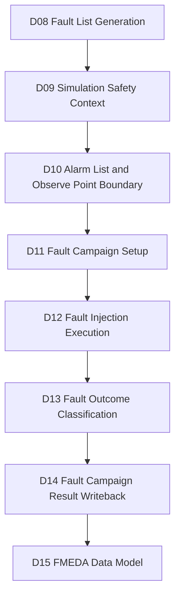
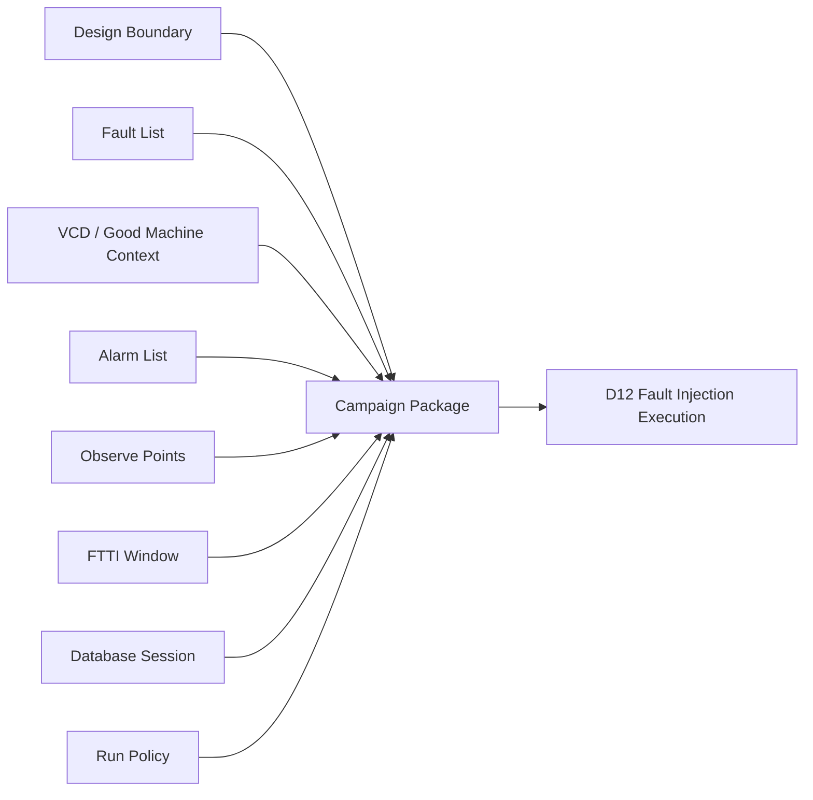
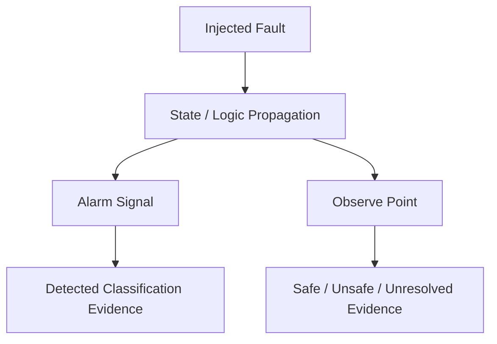
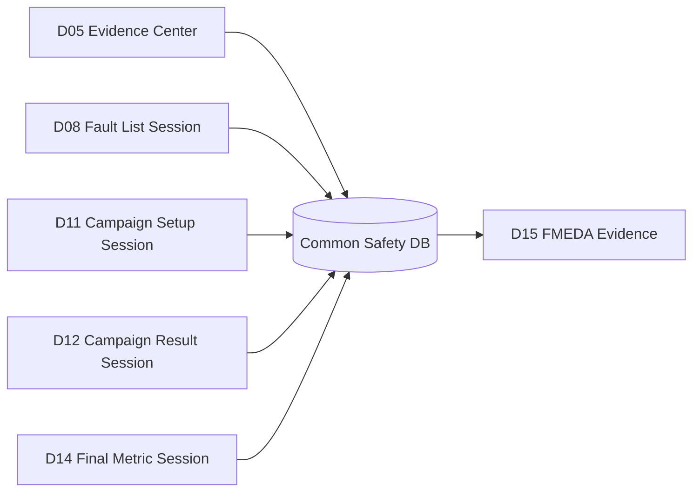
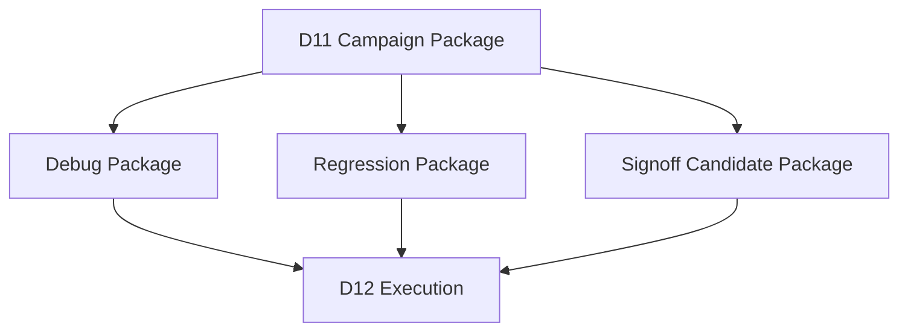

# Automotive Safe-IC Practice 11: Fault Campaign Setup — Building the Fault-Campaign Input Package
Author: Darren H. Chen
Direction: Automotive chip functional safety analysis and fault injection
Demo: D11_fault_campaign_setup_input_package
Tags: ISO 26262, Safe-IC, Fault Campaign, Fault Injection, VCD, Fault List, Alarm List, Observe Point, FTTI, Good Machine, Evidence Traceability

## 1. From Analysis Artifacts to an Executable Campaign Package

A functional safety flow becomes concrete when the abstract evidence produced by safety analysis is converted into a fault-campaign input package. Before this point, the flow has been mostly analytical and preparatory: base FIT rate, FIT-standard sensitivity, endpoint and startpoint structure, common database sessions, candidate safety mechanisms, failure-mode mapping, fault-list generation, simulation safety context, and observation boundary definition.

D11 is the point where those artifacts are no longer independent files. They are assembled into one coherent package that can be consumed by a fault campaign engine in the next stage.

A fault campaign package answers several practical questions:

```text
Which design boundary will be used?
Which RTL or netlist filelist defines that boundary?
Which fault list will be injected?
Which VCD or simulation context will drive the good-machine behavior?
Which alarms are credited as safety-mechanism responses?
Which observe points define the behavior boundary?
Which time window defines the fault-tolerant time interval?
Which database session or evidence registry will receive campaign metadata?
Which run mode will be used in D12?
```

If any of these answers are implicit, the campaign becomes hard to reproduce. If they are inconsistent, the results of D12 and D13 may be technically meaningless even if the tool produces output files. D11 therefore acts as the packaging and contract stage for the safety verification part of the flow.

The engineering objective is simple:

```text
D08 fault list
+ D09 simulation safety context
+ D10 alarm / observe boundary
+ D05 database identity
+ D01-D04 design and structural context
= D11 fault campaign input package
```

D11 does not classify final fault outcomes. It prepares the input conditions under which D12 can execute fault injection and D13 can classify detected, safe, unsafe, and unresolved outcomes.

---

## 2. D11 in the 20-Demo Safe-IC Flow

D11 sits after the observation boundary has been defined and before actual fault injection starts.



**Figure 1. D11 converts upstream evidence into a fault-campaign input package.**

This position matters because D11 is not allowed to invent safety semantics. It must inherit them from upstream stages:

```text
D08 decides what faults are in scope.
D09 decides what waveform context represents good-machine behavior.
D10 decides which alarm and observe boundaries are meaningful.
D11 decides how these pieces are packaged into a run-ready campaign setup.
```

The downstream stages then consume D11:

```text
D12 executes the campaign.
D13 interprets outcomes.
D14 writes results back into metric and database evidence.
D15 uses the result as part of the FMEDA evidence model.
```

In a real safety project, this separation prevents a common mistake: mixing setup policy, execution policy, and result interpretation in one script. Keeping D11 focused on setup makes the flow easier to review.

---

## 3. What “Fault Campaign Setup” Means

A fault campaign setup is not merely a command line. It is a structured description of the verification experiment.

The setup includes:

```text
design input package
fault list
VCD / simulation safety context
alarm list
observe point specification
injection timing policy
fault-tolerant time interval policy
campaign mode policy
parallelization policy
database and evidence policy
quality gate policy
```

A command is only one projection of that setup. A GUI session, database session, run manifest, and batch script can all represent the same setup.

For engineering purposes, D11 should produce both machine-readable and human-reviewable artifacts:

```text
campaign_setup.ini
campaign_manifest.yaml
campaign_input_manifest.csv
campaign_readiness_matrix.csv
d11_handoff_to_d12.csv
d11_handoff_to_d13.csv
evidence_index.csv
```

The setup is valid only when all required artifacts are present and mutually consistent.

---

## 4. The Input Contract for a Fault Campaign

A fault campaign needs at least five conceptual input classes:

```text
Design boundary
Fault list
Simulation context
Alarm list
Observation boundary
```

In practice, it also needs run-control metadata:

```text
campaign mode
output directory
log policy
database session
resource policy
seed / reproducibility policy
```

A clean D11 input contract can be represented as follows:



**Figure 2. A campaign package is a contract, not a loose group of files.**

If the package does not preserve this contract, D12 becomes fragile. A campaign may run with the wrong filelist, a stale VCD, an alarm list that does not match the design, or a fault list derived from a different structural boundary.

---

## 5. Design Boundary Protocol

The design boundary tells the fault campaign engine what hardware model will be used during injection.

A design boundary usually contains:

```text
filelist
top module
clock definition
reset assumptions
black-box policy
library or mapping policy
hierarchical instance path for injection
```

In D11, the filelist should not be a casual copy of an earlier filelist. It should be a campaign-ready filelist.

Important checks include:

```text
All paths are resolvable from the campaign root.
The top module is consistent with upstream analysis.
The RTL or netlist boundary matches the fault-list generation boundary.
The clock definition matches the VCD signal naming.
The injection instance path refers to the same design hierarchy used by the simulation context.
```

A typical generated artifact might be:

```text
outputs/campaign_inputs/filelist.absolute.f
```

The reason for using an absolute or root-normalized filelist is practical: fault campaigns are often launched from a different working directory than the analysis stage. If a relative path is interpreted from the wrong directory, the campaign fails before injection begins or, worse, silently uses the wrong input.

---

## 6. Fault List Protocol

The fault list tells the campaign engine what faults to inject.

D08 has already generated a campaign-ready fault list. D11 does not reinterpret the fault model; it checks and packages the result.

A fault list entry usually needs several fields:

```text
fault_id
fault_type
fault_site
fault_scope
fault_mode
endpoint_reference
failure_mode_reference
priority
source_evidence
```

Common fault types include:

```text
SA0: stuck-at-zero fault
SA1: stuck-at-one fault
transient bit flip
transition or time-delay fault
user-defined or technology-specific fault
```

D11 should separate the conceptual fault list from the tool-facing fault list:

```text
campaign_fault_list.csv       human-reviewable, traceable
campaign_fault_list.flt       tool-facing representation
fault_list_manifest.csv       index and checksum
```

This separation makes the setup auditable. The tool-facing list can be concise, while the CSV manifest can preserve traceability to D04, D06, D07, and D08.

---

## 7. Simulation Safety Context Protocol

The simulation safety context provides the time-varying behavior used during fault injection.

D09 produced a good-machine context, typically represented by a VCD and associated metadata:

```text
good_machine.vcd
vcd_signal_catalog.csv
activity_window_report.csv
ftti_window_plan.csv
safety_context_manifest.csv
```

The VCD should not be treated as just a waveform file. In a fault campaign, it is the behavioral environment for injection. It defines:

```text
which registers and signals are active
when reset is released
when safety-relevant operation starts
when faults may be injected
which signals can be used as compare or observe references
```

D11 checks whether the VCD context is compatible with the fault list and observation policy.

Key questions include:

```text
Does the VCD contain the signals required by the campaign?
Does the VCD cover the fault injection window?
Does the reset window match the campaign start policy?
Do observe points appear in the VCD or in a known mapped form?
Do alarm signals appear in the VCD or in the design boundary?
```

When a synthetic VCD is used for a public demo, D11 should mark it as a demonstration context. When a real simulator-generated VCD is used, D11 should record the simulator source, test name, and waveform manifest.

---

## 8. Good Machine as the Golden Reference

The term “Good Machine” means the behavior of the design without injected faults under the same stimulus context.

It serves as the golden reference for later comparison:

```text
fault-free behavior
vs.
fault-injected behavior
```

The campaign engine or downstream classifier can use the good-machine context to decide whether a fault changed the machine state, propagated to an observe point, or triggered an alarm.

D11 should capture the identity of the good-machine context:

```text
good_machine_vcd
good_machine_trace_id
simulation_window
reset_window
activity_window
reference_hash
```

This prevents a subtle error: using a fault list derived from one design version but a VCD produced from another.

---

## 9. Alarm List Protocol

An alarm list contains the safety response signals credited as detection mechanisms.

An alarm signal may represent:

```text
parity mismatch
ECC error
lockstep comparator mismatch
range-check violation
protocol integrity check failure
watchdog timeout
central safety aggregator output
```

D10 has already built an alarm list proposal and review table. D11 turns it into a campaign-ready input file.

A typical alarm list should capture:

```text
alarm_signal
alarm_group
related_safety_mechanism
related_failure_mode
related_endpoint
active_level
latency_policy
review_status
```

The tool-facing alarm list may contain only signal names, but the D11 manifest should retain the reason each alarm is included.

This distinction is important because a fault outcome may be credited as “detected” only when the alarm semantics are meaningful for the safety mechanism under analysis.

---

## 10. Observe Point Protocol

An observe point defines where the campaign watches for behavioral divergence.

Observe points can be:

```text
top-level outputs
protocol status signals
architectural state outputs
safety-controller interface signals
selected internal state points
```

Observe points are not the same as alarms.

An alarm answers:

```text
Did the safety mechanism report the fault?
```

An observe point answers:

```text
Did the fault affect the behavior boundary being monitored?
```

This distinction is central to outcome classification.



**Figure 3. Alarm and observe point evidence answer different questions.**

D11 packages observe points from D10 into a stable file, usually alongside a review table and boundary matrix.

---

## 11. Fault-Tolerant Time Interval Policy

The fault-tolerant time interval, or FTTI, defines the maximum allowed time between fault occurrence and fault control.

In a campaign setup, FTTI influences:

```text
injection window
alarm observation window
state comparison window
classification boundary
simulation length
```

If the FTTI is too short, a valid safety mechanism may appear late and be misclassified as not detected. If it is too long, the campaign may over-credit slow responses that do not meet the product safety requirement.

D11 should package FTTI as an explicit policy:

```text
fault_type
fault_group
injection_start_time
injection_end_time
observation_start_time
observation_end_time
ftti_cycles
ftti_time_units
source_policy
```

This policy is later consumed by D12 and D13.

---

## 12. Time Units and Timescale Alignment

A fault campaign often combines files from different tools:

```text
RTL or netlist
VCD
fault list
alarm list
observe point file
campaign configuration
```

These artifacts must agree on time units.

A VCD might use:

```text
$timescale 1ns $end
```

A campaign setup might specify injection time in cycles or absolute time. A clock file might identify clock names but not periods. D09 may have produced an FTTI plan in cycles. D11 must normalize these assumptions.

A good D11 package records:

```text
vcd_timescale
clock_period
cycle_to_time_conversion
injection_time_unit
ftti_time_unit
simulation_end_time
```

This prevents off-by-one-cycle and wrong-timescale errors in D12.

---

## 13. Campaign Run Mode Policy

A fault campaign can run in a debug-oriented single-run mode or a distributed parallel mode.

For small fault lists, a single-run mode is easier to debug:

```text
campaign_mode = single
```

For large fault lists, a distributed mode is more practical:

```text
campaign_mode = distributed
parallel_jobs = N
max_concurrent_faults = M
```

D11 should not hard-code one mode as universally correct. Instead, it should generate a policy layer:

```text
mode
parallelism
chunk_size
resource_class
retry_policy
license_policy
log_policy
```

D12 can then execute using the selected policy.

---

## 14. Single Mode vs. Distributed Mode

The choice between single and distributed execution is not just a performance choice. It affects debug behavior and evidence management.

Single mode is useful when:

```text
fault list is short
new setup is being debugged
one fault needs waveform inspection
tool options are being validated
```

Distributed mode is useful when:

```text
fault list is large
faults are independent enough to parallelize
runtime is the bottleneck
resource scheduling is available
```

D11 can prepare both:

```text
campaign_setup.single.ini
campaign_setup.distributed.ini
```

The command handoff can select one for D12:

```text
outputs/d11_handoff_to_d12.csv
```

This keeps D11 reusable for both educational demos and scaled engineering runs.

---

## 15. Campaign Setup File Structure

A campaign setup file should be readable and stable.

A neutral example:

```ini
# inputs/campaign/campaign_setup.ini

mode = campaign_setup
campaign_mode = single

top = toy_counter
filelist = inputs/design/filelist.absolute.f
clock_definition = inputs/design/toy_counter.clk

fault_list = inputs/faults/d08_campaign_ready.flt
sim_vcd = inputs/simulation/good_machine.vcd
alarm_list = inputs/alarms/d10_alarm_list.alarm
observe_points = inputs/observe/d10_observe_points.obs

ftti_policy = inputs/timing/ftti_boundary_plan.csv
safety_context = inputs/simulation/safety_context_manifest.csv

database = outputs/db/safeic_campaign.fdb
session = D11_CAMPAIGN_SETUP

output_dir = outputs/native/campaign_setup_preview
```

The exact names can vary by implementation, but the principles should remain:

```text
one file declares the campaign identity
inputs are explicit
outputs are explicit
policy is explicit
database session is explicit
```

---

## 16. Command Projection of the Setup

D11 may generate a command template for D12, but the command should be a projection of the setup, not the source of truth.

A neutral command template might look like this:

```bash
safeic_fault_engine \
  --mode campaign_single \
  --config inputs/campaign/campaign_setup.ini \
  --filelist inputs/design/filelist.absolute.f \
  --fault-list inputs/faults/d08_campaign_ready.flt \
  --vcd inputs/simulation/good_machine.vcd \
  --alarm-list inputs/alarms/d10_alarm_list.alarm \
  --observe-points inputs/observe/d10_observe_points.obs \
  --output-dir outputs/native/campaign_run
```

The article uses a neutral executable name because the engineering concept is independent of the local installation path. In an actual environment, this would be mapped to the installed fault-campaign backend through local configuration.

D11 should output this command as a reviewable script:

```text
outputs/commands/run_campaign_single.csh
outputs/commands/run_campaign_distributed.csh
```

---

## 17. Database Session Policy

The common safety database should be treated as a structured evidence container.

D11 should define:

```text
database_file
setup_session
fault_list_session
campaign_result_session
final_metric_session
```

An example session model:



**Figure 4. D11 adds a campaign setup session to the shared evidence graph.**

Even if the demo primarily uses CSV files, the database identity should be present. This makes the later D14 and D15 flows more realistic.

---

## 18. Evidence Manifests and Checksums

D11 should generate an evidence manifest that records every input artifact used in the setup.

A typical manifest row might include:

```text
artifact_id
artifact_role
source_demo
source_path
campaign_path
exists
size_bytes
sha256
used_by
```

The checksum is important because campaign evidence is sensitive to stale files. If the fault list changes after D11 setup but before D12 execution, the run should be considered a different campaign.

Recommended output:

```text
outputs/campaign_input_manifest.csv
```

This is one of the most useful files for reviewers because it turns the campaign setup into a traceable evidence package.

---

## 19. Readiness Matrix

A readiness matrix answers whether the campaign can be executed.

Example checks:

```text
filelist exists
VCD exists
fault list exists
alarm list exists
observe point file exists
FTTI plan exists
all referenced alarm signals are known
all referenced observe points are known
VCD timescale is known
fault list is non-empty
campaign mode is selected
output directory is writable
```

A campaign should not proceed if critical items are missing.

A D11 readiness matrix might contain:

```text
check_id
severity
status
artifact
message
suggested_action
```

Severity levels can be:

```text
FAIL: execution should not proceed
WARN: execution can proceed, but review is needed
INFO: metadata or traceability note
```

D11 quality gates are stricter than earlier planning stages because D12 will perform expensive execution.

---

## 20. Fault List and VCD Compatibility

A frequent campaign setup problem is fault/VCD mismatch.

Examples:

```text
fault site not present in the design hierarchy
fault site derived from a different RTL snapshot
state element inactive throughout the VCD
fault injection time outside VCD range
fault list targets an endpoint with no observe boundary
```

D11 should not deeply simulate each fault. But it can perform preflight checks:

```text
fault list count
fault type distribution
fault scope distribution
endpoint coverage
VCD activity overlap
injection window coverage
```

This can be summarized in:

```text
outputs/fault_vcd_compatibility.csv
```

The goal is to catch obvious setup errors before D12 consumes compute resources.

---

## 21. Alarm and Observe Compatibility

D10 produced alarms and observe points. D11 checks them in campaign context.

Compatibility checks include:

```text
alarm list is non-empty when detection credit is expected
alarm signal names are normalized
alarm active level is known
observe point list is non-empty
observe points are present in the signal catalog or mapping table
observe points are not all identical to alarms
alarm latency policy is linked to FTTI
```

This matters because detected and unsafe outcomes are interpreted differently:

```text
alarm fires within window -> detected evidence
observe point diverges without valid alarm -> unsafe evidence
no meaningful propagation -> safe or unresolved depending on context
```

D11 does not perform classification, but it prepares the observation contract for D13.

---

## 22. Injection Timing Plan

D11 should define where in time faults may be injected.

A minimal injection plan contains:

```text
fault_group
start_cycle
end_cycle
step
allowed_during_reset
allowed_after_reset
allowed_only_when_active
```

For safety campaigns, it is usually dangerous to inject during reset unless reset behavior is explicitly part of the safety concept. Most campaigns begin after reset release and after the design enters a meaningful operating state.

A more advanced plan can use activity windows from D09:

```text
inject only when target endpoint is active
inject only during transaction window
inject near protocol boundary
inject in representative safety-critical operation phase
```

D11 packages this policy but leaves execution to D12.

---

## 23. Campaign Chunking Strategy

Large campaigns need chunking.

A chunking strategy splits faults into smaller batches:

```text
by fault type
by endpoint group
by failure mode
by priority
by estimated runtime
by activity window
```

D11 can produce:

```text
outputs/campaign_chunks.csv
```

Example fields:

```text
chunk_id
fault_count
fault_type
priority_range
recommended_mode
estimated_runtime_class
output_subdir
```

Chunking is part of setup, not execution. D12 uses it to decide how to run campaigns efficiently.

---

## 24. Debug Package vs. Production Package

A debug package and a production package serve different purposes.

Debug package:

```text
small fault subset
single mode
verbose logs
waveform dump enabled
short runtime
manual inspection friendly
```

Production package:

```text
full or sampled fault list
distributed mode
controlled log volume
stable output naming
common database writeback
resource-aware scheduling
```

D11 should be able to prepare both.



**Figure 5. One setup model can produce multiple execution packages.**

For the demo series, a debug-scale package is enough. The directory structure should still be scalable.

---

## 25. Handling Synthetic vs. Real VCD Context

D09 may produce a synthetic VCD in a public demo or a real VCD in an internal engineering environment.

D11 should not hide this distinction.

Recommended metadata:

```text
vcd_origin = synthetic | simulator_generated | imported
simulator_name = optional
simulation_test = optional
stimulus_name = optional
coverage_scope = optional
```

A synthetic VCD is useful for demonstrating the data contract. A real VCD is needed for meaningful campaign evidence.

This distinction should be carried into D12 and D13 so that no one mistakes a format demonstration for a safety result.

---

## 26. Handling Tool-Specific Options Without Polluting the Article Flow

Real engines have many implementation-specific options. D11 should isolate them in configuration files rather than scattering them across scripts.

A useful pattern is:

```text
configs/campaign_backend_profile.csv
configs/campaign_option_policy.csv
inputs/campaign/campaign_setup.ini
outputs/commands/run_campaign_single.csh
```

The article-level flow can remain stable:

```text
safeic_fault_engine reads campaign_setup.ini
```

The local environment can map this to the installed backend and required options.

This is especially important for public demos. The public package should explain the engineering protocol without exposing private installation paths or vendor-specific run logs.

---

## 27. Quality Gate Philosophy

D11 quality gates should be conservative.

A campaign setup should fail if:

```text
fault list is missing or empty
VCD is missing
alarm list is missing when detection is expected
observe point file is missing
filelist cannot be resolved
clock definition is missing
FTTI policy is missing
campaign mode is undefined
evidence manifest cannot be generated
```

It may warn if:

```text
some observe points are review-only
some alarms are proposed rather than confirmed
VCD origin is synthetic
some fault groups have low activity coverage
parallel mode is requested without resource profile
```

D11 should not treat all warnings as fatal. But every warning should be classified and recorded.

---

## 28. D11 Output Package Layout

A clean D11 package can use the following layout:

```text
D11_fault_campaign_setup_input_package/
  inputs/
    from_D08/
    from_D09/
    from_D10/
    campaign/
      campaign_setup.ini
    design/
      filelist.absolute.f
      clock_definition.clk
    faults/
      campaign_fault_list.flt
    simulation/
      good_machine.vcd
      safety_context_manifest.csv
    alarms/
      alarm_list.alarm
    observe/
      observe_points.obs
    timing/
      ftti_boundary_plan.csv
  outputs/
    campaign_input_manifest.csv
    campaign_readiness_matrix.csv
    campaign_setup_summary.csv
    campaign_chunks.csv
    fault_vcd_compatibility.csv
    alarm_observe_compatibility.csv
    commands/
      run_campaign_single.csh
      run_campaign_distributed.csh
    d11_handoff_to_d12.csv
    d11_handoff_to_d13.csv
    d11_handoff_to_d14.csv
    d11_quality_gate.csv
    evidence_index.csv
    demo_summary.md
  logs/
```

This layout is intentionally explicit. D11 is the last stage before execution; ambiguity here becomes expensive in D12.

---

## 29. D11 Handoff to D12

D12 needs an execution-ready handoff.

Recommended D11-to-D12 fields:

```text
campaign_id
setup_file
command_script
campaign_mode
filelist
fault_list
vcd_file
alarm_list
observe_point_file
ftti_policy
output_dir
database_file
database_session
expected_status_file
```

This enables D12 to operate as a runner rather than a setup repair stage.

A clean handoff prevents D12 from doing too much:

```text
D11 prepares.
D12 executes.
D13 classifies.
```

---

## 30. D11 Handoff to D13 and D14

D13 needs the observation contract:

```text
alarm semantics
observe point semantics
FTTI boundary
safe / unsafe comparison policy
unresolved fault policy
```

D14 needs database and result writeback context:

```text
campaign result session
fault list source session
metric recalculation session
final evidence target
```

Therefore D11 should produce:

```text
d11_handoff_to_d13.csv
d11_handoff_to_d14.csv
```

This may feel early, but it prevents D13 and D14 from reverse-engineering setup assumptions from logs.

---

## 31. Review Checklist

Before D12 starts, a reviewer should be able to answer:

```text
Is this the intended design boundary?
Is the fault list derived from the correct upstream analysis?
Is the VCD the intended good-machine context?
Are alarms known and justified?
Are observe points meaningful?
Is the FTTI window explicitly defined?
Is campaign mode selected?
Are output directories and database sessions unique?
Are manifests and checksums recorded?
Are warnings classified?
```

If the answer is unclear, the campaign should not proceed.

D11 is a safety verification setup checkpoint, not just a file-copy operation.

---

## 32. Methodology Summary

D11 transforms a set of upstream safety artifacts into a campaign-ready package.

The key idea is contract-driven packaging:

```text
D08 defines what to inject.
D09 defines the good-machine context.
D10 defines what to observe and what alarm response means.
D11 packages these into a fault campaign setup.
D12 executes the campaign.
D13 classifies outcomes.
D14 writes results back into final metric evidence.
```

A mature D11 implementation should preserve traceability from every campaign input back to its source stage, normalize file paths, verify readiness, separate debug and production policies, and prepare handoff files for downstream execution and classification.

This is the stage where safety verification stops being a collection of concepts and becomes a reproducible experiment.
