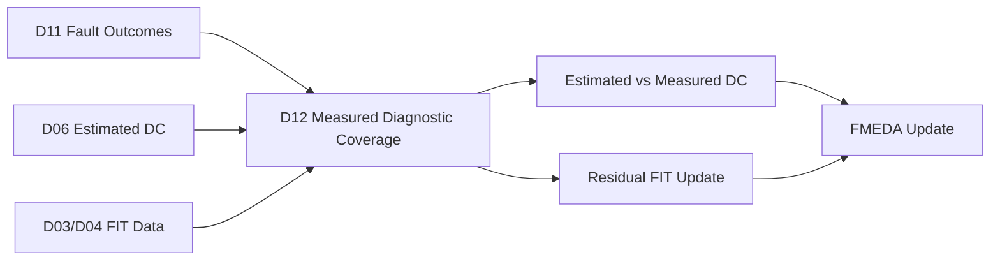
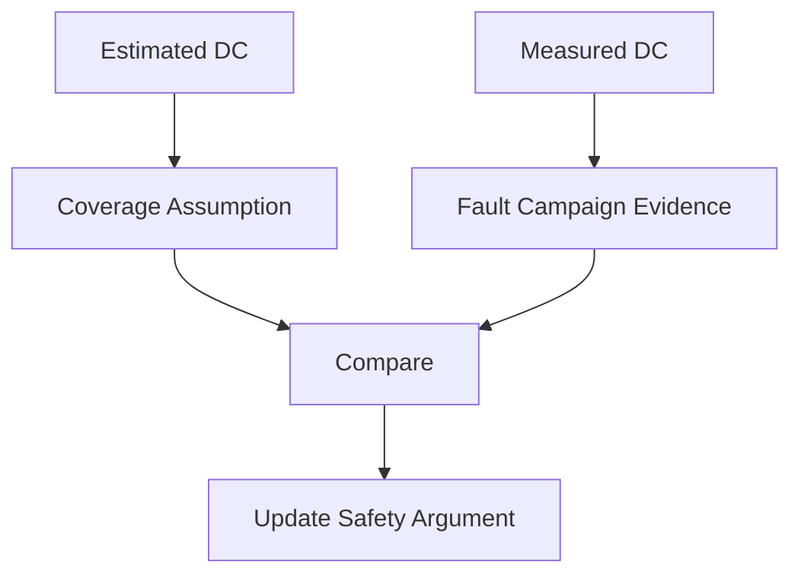
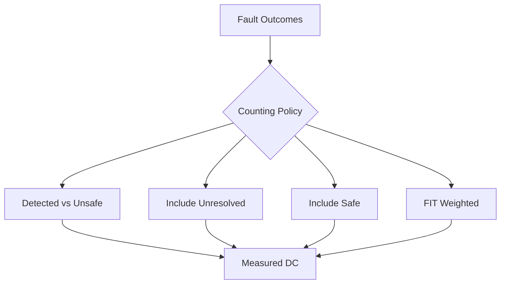
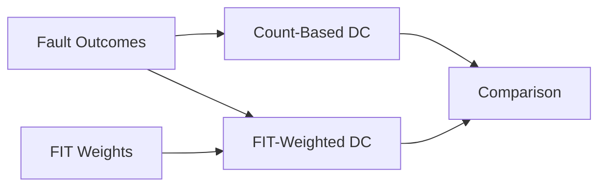
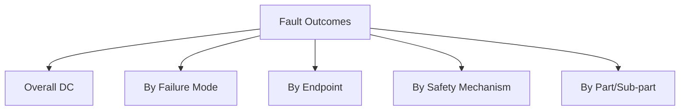
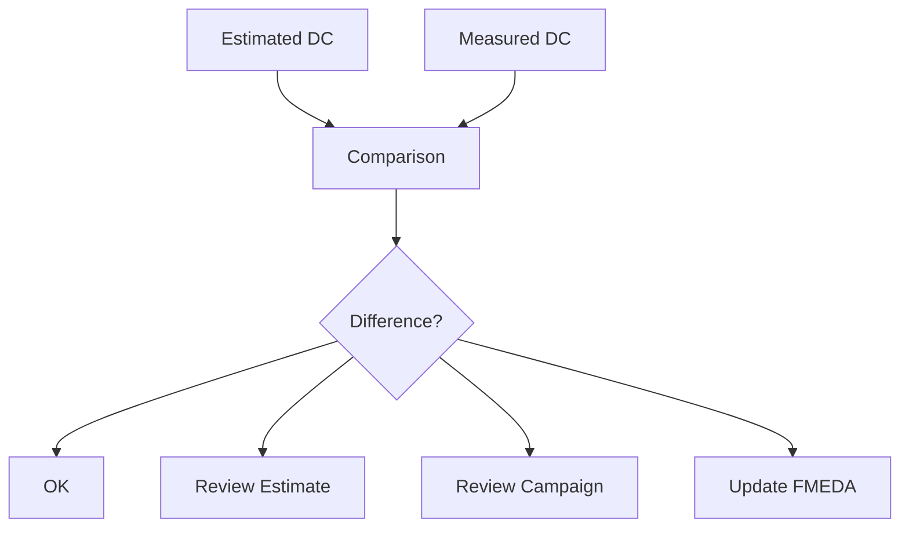
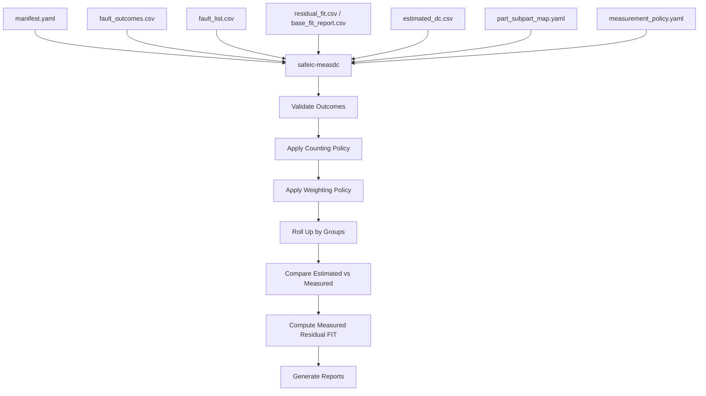
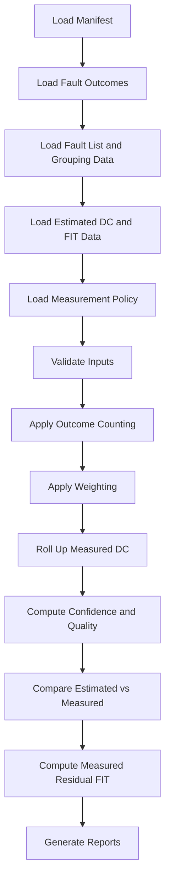
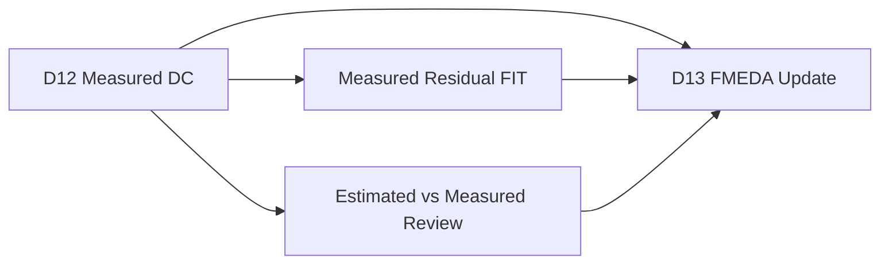

# [Automotive Safe-IC Practice 12] Measured Diagnostic Coverage: From Classified Fault Outcomes to Evidence-Based DC

**Author**: Darren H. Chen  
**Direction**: Automotive Chip Functional Safety Analysis and Fault Injection Practice  
**Demo**: D12_measured_diagnostic_coverage  
**Tags**: Automotive Chip, Functional Safety, Measured Diagnostic Coverage, Fault Injection, Fault Outcome, Detected Fault, Unsafe Fault, Safe Fault, Unresolved Fault, FMEDA, Residual FIT

---

## 1. Why This Article Matters

In the previous article, we classified fault campaign results into:

```text
detected
safe
unsafe
unresolved
not_classified
```

This classification is the first point where the fault campaign becomes safety evidence.

However, classification alone is still not the final metric.

The next question is:

> How do we convert classified fault outcomes into measured diagnostic coverage?

The twelfth demo in this repository is:

```text
D12_measured_diagnostic_coverage
```

The generic tool introduced in this article is:

```text
safeic-measdc
```

The purpose of `safeic-measdc` is to compute measured diagnostic coverage from:

```text
fault_outcomes.csv
fault_list.csv
residual_fit.csv
base_fit_report.csv
failure mode mapping
part/sub-part mapping
classification policy
measurement policy
```

and generate:

```text
measured_dc_by_endpoint.csv
measured_dc_by_failure_mode.csv
measured_dc_by_safety_mechanism.csv
measured_dc_by_part.csv
estimated_vs_measured_dc.csv
measured_dc_summary.md
```

The central idea is:

> Measured DC is not just a count ratio. It is a metric derived from classified fault outcomes under explicit counting, weighting, filtering, and evidence-quality policies.

---

## 2. Where D12 Fits in the Flow

D12 sits after fault outcome classification and before FMEDA update.



**Figure 1. D12 converts classified fault outcomes into measured DC and prepares data for FMEDA update.**

D11 answers:

```text
what happened to each injected fault
```

D12 answers:

```text
what the measured coverage means for endpoints, failure modes, mechanisms, parts, and residual FIT
```

This is a major shift:

```text
from individual fault evidence
to aggregate safety metric evidence
```

---

## 3. Estimated DC vs Measured DC

Earlier in the flow, D06 computed estimated diagnostic coverage.

Estimated DC is based on:

```text
safety mechanism assumptions
structural scope
engineering judgment
library values
FIT-weighted calculation
```

Measured DC is based on:

```text
fault injection outcomes
actual alarm behavior
actual observe point deviation
actual campaign evidence
```

They are related but not the same.



**Figure 2. Estimated DC is an assumption or calculation; measured DC is campaign-derived evidence.**

A healthy workflow should compare them.

If measured DC is much lower than estimated DC, the safety mechanism assumption may be too optimistic.

If measured DC is higher, the campaign may have exercised strong detection behavior, but the measurement scope must still be reviewed.

---

## 4. The Simplest Measured DC Formula

A common simplified formula is:

```text
measured_dc = detected / (detected + unsafe)
```

This formula focuses on faults that produced safety-relevant effects or required diagnostic credit.

Example:

```text
detected = 80
unsafe = 20

measured_dc = 80 / (80 + 20) = 0.80
```

But this simple formula hides many questions:

```text
What about safe faults?
What about unresolved faults?
What about not_classified runs?
Are all faults equally weighted?
Should residual FIT weights be used?
Should diagnostic-path faults be separated?
Should endpoints be grouped by failure mode?
Should missing evidence reduce confidence?
```

Therefore, D12 must make measurement policy explicit.

---

## 5. Why Counting Policy Matters

Different counting policies can produce different measured DC values from the same campaign.

Consider:

```text
detected = 80
safe = 50
unsafe = 20
unresolved = 10
not_classified = 5
```

Possible formulas:

```text
detected / (detected + unsafe)
= 80 / (80 + 20)
= 0.80

detected / (detected + unsafe + unresolved)
= 80 / (80 + 20 + 10)
= 0.727

(detected + safe) / (detected + safe + unsafe)
= 130 / (130 + 20)
= 0.867
```

These values are not interchangeable.

A measurement report must state which policy was used.



**Figure 3. Measured DC depends on the counting policy applied to classified outcomes.**

For this demo, the default policy should be conservative and explicit.

---

## 6. Recommended Default Policy for D12

For the first implementation, use a conservative default:

```text
Primary measured DC:
  detected / (detected + unsafe)

Unresolved:
  reported separately

Safe:
  reported separately

Not classified:
  excluded from DC numerator and denominator,
  but reported as campaign quality issue
```

Why?

Because:

```text
detected faults provide diagnostic evidence
unsafe faults represent detected failure gaps
safe faults may not require diagnostic credit
unresolved faults represent evidence gaps
not_classified runs represent execution quality problems
```

Example policy:

```yaml
measurement_policy:
  primary_metric:
    formula: detected_over_detected_plus_unsafe

  safe_faults:
    count_in_primary_dc: false
    report_separately: true

  unresolved_faults:
    count_in_primary_dc: false
    report_separately: true
    reduce_confidence: true

  not_classified:
    count_in_primary_dc: false
    report_as_campaign_quality_issue: true

  weighting:
    mode: count
```

This policy keeps the measured DC clear while still exposing evidence gaps.

---

## 7. Count-Based vs FIT-Weighted Measured DC

A measured DC can be computed by simple count or by FIT weighting.

### 7.1 Count-Based Measured DC

Every fault counts equally:

```text
measured_dc_count =
  detected_count / (detected_count + unsafe_count)
```

This is simple and useful for early demos.

### 7.2 FIT-Weighted Measured DC

Each fault is weighted by its associated FIT contribution:

```text
measured_dc_fit =
  detected_fit / (detected_fit + unsafe_fit)
```

This is often more meaningful because faults do not all contribute equally to safety risk.

Example:

```csv
fault_id,outcome,fit_weight
F001,detected,0.010
F002,detected,0.010
F003,unsafe,0.001
F004,unsafe,0.020
```

Count-based result:

```text
detected = 2
unsafe = 2
measured_dc_count = 0.50
```

FIT-weighted result:

```text
detected_fit = 0.020
unsafe_fit = 0.021
measured_dc_fit = 0.488
```

If the high-FIT unsafe fault dominates, the FIT-weighted result makes that visible.



**Figure 4. Count-based and FIT-weighted measured DC answer related but different questions.**

D12 should support both, with count-based as the simplest default.

---

## 8. Mapping Fault Outcomes to FIT Weights

To compute FIT-weighted measured DC, each fault needs a weight.

Possible weight sources:

```text
instance FIT
endpoint FIT
startpoint FIT
cone FIT
failure-mode FIT
part/sub-part FIT
manual weight
uniform weight
```

Example mapping:

```csv
fault_id,node,endpoint,failure_mode,outcome,fit_weight,weight_source
F001,toy_counter.count[0],toy_counter.count,FM_DATA_CORRUPTION,detected,0.008,endpoint_fit
F002,toy_counter.count[1],toy_counter.count,FM_DATA_CORRUPTION,detected,0.008,endpoint_fit
F003,toy_counter.count_parity,toy_counter.count_parity,FM_DIAGNOSTIC_STATE_CORRUPTION,unsafe,0.004,endpoint_fit
F004,toy_counter.alarm,toy_counter.alarm,FM_ALARM_NOT_ASSERTED,unsafe,0.010,endpoint_fit
```

If no FIT weight exists, the tool can:

```text
use uniform weight
warn and continue
exclude from FIT-weighted metric
mark as unresolved for metric computation
```

The choice should be policy-driven.

---

## 9. Outcome Groups for Measurement

D12 should not only compute one global number.

It should compute measured DC by useful groups:

```text
endpoint
failure mode
safety mechanism
part/sub-part
fault model
fault type
campaign source
structural scope
```

Why?

Because global measured DC can hide weak spots.

Example:

```csv
group,measured_dc
overall,0.85
FM_DATA_CORRUPTION,0.95
FM_ALARM_NOT_ASSERTED,0.40
endpoint_parity,0.92
alarm_path,0.30
```

The overall value may look acceptable, but alarm-path coverage may be weak.



**Figure 5. Measured DC should be rolled up by meaningful safety analysis dimensions.**

This is why D12 consumes failure mode and part/sub-part mappings.

---

## 10. Measured DC by Endpoint

Endpoint-level measured DC answers:

```text
For faults targeting this endpoint, how many were detected versus unsafe?
```

Example:

```csv
endpoint,detected,safe,unsafe,unresolved,not_classified,measured_dc
toy_counter.count,2,0,0,0,0,1.000
toy_counter.count_parity,0,0,1,0,0,0.000
toy_counter.alarm,1,0,1,0,0,0.500
```

This immediately shows that:

```text
counter state is covered in this campaign
diagnostic state is not covered
alarm path is weak
```

Endpoint-level measured DC is especially useful for debugging safety mechanism scope.

---

## 11. Measured DC by Failure Mode

Failure-mode roll-up is often more important than signal-level roll-up.

Example:

```csv
failure_mode,detected,safe,unsafe,unresolved,measured_dc
FM_DATA_CORRUPTION,2,0,0,0,1.000
FM_DIAGNOSTIC_STATE_CORRUPTION,0,0,1,0,0.000
FM_ALARM_NOT_ASSERTED,0,0,1,0,0.000
FM_FALSE_ALARM,1,0,0,0,1.000
```

This tells us:

```text
data corruption is detected in the selected campaign
diagnostic state corruption remains unsafe
alarm-not-asserted remains unsafe
false alarm behavior is observed but needs policy review
```

A safety review is usually interested in failure mode consequences, not only signal names.

---

## 12. Measured DC by Safety Mechanism

Safety mechanism roll-up answers:

```text
Which mechanisms actually detected faults in the campaign?
Which mechanisms failed?
Which mechanisms have unresolved evidence?
```

Example:

```csv
safety_mechanism,detected,unsafe,unresolved,measured_dc
endpoint_parity,2,0,0,1.000
none,0,2,0,0.000
redundant_alarm,1,0,0,1.000
```

This is useful for mechanism validation.

However, be careful:

```text
a mechanism may only be tested over a limited scope
a high measured DC may reflect a small campaign
a mechanism may have no unsafe faults because fault selection was too easy
```

Therefore, D12 should also report sample size and confidence.

---

## 13. Measured DC by Part and Sub-Part

For FMEDA integration, part and sub-part roll-up is important.

Example:

```csv
part,subpart,detected,safe,unsafe,unresolved,measured_dc
PART_COUNTER,SUBPART_COUNTER_STATE,2,0,0,0,1.000
PART_COUNTER,SUBPART_COUNTER_DIAG,1,0,2,0,0.333
```

This output connects fault campaign evidence to the FMEDA structure.

It helps answer:

```text
Which sub-part dominates unsafe outcomes?
Which part needs safety mechanism improvement?
Which FMEDA rows should be updated?
```


**Figure 6. Part/sub-part measured DC roll-up prepares the result for FMEDA update.**

---

## 14. Handling Safe Faults

Safe faults can be reported in multiple ways.

Common options:

```text
exclude from primary DC
include as safe coverage
report separately
use for fault reduction analysis
use for no-effect statistics
```

Recommended for D12:

```text
primary DC:
  exclude safe faults

secondary metric:
  safe fault ratio = safe / total_classified
```

Example:

```csv
group,total_classified,detected,safe,unsafe,unresolved,measured_dc,safe_ratio
overall,100,70,20,10,0,0.875,0.200
```

Why exclude safe faults from primary DC?

Because safe faults do not necessarily prove diagnostic coverage.

They may simply have no safety-relevant effect.

But they are still useful because they reveal:

```text
masking
non-propagation
inactive logic
overly broad fault list
structural non-relevance
```

---

## 15. Handling Unresolved Faults

Unresolved faults should reduce confidence, even if they are excluded from the primary measured DC denominator.

A measured DC result with many unresolved faults is weaker.

Example:

```text
detected = 90
unsafe = 10
unresolved = 100

primary measured DC = 90 / (90 + 10) = 0.90
```

The number looks good, but the evidence quality is poor.

Therefore, D12 should report:

```text
unresolved_count
unresolved_ratio
evidence_quality
```

Example:

```csv
group,measured_dc,unresolved_ratio,evidence_quality
overall,0.90,0.50,LOW
```

A simple evidence quality rule:

```yaml
evidence_quality:
  high:
    max_unresolved_ratio: 0.05
  medium:
    max_unresolved_ratio: 0.20
  low:
    above_unresolved_ratio: 0.20
```

This prevents over-trusting incomplete campaigns.

---

## 16. Handling Not-Classified Runs

Not-classified runs usually come from execution problems:

```text
simulation error
timeout
invalid input
unsupported fault
skipped run
```

They should not be counted as measured safety outcomes.

But they must be reported.

Example:

```csv
group,total_requested,total_classified,not_classified,execution_quality
overall,120,100,20,LOW
```

Execution quality is separate from evidence quality.

A campaign may have:

```text
high evidence quality among completed runs
but low execution quality due to many failed runs
```

Both matter.

---

## 17. Confidence and Sample Size

Measured DC should always be interpreted with sample size.

Example:

```text
measured DC = 1.0
sample size = 2
```

is much weaker than:

```text
measured DC = 0.98
sample size = 500
```

D12 should report:

```text
sample size
detected count
unsafe count
unresolved count
not-classified count
confidence label
```

A simple confidence model:

```yaml
confidence_policy:
  min_classified_for_high: 100
  min_classified_for_medium: 20
  max_unresolved_ratio_for_high: 0.05
  max_unresolved_ratio_for_medium: 0.20
```

Example:

```csv
group,measured_dc,classified_count,unresolved_ratio,confidence
endpoint_parity,1.000,2,0.000,LOW
overall,0.875,100,0.050,HIGH
```

Confidence should not change the measured DC value. It qualifies how strongly we can rely on it.

---

## 18. Estimated vs Measured DC Comparison

A key D12 output is comparison against estimated DC from D06.

Example:

```csv
group,estimated_dc,measured_dc,delta,status
toy_counter.count,0.90,1.00,+0.10,OK
toy_counter.count_parity,0.00,0.00,0.00,OK
toy_counter.alarm,0.00,0.50,+0.50,REVIEW
```

Possible statuses:

```text
OK
MEASURED_LOWER_THAN_ESTIMATED
MEASURED_HIGHER_THAN_ESTIMATED
INSUFFICIENT_SAMPLE
UNRESOLVED_TOO_HIGH
NO_ESTIMATE
NO_MEASUREMENT
```



**Figure 7. Estimated-vs-measured comparison helps decide whether to update assumptions, improve mechanisms, or improve the campaign.**

If measured DC is lower than estimated DC, the design or assumption may need improvement.

If measured DC is higher, the campaign scope should be checked before upgrading assumptions.

---

## 19. Updating Residual FIT from Measured DC

A measured DC can be used to update residual FIT estimates.

A simplified formula:

```text
measured_residual_fit = base_fit × (1 - measured_dc)
```

Example:

```text
base_fit = 10 FIT
measured_dc = 0.80
measured_residual_fit = 2 FIT
```

For grouped results:

```csv
group,base_fit,measured_dc,measured_residual_fit
FM_DATA_CORRUPTION,0.064,1.000,0.000
FM_ALARM_NOT_ASSERTED,0.010,0.000,0.010
FM_DIAGNOSTIC_STATE_CORRUPTION,0.004,0.000,0.004
```

However, this update must be controlled by policy.

Do not blindly replace estimated DC with measured DC if:

```text
sample size is too small
unresolved ratio is high
campaign is not representative
fault model is too narrow
execution quality is poor
measurement scope differs from estimated scope
```

D12 should output both measured DC and update recommendation.

---

## 20. Update Recommendation

D12 can generate an update recommendation:

```text
use measured DC
keep estimated DC
take minimum of estimated and measured
request more campaign evidence
do not update due to low confidence
```

Example policy:

```yaml
update_policy:
  allow_measured_update: true
  require_min_confidence: medium
  if_measured_lower_than_estimated: use_measured
  if_measured_higher_than_estimated: require_review
  if_low_confidence: keep_estimated_and_flag
```

Example output:

```csv
group,estimated_dc,measured_dc,confidence,recommendation,reason
toy_counter.count,0.90,1.00,LOW,keep_estimated_and_flag,sample size too small
toy_counter.alarm,0.00,0.50,LOW,require_more_evidence,sample size too small and mixed outcomes
FM_DATA_CORRUPTION,0.90,0.95,MEDIUM,require_review,measured higher than estimated
FM_ALARM_NOT_ASSERTED,0.85,0.00,HIGH,use_measured,measured lower than estimated
```

This keeps metric update disciplined.

---

## 21. Measurement Policy File

A policy file controls D12 behavior.

Example `measurement_policy.yaml`:

```yaml
measurement_policy:
  primary_metric:
    formula: detected_over_detected_plus_unsafe

  secondary_metrics:
    report_safe_ratio: true
    report_unresolved_ratio: true
    report_execution_quality: true

  weighting:
    mode: count
    allow_fit_weighted: true
    missing_fit_weight_policy: warn_and_use_uniform

  grouping:
    by_endpoint: true
    by_failure_mode: true
    by_safety_mechanism: true
    by_part: true

  confidence:
    enable: true
    min_classified_for_medium: 20
    min_classified_for_high: 100
    max_unresolved_ratio_for_medium: 0.20
    max_unresolved_ratio_for_high: 0.05

  update_policy:
    allow_measured_update: true
    require_min_confidence: medium
    measured_lower_than_estimated: use_measured
    measured_higher_than_estimated: require_review
```

This file makes the metric computation reproducible and reviewable.

---

## 22. Main Output: `measured_dc_overall.csv`

Example:

```csv
metric,value
total_requested,5
total_classified,5
detected,3
safe,0
unsafe,2
unresolved,0
not_classified,0
measured_dc_count,0.600
safe_ratio,0.000
unresolved_ratio,0.000
execution_quality,HIGH
evidence_quality,LOW
confidence,LOW
```

Why confidence is LOW here?

Because the sample size is tiny, even though all runs classified cleanly.

This is appropriate for a demo.

---

## 23. Output: `measured_dc_by_endpoint.csv`

Example:

```csv
endpoint,detected,safe,unsafe,unresolved,not_classified,measured_dc,confidence
toy_counter.count,2,0,0,0,0,1.000,LOW
toy_counter.count_parity,0,0,1,0,0,0.000,LOW
toy_counter.alarm,1,0,1,0,0,0.500,LOW
```

This output makes weak endpoints visible.

---

## 24. Output: `measured_dc_by_failure_mode.csv`

Example:

```csv
failure_mode,detected,safe,unsafe,unresolved,measured_dc,confidence
FM_DATA_CORRUPTION,2,0,0,0,1.000,LOW
FM_DIAGNOSTIC_STATE_CORRUPTION,0,0,1,0,0.000,LOW
FM_ALARM_NOT_ASSERTED,0,0,1,0,0.000,LOW
FM_FALSE_ALARM,1,0,0,0,1.000,LOW
```

This output is directly useful for safety review.

---

## 25. Output: `estimated_vs_measured_dc.csv`

Example:

```csv
group_type,group_id,estimated_dc,measured_dc,delta,confidence,status,recommendation
endpoint,toy_counter.count,0.90,1.00,0.10,LOW,INSUFFICIENT_SAMPLE,keep_estimated_and_flag
endpoint,toy_counter.alarm,0.00,0.50,0.50,LOW,INSUFFICIENT_SAMPLE,require_more_evidence
failure_mode,FM_DATA_CORRUPTION,0.90,1.00,0.10,LOW,INSUFFICIENT_SAMPLE,keep_estimated_and_flag
failure_mode,FM_ALARM_NOT_ASSERTED,0.85,0.00,-0.85,LOW,MEASURED_LOWER_THAN_ESTIMATED,require_more_evidence
```

This report is one of the most important D12 outputs because it connects measurement back to assumptions.

---

## 26. Output: `measured_residual_fit.csv`

Example:

```csv
group_type,group_id,base_fit,measured_dc,measured_residual_fit,confidence,update_recommendation
failure_mode,FM_DATA_CORRUPTION,0.064,1.000,0.000,LOW,keep_estimated
failure_mode,FM_DIAGNOSTIC_STATE_CORRUPTION,0.004,0.000,0.004,LOW,review
failure_mode,FM_ALARM_NOT_ASSERTED,0.010,0.000,0.010,LOW,review
```

This prepares data for FMEDA update.

Again, confidence matters.

A low-confidence measured value should not automatically replace estimated FMEDA values.

---

## 27. Tool Architecture

The generic tool `safeic-measdc` can be implemented as a staged pipeline.



**Figure 8. `safeic-measdc` computes measured DC using outcome classification, weighting, grouping, comparison, and update policy.**

Suggested internal modules:

```text
safeic_measdc/
  cli.py
  manifest.py
  load_inputs.py
  validate_outcomes.py
  counting.py
  weighting.py
  grouping.py
  confidence.py
  estimate_compare.py
  residual_fit_update.py
  report.py
```

Responsibilities:

| Module | Responsibility |
|---|---|
| `validate_outcomes.py` | Check outcome validity and ID consistency |
| `counting.py` | Apply outcome counting policy |
| `weighting.py` | Apply count or FIT weighting |
| `grouping.py` | Roll up by endpoint, failure mode, mechanism, part |
| `confidence.py` | Assign confidence labels |
| `estimate_compare.py` | Compare estimated and measured DC |
| `residual_fit_update.py` | Compute measured residual FIT |
| `report.py` | Generate CSV and Markdown outputs |

---

## 28. D12 Directory Structure

Suggested directory:

```text
D12_measured_diagnostic_coverage/
  README.md
  run_demo.sh
  run_demo.csh
  manifest.yaml

  inputs/
    fault_outcomes.csv
    fault_list.csv
    estimated_dc.csv
    residual_fit.csv
    base_fit_report.csv
    part_subpart_map.yaml
    measurement_policy.yaml

  outputs/
    measured_dc_overall.csv
    measured_dc_by_endpoint.csv
    measured_dc_by_failure_mode.csv
    measured_dc_by_safety_mechanism.csv
    measured_dc_by_part.csv
    estimated_vs_measured_dc.csv
    measured_residual_fit.csv
    measurement_quality.csv
    measured_dc_summary.md
    measured_dc_warnings.csv
```

D12 is metric computation and comparison. It should not rerun campaigns.

---

## 29. D12 Manifest

Example:

```yaml
project:
  name: automotive_safeic_practice
  demo: D12_measured_diagnostic_coverage
  top_module: toy_counter

inputs:
  fault_outcomes: inputs/fault_outcomes.csv
  fault_list: inputs/fault_list.csv
  estimated_dc: inputs/estimated_dc.csv
  residual_fit: inputs/residual_fit.csv
  base_fit_report: inputs/base_fit_report.csv
  part_subpart_map: inputs/part_subpart_map.yaml
  measurement_policy: inputs/measurement_policy.yaml

outputs:
  overall: outputs/measured_dc_overall.csv
  by_endpoint: outputs/measured_dc_by_endpoint.csv
  by_failure_mode: outputs/measured_dc_by_failure_mode.csv
  by_safety_mechanism: outputs/measured_dc_by_safety_mechanism.csv
  by_part: outputs/measured_dc_by_part.csv
  estimate_compare: outputs/estimated_vs_measured_dc.csv
  residual_fit: outputs/measured_residual_fit.csv
  summary: outputs/measured_dc_summary.md
```

The manifest makes metric computation reproducible.

---

## 30. D12 Execution Flow



**Figure 9. D12 execution flow: validate outcomes, count, weight, roll up, compare, update, and report.**

Example bash script:

```bash
#!/usr/bin/env bash
set -euo pipefail

safeic-measdc \
  --manifest manifest.yaml \
  --output-dir outputs
```

Example csh script:

```csh
#!/bin/csh -f

set DEMO = D12_measured_diagnostic_coverage
echo "Running $DEMO"

safeic-measdc \
  --manifest manifest.yaml \
  --output-dir outputs
```

Expected outputs:

```text
outputs/measured_dc_overall.csv
outputs/measured_dc_by_endpoint.csv
outputs/measured_dc_by_failure_mode.csv
outputs/measured_dc_by_safety_mechanism.csv
outputs/measured_dc_by_part.csv
outputs/estimated_vs_measured_dc.csv
outputs/measured_residual_fit.csv
outputs/measurement_quality.csv
outputs/measured_dc_summary.md
outputs/measured_dc_warnings.csv
```

---

## 31. Example `measured_dc_summary.md`

```md
# D12 Measured Diagnostic Coverage Summary

Project: automotive_safeic_practice
Demo: D12_measured_diagnostic_coverage
Top: toy_counter

## Primary Metric Policy

Formula: detected / (detected + unsafe)  
Weighting: count-based  
Safe faults: reported separately  
Unresolved faults: reported separately  
Not-classified runs: reported as execution quality issue  

## Overall Result

Detected: 3  
Unsafe: 2  
Safe: 0  
Unresolved: 0  
Not classified: 0  

Measured DC: 0.600  
Confidence: LOW  
Reason: sample size is very small

## Weak Groups

1. FM_ALARM_NOT_ASSERTED
   - measured DC: 0.000
   - unsafe faults: 1

2. FM_DIAGNOSTIC_STATE_CORRUPTION
   - measured DC: 0.000
   - unsafe faults: 1

## Estimated vs Measured Review

- toy_counter.count: measured higher than estimated, but sample size is too small.
- FM_ALARM_NOT_ASSERTED: measured lower than estimated; requires review.

## Next Step

Use D13 to update FMEDA rows with measured outcome evidence and reviewed DC recommendations.
```

This summary is designed for review before FMEDA update.

---

## 32. Validation Rules

`safeic-measdc` should validate:

```text
fault_outcomes.csv exists
fault outcomes are valid
fault IDs are unique
required grouping columns exist
estimated_dc.csv exists if comparison is enabled
FIT data exists if FIT weighting is enabled
measurement policy is valid
safe/unresolved/not-classified handling is explicit
grouping keys are valid
confidence thresholds are valid
measured DC denominator is non-zero
```

Example messages:

```text
[PASS] fault outcomes loaded: 5 records
[PASS] valid outcomes: detected, safe, unsafe, unresolved, not_classified
[PASS] primary formula detected_over_detected_plus_unsafe selected
[WARN] measured DC for endpoint toy_counter.count has low sample size
[WARN] unresolved ratio for group top.u_bus is 0.35; evidence quality is LOW
[ERROR] FIT weighting requested but fit_weight column is missing
[ERROR] group FM_UNKNOWN has no estimated DC and comparison is required
```

The tool should never silently compute a metric with an undefined denominator.

---

## 33. Common Mistakes

### 33.1 Reporting One Global DC Only

A global value hides weak endpoints, failure modes, and mechanisms.

Always roll up by meaningful safety dimensions.

### 33.2 Counting Safe Faults Without Policy

Safe faults may not prove diagnostic coverage.

They should be reported separately unless the policy explicitly includes them.

### 33.3 Ignoring Unresolved Faults

A high unresolved ratio weakens the evidence.

Do not hide unresolved results.

### 33.4 Treating Not-Classified Runs as Safety Outcomes

Simulation errors and invalid inputs are campaign quality issues, not safety outcomes.

### 33.5 Ignoring Sample Size

Measured DC from very small samples should not be over-trusted.

### 33.6 Blindly Replacing Estimated DC

Measured DC should update estimated DC only when scope, sample size, evidence quality, and confidence are acceptable.

### 33.7 Mixing Different Scopes

Do not compare endpoint-level estimated DC with path-level measured DC without scope alignment.

---

## 34. How D12 Connects to FMEDA Update

D12 prepares data for D13.



**Figure 10. D12 converts campaign evidence into measured coverage and residual FIT data for FMEDA update.**

D13 should not recompute fault outcomes.

It should consume D12 outputs and update FMEDA rows in a traceable way.

---

## 35. Recommended Implementation Stages

D12 can be implemented in stages.

### Stage 1: Count-Based Overall Measured DC

Compute overall measured DC from `fault_outcomes.csv`.

Deliverables:

```text
measured_dc_overall.csv
measured_dc_summary.md
```

### Stage 2: Group Roll-Up

Roll up by endpoint, failure mode, and safety mechanism.

Deliverables:

```text
measured_dc_by_endpoint.csv
measured_dc_by_failure_mode.csv
measured_dc_by_safety_mechanism.csv
```

### Stage 3: Confidence and Quality

Add sample size, unresolved ratio, and execution quality.

Deliverables:

```text
measurement_quality.csv
```

### Stage 4: Estimated vs Measured Comparison

Compare D06 estimated DC against D12 measured DC.

Deliverables:

```text
estimated_vs_measured_dc.csv
```

### Stage 5: FIT-Weighted and Residual FIT Update

Add FIT weighting and measured residual FIT.

Deliverables:

```text
measured_residual_fit.csv
```

This staged path makes D12 useful immediately and extensible for more rigorous analysis.

---

## 36. Summary

Measured diagnostic coverage is the metric layer built from classified fault campaign outcomes.

The D12 demo:

```text
D12_measured_diagnostic_coverage
```

introduces the generic tool:

```text
safeic-measdc
```

The tool consumes:

```text
fault_outcomes.csv
fault_list.csv
estimated_dc.csv
residual_fit.csv
base_fit_report.csv
part_subpart_map.yaml
measurement_policy.yaml
```

and generates:

```text
measured_dc_overall.csv
measured_dc_by_endpoint.csv
measured_dc_by_failure_mode.csv
measured_dc_by_safety_mechanism.csv
measured_dc_by_part.csv
estimated_vs_measured_dc.csv
measured_residual_fit.csv
measurement_quality.csv
measured_dc_summary.md
measured_dc_warnings.csv
```

The central lesson is:

> Measured DC must be computed from classified outcomes using explicit counting, weighting, grouping, confidence, and update policies. A single percentage without scope, sample size, evidence quality, and unresolved-rate context is not enough.

D12 turns fault campaign results into metric evidence that can support FMEDA update.

---

## 37. D12 Demo Checklist

For `D12_measured_diagnostic_coverage`, the expected deliverables are:

```text
[ ] README.md
[ ] run_demo.sh
[ ] run_demo.csh
[ ] manifest.yaml

[ ] inputs/fault_outcomes.csv
[ ] inputs/fault_list.csv
[ ] inputs/estimated_dc.csv
[ ] inputs/residual_fit.csv
[ ] inputs/base_fit_report.csv
[ ] inputs/part_subpart_map.yaml
[ ] inputs/measurement_policy.yaml

[ ] outputs/measured_dc_overall.csv
[ ] outputs/measured_dc_by_endpoint.csv
[ ] outputs/measured_dc_by_failure_mode.csv
[ ] outputs/measured_dc_by_safety_mechanism.csv
[ ] outputs/measured_dc_by_part.csv
[ ] outputs/estimated_vs_measured_dc.csv
[ ] outputs/measured_residual_fit.csv
[ ] outputs/measurement_quality.csv
[ ] outputs/measured_dc_summary.md
[ ] outputs/measured_dc_warnings.csv
```

A successful D12 run should answer:

```text
What is the primary measured DC?
Which counting policy was used?
Which safe, unresolved, and not-classified counts were reported separately?
What is measured DC by endpoint?
What is measured DC by failure mode?
What is measured DC by safety mechanism?
Which groups have low confidence or high unresolved ratio?
How does measured DC compare with estimated DC?
Which residual FIT values can be updated?
Which groups require more campaign evidence before FMEDA update?
```
