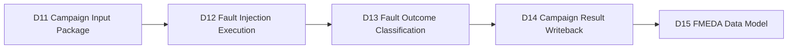
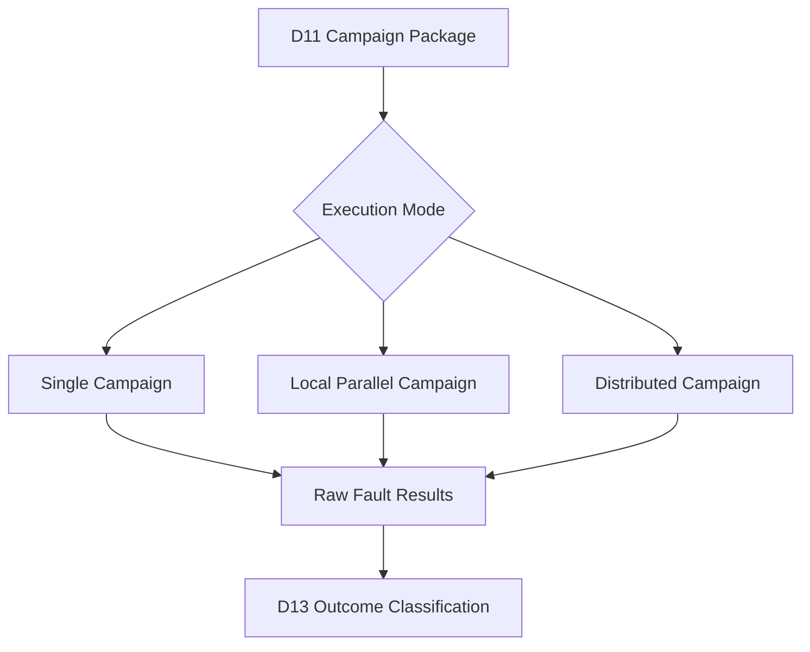
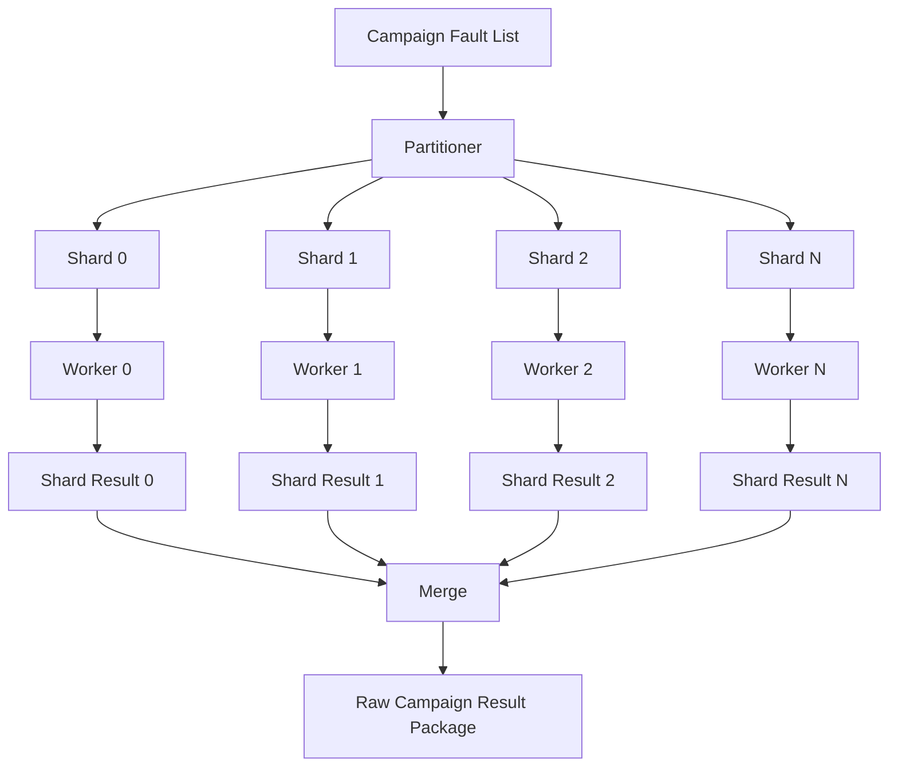
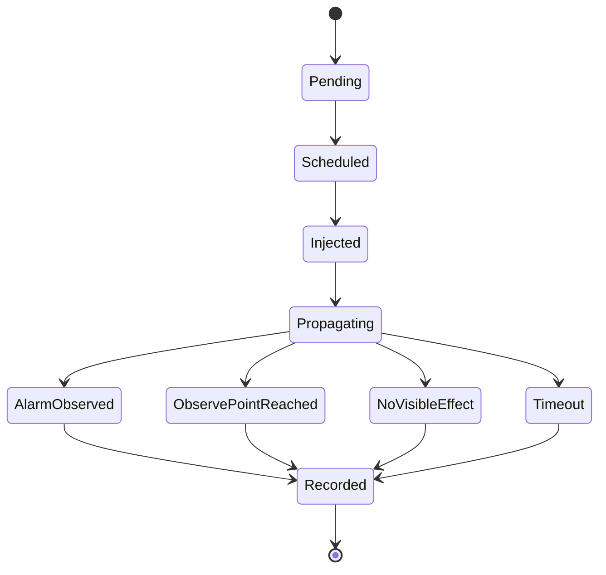
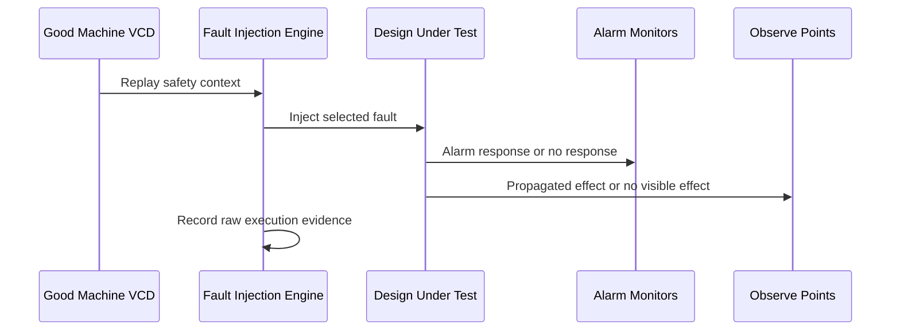

# Automotive Safe-IC Practice 12: Fault Injection Execution — Single, Distributed, and Parallel Campaigns

Author: Darren H. Chen  
Direction: Automotive chip functional safety analysis and fault injection practice  
Demo: D12_fault_injection_execution_single_distributed_parallel  
Tags: ISO 26262, Functional Safety, Fault Injection, Fault Campaign, Safety Verification, VCD, FTTI, Alarm, Observe Point, Diagnostic Coverage, FMEDA, Safe-IC

---

## 1. From a prepared campaign package to a running fault campaign

D11 built the fault campaign input package. It organized the design filelist, clock definition, VCD list, good-machine waveform, campaign-ready fault list, alarm list, observe point specification, FTTI boundary plan, and campaign initialization files into a reviewable package.

D12 is the point where the prepared package becomes an execution flow.

A fault campaign is not simply a loop over faults. It is an execution system that must answer several questions at the same time:

```text
Which fault should be injected?
When should it be injected?
Which VCD context should be used?
Which design scope should receive the fault?
Which alarm signals should be monitored?
Which observe points define unsafe propagation?
How long should the injected fault be observed?
How should results be written back for later classification?
How can the run be restarted, partitioned, and audited?
```

D12 therefore focuses on execution semantics, not on metric closure. D13 will classify outcomes. D14 will write campaign results back into final metric validation. D12 is the operational bridge between a fault campaign setup and a set of raw execution results.



**Figure 1. D12 is the execution layer between campaign setup and outcome classification.**

---

## 2. The exact role of D12 in the Safe-IC flow

The full series uses a 20-stage core flow. D12 is the twelfth stage and corresponds to:

```text
D12 Fault Injection Execution: single / distributed / parallel campaign execution
```

It comes after:

```text
D08 Fault List Generation
D09 Simulation Safety Context
D10 Alarm List and Observe Point Boundary
D11 Fault Campaign Setup
```

It feeds:

```text
D13 Fault Outcome Classification
D14 Fault Campaign Result Writeback and Final Metrics
D17 Diagnostic Coverage Closure
D19 Evidence Traceability
D20 End-to-End Mini Flow
```

D12 should not redefine the campaign scope. It should execute the scope that D11 prepared. If D12 quietly changes the fault list, VCD list, alarm list, observe points, timing window, or design filelist, the campaign becomes difficult to review.

A disciplined D12 flow treats the D11 package as a signed execution contract.

---

## 3. Fault injection is controlled perturbation, not random chaos

The phrase “fault injection” can be misleading. In an engineering-grade safety verification flow, the fault is not injected randomly without context.

A campaign fault has structure:

```text
fault_id
fault_type
fault_site
fault_value
injection_time
injection_duration
simulation_context
alarm_monitor_set
observe_point_set
FTTI_window
expected_safety_boundary
```

The execution engine uses these fields to replay the good-machine context, perturb one location at a defined time, observe alarm and state behavior, and record the raw result.

The fault may model:

```text
stuck-at-0
stuck-at-1
transient bit flip
temporary logic upset
state element corruption
net-level perturbation
port-level perturbation
user-defined cell-level defect
```

D12 does not decide whether the fault is ultimately detected, safe, unsafe, or unresolved. It collects the evidence that D13 will use to classify the outcome.

---

## 4. Fault, error, failure, alarm, and outcome

Before discussing execution modes, the vocabulary must be precise.

| Term | Meaning in D12 |
|---|---|
| Fault | Injected defect or perturbation at a node, port, state element, memory bit, or modeled defect site. |
| Error | Incorrect internal value caused by a fault. It may or may not propagate. |
| Failure | Externally relevant malfunction or violation of the safety boundary. |
| Alarm | Signal asserted by a safety mechanism to indicate detected abnormal behavior. |
| Observe point | Signal or state boundary used to check whether fault effects propagate into relevant behavior. |
| Outcome | Classification result produced later, usually detected, safe, unsafe, unresolved, or potential. |

A fault does not automatically cause a failure. A fault may be masked, may occur during an inactive window, may be detected by an alarm, or may propagate silently. D12 must preserve enough trace information for those distinctions.

---

## 5. The D12 input contract inherited from D11

D12 begins with the D11 output package.

A practical D12 package should include:

```text
campaign_inputs/design_filelist.absolute.f
campaign_inputs/clock.clk
campaign_inputs/vcd_list.f
campaign_inputs/good_machine.vcd
campaign_inputs/campaign_fault_list.flt
campaign_inputs/alarm_list.alarm
campaign_inputs/observe_points.obs
campaign_inputs/ftti_boundary_plan.csv
campaign_inputs/campaign_observation_contract.csv
campaign_inputs/safety_context.json

campaign_configs/fault_campaign_single.ini
campaign_configs/fault_campaign_distributed.ini
campaign_configs/fault_campaign_vcd_filter.ini

campaign_commands/run_campaign_single.csh
campaign_commands/run_campaign_distributed.csh
```

The important design principle is that D12 should execute from resolved files, not from ambiguous upstream references.

For example, a filelist used by D12 should avoid relative paths that only work from a previous demo directory. D11 should produce an absolute or run-root-resolved filelist. D12 then consumes that filelist as-is.

---

## 6. The execution contract

The campaign execution contract can be summarized as:

```text
same design boundary
same VCD context
same fault list
same alarm list
same observe points
same FTTI policy
same execution identity
```

This contract matters because fault injection is sensitive to small changes.

Changing a VCD can change activity windows. Changing observe points can change unsafe propagation detection. Changing alarm signals can change detected-fault counts. Changing FTTI can shift a fault from unresolved to detected or unsafe.

D12 should therefore write an execution identity file before the campaign starts:

```json
{
  "demo": "D12_fault_injection_execution_single_distributed_parallel",
  "campaign_package": "D11_fault_campaign_setup_input_package",
  "execution_mode": "single",
  "design_filelist": "outputs/campaign_inputs/design_filelist.absolute.f",
  "vcd_list": "outputs/campaign_inputs/vcd_list.f",
  "fault_list": "outputs/campaign_inputs/campaign_fault_list.flt",
  "alarm_list": "outputs/campaign_inputs/alarm_list.alarm",
  "observe_points": "outputs/campaign_inputs/observe_points.obs",
  "timing_policy": "outputs/campaign_inputs/ftti_boundary_plan.csv"
}
```

The exact paths in a public demo can be relative to the demo root. A private local execution environment can map them to actual installed tools.

---

## 7. Three execution modes: single, distributed, and parallel

D12 covers three execution styles.

```text
single campaign mode
    one campaign manager
    small fault subset or debug-oriented run
    easier to inspect

parallel local mode
    one machine, multiple workers
    faster than single mode
    useful for medium fault sets

distributed campaign mode
    multiple workers across machines or queues
    intended for large campaigns
    requires stronger job tracking and restart policy
```

These modes are not three different safety methodologies. They are three ways to execute the same campaign contract.



**Figure 2. Different execution modes should preserve the same campaign semantics.**

---

## 8. Single campaign execution

Single campaign execution is the simplest execution model.

It is suitable when:

```text
the fault list is small
the design is small
the VCD is short
the campaign is being debugged
a new alarm or observe point rule is being validated
a new fault-list format is being tested
```

A single execution flow is easier to reason about because the artifacts are linear:

```text
one command
one log
one output directory
one fault-result report
one status file
```

A neutral command wrapper may look like this:

```csh
#!/bin/csh -f

if ( ! $?SAFEIC_FAULT_ENGINE ) then
    echo "[ERROR] SAFEIC_FAULT_ENGINE is not set."
    exit 1
endif

$SAFEIC_FAULT_ENGINE \
    --mode single_campaign \
    --config outputs/campaign_configs/fault_campaign_single.ini \
    --output outputs/native/single_campaign \
    |& tee logs/d12_single_campaign.console.log

set rc = $status
echo $rc > outputs/status/single_campaign.exit_code
exit $rc
```

The command name and options are intentionally abstracted. The article cares about the execution model, not about exposing local tool binaries.

---

## 9. Distributed campaign execution

Distributed execution is used when the campaign is too large for a single process.

A large campaign may contain:

```text
many fault sites
multiple fault types per site
multiple injection windows
multiple VCD files
long FTTI windows
large designs with many state elements
```

Distributed execution splits the campaign into smaller jobs.



**Figure 3. Distributed fault campaign execution partitions the same campaign into multiple result shards.**

The important point is that distributed execution should not change classification semantics. It only changes how computation is scheduled.

---

## 10. Parallel local execution

Parallel local execution is between single and fully distributed execution.

It uses multiple local workers, often on the same server.

Typical controls include:

```text
max_workers
max_concurrent_faults
worker_memory_limit
worker_timeout
shard_size
retry_count
```

Parallel execution is useful for demos because it demonstrates scaling behavior without requiring a compute farm.

However, parallel execution introduces new risks:

```text
race conditions in temporary directories
non-deterministic shard ordering
incomplete result merging
worker timeout ambiguity
partial failure handling
```

Therefore, D12 should generate a run matrix and a worker manifest even for local parallel mode.

---

## 11. Campaign partitioning strategy

A campaign can be partitioned in several ways.

| Partitioning key | Benefit | Risk |
|---|---|---|
| By fault ID range | Simple, deterministic | May create imbalanced runtime if some faults are expensive |
| By fault type | Easy to separate permanent and transient campaign behavior | May hide cross-type scheduling bottlenecks |
| By endpoint / cone | Aligns with structure and FMEDA evidence | Requires good structural metadata |
| By VCD | Natural when multiple safety contexts exist | Some VCDs may dominate runtime |
| By injection window | Useful for transient faults | Can fragment result merging |

For D12, deterministic partitioning is usually better than clever partitioning. A reviewer should be able to reproduce which fault went to which shard.

A good shard manifest includes:

```text
shard_id
fault_id_start
fault_id_end
fault_count
fault_type_set
vcd_context
estimated_cost
worker_status
result_file
```

---

## 12. Fault execution state machine

Each fault follows a conceptual state machine.



**Figure 4. D12 records raw execution events; D13 performs formal outcome classification.**

D12 should not over-collapse these states too early. For example, a fault that triggers an alarm late may need FTTI analysis before it receives detected credit. A fault with no visible effect may be safe or unactivated, depending on activity and observation rules.

---

## 13. The anatomy of an injected fault

A campaign-ready fault can be represented as:

```csv
fault_id,fault_kind,fault_site,fault_value,injection_time,duration,vcd_id,observe_group,alarm_group
F000001,permanent_sa0,top.u0.state_q[3],0,100,full,VCD0,OBS_STATE,ALARM_MAIN
F000002,permanent_sa1,top.u0.valid_o,1,120,full,VCD0,OBS_PROTOCOL,ALARM_MAIN
F000003,transient_flip,top.u0.counter_q[0],toggle,160,1cycle,VCD0,OBS_STATE,ALARM_MAIN
```

The engine needs enough information to:

```text
locate the node
force or perturb its value
choose the injection time
restore or maintain the perturbation
monitor alarms
monitor observe points
record event timing
```

For permanent faults, the fault may remain active after injection. For transient faults, the fault may last one cycle, one time unit, or a specified transient window depending on the campaign setup.

---

## 14. Permanent and transient execution semantics

Permanent and transient faults differ in both physics and simulation semantics.

Permanent fault execution:

```text
inject once
hold the faulty value
observe until FTTI or simulation end
record alarm and observe behavior
```

Transient fault execution:

```text
inject at a specific time
apply for a short duration
release the node
observe propagation and recovery
record alarm and observe behavior
```

A permanent stuck-at fault may model a hard defect. A transient fault may model a soft error, radiation-induced upset, temporary glitch, or short-lived state corruption.

This distinction matters because campaign runtime and classification can differ dramatically.

---

## 15. VCD replay and the good-machine reference

D12 does not invent stimulus. It reuses the simulation safety context built in D09 and packaged in D11.

The VCD supplies the good-machine activity:

```text
clock activity
reset behavior
state element toggles
control signal transitions
protocol handshakes
alarm baseline
observe point baseline
```

The execution engine compares the faulted behavior against the good-machine reference.



**Figure 5. D12 uses the good-machine context to drive and compare faulted execution.**

The richer the VCD, the more meaningful the campaign. Poor stimulus can cause unresolved faults or misleadingly safe-looking behavior.

---

## 16. FTTI and execution timing

FTTI means Fault Tolerant Time Interval. It defines how much time the system has to detect or control a fault before the fault becomes unacceptable.

D12 uses FTTI as an execution boundary:

```text
fault injected at T0
alarm observed at Ta
unsafe propagation observed at Tu
observation ends at T0 + FTTI
```

A simple timing model:

```text
if alarm occurs before or within FTTI:
    D13 may classify as detected

if unsafe observe point deviation occurs before alarm:
    D13 may classify as unsafe

if neither alarm nor unsafe propagation occurs:
    D13 may classify as safe or unresolved depending on activity
```

D12 should preserve raw timestamps. D13 should apply the classification rule.

---

## 17. Alarm monitors and observe monitors during execution

Alarm monitors and observe monitors are not the same.

```text
Alarm monitor:
    Did a safety mechanism report the fault?

Observe monitor:
    Did the fault effect reach a safety-relevant boundary?
```

A fault may:

```text
trigger alarm only
reach observe point only
trigger alarm and reach observe point
trigger neither
produce unknown or X propagation
```

D12 should record these as raw facts. D13 can then classify them.

A raw execution row may look like:

```csv
fault_id,alarm_seen,alarm_time,observe_deviation,observe_time,completed,status_hint
F000001,1,135,0,,1,alarm_recorded
F000002,0,,1,142,1,observe_deviation_recorded
F000003,0,,0,,1,no_visible_effect
```

The field `status_hint` is not the final outcome.

---

## 18. Raw execution results versus final outcomes

D12 output is raw campaign evidence.

D13 output is classified outcome evidence.

Do not confuse the two.

D12 may produce:

```text
fault execution status
alarm event time
observe event time
simulation timeout
worker exit code
trace availability
shard completion state
```

D13 will use those facts to produce:

```text
detected
safe
unsafe
unresolved
potential
not simulated
```

This separation improves auditability. If a classification rule changes, the raw D12 evidence can be reinterpreted without rerunning every fault.

---

## 19. Result shard design

Distributed and parallel runs produce shards.

A shard result should include:

```text
shard_id
worker_id
fault_count
completed_fault_count
failed_fault_count
start_time
end_time
engine_exit_code
raw_result_file
worker_log
status_file
```

The merge step should not discard shard-level metadata. If one shard fails, the campaign should not silently pass.

D12 should generate:

```text
outputs/execution_status/shard_status.csv
outputs/execution_status/worker_status.csv
outputs/raw_fault_results/*.csv
outputs/raw_fault_results/merged_fault_execution.csv
outputs/d12_quality_gate.csv
```

This lets D13 start from a reliable execution inventory.

---

## 20. Restart and resume behavior

Large fault campaigns often cannot be completed in one uninterrupted run.

A robust D12 flow should support:

```text
resume completed shards
rerun failed shards
skip already completed faults
preserve old logs with timestamps
write a new execution identity per attempt
merge only validated results
```

The restart rule should be explicit:

```text
same campaign identity + same shard identity + completed status
    -> reuse result

same campaign identity + failed status
    -> rerun if retry budget remains

changed campaign identity
    -> invalidate prior result unless explicitly imported
```

Silent reuse of stale results is dangerous. It can make a campaign appear more complete than it really is.

---

## 21. Save and restore

Some fault campaign engines support save-and-restore style acceleration. The idea is simple:

```text
run good-machine context to a checkpoint
save design state
restore that state for many fault injections
avoid replaying the same prefix repeatedly
```

This is useful when:

```text
many faults share the same injection window
reset and initialization are long
VCD prefix replay dominates runtime
```

The engineering risk is that save points become part of the evidence chain. A checkpoint must correspond to the same design, VCD, configuration, and tool version.

A checkpoint manifest should include:

```text
checkpoint_id
design_hash
vcd_hash
config_hash
save_time
compatible_fault_window
producer_run_id
```

D12 can prepare checkpoint metadata even if the public demo does not run a real save/restore backend.

---

## 22. Resource planning

Fault injection execution consumes CPU, memory, disk, and licenses.

A D12 resource plan should estimate:

```text
fault_count
vcd_size
expected runtime per fault
max concurrent workers
memory per worker
log volume
result volume
license tokens
queue policy
```

A simple resource table:

| Mode | Fault volume | Typical use | Review focus |
|---|---:|---|---|
| Single | 1 to thousands | Debug and smoke campaign | Correct setup and traceability |
| Local parallel | thousands to tens of thousands | Medium campaign | Worker isolation and merge correctness |
| Distributed | tens of thousands or more | Large campaign | Job control, restart, shard completeness |

D12 should make scaling visible instead of hiding it inside a command line.

---

## 23. License and queue awareness

Real fault campaigns often run in environments with shared compute resources and limited tool licenses.

A practical execution wrapper should not blindly launch maximum parallelism.

It should support:

```text
max_workers
license_token_limit
queue_name
job_timeout
retry_limit
backoff_policy
```

Even when a demo uses a small design, these fields should appear in the run matrix because they are essential in real projects.

Example run matrix:

```csv
run_id,mode,max_workers,queue,license_limit,retry_limit,status
D12_SINGLE, single,1,local,1,0,ready
D12_PARALLEL,parallel,4,local,2,1,ready
D12_DIST,distributed,16,compute,4,2,ready
```

---

## 24. Determinism and reproducibility

A fault campaign is expensive. Rerunning it should produce comparable results when the same campaign identity is used.

D12 should preserve:

```text
input file hashes
fault list hash
VCD hash
alarm list hash
observe point hash
config hash
engine wrapper version
execution mode
random seed if sampling is used
partitioning rule
```

This allows reviewers to distinguish:

```text
same campaign rerun
different execution mode with same semantics
changed campaign input
changed classification rule
changed tool environment
```

A campaign that cannot be reproduced cannot be trusted as safety evidence.

---

## 25. Handling suppressed, warning, and error messages

D12 should classify logs carefully.

Not every message containing the word `Error` is a tool execution error. In functional safety terminology, expressions such as permanent error, transient error, or error propagation may describe modeled behavior.

A robust diagnostic collector should distinguish:

```text
fatal tool errors
HDL parsing failures
missing file errors
license failures
worker timeout
known benign warnings
safety terminology containing the word error
```

The quality gate should fail on real execution failures:

```text
engine exit code nonzero
missing result shard
empty raw result when faults were scheduled
missing alarm/observe input
failed merge
missing campaign identity
```

It should not fail simply because a known diagnostic warning appears, provided the warning is classified and justified.

---

## 26. D12 quality gates

D12 should generate machine-readable quality gates.

Suggested checks:

```csv
check,status,details
campaign_package_exists,PASS,D11 handoff found
design_filelist_resolved,PASS,absolute filelist available
vcd_list_exists,PASS,good-machine VCD list available
fault_list_exists,PASS,campaign fault list available
alarm_list_exists,PASS,alarm list available
observe_points_exists,PASS,observe point file available
execution_identity_written,PASS,run identity generated
single_command_generated,PASS,reviewable command generated
distributed_command_generated,PASS,reviewable command generated
raw_result_manifest_exists,PASS,raw result manifest available
failed_shards,FAIL,one or more shard failures
```

In preflight-only mode, command generation may pass while actual execution is skipped. In real execution mode, missing or failed shard results must fail the gate.

---

## 27. Raw campaign result schema

D12 should output a raw result table suitable for D13.

A recommended schema:

```csv
fault_id,shard_id,worker_id,fault_type,fault_site,vcd_id,injection_time,alarm_seen,alarm_time,observe_deviation,observe_time,simulation_completed,timeout,raw_status,result_artifact
```

This table avoids premature classification.

D13 can apply classification rules such as:

```text
alarm_seen within FTTI -> detected candidate
observe_deviation before alarm -> unsafe candidate
no deviation and no alarm -> safe or inactive candidate
incomplete simulation -> unresolved candidate
X propagation to observe point -> potential candidate depending on policy
```

The raw result schema is the interface between execution and outcome logic.

---

## 28. Campaign result merging

Merging is not just concatenating files.

A correct merge should check:

```text
all expected shards exist
all expected fault IDs are present
no duplicate fault result unless explicitly retried
retry result replaces failed attempt
worker exit codes are recorded
result row count matches scheduled fault count
```

A useful merge summary:

```csv
metric,value
scheduled_faults,102
completed_faults,102
failed_faults,0
result_shards,4
missing_shards,0
duplicate_results,0
merge_status,PASS
```

This summary becomes the first input to D13.

---

## 29. Execution evidence index

D12 should register every important file.

Example evidence index:

```csv
artifact_id,artifact_type,path,producer,consumer
D12_RUN_ID,json,outputs/execution_identity/d12_run_identity.json,D12,D13
D12_SINGLE_CMD,csh,outputs/commands/run_single_campaign.csh,D12,review
D12_SHARD_STATUS,csv,outputs/execution_status/shard_status.csv,D12,D13
D12_RAW_RESULTS,csv,outputs/raw_fault_results/merged_fault_execution.csv,D12,D13
D12_QUALITY,csv,outputs/d12_quality_gate.csv,D12,review
```

The evidence index is not paperwork. It is how later stages know which result belongs to which execution identity.

---

## 30. Demo structure

A practical D12 demo can use the following structure:

```text
D12_fault_injection_execution_single_distributed_parallel/
├── README.md
├── manifest.yaml
├── scripts/
│   ├── run_demo.csh
│   └── run_demo.sh
├── tools/
│   ├── build_d12_execution_plan.py
│   ├── run_or_collect_campaign.py
│   ├── merge_raw_fault_results.py
│   └── diagnose_campaign_logs.py
├── inputs/
│   └── from_D11/
├── outputs/
│   ├── campaign_inputs/
│   ├── execution_identity/
│   ├── execution_plan/
│   ├── commands/
│   ├── raw_fault_results/
│   ├── execution_status/
│   ├── handoff/
│   └── registry/
└── logs/
```

The demo may support two modes:

```text
plan-only mode:
    generate execution plan and command scripts
    do not call a real fault engine

real-execution mode:
    call the configured fault campaign engine
    collect raw execution results
    fail quality gate if execution fails
```

This preserves public reproducibility while allowing private environments to connect to actual tools.

---

## 31. Neutral execution wrapper

The public script can use a neutral variable:

```csh
setenv SAFEIC_FAULT_ENGINE /path/to/fault_campaign_engine
```

The generated command can be reviewable:

```csh
#!/bin/csh -f

set ROOT = `cd "$0:h/../.." && pwd`
cd "$ROOT"

if ( ! $?SAFEIC_FAULT_ENGINE ) then
    echo "[ERROR] SAFEIC_FAULT_ENGINE is not set."
    exit 1
endif

$SAFEIC_FAULT_ENGINE \
    --mode single_campaign \
    --config outputs/campaign_configs/fault_campaign_single.ini \
    --output outputs/native/single_campaign \
    |& tee logs/d12_single_campaign.console.log

set rc = $status
echo $rc > outputs/execution_status/single_campaign.exit_code
exit $rc
```

The command is an interface pattern. The real local environment decides which vendor tool or internal wrapper implements it.

---

## 32. Single, parallel, and distributed outputs should converge

If the same campaign is executed in different modes, the merged result should be semantically equivalent.

D12 can support a convergence check:

```text
same fault IDs
same raw result categories
same alarm event visibility
same observe event visibility
same unresolved count
same failed-worker count
```

A useful comparison table:

```csv
metric,single,parallel,distributed,status
scheduled_faults,102,102,102,PASS
completed_faults,102,102,102,PASS
failed_faults,0,0,0,PASS
raw_alarm_seen_count,18,18,18,PASS
raw_observe_deviation_count,7,7,7,PASS
```

This is especially useful during flow bring-up. It proves that scaling the campaign did not change the meaning of the campaign.

---

## 33. Common failure modes in campaign execution

D12 should expect failures and classify them.

Common setup failures:

```text
missing RTL file
bad filelist path
bad clock definition
VCD signal mismatch
fault site not found
alarm signal not found
observe point not found
unsupported fault syntax
```

Common execution failures:

```text
worker crash
license checkout failure
queue submission failure
worker timeout
memory limit exceeded
corrupted VCD
partial result write
```

Common merge failures:

```text
missing shard
stale shard
inconsistent run identity
duplicate fault result
row count mismatch
```

A mature D12 demo should make these categories visible even if the sample design is small.

---

## 34. D12 handoff to D13

D13 needs a clean package:

```text
raw fault execution table
shard status table
alarm event timing
observe event timing
FTTI policy
campaign observation contract
execution identity
quality gate result
```

D12 should write:

```text
outputs/d12_handoff_to_d13.csv
```

Example:

```csv
artifact,role,path,required_by
merged_fault_execution,raw_result,outputs/raw_fault_results/merged_fault_execution.csv,D13
campaign_observation_contract,classification_policy,outputs/campaign_inputs/campaign_observation_contract.csv,D13
ftti_boundary_plan,timing_policy,outputs/campaign_inputs/ftti_boundary_plan.csv,D13
execution_identity,traceability,outputs/execution_identity/d12_run_identity.json,D13
```

D13 should not need to search the D12 directory manually.

---

## 35. D12 handoff to D14

D14 needs campaign result writeback material.

D12 should prepare:

```text
raw result database session candidate
campaign execution manifest
fault result merge summary
status of every shard
log diagnostics summary
```

D14 will not necessarily use every raw event, but it needs enough evidence to connect final metrics to the actual campaign execution.

A D14 handoff file can contain:

```csv
artifact,role,path
execution_manifest,campaign_evidence,outputs/execution_identity/d12_run_identity.json
raw_results,writeback_source,outputs/raw_fault_results/merged_fault_execution.csv
merge_summary,completeness_check,outputs/raw_fault_results/merge_summary.csv
shard_status,execution_integrity,outputs/execution_status/shard_status.csv
```

---

## 36. How D12 stays distinct from D13 and D14

The boundary is important.

```text
D12 executes faults and records raw evidence.
D13 classifies fault outcomes.
D14 writes classified results back into final metric calculation.
```

If D12 tries to do everything, the flow becomes hard to audit.

D12 may record:

```text
alarm seen
observe point deviation seen
simulation timeout
worker completed
fault not simulated
```

D13 decides:

```text
detected
safe
unsafe
unresolved
potential
```

D14 calculates or validates:

```text
final DC
SPFM
LFM
residual FIT
FMEDA export readiness
```

This separation is what makes the flow scalable and explainable.

---

## 37. Summary

D12 is where the campaign package becomes a running safety verification process.

It is not merely a shell script. It is an execution architecture for:

```text
fault scheduling
fault injection
VCD replay
alarm monitoring
observe point monitoring
FTTI-bounded evidence capture
parallel and distributed job control
result shard collection
raw result merging
execution diagnostics
handoff to classification
```

A good D12 flow keeps four principles:

```text
same campaign contract across execution modes
raw execution evidence separated from final outcome classification
deterministic shard and result traceability
quality gates that fail on real execution integrity problems
```

With D12 complete, the series is ready to enter D13: fault outcome classification. That next stage will convert raw campaign evidence into detected, safe, unsafe, unresolved, and potential fault categories, which will later feed final diagnostic coverage and FMEDA evidence.
