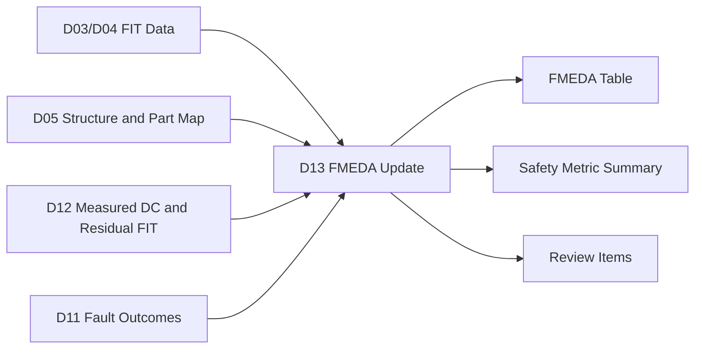
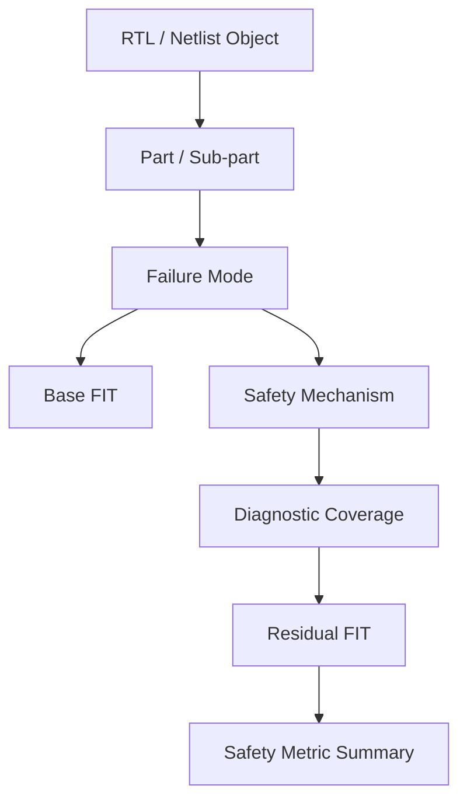
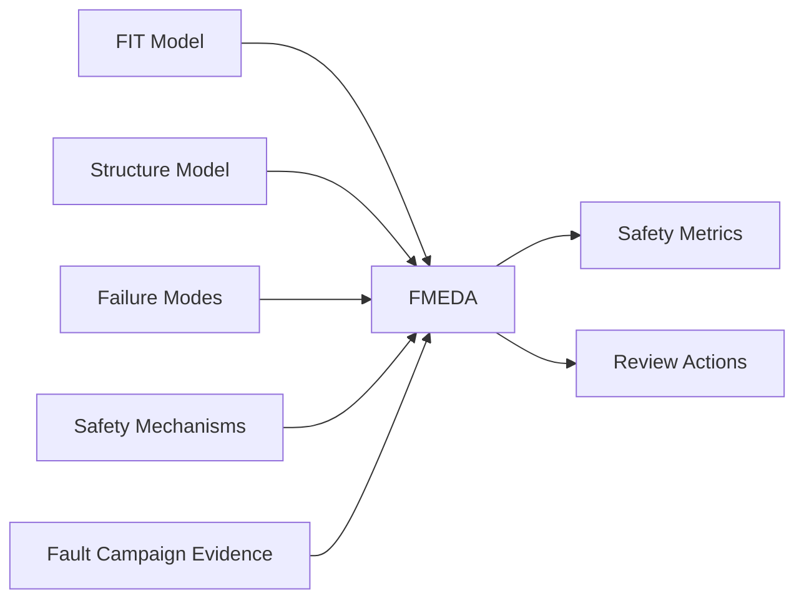
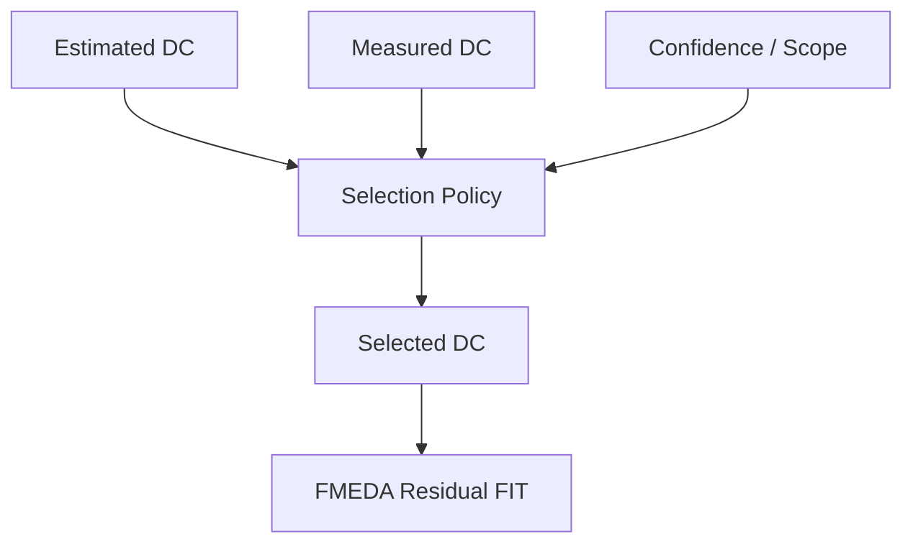
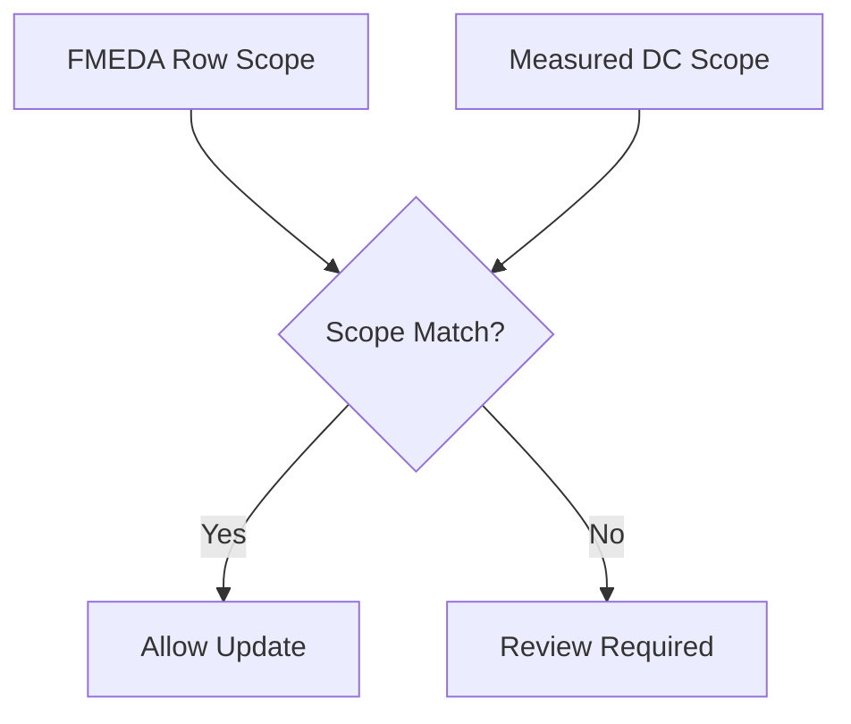
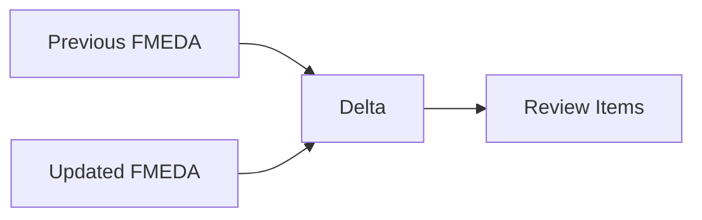
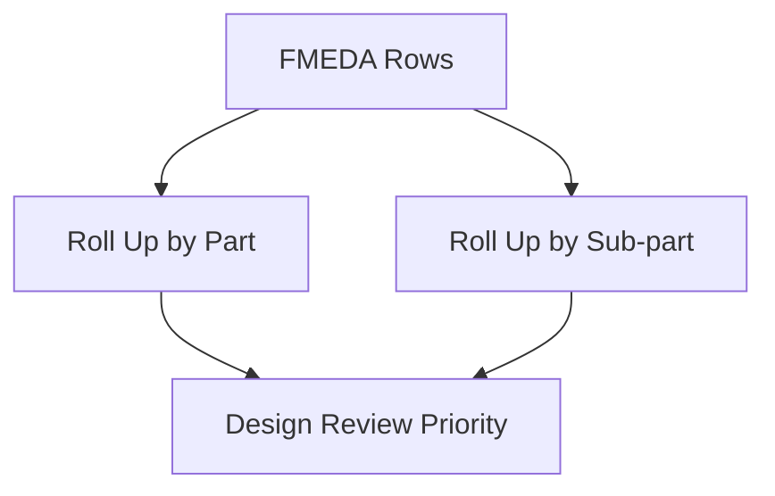
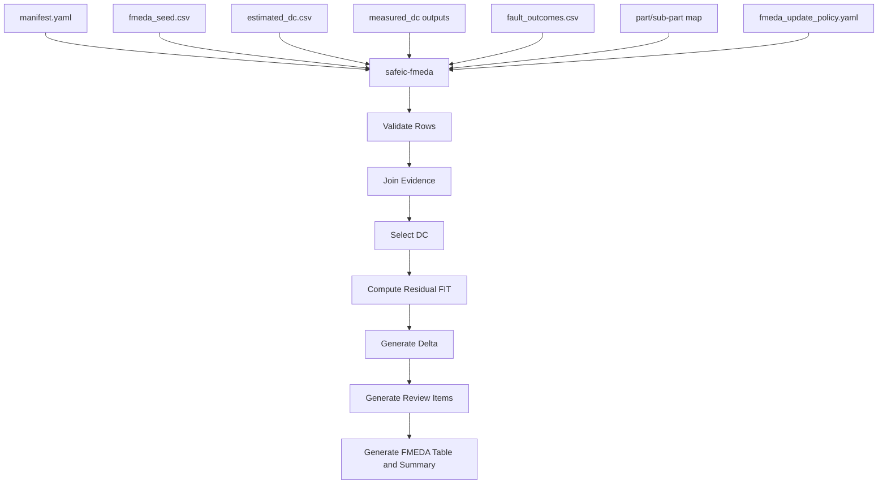
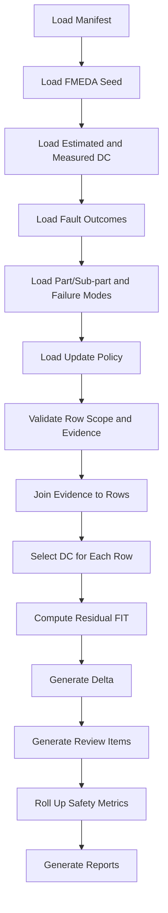
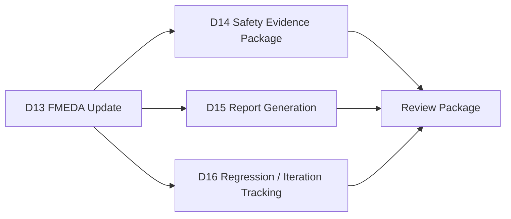

# [Automotive Safe-IC Practice 13] FMEDA Update: From Measured DC and Residual FIT to Traceable Safety Tables

**Author**: Darren H. Chen  
**Direction**: Automotive Chip Functional Safety Analysis and Fault Injection Practice  
**Demo**: D13_fmeda_update  
**Tags**: Automotive Chip, Functional Safety, FMEDA, FIT, Diagnostic Coverage, Measured DC, Residual FIT, Fault Injection, Failure Mode, Safety Mechanism, Safety Metrics

---

## 1. Why This Article Matters

In the previous article, we computed measured diagnostic coverage from classified fault campaign outcomes.

D12 produced evidence such as:

```text
measured_dc_overall.csv
measured_dc_by_endpoint.csv
measured_dc_by_failure_mode.csv
measured_dc_by_safety_mechanism.csv
measured_dc_by_part.csv
estimated_vs_measured_dc.csv
measured_residual_fit.csv
measurement_quality.csv
```

These results are useful, but they are still not the final safety table.

The next question is:

> How do we update FMEDA rows with measured DC, residual FIT, evidence links, and review status?

The thirteenth demo in this repository is:

```text
D13_fmeda_update
```

The generic tool introduced in this article is:

```text
safeic-fmeda
```

The purpose of `safeic-fmeda` is to convert design-level safety evidence into a traceable FMEDA-style table using:

```text
part/sub-part mapping
failure mode mapping
base FIT contribution
estimated DC
measured DC
measured residual FIT
fault campaign evidence
safety mechanism mapping
review policy
```

and generate:

```text
fmeda_table.csv
fmeda_delta.csv
fmeda_review_items.csv
safety_metric_summary.csv
fmeda_summary.md
```

The central idea is:

> FMEDA update is not a spreadsheet formatting step. It is the step where structural design objects, failure modes, FIT contribution, diagnostic coverage, residual FIT, and validation evidence are joined into a reviewable safety argument.

---

## 2. Where D13 Fits in the Flow

D13 sits after measured DC computation.



**Figure 1. D13 combines FIT, structure, measured DC, residual FIT, and evidence links into an FMEDA-ready table.**

Earlier demos answered:

```text
What is the base failure-rate contribution?
What is the structure?
What is the estimated DC?
What was measured by fault injection?
What residual FIT remains?
```

D13 answers:

```text
How should the FMEDA rows be updated?
Which rows are evidence-backed?
Which rows remain assumption-based?
Which rows require review?
Which residual FIT items dominate the safety metric?
```

This is the point where the workflow starts looking like a safety engineering deliverable.

---

## 3. What Is FMEDA in This Demo?

In this demo series, FMEDA is treated as a structured table that connects:

```text
design part
sub-part
failure mode
base FIT
safety mechanism
diagnostic coverage
residual FIT
evidence source
review status
```

A simplified FMEDA row may look like:

```csv
part,subpart,failure_mode,base_fit,safety_mechanism,dc,residual_fit,evidence,review_status
PART_COUNTER,SUBPART_COUNTER_STATE,FM_DATA_CORRUPTION,0.064,endpoint_parity,0.90,0.0064,D12 measured DC,reviewed
```

FMEDA is useful because it organizes safety reasoning at a level that can be reviewed.

It connects low-level implementation evidence to higher-level safety metrics.



**Figure 2. FMEDA joins implementation objects, failure modes, FIT, mechanisms, coverage, and residual risk.**

The D13 goal is not to replace a certified safety process.

The goal is to build an engineering-grade, reproducible bridge from fault injection evidence to FMEDA-style tables.

---

## 4. FMEDA Is an Integration Layer

FMEDA is not the first place where safety analysis happens.

It is an integration layer.

It integrates:

```text
failure-rate modeling
structural decomposition
failure mode analysis
diagnostic coverage estimation
fault campaign measurement
residual risk calculation
engineering review decisions
```



**Figure 3. FMEDA integrates multiple evidence sources into a safety review table.**

This is why an FMEDA generator must not be a pure spreadsheet writer.

It must validate whether the referenced evidence exists and whether the row is internally consistent.

---

## 5. Core FMEDA Row Fields

A practical FMEDA row should contain at least:

```text
row_id
part_id
part_name
subpart_id
subpart_name
design_object
failure_mode
failure_effect
base_fit
safety_mechanism
estimated_dc
measured_dc
selected_dc
residual_fit
evidence_source
evidence_id
confidence
review_status
review_comment
```

Example:

```csv
row_id,part,subpart,failure_mode,base_fit,safety_mechanism,selected_dc,residual_fit,evidence_source,review_status
R001,PART_COUNTER,SUBPART_COUNTER_STATE,FM_DATA_CORRUPTION,0.064,endpoint_parity,0.90,0.0064,D12_measured_dc,review_required
```

Why both estimated and measured DC?

Because the FMEDA row must explain whether the current DC is based on:

```text
engineering assumption
library assumption
structural calculation
fault campaign measurement
reviewed measured update
```

A row with measured evidence is stronger than a row based only on assumption, but only when the measured evidence has adequate scope and confidence.

---

## 6. Estimated DC, Measured DC, and Selected DC

D13 should not blindly use measured DC.

Instead, it should maintain three values:

```text
estimated_dc
measured_dc
selected_dc
```

### 6.1 Estimated DC

Estimated DC comes from D06 or safety mechanism assumptions.

### 6.2 Measured DC

Measured DC comes from D12 fault campaign evidence.

### 6.3 Selected DC

Selected DC is the value currently used in FMEDA after applying update policy and review rules.

Example:

```csv
failure_mode,estimated_dc,measured_dc,confidence,selected_dc,selection_reason
FM_DATA_CORRUPTION,0.90,1.00,LOW,0.90,keep estimated due to low sample size
FM_ALARM_NOT_ASSERTED,0.85,0.00,HIGH,0.00,use measured because measured lower than estimated
```



**Figure 4. FMEDA should distinguish estimated, measured, and selected DC.**

This separation prevents overclaiming and makes review decisions traceable.

---

## 7. Residual FIT Calculation

The simplest residual FIT formula is:

```text
residual_fit = base_fit × (1 - selected_dc)
```

Example:

```text
base_fit = 0.064
selected_dc = 0.90

residual_fit = 0.064 × (1 - 0.90)
             = 0.0064
```

For a row:

```csv
row_id,base_fit,selected_dc,residual_fit
R001,0.064,0.90,0.0064
```

This is the basic quantitative connection between diagnostic coverage and remaining risk.

However, the selected DC must match the row scope.

Do not use:

```text
path-level measured DC
```

to update:

```text
endpoint-level FMEDA row
```

unless the scope mapping is explicit.

D13 should validate scope alignment.

---

## 8. Scope Alignment

FMEDA rows may be organized by:

```text
part
sub-part
design object
endpoint
failure mode
safety mechanism
```

Measured DC may be computed by:

```text
endpoint
failure mode
safety mechanism
part
campaign group
```

The update is valid only when the scopes are aligned.

Example valid update:

```text
FMEDA row:
  endpoint = toy_counter.count
  failure_mode = FM_DATA_CORRUPTION

Measured DC:
  group_type = endpoint
  group_id = toy_counter.count
  failure_mode = FM_DATA_CORRUPTION
```

Example risky update:

```text
FMEDA row:
  failure_mode = FM_ALARM_NOT_ASSERTED

Measured DC:
  group_type = overall
  group_id = overall
```

Using overall measured DC for a specific alarm failure mode may hide weak diagnostic-path behavior.



**Figure 5. FMEDA update should check scope alignment before applying measured DC.**

D13 should flag scope mismatch instead of silently updating rows.

---

## 9. Evidence Source Tracking

Each FMEDA row should reference its evidence.

Evidence sources may include:

```text
estimated_dc.csv
measured_dc_by_endpoint.csv
measured_dc_by_failure_mode.csv
fault_outcomes.csv
safety_mechanism_library.yaml
part_subpart_map.yaml
manual_review_note
supplier_safety_manual
```

Example:

```csv
row_id,evidence_source,evidence_id,evidence_file,confidence
R001,D12_MEASURED_DC,endpoint:toy_counter.count,measured_dc_by_endpoint.csv,LOW
R002,D06_ESTIMATED_DC,failure_mode:FM_ALARM_NOT_ASSERTED,estimated_dc.csv,MEDIUM
R003,D11_FAULT_OUTCOME,F004,fault_outcomes.csv,HIGH
```

Evidence tracking is important because FMEDA is often reviewed, challenged, and revised.

If a value cannot be traced, it is weak.

---

## 10. Review Status

Not every row is equally mature.

Suggested review statuses:

```text
draft
auto_generated
review_required
reviewed
blocked
evidence_missing
scope_mismatch
low_confidence
```

Example:

```csv
row_id,review_status,review_comment
R001,low_confidence,measured DC sample size is too small
R002,scope_mismatch,overall measured DC cannot update failure-mode row
R003,review_required,unsafe fault found in alarm path
R004,reviewed,estimated DC retained after review
```

Review status turns FMEDA from a static table into an engineering workflow.

---

## 11. FMEDA Delta

D13 should generate a delta report comparing old and new FMEDA rows.

Why?

Because safety tables evolve over time.

We need to know:

```text
which DC values changed
which residual FIT values changed
which rows became evidence-backed
which rows became unsafe or review-required
which rows were added or removed
```

Example:

```csv
row_id,field,old_value,new_value,change_reason
R001,selected_dc,0.80,0.90,updated from reviewed measured evidence
R001,residual_fit,0.0128,0.0064,selected DC changed
R004,review_status,draft,review_required,unsafe fault found
```



**Figure 6. FMEDA delta highlights what changed and why.**

A delta report is especially valuable when updating safety evidence over multiple campaign iterations.

---

## 12. Safety Metric Summary

After FMEDA rows are updated, D13 can compute simplified safety metric summaries.

Examples:

```text
total_base_fit
total_residual_fit
residual_fit_by_failure_mode
residual_fit_by_part
unsafe_residual_fit
diagnostic_residual_fit
review_required_residual_fit
```

Example:

```csv
metric,value
total_base_fit,0.078
total_residual_fit,0.0204
total_selected_dc_weighted,0.738
rows_review_required,2
rows_low_confidence,3
```

A more detailed summary:

```csv
part,total_base_fit,total_residual_fit,weighted_selected_dc,review_required_rows
PART_COUNTER,0.078,0.0204,0.738,2
```

These are not necessarily final ISO 26262 metrics.

They are engineering metrics that help prioritize design and evidence work.

---

## 13. Residual FIT by Failure Mode

A useful FMEDA output is residual FIT by failure mode.

Example:

```csv
failure_mode,base_fit,selected_dc,residual_fit,review_status
FM_DATA_CORRUPTION,0.064,0.90,0.0064,review_required
FM_DIAGNOSTIC_STATE_CORRUPTION,0.004,0.00,0.0040,review_required
FM_ALARM_NOT_ASSERTED,0.010,0.00,0.0100,review_required
```

This immediately shows that:

```text
alarm-not-asserted dominates remaining risk
diagnostic state corruption is still uncovered
data corruption is partially covered
```

This information can drive the next safety mechanism selection iteration.

---

## 14. Residual FIT by Part and Sub-Part

A part/sub-part roll-up supports design review.

Example:

```csv
part,subpart,base_fit,residual_fit,weighted_selected_dc,dominant_failure_mode
PART_COUNTER,SUBPART_COUNTER_STATE,0.064,0.0064,0.900,FM_DATA_CORRUPTION
PART_COUNTER,SUBPART_COUNTER_DIAG,0.014,0.0140,0.000,FM_ALARM_NOT_ASSERTED
```

This tells engineers where to focus:

```text
the counter diagnostic sub-part dominates residual FIT
the alarm path requires mechanism improvement
the diagnostic state should not be ignored
```



**Figure 7. Part/sub-part residual FIT roll-up identifies where design improvement should focus.**

---

## 15. Handling Unsafe Faults in FMEDA

Unsafe faults from D11 should be linked to FMEDA rows.

Example:

```csv
fault_id,outcome,endpoint,failure_mode,linked_fmeda_row
F004,unsafe,toy_counter.alarm,FM_ALARM_NOT_ASSERTED,R003
F003,unsafe,toy_counter.count_parity,FM_DIAGNOSTIC_STATE_CORRUPTION,R002
```

The FMEDA row can include:

```text
unsafe_fault_count
unsafe_fault_ids
unsafe_evidence_file
review_action
```

Example:

```csv
row_id,failure_mode,unsafe_fault_count,unsafe_fault_ids,review_action
R003,FM_ALARM_NOT_ASSERTED,1,F004,add alarm path protection or justify residual risk
```

Unsafe faults should not be buried in a campaign report.

They should be visible in the FMEDA update.

---

## 16. Handling Unresolved Evidence

Unresolved faults should also affect FMEDA review status.

Example:

```csv
row_id,unresolved_fault_count,review_status,review_comment
R010,5,evidence_missing,missing observe points prevent confident DC update
```

Unresolved evidence does not necessarily increase residual FIT mathematically.

But it weakens confidence.

D13 should not automatically use high measured DC when unresolved evidence is high.

A policy may say:

```yaml
fmeda_update_policy:
  max_unresolved_ratio_for_update: 0.10
  if_unresolved_too_high: keep_estimated_and_flag
```

This keeps the FMEDA update conservative.

---

## 17. Handling Low Confidence Measured DC

A low-confidence measured DC should usually not replace the estimated value automatically.

Example:

```csv
row_id,estimated_dc,measured_dc,confidence,selected_dc,reason
R001,0.90,1.00,LOW,0.90,sample size too small
```

This is not ignoring evidence.

It is keeping the safety table disciplined.

The measured result still appears as evidence, but it is not used as the selected DC until the evidence is strong enough.

---

## 18. Handling Measured DC Lower Than Estimated DC

When measured DC is lower than estimated DC, D13 should flag it strongly.

Example:

```csv
row_id,estimated_dc,measured_dc,selected_dc,status
R005,0.85,0.40,0.40,measured_lower_than_estimated
```

Possible actions:

```text
use measured DC
request mechanism improvement
request campaign review
request failure-mode review
mark row review_required
```

A measured result lower than the estimate can mean:

```text
safety mechanism assumption was too optimistic
fault campaign found a real diagnostic gap
fault model targets a different scope
alarm path is not working
testbench response does not match architecture assumption
```

This is one of the most valuable outputs of the flow.

---

## 19. Handling Measured DC Higher Than Estimated DC

Measured DC higher than estimated DC should not automatically increase the FMEDA value.

Example:

```csv
row_id,estimated_dc,measured_dc,selected_dc,status
R001,0.90,1.00,0.90,measured_higher_requires_review
```

Why be conservative?

Because higher measured DC may be caused by:

```text
small sample size
easy fault selection
limited fault model
insufficient structural scope
overfitted testbench
missing hard-to-detect scenarios
```

D13 should normally require review before increasing selected DC.

---

## 20. FMEDA Update Policy

D13 should be controlled by a policy file.

Example:

```yaml
fmeda_update_policy:
  dc_selection:
    if_measured_lower_than_estimated: use_measured
    if_measured_higher_than_estimated: require_review
    if_measured_confidence_low: keep_estimated_and_flag
    if_no_measured_data: use_estimated

  confidence:
    min_confidence_for_auto_update: medium
    max_unresolved_ratio_for_auto_update: 0.10

  scope:
    require_scope_match: true
    allow_overall_to_update_specific_row: false

  review:
    flag_unsafe_faults: true
    flag_unresolved_faults: true
    flag_missing_evidence: true
    flag_low_confidence: true
```

This policy makes FMEDA update reproducible and reviewable.

---

## 21. Input Files for D13

Suggested inputs:

```text
inputs/
  fmeda_seed.csv
  part_subpart_map.yaml
  failure_modes.yaml
  estimated_dc.csv
  measured_dc_by_endpoint.csv
  measured_dc_by_failure_mode.csv
  measured_dc_by_safety_mechanism.csv
  measured_residual_fit.csv
  estimated_vs_measured_dc.csv
  fault_outcomes.csv
  fmeda_update_policy.yaml
```

`fmeda_seed.csv` can be a manually curated or auto-generated initial FMEDA table.

Example:

```csv
row_id,part,subpart,design_object,failure_mode,base_fit,safety_mechanism,estimated_dc
R001,PART_COUNTER,SUBPART_COUNTER_STATE,toy_counter.count,FM_DATA_CORRUPTION,0.064,endpoint_parity,0.90
R002,PART_COUNTER,SUBPART_COUNTER_DIAG,toy_counter.count_parity,FM_DIAGNOSTIC_STATE_CORRUPTION,0.004,none,0.00
R003,PART_COUNTER,SUBPART_COUNTER_DIAG,toy_counter.alarm,FM_ALARM_NOT_ASSERTED,0.010,none,0.00
```

D13 updates this seed table with measured evidence and policy decisions.

---

## 22. Main Output: `fmeda_table.csv`

Example:

```csv
row_id,part,subpart,design_object,failure_mode,base_fit,safety_mechanism,estimated_dc,measured_dc,selected_dc,residual_fit,evidence_source,confidence,review_status
R001,PART_COUNTER,SUBPART_COUNTER_STATE,toy_counter.count,FM_DATA_CORRUPTION,0.064,endpoint_parity,0.90,1.00,0.90,0.0064,D12_MEASURED_DC,LOW,low_confidence
R002,PART_COUNTER,SUBPART_COUNTER_DIAG,toy_counter.count_parity,FM_DIAGNOSTIC_STATE_CORRUPTION,0.004,none,0.00,0.00,0.00,0.0040,D11_UNSAFE_FAULT,HIGH,review_required
R003,PART_COUNTER,SUBPART_COUNTER_DIAG,toy_counter.alarm,FM_ALARM_NOT_ASSERTED,0.010,none,0.00,0.00,0.00,0.0100,D11_UNSAFE_FAULT,HIGH,review_required
```

This table is the central deliverable of D13.

---

## 23. Output: `fmeda_delta.csv`

Example:

```csv
row_id,field,old_value,new_value,reason
R001,measured_dc,,1.00,measured DC added from D12
R001,review_status,draft,low_confidence,measured sample size too small
R002,review_status,draft,review_required,unsafe diagnostic state fault found
R003,review_status,draft,review_required,unsafe alarm path fault found
```

Delta makes changes explicit.

---

## 24. Output: `fmeda_review_items.csv`

Example:

```csv
item_id,row_id,severity,issue,recommended_action
I001,R003,HIGH,alarm path has unsafe fault,add redundant alarm or alarm path monitor
I002,R002,MEDIUM,diagnostic state unprotected,add protection or justify residual risk
I003,R001,LOW,measured DC confidence low,increase campaign sample size before updating DC
```

This is the practical action list from the FMEDA update.

A good safety flow should not only produce metrics. It should produce next actions.

---

## 25. Output: `safety_metric_summary.csv`

Example:

```csv
metric,value
total_base_fit,0.078
total_residual_fit,0.0204
weighted_selected_dc,0.738
rows_total,3
rows_review_required,2
rows_low_confidence,1
rows_evidence_missing,0
```

This summary helps track overall progress.

---

## 26. Output: `residual_fit_by_failure_mode.csv`

Example:

```csv
failure_mode,base_fit,residual_fit,weighted_selected_dc,review_status
FM_DATA_CORRUPTION,0.064,0.0064,0.900,low_confidence
FM_DIAGNOSTIC_STATE_CORRUPTION,0.004,0.0040,0.000,review_required
FM_ALARM_NOT_ASSERTED,0.010,0.0100,0.000,review_required
```

This identifies dominant residual risk areas.

---

## 27. Output: `fmeda_summary.md`

Example:

```md
# D13 FMEDA Update Summary

Project: automotive_safeic_practice
Demo: D13_fmeda_update
Top: toy_counter

## Overall Metrics

Total base FIT: 0.078  
Total residual FIT: 0.0204  
Weighted selected DC: 0.738  

## Updated Rows

Rows total: 3  
Review required: 2  
Low confidence: 1  

## Key Review Items

1. Alarm path fault remains unsafe.
   - Row: R003
   - Failure mode: FM_ALARM_NOT_ASSERTED
   - Recommended action: add alarm path protection or justify residual risk.

2. Diagnostic state fault remains unsafe.
   - Row: R002
   - Failure mode: FM_DIAGNOSTIC_STATE_CORRUPTION
   - Recommended action: protect diagnostic state.

3. Counter state measured DC is higher than estimated, but sample size is low.
   - Row: R001
   - Recommended action: keep estimated DC and expand campaign.

## Next Step

Use D14 to generate a consolidated safety evidence package and review report.
```

This report helps engineers quickly understand the state of the safety argument.

---

## 28. Tool Architecture

The generic tool `safeic-fmeda` can be implemented as a staged pipeline.



**Figure 8. `safeic-fmeda` updates FMEDA rows by validating rows, joining evidence, selecting DC, computing residual FIT, and generating review items.**

Suggested internal modules:

```text
safeic_fmeda/
  cli.py
  manifest.py
  load_seed.py
  load_evidence.py
  validate_rows.py
  evidence_join.py
  dc_selection.py
  residual_fit.py
  delta.py
  review_items.py
  rollup.py
  report.py
```

Responsibilities:

| Module | Responsibility |
|---|---|
| `load_seed.py` | Load initial FMEDA table |
| `load_evidence.py` | Load estimated/measured DC and fault outcomes |
| `validate_rows.py` | Check row IDs, fields, scopes, FIT values |
| `evidence_join.py` | Link evidence to FMEDA rows |
| `dc_selection.py` | Apply selected DC policy |
| `residual_fit.py` | Compute residual FIT |
| `delta.py` | Compare previous and updated rows |
| `review_items.py` | Generate action items |
| `rollup.py` | Generate metric summaries |
| `report.py` | Generate CSV and Markdown outputs |

---

## 29. D13 Directory Structure

Suggested directory:

```text
D13_fmeda_update/
  README.md
  run_demo.sh
  run_demo.csh
  manifest.yaml

  inputs/
    fmeda_seed.csv
    part_subpart_map.yaml
    failure_modes.yaml
    estimated_dc.csv
    measured_dc_by_endpoint.csv
    measured_dc_by_failure_mode.csv
    measured_dc_by_safety_mechanism.csv
    measured_residual_fit.csv
    estimated_vs_measured_dc.csv
    fault_outcomes.csv
    fmeda_update_policy.yaml

  outputs/
    fmeda_table.csv
    fmeda_delta.csv
    fmeda_review_items.csv
    safety_metric_summary.csv
    residual_fit_by_failure_mode.csv
    residual_fit_by_part.csv
    fmeda_summary.md
    fmeda_warnings.csv
```

D13 is table integration and safety review preparation.

It should not rerun fault campaigns.

---

## 30. D13 Manifest

Example:

```yaml
project:
  name: automotive_safeic_practice
  demo: D13_fmeda_update
  top_module: toy_counter

inputs:
  fmeda_seed: inputs/fmeda_seed.csv
  part_subpart_map: inputs/part_subpart_map.yaml
  failure_modes: inputs/failure_modes.yaml
  estimated_dc: inputs/estimated_dc.csv
  measured_dc_by_endpoint: inputs/measured_dc_by_endpoint.csv
  measured_dc_by_failure_mode: inputs/measured_dc_by_failure_mode.csv
  measured_dc_by_safety_mechanism: inputs/measured_dc_by_safety_mechanism.csv
  measured_residual_fit: inputs/measured_residual_fit.csv
  estimated_vs_measured_dc: inputs/estimated_vs_measured_dc.csv
  fault_outcomes: inputs/fault_outcomes.csv
  update_policy: inputs/fmeda_update_policy.yaml

outputs:
  fmeda_table: outputs/fmeda_table.csv
  fmeda_delta: outputs/fmeda_delta.csv
  review_items: outputs/fmeda_review_items.csv
  metric_summary: outputs/safety_metric_summary.csv
  residual_by_failure_mode: outputs/residual_fit_by_failure_mode.csv
  residual_by_part: outputs/residual_fit_by_part.csv
  summary: outputs/fmeda_summary.md
```

The manifest makes FMEDA update reproducible.

---

## 31. D13 Execution Flow



**Figure 9. D13 execution flow: load, validate, join evidence, select DC, compute residual FIT, and generate FMEDA outputs.**

Example bash script:

```bash
#!/usr/bin/env bash
set -euo pipefail

safeic-fmeda \
  --manifest manifest.yaml \
  --output-dir outputs
```

Example csh script:

```csh
#!/bin/csh -f

set DEMO = D13_fmeda_update
echo "Running $DEMO"

safeic-fmeda \
  --manifest manifest.yaml \
  --output-dir outputs
```

Expected outputs:

```text
outputs/fmeda_table.csv
outputs/fmeda_delta.csv
outputs/fmeda_review_items.csv
outputs/safety_metric_summary.csv
outputs/residual_fit_by_failure_mode.csv
outputs/residual_fit_by_part.csv
outputs/fmeda_summary.md
outputs/fmeda_warnings.csv
```

---

## 32. Validation Rules

`safeic-fmeda` should validate:

```text
fmeda_seed.csv exists
row IDs are unique
base FIT values are non-negative
estimated DC values are within 0..1
measured DC values are within 0..1
selected DC values are within 0..1
part and sub-part IDs exist
failure modes exist
safety mechanisms exist or are explicitly none
scope alignment is checked
unsafe fault links are valid
review status values are valid
residual FIT denominator is valid
```

Example messages:

```text
[PASS] FMEDA seed loaded: 3 rows
[PASS] row R001 base FIT is valid
[PASS] row R001 evidence joined from measured_dc_by_endpoint.csv
[WARN] row R001 measured DC confidence is LOW; selected DC kept as estimated
[WARN] row R003 has unsafe fault F004 linked
[ERROR] row R010 references unknown failure mode FM_UNKNOWN
[ERROR] selected_dc 1.20 is out of range
```

The tool should be conservative when evidence is missing or scope does not match.

---

## 33. Common Mistakes

### 33.1 Treating FMEDA as a Spreadsheet Only

FMEDA is not just formatting.

It is the integration of assumptions, measurements, and review decisions.

### 33.2 Blindly Updating DC from Measured Results

Measured DC should update FMEDA only when scope and confidence are acceptable.

### 33.3 Losing Evidence Traceability

Every selected DC should trace to an estimate, measurement, or review decision.

### 33.4 Hiding Unsafe Faults

Unsafe fault IDs should be visible in the row or linked review item.

### 33.5 Ignoring Unresolved Evidence

High unresolved evidence should weaken confidence and trigger review.

### 33.6 Mixing Scopes

Do not update a row using measured DC from a broader or unrelated scope without explicit review.

### 33.7 Reporting Metrics Without Review Status

A metric without review status may look final when it is still draft.

---

## 34. How D13 Connects to Later Demos

D13 produces the updated FMEDA table and review items.

Later demos can generate reports, evidence packages, and comparison dashboards.



**Figure 10. D13 prepares the updated safety table for consolidated reporting and evidence packaging.**

D13 is a major checkpoint.

After D13, the flow can produce:

```text
summary reports
evidence traceability package
metric trend reports
design improvement action list
review-ready tables
```

---

## 35. Recommended Implementation Stages

D13 can be implemented in stages.

### Stage 1: Seed FMEDA Table Update

Load `fmeda_seed.csv` and compute residual FIT using estimated DC.

Deliverables:

```text
fmeda_table.csv
fmeda_summary.md
```

### Stage 2: Measured DC Join

Join D12 measured DC outputs to FMEDA rows.

Deliverables:

```text
fmeda_table.csv
fmeda_warnings.csv
```

### Stage 3: Selected DC Policy

Apply update policy to choose selected DC.

Deliverables:

```text
fmeda_delta.csv
```

### Stage 4: Unsafe and Unresolved Evidence Links

Link D11 unsafe and unresolved faults to FMEDA rows.

Deliverables:

```text
fmeda_review_items.csv
```

### Stage 5: Safety Metric Roll-Up

Roll up residual FIT by failure mode and part.

Deliverables:

```text
safety_metric_summary.csv
residual_fit_by_failure_mode.csv
residual_fit_by_part.csv
```

This staged approach makes D13 useful from the first implementation and expandable later.

---

## 36. Summary

FMEDA update is the step where all earlier safety analysis artifacts become a traceable safety table.

The D13 demo:

```text
D13_fmeda_update
```

introduces the generic tool:

```text
safeic-fmeda
```

The tool consumes:

```text
fmeda_seed.csv
part_subpart_map.yaml
failure_modes.yaml
estimated_dc.csv
measured DC outputs
measured_residual_fit.csv
estimated_vs_measured_dc.csv
fault_outcomes.csv
fmeda_update_policy.yaml
```

and generates:

```text
fmeda_table.csv
fmeda_delta.csv
fmeda_review_items.csv
safety_metric_summary.csv
residual_fit_by_failure_mode.csv
residual_fit_by_part.csv
fmeda_summary.md
fmeda_warnings.csv
```

The central lesson is:

> FMEDA is where assumptions, measurements, residual FIT, failure modes, design structure, and review decisions are joined. A good FMEDA update must be traceable, conservative, scope-aware, and evidence-backed.

D13 turns the fault injection workflow into a reviewable safety engineering table.

---

## 37. D13 Demo Checklist

For `D13_fmeda_update`, the expected deliverables are:

```text
[ ] README.md
[ ] run_demo.sh
[ ] run_demo.csh
[ ] manifest.yaml

[ ] inputs/fmeda_seed.csv
[ ] inputs/part_subpart_map.yaml
[ ] inputs/failure_modes.yaml
[ ] inputs/estimated_dc.csv
[ ] inputs/measured_dc_by_endpoint.csv
[ ] inputs/measured_dc_by_failure_mode.csv
[ ] inputs/measured_dc_by_safety_mechanism.csv
[ ] inputs/measured_residual_fit.csv
[ ] inputs/estimated_vs_measured_dc.csv
[ ] inputs/fault_outcomes.csv
[ ] inputs/fmeda_update_policy.yaml

[ ] outputs/fmeda_table.csv
[ ] outputs/fmeda_delta.csv
[ ] outputs/fmeda_review_items.csv
[ ] outputs/safety_metric_summary.csv
[ ] outputs/residual_fit_by_failure_mode.csv
[ ] outputs/residual_fit_by_part.csv
[ ] outputs/fmeda_summary.md
[ ] outputs/fmeda_warnings.csv
```

A successful D13 run should answer:

```text
Which FMEDA rows were generated or updated?
Which rows use estimated DC?
Which rows use measured DC?
Which rows keep estimated DC due to low confidence?
Which rows contain unsafe fault evidence?
Which rows need review?
What is the selected DC for each row?
What residual FIT remains?
Which failure modes dominate residual FIT?
Which parts or sub-parts dominate residual FIT?
Can the updated table be used for a safety evidence package?
```
