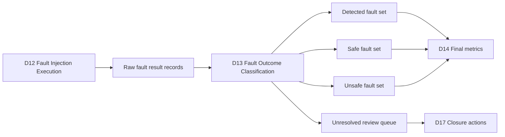
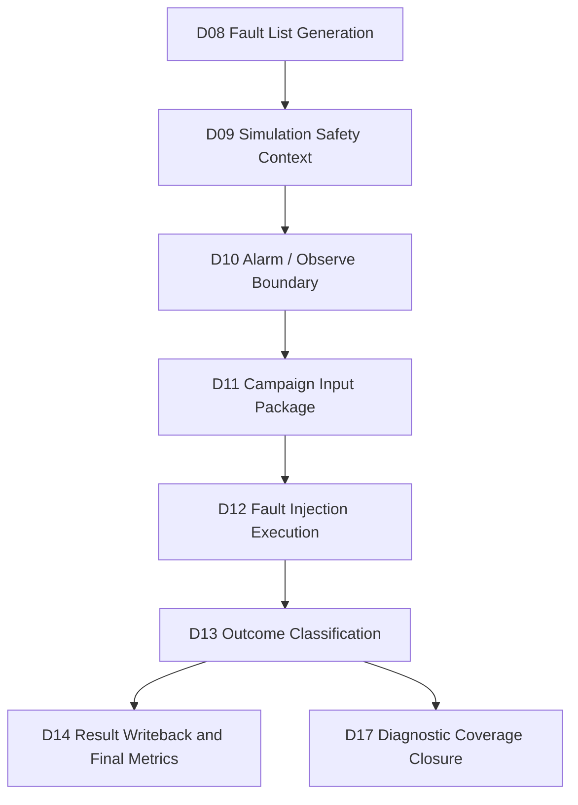
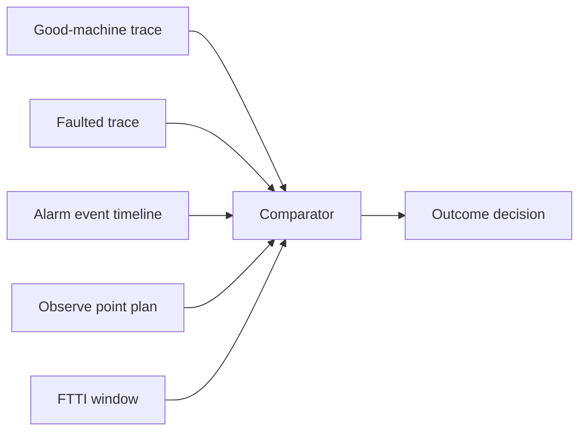
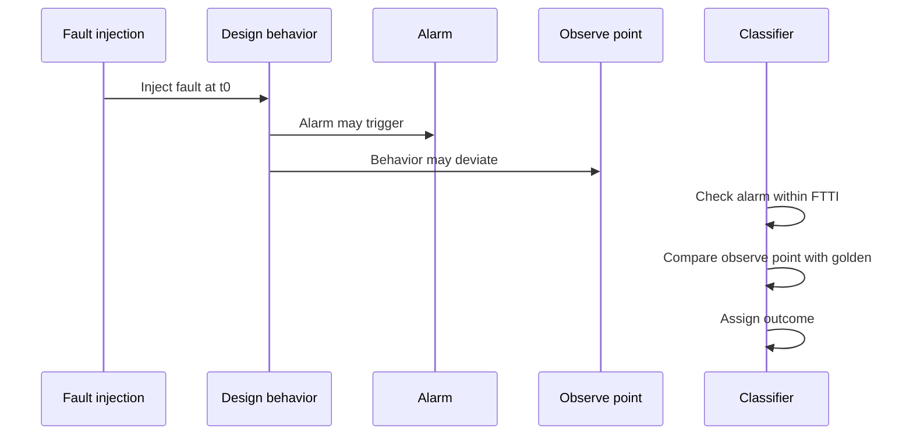
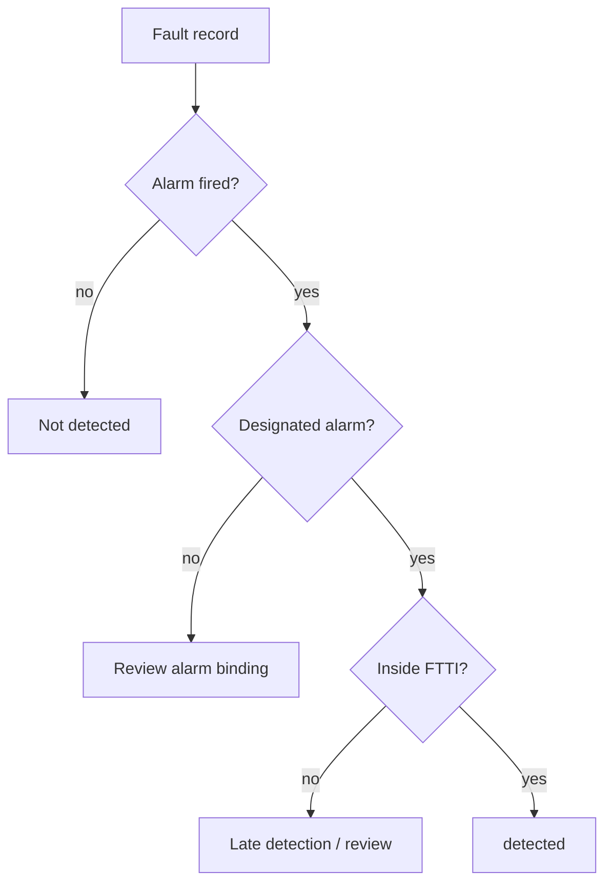
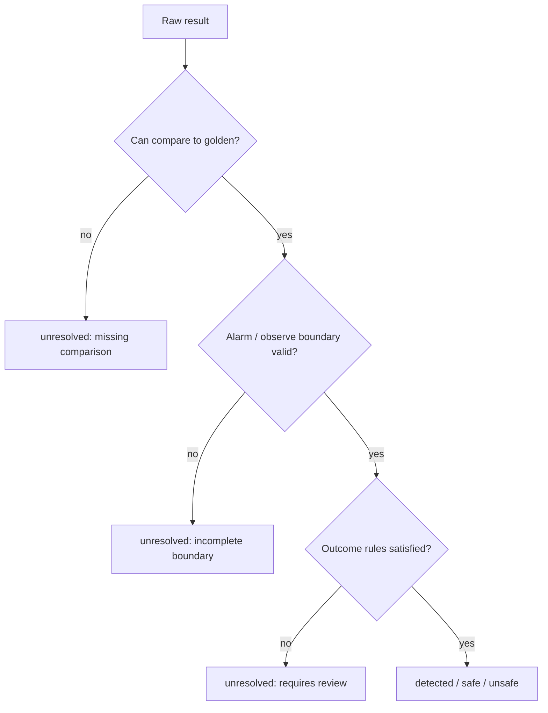
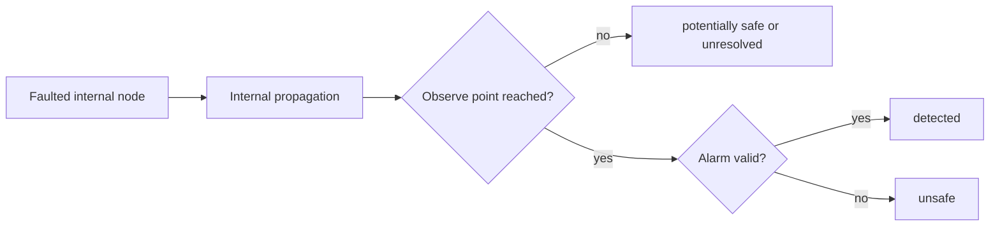
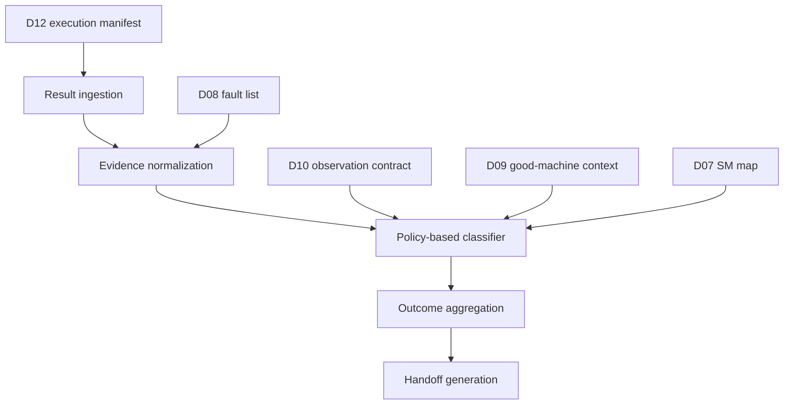
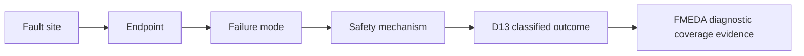

# Automotive Safe-IC Practice 13: Fault Outcome Classification — detected / safe / unsafe / unresolved
Author: Darren H. Chen  
Direction: Automotive chip functional safety analysis and fault-injection verification  
Demo: D13_fault_outcome_classification_detected_safe_unsafe_unresolved  
Tags: ISO 26262, Functional Safety, Fault Injection, Fault Campaign, Fault Outcome, Diagnostic Coverage, FMEDA, VCD, Good Machine, Alarm, Observe Point

## 1. From fault execution records to safety evidence

D12 executes a fault campaign. D13 answers a different question:

> After each fault has been injected and simulated, how should the result be classified so that the campaign can support diagnostic coverage, FMEDA, and final metric calculation?

A fault campaign produces many low-level records: injected site, fault type, injection time, propagation state, alarm status, observe-point mismatch, simulation termination condition, timeout, black-box propagation, missing waveform, and engine status. These records are not yet safety evidence by themselves. They must be interpreted under a consistent outcome model.

D13 is therefore the classification stage.

It transforms execution artifacts into four engineering outcomes:

```text
detected
safe
unsafe
unresolved
```

The purpose is not to make the design look better. The purpose is to make every fault result reviewable, explainable, traceable, and usable by the next stage.



D13 is the bridge between simulation execution and metric evidence.

---

## 2. Position of D13 in the 20-demo Safe-IC flow

D13 is not an isolated report parser. It sits after the complete setup and execution chain:

```text
D08 -> campaign fault list
D09 -> VCD / good-machine context / FTTI planning
D10 -> alarm list and observe point boundary
D11 -> fault campaign input package
D12 -> fault injection execution
D13 -> outcome classification
D14 -> result writeback and final metrics
```

The stage boundary is important.

D12 is responsible for executing fault campaigns. D13 is responsible for interpreting results. D14 is responsible for feeding classified results back into the safety-analysis / FMEDA metric layer.



This separation keeps the flow auditable. If classification changes, D12 does not need to be rerun immediately. If execution changes, D13 can reclassify using the same policy.

---

## 3. What D13 consumes from upstream stages

D13 needs more than a raw fault report. A classification result is meaningful only when it is connected to the campaign context.

Typical D13 inputs are:

```text
D12 execution status and native result directory
D12 raw fault report index
D12 shard / job / execution manifest
D11 campaign input manifest
D10 alarm list and observe point specification
D10 fault outcome boundary matrix
D09 good-machine safety context
D09 VCD signal catalog and FTTI plan
D08 campaign fault list
D07 safety mechanism map
D05 common evidence registry
```

A raw result line such as “alarm fired” is not enough. D13 must know:

```text
Which fault was injected?
Which endpoint or fault site does it belong to?
Which safety mechanism was responsible?
Was the alarm designated for this fault?
Was the alarm inside the FTTI window?
Did the observe point deviate from the good-machine reference?
Was the deviation safety-relevant?
Was the fault still propagating when simulation ended?
Was the fault blocked by a black box or missing activity?
```

Outcome classification is therefore a context-driven decision, not a single-field lookup.

---

## 4. D13 produces classification artifacts, not final metrics

D13 should not be confused with final metric validation.

D13 produces:

```text
fault_outcome_classification.csv
fault_outcome_summary.csv
detected_fault_set.csv
safe_fault_set.csv
unsafe_fault_set.csv
unresolved_fault_queue.csv
classification_policy.csv
classification_evidence_index.csv
d13_handoff_to_d14.csv
d13_handoff_to_d17.csv
```

D14 can then use these classified results to calculate final diagnostic coverage, residual FIT, and audit-oriented metric summaries.

D13 may provide early summary numbers, but it should not claim final SPFM, LFM, or PMHF closure by itself. Those metrics need FIT weighting, FMEDA mapping, unresolved handling, and final database writeback.

---

## 5. The four outcome classes

The classification vocabulary used in this stage has four primary categories.

| Outcome | Short meaning | Evidence question |
|---|---|---|
| `detected` | Fault reached a designated safety response | Did the proper alarm or detection point trigger in time? |
| `safe` | Fault did not create a safety-relevant deviation | Was the fault masked or irrelevant under the stimulus? |
| `unsafe` | Fault created a deviation without proper detection | Did behavior differ from golden without a valid alarm? |
| `unresolved` | Available data is insufficient for a final conclusion | Is more simulation, debug, or expert review required? |

These four classes are intentionally simple. The complexity lies in how the decision is reached.

---

## 6. Golden context: the reference that makes classification possible

A fault outcome cannot be classified without a reference.

D09 prepared a good-machine context: a no-fault simulation trace, signal catalog, observe-point plan, and FTTI window plan. D13 compares each faulted run against that reference.



The golden context answers:

```text
What should the design do without a fault?
Which signals are meaningful to compare?
At what cycle is comparison valid?
How long can the design take to detect the fault?
Which alarms are expected to represent the safety mechanism?
```

Without this baseline, a difference in a waveform is only a difference. It is not automatically a safety failure.

---

## 7. Alarm, observe point, and FTTI as classification boundaries

D10 defines the observation contract.

Three concepts dominate D13 classification:

```text
alarm
observe point
FTTI
```

An alarm is a signal or event that represents a safety mechanism response.

An observe point is a boundary where the design behavior is judged: output port, state element, protocol-visible signal, or selected internal observation point.

FTTI, the fault tolerant time interval, is the maximum allowed time between fault occurrence and safety response before the system may enter an unsafe condition.



D13 should never classify solely on final simulation status. Timing matters.

---

## 8. Detected fault: detection is not just “any alarm fired”

A fault is classified as detected when the fault is captured by a designated safety mechanism within the configured boundary.

A robust detected classification needs these checks:

```text
fault was injected or activated
faulted behavior is safety-relevant or reaches a monitored path
designated alarm or detection point triggered
alarm timing is inside the accepted FTTI window
alarm belongs to the expected safety mechanism or allowed alarm group
result record is complete enough to support audit review
```

A random unrelated alarm should not automatically grant diagnostic coverage. D13 should check the alarm binding prepared in D07 and D10.



The key word is designated.

A safety mechanism must detect the fault intentionally, not accidentally.

---

## 9. Safe fault: absence of deviation is not failure

A safe fault is one where the machine state remains equivalent to the golden safety context under the applied stimulus.

Typical safe situations include:

```text
fault is in inactive logic
fault is masked by logic values
fault affects a path not sensitized by the VCD stimulus
fault changes an internal node but not any safety-relevant observe point
fault affects redundant logic but the voter or checker masks it
```

Safe does not necessarily mean the design has a good diagnostic mechanism. It means the injected fault did not create a safety-relevant error in the evaluated context.

This distinction matters:

```text
detected -> credit to diagnostic coverage
safe     -> evidence that the fault was not dangerous in this context
```

Safe faults may reduce the dangerous fault population, but they are not the same as detected dangerous faults.

---

## 10. Unsafe fault: the dangerous evidence path

A fault is unsafe when it creates a safety-relevant deviation and no valid safety response occurs within the required boundary.

A typical unsafe pattern is:

```text
fault injected
observe point deviates from good-machine context
designated alarm does not fire
or alarm fires too late
or alarm is unrelated to the mapped safety mechanism
```

Unsafe faults deserve special attention because they indicate one of the following:

```text
missing safety mechanism
wrong alarm binding
insufficient detection coverage
observe point too close to hazard boundary
FTTI too tight for the existing mechanism
incorrect SM-to-endpoint mapping
stimulus exposes a real vulnerability
```

D13 should preserve unsafe evidence with maximum traceability. D14 and D17 will use this set for metric impact and closure planning.

---

## 11. Unresolved fault: not a failure verdict, but not credit either

Unresolved faults are often misunderstood.

Unresolved does not automatically mean unsafe, and it does not automatically mean safe. It means the campaign evidence is insufficient to classify the fault.

Common unresolved reasons include:

```text
fault not injectable
fault still propagating when simulation ends
missing signal in VCD
insufficient activity around injection window
propagation reaches black-box boundary
X propagation prevents comparison
multi-clock race or unstable sampling
alarm / observe point not configured
tool result incomplete
shard terminated early
```

D13 should treat unresolved as a first-class category, not a miscellaneous bucket.



Unresolved faults should generate a review queue with suggested resolution actions.

---

## 12. The difference between “unresolved” and “unsafe”

Unsafe means the evidence shows a dangerous behavior without proper detection.

Unresolved means the evidence does not yet support a final decision.

For example:

```text
fault reached a black box
```

This is not necessarily unsafe. The black box may contain a safety mechanism, analog behavior, or a user-defined model. But unless the campaign can observe the effect, D13 cannot classify it as safe or detected.

Another example:

```text
fault still propagating at end of simulation
```

The run may need a longer simulation window. Classifying it as unsafe too early can overstate risk. Classifying it as safe would understate risk. Unresolved is the correct engineering state.

---

## 13. Outcome classification as a decision table

A practical D13 classifier can be represented as a decision table.

| Golden mismatch | Designated alarm | Alarm timing | Propagation state | Outcome |
|---|---|---|---|---|
| no | no | n/a | stable | safe |
| no | yes | in window | stable | safe_detected or safe |
| yes | yes | in window | stable | detected |
| yes | yes | late | stable | unsafe or timing_violation |
| yes | no | n/a | stable | unsafe |
| unknown | any | any | blackbox / missing / X | unresolved |
| still propagating | any | any | not settled | unresolved |
| not injectable | no | n/a | no activation | unresolved or excluded-review |

Some organizations keep subcategories such as `safe_detected`, `late_detected`, or `not_injectable_review`. D13 can keep these as sub-outcomes while preserving the four primary outcome classes.

---

## 14. Primary outcome vs. sub-outcome

The four classes are useful for high-level metrics, but debug requires more detail.

D13 can define:

```text
primary_outcome
sub_outcome
resolution_reason
review_action
```

Example:

| primary_outcome | sub_outcome | meaning |
|---|---|---|
| detected | alarm_in_ftti | designated alarm triggered in time |
| detected | observed_and_alarm | deviation observed and alarm fired |
| safe | masked_by_logic | no golden mismatch |
| safe | inactive_fault_site | no activity at fault site |
| unsafe | no_alarm | mismatch without alarm |
| unsafe | late_alarm | alarm outside FTTI |
| unresolved | missing_vcd_signal | cannot compare |
| unresolved | reached_blackbox | propagation enters unmodeled block |
| unresolved | still_propagating | simulation ended too soon |

This structure helps D17 turn unresolved faults into closure actions.

---

## 15. Classification policy should be versioned

D13 should not hide the outcome rules inside a script.

The classification policy should be an explicit artifact:

```text
classification_policy.csv
```

It should describe:

```text
primary outcome rules
alarm timing rules
FTTI source
observe point precedence
safe masking criteria
unresolved reason taxonomy
late alarm treatment
X propagation policy
black-box propagation policy
missing-data policy
manual-review policy
```

A policy artifact makes D13 reproducible. If the team changes how late alarms are treated, the classification version should change.

---

## 16. Fault identity must survive classification

Every D13 row must keep the original fault identity.

A classification row should include:

```text
fault_id
campaign_id
shard_id
fault_site
fault_type
injection_time
endpoint_id
failure_mode_id
safety_mechanism_id
alarm_group
observe_point_group
primary_outcome
sub_outcome
confidence
evidence_file
```

Fault identity connects D13 back to:

```text
D08 campaign fault list
D07 safety mechanism map
D10 alarm / observe contract
D12 execution result
D14 final metric writeback
D15 FMEDA item
```

Without identity preservation, the classification is only a summary. It is not evidence.

---

## 17. Timing model: injection time, detection time, and comparison time

Fault classification is time-sensitive.

D13 should distinguish:

```text
fault injection time
fault activation time
first propagation time
first observe mismatch time
alarm trigger time
FTTI deadline
simulation end time
```

A simplified timing diagram:

```mermaid
gantt
    title Fault classification timing model
    dateFormat X
    axisFormat %s
    section Fault
    Injection             :milestone, 0, 0
    Propagation window    :active, 0, 8
    section Safety response
    Alarm allowed window  :0, 5
    Late region           :5, 8
    section Observation
    Observe comparison    :2, 8
```



If the alarm fires after the FTTI deadline, the result may not be credited as detected for the intended safety goal, even if an alarm eventually appears.

---

## 18. The role of observe points in safe vs unsafe decisions

Observe points are the safety-relevant visibility boundary.

If no observe point changes, a fault may be safe in the current context. If an observe point changes and no designated alarm fires, it may be unsafe.

Observe points should be selected carefully. Too few observe points can under-detect deviations. Too many observe points can classify harmless internal differences as unsafe.

D10 prepares observe points. D13 applies them.



The observe boundary is part of the safety argument.

---

## 19. Alarm grouping and alarm equivalence

A safety mechanism may expose multiple alarm signals.

D13 should support alarm grouping:

```text
alarm_group_id
primary_alarm
equivalent_alarms
allowed_latency
expected_endpoint_scope
```

For example, an endpoint parity checker may produce a local alarm, which is then ORed into a global safety alarm. Depending on the policy, either local or global alarm may be acceptable evidence.

Alarm grouping prevents false negatives when the safety response is intentionally aggregated.

However, grouping must be explicit. Otherwise, any global alarm could mask a weak mapping.

---

## 20. X propagation and unknown values

In RTL simulation, unknown values can complicate classification.

Common causes include:

```text
uninitialized state
incomplete reset
multiple drivers
black-box outputs
unsupported primitive behavior
missing memory initialization
race around primary inputs
```

D13 should not blindly classify X mismatch as unsafe. It should inspect policy:

```text
X at observe point before injection -> invalid good context
X introduced by fault and reaches observe point -> possible unsafe or unresolved
X only in non-safety signal -> may not affect classification
X prevents alarm comparison -> unresolved
```

A robust classifier should produce sub-outcomes such as:

```text
unresolved_x_in_golden
unresolved_x_at_observe
unresolved_x_in_alarm
unsafe_x_reaches_safety_boundary
```

X handling is one of the main reasons D13 needs a policy layer.

---

## 21. Missing VCD signal is a classification problem

D09 prepared a VCD and signal catalog. D12 used those signals for campaign execution. D13 may still discover missing data.

A missing signal can occur when:

```text
VCD was filtered too aggressively
signal was optimized away
hierarchical name changed
fault campaign used a different design wrapper
alarm was renamed or aggregated
observe point was not dumped
```

D13 should not silently drop such faults.

It should create review entries:

```text
missing_signal
missing_alarm
missing_observe_point
missing_endpoint_mapping
```

These entries feed D17 closure and may require regenerating D09 or D10 artifacts.

---

## 22. DFT-style resolution vs. safety outcome

Fault reports may contain lower-level resolution labels such as controlled, observed, observed internal, primary-output observed, or alarm observed.

These are useful, but they are not identical to the four D13 outcomes.

A possible interpretation layer:

| Low-level resolution | D13 interpretation |
|---|---|
| controlled but not observed | unresolved or safe depending on golden comparison |
| observed at alarm | detected if alarm is designated and in time |
| observed at internal state | unresolved unless it reaches observe boundary or alarm |
| observed at primary output | unsafe unless output is declared safe or alarmed |
| not injectable | unresolved / excluded-review |
| reached black box | unresolved |

This mapping should be explicit because tool-level observability is not the same as safety-level acceptability.

---

## 23. Confidence score for classification

D13 can attach a confidence score to each classification.

Example:

```text
1.00 = direct evidence from designated alarm and observe comparison
0.80 = direct alarm evidence but limited observe context
0.60 = safe due to no mismatch, but low activity around fault site
0.40 = unresolved with partial propagation evidence
0.20 = missing signal or incomplete run
```

Confidence is not a substitute for outcome. It helps review prioritization.

An unsafe fault with high confidence is urgent. An unresolved fault with low confidence may need rerun first.

---

## 24. FIT weighting and why D13 should preserve weights

D13 should carry FIT-related weights from D08 / D14 inputs even if it does not compute final metrics.

Useful fields:

```text
base_fit_weight
fault_site_weight
endpoint_fit_contribution
permanent_or_transient
standard_context
mission_profile_id
```

Later, D14 can calculate weighted diagnostic coverage:

```text
detected_fit_weight
safe_fit_weight
unsafe_fit_weight
unresolved_fit_weight
```

A campaign with 10 unsafe faults is not always worse than a campaign with 1 unsafe fault. The safety impact depends on FIT weighting and FMEDA mapping.

---

## 25. Resolved vs. unresolved metric boundary

A mature flow should separate:

```text
resolved fault population
unresolved fault population
```

Resolved faults include detected, safe, and unsafe. Unresolved faults require closure.

A conservative reporting model:

```text
resolved_dc = detected_fit / (detected_fit + unsafe_fit)
unresolved_fit = sum(unresolved fault weights)
review_required = unresolved_fit > threshold
```

The exact final metric policy belongs to D14 and D15. D13 should simply make unresolved visible and traceable.

---

## 26. How D13 prepares data for D14

D14 needs campaign results in a format suitable for database writeback and final metric validation.

D13 should provide:

```text
classified_fault_id
primary_outcome
sub_outcome
detected_flag
safe_flag
unsafe_flag
unresolved_flag
alarm_evidence
observe_evidence
ftti_status
failure_mode_id
safety_mechanism_id
fit_weight
campaign_result_session
```

D14 can then aggregate results by:

```text
part
sub-part
failure mode
safety mechanism
endpoint
fault type
permanent / transient
```

D13 is therefore the normalization layer between raw campaign outputs and final safety metrics.

---

## 27. How D13 prepares data for D17 closure

D17 focuses on diagnostic coverage closure.

For that stage, D13 should generate:

```text
unresolved_fault_queue.csv
unsafe_fault_queue.csv
classification_review_actions.csv
```

Each row should include a suggested action:

| issue | suggested action |
|---|---|
| missing VCD signal | regenerate VCD with wider dump scope |
| fault still propagating | extend simulation window |
| reached black box | add model, add observe point, or justify black-box behavior |
| no alarm for unsafe deviation | review safety mechanism map |
| late alarm | review FTTI or safety mechanism latency |
| low activity | add workload or targeted test |
| X in golden | fix reset or memory initialization |

This is how classification becomes engineering closure.

---

## 28. D13 architecture

A practical D13 implementation can be organized into five blocks:



Block responsibilities:

```text
Result ingestion
  reads raw fault reports, shard status, alarm reports, and execution manifests

Evidence normalization
  maps tool-native fields into campaign-neutral fields

Policy-based classifier
  applies detected / safe / unsafe / unresolved rules

Outcome aggregation
  summarizes counts, FIT weights, and unresolved reasons

Handoff generation
  produces D14 and D17 input artifacts
```

This structure keeps the classifier testable.

---

## 29. Suggested D13 demo directory structure

A D13 demo can use the following structure:

```text
D13_fault_outcome_classification_detected_safe_unsafe_unresolved/
  README.md
  configs/
    classification_policy.csv
    unresolved_reason_catalog.csv
    outcome_priority_rules.csv
  scripts/
    run_demo.csh
    run_demo.sh
  tools/
    build_d13_fault_outcome_classification.py
  inputs/
    from_D12/
    from_D11/
    from_D10/
    from_D09/
    from_D08/
    from_D07/
  outputs/
    raw_fault_result_index.csv
    normalized_fault_events.csv
    fault_outcome_classification.csv
    fault_outcome_summary.csv
    detected_fault_set.csv
    safe_fault_set.csv
    unsafe_fault_set.csv
    unresolved_fault_queue.csv
    classification_review_actions.csv
    d13_handoff_to_d14.csv
    d13_handoff_to_d17.csv
    d13_quality_gate.csv
    evidence_index.csv
    demo_summary.md
```

The important point is that D13 should preserve both raw evidence and normalized interpretation.

---

## 30. D13 demo execution model

The D13 demo should not require a real fault-campaign engine by default.

Default mode:

```text
read D12 execution artifacts
generate normalized event records
apply classification policy
produce outcome tables and handoff files
```

Optional real-result mode:

```text
read native result reports produced by a local campaign engine
parse alarm and fault reports
cross-check against D10 / D11 / D12 manifests
classify outcomes using the same policy
```

The public demo can remain reproducible while allowing local environments to plug in real campaign outputs.

---

## 31. Quality gates for D13

D13 should fail if classification cannot be trusted.

Recommended quality gates:

```text
D12 handoff exists
campaign result index exists
D10 observation contract exists
D09 good-machine manifest exists
D08 campaign fault list exists
classification policy exists
all classified rows keep original fault_id
primary_outcome is one of detected / safe / unsafe / unresolved
no unknown outcome labels
unresolved rows include reason and review action
unsafe rows include observe evidence
detected rows include alarm evidence and timing status
D14 handoff generated
D17 handoff generated
```

Warnings may be acceptable for:

```text
low activity around some fault sites
optional native report missing in demo mode
manual-review fields pending
some alarm groups not bound to final hardware signal
```

The quality gate should enforce evidence discipline, not merely script completion.

---

## 32. Example normalized classification row

A normalized D13 row may look like this:

```csv
fault_id,fault_site,fault_type,endpoint_id,failure_mode_id,sm_id,primary_outcome,sub_outcome,alarm_status,observe_status,ftti_status,review_action
F000123,u_core.u_cnt.count[3],SA1,EP_COUNT_3,FM_STATE_CORRUPTION,SM_ENDPOINT_PARITY,detected,alarm_in_ftti,designated_alarm_fired,mismatch_observed,in_window,none
```

Another example:

```csv
fault_id,fault_site,fault_type,endpoint_id,failure_mode_id,sm_id,primary_outcome,sub_outcome,alarm_status,observe_status,ftti_status,review_action
F000241,u_core.u_ctrl.state[1],SA0,EP_STATE_1,FM_PROTOCOL_HANDSHAKE_CORRUPTION,SM_PROTOCOL_PARITY,unresolved,missing_observe_signal,no_alarm,missing_signal,unknown,regenerate_vcd_with_observe_signal
```

The row should be readable by humans and scripts.

---

## 33. Outcome summary should not hide unresolved risk

A summary table might include:

```text
total_faults
detected_count
safe_count
unsafe_count
unresolved_count
detected_weight
safe_weight
unsafe_weight
unresolved_weight
top_unresolved_reasons
top_unsafe_failure_modes
```

The unresolved set should remain visible.

A campaign summary that only reports “detected percentage” is not enough. A useful D13 summary should also answer:

```text
What remains unclassified?
Why?
How much weighted risk does it represent?
Which next action can reduce it?
```

This is the difference between a progress report and a safety evidence report.

---

## 34. Relationship to FMEDA

FMEDA needs a failure-mode-oriented view.

D13 should connect each classified fault to:

```text
part
sub-part
failure mode
safety mechanism
diagnostic coverage claim
residual fault contribution
```

The raw fault site is too low-level for FMEDA by itself.

D07 mapped failure modes to endpoints and safety mechanisms. D13 attaches actual observed campaign outcomes to those mappings. D15 can then build an FMEDA data model with evidence-backed diagnostic coverage.



This is where simulation evidence begins to become safety-case evidence.

---

## 35. Common mistakes in fault outcome classification

### 35.1 Treating any alarm as detected

Only designated and policy-accepted alarms should count.

### 35.2 Ignoring FTTI

A late alarm may not protect the safety goal.

### 35.3 Treating unresolved as safe

Unresolved is a review state, not a safety credit.

### 35.4 Counting internal observation as final detection

Internal propagation is useful debug information, but it is not always a safety response.

### 35.5 Losing fault identity during aggregation

Summary numbers without fault IDs cannot support closure.

### 35.6 Ignoring missing VCD signals

Missing signals should create review actions.

### 35.7 Mixing DFT test observability with functional safety detection

Manufacturing-test observability and safety mechanism detection are related but not identical.

---

## 36. Review workflow for unsafe and unresolved faults

D13 should create two review queues.

Unsafe review:

```text
confirm observe mismatch
check alarm binding
check FTTI
review SM coverage
review failure mode severity
prepare design or SM update
```

Unresolved review:

```text
identify unresolved reason
add missing VCD signal
extend simulation window
improve workload
add memory initialization
replace black-box model
rerun selected faults
```

A review queue turns classification into action.

---

## 37. Final handoff from D13

D13 should hand off two directions.

To D14:

```text
classified outcomes
FIT-weighted aggregation inputs
campaign result session reference
database writeback manifest
metric-ready fault set
```

To D17:

```text
unsafe queue
unresolved queue
closure action plan
rerun candidate list
evidence gaps
```

D13 is complete when every fault has a classification state and every non-closed fault has a next action.

---

## 38. Summary

D13 is where fault injection results become structured safety evidence.

The stage does not merely count failures. It interprets each fault under a safety-aware observation contract:

```text
fault list
good-machine context
alarm list
observe point
FTTI
safety mechanism map
campaign execution record
```

The result is a classified fault population:

```text
detected
safe
unsafe
unresolved
```

A detected fault supports diagnostic coverage when the designated safety mechanism responds in time. A safe fault shows no safety-relevant deviation under the evaluated context. An unsafe fault exposes a dangerous deviation without a valid response. An unresolved fault requires additional evidence before it can be credited or condemned.

This classification layer is essential because final safety metrics must be explainable. D14 will use D13 output to write back campaign results and compute final metrics. D17 will use D13 output to close unresolved and unsafe cases. D15 will connect the classified outcomes to FMEDA.

Without D13, a fault campaign remains a set of raw simulation records. With D13, it becomes a traceable diagnostic-coverage evidence package.
