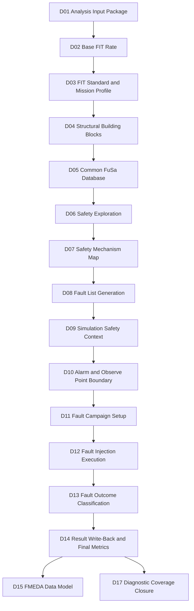
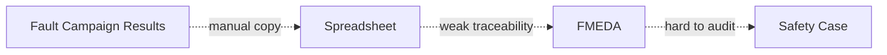
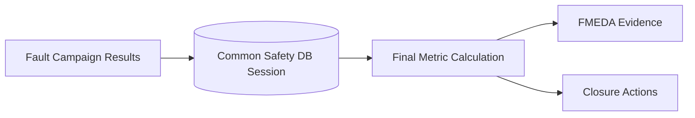
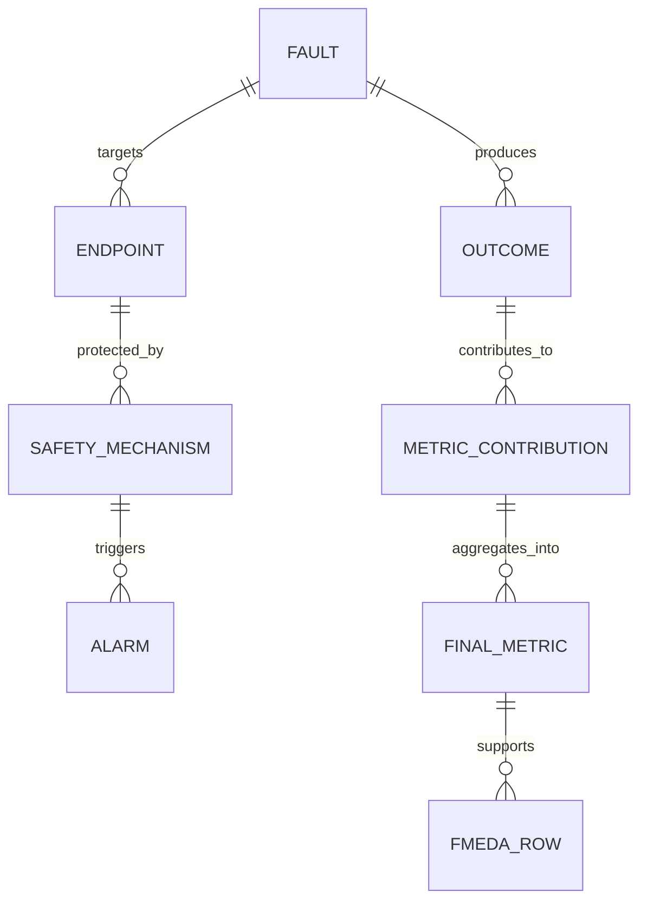
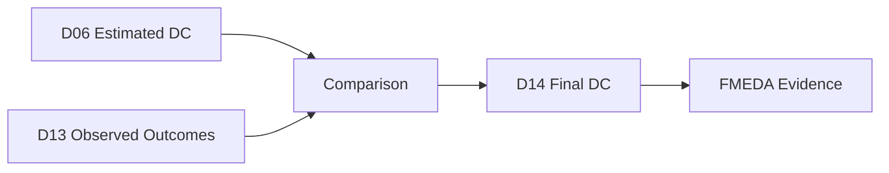
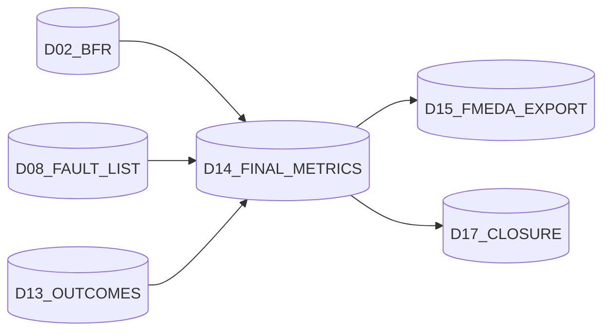
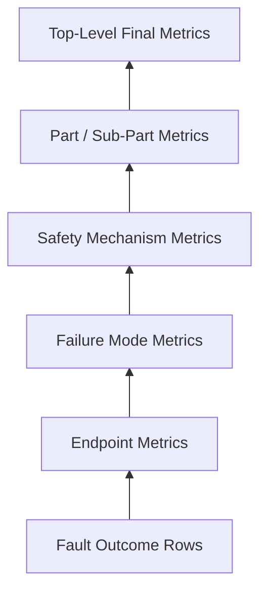
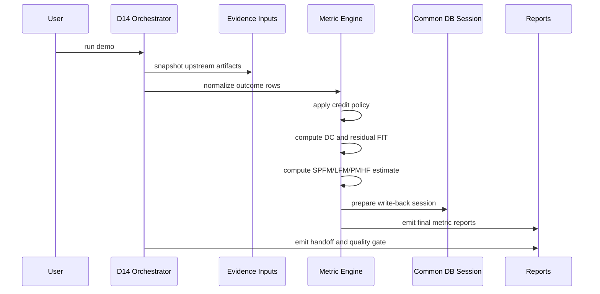

# [Automotive Safe-IC Practice 14] Fault Campaign Result Write-Back and Final Metrics

**Author**: Darren H. Chen  
**Direction**: Automotive Chip Functional Safety Analysis and Fault Injection Practice  
**Demo**: `D14_fault_campaign_result_writeback_final_metrics`  
**Tags**: Automotive Chip, Functional Safety, ISO 26262, Fault Campaign, Fault Outcome, Diagnostic Coverage, FIT, SPFM, LFM, PMHF, Common FuSa Database, FMEDA, Evidence Flow

---

## 1. From fault outcomes to safety metrics

A fault campaign does not end when the last injected fault has finished running.

The campaign only becomes useful when its result is written back into the safety analysis evidence chain and converted into metrics that can be reviewed by system, hardware, safety, and FMEDA stakeholders.

D13 classified each fault as one of several outcome types:

```text
detected
safe
unsafe
unresolved
```

D14 asks the next question:

```text
How do these outcomes modify diagnostic coverage, residual FIT, and final hardware safety metrics?
```

This is the point where the flow changes from “fault simulation result management” to “metric closure.”

D14 is therefore not a reporting afterthought. It is the bridge between fault injection evidence and final safety argumentation.

---

## 2. D14 in the complete evidence chain

The earlier demos built the flow step by step:



D14 consumes D13 classification and produces metric-oriented evidence for D15 and D17.

It is also where the shared database becomes more than a storage detail. The database session allows analysis evidence, fault-list evidence, campaign evidence, and final metric evidence to refer to the same design boundary and the same safety context.

---

## 3. Why write-back matters

A raw fault campaign report usually contains many fault-level records.

A final safety metric report needs block-level, failure-mode-level, or part-level evidence.

These two views are not the same.

Fault-level data answers:

```text
For this injected fault, what happened?
```

Metric-level data answers:

```text
For this safety-relevant function or diagnostic coverage element,
how much random hardware failure contribution remains insufficiently covered?
```

Write-back is the transformation from individual observed fault behavior into reusable safety analysis evidence.

Without write-back, the flow has a broken link:



With write-back, the chain becomes structured:



---

## 4. Inputs consumed by D14

D14 is downstream of D13, but it should not rely only on D13.

A robust D14 input package should include:

```text
D13 classified fault outcomes
D13 unresolved resolution plan
D12 execution manifest
D11 campaign input package manifest
D10 observation boundary contract
D09 VCD / Good Machine / FTTI context
D08 campaign-ready fault list
D07 endpoint-to-safety-mechanism map
D05 common database session manifest
D03 FIT standard and reliability setup identity
D02 Base FIT / FIT contribution evidence
```

The central principle is:

> A final metric is only meaningful if it can be traced back to design boundary, FIT standard, fault list, campaign setup, observation boundary, and outcome classification.

---

## 5. Outputs produced by D14

D14 should produce both machine-readable and human-readable artifacts.

Typical output families are:

```text
fault_result_writeback_manifest.csv
fault_outcome_metric_input.csv
final_diagnostic_coverage.csv
residual_fit_summary.csv
spfm_lfm_pmhf_estimate.csv
final_metric_by_failure_mode.csv
final_metric_by_endpoint.csv
final_metric_by_safety_mechanism.csv
common_db_writeback_plan.csv
common_db_session_registry.json
d14_handoff_to_d15.csv
d14_handoff_to_d17.csv
d14_quality_gate.csv
evidence_index.csv
demo_summary.md
```

The point is not to hide raw campaign data. The point is to summarize it while preserving traceability.

---

## 6. Core data model

D14 can be viewed as a relational join problem.

The following entities need to meet:



A clean D14 flow should avoid treating metrics as disconnected formulas. Metrics are aggregations over categorized fault behavior under known reliability assumptions.

---

## 7. Terminology checkpoint

Before discussing formulas, it is useful to align on key terms.

| Term | Meaning in D14 |
|---|---|
| Fault outcome | Result of an injected fault after observation and classification |
| Diagnostic coverage | Fraction of relevant faults detected or controlled by safety mechanisms |
| Residual fault | A fault not sufficiently covered and still safety-relevant |
| Safe fault | A fault that does not violate the safety goal under the observed context |
| Unsafe fault | A fault that propagates into unsafe behavior without adequate detection/control |
| Unresolved fault | A fault whose outcome cannot yet be confidently classified |
| Write-back | Recording classified campaign result into the analysis evidence store |
| Final metric | Metric recomputed from validated or measured campaign evidence |

The word “final” does not mean “certification is automatically complete.” It means the metric is based on the post-campaign evidence set rather than only on early estimation.

---

## 8. Estimated DC vs measured DC

D06 used what-if exploration to estimate diagnostic coverage.

D13 classified observed campaign outcomes.

D14 compares these two worlds.



Estimated DC is useful early because it guides safety mechanism selection.

Measured or validated DC is stronger because it uses fault campaign evidence.

A practical safety flow needs both:

```text
estimated DC -> architecture planning
validated DC -> metric evidence
```

---

## 9. Outcome-to-metric mapping

D14 should define explicit mapping rules.

A simplified rule table is:

| Outcome | Metric interpretation |
|---|---|
| detected | Can contribute diagnostic coverage credit |
| safe | Can reduce dangerous residual contribution, depending on safety goal relevance |
| unsafe | Contributes residual / single-point risk unless resolved by analysis |
| unresolved | Must not be silently credited as covered |

Unresolved is especially important.

A flow that treats unresolved as detected will overstate coverage.

A flow that treats unresolved as unsafe may be too pessimistic.

The correct approach is to keep unresolved as a separate bucket and drive D17 closure.

---

## 10. Fault weight and FIT contribution

Not all faults contribute equally.

A simple count-based view says:

```text
DC = detected_faults / total_faults
```

That can be useful for sanity checks, but final metrics usually need weighting by reliability contribution, structural relevance, or failure-mode mapping.

A more meaningful view is:

```text
weighted DC = detected_or_safe_relevant_FIT / total_relevant_FIT
```

D14 therefore keeps both views:

```text
count-based coverage
FIT-weighted coverage
failure-mode-weighted coverage
endpoint-weighted coverage
```

This prevents a campaign with many low-risk detected faults from hiding a few high-risk unsafe faults.

---

## 11. Residual FIT

Residual FIT is the remaining failure-rate contribution after diagnostic coverage is applied.

A simplified conceptual formula is:

```text
residual_fit = base_fit * (1 - diagnostic_coverage)
```

Real flows may break this down by:

```text
permanent faults
transient faults
failure mode
endpoint
logic cone
safety mechanism
part / sub-part
```

D14 should avoid reporting only one global number. A global residual FIT is useful, but reviewers usually need to know where it comes from.

---

## 12. Permanent and transient result lanes

D14 should keep permanent and transient lanes separate.

Permanent fault evidence and transient fault evidence may differ in:

```text
fault model
fault duration
injection semantics
activity dependence
diagnostic latency
recovery behavior
FIT source
metric interpretation
```

A clean D14 data model has columns such as:

```text
fault_kind
lambda_perm
lambda_tran
dc_perm
dc_tran
residual_fit_perm
residual_fit_tran
```

This matches how safety analysis reports commonly separate permanent and transient contributions.

---

## 13. SPFM, LFM, and PMHF

D14 should prepare the final metric bridge to three familiar ISO 26262-style hardware metrics:

```text
SPFM
LFM
PMHF
```

Conceptually:

- **SPFM** reflects robustness against single-point and residual faults.
- **LFM** reflects robustness against latent multi-point faults.
- **PMHF** estimates residual probabilistic risk from random hardware failures.

D14 does not reduce these metrics to marketing percentages. It treats them as aggregations over lambda categories, diagnostic coverage, and fault outcome evidence.

---

## 14. Lambda categories

Final metrics depend on how failure-rate contribution is classified.

A practical implementation may maintain categories such as:

```text
lambda_total
lambda_safe
lambda_detected
lambda_residual
lambda_single_point
lambda_latent
lambda_unresolved
```

The exact naming can vary, but the engineering idea is stable:

```text
failure-rate mass must be conserved or explicitly justified
```

D14 should be able to answer:

```text
Where did each part of the original FIT go after the fault campaign?
```

---

## 15. Conservation checks

A good D14 quality gate should include conservation checks.

For example:

```text
lambda_total_from_D02 ~= lambda_safe + lambda_detected + lambda_residual + lambda_unresolved + exclusions
```

If the difference is large, something is wrong:

```text
fault list scope mismatch
FIT standard mismatch
classification join failure
missing endpoint mapping
incorrect fault weight
incorrect campaign subset selection
```

D14 should make these mismatches visible instead of hiding them in a final summary number.

---

## 16. Common database session layout

A practical database-oriented flow can use session naming like:

```text
design.fdb::D02_BFR
design.fdb::D08_FAULT_LIST
design.fdb::D12_FAULT_CAMPAIGN
design.fdb::D13_OUTCOME_CLASSIFICATION
design.fdb::D14_FINAL_METRICS
design.fdb::D15_FMEDA_EXPORT
```

D14 reads from earlier sessions and writes a final-metric session.



The database is not a replacement for file-based evidence. It is the structured backbone that allows different tools and review layers to share the same safety context.

---

## 17. File evidence vs database evidence

D14 should preserve both file artifacts and database artifacts.

File artifacts are good for:

```text
Git review
diff
human inspection
archival packages
training examples
```

Database artifacts are good for:

```text
cross-stage linkage
GUI loading
tool-to-tool handoff
session partitioning
metric recomputation
```

A mature flow should not choose one and discard the other.

---

## 18. Write-back manifest

The write-back manifest is one of the most important D14 deliverables.

It should record:

```text
source outcome file
source fault list
source campaign setup
source observation contract
source FIT setup
source database session
target database session
write-back timestamp / run identity
number of fault outcomes imported
number of outcomes excluded
number of unresolved outcomes retained
metric artifacts generated
```

This manifest allows a reviewer to know exactly what evidence was used to compute final metrics.

---

## 19. Handling unresolved outcomes

Unresolved outcomes must remain visible.

D14 should not convert unresolved into detected or safe.

A practical unresolved policy is:

```text
unresolved_count > 0 -> D17 closure required
unresolved_fit_weight > threshold -> metric review required
unresolved linked to high-severity failure mode -> priority escalation
```

Unresolved does not necessarily mean the design is unsafe.

It means the current campaign evidence is insufficient to classify the fault.

D17 is responsible for closure actions such as:

```text
improve stimulus
extend VCD window
add observe points
fix alarm binding
review X propagation
rerun selected campaign subset
manual safety review
```

---

## 20. Unsafe outcomes and residual risk

Unsafe outcomes require special handling.

They may indicate:

```text
missing safety mechanism
incorrect alarm list
observe boundary mismatch
insufficient diagnostic latency
fault list over-approximation
failure mode mapping error
real safety design gap
```

D14 should not automatically assume all unsafe outcomes have the same meaning.

Instead, it should group them by:

```text
failure mode
endpoint
safety mechanism
fault kind
campaign scenario
FIT weight
```

This grouping is what makes safety closure actionable.

---

## 21. Safe outcomes and credit policy

Safe faults are not dangerous under the observed safety context.

However, D14 should distinguish between different kinds of safe evidence:

```text
structurally irrelevant safe fault
masked safe fault
functionally safe fault
alarm-detected safe fault
observation-window safe fault
```

The credit policy should be explicit.

If a fault is safe only because the stimulus never activates the logic, that may require caution.

If a fault is safe because it cannot propagate to a safety-relevant output under the design structure, that is stronger evidence.

---

## 22. Detected outcomes and alarm evidence

Detected faults usually provide diagnostic coverage credit.

But D14 should still check:

```text
Was the alarm in the approved alarm list?
Did the alarm fire within the FTTI window?
Was the observed alarm mapped to the expected safety mechanism?
Was the affected endpoint covered by the intended mechanism?
Was the classification based on a valid good-machine reference?
```

This is why D10 and D09 matter. D14 final metrics depend on observation boundary and safety context.

---

## 23. FTTI-aware metric review

Fault Tolerant Time Interval is a timing contract.

A fault detected too late may not deserve the same credit as a fault detected within the allowed interval.

D14 can therefore introduce latency-aware classification:

```text
detected_within_ftti
detected_after_ftti
not_detected
not_observable
```

The metric policy may treat these differently.

This prevents a slow alarm from being incorrectly counted as fully effective.

---

## 24. Observation boundary consistency

D14 must confirm that D13 outcomes were classified against the intended boundary.

Key inputs are:

```text
alarm list
observe point list
VCD signal catalog
FTTI window plan
campaign observation contract
```

A mismatch can corrupt final metrics.

For example:

```text
fault campaign used alarm A
D14 metric policy expects alarm B
```

or:

```text
fault campaign observed internal debug signal
D14 metric policy expects protocol-visible safety output
```

These cases should produce review warnings or quality-gate failures.

---

## 25. Metric aggregation hierarchy

D14 should aggregate metrics at several levels.



Each level supports a different review:

| Level | Reviewer question |
|---|---|
| Fault row | What happened to this fault? |
| Endpoint | Which endpoint remains risky? |
| Failure mode | Which failure mode needs closure? |
| Safety mechanism | Which mechanism is effective or weak? |
| Part / sub-part | How does this map into FMEDA? |
| Top level | Are the final metrics acceptable? |

---

## 26. Final metric report structure

A useful final metric report should not be only a table.

It should include:

```text
run identity
design boundary
FIT standard
fault campaign identity
classification source
outcome distribution
permanent/transient split
DC by endpoint
DC by failure mode
residual FIT summary
SPFM / LFM / PMHF estimate
unresolved and unsafe highlights
handoff to FMEDA
handoff to closure
```

This structure makes the report useful for engineering review instead of only tool archiving.

---

## 27. Quality gates for D14

D14 quality gates should check more than file existence.

Suggested gates:

```text
D13 outcome classification exists
D12 execution manifest exists
D10 observation contract exists
D08 fault list exists
D02/D03 FIT identity exists
fault outcome rows can be joined to fault-list rows
endpoint rows can be joined to safety-mechanism rows
no unknown outcome category appears
unresolved is not silently credited
unsafe is explicitly summarized
lambda conservation is within tolerance
final metric tables are generated
handoff to D15 and D17 is complete
```

A D14 pass means the result set is coherent enough for final metric review. It does not mean the design is automatically compliant.

---

## 28. Demo architecture

The D14 demo can be organized as:

```text
D14_fault_campaign_result_writeback_final_metrics/
  configs/
    metric_policy.csv
    outcome_credit_policy.csv
    lambda_category_policy.csv
  scripts/
    run_demo.csh
    run_demo.sh
  tools/
    build_d14_final_metrics.py
  inputs/
    from_D13/
    from_D12/
    from_D10/
    from_D08/
    from_D05/
    from_D03/
  outputs/
    final_metrics/
    db_writeback/
    handoff/
    reports/
```

The demo should keep orchestration separate from metric policy.

This makes it easier to review and change metric assumptions without rewriting the whole script.

---

## 29. D14 execution flow

A practical D14 flow is:



This sequence keeps the flow reproducible and reviewable.

---

## 30. Handoff to D15

D15 will build the FMEDA data model.

D14 should hand off:

```text
failure_mode_id
part_or_subpart
endpoint_id
safety_mechanism_id
validated_dc_perm
validated_dc_tran
residual_fit_perm
residual_fit_tran
outcome_distribution
metric_confidence
open_review_flags
```

D15 can then convert these into FMEDA rows.

The important idea is that FMEDA should not receive a disconnected metric table. It should receive traceable metric evidence.

---

## 31. Handoff to D17

D17 will focus on diagnostic coverage closure.

D14 should hand off:

```text
unsafe fault groups
unresolved fault groups
high residual FIT endpoints
weak safety mechanisms
late alarm detections
observation boundary mismatches
stimulus insufficiency indicators
recommended rerun subsets
```

D17 is not only about fixing scripts. It is about turning final metric weaknesses into engineering actions.

---

## 32. Handling dry-run and real-result modes

The public demo should be able to run without a private fault engine.

A practical D14 demo can support two modes:

```text
review mode
real-result mode
```

Review mode consumes deterministic D13 review-level classification and demonstrates the metric pipeline.

Real-result mode consumes native campaign results if available and preserves the same output schema.

The key is that the output must clearly label:

```text
classification_source = review_model | native_campaign_result
metric_confidence = demo | measured | validated
```

This avoids confusing a teaching artifact with signoff evidence.

---

## 33. Common mistakes

Common D14 mistakes include:

```text
treating unresolved as detected
mixing IEC 62380 and SN 29500 evidence in the same metric table
joining outcomes to the wrong fault list version
ignoring FTTI when crediting detected faults
losing the alarm-to-safety-mechanism trace
reporting only global DC
failing to preserve permanent/transient split
copying fault campaign results manually into FMEDA
not recording database session identity
```

D14 exists to prevent these mistakes.

---

## 34. A useful mental model

Think of D14 as an accounting system for failure-rate mass.

The early analysis gives a pool of possible random hardware failure contribution.

The fault campaign classifies evidence.

D14 accounts for where the contribution went:

```text
detected by safety mechanism
safe by design or context
unsafe / residual
unresolved / pending review
excluded by justified scope policy
```

A trustworthy final metric is simply a well-audited accounting statement over that failure-rate mass.

---

## 35. Summary

D14 turns fault campaign outcomes into final metric evidence.

Its job is to:

```text
read classified fault outcomes
connect them to fault list, endpoint, SM, alarm, and FIT evidence
apply explicit credit policy
compute final diagnostic coverage
estimate residual FIT
prepare SPFM / LFM / PMHF-oriented tables
write back structured results into a common session
hand off metric evidence to FMEDA and closure stages
```

D14 is where the campaign becomes safety evidence.

D13 tells us what happened.

D14 tells us what it means for diagnostic coverage and residual risk.

D15 will turn that meaning into FMEDA data.

D17 will turn remaining gaps into closure actions.
