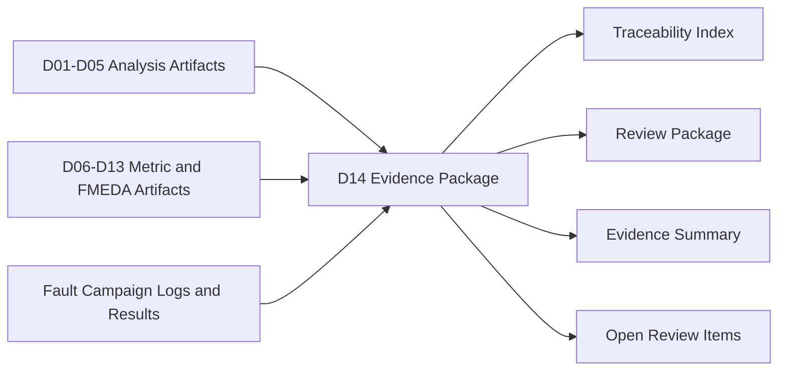
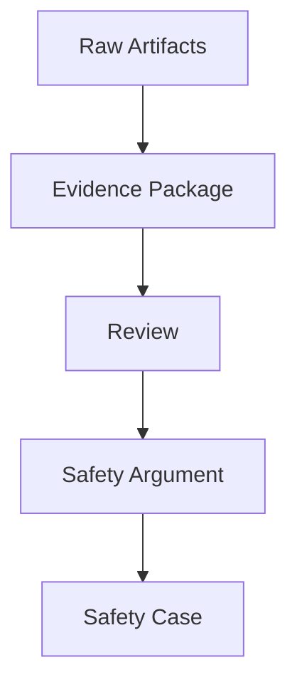
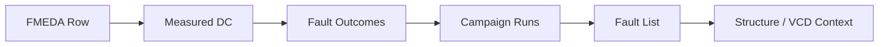
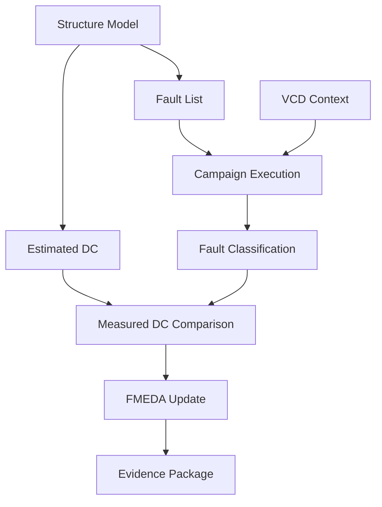
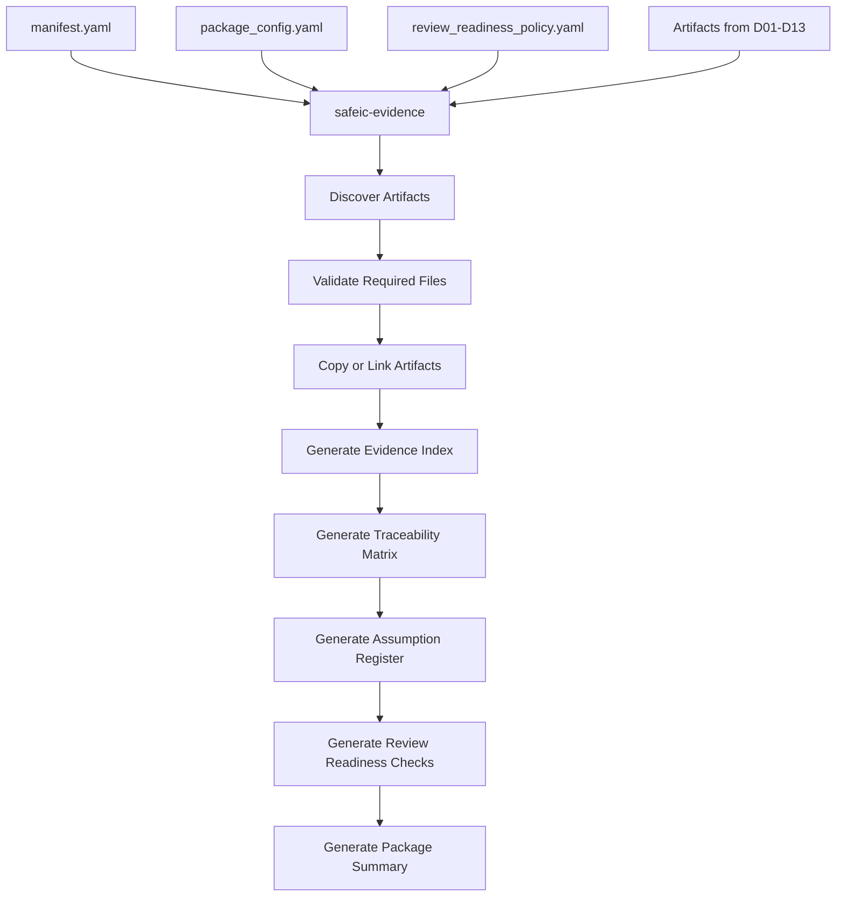
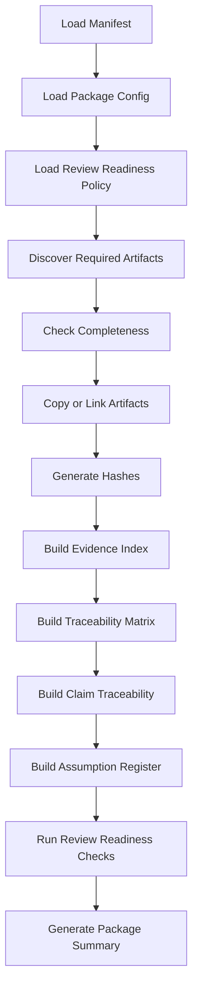
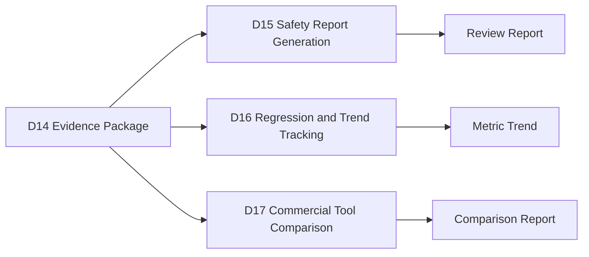

# [Automotive Safe-IC Practice 14] Safety Evidence Package: From FMEDA Tables to Reviewable Safety Artifacts

**Author**: Darren H. Chen  
**Direction**: Automotive Chip Functional Safety Analysis and Fault Injection Practice  
**Demo**: D14_safety_evidence_package  
**Tags**: Automotive Chip, Functional Safety, Safety Evidence, FMEDA, Fault Injection, Diagnostic Coverage, Residual FIT, Traceability, Review Package, Safety Case

---

## 1. Why This Article Matters

In the previous article, we updated FMEDA-style tables using measured diagnostic coverage, residual FIT, unsafe fault evidence, and review policy.

D13 generated outputs such as:

```text
fmeda_table.csv
fmeda_delta.csv
fmeda_review_items.csv
safety_metric_summary.csv
residual_fit_by_failure_mode.csv
residual_fit_by_part.csv
fmeda_summary.md
fmeda_warnings.csv
```

These outputs are useful for engineering analysis.

However, a safety workflow needs more than individual CSV files.

The next question is:

> How do we package all evidence into a coherent, reviewable, traceable safety evidence package?

The fourteenth demo in this repository is:

```text
D14_safety_evidence_package
```

The generic tool introduced in this article is:

```text
safeic-evidence
```

The purpose of `safeic-evidence` is to collect and organize safety artifacts from previous steps into a structured evidence package:

```text
input assumptions
FIT model evidence
structure extraction evidence
diagnostic coverage estimates
safety mechanism decisions
fault list generation evidence
VCD context evidence
fault campaign execution evidence
fault outcome classification evidence
measured diagnostic coverage evidence
FMEDA update evidence
review items
traceability index
package manifest
```

The central idea is:

> Safety evidence is not a pile of files. It is a traceable argument package that connects assumptions, design structure, fault injection results, metrics, FMEDA rows, and review decisions.

---

## 2. Where D14 Fits in the Flow

D14 is the first packaging and review-preparation step.



**Figure 1. D14 packages analysis artifacts, campaign artifacts, metric artifacts, and review items into a safety evidence package.**

Earlier demos answered:

```text
What was analyzed?
What assumptions were used?
Which faults were injected?
Which outcomes were observed?
What metrics were computed?
Which FMEDA rows were updated?
```

D14 answers:

```text
Can a reviewer trace each safety claim back to evidence?
Are all required artifacts present?
Which assumptions remain unvalidated?
Which results are measured and which are estimated?
Which review items remain open?
Can the package be archived or shared?
```

This changes the flow from analysis generation to evidence management.

---

## 3. What Is a Safety Evidence Package?

A safety evidence package is a structured folder or archive that contains:

```text
data files
reports
logs
configuration files
policies
manifests
traceability tables
review notes
warnings
checksums
summary documents
```

It should allow another engineer to understand:

```text
what was run
which design was used
which assumptions were used
which tools were used
which inputs and outputs were generated
which evidence supports each metric
which issues remain open
```

A minimal evidence package might look like:

```text
evidence_package/
  package_manifest.yaml
  evidence_index.csv
  traceability_matrix.csv
  review_items.csv
  summaries/
  metrics/
  fmeda/
  campaigns/
  assumptions/
  logs/
```

The package does not replace safety review.

It prepares the evidence for review.

---

## 4. Evidence Package Is Not the Same as Final Safety Case

A safety evidence package is not automatically a final safety case.

A final safety case usually includes structured arguments, claims, reasoning, independent review, and project-specific compliance mapping.

The evidence package is the artifact foundation.



**Figure 2. The evidence package organizes artifacts; review and argumentation turn them into a safety case.**

D14 focuses on:

```text
artifact completeness
traceability
evidence indexing
review readiness
reproducibility
```

Later reporting demos can build more formal safety arguments on top of this package.

---

## 5. Why Packaging Matters

Without packaging, safety work becomes hard to trust.

Common problems include:

```text
metrics without source data
FMEDA rows without evidence links
fault outcomes without campaign logs
measured DC without classification policy
campaign results without VCD context
review items separated from unsafe faults
scripts without input manifests
reports generated from unknown versions
```

A good evidence package prevents this by recording:

```text
artifact origin
artifact type
generation step
input dependencies
output dependencies
file hash
review status
evidence role
```

This makes safety analysis reproducible and reviewable.

---

## 6. Evidence Types

D14 should classify evidence by type.

Suggested evidence types:

```text
input_package
assumption
configuration
structural_model
fit_model
diagnostic_coverage
safety_mechanism_selection
fault_list
waveform_context
campaign_execution
fault_classification
measured_metric
fmeda_table
review_item
summary_report
log
warning
```

Example:

```csv
evidence_id,evidence_type,file,source_demo,review_status
E001,input_package,D01/outputs/input_inventory.csv,D01,reviewed
E020,structural_model,D05/outputs/structure_graph.json,D05,auto_generated
E050,fault_classification,D11/outputs/fault_outcomes.csv,D11,review_required
E070,fmeda_table,D13/outputs/fmeda_table.csv,D13,review_required
```

Evidence type helps reviewers know how to use each artifact.

---

## 7. Evidence Roles

A file can have a specific role in the safety workflow.

Suggested roles:

```text
source_input
derived_artifact
metric_input
metric_output
review_basis
traceability_link
warning_record
decision_record
execution_log
reproducibility_record
```

Example:

```csv
file,role
fault_outcomes.csv,metric_input
measured_dc_by_failure_mode.csv,metric_output
fmeda_review_items.csv,review_basis
manifest.yaml,reproducibility_record
campaign_status.csv,execution_log
```

This prevents a reviewer from treating all files equally.

Some files are inputs.  
Some are outputs.  
Some are evidence.  
Some are warnings.  
Some are decisions.

---

## 8. Package Manifest

The package manifest is the top-level description of the evidence package.

Example:

```yaml
package:
  name: automotive_safeic_practice_d14_evidence_package
  demo: D14_safety_evidence_package
  top_module: toy_counter
  created_by: safeic-evidence
  package_version: 0.1

scope:
  design: toy_counter
  safety_scope: functional safety analysis and fault injection practice
  artifact_range:
    from_demo: D01
    to_demo: D13

inputs:
  fmeda_table: ../D13_fmeda_update/outputs/fmeda_table.csv
  fault_outcomes: ../D11_fault_outcome_classification/outputs/fault_outcomes.csv
  measured_dc: ../D12_measured_diagnostic_coverage/outputs/measured_dc_summary.md
  campaign_status: ../D10_fault_campaign_execution/outputs/campaign_status.csv

outputs:
  evidence_index: outputs/evidence_index.csv
  traceability_matrix: outputs/traceability_matrix.csv
  package_summary: outputs/evidence_package_summary.md
```

The manifest defines the evidence package boundary.

---

## 9. Evidence Index

The evidence index is the core file list.

Recommended columns:

```text
evidence_id
file_path
artifact_name
artifact_type
evidence_role
source_demo
source_tool
input_or_output
review_status
hash
description
```

Example:

```csv
evidence_id,file_path,artifact_type,evidence_role,source_demo,review_status,description
E001,D03/outputs/base_fit_report.csv,fit_model,metric_input,D03,reviewed,base FIT contribution table
E002,D06/outputs/endpoint_dc.csv,diagnostic_coverage,metric_input,D06,review_required,estimated endpoint diagnostic coverage
E003,D11/outputs/fault_outcomes.csv,fault_classification,metric_input,D11,review_required,classified fault outcomes
E004,D13/outputs/fmeda_table.csv,fmeda_table,review_basis,D13,review_required,updated FMEDA table
```

This file answers:

```text
What evidence exists?
Where is it?
What is it for?
Where did it come from?
Has it been reviewed?
```

---

## 10. Traceability Matrix

The traceability matrix connects claims, metrics, and evidence.

Example trace chain:

```text
FMEDA row R003
→ failure mode FM_ALARM_NOT_ASSERTED
→ unsafe fault F004
→ fault outcome D11
→ campaign run D10
→ fault list D08
→ VCD context D09
→ structure model D05
```

A matrix row could look like:

```csv
trace_id,claim_or_row,evidence_id,dependency_type,description
T001,R003,E004,defines_row,FMEDA row for alarm not asserted
T002,R003,E003,supported_by_fault_outcome,unsafe fault F004 linked
T003,F004,E010,executed_by_campaign,D10 campaign run produced raw result
T004,F004,E008,defined_by_fault_list,D08 fault list defined target and expected alarm
T005,F004,E009,context_from_vcd,D09 VCD context provided injection window
```



**Figure 3. Traceability links FMEDA rows and metrics back to fault outcomes, campaign runs, fault lists, and structural context.**

This is one of the most important D14 outputs.

---

## 11. Claim-Oriented Traceability

Instead of tracing only files, D14 should also trace engineering claims.

Example claims:

```text
C001: toy_counter.count data corruption is protected by endpoint parity.
C002: toy_counter.alarm path remains weak and requires review.
C003: measured DC for FM_ALARM_NOT_ASSERTED is low.
C004: diagnostic state corruption remains unsafe.
```

Claim table:

```csv
claim_id,claim,claim_type,status,primary_evidence,review_status
C001,toy_counter.count data corruption is protected by endpoint parity,coverage_claim,supported,E012,low_confidence
C002,toy_counter.alarm path remains weak,risk_claim,supported,E030,review_required
C003,FM_ALARM_NOT_ASSERTED measured DC is 0.0,metric_claim,supported,E025,review_required
```

Claims are more review-friendly than raw files.

A reviewer usually asks:

```text
What are you claiming?
What evidence supports it?
What remains uncertain?
```

D14 should help answer this.

---

## 12. Evidence Completeness Check

The package should check whether required artifacts are present.

Example required artifacts:

```text
input inventory
FIT report
structure graph
estimated DC
safety mechanism selection
fault list
VCD context
campaign status
fault outcomes
measured DC
FMEDA table
review items
```

Completeness output:

```csv
required_artifact,expected_file,present,status
base_fit_report,D03/outputs/base_fit_report.csv,true,PASS
structure_graph,D05/outputs/structure_graph.json,true,PASS
fault_outcomes,D11/outputs/fault_outcomes.csv,true,PASS
fmeda_table,D13/outputs/fmeda_table.csv,true,PASS
campaign_logs,D10/runs,false,WARN
```

Completeness is not enough for safety, but missing artifacts immediately weaken the package.

---

## 13. Evidence Quality Check

Completeness answers:

```text
Does the file exist?
```

Evidence quality asks:

```text
Is the evidence usable and strong enough?
```

Quality factors include:

```text
review status
confidence
sample size
unresolved ratio
not-classified ratio
warnings
scope mismatch
missing signals
low evidence coverage
open review items
```

Example:

```csv
evidence_area,status,reason
fault_classification,PASS,no unresolved faults in demo sample
measured_dc,LOW_CONFIDENCE,sample size is too small
fmeda_update,REVIEW_REQUIRED,unsafe faults linked to two rows
campaign_execution,PASS,all demo runs executed or emulated
```

Evidence quality should be visible in the package summary.

---

## 14. Review Items Integration

D13 generated review items.

D14 should include them and connect each review item to evidence.

Example:

```csv
item_id,severity,row_id,issue,evidence_id,recommended_action,status
I001,HIGH,R003,alarm path has unsafe fault,E030,add redundant alarm or alarm path monitor,open
I002,MEDIUM,R002,diagnostic state unprotected,E031,add protection or justify residual risk,open
I003,LOW,R001,measured DC confidence low,E025,increase campaign sample size,open
```

This turns the evidence package into a practical engineering handoff.

The package should not hide open issues.

Open issues are exactly what reviewers need to see.

---

## 15. Assumption Register

A safety evidence package should include assumptions.

Examples:

```text
fault model set is limited to stuck-at and transient flip
toy design is representative only for methodology
measured DC is count-based unless otherwise configured
safe faults are excluded from primary DC
unresolved faults are reported separately
emulation mode results are not final validation evidence
```

Assumption register example:

```csv
assumption_id,assumption,source,status,impact
A001,fault models are limited to stuck_at_0/stuck_at_1/transient_flip,D08,active,limits coverage scope
A002,primary measured DC uses detected/(detected+unsafe),D12,active,affects measured DC value
A003,D10 demo campaign may run in emulation mode,D10,active,not final validation evidence
A004,measured DC with low sample size does not replace estimated DC,D13,active,keeps FMEDA conservative
```

Assumptions are not weaknesses by themselves.

Unstated assumptions are the real problem.

---

## 16. Configuration and Policy Archive

D14 should archive configuration and policy files.

Examples:

```text
dc_policy.yaml
selection_policy.yaml
faultgen_policy.yaml
vcd_policy.yaml
campaign_policy.yaml
classification_policy.yaml
measurement_policy.yaml
fmeda_update_policy.yaml
```

Why archive policies?

Because metrics cannot be interpreted without knowing policy.

For example:

```text
measured DC = 0.60
```

means little unless we know:

```text
safe faults excluded?
unresolved faults excluded?
count-based or FIT-weighted?
late alarms counted?
secondary alarms allowed?
low confidence update allowed?
```

The policy archive makes the package reproducible.

---

## 17. Artifact Hashes

For review and reproducibility, D14 can compute file hashes.

Example:

```csv
evidence_id,file_path,sha256
E001,D13/outputs/fmeda_table.csv,9e2a...
E002,D12/outputs/measured_dc_by_failure_mode.csv,4a17...
E003,D11/outputs/fault_outcomes.csv,bb09...
```

Hashes help detect accidental changes after packaging.

For an early demo, hashes are optional but recommended.

---

## 18. Evidence Dependency Graph

A dependency graph shows how artifacts depend on each other.

Example:



**Figure 4. Evidence dependency graph shows how earlier analysis and campaign artifacts feed FMEDA and the evidence package.**

D14 can generate this graph as Markdown Mermaid text.

This is useful for documentation and GitHub presentation.

---

## 19. Package Summary Report

The evidence package summary should be readable by engineers.

A good summary includes:

```text
package scope
design under analysis
artifact completeness
key metrics
key unsafe findings
key open review items
assumptions
evidence quality
next recommended actions
```

Example summary:

```md
# D14 Safety Evidence Package Summary

Design: toy_counter  
Scope: functional safety analysis and fault injection practice  
Evidence range: D01 to D13  

## Key Metrics

Total base FIT: 0.078  
Total residual FIT: 0.0204  
Weighted selected DC: 0.738  

## Key Findings

1. Counter state data corruption is protected by endpoint parity.
2. Diagnostic state corruption remains unsafe.
3. Alarm-not-asserted failure mode remains unsafe.
4. Measured DC sample size is low.

## Review Items

- Add or justify alarm path protection.
- Add protection for diagnostic state.
- Expand fault campaign sample size.

## Evidence Quality

Package completeness: PASS  
Metric confidence: LOW for demo sample  
Open high-severity review items: 1
```

The summary is not just a cover page.

It is the entry point for review.

---

## 20. Review Readiness Criteria

D14 can define review readiness criteria.

Example:

```yaml
review_readiness:
  required:
    - fmeda_table_present
    - fault_outcomes_present
    - measured_dc_present
    - review_items_present
    - assumptions_present

  quality_gates:
    max_missing_required_artifacts: 0
    max_high_severity_open_items_for_release: 0
    max_unresolved_ratio_for_measured_update: 0.10
    require_policy_archive: true
```

Output:

```csv
criterion,status,reason
fmeda_table_present,PASS,file found
fault_outcomes_present,PASS,file found
measured_dc_present,PASS,file found
high_severity_open_items,FAIL,1 high severity review item open
policy_archive_present,PASS,policy files indexed
```

This makes review readiness explicit.

---

## 21. Evidence Package Structure

Suggested directory structure:

```text
D14_safety_evidence_package/
  README.md
  run_demo.sh
  run_demo.csh
  manifest.yaml

  inputs/
    package_config.yaml
    review_readiness_policy.yaml

  package/
    package_manifest.yaml
    evidence_index.csv
    traceability_matrix.csv
    claim_traceability.csv
    assumption_register.csv
    review_items.csv
    completeness_check.csv
    evidence_quality.csv
    artifact_hashes.csv

    summaries/
      evidence_package_summary.md
      metric_summary.md
      fmeda_summary.md

    metrics/
      measured_dc_by_endpoint.csv
      measured_dc_by_failure_mode.csv
      measured_residual_fit.csv
      safety_metric_summary.csv

    fmeda/
      fmeda_table.csv
      fmeda_delta.csv
      fmeda_review_items.csv

    campaign/
      campaign_status.csv
      raw_fault_results.csv
      fault_outcomes.csv

    policies/
      measurement_policy.yaml
      classification_policy.yaml
      fmeda_update_policy.yaml

    logs/
      warnings.csv
      package_build.log

  outputs/
    package_status.csv
    evidence_package_summary.md
```

The package folder can later be archived as:

```text
automotive_safeic_practice_d14_evidence_package.zip
```

---

## 22. Package Configuration

Example `package_config.yaml`:

```yaml
package:
  name: automotive_safeic_practice_d14_evidence_package
  top_module: toy_counter
  include_hashes: true
  copy_artifacts: true
  preserve_relative_paths: true

artifact_sources:
  D03_base_fit:
    path: ../D03_base_fit_rate/outputs/base_fit_report.csv
    type: fit_model
    role: metric_input

  D11_fault_outcomes:
    path: ../D11_fault_outcome_classification/outputs/fault_outcomes.csv
    type: fault_classification
    role: metric_input

  D12_measured_dc:
    path: ../D12_measured_diagnostic_coverage/outputs/measured_dc_summary.md
    type: measured_metric
    role: summary_report

  D13_fmeda_table:
    path: ../D13_fmeda_update/outputs/fmeda_table.csv
    type: fmeda_table
    role: review_basis
```

This file tells `safeic-evidence` what to package.

---

## 23. Main Output: `evidence_index.csv`

Example:

```csv
evidence_id,file_path,artifact_type,evidence_role,source_demo,review_status,description
E001,metrics/base_fit_report.csv,fit_model,metric_input,D03,reviewed,base FIT report
E002,campaign/fault_outcomes.csv,fault_classification,metric_input,D11,review_required,classified fault outcomes
E003,metrics/measured_dc_by_failure_mode.csv,measured_metric,metric_output,D12,review_required,measured DC by failure mode
E004,fmeda/fmeda_table.csv,fmeda_table,review_basis,D13,review_required,updated FMEDA table
```

This is the package inventory.

---

## 24. Main Output: `traceability_matrix.csv`

Example:

```csv
trace_id,source,target,relationship,description
T001,R003,F004,supported_by_unsafe_fault,alarm-not-asserted row linked to unsafe fault
T002,F004,D10_RUN_F004,executed_by,campaign run generated raw result
T003,D10_RUN_F004,D08_F004,defined_by_fault_list,fault came from generated list
T004,D08_F004,D09_CONTEXT,uses_context,VCD context provided injection and detection window
T005,R003,E004,included_in_fmeda,FMEDA row included in evidence package
```

This is the chain that makes the evidence reviewable.

---

## 25. Main Output: `claim_traceability.csv`

Example:

```csv
claim_id,claim,status,primary_evidence,supporting_evidence,open_issue
C001,counter state data corruption is covered by endpoint parity,supported,E003,E004,low sample size
C002,alarm-not-asserted remains an open risk,supported,E004,E002,unsafe fault F004
C003,diagnostic state requires protection,supported,E004,E002,unsafe fault F003
```

Claim traceability is useful for articles, reports, and review decks.

---

## 26. Main Output: `assumption_register.csv`

Example:

```csv
assumption_id,assumption,source_demo,status,impact
A001,fault model set is limited to stuck-at and transient flip,D08,active,campaign scope limited
A002,primary measured DC excludes safe and unresolved faults,D12,active,affects measured DC formula
A003,low-confidence measured DC does not replace estimated DC,D13,active,keeps FMEDA conservative
```

This makes assumptions explicit.

---

## 27. Main Output: `package_status.csv`

Example:

```csv
check,status,details
required_artifacts_present,PASS,all required artifacts found
hashes_generated,PASS,hashes generated for 18 artifacts
open_high_review_items,FAIL,1 high severity item open
metric_confidence,WARN,measured DC confidence is low for demo sample
package_ready_for_archive,WARN,package can be archived but not considered release-ready
```

Package status should be honest.

A demo package can be complete but still not release-ready.

---

## 28. The `safeic-evidence` Tool Architecture

The generic tool `safeic-evidence` can be implemented as a staged pipeline.



**Figure 5. `safeic-evidence` discovers, validates, indexes, traces, and summarizes safety evidence artifacts.**

Suggested internal modules:

```text
safeic_evidence/
  cli.py
  manifest.py
  load_config.py
  artifact_discovery.py
  artifact_copy.py
  hashing.py
  evidence_index.py
  traceability.py
  claims.py
  assumptions.py
  review_readiness.py
  package_summary.py
  report.py
```

Responsibilities:

| Module | Responsibility |
|---|---|
| `artifact_discovery.py` | Locate expected artifacts from previous demos |
| `artifact_copy.py` | Copy or link artifacts into package folder |
| `hashing.py` | Generate file hashes |
| `evidence_index.py` | Build evidence inventory |
| `traceability.py` | Build dependency and traceability matrix |
| `claims.py` | Build claim-oriented traceability |
| `assumptions.py` | Build assumption register |
| `review_readiness.py` | Apply readiness checks |
| `package_summary.py` | Generate human-readable summary |
| `report.py` | Generate CSV and Markdown outputs |

---

## 29. D14 Manifest

Example:

```yaml
project:
  name: automotive_safeic_practice
  demo: D14_safety_evidence_package
  top_module: toy_counter

inputs:
  package_config: inputs/package_config.yaml
  review_readiness_policy: inputs/review_readiness_policy.yaml

source_roots:
  demos_root: ..
  include_demos:
    - D03_base_fit_rate
    - D05_structural_safety_model
    - D08_fault_list_generation
    - D09_vcd_safety_context
    - D10_fault_campaign_execution
    - D11_fault_outcome_classification
    - D12_measured_diagnostic_coverage
    - D13_fmeda_update

outputs:
  package_dir: package
  package_status: outputs/package_status.csv
  summary: outputs/evidence_package_summary.md
```

The manifest defines the package build.

---

## 30. D14 Execution Flow



**Figure 6. D14 execution flow: discover artifacts, check completeness, package files, build traceability, record assumptions, and summarize review readiness.**

Example bash script:

```bash
#!/usr/bin/env bash
set -euo pipefail

safeic-evidence \
  --manifest manifest.yaml \
  --output-dir outputs
```

Example csh script:

```csh
#!/bin/csh -f

set DEMO = D14_safety_evidence_package
echo "Running $DEMO"

safeic-evidence \
  --manifest manifest.yaml \
  --output-dir outputs
```

Expected outputs:

```text
package/package_manifest.yaml
package/evidence_index.csv
package/traceability_matrix.csv
package/claim_traceability.csv
package/assumption_register.csv
package/review_items.csv
package/completeness_check.csv
package/evidence_quality.csv
package/artifact_hashes.csv
outputs/package_status.csv
outputs/evidence_package_summary.md
```

---

## 31. Validation Rules

`safeic-evidence` should validate:

```text
package_config.yaml exists
review readiness policy exists
required artifacts exist
artifact paths are unique
evidence IDs are unique
artifact types are valid
review statuses are valid
trace links reference existing evidence IDs
claim links reference existing evidence IDs
assumption IDs are unique
hash generation succeeds when enabled
package directory is writable
```

Example messages:

```text
[PASS] package config loaded
[PASS] D13 fmeda_table.csv found
[PASS] D11 fault_outcomes.csv found
[PASS] evidence index generated with 18 artifacts
[WARN] D10 campaign logs folder not found; package includes summary only
[WARN] one high-severity review item remains open
[ERROR] traceability link references unknown evidence ID E999
```

D14 should not pretend the package is complete when required artifacts are missing.

---

## 32. Common Mistakes

### 32.1 Treating Evidence as a File Dump

A folder of files is not an evidence package unless it has index, traceability, assumptions, and review status.

### 32.2 Losing Policy Files

Metrics cannot be interpreted without policy files.

Always archive classification, measurement, and update policies.

### 32.3 Hiding Open Review Items

Open issues are part of the evidence package.

They should be visible.

### 32.4 Missing Traceability

If FMEDA values cannot be traced back to campaign outcomes and assumptions, the package is weak.

### 32.5 Mixing Estimated and Measured Evidence Without Labels

Estimated values and measured results must be clearly distinguished.

### 32.6 Ignoring Artifact Versioning

A report without artifact hashes or version records is harder to reproduce.

### 32.7 Overclaiming Demo Evidence

A methodology demo package is not equivalent to production safety signoff.

The summary should state evidence scope and limitations.

---

## 33. How D14 Connects to Later Demos

D14 creates a consolidated evidence package.

Later demos can generate reports, dashboards, and iteration tracking.



**Figure 7. D14 provides the package foundation for safety reports, regression tracking, and tool comparison.**

Once evidence is packaged, later steps can focus on presentation, comparison, automation, and iteration.

---

## 34. Recommended Implementation Stages

D14 can be implemented in stages.

### Stage 1: Package Inventory

Collect key artifacts and generate `evidence_index.csv`.

Deliverables:

```text
evidence_index.csv
package_manifest.yaml
```

### Stage 2: Completeness and Quality Checks

Check required artifacts and summarize quality.

Deliverables:

```text
completeness_check.csv
evidence_quality.csv
package_status.csv
```

### Stage 3: Traceability Matrix

Link FMEDA rows, fault outcomes, campaign runs, and source artifacts.

Deliverables:

```text
traceability_matrix.csv
```

### Stage 4: Claims and Assumptions

Generate claim traceability and assumption register.

Deliverables:

```text
claim_traceability.csv
assumption_register.csv
```

### Stage 5: Package Summary and Archive

Generate summary and optional archive.

Deliverables:

```text
evidence_package_summary.md
automotive_safeic_practice_d14_evidence_package.zip
```

This staged approach makes D14 useful even before a formal report generator exists.

---

## 35. Summary

Safety evidence packaging is the step that turns analysis outputs into a reviewable artifact set.

The D14 demo:

```text
D14_safety_evidence_package
```

introduces the generic tool:

```text
safeic-evidence
```

The tool consumes:

```text
artifacts from D01-D13
package_config.yaml
review_readiness_policy.yaml
```

and generates:

```text
package_manifest.yaml
evidence_index.csv
traceability_matrix.csv
claim_traceability.csv
assumption_register.csv
review_items.csv
completeness_check.csv
evidence_quality.csv
artifact_hashes.csv
package_status.csv
evidence_package_summary.md
```

The central lesson is:

> Safety evidence becomes useful only when it is indexed, traceable, policy-aware, assumption-aware, and review-ready. A single metric or FMEDA table is not enough without the evidence chain behind it.

D14 prepares the workflow for reporting, comparison, and iterative safety improvement.

---

## 36. D14 Demo Checklist

For `D14_safety_evidence_package`, the expected deliverables are:

```text
[ ] README.md
[ ] run_demo.sh
[ ] run_demo.csh
[ ] manifest.yaml

[ ] inputs/package_config.yaml
[ ] inputs/review_readiness_policy.yaml

[ ] package/package_manifest.yaml
[ ] package/evidence_index.csv
[ ] package/traceability_matrix.csv
[ ] package/claim_traceability.csv
[ ] package/assumption_register.csv
[ ] package/review_items.csv
[ ] package/completeness_check.csv
[ ] package/evidence_quality.csv
[ ] package/artifact_hashes.csv

[ ] package/summaries/evidence_package_summary.md
[ ] package/metrics/measured_dc_by_endpoint.csv
[ ] package/metrics/measured_dc_by_failure_mode.csv
[ ] package/metrics/measured_residual_fit.csv
[ ] package/fmeda/fmeda_table.csv
[ ] package/fmeda/fmeda_delta.csv
[ ] package/fmeda/fmeda_review_items.csv
[ ] package/campaign/campaign_status.csv
[ ] package/campaign/fault_outcomes.csv
[ ] package/policies/classification_policy.yaml
[ ] package/policies/measurement_policy.yaml
[ ] package/policies/fmeda_update_policy.yaml

[ ] outputs/package_status.csv
[ ] outputs/evidence_package_summary.md
```

A successful D14 run should answer:

```text
Which artifacts are included in the evidence package?
Which required artifacts are missing?
Which metrics and FMEDA rows are supported by evidence?
Which claims are supported and which remain open?
Which assumptions are active?
Which review items remain unresolved?
Which artifacts are estimated versus measured?
Which files support measured DC and residual FIT?
Can a reviewer trace FMEDA rows back to fault outcomes and campaign data?
Is the package ready for review, archive, or further report generation?
```
