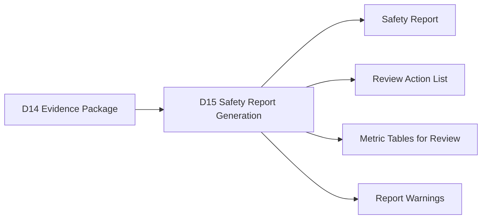
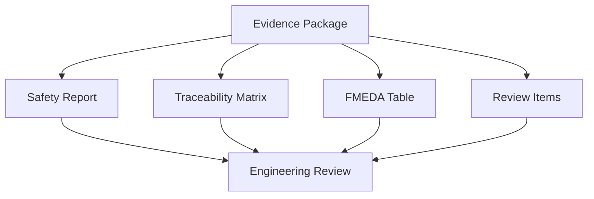
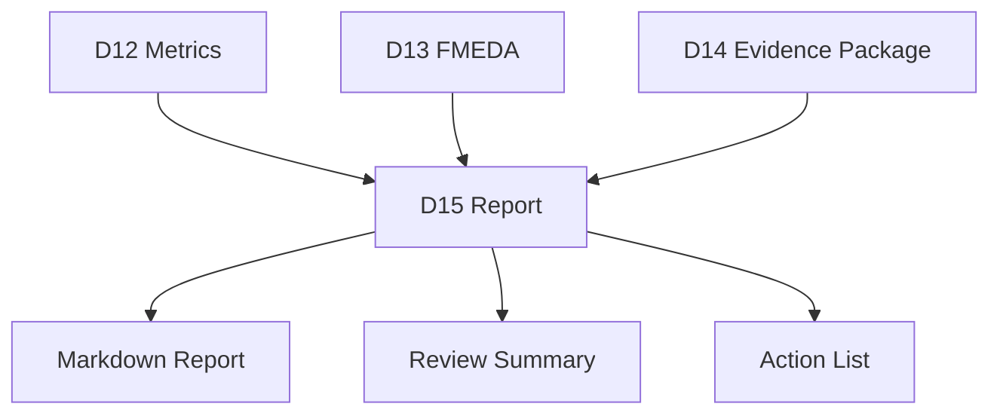
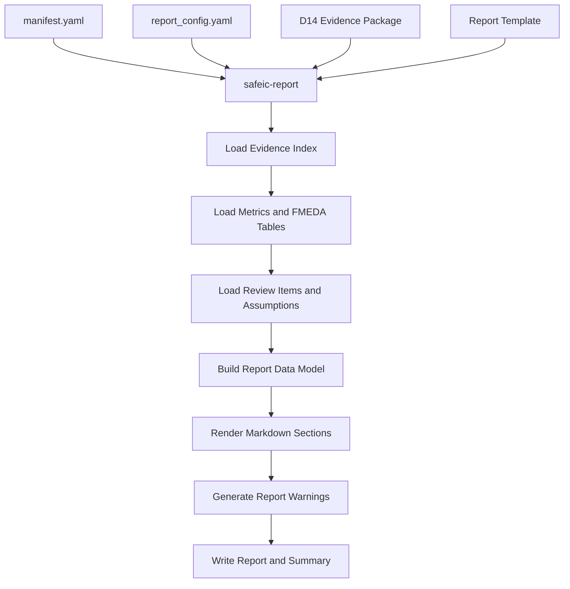
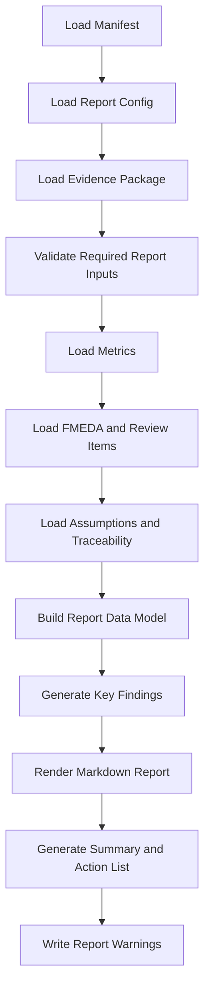
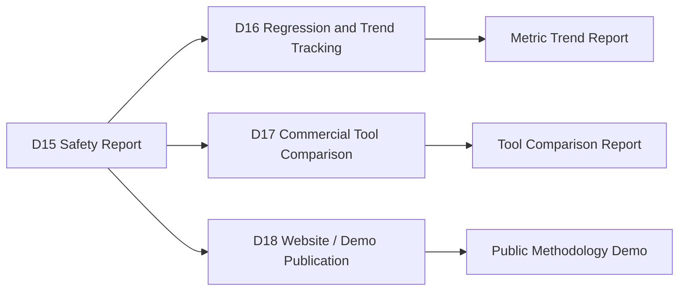

# [Automotive Safe-IC Practice 15] Safety Report Generation: From Evidence Package to Review-Ready Engineering Report

**Author**: Darren H. Chen  
**Direction**: Automotive Chip Functional Safety Analysis and Fault Injection Practice  
**Demo**: D15_safety_report_generation  
**Tags**: Automotive Chip, Functional Safety, Safety Report, Evidence Package, FMEDA, Fault Injection, Diagnostic Coverage, Residual FIT, Traceability, Review Report

---

## 1. Why This Article Matters

In the previous article, we built a safety evidence package.

D14 organized artifacts such as:

```text
package_manifest.yaml
evidence_index.csv
traceability_matrix.csv
claim_traceability.csv
assumption_register.csv
review_items.csv
completeness_check.csv
evidence_quality.csv
artifact_hashes.csv
evidence_package_summary.md
```

That evidence package is the artifact foundation.

However, a reviewer usually does not start by opening dozens of CSV files.

The next question is:

> How do we turn the evidence package into a readable, structured, review-ready safety engineering report?

The fifteenth demo in this repository is:

```text
D15_safety_report_generation
```

The generic tool introduced in this article is:

```text
safeic-report
```

The purpose of `safeic-report` is to generate a safety report from the D14 evidence package:

```text
package manifest
evidence index
FMEDA table
measured DC tables
residual FIT summaries
fault outcome summaries
review items
assumption register
traceability matrix
evidence quality checks
package status
```

and produce:

```text
safety_report.md
safety_report_summary.md
review_action_list.md
metric_tables_for_review.csv
report_warnings.csv
```

The central idea is:

> A safety report is not a reprint of all data. It is a structured explanation of scope, assumptions, evidence, metrics, findings, limitations, and review actions.

---

## 2. Where D15 Fits in the Flow

D15 sits after evidence packaging.



**Figure 1. D15 turns the evidence package into a review-ready engineering report.**

D14 answers:

```text
Which artifacts exist?
Where are they?
How are they connected?
Which assumptions and review items are active?
```

D15 answers:

```text
What does the evidence mean?
What are the key metrics?
What are the key risks?
Which safety mechanisms worked?
Which failure modes remain weak?
Which FMEDA rows require review?
What should be done next?
```

This is the transition from evidence management to safety communication.

---

## 3. Evidence Package vs Safety Report

The evidence package and the safety report have different purposes.

| Item | Purpose |
|---|---|
| Evidence package | Store, index, trace, and preserve artifacts |
| Safety report | Explain, summarize, interpret, and guide review |
| FMEDA table | Provide row-level safety data |
| Review action list | Convert findings into engineering actions |
| Traceability matrix | Link claims to evidence |

A report should not replace the evidence package.

Instead, it should point to the evidence package.



**Figure 2. The safety report explains evidence while the evidence package preserves traceability.**

A report without evidence is weak.

An evidence package without a report is difficult to review.

---

## 4. What Should the Report Do?

A useful safety report should:

```text
define the analysis scope
summarize the design under analysis
state assumptions and limitations
describe the analysis flow
summarize key metrics
highlight weak failure modes
highlight unsafe faults
summarize measured DC and residual FIT
show estimated-vs-measured gaps
show FMEDA update status
list open review items
link evidence files
recommend next actions
```

It should not:

```text
hide unresolved evidence
pretend demo data is production signoff
mix estimated and measured metrics without labels
omit policy assumptions
report a single number without context
```

The report is a technical communication artifact.

Its value comes from clarity, traceability, and honesty.

---

## 5. Report as a Layer on Top of Evidence

D15 should not recompute all metrics.

It should consume D14 and earlier outputs.

```text
D12:
  measured diagnostic coverage

D13:
  FMEDA table and review items

D14:
  evidence index, traceability, assumptions, package status

D15:
  report generation
```



**Figure 3. D15 is a report layer, not a metric recomputation layer.**

This separation keeps the workflow modular.

If D12 changes, regenerate D13 and D14, then regenerate D15.

---

## 6. Report Inputs

Suggested inputs:

```text
inputs/
  report_config.yaml
  report_template.md
  package_manifest.yaml
  evidence_index.csv
  package_status.csv
  evidence_package_summary.md
  fmeda_table.csv
  fmeda_review_items.csv
  safety_metric_summary.csv
  residual_fit_by_failure_mode.csv
  residual_fit_by_part.csv
  measured_dc_by_endpoint.csv
  measured_dc_by_failure_mode.csv
  measured_dc_by_safety_mechanism.csv
  estimated_vs_measured_dc.csv
  fault_outcomes.csv
  outcome_summary.csv
  assumption_register.csv
  claim_traceability.csv
  traceability_matrix.csv
```

D15 can read these from the D14 package folder.

For the first demo, the report generator can work with copied sample CSV files.

---

## 7. Report Outputs

Suggested outputs:

```text
outputs/
  safety_report.md
  safety_report_summary.md
  review_action_list.md
  metric_tables_for_review.csv
  report_warnings.csv
  report_manifest.yaml
```

Optional later outputs:

```text
safety_report.html
safety_report.pdf
review_deck_outline.md
```

For the GitHub demo, Markdown is the best first format.

Why?

Because Markdown is:

```text
easy to version-control
easy to review in GitHub
easy to diff
easy to generate
easy to convert later
```

---

## 8. Report Configuration

The report should be driven by a configuration file.

Example `report_config.yaml`:

```yaml
report:
  title: Automotive Safe-IC Functional Safety Analysis Report
  subtitle: Fault Injection and FMEDA Evidence Summary
  demo: D15_safety_report_generation
  top_module: toy_counter
  format: markdown

sections:
  include_scope: true
  include_flow_overview: true
  include_key_metrics: true
  include_fmeda_summary: true
  include_measured_dc: true
  include_fault_campaign: true
  include_unsafe_findings: true
  include_assumptions: true
  include_traceability: true
  include_review_items: true
  include_limitations: true
  include_next_actions: true

policies:
  show_estimated_vs_measured: true
  show_confidence_labels: true
  show_open_review_items: true
  fail_on_missing_required_tables: false
  warn_on_low_confidence_metrics: true

output:
  markdown: outputs/safety_report.md
  summary: outputs/safety_report_summary.md
  action_list: outputs/review_action_list.md
```

Report configuration makes the generator reusable.

Different audiences can use different report profiles.

---

## 9. Report Template

A simple report template can be Markdown with placeholders.

Example:

```md
# {{ report.title }}

Design: {{ project.top_module }}  
Evidence Package: {{ package.name }}  
Generated by: {{ tool.name }}  

## 1. Scope

{{ scope.summary }}

## 2. Key Metrics

{{ metrics.overview_table }}

## 3. FMEDA Summary

{{ fmeda.summary_table }}

## 4. Key Findings

{{ findings.key_findings }}

## 5. Review Items

{{ review.items_table }}
```

Template-based reporting keeps style separate from data extraction.

This is important when the same data must be reported for:

```text
GitHub article
internal review
customer demo
engineering checkpoint
management summary
```

---

## 10. Suggested Report Structure

A good D15 report can use the following structure:

```text
1. Executive Summary
2. Scope and Inputs
3. Analysis Flow Overview
4. Evidence Package Summary
5. Key Metrics
6. Diagnostic Coverage Summary
7. Residual FIT Summary
8. Fault Campaign Summary
9. Fault Outcome Summary
10. FMEDA Update Summary
11. Key Findings
12. Open Review Items
13. Assumptions and Limitations
14. Traceability Summary
15. Recommended Next Actions
16. Appendix: Artifact Index
```

This structure balances readability and traceability.

It starts with conclusions, then moves into evidence.

---

## 11. Executive Summary

The executive summary should be short and direct.

Example:

```md
## Executive Summary

This report summarizes a functional safety analysis and fault injection practice flow for `toy_counter`.

The current evidence indicates:

- Counter state data corruption is covered by endpoint parity in the demo campaign.
- Diagnostic state corruption remains unsafe.
- Alarm-not-asserted failure mode remains unsafe.
- Measured DC values are low-confidence because the sample campaign is intentionally small.
- FMEDA rows for diagnostic state and alarm path require review.

The evidence package is complete for the demo scope, but it is not production signoff evidence.
```

The executive summary should clearly state both strengths and limitations.

---

## 12. Scope and Inputs

The report must define scope.

Example:

```md
## Scope and Inputs

Design under analysis: `toy_counter`  
Safety analysis scope: functional safety analysis and fault injection practice  
Evidence range: D01 to D14  
Report generated from: D14 evidence package  

Included evidence:

- FIT model outputs
- structural safety model outputs
- estimated diagnostic coverage
- fault list generation
- VCD safety context
- fault campaign execution
- fault outcome classification
- measured diagnostic coverage
- FMEDA update
- review items and assumption register
```

Scope prevents overclaiming.

A demo report should explicitly state that it is a methodology demonstration.

---

## 13. Analysis Flow Overview

The report should include a flow diagram.

```mermaid
flowchart LR
    A[Input Package] --> B[FIT Modeling]
    B --> C[Structure Model]
    C --> D[Estimated DC]
    D --> E[Safety Mechanism Selection]
    E --> F[Fault List]
    F --> G[VCD Context]
    G --> H[Campaign Execution]
    H --> I[Outcome Classification]
    I --> J[Measured DC]
    J --> K[FMEDA Update]
    K --> L[Evidence Package]
    L --> M[Safety Report]
```



**Figure 4. Safety analysis and fault injection flow summarized in the generated report.**

A report should help reviewers understand where each artifact came from.

---

## 14. Key Metrics Section

The key metrics section should summarize:

```text
total base FIT
total residual FIT
weighted selected DC
measured DC
rows requiring review
unsafe fault count
unresolved fault count
evidence quality
execution quality
```

Example:

```md
## Key Metrics

| Metric | Value |
|---|---:|
| Total base FIT | 0.078 |
| Total residual FIT | 0.0204 |
| Weighted selected DC | 0.738 |
| FMEDA rows total | 3 |
| Rows requiring review | 2 |
| Rows with low confidence | 1 |
| Unsafe faults | 2 |
| Unresolved faults | 0 |
```

Metrics should be concise but include context.

A single measured DC number is not enough.

---

## 15. Diagnostic Coverage Summary

Diagnostic coverage should be summarized by meaningful groups.

Example:

```md
## Diagnostic Coverage Summary

### By Failure Mode

| Failure Mode | Detected | Unsafe | Measured DC | Confidence |
|---|---:|---:|---:|---|
| FM_DATA_CORRUPTION | 2 | 0 | 1.000 | LOW |
| FM_DIAGNOSTIC_STATE_CORRUPTION | 0 | 1 | 0.000 | LOW |
| FM_ALARM_NOT_ASSERTED | 0 | 1 | 0.000 | LOW |
```

The report should clearly label:

```text
estimated DC
measured DC
selected DC
confidence
```

Do not mix them.

---

## 16. Estimated vs Measured DC Section

This section is important because it explains whether assumptions match evidence.

Example:

```md
## Estimated vs Measured Diagnostic Coverage

| Group | Estimated DC | Measured DC | Status | Recommendation |
|---|---:|---:|---|---|
| toy_counter.count | 0.90 | 1.00 | INSUFFICIENT_SAMPLE | keep estimated and expand campaign |
| FM_ALARM_NOT_ASSERTED | 0.85 | 0.00 | MEASURED_LOWER_THAN_ESTIMATED | review mechanism assumption |
```

Interpretation text should be included:

```text
Measured DC is lower than the estimate for FM_ALARM_NOT_ASSERTED.
This indicates that the alarm path assumption is not supported by the current fault campaign evidence.
```

Numbers without interpretation are easy to misread.

---

## 17. Residual FIT Summary

Residual FIT is often the most useful risk-prioritization output.

Example:

```md
## Residual FIT Summary

| Failure Mode | Base FIT | Selected DC | Residual FIT | Review Status |
|---|---:|---:|---:|---|
| FM_DATA_CORRUPTION | 0.064 | 0.90 | 0.0064 | low_confidence |
| FM_DIAGNOSTIC_STATE_CORRUPTION | 0.004 | 0.00 | 0.0040 | review_required |
| FM_ALARM_NOT_ASSERTED | 0.010 | 0.00 | 0.0100 | review_required |
```

A short interpretation can follow:

```text
The dominant residual FIT contribution comes from the alarm-not-asserted failure mode.
This suggests that alarm path protection should be prioritized in the next design iteration.
```

---

## 18. Fault Campaign Summary

The report should summarize campaign execution.

Example:

```md
## Fault Campaign Summary

| Item | Value |
|---|---:|
| Golden run status | PASS |
| Faulted runs requested | 5 |
| Faulted runs executed | 5 |
| Passed runs | 5 |
| Failed runs | 0 |
| Not classified | 0 |
| Execution mode | emulation |
```

If the campaign used emulation mode, the report must say so.

Example:

```text
The current campaign results are generated in emulation mode for methodology demonstration.
They are not final design validation evidence.
```

This prevents overclaiming.

---

## 19. Fault Outcome Summary

The report should summarize classified outcomes.

Example:

```md
## Fault Outcome Summary

| Outcome | Count |
|---|---:|
| detected | 3 |
| safe | 0 |
| unsafe | 2 |
| unresolved | 0 |
| not_classified | 0 |
```

It should also highlight unsafe faults:

```md
### Unsafe Faults

| Fault ID | Node | Failure Mode | Reason |
|---|---|---|---|
| F003 | toy_counter.count_parity | FM_DIAGNOSTIC_STATE_CORRUPTION | diagnostic state corrupted and no alarm observed |
| F004 | toy_counter.alarm | FM_ALARM_NOT_ASSERTED | alarm stuck inactive |
```

Unsafe findings should never be hidden deep in an appendix.

---

## 20. FMEDA Update Summary

The report should summarize FMEDA status.

Example:

```md
## FMEDA Update Summary

| Row | Failure Mode | Selected DC | Residual FIT | Review Status |
|---|---|---:|---:|---|
| R001 | FM_DATA_CORRUPTION | 0.90 | 0.0064 | low_confidence |
| R002 | FM_DIAGNOSTIC_STATE_CORRUPTION | 0.00 | 0.0040 | review_required |
| R003 | FM_ALARM_NOT_ASSERTED | 0.00 | 0.0100 | review_required |
```

This table shows where review is needed.

---

## 21. Key Findings Section

The key findings section should turn metrics into engineering statements.

Example:

```md
## Key Findings

1. Counter state corruption is covered by endpoint parity in the current demo campaign.
2. Diagnostic state corruption remains unsafe and requires additional protection or justification.
3. Alarm-not-asserted remains the dominant residual FIT contributor.
4. Measured DC sample size is too small to increase FMEDA selected DC.
5. Current evidence package is complete for the demo scope but not sufficient for production signoff.
```

This is where the report becomes useful to decision makers.

---

## 22. Open Review Items

The report should provide an action list.

Example:

```md
## Open Review Items

| ID | Severity | FMEDA Row | Issue | Recommended Action |
|---|---|---|---|---|
| I001 | HIGH | R003 | alarm path has unsafe fault | add redundant alarm or alarm path monitor |
| I002 | MEDIUM | R002 | diagnostic state unprotected | add protection or justify residual risk |
| I003 | LOW | R001 | measured DC confidence low | increase campaign sample size |
```

Review items should be actionable.

Avoid vague wording such as:

```text
Need more analysis.
```

Use specific actions:

```text
Add alarm path monitor or justify residual risk for FM_ALARM_NOT_ASSERTED.
```

---

## 23. Assumptions and Limitations

This section is critical.

Example:

```md
## Assumptions and Limitations

- The demo fault model set is limited to stuck-at and transient flip.
- The current campaign sample size is intentionally small.
- Primary measured DC uses detected / (detected + unsafe).
- Safe and unresolved faults are reported separately.
- Some results may be generated in emulation mode.
- The report demonstrates methodology and is not production safety signoff.
```

A report that openly states limitations is more credible.

---

## 24. Traceability Summary

The report should include a short traceability summary and point to full traceability files.

Example:

```md
## Traceability Summary

The following traceability artifacts are included in the evidence package:

- `evidence_index.csv`
- `traceability_matrix.csv`
- `claim_traceability.csv`
- `artifact_hashes.csv`

Example trace:

FMEDA row `R003` is linked to unsafe fault `F004`, which is linked to D10 campaign execution, D08 fault list generation, and D09 VCD safety context.
```

The full traceability matrix can remain in the evidence package.

The report should show enough to prove traceability exists.

---

## 25. Report Warnings

D15 should generate warnings when the report may be misleading.

Example warnings:

```text
measured DC sample size is low
campaign mode is emulation
high-severity review items remain open
measured DC lower than estimated DC for key failure mode
missing evidence file
unresolved ratio high
scope mismatch found
```

Example output:

```csv
warning_id,severity,message,source
W001,MEDIUM,Measured DC confidence is LOW for toy_counter.count,D12
W002,HIGH,FM_ALARM_NOT_ASSERTED has unsafe fault evidence,D13
W003,MEDIUM,Campaign execution mode is emulation,D10
```

Warnings should appear both in CSV and in the report.

---

## 26. Report Generation Policy

A report policy can control how strong statements are allowed to be.

Example:

```yaml
report_policy:
  allow_claim_supported_only_if:
    confidence_at_least: medium
    no_high_severity_open_items: true

  wording:
    low_confidence_prefix: "Current demo evidence suggests"
    high_confidence_prefix: "Evidence supports"

  warnings:
    show_emulation_warning: true
    show_low_sample_warning: true
    show_open_high_severity_warning: true
```

This prevents overclaiming.

For example:

```text
Bad:
  The design is safe.

Better:
  Current demo evidence shows endpoint parity detects selected counter-state faults,
  but alarm path and diagnostic state rows remain review-required.
```

The report generator should help enforce disciplined wording.

---

## 27. Audience Profiles

Different audiences need different reports.

Possible profiles:

```text
engineering_deep_dive
management_summary
customer_demo
github_methodology
internal_review
```

Example:

```yaml
audience_profile:
  name: github_methodology
  include_detailed_flow: true
  include_mermaid_diagrams: true
  include_limitations: true
  include_raw_table_links: true
  include_management_summary: false
```

For this article series, the default profile should be:

```text
github_methodology
```

It should explain the workflow and evidence structure, not just present final metrics.

---

## 28. Tool Architecture

The generic tool `safeic-report` can be implemented as a staged pipeline.



**Figure 5. `safeic-report` reads the evidence package, builds a report data model, renders sections, and emits review-ready documents.**

Suggested internal modules:

```text
safeic_report/
  cli.py
  manifest.py
  load_config.py
  load_package.py
  data_model.py
  metrics_section.py
  fmeda_section.py
  campaign_section.py
  findings.py
  assumptions.py
  traceability.py
  warnings.py
  render_markdown.py
  report_summary.py
```

Responsibilities:

| Module | Responsibility |
|---|---|
| `load_package.py` | Read D14 evidence package |
| `data_model.py` | Build unified report data |
| `metrics_section.py` | Render metric tables and interpretation |
| `fmeda_section.py` | Render FMEDA summary |
| `campaign_section.py` | Render campaign and outcome summary |
| `findings.py` | Generate key findings |
| `assumptions.py` | Render assumptions and limitations |
| `traceability.py` | Summarize evidence traceability |
| `warnings.py` | Generate report warnings |
| `render_markdown.py` | Render final Markdown |
| `report_summary.py` | Generate short summary |

---

## 29. D15 Directory Structure

Suggested directory:

```text
D15_safety_report_generation/
  README.md
  run_demo.sh
  run_demo.csh
  manifest.yaml

  inputs/
    report_config.yaml
    report_template.md

  package/
    evidence_index.csv
    package_status.csv
    assumption_register.csv
    traceability_matrix.csv
    claim_traceability.csv

    metrics/
      measured_dc_by_endpoint.csv
      measured_dc_by_failure_mode.csv
      measured_residual_fit.csv
      safety_metric_summary.csv
      estimated_vs_measured_dc.csv

    fmeda/
      fmeda_table.csv
      fmeda_review_items.csv

    campaign/
      campaign_status.csv
      fault_outcomes.csv
      outcome_summary.csv

  outputs/
    safety_report.md
    safety_report_summary.md
    review_action_list.md
    metric_tables_for_review.csv
    report_warnings.csv
    report_manifest.yaml
```

D15 consumes the package and generates reports.

It should not rerun campaign or recompute metrics unless explicitly configured.

---

## 30. D15 Manifest

Example:

```yaml
project:
  name: automotive_safeic_practice
  demo: D15_safety_report_generation
  top_module: toy_counter

inputs:
  report_config: inputs/report_config.yaml
  report_template: inputs/report_template.md
  evidence_package_dir: package

outputs:
  report: outputs/safety_report.md
  summary: outputs/safety_report_summary.md
  action_list: outputs/review_action_list.md
  metric_tables: outputs/metric_tables_for_review.csv
  warnings: outputs/report_warnings.csv
  report_manifest: outputs/report_manifest.yaml
```

The manifest makes report generation reproducible.

---

## 31. D15 Execution Flow



**Figure 6. D15 execution flow: load package, validate inputs, build report data, render report, and generate warnings.**

Example bash script:

```bash
#!/usr/bin/env bash
set -euo pipefail

safeic-report \
  --manifest manifest.yaml \
  --output-dir outputs
```

Example csh script:

```csh
#!/bin/csh -f

set DEMO = D15_safety_report_generation
echo "Running $DEMO"

safeic-report \
  --manifest manifest.yaml \
  --output-dir outputs
```

Expected outputs:

```text
outputs/safety_report.md
outputs/safety_report_summary.md
outputs/review_action_list.md
outputs/metric_tables_for_review.csv
outputs/report_warnings.csv
outputs/report_manifest.yaml
```

---

## 32. Validation Rules

`safeic-report` should validate:

```text
report_config.yaml exists
evidence package directory exists
evidence_index.csv exists
fmeda_table.csv exists if FMEDA section enabled
measured DC tables exist if metric section enabled
fault_outcomes.csv exists if campaign section enabled
assumption_register.csv exists if assumptions section enabled
review_items.csv exists if review section enabled
report template exists
output directory is writable
all required placeholders can be resolved
```

Example messages:

```text
[PASS] report config loaded
[PASS] evidence package found
[PASS] FMEDA table loaded
[PASS] measured DC by failure mode loaded
[WARN] campaign mode is emulation; report will include limitation note
[WARN] measured DC confidence is LOW for multiple groups
[ERROR] report template references unknown placeholder {{ metrics.unknown_table }}
```

Report generation should fail on invalid templates but warn on low-confidence data.

---

## 33. Common Mistakes

### 33.1 Reporting Metrics Without Context

Measured DC must be reported with scope, sample size, confidence, and policy.

### 33.2 Hiding Unsafe Findings

Unsafe faults and review-required FMEDA rows should appear in the main report.

### 33.3 Hiding Limitations

Demo scope, small sample size, and emulation mode should be explicitly stated.

### 33.4 Mixing Estimated, Measured, and Selected DC

Always label these separately.

### 33.5 Producing a Report That Cannot Be Traced

Every major finding should link back to evidence artifacts.

### 33.6 Overclaiming Safety

A report generated from methodology demo data should not claim production safety compliance.

### 33.7 Making the Report Too Long Without Summary

A long report must still start with an executive summary and key findings.

---

## 34. How D15 Connects to Later Demos

D15 creates a report from one evidence package.

Later demos can compare iterations, track regressions, and compare tool outputs.



**Figure 7. D15 creates the single-run report foundation for later trend analysis and tool comparison.**

A report for one run is useful.

A sequence of reports across iterations is much more powerful.

---

## 35. Recommended Implementation Stages

D15 can be implemented in stages.

### Stage 1: Static Markdown Report

Read key CSV files and generate `safety_report.md`.

Deliverables:

```text
safety_report.md
report_warnings.csv
```

### Stage 2: Template-Based Report

Add `report_template.md` and placeholder rendering.

Deliverables:

```text
safety_report.md
report_manifest.yaml
```

### Stage 3: Key Findings Generator

Automatically derive key findings from metrics and review items.

Deliverables:

```text
safety_report_summary.md
review_action_list.md
```

### Stage 4: Traceability Integration

Add traceability links into report sections.

Deliverables:

```text
traceability_summary.md
```

### Stage 5: Multi-Profile Reporting

Support GitHub, engineering review, and management summary profiles.

Deliverables:

```text
github_report.md
engineering_review_report.md
management_summary.md
```

This staged approach makes D15 immediately useful while keeping the architecture extensible.

---

## 36. Summary

Safety report generation turns a structured evidence package into a readable engineering report.

The D15 demo:

```text
D15_safety_report_generation
```

introduces the generic tool:

```text
safeic-report
```

The tool consumes:

```text
D14 evidence package
report_config.yaml
report_template.md
metrics
FMEDA tables
fault campaign summaries
assumptions
traceability
review items
```

and generates:

```text
safety_report.md
safety_report_summary.md
review_action_list.md
metric_tables_for_review.csv
report_warnings.csv
report_manifest.yaml
```

The central lesson is:

> A safety report should explain evidence, not merely copy data. It must state scope, assumptions, metrics, confidence, unsafe findings, FMEDA status, traceability, limitations, and next actions.

D15 makes the safety workflow readable and review-ready.

---

## 37. D15 Demo Checklist

For `D15_safety_report_generation`, the expected deliverables are:

```text
[ ] README.md
[ ] run_demo.sh
[ ] run_demo.csh
[ ] manifest.yaml

[ ] inputs/report_config.yaml
[ ] inputs/report_template.md

[ ] package/evidence_index.csv
[ ] package/package_status.csv
[ ] package/assumption_register.csv
[ ] package/traceability_matrix.csv
[ ] package/claim_traceability.csv

[ ] package/metrics/measured_dc_by_endpoint.csv
[ ] package/metrics/measured_dc_by_failure_mode.csv
[ ] package/metrics/measured_residual_fit.csv
[ ] package/metrics/safety_metric_summary.csv
[ ] package/metrics/estimated_vs_measured_dc.csv

[ ] package/fmeda/fmeda_table.csv
[ ] package/fmeda/fmeda_review_items.csv

[ ] package/campaign/campaign_status.csv
[ ] package/campaign/fault_outcomes.csv
[ ] package/campaign/outcome_summary.csv

[ ] outputs/safety_report.md
[ ] outputs/safety_report_summary.md
[ ] outputs/review_action_list.md
[ ] outputs/metric_tables_for_review.csv
[ ] outputs/report_warnings.csv
[ ] outputs/report_manifest.yaml
```

A successful D15 run should answer:

```text
What is the report scope?
Which evidence package was used?
What are the key metrics?
Which failure modes dominate residual FIT?
Which safety mechanisms appear effective?
Which faults remain unsafe?
Which FMEDA rows require review?
Which assumptions and limitations apply?
Which evidence files support the main findings?
Which review actions should be taken next?
Is the report suitable for GitHub methodology presentation or engineering review?
```
