# Automotive Safe-IC Practice 15: FMEDA Data Model — Part, Sub-Part, Failure Mode, SM, DC, and Residual FIT

Author: Darren H. Chen  
Direction: Automotive chip functional safety analysis and fault injection practice  
Demo: D15_fmeda_data_model_part_subpart_failure_mode_sm_dc_residual_fit  
Tags: ISO 26262, FMEDA, FIT, Diagnostic Coverage, Residual FIT, Safety Mechanism, Fault Campaign, Common Safety Database, Automotive Semiconductor, Safe-IC

---

## 1. From Safety Results to a Reviewable FMEDA Model

By D14, the flow has already produced several important safety artifacts:

```text
base FIT evidence
FIT-standard comparison evidence
structural endpoint / startpoint evidence
common database session manifest
safety mechanism exploration candidates
failure-mode to safety-mechanism mapping
fault list artifacts
simulation safety context
alarm and observe point contracts
fault campaign setup package
fault injection execution evidence
fault outcome classification
final metric input bridge
```

These artifacts are valuable, but they are still distributed across many files and stages.

A safety reviewer usually does not want to inspect only a fault list, only an alarm list, or only a metric summary. The reviewer wants to answer questions such as:

```text
Which hardware function is being assessed?
Which part or sub-part owns this failure mode?
What is the failure mode?
Which safety mechanism detects or controls it?
What diagnostic coverage is claimed?
Which fault campaign evidence supports that claim?
What residual FIT remains after coverage is credited?
Which cases are still unresolved?
```

D15 is where the previous engineering artifacts are organized into a **Failure Modes, Effects, and Diagnostic Analysis data model**.

The focus is not on producing one more report. The focus is on building a structured safety table that connects:

```text
part
sub-part
instance
failure mode
fault population
safety mechanism
diagnostic coverage
fault outcome
residual FIT
review status
evidence source
```

This is the point where the safety flow becomes audit-oriented.

---

## 2. D15 in the Full Safe-IC Flow

D15 sits after the fault campaign result writeback and before the top-down FMEDA flow.

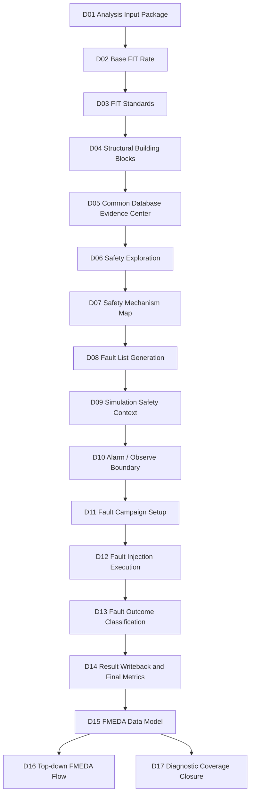

D14 answers:

```text
What did the campaign prove?
What metrics can be derived?
Which fault outcomes remain risky?
```

D15 answers:

```text
Where do these results belong in the FMEDA hierarchy?
How do we allocate FIT and DC to failure modes?
What evidence supports each row?
What needs review before top-down FMEDA execution?
```

D16 will use the D15 model to discuss the top-down FMEDA workflow. D17 will use the unresolved and unsafe rows from D15 to plan closure actions.

---

## 3. What FMEDA Means in This Series

FMEDA stands for:

```text
Failure Modes, Effects, and Diagnostic Analysis
```

For automotive semiconductor safety, FMEDA is a structured method for connecting hardware architecture to safety metrics.

A simplified FMEDA row may look like this:

```text
Part:          CPU subsystem
Sub-part:      Bus interface
Failure mode:  Wrong data transaction
Failure rate:  Lambda contribution
Safety mech:   End-to-end protocol protection
DC:            Diagnostic coverage
Residual FIT:  Failure rate remaining after coverage
Evidence:      Analysis reports and fault campaign results
```

A mature FMEDA is not merely a spreadsheet. It is a data model that supports:

```text
hierarchical decomposition
failure-mode classification
failure-rate allocation
safety-mechanism traceability
diagnostic coverage calculation
fault campaign evidence attachment
metric roll-up
review workflow
```

In D15, the goal is to build that data model from the earlier demo artifacts.

---

## 4. The D15 Core Data Model

The conceptual D15 data model is:

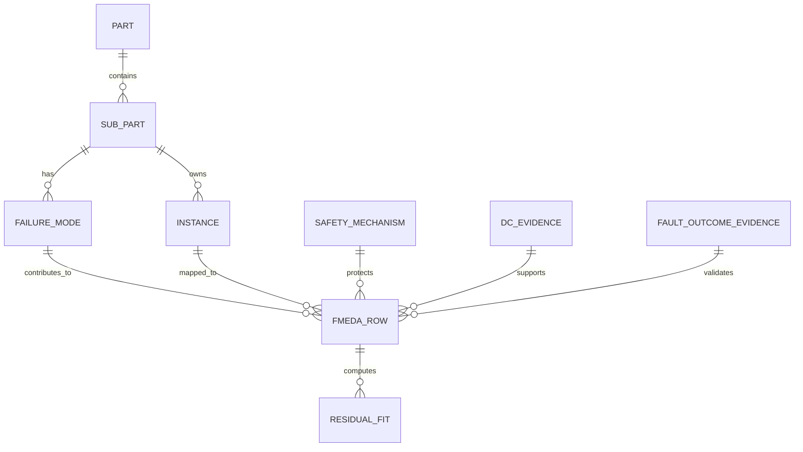

The central object is the `FMEDA_ROW`.

Each row should answer:

```text
What can fail?
Where does it fail?
How often is it expected to fail?
How is it detected or controlled?
How much of the failure contribution remains?
Which evidence supports this claim?
```

D15 does not need to hide complexity. It should expose enough fields so that later review can be precise.

---

## 5. Part and Sub-Part: The Structural Ownership Layer

A **part** is a major functional or architectural block.

Examples:

```text
CPU core
safety island
bus fabric
memory subsystem
timer subsystem
sensor interface
diagnostic controller
```

A **sub-part** is a more detailed decomposition under a part.

Examples:

```text
CPU core / register file
CPU core / decode stage
bus fabric / transaction control
memory subsystem / ECC wrapper
timer subsystem / compare logic
sensor interface / data path
```

The hierarchy helps answer:

```text
Which function owns the failure mode?
Where should the FIT be allocated?
Where should diagnostic coverage be credited?
Where should residual risk be reviewed?
```

A flat list of signals is not enough. FMEDA requires ownership.

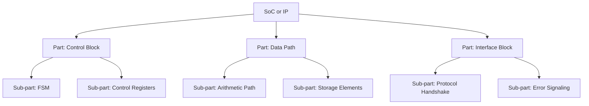

---

## 6. Instance Mapping: Connecting Design Hierarchy to FMEDA Hierarchy

The design hierarchy and the FMEDA hierarchy are related, but they are not always identical.

Design hierarchy may look like:

```text
top.u_core.u_ctrl.u_fsm
top.u_core.u_datapath.u_counter
top.u_bus.u_handshake
```

FMEDA hierarchy may look like:

```text
Part: Control block
Sub-part: State machine
Failure mode: Incorrect state transition
```

D15 needs an instance mapping table:

```csv
part_id,subpart_id,instance_path,structural_scope,evidence_source,review_status
P_CTRL,SP_FSM,top.u_core.u_ctrl.u_fsm,endpoint_cone,D04,reviewed
P_DATA,SP_COUNTER,top.u_core.u_datapath.u_counter,register_endpoint,D04,reviewed
```

This table prevents a common error:

```text
Assuming every RTL instance directly corresponds to one FMEDA row.
```

In practice, one instance can contribute to multiple failure modes, and one failure mode can span multiple instances.

---

## 7. Failure Mode: The Functional Meaning of a Fault

A fault is a physical or logical defect representation.

Examples:

```text
stuck-at-0
stuck-at-1
transient bit flip
temporary logic inversion
delayed transition
```

A failure mode is the functional effect category.

Examples:

```text
wrong state transition
wrong output value
missing alarm assertion
invalid protocol handshake
latent corruption of a register
incorrect memory data returned
```

D15 must bridge the two.

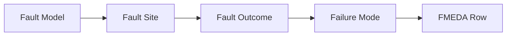

A fault list alone does not provide FMEDA meaning. It says where faults are injected. FMEDA says what those faults mean for the safety function.

---

## 8. Failure Effect and Failure Mode Are Not the Same

A **failure mode** describes how an element fails.

A **failure effect** describes what happens to the system or safety goal because of that failure.

Example:

```text
Failure mode:
    counter state corruption

Local effect:
    wrong counter value

System effect:
    timing monitor releases control too early

Safety effect:
    safety goal may be violated if no alarm or safe state is reached
```

D15 should represent at least two layers:

```text
local_effect
system_effect
```

This separation is important because two different failure modes may have the same safety effect.

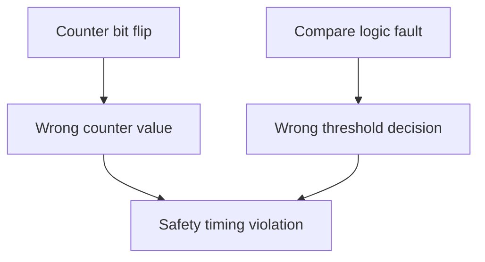

FMEDA review becomes clearer when local and system effects are separated.

---

## 9. Safety Mechanism: Detection, Control, or Correction

A safety mechanism is a design feature or diagnostic feature that detects, controls, or corrects a fault.

Examples:

```text
endpoint parity
protocol parity
ECC
duplication with comparison
triplication with voting
watchdog
timeout monitor
range checker
control-flow monitor
lockstep comparison
```

D15 should not only store the mechanism name. It should store its **intent**.

Suggested fields:

```csv
sm_id,sm_name,sm_family,detection_type,alarm_required,coverage_claim,evidence_source,review_status
SM_PARITY,Endpoint parity,parity,detection,true,estimated,D07+D13,review
SM_ECC,Endpoint ECC,ecc,correction,true,estimated,D07+D13,review
SM_TMR,Triplication,redundancy,masking_or_detection,true,estimated,D07+D13,review
```

The distinction matters because:

```text
Detection mechanism -> must have alarm or safe-state response.
Correction mechanism -> may prevent observable failure.
Masking mechanism -> may classify many faults as safe.
```

---

## 10. Diagnostic Coverage: What It Means in D15

Diagnostic Coverage, or DC, is not just a percentage.

A simplified view is:

```text
DC = covered relevant fault contribution / total relevant fault contribution
```

But D15 must keep the context:

```text
permanent DC or transient DC?
count-weighted or FIT-weighted?
estimated or validated?
based on safety exploration or fault campaign?
computed per endpoint, per failure mode, or per sub-part?
are unresolved faults excluded, included, or reviewed separately?
```

A D15 row should therefore store:

```csv
dc_perm_estimate,dc_trans_estimate,dc_perm_validated,dc_trans_validated,dc_source,dc_status
```

Example:

```text
dc_source = "exploration_estimate"
dc_status = "needs_campaign_validation"
```

or:

```text
dc_source = "fault_campaign_result"
dc_status = "validated_with_open_unresolved"
```

This prevents a misleading FMEDA row where a single DC number appears without its evidence quality.

---

## 11. Residual FIT: The Remaining Risk After Coverage

Residual FIT is the failure-rate contribution that remains after diagnostic coverage is credited.

A conceptual formula is:

```text
residual_fit = allocated_fit * (1 - diagnostic_coverage)
```

In real FMEDA work, the calculation may be split by:

```text
permanent vs transient
single-point vs residual fault
latent fault
safe fault
multiple-point fault
failure mode
safety mechanism
part and sub-part
ASIL target
```

D15 should preserve the split rather than collapse everything too early.

Suggested fields:

```csv
lambda_perm_allocated
lambda_trans_allocated
dc_perm_credit
dc_trans_credit
residual_fit_perm
residual_fit_trans
residual_fit_total
```

Example conceptual row:

```csv
fm_id,lambda_perm_allocated,dc_perm_credit,residual_fit_perm
FM_STATE_CORRUPTION,10.0,0.90,1.0
```

This is not enough for signoff, but it is enough to illustrate the data relationship.

---

## 12. Permanent and Transient Faults Must Remain Separate

A permanent fault is persistent.

Examples:

```text
stuck-at fault
permanent short
permanent open
permanent logic defect
```

A transient fault is temporary.

Examples:

```text
single event upset
soft error
temporary bit flip
radiation-induced upset
```

D15 should not merge them too early because:

```text
they may use different FIT models
they may have different fault populations
they may require different safety mechanisms
they may produce different diagnostic coverage
they may affect SPFM, LFM, or PMHF differently
```

A strong FMEDA row keeps permanent and transient values side by side:

```csv
failure_mode,lambda_perm,lambda_trans,dc_perm,dc_trans,residual_perm,residual_trans
```

This also helps explain why one safety mechanism may be strong against transient corruption but weak against permanent logic defects.

---

## 13. Safe, Detected, Unsafe, and Unresolved Outcomes

D13 classified fault outcomes into:

```text
detected
safe
unsafe
unresolved
```

D15 must translate these outcomes into FMEDA meaning.

A practical interpretation is:

```text
detected
    fault affected behavior and alarm or diagnostic response occurred

safe
    fault did not affect safety-relevant behavior or was naturally masked

unsafe
    fault affected safety-relevant behavior without acceptable detection or control

unresolved
    evidence is insufficient to decide
```

D15 should not treat `unresolved` as safe.

A useful policy is:

```text
detected -> may support DC credit
safe -> may reduce dangerous contribution, but must be justified
unsafe -> contributes to residual risk
unresolved -> remains open for D17 closure
```

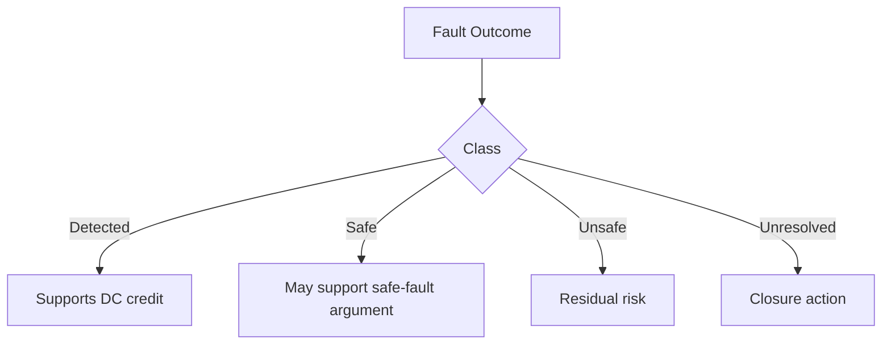

---

## 14. FMEDA Is a Join of Multiple Evidence Streams

D15 is best understood as a join operation.

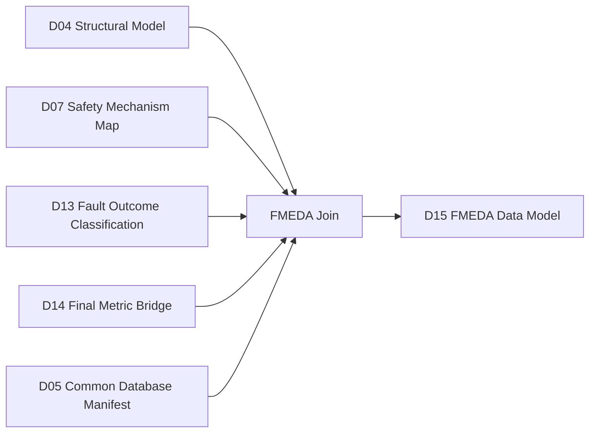

The join must preserve traceability.

For example:

```text
FMEDA row 001
    part: control block
    sub-part: state machine
    failure mode: wrong state transition
    safety mechanism: endpoint parity
    evidence:
        D04 endpoint inventory
        D07 EP-to-SM map
        D13 detected fault list
        D14 residual metric bridge
```

A row without evidence source is weak. A row with evidence links becomes reviewable.

---

## 15. Evidence Quality Levels

Not all evidence has the same strength.

D15 can classify evidence quality into levels:

```text
L0: manual assumption
L1: structural inference
L2: what-if exploration estimate
L3: parsed campaign outcome
L4: validated final metric session
L5: reviewed FMEDA approval
```

Example mapping:

```csv
evidence_source,evidence_level,meaning
D04 endpoint inventory,L1,structural evidence
D06 what-if estimate,L2,planning estimate
D13 parsed outcome,L3,fault campaign evidence or deterministic review evidence
D14 final metrics,L4,metric integration evidence
manual review,L5,approved safety argument
```

This prevents overclaiming.

If a row is based only on L2 evidence, it should not be presented as a fully validated DC result.

---

## 16. Allocating Lambda to Failure Modes

A major FMEDA task is allocating failure rate to failure modes.

A simplified allocation method is:

```text
part lambda
    -> sub-part lambda
        -> failure-mode lambda
```

Possible allocation bases include:

```text
gate count
flip-flop count
endpoint contribution
DCE contribution
fault population weight
manual expert judgment
validated campaign data
```

D15 should record the allocation basis.

Example:

```csv
failure_mode_id,lambda_allocated,allocation_basis,evidence_source
FM_STATE_CORRUPTION,12.5,endpoint_fit_weight,D04+D14
FM_PROTOCOL_ERROR,5.2,protocol_endpoint_weight,D07+D14
FM_MEMORY_DATA_ERROR,20.0,memory_bit_weight,D04+D14
```

The number itself is not enough. The allocation method is part of the safety argument.

---

## 17. FIT-Weighted DC vs Fault-Count DC

Two DC calculations may produce different results.

Fault-count DC:

```text
covered faults / total faults
```

FIT-weighted DC:

```text
covered FIT contribution / total FIT contribution
```

If many low-risk faults are detected but a few high-FIT faults remain unsafe, fault-count DC can look good while residual risk remains high.

D15 should prefer FIT-aware interpretation whenever final metrics are available.

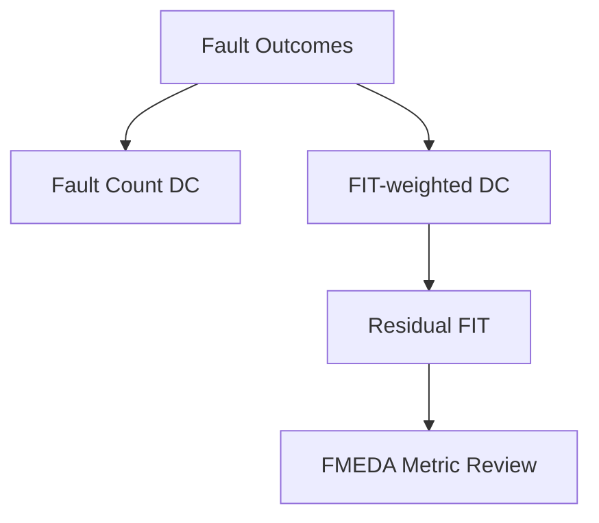

A reviewable data model should store both if available:

```csv
dc_fault_count
dc_fit_weighted
residual_fit
```

This makes the distinction visible.

---

## 18. Failure Mode to Safety Mechanism Traceability

D07 generated mapping candidates such as:

```text
failure mode -> endpoint -> safety mechanism -> alarm
```

D15 converts this into FMEDA traceability:

```text
failure mode -> diagnostic mechanism -> DC claim -> residual FIT
```

Example:

```csv
failure_mode_id,sm_id,alarm_id,dc_claim,evidence
FM_PROTOCOL_HANDSHAKE_CORRUPTION,SM_PROTOCOL_PARITY,ALM_PROTOCOL,0.90,D07+D13
```

The key is that the safety mechanism must be associated with the failure mode, not just with a signal name.

A signal-level map answers:

```text
Which endpoint has a mechanism?
```

An FMEDA map answers:

```text
Which failure mode is mitigated by this mechanism?
```

---

## 19. Alarm and Observe Point Evidence in FMEDA

D10 defined alarm and observe point boundaries.

D15 should carry that context because DC depends on observation policy.

Important fields:

```csv
alarm_signal
observe_point
ftti_window
outcome_rule
alarm_required
alarm_evidence_status
```

Example:

```text
If an alarm is required but not bound to a real signal, the DC row should be marked as review.
```

If an observe point is missing, classification may be incomplete.

This prevents a common problem:

```text
The safety mechanism is listed, but there is no observable diagnostic response.
```

FMEDA must connect the mechanism to its observable effect.

---

## 20. FTTI and Timing Sensitivity

FTTI means Fault Tolerant Time Interval.

It describes the time budget in which a fault must be detected or controlled before the safety goal is violated.

D15 should not only record whether an alarm fired. It should also record whether timing is acceptable.

Suggested fields:

```csv
ftti_cycles
alarm_latency_cycles
latency_margin
ftti_status
```

Conceptual logic:

```text
if alarm_latency <= ftti_window:
    timing_status = satisfied
else:
    timing_status = violation
```

This matters because a late alarm may not support the intended diagnostic coverage.

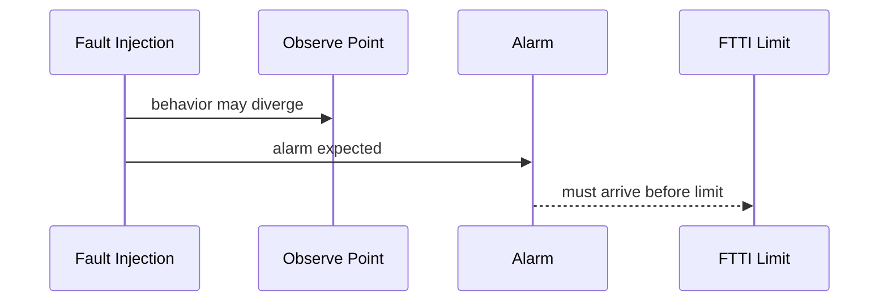

---

## 21. Unresolved Faults in FMEDA

Unresolved faults should be visible.

D15 should produce an unresolved table that can be consumed by D17.

Fields:

```csv
fault_id
failure_mode_id
part_id
subpart_id
endpoint
current_classification
reason
recommended_action
owner
closure_status
```

Recommended actions may include:

```text
extend VCD activity window
add observe point
bind alarm signal
improve safety mechanism map
rerun fault campaign
review fault as safe by expert judgment
mark as residual risk
```

Unresolved does not mean failed product. It means the evidence is not yet complete.

The FMEDA model should make that gap explicit.

---

## 22. Safe Fault Treatment

Safe faults can support the safety argument, but only if their definition is controlled.

A fault may be safe because:

```text
it does not propagate
it affects non-safety-critical logic
it is masked by logic
it is overwritten before observation
it changes an irrelevant signal
the design reaches a safe state
```

D15 should record the safe-fault rationale.

Example fields:

```csv
safe_fault_count
safe_fit
safe_rationale
safe_evidence_source
```

A weak row says:

```text
safe
```

A stronger row says:

```text
safe because it does not reach the safety-relevant observe boundary during the validated activity window
```

That difference matters during review.

---

## 23. Unsafe Fault Treatment

Unsafe faults are the strongest signal that closure is needed.

D15 should not average unsafe faults away.

For each unsafe contribution, record:

```csv
failure_mode_id
fault_id
allocated_fit
safety_mechanism
expected_alarm
actual_alarm_status
observe_point
residual_fit_contribution
closure_action
```

Unsafe rows usually lead to:

```text
add safety mechanism
improve alarm binding
add redundancy
improve test stimulus
change classification policy
accept residual risk with justification
```

D17 will use these rows as the primary closure target.

---

## 24. A Suggested D15 FMEDA Row Schema

A practical D15 row schema can be:

```csv
fmeda_row_id,
part_id,
part_name,
subpart_id,
subpart_name,
instance_path,
failure_mode_id,
failure_mode_name,
local_effect,
system_effect,
lambda_perm_allocated,
lambda_trans_allocated,
sm_id,
sm_name,
alarm_signal,
observe_point,
dc_perm,
dc_trans,
residual_fit_perm,
residual_fit_trans,
residual_fit_total,
detected_count,
safe_count,
unsafe_count,
unresolved_count,
evidence_level,
evidence_sources,
review_status
```

This is not the only possible schema, but it captures the required relationships.

It can be split into normalized tables for better engineering use, then exported into a flat CSV for review.

---

## 25. Normalized Tables vs Spreadsheet Export

A normalized model avoids duplication.

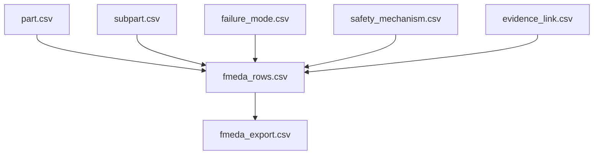

Recommended internal tables:

```text
part_catalog.csv
subpart_catalog.csv
instance_to_subpart_map.csv
failure_mode_catalog.csv
safety_mechanism_catalog.csv
coverage_credit_table.csv
residual_fit_table.csv
evidence_link_table.csv
fmeda_flat_export.csv
```

The flat export is convenient for human review, but the normalized tables are better for automation.

---

## 26. D15 Inputs

D15 should read from previous stages:

```text
D04 structural endpoint and DCE catalog
D05 common database manifest and object catalog
D07 failure-mode to safety-mechanism map
D10 alarm / observe boundary contract
D13 fault outcome classification
D14 final metric bridge and residual metric seed
```

A robust input manifest looks like:

```csv
input_group,artifact,purpose
structural,D04 endpoint inventory,part/sub-part mapping seed
database,D05 session manifest,evidence source identity
mapping,D07 EP-to-SM map,safety mechanism traceability
observation,D10 observation contract,alarm and observe policy
outcome,D13 classified faults,outcome evidence
metrics,D14 final metrics summary,residual FIT basis
```

This keeps D15 from becoming an isolated spreadsheet generator.

---

## 27. D15 Outputs

Expected D15 outputs include:

```text
part_catalog.csv
subpart_catalog.csv
instance_to_subpart_map.csv
failure_mode_catalog.csv
fmeda_row_table.csv
coverage_credit_table.csv
residual_fit_table.csv
fmeda_flat_export.csv
fmeda_review_dashboard.md
fmeda_open_items.csv
d15_handoff_to_d16.csv
d15_handoff_to_d17.csv
d15_quality_gate.csv
evidence_index.csv
demo_summary.md
```

The most important output is `fmeda_flat_export.csv`.

That file is the human-readable FMEDA-style table.

The most important engineering output is `evidence_index.csv`.

That file says which upstream artifacts support each FMEDA table.

---

## 28. The D15 Demo Architecture

The D15 demo should work as a model builder.

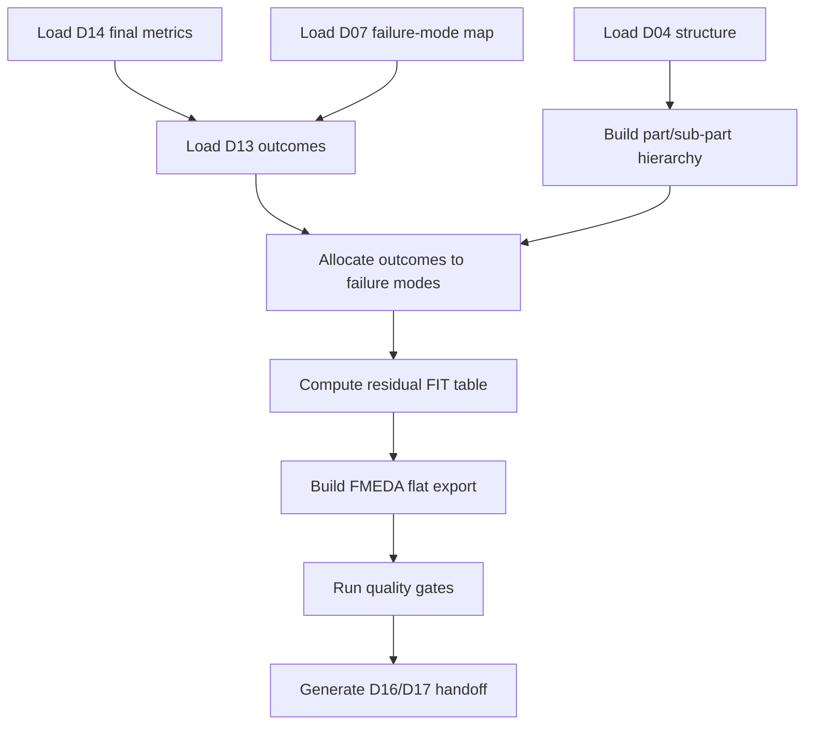

The demo should not hide the difference between:

```text
computed values
estimated values
review-only placeholders
missing evidence
```

That distinction is essential for credibility.

---

## 29. Quality Gates for D15

D15 should check at least:

```text
every FMEDA row has a part
every FMEDA row has a sub-part
every FMEDA row has a failure mode
every row has a failure-rate source
every row has a safety mechanism status
every claimed DC value has an evidence source
every residual FIT value can be traced to lambda and DC
unsafe rows are carried forward
unresolved rows are carried forward
flat export and normalized tables are consistent
D16 handoff exists
D17 closure handoff exists
```

Example quality gate categories:

```text
FAIL
    missing part/sub-part
    missing failure mode
    residual FIT cannot be computed
    unsafe/unresolved evidence dropped

WARN
    manual allocation
    estimated DC only
    alarm binding still review-level
    low evidence level
```

A strong FMEDA model is not one that has no open items. It is one that does not hide them.

---

## 30. How D15 Feeds D16

D16 will discuss top-down FMEDA flow.

D15 prepares:

```text
part hierarchy
sub-part hierarchy
failure modes
safety mechanism maps
coverage metrics
review status
FMEDA export seed
```

D16 can then focus on workflow:

```text
create FMEDA project
create part/sub-part structure
associate instances
associate failure modes
load safety mechanism maps
run per-failure-mode analysis
review safety metrics
export FMEDA results
```

Without D15, D16 would start from an empty GUI concept. With D15, D16 starts from structured evidence.

---

## 31. How D15 Feeds D17

D17 is about diagnostic coverage closure.

D15 provides the closure backlog:

```text
unsafe rows
unresolved rows
low-DC rows
missing alarm rows
missing observe point rows
estimated-only DC rows
manual-allocation rows
```

A closure backlog should include:

```csv
open_item_id,fmeda_row_id,issue_type,severity,recommended_action,owner,status
```

This converts FMEDA from a static document into an engineering loop.


---

## 32. Part/Sub-Part Naming Guidelines

Naming matters because FMEDA tables are reviewed by people from different teams.

Good names:

```text
P_CONTROL
SP_CONTROL_FSM
SP_CONTROL_STATUS_REGISTER
P_BUS_INTERFACE
SP_BUS_HANDSHAKE
SP_BUS_DATA_PATH
```

Weak names:

```text
part1
subpart2
block_x
misc_logic
```

A good naming convention should include:

```text
stable ID
human-readable name
design hierarchy mapping
owner
safety relevance
review status
```

Example:

```csv
subpart_id,subpart_name,parent_part,owner,safety_relevance
SP_BUS_HANDSHAKE,Bus handshake control,P_BUS_INTERFACE,design_team,ASIL_relevant
```

---

## 33. Failure Mode Naming Guidelines

Failure mode names should describe functional failure, not raw signal names.

Good examples:

```text
FM_STATE_CORRUPTION
FM_WRONG_DATA_OUTPUT
FM_MISSING_ALARM
FM_PROTOCOL_HANDSHAKE_ERROR
FM_LATENT_REGISTER_CORRUPTION
```

Weak examples:

```text
count_bit_0_fault
net_123_fault
u1_n45_error
```

The raw fault location belongs in the fault table. The failure mode should be stable across implementation changes.

This allows FMEDA to survive RTL refactoring.

---

## 34. Safety Mechanism Naming Guidelines

Safety mechanism naming should separate the mechanism family from the specific instance.

Example:

```text
SM_ENDPOINT_PARITY
SM_BUS_PROTOCOL_PARITY
SM_COUNTER_DUPLICATION_COMPARE
SM_MEMORY_ECC
SM_WATCHDOG_TIMEOUT
```

Each mechanism should carry:

```text
mechanism family
covered failure modes
alarm behavior
expected DC
evidence source
implementation status
```

A mechanism name without behavior is not enough.

---

## 35. Handling Third-Party IP and Black Boxes

FMEDA frequently includes blocks where internal implementation is not fully visible.

Examples:

```text
third-party IP
memory macro
analog block
licensed interface block
encrypted RTL
black-box safety island
```

D15 should support custom values:

```csv
part_id,subpart_id,lambda_override,dc_override,evidence_source,justification
```

But overrides must be labeled.

Possible statuses:

```text
supplier_provided
expert_judgment
analysis_estimate
campaign_validated
not_available
```

The review risk is not that overrides exist. The risk is that overrides are not traceable.

---

## 36. Manual Judgment Fields

FMEDA always contains engineering judgment.

D15 should represent it explicitly:

```csv
review_owner
review_decision
review_comment
assumption_id
justification
```

Example:

```text
review_decision = accept_with_assumption
assumption_id = ASM_003
justification = fault is outside safety-related operating mode
```

This makes assumptions reviewable and revisitable.

---

## 37. Data Versioning and Run Identity

Every FMEDA result depends on run identity.

Important fields:

```text
design version
D03 fit standard
mission profile
D14 metric source
fault campaign context
D13 outcome source
D10 observation contract
FMEDA schema version
```

A row should not simply say:

```text
residual FIT = 0.5
```

It should be traceable to:

```text
residual FIT = 0.5 under a specific design, FIT standard, safety context, and outcome evidence set
```

This is especially important when comparing IEC 62380-style and SN 29500-style FIT assumptions.

---

## 38. Example FMEDA Row

A simplified row:

```csv
fmeda_row_id,part,subpart,failure_mode,sm,dc_perm,residual_fit,status
FMEDA_001,Control Block,State Machine,Wrong state transition,Endpoint parity,0.90,0.12,review
```

A better row:

```csv
fmeda_row_id,part_id,subpart_id,instance_path,failure_mode_id,local_effect,system_effect,lambda_perm_allocated,sm_id,alarm_signal,observe_point,dc_perm_validated,residual_fit_perm,evidence_sources,review_status
FMEDA_001,P_CTRL,SP_FSM,top.ctrl.fsm,FM_STATE_CORRUPTION,illegal state,wrong control decision,1.2,SM_ENDPOINT_PARITY,alarm_ctrl_fsm,safe_state_o,0.90,0.12,D04+D07+D13+D14,review
```

The second row is longer, but it is much more useful.

---

## 39. Demo Command Model

The D15 demo should be runnable as a local evidence builder:

```bash
cd D15_fmeda_data_model_part_subpart_failure_mode_sm_dc_residual_fit
csh scripts/run_demo.csh
```

Expected external roots:

```text
D14_ROOT
D13_ROOT
D10_ROOT
D07_ROOT
D05_ROOT
D04_ROOT
```

The demo should generate reviewable tables and markdown summaries, not launch new fault campaigns by default.

D15 is primarily a data-model stage.

---

## 40. Key Takeaways

D15 is the point where safety evidence becomes a structured FMEDA model.

The central ideas are:

```text
Part and sub-part define ownership.
Failure mode defines functional meaning.
Safety mechanism defines diagnostic intent.
DC defines credited coverage.
Residual FIT defines remaining risk.
Fault outcomes provide validation evidence.
Common database sessions and evidence files provide traceability.
Unsafe and unresolved rows must be preserved for closure.
```

A safety flow is not credible because it produces many files.

It is credible when those files can be joined into a coherent argument:

```text
This part can fail in this way.
This safety mechanism is intended to detect or control it.
This fault evidence supports the claimed diagnostic coverage.
This residual FIT remains.
These open items must be closed.
```

That is the purpose of D15.

D16 will use this model to move into a top-down FMEDA workflow.
