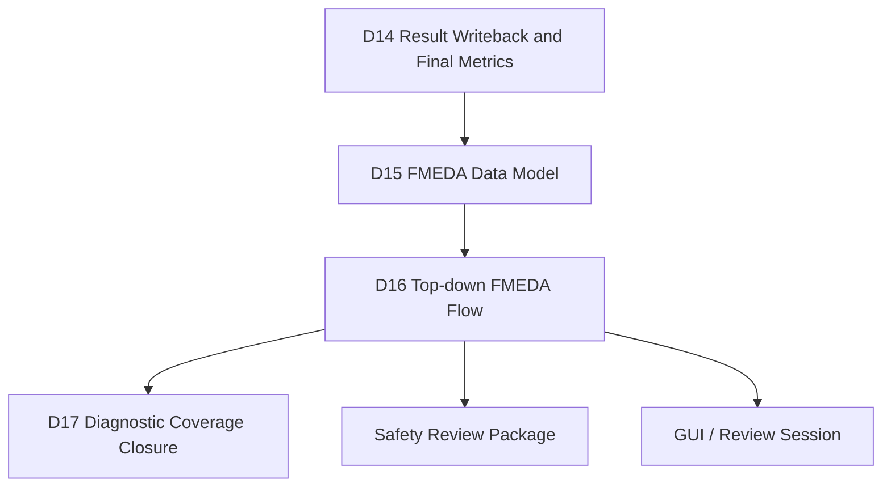
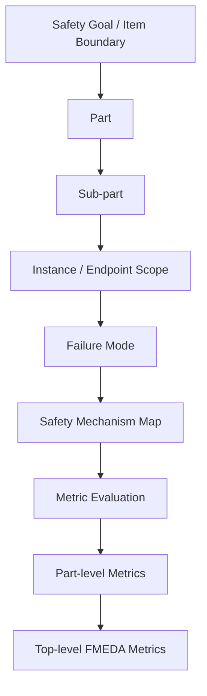
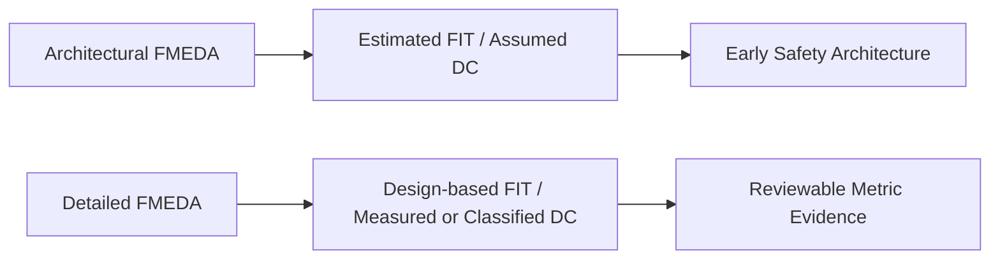
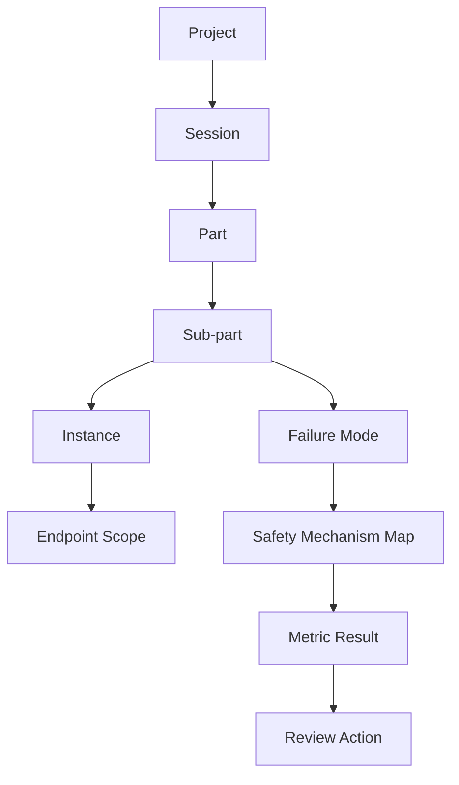
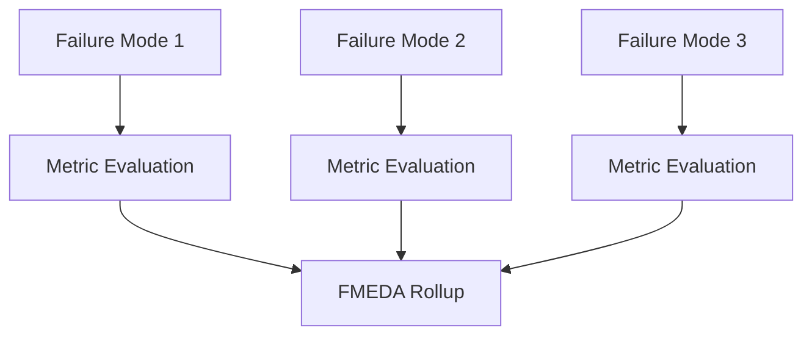
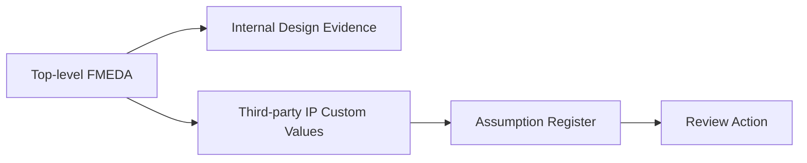
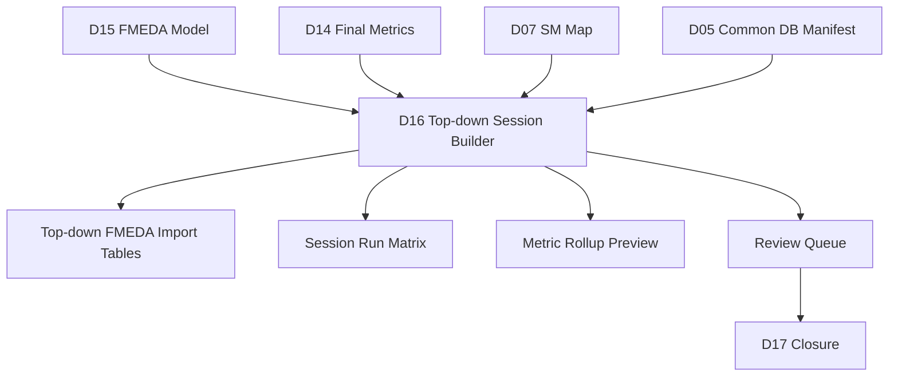

# [Automotive Safe-IC Practice 16] Top-down FMEDA Flow: From Safety Architecture to Executable Metric Evidence

**Author**: Darren H. Chen  
**Direction**: Automotive Chip Functional Safety Analysis and Fault Injection Practice  
**Demo**: `D16_top_down_fmeda_flow`  
**Tags**: Automotive Chip, Functional Safety, ISO 26262, FMEDA, Top-down FMEDA, Safety Architecture, Safety Mechanism, Diagnostic Coverage, Residual FIT, SPFM, LFM, PMHF, Evidence Flow

---

## 1. From Rows of Data to an Executable Safety Architecture

By the time a project reaches D16, the flow has already built a large amount of evidence:

```text
D01  Analysis input package
D02  Base FIT rate and contribution view
D03  FIT standard and mission-profile comparison
D04  Endpoint / startpoint / DCE structural model
D05  Common database evidence center
D06  What-if safety mechanism exploration
D07  Failure-mode to endpoint / SM mapping
D08  Fault-list generation
D09  Simulation safety context
D10  Alarm list and observe-point boundary
D11  Fault campaign setup package
D12  Fault injection execution planning
D13  Fault outcome classification
D14  Result writeback and final metric bridge
D15  FMEDA data model
```

D15 organized the FMEDA data model. D16 goes one step further: it turns that data model into a **top-down FMEDA flow**.

The difference is important.

A data model says:

```text
These are the parts, sub-parts, failure modes, safety mechanisms, diagnostic coverage values, and residual FIT values.
```

A top-down FMEDA flow asks:

```text
Can we start from the safety architecture, decompose the design into reviewable parts, attach failure modes and safety mechanisms, run analysis for each relevant branch, and roll the metrics back up to the top-level safety goal?
```

This is the moment where FMEDA stops being only a spreadsheet-like artifact and becomes an executable engineering workflow.

---

## 2. Where D16 Sits in the Series

D16 sits after D15 because it needs a structured FMEDA model. It also sits before D17 because diagnostic coverage closure needs a structured list of unresolved or insufficiently covered items.



**Figure 1. D16 transforms the FMEDA data model into a top-down metric evaluation workflow.**

D16 is not only about pressing a Run button in a graphical environment. It is about defining a repeatable relation between:

```text
safety goal
part
sub-part
instance
failure mode
safety mechanism
endpoint map
metric result
review action
```

---

## 3. The Core Idea of Top-down FMEDA

There are two common ways to build FMEDA evidence.

The first is bottom-up:

```text
extract structural elements
compute FIT contribution
classify faults
aggregate metrics
map results back to FMEDA rows
```

The second is top-down:

```text
start from safety architecture
create part and sub-part hierarchy
assign failure modes
bind instances and safety mechanisms
run metric evaluation per safety branch
roll up evidence to the top-level item
```

D16 focuses on the second path.



**Figure 2. Top-down FMEDA starts from the product safety architecture and descends into design evidence.**

---

## 4. Top-down Does Not Mean Manual Guessing

A weak top-down FMEDA is only a spreadsheet built from assumptions.

A strong top-down FMEDA is different. It still starts from architecture, but every important row should be connected to design evidence.

For example:

```text
Part: Control Logic
Sub-part: Counter State Control
Failure mode: wrong state transition
Safety mechanism: endpoint parity or state duplication
Design evidence: endpoint inventory, DCE, fault outcome classification, residual FIT allocation
```

The top-down part is the safety decomposition.

The evidence part comes from previous demos.

D16 connects the two.

---

## 5. Architectural FMEDA vs Detailed FMEDA

A top-down FMEDA can be used at different project stages.

| Flow Type | Typical Timing | Data Source | Purpose |
|---|---|---|---|
| Architectural FMEDA | Before full RTL or before final netlist | block diagram, estimated complexity, assumed DC | feasibility and safety concept exploration |
| Detailed FMEDA | RTL / netlist available | real design hierarchy, structural analysis, fault campaign evidence | evidence package for safety review |

D16 is closer to a detailed FMEDA flow because earlier demos already produced structural, fault-list, fault-outcome, and final-metric evidence.

However, the same structure also explains architectural FMEDA. The key difference is evidence strength.



**Figure 3. Architectural and detailed FMEDA share the same safety hierarchy but differ in evidence strength.**

---

## 6. The Objects Managed by D16

D16 uses several object types.

```text
Project
Session
Part
Sub-part
Instance
Endpoint
Failure mode
Safety mechanism map
Coverage source
Metric result
Review action
```

These objects are not just names. They form a graph.



**Figure 4. D16 treats FMEDA as a graph of objects rather than a flat table.**

This graph is what makes top-down FMEDA manageable.

---

## 7. Project and Session

A project is the container of the safety study.

A session is a specific analysis context inside that project.

A useful session identity should include:

```text
item name
design version
FIT standard
mission profile
analysis mode
FMEDA flow mode
evidence database session
run date or revision tag
```

D16 should not mix all evidence into a single anonymous result folder.

A good session identity helps answer:

```text
Which design was analyzed?
Which reliability model was used?
Which failure modes were selected?
Which safety mechanism maps were active?
Which evidence database session was read?
Which metric rollup was produced?
```

---

## 8. Part and Sub-part

A part is a high-level safety-relevant component in the FMEDA hierarchy.

A sub-part is a smaller unit under a part.

Example:

```text
Part: Timer / Counter Function
  Sub-part: Counter State Register
  Sub-part: Enable Control Logic
  Sub-part: Alarm Generation Logic
```

The part/sub-part hierarchy should not blindly mirror RTL hierarchy. It should reflect how the safety architecture is reviewed.

Sometimes one RTL module maps cleanly to one sub-part. Sometimes one sub-part spans multiple instances. Sometimes one RTL instance must be split into multiple FMEDA rows because different failure modes have different safety relevance.

---

## 9. Instance Binding

A top-down FMEDA becomes executable only when a sub-part is linked to design scope.

That link is usually an instance path, endpoint scope, or DCE scope.

```text
FMEDA sub-part
    -> design instance
    -> endpoint set
    -> DCE / structural contribution
    -> safety mechanism map
```

If the instance binding is wrong, the top-down FMEDA may compute metrics for the wrong design scope.

Therefore D16 must treat instance binding as a first-class evidence object.

---

## 10. Failure Mode in Top-down FMEDA

A failure mode describes how a part or sub-part can fail in a way relevant to the safety goal.

Examples:

```text
wrong state transition
wrong data output
lost alarm assertion
incorrect handshake response
latent register corruption
unsafe control output
```

A failure mode should not be too vague.

Weak row:

```text
Sub-part: Counter
Failure mode: fails
```

Stronger row:

```text
Sub-part: Counter State Register
Failure mode: state corruption causes incorrect counter value at safety-relevant output
```

A precise failure mode makes it possible to attach a meaningful safety mechanism and diagnostic coverage assumption.

---

## 11. Failure Mode Distribution

In FMEDA, a part's total failure rate may be distributed across several failure modes.

Conceptually:

```text
part FIT = sum(failure-mode FIT contributions)
```

A failure mode distribution answers:

```text
How much of this part's random hardware failure exposure belongs to each failure mode?
```

Example:

| Failure Mode | Distribution |
|---|---:|
| state corruption | 45% |
| output corruption | 35% |
| alarm path corruption | 20% |

The distribution must be reviewable because it directly affects residual FIT.

---

## 12. Safety Mechanism Map

A safety mechanism map links a failure mode or endpoint scope to a diagnostic mechanism.

Conceptually:

```text
failure mode
    -> endpoint / instance
        -> safety mechanism
            -> diagnostic coverage
            -> alarm / observe evidence
```

D07 created mapping proposals. D16 uses those mappings inside a top-down FMEDA session.

This is the key transition:

```text
D07: mapping proposal
D15: FMEDA model
D16: top-down FMEDA execution flow
```

---

## 13. Endpoint Path Context

Endpoint paths matter in a top-down flow.

When a safety mechanism map is associated with a sub-part or instance, endpoint paths must be interpreted relative to the selected module or instance scope.

A path mismatch can create subtle errors:

```text
map created for top-level endpoint
but applied to sub-module instance
```

or:

```text
map created for local module scope
but evaluated from top-level hierarchy
```

D16 should explicitly track:

```text
map_scope
module_scope
instance_scope
endpoint_path_style
path_resolution_status
```

---

## 14. Metric Evaluation per Failure Mode

A top-down FMEDA flow often evaluates each failure mode separately.

The reason is simple: each failure mode can have a different safety mechanism map, diagnostic coverage, and evidence source.



**Figure 5. Running metric evaluation per failure mode avoids mixing unrelated diagnostic assumptions.**

This is one reason D16 is more structured than a simple spreadsheet calculation.

---

## 15. Rollup Logic

The rollup step aggregates metrics from sub-parts to parts, and from parts to the item level.

A simplified flow:

```text
endpoint evidence
    -> failure-mode metric
        -> sub-part metric
            -> part metric
                -> top-level metric
```

The rollup must preserve traceability.

A top-level SPFM or LFM value is not enough. Reviewers also need to know:

```text
Which failure modes contributed most residual FIT?
Which sub-parts have weak diagnostic coverage?
Which safety mechanisms were credited?
Which faults remain unresolved?
Which rows need closure actions?
```

---

## 16. Diagnostic Coverage in Top-down FMEDA

Diagnostic Coverage (DC) is the portion of relevant faults covered by a safety mechanism.

In D16, DC can enter the FMEDA row from different sources:

```text
assumed DC from safety concept
estimated DC from safety exploration
classified DC from fault campaign outcome
copied DC from a lower-level database session
custom DC for third-party IP
```

These sources should not be mixed without labels.

A D16 row should carry a field such as:

```text
dc_source = assumed | estimated | measured | copied_session | custom_3rd_party
```

This prevents accidental over-crediting.

---

## 17. Residual FIT Rollup

Residual FIT is the failure rate that remains after diagnostic coverage is credited.

A simplified formula:

```text
residual_fit = allocated_fit * (1 - diagnostic_coverage)
```

In a real FMEDA row, the calculation may split permanent and transient contributions:

```text
residual_fit_perm = lambda_perm * distribution_perm * (1 - dc_perm)
residual_fit_tran = lambda_tran * distribution_tran * (1 - dc_tran)
```

D16 should not hide this decomposition.

A top-down FMEDA is useful because it can show where residual FIT is coming from:

```text
Part A -> Sub-part A1 -> Failure Mode A1.2 -> weak DC -> residual FIT hotspot
```

---

## 18. SPFM, LFM, and PMHF in the Top-down View

D16 is not only about DC.

The top-level safety review often needs architectural metrics such as:

```text
SPFM: Single Point Fault Metric
LFM: Latent Fault Metric
PMHF: Probabilistic Metric for Hardware Failures
```

A practical interpretation:

| Metric | Practical Question |
|---|---|
| SPFM | How much of the single-point failure risk has been eliminated or covered? |
| LFM | How much latent multi-point failure risk has been controlled? |
| PMHF | Is the residual random hardware failure rate low enough for the safety goal? |

D16 should make these metrics traceable to FMEDA rows instead of treating them as black-box numbers.

---

## 19. Third-party IP and Custom Values

Top-down FMEDA must often include third-party blocks.

These blocks may not expose internal RTL or fault campaign evidence.

In that case, the FMEDA may use custom values such as:

```text
block name
lambda
safe lambda
diagnostic coverage
latent diagnostic coverage
evidence reference
supplier assumption
review status
```

A third-party block should never be silently absorbed into the top-level metric. It should be visible as a controlled assumption.



**Figure 6. Third-party IP evidence must be carried as explicit assumptions.**

---

## 20. Session Copy and Hierarchical Reuse

In a hierarchical design, lower-level analysis results may be copied or referenced by a top-level FMEDA session.

This is useful when an IP block has already been analyzed.

But reuse requires consistency checks:

```text
same design revision?
same FIT standard?
same mission profile?
same safety mechanism assumptions?
same DC source?
same part/sub-part interpretation?
```

D16 should generate a session reuse manifest.

Example fields:

```csv
source_session,target_part,target_subpart,fit_standard,mission_profile,copy_status,review_status
IP_COUNTER_BFR,CounterFunction,CounterCore,iec_62380,passenger_profile,copied,review_required
```

---

## 21. Batch-like Execution vs Interactive GUI Work

Top-down FMEDA can be performed interactively in a graphical environment.

However, a robust engineering flow should also produce batch-like evidence:

```text
session manifest
part/sub-part import table
failure-mode map
instance binding table
safety-mechanism map
metric summary
quality gate
review queue
```

Interactive work is useful for review and visualization.

Batch-like artifacts are useful for reproducibility.

D16 should support both.

---

## 22. D16 Demo Architecture

The D16 demo is designed as a bridge from D15 FMEDA data model to a top-down FMEDA session package.



**Figure 7. D16 builds the top-down FMEDA execution package from prior evidence.**

---

## 23. Suggested D16 Demo Inputs

D16 should consume:

```text
D15 fmeda_model.json
D15 fmeda_flat_table.csv
D15 fmeda_traceability_matrix.csv
D14 final_metrics_summary.csv
D14 fmeda_metric_seed.csv
D07 failure_mode_to_sm_map.csv
D07 ep_to_sm_map_review.csv
D05 common_db_session_manifest.csv
D04 structural_endpoint_inventory.csv
```

These inputs allow D16 to construct a top-down view without inventing its own safety data.

---

## 24. Suggested D16 Demo Outputs

A useful D16 demo should produce:

```text
outputs/topdown_project_manifest.csv
outputs/topdown_session_manifest.csv
outputs/topdown_part_tree.csv
outputs/topdown_instance_binding.csv
outputs/topdown_failure_mode_plan.csv
outputs/topdown_sm_map_binding.csv
outputs/topdown_run_matrix.csv
outputs/topdown_metric_rollup.csv
outputs/topdown_metric_rollup.md
outputs/topdown_assumption_register.csv
outputs/topdown_review_queue.csv
outputs/d16_handoff_to_d17.csv
outputs/d16_quality_gate.csv
outputs/evidence_index.csv
outputs/demo_summary.md
```

These outputs make the flow reviewable even if the graphical review step happens later.

---

## 25. Top-down Project Manifest

The project manifest records the overall identity of the top-down FMEDA study.

Important fields:

```text
project_id
item_name
design_revision
fmeda_model_source
metric_source
fit_standard
mission_profile
common_database_reference
review_owner
status
```

This is the anchor of the D16 evidence package.

---

## 26. Top-down Part Tree

The part tree describes how the design is decomposed for FMEDA review.

Example:

```csv
part_id,parent_id,object_type,name,description
P_TOP,,part,Toy Counter Safety Item,top-level item boundary
P_CTRL,P_TOP,part,Counter Control,control and state update logic
SP_STATE,P_CTRL,sub_part,Counter State Register,state storage and update
SP_ALARM,P_CTRL,sub_part,Alarm Generation,alarm-like output logic
```

The part tree should be stable enough to survive design reviews.

---

## 27. Instance Binding Table

The instance binding table connects FMEDA sub-parts to design hierarchy.

Example:

```csv
subpart_id,instance_path,module_scope,binding_type,binding_status
SP_STATE,top.counter_state,toy_counter,register_group,resolved
SP_ALARM,top.alarm_logic,toy_counter,logic_cone,review_required
```

If the design is flat, the binding can still be expressed as endpoint or signal scope.

---

## 28. Failure Mode Plan

The failure mode plan describes which failure modes are evaluated under each sub-part.

Example:

```csv
subpart_id,failure_mode_id,failure_mode_description,distribution_perm,distribution_tran
SP_STATE,FM_STATE_CORRUPTION,state bit corruption causes wrong count,0.60,0.50
SP_ALARM,FM_ALARM_MISSED,alarm does not assert when required,0.40,0.50
```

The failure mode distribution should be reviewable and traceable to a safety architecture assumption or previous metric evidence.

---

## 29. SM Map Binding

The SM map binding attaches a safety mechanism map to a failure mode or instance scope.

Example:

```csv
failure_mode_id,subpart_id,map_id,mechanism_family,alarm_binding,dc_source,status
FM_STATE_CORRUPTION,SP_STATE,MAP_STATE_PARITY,endpoint_parity,sm_alarm_state,estimated,review_required
FM_ALARM_MISSED,SP_ALARM,MAP_ALARM_OBSERVE,alarm_monitor,sm_alarm_alarm_path,measured,accepted
```

This table is where D07 and D16 connect.

---

## 30. Top-down Run Matrix

The run matrix explains how metric evaluation should be executed.

Each row can represent one failure-mode evaluation.

```csv
run_id,subpart_id,failure_mode_id,input_session,sm_map,metric_scope,status
TD_RUN_001,SP_STATE,FM_STATE_CORRUPTION,D15_FMEDA_MODEL,MAP_STATE_PARITY,subpart,ready
TD_RUN_002,SP_ALARM,FM_ALARM_MISSED,D15_FMEDA_MODEL,MAP_ALARM_OBSERVE,subpart,ready
```

The run matrix is useful even when actual execution is performed through an interactive environment.

It turns click-based work into reviewable intent.

---

## 31. Metric Rollup Preview

D16 can generate a rollup preview before a formal run.

This preview should not be confused with final safety signoff. It is a consistency and planning artifact.

Example columns:

```text
part_id
subpart_id
failure_mode_id
allocated_lambda_perm
allocated_lambda_tran
dc_perm
dc_tran
residual_fit_perm
residual_fit_tran
review_status
```

The rollup preview helps answer:

```text
Which rows dominate residual FIT?
Which rows rely on assumed DC?
Which rows have unresolved fault evidence?
Which rows need D17 closure?
```

---

## 32. Assumption Register

A top-down FMEDA must expose assumptions.

Typical assumptions:

```text
failure mode distribution assumption
third-party IP custom lambda
assumed diagnostic coverage
copied session validity
endpoint path resolution
alarm binding completeness
unresolved fault treatment
```

An assumption register turns hidden engineering judgment into reviewable evidence.

Example:

```csv
assumption_id,object,assumption,impact,owner,status
A001,SP_STATE,DC is estimated from exploration scenario S05,medium,safety_engineer,review_required
A002,IP_TIMER,lambda copied from supplier document,high,ip_owner,review_required
```

---

## 33. Review Queue

D16 should create a review queue for items that cannot be automatically accepted.

Examples:

```text
failure mode distribution not approved
safety mechanism map unresolved
alarm binding missing
custom third-party lambda used
DC source is assumed rather than measured
residual FIT exceeds internal threshold
```

The review queue becomes a direct input to D17 diagnostic coverage closure.

---

## 34. Quality Gate

The D16 quality gate should check at least:

```text
D15 FMEDA model exists
part tree is not empty
sub-parts are linked to parts
failure modes are linked to sub-parts
instance or endpoint binding exists
SM map binding exists for safety-relevant failure modes
DC source is labeled
residual FIT rows are present
assumption register exists
review queue is generated
D17 handoff is generated
```

Quality gate failures should indicate structural incompleteness, not whether the design already passes a safety target.

---

## 35. Common Pitfalls

### 35.1 Treating FMEDA as a Spreadsheet Only

A spreadsheet is a view. The engineering object is the traceable safety model behind it.

### 35.2 Mixing Architectural and Detailed Evidence

Estimated DC and fault-campaign-derived DC must be labeled differently.

### 35.3 Losing Instance Scope

If a sub-part is not bound to an instance, the metric result may not be reproducible.

### 35.4 Reusing Sessions Without Context Checks

Copying coverage from another session is dangerous unless FIT standard, design revision, and mission profile are compatible.

### 35.5 Hiding Third-party IP Assumptions

Custom lambda and DC values must be visible in the assumption register.

### 35.6 Treating Top-level Metrics as Enough

A top-level metric is a summary, not an explanation. D16 must keep row-level evidence.

---

## 36. Review Checklist

A reviewer should be able to answer:

```text
What is the top-level item boundary?
What parts and sub-parts are included?
Which design instances are bound to each sub-part?
Which failure modes are assigned?
Which safety mechanisms are credited?
Where did DC values come from?
Which rows use assumptions?
Which rows are supported by fault campaign results?
Which rows are copied from lower-level sessions?
Which rows drive residual FIT?
Which rows require D17 closure?
```

If these questions cannot be answered, the top-down FMEDA flow is not yet reviewable.

---

## 37. D16 Demo Deliverables

D16 should deliver:

```text
[ ] README.md
[ ] scripts/run_demo.csh
[ ] tools/build_d16_topdown_fmeda_flow.py

[ ] inputs/from_D15/
[ ] inputs/from_D14/
[ ] inputs/from_D07/
[ ] inputs/from_D05/
[ ] configs/topdown_partition_rules.csv
[ ] configs/topdown_review_policy.csv

[ ] outputs/topdown_project_manifest.csv
[ ] outputs/topdown_session_manifest.csv
[ ] outputs/topdown_part_tree.csv
[ ] outputs/topdown_instance_binding.csv
[ ] outputs/topdown_failure_mode_plan.csv
[ ] outputs/topdown_sm_map_binding.csv
[ ] outputs/topdown_run_matrix.csv
[ ] outputs/topdown_metric_rollup.csv
[ ] outputs/topdown_metric_rollup.md
[ ] outputs/topdown_assumption_register.csv
[ ] outputs/topdown_review_queue.csv
[ ] outputs/d16_handoff_to_d17.csv
[ ] outputs/d16_quality_gate.csv
[ ] outputs/evidence_index.csv
[ ] outputs/demo_summary.md
```

---

## 38. Summary

D16 is where the FMEDA data model becomes a top-down workflow.

It starts from safety architecture:

```text
part
sub-part
failure mode
safety mechanism
```

Then it connects the architecture to design evidence:

```text
instance binding
endpoint map
DCE evidence
fault outcome classification
final metric seed
common database session
```

Finally, it rolls the evidence back up into reviewable metrics:

```text
DC
residual FIT
SPFM
LFM
PMHF
assumption register
review queue
```

A strong top-down FMEDA flow does not replace bottom-up analysis. It organizes bottom-up evidence into a safety architecture that reviewers can understand.

That is why D16 is an important bridge in the series:

```text
D15 gives the FMEDA data model.
D16 turns it into an executable top-down review flow.
D17 uses the review queue to close diagnostic coverage gaps.
```

At this stage, the safety platform is no longer just producing isolated reports. It is building an integrated, traceable, and reviewable safety case.
