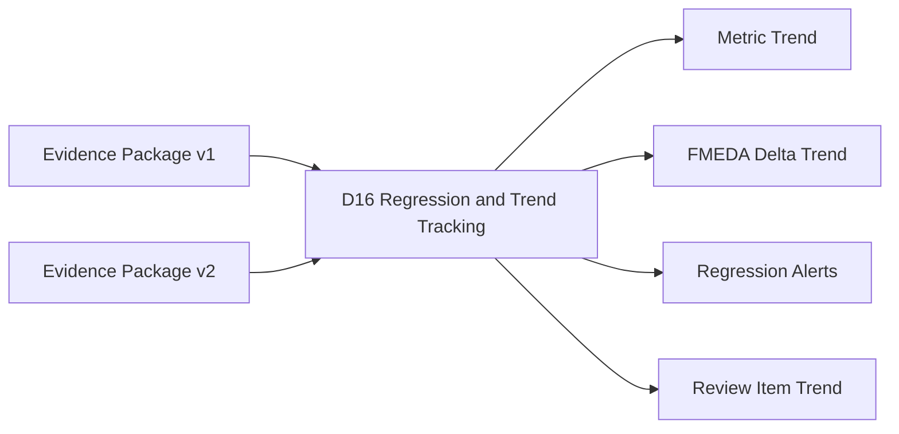
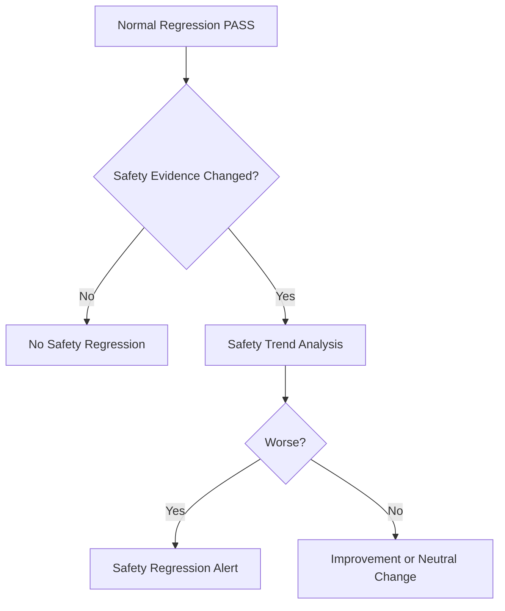
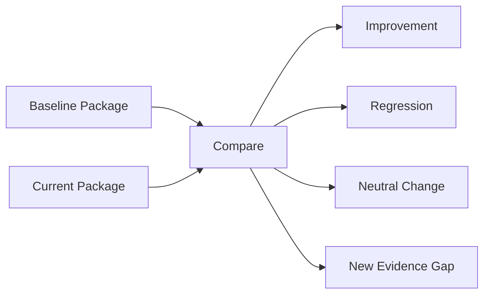
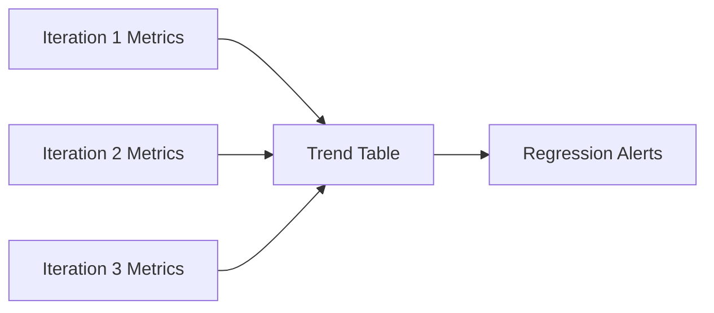
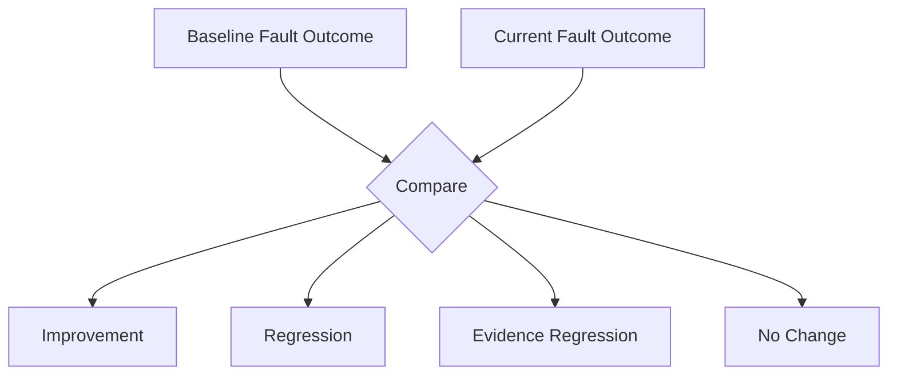
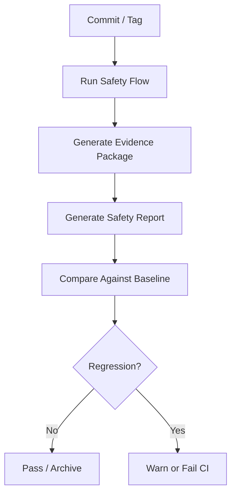
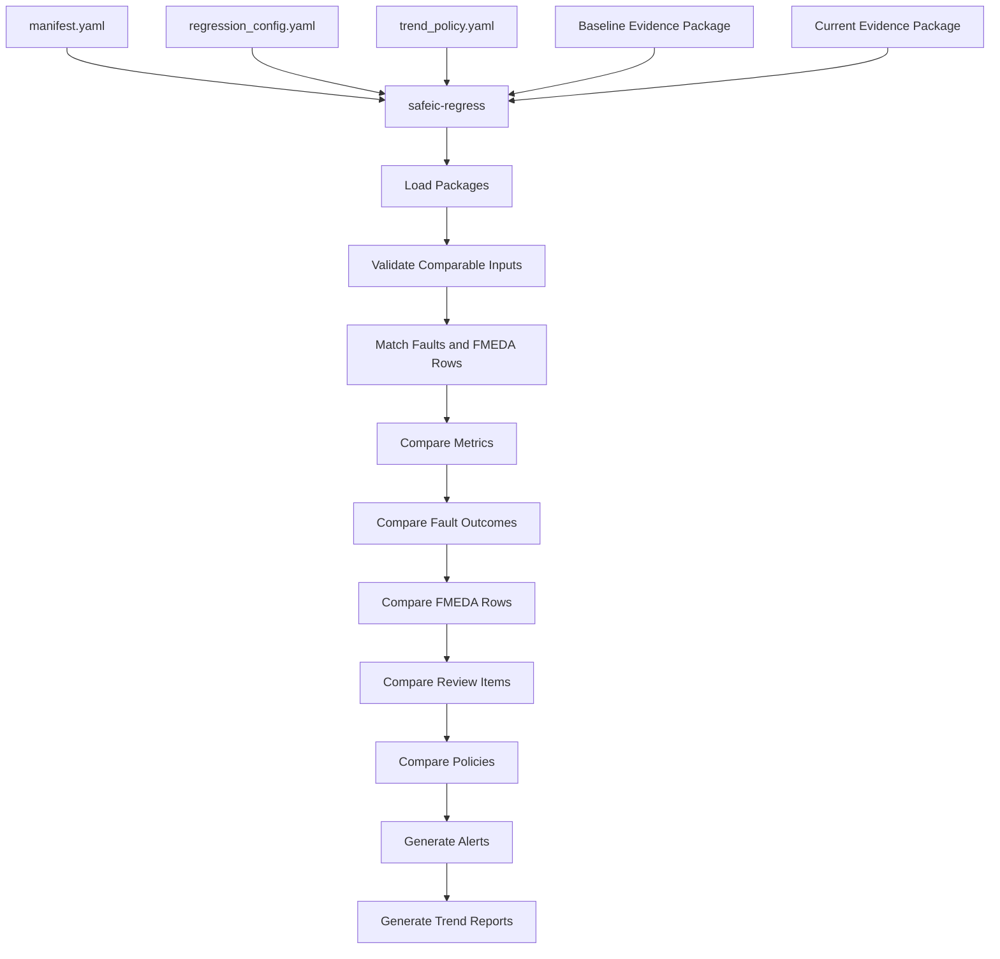
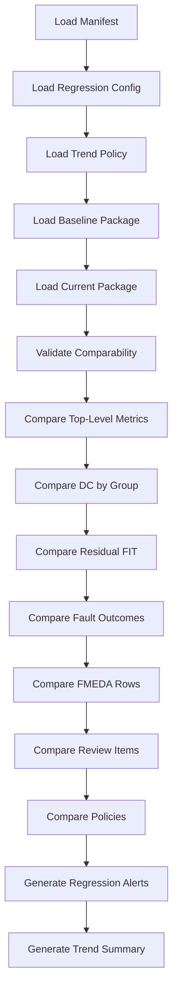
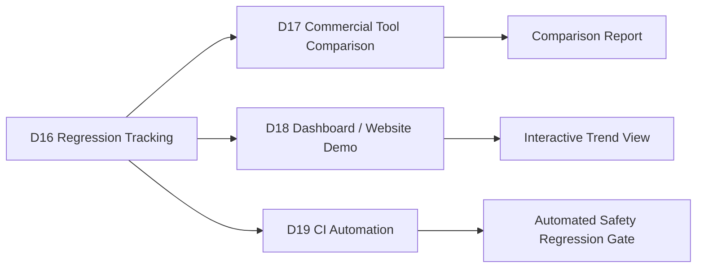

# [Automotive Safe-IC Practice 16] Regression and Trend Tracking: Turning Safety Analysis into an Iterative Engineering Loop

**Author**: Darren H. Chen  
**Direction**: Automotive Chip Functional Safety Analysis and Fault Injection Practice  
**Demo**: D16_regression_and_trend_tracking  
**Tags**: Automotive Chip, Functional Safety, Safety Regression, Fault Injection Regression, Diagnostic Coverage Trend, Residual FIT Trend, FMEDA Delta, Evidence Package, CI, Safety Metrics

---

## 1. Why This Article Matters

In the previous article, we generated a review-ready safety engineering report from a structured evidence package.

D15 produced outputs such as:

```text
safety_report.md
safety_report_summary.md
review_action_list.md
metric_tables_for_review.csv
report_warnings.csv
report_manifest.yaml
```

That report describes one analysis snapshot.

However, real safety engineering is not a one-shot activity.

A design evolves.  
Safety mechanisms change.  
Fault lists change.  
Campaign results change.  
Measured diagnostic coverage changes.  
FMEDA rows change.  
Residual FIT changes.  
Review items are opened, fixed, and reopened.

The next question is:

> How do we track safety analysis results across design iterations and detect regressions?

The sixteenth demo in this repository is:

```text
D16_regression_and_trend_tracking
```

The generic tool introduced in this article is:

```text
safeic-regress
```

The purpose of `safeic-regress` is to compare multiple safety evidence packages or safety reports across iterations:

```text
baseline evidence package
current evidence package
baseline FMEDA table
current FMEDA table
baseline measured DC
current measured DC
baseline fault outcomes
current fault outcomes
review action history
trend policy
regression policy
```

and generate:

```text
regression_summary.md
metric_trend.csv
dc_trend_by_failure_mode.csv
residual_fit_trend.csv
fmeda_delta_trend.csv
fault_outcome_delta.csv
review_item_trend.csv
regression_alerts.csv
```

The central idea is:

> Functional safety analysis becomes much more valuable when it is tracked as an iterative engineering loop rather than a single report.

---

## 2. Where D16 Fits in the Flow

D16 is the first multi-iteration demo.



**Figure 1. D16 compares evidence packages or reports across iterations and generates trend and regression outputs.**

D15 answered:

```text
What does this one evidence package mean?
```

D16 answers:

```text
What changed since the previous package?
Did diagnostic coverage improve or regress?
Did residual FIT increase or decrease?
Were unsafe faults fixed?
Did new unsafe faults appear?
Did review items close or remain open?
Did evidence quality improve?
```

This is the transition from single-run reporting to continuous safety improvement.

---

## 3. Why Safety Regression Is Different from Normal Regression

Normal design regression often asks:

```text
Did tests pass?
Did timing pass?
Did lint pass?
Did simulation pass?
```

Safety regression asks deeper questions:

```text
Did diagnostic coverage change?
Did residual FIT change?
Did a previously detected fault become unsafe?
Did a previously reviewed FMEDA row become review-required?
Did a safety mechanism stop detecting faults?
Did the campaign lose observability?
Did evidence quality become weaker?
```

A test can still pass while safety evidence regresses.

Example:

```text
RTL simulation passes.
Fault campaign runs.
But alarm path stuck-at fault changes from detected to unsafe.
```

That is a safety regression.



**Figure 2. Safety regression focuses on evidence and metric changes, not only pass/fail execution.**

D16 therefore needs to compare structured evidence, not only logs.

---

## 4. What Is an Iteration?

An iteration is a versioned safety-analysis snapshot.

It may correspond to:

```text
new RTL version
new safety mechanism implementation
new fault list
new simulation campaign
new classification policy
new measurement policy
new FMEDA update
new evidence package
new report
```

A simple iteration record:

```yaml
iteration:
  id: iter_2026_05_01
  design_version: toy_counter_v1
  evidence_package: packages/iter_2026_05_01
  report: reports/iter_2026_05_01/safety_report.md
  tag: baseline
```

Another iteration:

```yaml
iteration:
  id: iter_2026_05_08
  design_version: toy_counter_v2_alarm_fix
  evidence_package: packages/iter_2026_05_08
  report: reports/iter_2026_05_08/safety_report.md
  tag: alarm_path_fix
```

D16 compares these iterations.

---

## 5. Baseline and Current

Regression analysis usually compares:

```text
baseline
current
```

The baseline is the reference snapshot.

The current package is the new snapshot.

Example:

```text
baseline:
  D14 package generated before alarm-path fix

current:
  D14 package generated after alarm-path fix
```



**Figure 3. D16 compares a baseline package and a current package to classify changes.**

The baseline is not necessarily perfect.

It is simply the chosen reference point.

---

## 6. What Should Be Compared?

D16 should compare multiple dimensions:

```text
diagnostic coverage
residual FIT
fault outcomes
FMEDA rows
review items
evidence quality
execution quality
assumptions
policies
traceability completeness
```

A useful regression tool should not only compare one metric.

For example, measured DC may improve, but evidence quality may degrade due to higher unresolved ratio.

Example:

```text
measured DC improves from 0.80 to 0.90
unresolved ratio increases from 0.02 to 0.40
```

This is not a clean improvement.

D16 should flag it for review.

---

## 7. Metric Trend

A metric trend tracks values across iterations.

Example:

```csv
iteration,total_base_fit,total_residual_fit,weighted_selected_dc,unsafe_faults,unresolved_faults,review_required_rows
iter_001,0.078,0.0204,0.738,2,0,2
iter_002,0.078,0.0104,0.867,1,0,1
iter_003,0.078,0.0064,0.918,0,1,1
```

This shows improvement, but also one unresolved fault in `iter_003`.



**Figure 4. Metric trend tables show how safety evidence evolves across iterations.**

For the first implementation, trend can be stored as CSV.

Later, it can be plotted or rendered into dashboards.

---

## 8. Diagnostic Coverage Trend

Diagnostic coverage trend should be tracked by meaningful groups:

```text
overall
endpoint
failure mode
safety mechanism
part
sub-part
```

Example:

```csv
iteration,group_type,group_id,measured_dc,selected_dc,confidence
iter_001,failure_mode,FM_ALARM_NOT_ASSERTED,0.000,0.000,LOW
iter_002,failure_mode,FM_ALARM_NOT_ASSERTED,0.500,0.000,LOW
iter_003,failure_mode,FM_ALARM_NOT_ASSERTED,0.900,0.850,MEDIUM
```

This tells a story:

```text
iteration 1:
  alarm-not-asserted is uncovered

iteration 2:
  measured behavior improves but confidence is low

iteration 3:
  measured confidence becomes acceptable and selected DC is updated
```

The trend must distinguish:

```text
measured_dc
selected_dc
confidence
```

Otherwise the report may overstate improvement.

---

## 9. Residual FIT Trend

Residual FIT trend is often more useful than coverage trend.

Example:

```csv
iteration,failure_mode,base_fit,selected_dc,residual_fit
iter_001,FM_ALARM_NOT_ASSERTED,0.010,0.000,0.0100
iter_002,FM_ALARM_NOT_ASSERTED,0.010,0.500,0.0050
iter_003,FM_ALARM_NOT_ASSERTED,0.010,0.850,0.0015
```

A reduction in residual FIT indicates risk reduction.

But the trend should also track why it changed:

```text
design change
new safety mechanism
policy change
campaign expansion
manual review
FIT model change
```

Example:

```csv
iteration,failure_mode,residual_fit,change_reason
iter_002,FM_ALARM_NOT_ASSERTED,0.0050,alarm path monitor added
iter_003,FM_ALARM_NOT_ASSERTED,0.0015,campaign expanded and selected DC updated
```

This makes the trend explainable.

---

## 10. Fault Outcome Delta

One of the most important regression checks is fault outcome delta.

A fault can change from:

```text
unsafe -> detected
unsafe -> safe
detected -> unsafe
detected -> unresolved
unresolved -> detected
```

Some changes are improvements.

Some are regressions.

Example:

```csv
fault_id,baseline_outcome,current_outcome,delta_class
F004,unsafe,detected,improvement
F010,detected,unsafe,regression
F020,unresolved,detected,improvement
F030,detected,unresolved,evidence_regression
```



**Figure 5. Fault outcome delta identifies improvements, regressions, and evidence-quality changes at fault level.**

A detected-to-unsafe change should trigger a high-severity alert.

---

## 11. Fault Matching Across Iterations

Faults must be matched across iterations.

The simplest key is:

```text
fault_id
```

But fault IDs may change when the fault list is regenerated.

More robust matching can use:

```text
node
fault_type
endpoint
failure_mode
safety_mechanism
fault_model
injection_mode
```

Example matching key:

```text
node + fault_type + failure_mode + endpoint
```

Policy example:

```yaml
fault_matching:
  primary_key: fault_id
  fallback_keys:
    - node
    - fault_type
    - endpoint
    - failure_mode
```

The tool should report unmatched faults:

```text
new faults
removed faults
renamed faults
unmatched faults
```

Unmatched faults can be normal when the design changes, but they must be visible.

---

## 12. FMEDA Row Delta

FMEDA rows can also change.

Changes to track:

```text
row added
row removed
base FIT changed
estimated DC changed
measured DC changed
selected DC changed
residual FIT changed
review status changed
evidence source changed
unsafe fault count changed
```

Example:

```csv
row_id,field,baseline_value,current_value,delta_class
R003,selected_dc,0.000,0.850,improvement
R003,residual_fit,0.0100,0.0015,improvement
R003,review_status,review_required,reviewed,improvement
R005,row_status,missing,added,new_row
```

FMEDA delta tracking is important because FMEDA is the table that safety reviewers often inspect first.

---

## 13. Review Item Trend

Review items should not remain invisible across iterations.

D16 should track:

```text
new review items
closed review items
reopened review items
persistent review items
severity changes
owner changes
due date changes
```

Example:

```csv
item_id,baseline_status,current_status,delta_class
I001,open,closed,closed
I002,open,open,persistent
I003,missing,open,new
I004,closed,open,reopened
```

A reopened high-severity item should generate a strong alert.

Review item trend makes safety improvement visible as engineering work.

---

## 14. Evidence Quality Trend

Evidence quality should also be tracked.

Metrics include:

```text
unresolved ratio
not-classified ratio
missing artifact count
low-confidence metric count
scope mismatch count
open high-severity review items
policy change count
```

Example:

```csv
iteration,unresolved_ratio,not_classified_ratio,missing_artifacts,low_confidence_groups,open_high_items
iter_001,0.00,0.00,0,3,1
iter_002,0.05,0.00,0,2,1
iter_003,0.20,0.02,1,1,0
```

A trend can improve in one area and regress in another.

D16 should avoid simplistic pass/fail conclusions.

---

## 15. Policy Changes Across Iterations

Metric changes can be caused by policy changes.

Examples:

```text
safe faults included in denominator in one run but excluded in another
late alarms counted as detected in one run but unsafe in another
FIT-weighted DC enabled in one run but not another
low-confidence measured DC allowed in one run but not another
```

D16 must compare policy files or at least record policy hashes.

Example:

```csv
policy_name,baseline_hash,current_hash,status
classification_policy,abc123,abc123,unchanged
measurement_policy,def456,789abc,changed
fmeda_update_policy,111aaa,111aaa,unchanged
```

If a metric changed and the policy also changed, the trend interpretation must mention it.

```text
Measured DC changed from 0.60 to 0.72, but measurement policy changed.
Review is required before treating the change as design improvement.
```

---

## 16. Regression Severity

Not all changes have the same severity.

Suggested severity levels:

```text
INFO
LOW
MEDIUM
HIGH
CRITICAL
```

Example severity rules:

```yaml
regression_policy:
  critical:
    - detected_to_unsafe
    - reviewed_to_review_required_with_residual_fit_increase

  high:
    - residual_fit_increase_above_threshold
    - new_unsafe_failure_mode
    - high_severity_review_item_reopened

  medium:
    - measured_dc_drop_above_threshold
    - unresolved_ratio_increase_above_threshold
    - policy_changed_with_metric_change

  low:
    - confidence_drop
    - new_low_severity_review_item
```

This helps prioritize engineering response.

---

## 17. Regression Alerts

D16 should generate `regression_alerts.csv`.

Example:

```csv
alert_id,severity,category,item,baseline,current,message
A001,CRITICAL,fault_outcome,F010,detected,unsafe,previously detected fault became unsafe
A002,HIGH,residual_fit,FM_ALARM_NOT_ASSERTED,0.0015,0.0100,residual FIT increased above threshold
A003,MEDIUM,evidence_quality,unresolved_ratio,0.02,0.20,unresolved ratio increased
A004,MEDIUM,policy,measurement_policy,abc123,def456,policy changed with metric trend
```

Alerts should be concise and actionable.

A good alert should tell:

```text
what changed
why it matters
where to look
what to do next
```

---

## 18. Trend Summary Report

The human-readable trend report should include:

```text
baseline iteration
current iteration
overall status
key improvements
key regressions
metric trend
fault outcome delta
FMEDA row delta
review item trend
evidence quality trend
policy changes
recommended actions
```

Example:

```md
# D16 Regression and Trend Tracking Summary

Baseline: iter_001  
Current: iter_002  

## Overall Status

Status: REVIEW_REQUIRED

## Improvements

- FM_ALARM_NOT_ASSERTED measured DC improved from 0.000 to 0.500.
- Fault F004 changed from unsafe to detected.

## Regressions

- Measurement confidence remains LOW.
- One high-severity review item remains open.

## Required Actions

1. Expand the alarm-path campaign.
2. Keep FMEDA selected DC unchanged until confidence improves.
3. Review measurement policy consistency.
```

This is the main review artifact for a safety iteration.

---

## 19. Trend Database

D16 can maintain a simple trend database.

For a demo, this can be CSV-based.

Example layout:

```text
trend_db/
  iterations.csv
  metric_trend.csv
  dc_trend_by_failure_mode.csv
  residual_fit_trend.csv
  review_item_history.csv
  policy_hash_history.csv
```

Example `iterations.csv`:

```csv
iteration_id,date,design_version,package_path,report_path,tag
iter_001,2026-05-01,toy_counter_v1,packages/iter_001,reports/iter_001,baseline
iter_002,2026-05-08,toy_counter_v2,packages/iter_002,reports/iter_002,alarm_fix
```

A simple CSV trend database is enough for GitHub demos.

Later, it can evolve into SQLite or a dashboard backend.

---

## 20. CI Integration

Safety regression tracking can be integrated into CI.

A CI flow may run:

```text
build design
run safety preflight
generate fault list
run selected campaign
classify outcomes
compute measured DC
update FMEDA
package evidence
generate report
compare with baseline
fail or warn on regression
```



**Figure 6. Safety regression tracking can become a CI gate for safety evidence quality.**

For early usage, D16 can be run manually.

Later, it can be used as a lightweight CI check.

---

## 21. What Should Fail CI?

Not every warning should fail CI.

Possible CI fail conditions:

```text
detected fault becomes unsafe
new critical review item appears
residual FIT increases above threshold
selected DC drops below threshold
FMEDA row becomes evidence_missing
required artifact missing
policy file changes without review approval
```

Possible warning-only conditions:

```text
confidence remains low
sample size still small
new low-severity review item
new assumption added
non-critical metric change
```

Example policy:

```yaml
ci_policy:
  fail_on:
    - critical_regression_alert
    - missing_required_artifact
    - detected_to_unsafe
    - residual_fit_increase_gt_threshold

  warn_on:
    - low_confidence
    - policy_change
    - unresolved_ratio_increase
```

CI should be strict enough to catch dangerous regressions but not so strict that it blocks every exploratory analysis.

---

## 22. Baseline Selection

Choosing the baseline matters.

Possible baseline strategies:

```text
last successful package
last reviewed package
release candidate package
golden reference package
specific tag
specific date
manual baseline
```

Example:

```yaml
baseline_selection:
  mode: last_reviewed
  fallback: latest
```

A safety baseline should usually be reviewed.

Comparing against an unreviewed baseline can produce misleading regression conclusions.

---

## 23. Handling Design Changes

When the design changes, some faults and FMEDA rows may disappear or be renamed.

D16 should classify:

```text
matched
added
removed
renamed
unmatched
```

Example:

```csv
object_type,object_id,delta_class,comment
fault,F010,removed,node no longer exists
fault,F120,added,new alarm monitor fault
fmeda_row,R003,matched,same failure mode and part
fmeda_row,R010,added,new watchdog row
```

Added or removed objects are not automatically good or bad.

They require context.

---

## 24. Handling Tool or Policy Changes

If tool behavior changes, trends may be affected.

D16 should record:

```text
tool version
script version
policy hash
configuration hash
evidence package hash
```

Example:

```csv
item,baseline,current,status
safeic-classify_version,0.1.0,0.1.1,changed
classification_policy_hash,aaa111,aaa111,unchanged
measurement_policy_hash,bbb222,ccc333,changed
```

This is important because a metric change may come from:

```text
design change
fault list change
classification policy change
tool bug fix
campaign expansion
```

The trend report should be honest about uncertainty.

---

## 25. Core Inputs for D16

Suggested inputs:

```text
inputs/
  regression_config.yaml
  trend_policy.yaml
  baseline/
    evidence_package/
    safety_report.md
  current/
    evidence_package/
    safety_report.md
```

The evidence packages should contain:

```text
fmeda_table.csv
safety_metric_summary.csv
measured_dc_by_failure_mode.csv
measured_dc_by_endpoint.csv
measured_residual_fit.csv
fault_outcomes.csv
review_items.csv
assumption_register.csv
package_status.csv
artifact_hashes.csv
```

D16 should use the package outputs rather than raw scattered files.

---

## 26. Main Outputs for D16

Suggested outputs:

```text
outputs/
  regression_summary.md
  regression_alerts.csv
  metric_trend.csv
  dc_trend_by_failure_mode.csv
  dc_trend_by_endpoint.csv
  residual_fit_trend.csv
  fault_outcome_delta.csv
  fmeda_delta_trend.csv
  review_item_trend.csv
  evidence_quality_trend.csv
  policy_delta.csv
  trend_manifest.yaml
```

Each output has a clear purpose:

| Output | Purpose |
|---|---|
| `regression_summary.md` | Human-readable trend report |
| `regression_alerts.csv` | Prioritized regression warnings |
| `metric_trend.csv` | Top-level metric comparison |
| `dc_trend_by_failure_mode.csv` | Measured/selected DC by failure mode |
| `residual_fit_trend.csv` | Residual risk change |
| `fault_outcome_delta.csv` | Fault-level outcome changes |
| `fmeda_delta_trend.csv` | FMEDA row changes |
| `review_item_trend.csv` | Review action changes |
| `policy_delta.csv` | Policy or configuration changes |

---

## 27. Example `regression_config.yaml`

```yaml
regression:
  name: toy_counter_alarm_fix_regression
  baseline_iteration: iter_001
  current_iteration: iter_002

inputs:
  baseline_package: inputs/baseline/evidence_package
  current_package: inputs/current/evidence_package

matching:
  fault_matching:
    primary_key: fault_id
    fallback_keys:
      - node
      - fault_type
      - endpoint
      - failure_mode

  fmeda_matching:
    primary_key: row_id
    fallback_keys:
      - part
      - subpart
      - failure_mode
      - design_object

outputs:
  summary: outputs/regression_summary.md
  alerts: outputs/regression_alerts.csv
```

This keeps comparison reproducible.

---

## 28. Example `trend_policy.yaml`

```yaml
trend_policy:
  thresholds:
    measured_dc_drop_warn: 0.05
    measured_dc_drop_fail: 0.10
    residual_fit_increase_warn: 0.001
    residual_fit_increase_fail: 0.005
    unresolved_ratio_increase_warn: 0.10

  severity:
    detected_to_unsafe: CRITICAL
    unsafe_to_detected: INFO
    unsafe_to_safe: INFO
    detected_to_unresolved: HIGH
    unresolved_to_detected: INFO
    new_unsafe_fault: HIGH
    high_review_item_reopened: HIGH

  policy_change:
    warn_if_policy_hash_changed: true
    require_review_if_metric_changed_with_policy_change: true

  ci:
    fail_on_critical_alert: true
    fail_on_missing_required_artifact: true
    warn_on_low_confidence: true
```

Thresholds should be project-specific.

For a public demo, use simple defaults.

---

## 29. Tool Architecture

The generic tool `safeic-regress` can be implemented as a staged pipeline.



**Figure 7. `safeic-regress` loads two evidence packages, compares metrics and evidence, generates alerts, and writes trend reports.**

Suggested internal modules:

```text
safeic_regress/
  cli.py
  manifest.py
  load_config.py
  load_package.py
  validate_compare.py
  match_faults.py
  match_fmeda.py
  metric_compare.py
  outcome_delta.py
  fmeda_delta.py
  review_delta.py
  policy_delta.py
  severity.py
  trend_db.py
  report.py
```

Responsibilities:

| Module | Responsibility |
|---|---|
| `load_package.py` | Read D14 evidence package structure |
| `validate_compare.py` | Check whether two packages are comparable |
| `match_faults.py` | Match faults across iterations |
| `match_fmeda.py` | Match FMEDA rows across iterations |
| `metric_compare.py` | Compare DC, residual FIT, and summary metrics |
| `outcome_delta.py` | Compare fault outcomes |
| `fmeda_delta.py` | Compare FMEDA row changes |
| `review_delta.py` | Compare review item status |
| `policy_delta.py` | Compare policy hashes and configs |
| `severity.py` | Assign regression alert severity |
| `trend_db.py` | Update trend history |
| `report.py` | Generate CSV and Markdown outputs |

---

## 30. D16 Directory Structure

Suggested directory:

```text
D16_regression_and_trend_tracking/
  README.md
  run_demo.sh
  run_demo.csh
  manifest.yaml

  inputs/
    regression_config.yaml
    trend_policy.yaml

    baseline/
      evidence_package/
        package_manifest.yaml
        package_status.csv
        metrics/
          measured_dc_by_failure_mode.csv
          measured_residual_fit.csv
          safety_metric_summary.csv
        fmeda/
          fmeda_table.csv
          fmeda_review_items.csv
        campaign/
          fault_outcomes.csv
        policies/
          classification_policy.yaml
          measurement_policy.yaml

    current/
      evidence_package/
        package_manifest.yaml
        package_status.csv
        metrics/
          measured_dc_by_failure_mode.csv
          measured_residual_fit.csv
          safety_metric_summary.csv
        fmeda/
          fmeda_table.csv
          fmeda_review_items.csv
        campaign/
          fault_outcomes.csv
        policies/
          classification_policy.yaml
          measurement_policy.yaml

  outputs/
    regression_summary.md
    regression_alerts.csv
    metric_trend.csv
    dc_trend_by_failure_mode.csv
    residual_fit_trend.csv
    fault_outcome_delta.csv
    fmeda_delta_trend.csv
    review_item_trend.csv
    policy_delta.csv
    trend_manifest.yaml
```

This structure makes baseline/current comparison explicit.

---

## 31. D16 Manifest

Example:

```yaml
project:
  name: automotive_safeic_practice
  demo: D16_regression_and_trend_tracking
  top_module: toy_counter

inputs:
  regression_config: inputs/regression_config.yaml
  trend_policy: inputs/trend_policy.yaml
  baseline_package: inputs/baseline/evidence_package
  current_package: inputs/current/evidence_package

outputs:
  summary: outputs/regression_summary.md
  alerts: outputs/regression_alerts.csv
  metric_trend: outputs/metric_trend.csv
  dc_trend_by_failure_mode: outputs/dc_trend_by_failure_mode.csv
  residual_fit_trend: outputs/residual_fit_trend.csv
  fault_outcome_delta: outputs/fault_outcome_delta.csv
  fmeda_delta_trend: outputs/fmeda_delta_trend.csv
  review_item_trend: outputs/review_item_trend.csv
  policy_delta: outputs/policy_delta.csv
  trend_manifest: outputs/trend_manifest.yaml
```

The manifest defines exactly what is compared and where results are written.

---

## 32. D16 Execution Flow



**Figure 8. D16 execution flow: load packages, validate, compare metrics and evidence, generate alerts, and write trend summary.**

Example bash script:

```bash
#!/usr/bin/env bash
set -euo pipefail

safeic-regress \
  --manifest manifest.yaml \
  --output-dir outputs
```

Example csh script:

```csh
#!/bin/csh -f

set DEMO = D16_regression_and_trend_tracking
echo "Running $DEMO"

safeic-regress \
  --manifest manifest.yaml \
  --output-dir outputs
```

Expected outputs:

```text
outputs/regression_summary.md
outputs/regression_alerts.csv
outputs/metric_trend.csv
outputs/dc_trend_by_failure_mode.csv
outputs/residual_fit_trend.csv
outputs/fault_outcome_delta.csv
outputs/fmeda_delta_trend.csv
outputs/review_item_trend.csv
outputs/policy_delta.csv
outputs/trend_manifest.yaml
```

---

## 33. Example `metric_trend.csv`

```csv
metric,baseline,current,delta,delta_class
total_base_fit,0.078,0.078,0.000,no_change
total_residual_fit,0.0204,0.0104,-0.0100,improvement
weighted_selected_dc,0.738,0.867,0.129,improvement
rows_review_required,2,1,-1,improvement
unsafe_faults,2,1,-1,improvement
unresolved_faults,0,0,0,no_change
```

This provides a compact top-level view.

---

## 34. Example `fault_outcome_delta.csv`

```csv
fault_id,node,failure_mode,baseline_outcome,current_outcome,delta_class,severity
F001,toy_counter.count[0],FM_DATA_CORRUPTION,detected,detected,no_change,INFO
F003,toy_counter.count_parity,FM_DIAGNOSTIC_STATE_CORRUPTION,unsafe,unsafe,no_change,HIGH
F004,toy_counter.alarm,FM_ALARM_NOT_ASSERTED,unsafe,detected,improvement,INFO
F010,toy_counter.alarm_mask,FM_DIAGNOSTIC_MASKED,missing,unsafe,new_unsafe_fault,HIGH
```

This table tells the detailed story behind metric changes.

---

## 35. Example `regression_alerts.csv`

```csv
alert_id,severity,category,item,message,recommended_action
A001,HIGH,new_unsafe_fault,F010,new unsafe alarm-mask fault appeared,review alarm mask protection
A002,MEDIUM,review_item,I002,diagnostic state issue remains open,add diagnostic state protection or justify residual risk
A003,LOW,confidence,FM_ALARM_NOT_ASSERTED,measured confidence is still low,expand campaign sample size
```

This is the action-driving output.

---

## 36. Example `regression_summary.md`

```md
# D16 Regression and Trend Tracking Summary

Baseline: iter_001  
Current: iter_002  
Design: toy_counter  

## Overall Status

Status: REVIEW_REQUIRED

## Top-Level Metric Changes

- Total residual FIT decreased from 0.0204 to 0.0104.
- Weighted selected DC increased from 0.738 to 0.867.
- Unsafe faults decreased from 2 to 1.
- Review-required FMEDA rows decreased from 2 to 1.

## Improvements

1. Fault F004 changed from unsafe to detected.
2. FM_ALARM_NOT_ASSERTED residual FIT decreased.

## Remaining Issues

1. Diagnostic state corruption remains unsafe.
2. A new alarm-mask unsafe fault appeared.
3. Measured confidence remains low for alarm-path coverage.

## Recommended Actions

1. Add or justify diagnostic state protection.
2. Review new alarm-mask fault F010.
3. Expand campaign sample size before increasing selected DC further.
```

A summary should be clear enough for review discussion.

---

## 37. Validation Rules

`safeic-regress` should validate:

```text
baseline package exists
current package exists
required metric files exist
required FMEDA files exist
required fault outcome files exist
policy files exist or missing status is reported
iteration IDs are defined
fault matching policy is valid
FMEDA matching policy is valid
trend thresholds are valid
numeric metrics can be parsed
review item statuses are valid
```

Example messages:

```text
[PASS] baseline package loaded
[PASS] current package loaded
[PASS] measured DC tables loaded for both packages
[PASS] FMEDA rows matched: 3 matched, 1 added, 0 removed
[WARN] measurement policy hash changed
[WARN] new unsafe fault F010 found
[ERROR] current package missing fmeda_table.csv
```

The tool should refuse to compare incomplete packages when required artifacts are missing.

---

## 38. Common Mistakes

### 38.1 Comparing Only One Metric

A measured DC increase may hide residual FIT, confidence, or unresolved evidence regressions.

### 38.2 Ignoring Policy Changes

Metric changes are hard to interpret if classification or measurement policies changed.

### 38.3 Treating Added Faults as Regressions Automatically

New faults may simply reflect expanded coverage.

Classify them carefully.

### 38.4 Ignoring Persistent Review Items

A review item that remains open across multiple iterations is important.

### 38.5 Hiding Evidence Quality Regression

Unresolved ratio and missing artifacts matter.

### 38.6 Using an Unreviewed Baseline

A weak baseline can make trend conclusions misleading.

### 38.7 Failing CI on Every Warning

Not every warning is a blocker.

Critical safety regressions should fail; exploratory warnings may not.

---

## 39. How D16 Connects to Later Demos

D16 enables iteration-aware safety engineering.

Later demos can use regression outputs for tool comparison, dashboarding, and publication.



**Figure 9. D16 provides the trend and regression foundation for comparison, dashboarding, and automation.**

Once regression tracking exists, the workflow becomes much more credible as an engineering platform.

---

## 40. Recommended Implementation Stages

D16 can be implemented in stages.

### Stage 1: Two-Package Metric Comparison

Compare baseline and current package metrics.

Deliverables:

```text
metric_trend.csv
regression_summary.md
```

### Stage 2: Fault Outcome Delta

Compare classified outcomes across iterations.

Deliverables:

```text
fault_outcome_delta.csv
regression_alerts.csv
```

### Stage 3: FMEDA Row Delta

Compare FMEDA row values and review statuses.

Deliverables:

```text
fmeda_delta_trend.csv
```

### Stage 4: Review Item and Policy Delta

Track review item changes and policy hash changes.

Deliverables:

```text
review_item_trend.csv
policy_delta.csv
```

### Stage 5: Trend Database and CI Mode

Maintain historical trend tables and CI pass/warn/fail status.

Deliverables:

```text
trend_db/
ci_status.csv
```

This staged implementation makes D16 useful immediately and extensible toward automation.

---

## 41. Summary

Regression and trend tracking turns safety analysis from a one-shot report into an iterative engineering loop.

The D16 demo:

```text
D16_regression_and_trend_tracking
```

introduces the generic tool:

```text
safeic-regress
```

The tool consumes:

```text
baseline evidence package
current evidence package
regression_config.yaml
trend_policy.yaml
```

and generates:

```text
regression_summary.md
regression_alerts.csv
metric_trend.csv
dc_trend_by_failure_mode.csv
dc_trend_by_endpoint.csv
residual_fit_trend.csv
fault_outcome_delta.csv
fmeda_delta_trend.csv
review_item_trend.csv
policy_delta.csv
trend_manifest.yaml
```

The central lesson is:

> Safety evidence must be tracked over time. A single report explains one snapshot, but regression and trend tracking shows whether the safety argument is improving, regressing, or becoming less certain.

D16 makes the safety workflow iterative, auditable, and ready for CI-style automation.

---

## 42. D16 Demo Checklist

For `D16_regression_and_trend_tracking`, the expected deliverables are:

```text
[ ] README.md
[ ] run_demo.sh
[ ] run_demo.csh
[ ] manifest.yaml

[ ] inputs/regression_config.yaml
[ ] inputs/trend_policy.yaml

[ ] inputs/baseline/evidence_package/package_manifest.yaml
[ ] inputs/baseline/evidence_package/package_status.csv
[ ] inputs/baseline/evidence_package/metrics/measured_dc_by_failure_mode.csv
[ ] inputs/baseline/evidence_package/metrics/measured_residual_fit.csv
[ ] inputs/baseline/evidence_package/metrics/safety_metric_summary.csv
[ ] inputs/baseline/evidence_package/fmeda/fmeda_table.csv
[ ] inputs/baseline/evidence_package/fmeda/fmeda_review_items.csv
[ ] inputs/baseline/evidence_package/campaign/fault_outcomes.csv
[ ] inputs/baseline/evidence_package/policies/classification_policy.yaml
[ ] inputs/baseline/evidence_package/policies/measurement_policy.yaml

[ ] inputs/current/evidence_package/package_manifest.yaml
[ ] inputs/current/evidence_package/package_status.csv
[ ] inputs/current/evidence_package/metrics/measured_dc_by_failure_mode.csv
[ ] inputs/current/evidence_package/metrics/measured_residual_fit.csv
[ ] inputs/current/evidence_package/metrics/safety_metric_summary.csv
[ ] inputs/current/evidence_package/fmeda/fmeda_table.csv
[ ] inputs/current/evidence_package/fmeda/fmeda_review_items.csv
[ ] inputs/current/evidence_package/campaign/fault_outcomes.csv
[ ] inputs/current/evidence_package/policies/classification_policy.yaml
[ ] inputs/current/evidence_package/policies/measurement_policy.yaml

[ ] outputs/regression_summary.md
[ ] outputs/regression_alerts.csv
[ ] outputs/metric_trend.csv
[ ] outputs/dc_trend_by_failure_mode.csv
[ ] outputs/dc_trend_by_endpoint.csv
[ ] outputs/residual_fit_trend.csv
[ ] outputs/fault_outcome_delta.csv
[ ] outputs/fmeda_delta_trend.csv
[ ] outputs/review_item_trend.csv
[ ] outputs/policy_delta.csv
[ ] outputs/trend_manifest.yaml
```

A successful D16 run should answer:

```text
What changed between baseline and current safety evidence packages?
Did measured DC improve or regress?
Did residual FIT decrease or increase?
Did any detected fault become unsafe?
Did any unsafe fault become detected?
Were new unsafe faults introduced?
Did FMEDA rows improve or regress?
Which review items were opened, closed, or reopened?
Did evidence quality improve or degrade?
Did policies change between iterations?
Should the current iteration pass, warn, or fail a safety regression gate?
```
