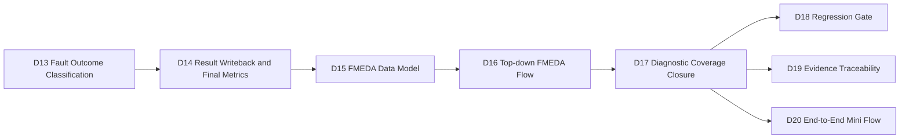
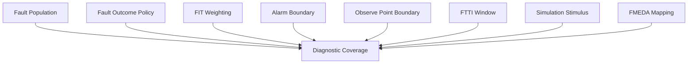
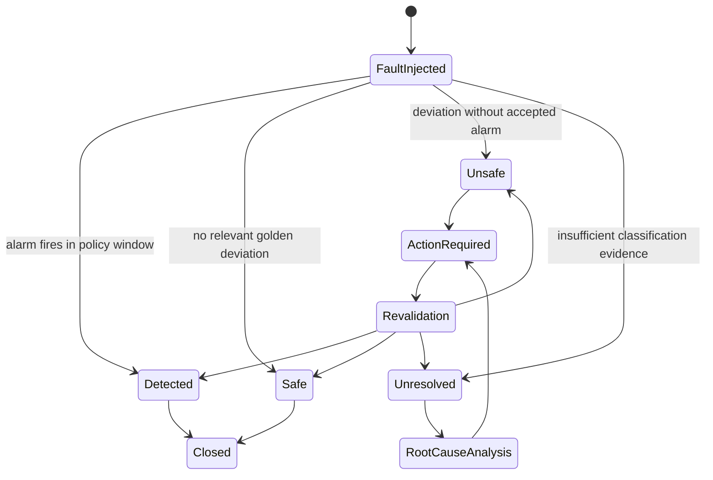
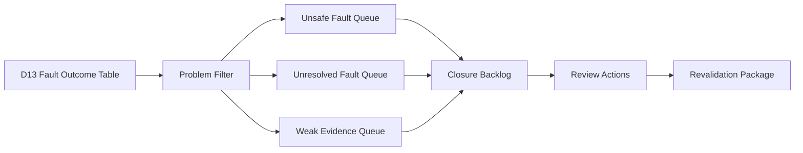
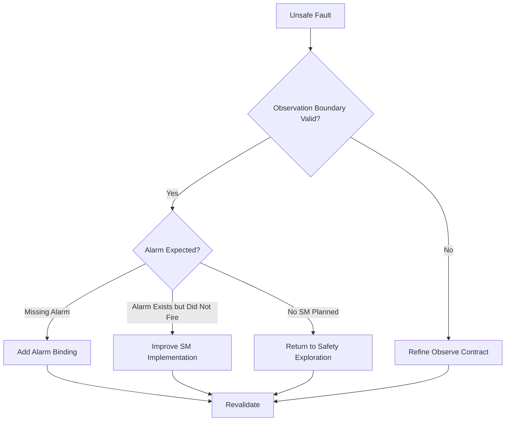
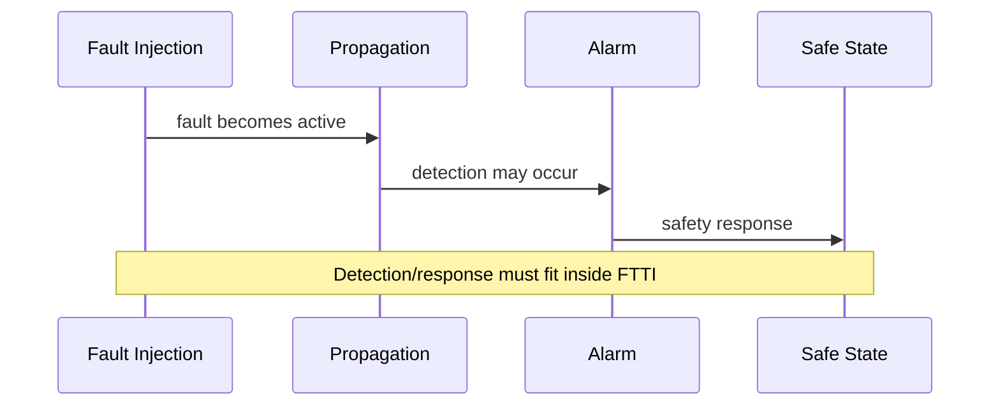
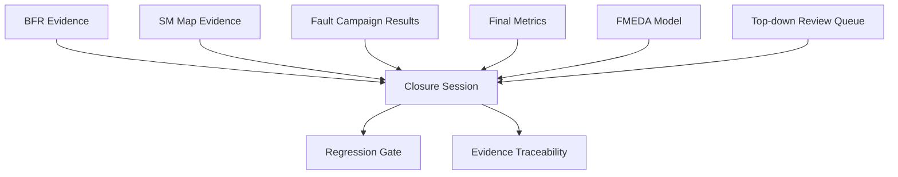
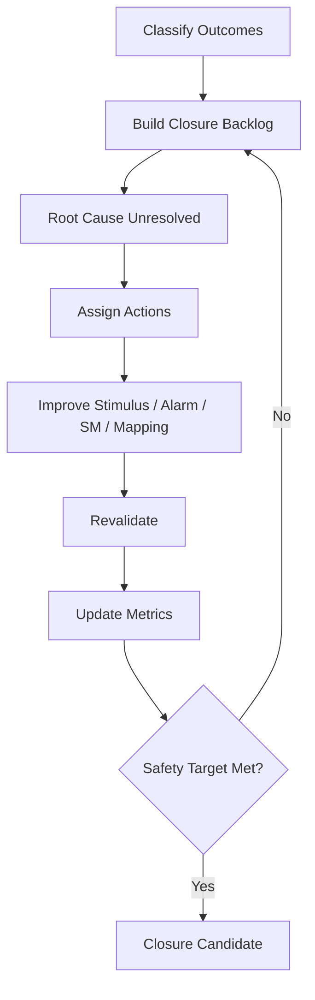
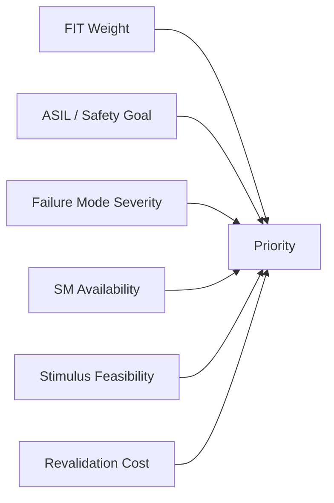

# Automotive Safe-IC Practice 17: Diagnostic Coverage Closure — From Unresolved Faults to Review Action
Author: Darren H. Chen  
Direction: Automotive chip functional safety analysis and fault-injection practice  
Demo: D17_diagnostic_coverage_closure_unresolved_to_review_action  
Tags: ISO 26262, Functional Safety, Diagnostic Coverage, Fault Campaign, Unresolved Faults, FMEDA, Residual FIT, Safety Closure

---

## 1. Closure Is Where Safety Evidence Becomes an Engineering Decision

A fault campaign can generate thousands or millions of fault observations, but the campaign itself does not automatically close functional safety. After the campaign finishes, the team still has to answer several hard questions:

```text
Which faults are already detected?
Which faults are naturally safe?
Which faults remain unsafe?
Which faults are unresolved?
Which unresolved faults can be solved by better stimulus?
Which ones require a new alarm?
Which ones indicate missing safety mechanisms?
Which ones only need review and documentation?
```

This is the purpose of **D17: Diagnostic Coverage Closure**.

D13 classified campaign outcomes. D14 converted classification results into final-metric input. D15 built the FMEDA data model. D16 organized the top-down FMEDA flow. D17 now performs the closure loop: it turns unresolved and weakly covered evidence into review actions that an engineering team can execute.

In real safety work, closure is not just a report. It is a controlled decision process.

---

## 2. D17 in the Safe-IC Workflow

D17 sits after fault outcome classification and FMEDA modeling, but before regression gating and final evidence packaging.



D17 consumes:

```text
fault outcome categories
final metric seeds
FMEDA part/sub-part/failure-mode mapping
top-down review queues
alarm and observe boundary definitions
fault campaign execution evidence
Common FuSa database session references
```

D17 produces:

```text
closure backlog
unresolved root-cause classification
stimulus improvement requests
alarm and observe refinement requests
safety mechanism improvement requests
FMEDA review actions
final DC revalidation package
closure quality gate
```

The main engineering output of D17 is not “100% coverage”. The main output is a reviewable route from every problematic evidence item to an explicit action.

---

## 3. Diagnostic Coverage Is Not a Single Percentage

Diagnostic Coverage, or DC, is often written as a percentage. That can be misleading.

A percentage does not tell us:

```text
what fault population was used
whether the faults were permanent or transient
whether the metric is fault-count-based or FIT-weighted
whether unresolved faults were excluded or penalized
whether alarm timing was checked against FTTI
whether the observe boundary was meaningful
whether the VCD contained enough activity
whether the FMEDA failure mode was correctly mapped
```

A closure-ready DC value must be interpreted with its context.



D17 treats DC as an evidence product, not a standalone number.

---

## 4. Closure Vocabulary

Before building the D17 flow, the vocabulary must be precise.

| Term | Meaning in D17 |
|---|---|
| Detected fault | Fault propagated to a designated safety mechanism alarm within the observation policy |
| Safe fault | Fault did not change the relevant golden behavior under the given stimulus |
| Unsafe fault | Fault changed relevant behavior but no accepted alarm fired |
| Unresolved fault | Fault could not be confidently classified as detected, safe, or unsafe |
| Residual FIT | FIT remaining after credited diagnostic coverage |
| Closure action | Engineering action assigned to resolve unsafe/unresolved/weak evidence |
| Revalidation | Rerun or re-evaluation after stimulus, alarm, SM, or mapping changes |
| Review waiver | Controlled acceptance of a known limitation with rationale and evidence |
| Observation contract | Definition of alarm, observe point, FTTI, golden context, and comparison boundary |

The important distinction is this:

```text
Unresolved is not the same as unsafe.
Unsafe is not the same as unresolved.
Both must be tracked, but they trigger different actions.
```

---

## 5. The Four Outcome Categories Revisited

D13 introduced the outcome categories. D17 uses them as closure signals.



A closure flow should not hide unresolved faults. It should reduce them by assigning each one to a root-cause bucket and then driving the corresponding action.

---

## 6. Why Unresolved Faults Exist

Unresolved faults usually do not appear randomly. They arise because at least one part of the observation contract is incomplete.

Common causes include:

```text
insufficient VCD activity
fault still propagating when simulation ends
fault is not injectable under the selected context
observe point is too shallow
alarm list is incomplete
FTTI window is too short or undefined
golden context is missing relevant behavior
X-propagation prevents stable classification
reset or initialization is incomplete
failure-mode mapping is ambiguous
tool output exists but is not linked to FMEDA evidence
```

A closure system must not put all unresolved faults into one bucket. A single bucket called `unresolved` is not actionable.

---

## 7. From Outcome Classification to Closure Backlog

D17 converts D13 outcome files into a closure backlog.



The backlog is not simply a list of failed rows. It contains closure metadata:

```text
fault id
fault type
fault site
failure mode
part/sub-part
safety mechanism
alarm expectation
observe boundary
FTTI window
classification source
root-cause candidate
recommended action
owner role
evidence status
revalidation requirement
```

This turns raw campaign results into an executable engineering plan.

---

## 8. Closure Inputs

D17 should consume the evidence generated by the earlier demos.

| Upstream demo | D17 consumes |
|---|---|
| D10 | alarm list, observe point list, FTTI boundary plan, observation contract |
| D11 | fault campaign input package, input manifest |
| D12 | execution plan, campaign status, native result index |
| D13 | detected/safe/unsafe/unresolved tables, DC from outcomes |
| D14 | final metric bridge, lambda bucket allocation, metric summary |
| D15 | FMEDA part/sub-part/failure-mode/SM/residual FIT model |
| D16 | top-down review queue, metric rollup, FMEDA session package |

D17 is therefore a convergence point.

```text
fault evidence + metric evidence + FMEDA evidence + review evidence
    -> closure actions
```

---

## 9. Closure Outputs

A practical D17 demo should generate:

```text
outputs/closure_backlog.csv
outputs/unresolved_root_cause_map.csv
outputs/unsafe_fault_action_plan.csv
outputs/stimulus_improvement_plan.csv
outputs/alarm_observe_refinement_plan.csv
outputs/safety_mechanism_improvement_plan.csv
outputs/fmeda_review_action_queue.csv
outputs/final_dc_revalidation_package.csv
outputs/closure_decision_matrix.csv
outputs/closure_metric_projection.csv
outputs/d17_handoff_to_d18.csv
outputs/d17_handoff_to_d19.csv
outputs/d17_handoff_to_d20.csv
outputs/d17_quality_gate.csv
outputs/evidence_index.csv
outputs/demo_summary.md
```

These files are not a replacement for final signoff. They are the engineering closure interface.

---

## 10. Closure Backlog Schema

A closure backlog should be stable enough to support review, automation, and regression.

Example schema:

```csv
closure_id,fault_id,outcome,root_cause_bucket,part_id,subpart_id,failure_mode_id,sm_id,alarm_signal,observe_point,ftti_cycles,fit_weight,recommended_action,owner_role,priority,revalidation_required,closure_status
```

Example values:

```text
root_cause_bucket = STIMULUS_GAP
recommended_action = extend_good_machine_vcd
owner_role = verification
priority = high
revalidation_required = yes
closure_status = open
```

This is the key transformation:

```text
raw unresolved fault
    -> categorized issue
        -> assigned engineering action
            -> revalidation requirement
```

---

## 11. Root-Cause Taxonomy for Unresolved Faults

D17 should use an explicit taxonomy.

```text
STIMULUS_GAP
SIMULATION_END_TOO_EARLY
FAULT_NOT_INJECTABLE
OBSERVE_BOUNDARY_GAP
ALARM_BINDING_GAP
FTTI_POLICY_GAP
X_PROPAGATION
INITIALIZATION_GAP
MAPPING_AMBIGUITY
SM_COVERAGE_GAP
TOOL_RESULT_PARSE_GAP
REVIEW_ONLY
```

Each category maps to a different closure action.

| Root cause | Likely action |
|---|---|
| STIMULUS_GAP | Add or extend VCD stimulus |
| SIMULATION_END_TOO_EARLY | Increase simulation duration |
| FAULT_NOT_INJECTABLE | Review fault site or reduce fault list |
| OBSERVE_BOUNDARY_GAP | Add observe point |
| ALARM_BINDING_GAP | Fix alarm list or SM map |
| FTTI_POLICY_GAP | Define or revise FTTI window |
| X_PROPAGATION | Improve initialization or X handling |
| MAPPING_AMBIGUITY | Review endpoint/failure-mode binding |
| SM_COVERAGE_GAP | Add or strengthen safety mechanism |
| TOOL_RESULT_PARSE_GAP | Fix result parser or import rule |
| REVIEW_ONLY | Document rationale and approval |

This taxonomy prevents unresolved faults from remaining vague.

---

## 12. Unsafe Faults Need a Different Path

Unsafe faults are more severe than unresolved faults.

An unsafe fault indicates:

```text
fault changed relevant behavior
no accepted alarm fired
observe boundary saw a deviation
classification evidence is sufficient
```

That usually triggers one of these actions:

```text
add a new safety mechanism
extend an existing safety mechanism
bind the correct alarm
modify observe boundary only if the boundary is wrong
revise FMEDA residual FIT if the risk must be accepted
```

Unsafe faults should not be “fixed” by simply hiding the observe point. If the observe boundary is valid, the design or safety mechanism must improve.



---

## 13. The Role of Stimulus in DC Closure

A fault campaign is only as useful as the stimulus context.

If the good-machine VCD does not exercise a function, faults in that region may remain:

```text
not injectable
not propagated
not observed
unresolved
```

D17 therefore produces a **stimulus improvement plan**.

Example schema:

```csv
stimulus_action_id,closure_id,target_signal_or_block,reason,current_activity,required_activity,proposed_test,expected_effect
```

Typical actions:

```text
toggle an idle interface
exercise error-handling path
extend reset-to-active sequence
add transaction with valid/ready handshake
add counter overflow scenario
exercise alarm-enable condition
increase simulation length
```

Stimulus closure is not just test coverage. It is safety evidence coverage.

---

## 14. FTTI as a Closure Constraint

FTTI means **Fault Tolerant Time Interval**. It is the maximum time allowed between a fault becoming relevant and the system reaching a safe condition or producing an accepted detection response.

D17 must check whether detected faults satisfy the intended timing policy.



A fault may be “detected” but still problematic if the alarm occurs too late.

D17 should separate:

```text
detected_within_ftti
detected_after_ftti
detected_without_ftti_policy
```

Only the first category is closure-ready without additional timing review.

---

## 15. Alarm Closure

Alarm closure answers:

```text
Which safety mechanisms are expected to trigger alarms?
Which alarm signal corresponds to which failure mode?
Is the alarm included in the campaign alarm list?
Is the alarm visible in the VCD?
Does the alarm transition occur inside the FTTI window?
Is the alarm mapped to the FMEDA diagnostic mechanism?
```

Alarm closure is not just checking that an alarm signal exists. It checks the entire chain.


If any link is missing, the diagnostic credit may be overstated.

---

## 16. Observe Point Closure

Observe points define where the campaign judges fault propagation.

A weak observe boundary may classify too many faults as unresolved. An overly broad boundary may classify irrelevant changes as unsafe.

D17 checks:

```text
observe point exists
observe point is visible in the VCD
observe point belongs to the relevant part/sub-part
observe point is tied to the failure mode
observe point has activity during the campaign
observe point is not only reset/static
observe point aligns with the safety goal boundary
```

A good observe point is not necessarily the most internal signal. It is the signal that supports a defensible safety claim.

---

## 17. X-Propagation Closure

X values can block classification.

Common causes include:

```text
uninitialized state elements
incomplete reset
unknown memory contents
unconstrained inputs
simulation-model mismatch
fault-induced X explosion
```

D17 should not automatically treat X-related unresolved faults as safe or unsafe. It should create an X-propagation action:

```text
initialize memory
improve reset sequence
constrain input protocol
add good-machine warm-up cycles
separate design X from fault-induced X
dump targeted fault VCD for debug
```

X closure often requires cooperation between design, verification, and safety teams.

---

## 18. Mapping Closure

Mapping closure ensures that every fault outcome can be traced to a safety argument.

The chain is:

```text
fault site
    -> endpoint / instance
        -> failure mode
            -> safety mechanism
                -> alarm / observe point
                    -> FMEDA residual FIT
```

If a fault is classified but not mapped, it is not audit-ready.

D17 checks for:

```text
missing failure-mode id
missing part/sub-part id
missing safety mechanism id
missing alarm reference
missing observe boundary
missing FIT bucket
missing review owner
```

This is why D17 must consume D15 and D16. Closure is not only a simulation problem; it is a data-model problem.

---

## 19. Residual FIT Closure

Residual FIT is the remaining failure-rate contribution after credited diagnostic coverage.

D17 reviews residual FIT by bucket:

```text
safe residual
detected residual
unsafe residual
unresolved residual
review-only residual
waived residual
```

A closure-ready residual FIT table should answer:

```text
Which part owns the residual FIT?
Which failure mode owns it?
Which safety mechanism reduced it?
Which unresolved/unsafe items still contribute?
Is the residual FIT below the target?
If not, what action reduces it?
```

This is the bridge from campaign evidence to FMEDA decision.

---

## 20. Closure Decision Matrix

D17 uses a decision matrix to map evidence state to action.

| Evidence state | Decision |
|---|---|
| Detected within FTTI and mapped to FMEDA | close |
| Safe with valid observe boundary | close |
| Detected but after FTTI | timing review |
| Unsafe with valid boundary | improve SM or alarm |
| Unresolved due to stimulus gap | improve VCD/test |
| Unresolved due to observe gap | add observe point |
| Unresolved due to alarm gap | bind alarm or update alarm list |
| Unresolved due to X propagation | initialization/debug action |
| Mapped residual FIT exceeds target | return to exploration |
| Missing traceability | data-model correction |

A closure decision should always be reproducible from evidence.

---

## 21. Review Actions as First-Class Artifacts

D17 produces review actions, not free-text comments.

Example schema:

```csv
action_id,closure_id,action_type,description,owner_role,input_artifact,expected_output,revalidation_scope,status
```

Action types may include:

```text
stimulus_update
alarm_update
observe_update
sm_update
mapping_update
metric_recompute
manual_review
waiver_review
tool_parse_fix
```

This makes closure compatible with issue trackers, CI gates, and future regression automation.

---

## 22. Revalidation Scope

Not every closure action requires rerunning the full campaign.

D17 should assign a revalidation scope:

```text
none
metadata_only
single_fault_debug
small_fault_subset
affected_failure_mode
affected_subpart
full_campaign
final_metric_only
```

Example:

| Action | Revalidation scope |
|---|---|
| Fix typo in part mapping | metadata_only |
| Add missing alarm signal to alarm list | affected_failure_mode |
| Add new safety mechanism | affected_subpart or full_campaign |
| Extend VCD stimulus | affected_fault_subset |
| Final metric recomputation | final_metric_only |
| Change observe policy globally | full_campaign |

This is how closure remains practical.

---

## 23. Closing Without Hiding Risk

A dangerous anti-pattern is to close unresolved faults by changing definitions until the metrics look better.

D17 must preserve risk visibility:

```text
unsafe remains unsafe until design/SM/alarm evidence changes
unresolved remains unresolved until classification evidence improves
waived items remain visible
review-only residual FIT remains visible
metric improvements must point to evidence, not assumptions
```

A good closure table makes uncomfortable evidence impossible to hide.

---

## 24. Common FuSa Database Perspective

In a database-centered flow, D17 acts as a closure session that links earlier sessions.

Conceptually:

```text
BFR session
SM exploration session
fault campaign session
outcome classification session
final metrics session
FMEDA model session
closure session
```

D17 does not overwrite upstream evidence. It references it and adds closure decisions.



This structure keeps the audit trail intact.

---

## 25. Closure Quality Gate

D17 quality gate should not require zero open issues immediately. Instead, it should require that every issue has a valid disposition.

Possible checks:

```text
every unsafe fault has an action
every unresolved fault has a root-cause bucket
every high FIT unresolved item has priority assigned
every action has owner role
every action has revalidation scope
every waived item has rationale
every residual FIT bucket maps to part/sub-part/failure mode
no orphan fault outcome exists
no orphan FMEDA failure mode exists
no alarm-required SM lacks alarm disposition
```

The gate should fail if issues are unclassified, not merely because issues exist.

---

## 26. Diagnostic Coverage Closure Is Iterative

D17 is not a single pass.



The iteration continues until one of these is true:

```text
safety target is met
remaining items are accepted with formal rationale
design or safety architecture must be changed
campaign scope must be expanded
```

---

## 27. How D17 Interacts with D18

D18 will introduce regression gating.

D17 hands off:

```text
closure backlog status
open action count
high-priority unresolved count
unsafe count
residual FIT trend
metric target status
revalidation requirement
evidence completeness
```

D18 can then build automatic checks such as:

```text
no new unsafe fault
unresolved FIT must not increase
high-priority closure items must decrease
final DC must not regress
all closure artifacts must be indexed
```

D17 defines the safety signals; D18 turns them into gates.

---

## 28. How D17 Interacts with D19

D19 focuses on evidence traceability.

D17 hands off:

```text
fault outcome -> closure action links
closure action -> input artifact links
closure action -> revalidation artifact links
metric bucket -> FMEDA row links
waiver/review rationale links
database session references
```

This lets the evidence package answer:

```text
Why was this fault closed?
Who reviewed it?
What evidence changed?
Which metric changed?
Which FMEDA row was affected?
Which campaign result supports the decision?
```

Without D17, D19 would only index files. With D17, D19 can index decisions.

---

## 29. How D17 Interacts with D20

D20 will assemble an end-to-end mini flow.

D17 contributes the closure logic that makes the mini flow believable.

A complete mini flow should show:

```text
BFR baseline
SM exploration
fault list
simulation context
fault campaign setup
fault execution
outcome classification
result writeback
FMEDA model
closure backlog
final review status
```

D17 is the point where the mini flow stops being a linear demo and becomes a safety workflow.

---

## 30. Demo17 Output Model

A D17 demo should be small but realistic.

Recommended output structure:

```text
outputs/
  closure_backlog.csv
  unresolved_root_cause_map.csv
  unsafe_fault_action_plan.csv
  stimulus_improvement_plan.csv
  alarm_observe_refinement_plan.csv
  safety_mechanism_improvement_plan.csv
  fmeda_review_action_queue.csv
  final_dc_revalidation_package.csv
  closure_decision_matrix.csv
  closure_metric_projection.csv
  closure_status_summary.md
  d17_handoff_to_d18.csv
  d17_handoff_to_d19.csv
  d17_handoff_to_d20.csv
  d17_quality_gate.csv
  evidence_index.csv
  demo_summary.md
```

The demo should not claim final safety compliance. It should show how to convert unresolved and unsafe evidence into reviewable closure actions.

---

## 31. Example Closure Backlog Row

A conceptual row may look like this:

```csv
closure_id,fault_id,outcome,root_cause_bucket,recommended_action,owner_role,revalidation_scope,closure_status
CL-0007,F-0142,unresolved,STIMULUS_GAP,extend_vcd_activity,verification,affected_fault_subset,open
```

Another row:

```csv
closure_id,fault_id,outcome,root_cause_bucket,recommended_action,owner_role,revalidation_scope,closure_status
CL-0012,F-0198,unsafe,SM_COVERAGE_GAP,improve_safety_mechanism,safety_architecture,affected_subpart,open
```

The exact values are demo-specific. The principle is stable: every problematic outcome becomes an accountable action.

---

## 32. Closure Metrics

D17 can compute closure-oriented metrics:

```text
total_problem_items
unsafe_count
unresolved_count
unresolved_fit_weight
unsafe_fit_weight
actions_by_type
actions_by_owner_role
actions_by_revalidation_scope
open_high_priority_actions
closure_ready_count
waiver_review_count
projected_residual_fit_after_actions
```

These are not final certification metrics. They are project management metrics for safety closure.

---

## 33. Prioritization by FIT Weight

Not every unresolved fault has equal importance.

D17 should prioritize by:

```text
FIT weight
failure-mode severity
part/sub-part criticality
ASIL target
alarm expectation
stimulus feasibility
SM implementation cost
observability
revalidation cost
```

A high-FIT unresolved fault in a safety-critical sub-part deserves more attention than a low-FIT unresolved fault in a non-critical debug path.



Closure should be risk-driven, not row-count-driven.

---

## 34. Review Roles

D17 action ownership should use roles, not personal names.

Typical roles:

```text
safety_architecture
design
verification
fault_campaign
fmeda_owner
tool_flow_owner
system_safety
project_review_board
```

Role-based ownership keeps the demo public and reusable while still reflecting how real projects work.

---

## 35. Practical Closure Anti-Patterns

D17 should explicitly avoid:

```text
treating unresolved as safe
ignoring unsafe faults because the count is small
crediting DC without alarm/observe evidence
crediting late alarms without FTTI review
removing observe points to improve metrics
dropping high-FIT faults without rationale
mixing count-based and FIT-weighted DC without labeling
changing failure-mode mapping after seeing results without review
claiming closure when actions are merely created
```

Closure is a discipline. It is not a formatting exercise.

---

## 36. What Good Looks Like

A strong D17 package lets a reviewer answer:

```text
How many unresolved faults remain?
Why are they unresolved?
Which ones are high FIT?
Which failure modes do they affect?
Which parts/sub-parts own the risk?
Which actions are assigned?
Which actions require rerun?
Which issues are review-only?
Which metrics may improve after action completion?
Which evidence files support each decision?
```

If these questions can be answered from the D17 artifacts, the closure flow is useful.

---

## 37. Summary

D17 is the transition from campaign output to safety decision-making.

It does not merely count faults. It organizes unresolved, unsafe, and weak evidence into an accountable closure system:

```text
fault outcome
    -> root cause
        -> closure action
            -> revalidation scope
                -> metric impact
                    -> FMEDA traceability
```

That is the core of Diagnostic Coverage Closure.

When D17 is done properly, unresolved faults are no longer vague leftovers. They become engineering tasks, review decisions, or revalidation inputs. Unsafe faults become explicit safety architecture actions. Residual FIT becomes traceable. FMEDA review becomes structured. Regression gating becomes possible.

D17 is therefore one of the most important steps in turning a functional safety demo into a credible safety engineering workflow.
