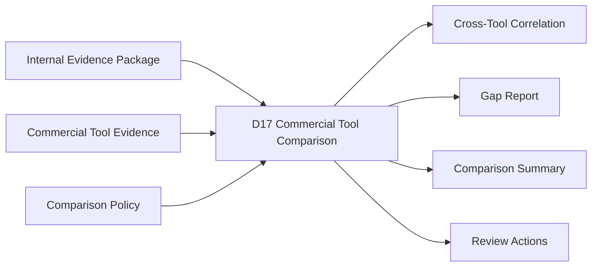
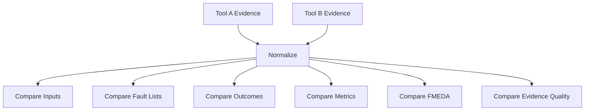
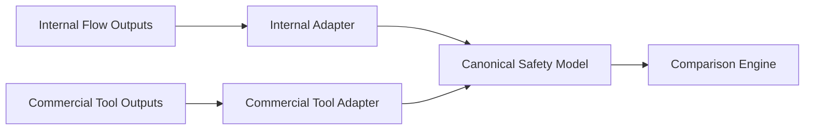
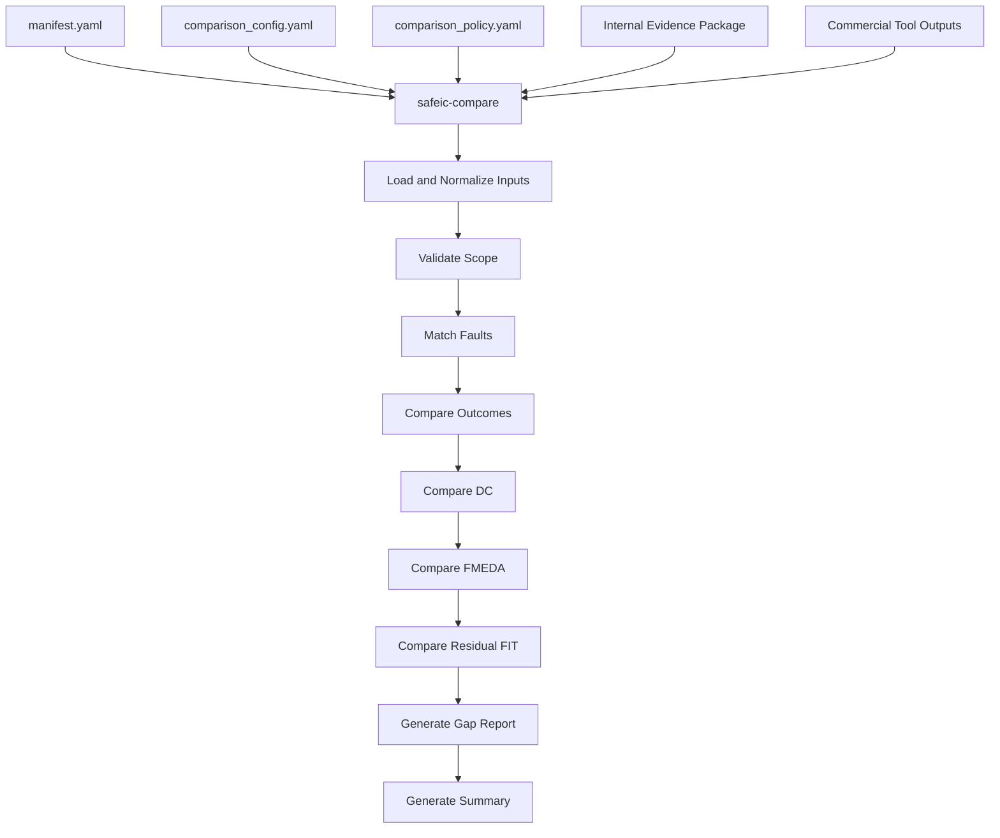
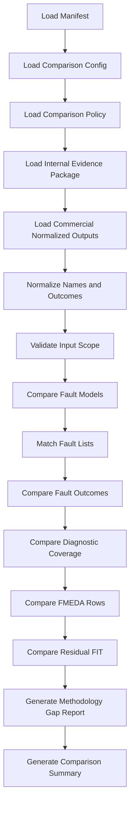
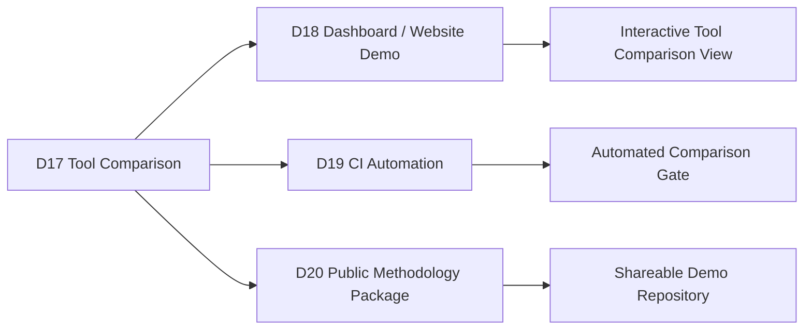

# [Automotive Safe-IC Practice 17] Commercial Tool Comparison: From Evidence Packages to Cross-Tool Correlation and Gap Analysis

**Author**: Darren H. Chen  
**Direction**: Automotive Chip Functional Safety Analysis and Fault Injection Practice  
**Demo**: D17_commercial_tool_comparison  
**Tags**: Automotive Chip, Functional Safety, Commercial Tool Comparison, Fault Injection, Diagnostic Coverage, FMEDA, Safety Evidence, Cross-Tool Correlation, Regression, Methodology Validation

---

## 1. Why This Article Matters

In the previous article, we turned safety analysis into an iterative engineering loop.

D16 compared baseline and current evidence packages and generated:

```text
regression_summary.md
regression_alerts.csv
metric_trend.csv
dc_trend_by_failure_mode.csv
residual_fit_trend.csv
fault_outcome_delta.csv
fmeda_delta_trend.csv
review_item_trend.csv
policy_delta.csv
trend_manifest.yaml
```

That makes the flow iteration-aware.

However, an engineering team often faces another question:

> How do we compare our safety analysis flow with results from another commercial safety tool?

The seventeenth demo in this repository is:

```text
D17_commercial_tool_comparison
```

The generic tool introduced in this article is:

```text
safeic-compare
```

The purpose of `safeic-compare` is to compare evidence from two or more safety-analysis flows:

```text
internal evidence package
commercial tool evidence package
commercial tool reports
commercial tool fault lists
commercial tool coverage tables
commercial tool FMEDA tables
commercial tool run logs
normalization policy
comparison policy
```

and generate:

```text
tool_comparison_summary.md
tool_comparison_matrix.csv
fault_list_overlap.csv
fault_outcome_correlation.csv
dc_comparison_by_failure_mode.csv
dc_comparison_by_endpoint.csv
fmeda_row_comparison.csv
residual_fit_comparison.csv
methodology_gap_report.csv
comparison_warnings.csv
```

The central idea is:

> A commercial tool comparison is not just a speed benchmark or a number comparison. It is a controlled correlation exercise that checks whether two flows analyze the same design scope, fault model, assumptions, classification rules, coverage metrics, and FMEDA mapping.

---

## 2. Where D17 Fits in the Flow

D17 sits after evidence packaging, reporting, and regression tracking.



**Figure 1. D17 compares internal evidence packages with commercial tool evidence and generates correlation and gap reports.**

D16 answers:

```text
Did our flow improve or regress between iterations?
```

D17 answers:

```text
Does our flow correlate with another safety tool?
Where do the results differ?
Are differences caused by methodology, assumptions, tool configuration, fault model, naming, or classification policy?
Which differences require engineering review?
```

This is a major credibility step.

If your flow can explain where it agrees and disagrees with commercial tools, it becomes much more useful as an engineering platform.

---

## 3. Tool Comparison Is Not a Simple Benchmark

It is tempting to compare tools using a simple table:

```text
runtime
fault count
diagnostic coverage
report size
```

But this is not enough.

Two tools may produce different results because they use different:

```text
design hierarchy handling
clock/reset interpretation
black-box modeling
fault model
fault equivalence reduction
fault collapsing
observability definition
alarm mapping
classification policy
diagnostic coverage formula
FIT weighting model
FMEDA row mapping
reporting scope
```

Therefore, a meaningful comparison must ask:

```text
Are the inputs equivalent?
Are the assumptions equivalent?
Are the fault populations comparable?
Are the outcome categories comparable?
Are the metrics computed over the same denominator?
Are the FMEDA rows mapped to the same scope?
```

Without this, comparing two DC percentages is misleading.

---

## 4. What Should D17 Compare?

D17 should compare at several levels.

```text
input package
tool configuration
design scope
fault model
fault list
fault campaign execution
fault outcome classification
measured diagnostic coverage
estimated diagnostic coverage
FMEDA rows
residual FIT
traceability
evidence quality
review items
runtime and scalability
```



**Figure 2. Cross-tool comparison requires normalization before comparison.**

The most important part is normalization.

Tool outputs are rarely directly comparable without schema mapping.

---

## 5. Comparison Requires a Canonical Model

D17 should define a canonical comparison model.

Instead of comparing raw reports directly, convert each tool output into normalized tables:

```text
normalized_design_scope.csv
normalized_fault_list.csv
normalized_fault_outcomes.csv
normalized_dc.csv
normalized_fmeda.csv
normalized_residual_fit.csv
normalized_review_items.csv
normalized_evidence_index.csv
```

Each tool gets an adapter.



**Figure 3. Tool-specific adapters convert different outputs into a canonical safety model for comparison.**

This design keeps the comparison engine stable even if tool report formats differ.

---

## 6. The Canonical Safety Model

A minimal canonical model should contain:

```text
design_object
hierarchical_name
canonical_name
part
subpart
endpoint
failure_mode
fault_id
fault_type
fault_model
expected_alarm
observed_alarm
outcome
outcome_subtype
confidence
estimated_dc
measured_dc
selected_dc
base_fit
residual_fit
safety_mechanism
evidence_source
review_status
```

This is not the internal schema of any specific tool.

It is a comparison schema.

The goal is to ask:

```text
For the same or equivalent design object and failure mode,
do the tools report similar fault outcomes, coverage, and residual risk?
```

---

## 7. Tool Adapters

A tool adapter converts one tool's output format into the canonical model.

Suggested adapter structure:

```text
safeic_compare/
  adapters/
    internal_package_adapter.py
    commercial_csv_adapter.py
    commercial_report_adapter.py
    generic_fmeda_adapter.py
```

An adapter should perform:

```text
file discovery
schema detection
column mapping
name normalization
outcome mapping
metric mapping
warning extraction
evidence ID generation
```

Example mapping file:

```yaml
tool_adapter:
  name: commercial_tool_a

  files:
    fault_list: tool_a/faults.csv
    fault_results: tool_a/results.csv
    coverage: tool_a/coverage.csv
    fmeda: tool_a/fmeda.csv

  columns:
    fault_id: FaultID
    node: SignalPath
    fault_type: FaultType
    outcome: Result
    measured_dc: DC
    failure_mode: FailureMode
```

Adapters are essential because commercial tools often use different names for similar concepts.

---

## 8. Normalization Policy

A normalization policy controls how raw tool data is converted.

Example:

```yaml
normalization_policy:
  hierarchy:
    strip_testbench_prefix: true
    normalize_separator: "."
    remove_escape_slashes: true

  fault_type_mapping:
    SA0: stuck_at_0
    SA1: stuck_at_1
    TF: transient_flip

  outcome_mapping:
    DETECTED: detected
    SAFE: safe
    UNDETECTED: unsafe
    UNKNOWN: unresolved

  dc_units:
    percentage_to_ratio: true

  missing_values:
    empty_alarm: missing_alarm
    empty_dc: not_available
```

Without a normalization policy, tool comparison becomes a manual spreadsheet exercise.

---

## 9. Comparing Input Scope

Before comparing results, compare input scope.

Questions:

```text
Did both flows use the same RTL or netlist?
Did both use the same top module?
Did both use the same clock definitions?
Did both use the same reset assumptions?
Did both include the same black boxes?
Did both use the same safety mechanism configuration?
Did both analyze the same hierarchy?
```

Example output:

```csv
scope_item,internal,commercial,status
top_module,toy_counter,toy_counter,MATCH
rtl_file_hash,aaa111,aaa111,MATCH
clock_list,clk,clk,MATCH
reset_policy,async_active_low,async_active_low,MATCH
blackbox_count,0,0,MATCH
```

If input scope does not match, later metric differences may not be meaningful.

---

## 10. Comparing Fault Models

Fault model comparison is critical.

Example:

```csv
fault_model,internal_enabled,commercial_enabled,status
stuck_at_0,true,true,MATCH
stuck_at_1,true,true,MATCH
transient_flip,true,true,MATCH
delay_fault,false,true,TOOL_ONLY
bridging_fault,false,false,MATCH
```

If one tool includes delay faults and the other does not, total fault counts and coverage values may differ.

D17 should not treat this as a tool disagreement.

It should treat it as a scope difference.

---

## 11. Comparing Fault Lists

Fault list comparison asks:

```text
Which faults are common?
Which faults exist only in Tool A?
Which faults exist only in Tool B?
Which faults appear equivalent but have different IDs?
```

Example output:

```csv
canonical_fault_key,internal_fault_id,commercial_fault_id,match_status
toy_counter.count[0]|stuck_at_0|FM_DATA_CORRUPTION,F001,A_0001,MATCH
toy_counter.count[1]|stuck_at_1|FM_DATA_CORRUPTION,F002,A_0002,MATCH
toy_counter.alarm|stuck_at_0|FM_ALARM_NOT_ASSERTED,F004,A_0100,MATCH
toy_counter.hidden|stuck_at_0,,A_0200,COMMERCIAL_ONLY
```

The canonical fault key may combine:

```text
canonical node
fault type
failure mode
endpoint
```

Fault list overlap is often more important than total fault count.

---

## 12. Fault List Overlap Metrics

D17 should compute overlap metrics.

Example:

```text
internal fault count = 100
commercial fault count = 120
matched faults = 90
internal-only faults = 10
commercial-only faults = 30
overlap ratio vs internal = 90 / 100 = 0.90
overlap ratio vs commercial = 90 / 120 = 0.75
```

Example table:

```csv
metric,value
internal_fault_count,100
commercial_fault_count,120
matched_fault_count,90
internal_only_fault_count,10
commercial_only_fault_count,30
overlap_vs_internal,0.900
overlap_vs_commercial,0.750
```

This tells whether the tools are even analyzing comparable fault populations.

---

## 13. Comparing Fault Outcomes

For matched faults, compare outcomes.

Example:

```csv
canonical_fault_key,internal_outcome,commercial_outcome,correlation
toy_counter.count[0]|stuck_at_0,detected,detected,MATCH
toy_counter.alarm|stuck_at_0,unsafe,unsafe,MATCH
toy_counter.count_parity|stuck_at_0,unsafe,detected,DISAGREE
toy_counter.hidden|stuck_at_0,unresolved,unsafe,DISAGREE
```

Outcome correlation categories:

```text
MATCH
DISAGREE
INTERNAL_STRONGER
COMMERCIAL_STRONGER
EVIDENCE_GAP
NOT_COMPARABLE
```

Outcome disagreement should trigger review.

It may reveal:

```text
missing alarm mapping
different classification policy
different observe point set
different fault effect propagation
different fault injection timing
different diagnostic window
```

---

## 14. Outcome Mapping Is Not Always One-to-One

Tools may use different outcome categories.

For example:

```text
detected
safe
unsafe
unresolved
not_classified
```

may need to map to tool-specific labels:

```text
covered
not_covered
no_effect
unknown
aborted
unobservable
equivalent
```

A mapping policy may be:

```yaml
outcome_mapping:
  covered: detected
  detected: detected
  no_effect: safe
  equivalent: safe
  not_covered: unsafe
  undetected: unsafe
  unknown: unresolved
  aborted: not_classified
  unsupported: not_classified
```

This mapping must be visible in the comparison report.

Otherwise, users may think two categories are equivalent when they are not.

---

## 15. Comparing Diagnostic Coverage

Diagnostic coverage comparison should be done by aligned group.

Recommended dimensions:

```text
overall
endpoint
failure mode
safety mechanism
part
subpart
```

Example:

```csv
group_type,group_id,internal_measured_dc,commercial_measured_dc,delta,status
failure_mode,FM_DATA_CORRUPTION,0.950,0.940,0.010,MATCH
failure_mode,FM_ALARM_NOT_ASSERTED,0.000,0.600,-0.600,DISAGREE
endpoint,toy_counter.count,1.000,0.980,0.020,MATCH
endpoint,toy_counter.alarm,0.500,0.900,-0.400,REVIEW
```

D17 should not compare:

```text
internal endpoint-level DC
```

against:

```text
commercial overall DC
```

unless the scope is explicitly aligned.

---

## 16. DC Comparison Requires Formula Awareness

Two tools may both report "DC" but compute it differently.

Differences may include:

```text
count-based vs FIT-weighted
safe faults included vs excluded
unresolved faults excluded vs included
not-classified runs excluded vs counted
equivalent faults collapsed vs uncollapsed
late detection accepted vs rejected
secondary alarm accepted vs rejected
```

Therefore, D17 must compare measurement policy.

Example output:

```csv
policy_item,internal,commercial,status
dc_formula,detected/(detected+unsafe),covered/total,DIFFERENT
safe_fault_handling,reported_separately,included_in_coverage,DIFFERENT
weighting,count,FIT_weighted,DIFFERENT
late_alarm_policy,unsafe,detected,DIFFERENT
```

If formulas differ, DC values may not be directly comparable.

The comparison report should say so.

---

## 17. Comparing FMEDA Rows

FMEDA row comparison checks:

```text
part
subpart
failure mode
base FIT
estimated DC
measured DC
selected DC
residual FIT
safety mechanism
review status
```

Example:

```csv
row_key,internal_row,commercial_row,field,internal_value,commercial_value,status
PART_COUNTER|FM_DATA_CORRUPTION,R001,A_R001,base_fit,0.064,0.064,MATCH
PART_COUNTER|FM_DATA_CORRUPTION,R001,A_R001,selected_dc,0.900,0.920,REVIEW
PART_COUNTER|FM_ALARM_NOT_ASSERTED,R003,A_R010,residual_fit,0.010,0.004,DISAGREE
```

FMEDA comparison can reveal differences in:

```text
failure mode decomposition
FIT allocation
coverage assumption
selected DC policy
residual risk calculation
```

This is often more important than raw fault outcome comparison.

---

## 18. Comparing Residual FIT

Residual FIT comparison helps determine whether differences matter.

Example:

```csv
failure_mode,internal_residual_fit,commercial_residual_fit,delta,relative_delta,status
FM_DATA_CORRUPTION,0.0064,0.0051,0.0013,0.203,REVIEW
FM_ALARM_NOT_ASSERTED,0.0100,0.0040,0.0060,0.600,DISAGREE
FM_DIAGNOSTIC_STATE_CORRUPTION,0.0040,0.0040,0.0000,0.000,MATCH
```

A small DC difference may not matter if residual FIT impact is tiny.

A moderate DC difference may matter if it affects a dominant FIT contributor.

Therefore, residual FIT comparison is a better prioritization signal than DC comparison alone.

---

## 19. Comparing Safety Mechanism Recognition

Commercial tools may recognize safety mechanisms differently.

Example:

```csv
mechanism,internal_status,commercial_status,comparison
endpoint_parity,recognized,recognized,MATCH
alarm_path_monitor,not_modeled,recognized,COMMERCIAL_ONLY
diagnostic_state_protection,missing,missing,MATCH
```

If one tool recognizes a mechanism and another does not, investigate:

```text
mechanism naming
configuration file
alarm mapping
DCE import/export
manual annotation
fault campaign observability
```

This is not necessarily a tool bug.

It may be a configuration or mapping issue.

---

## 20. Comparing Evidence Traceability

A useful comparison includes evidence traceability.

Questions:

```text
Can each metric be traced to a fault list?
Can each FMEDA row be traced to fault outcomes?
Can each outcome be traced to a campaign run?
Can each review item be traced to an unsafe or unresolved fault?
```

Example:

```csv
trace_item,internal_trace,commercial_trace,status
FMEDA_R003_to_fault_F004,true,true,MATCH
DC_FM_ALARM_NOT_ASSERTED_to_fault_outcomes,true,false,INTERNAL_ONLY
fault_F004_to_campaign_log,true,true,MATCH
review_item_to_evidence,true,false,INTERNAL_ONLY
```

Traceability is a major credibility factor.

A tool may compute good numbers but provide weak traceability.

D17 should make that visible.

---

## 21. Comparing Runtime and Scalability

Runtime comparison is useful, but only after scope alignment.

Example:

```csv
metric,internal,commercial,status
input_fault_count,100,120,DIFFERENT_SCOPE
matched_fault_count,90,90,MATCHED_SCOPE
runtime_seconds,35,20,COMMERCIAL_FASTER
memory_peak_mb,512,1024,INTERNAL_LOWER_MEMORY
```

Runtime should be normalized by:

```text
matched fault count
design size
fault model
simulation mode
parallelism
hardware
```

Otherwise, runtime comparison is not meaningful.

For early demos, runtime comparison can be descriptive rather than competitive.

---

## 22. Comparison Policy

D17 should be driven by a comparison policy.

Example:

```yaml
comparison_policy:
  scope:
    require_same_top: true
    require_same_rtl_hash: false
    warn_on_clock_mismatch: true

  fault_matching:
    primary_key: fault_id
    fallback_key:
      - canonical_node
      - fault_type
      - failure_mode
      - endpoint

  dc_comparison:
    require_same_formula: false
    warn_if_formula_differs: true
    match_threshold: 0.05
    review_threshold: 0.15

  residual_fit:
    review_relative_delta: 0.20
    high_relative_delta: 0.50

  outcome_comparison:
    detected_to_unsafe: high
    unsafe_to_detected: review
    unresolved_mismatch: review

  report:
    show_tool_a_only_faults: true
    show_tool_b_only_faults: true
    show_policy_differences: true
```

This policy keeps the comparison disciplined.

---

## 23. Comparison Is Not About Declaring a Winner

A poor comparison report says:

```text
Tool A is better.
Tool B is worse.
```

A useful comparison report says:

```text
Tool A and Tool B agree on these fault outcomes.
They differ on these failure modes.
The differences appear to be caused by fault model scope and classification policy.
These rows require review.
These metrics are not directly comparable.
These findings improve confidence in our methodology.
```

The purpose is not marketing.

The purpose is engineering correlation.

---

## 24. Main Inputs for D17

Suggested inputs:

```text
inputs/
  comparison_config.yaml
  comparison_policy.yaml

  internal/
    evidence_package/
      package_manifest.yaml
      evidence_index.csv
      metrics/
      fmeda/
      campaign/
      policies/

  commercial/
    tool_manifest.yaml
    raw_reports/
    normalized/
      normalized_fault_list.csv
      normalized_fault_outcomes.csv
      normalized_dc.csv
      normalized_fmeda.csv
```

The commercial side may start as manually exported CSV files.

Later, adapters can parse native report formats.

---

## 25. Main Outputs for D17

Suggested outputs:

```text
outputs/
  tool_comparison_summary.md
  tool_comparison_matrix.csv
  input_scope_comparison.csv
  fault_model_comparison.csv
  fault_list_overlap.csv
  fault_outcome_correlation.csv
  dc_comparison_by_failure_mode.csv
  dc_comparison_by_endpoint.csv
  fmeda_row_comparison.csv
  residual_fit_comparison.csv
  traceability_comparison.csv
  runtime_comparison.csv
  methodology_gap_report.csv
  comparison_warnings.csv
  comparison_manifest.yaml
```

Each output has a clear purpose.

| Output | Purpose |
|---|---|
| `tool_comparison_summary.md` | Human-readable comparison report |
| `input_scope_comparison.csv` | Check whether inputs match |
| `fault_list_overlap.csv` | Compare fault populations |
| `fault_outcome_correlation.csv` | Compare matched fault outcomes |
| `dc_comparison_by_failure_mode.csv` | Compare diagnostic coverage by failure mode |
| `fmeda_row_comparison.csv` | Compare FMEDA rows and DC selection |
| `residual_fit_comparison.csv` | Compare residual risk |
| `methodology_gap_report.csv` | Explain causes of differences |
| `comparison_warnings.csv` | Highlight risky differences |

---

## 26. Example `comparison_config.yaml`

```yaml
comparison:
  name: toy_counter_internal_vs_commercial_tool
  internal_label: internal_flow
  commercial_label: commercial_tool_a
  design: toy_counter

inputs:
  internal_package: inputs/internal/evidence_package
  commercial_normalized: inputs/commercial/normalized

commercial_adapter:
  type: generic_csv
  manifest: inputs/commercial/tool_manifest.yaml

outputs:
  summary: outputs/tool_comparison_summary.md
  matrix: outputs/tool_comparison_matrix.csv
```

This makes the comparison reproducible.

---

## 27. Example `tool_manifest.yaml`

```yaml
tool:
  name: commercial_tool_a
  version: demo_placeholder
  run_id: tool_a_run_001
  design: toy_counter

normalized_outputs:
  fault_list: normalized/normalized_fault_list.csv
  fault_outcomes: normalized/normalized_fault_outcomes.csv
  diagnostic_coverage: normalized/normalized_dc.csv
  fmeda: normalized/normalized_fmeda.csv
  residual_fit: normalized/normalized_residual_fit.csv

notes:
  - demo uses normalized CSV exports
  - raw commercial reports are not included in public repository
```

For public demos, do not include proprietary commercial report content.

Use normalized sample data or synthetic placeholders.

---

## 28. Tool Architecture

The generic tool `safeic-compare` can be implemented as a staged pipeline.



**Figure 4. `safeic-compare` normalizes tool outputs, validates scope, compares fault results and metrics, and generates a gap report.**

Suggested internal modules:

```text
safeic_compare/
  cli.py
  manifest.py
  load_config.py
  adapters/
    internal_package_adapter.py
    generic_csv_adapter.py
  normalize/
    names.py
    outcomes.py
    metrics.py
  scope_compare.py
  fault_match.py
  outcome_compare.py
  dc_compare.py
  fmeda_compare.py
  residual_fit_compare.py
  traceability_compare.py
  gap_analysis.py
  report.py
```

Responsibilities:

| Module | Responsibility |
|---|---|
| `internal_package_adapter.py` | Load D14-style evidence package |
| `generic_csv_adapter.py` | Load normalized commercial CSV exports |
| `names.py` | Normalize hierarchy and signal names |
| `outcomes.py` | Normalize outcome categories |
| `metrics.py` | Normalize DC units and formulas |
| `scope_compare.py` | Compare input and configuration scope |
| `fault_match.py` | Match faults across tools |
| `outcome_compare.py` | Compare matched fault outcomes |
| `dc_compare.py` | Compare diagnostic coverage |
| `fmeda_compare.py` | Compare FMEDA rows |
| `gap_analysis.py` | Explain differences and generate review actions |
| `report.py` | Generate CSV and Markdown outputs |

---

## 29. D17 Directory Structure

Suggested directory:

```text
D17_commercial_tool_comparison/
  README.md
  run_demo.sh
  run_demo.csh
  manifest.yaml

  inputs/
    comparison_config.yaml
    comparison_policy.yaml

    internal/
      evidence_package/
        package_manifest.yaml
        metrics/
          measured_dc_by_failure_mode.csv
          measured_dc_by_endpoint.csv
          measured_residual_fit.csv
        fmeda/
          fmeda_table.csv
        campaign/
          fault_outcomes.csv
        policies/
          classification_policy.yaml
          measurement_policy.yaml

    commercial/
      tool_manifest.yaml
      normalized/
        normalized_design_scope.csv
        normalized_fault_model.csv
        normalized_fault_list.csv
        normalized_fault_outcomes.csv
        normalized_dc.csv
        normalized_fmeda.csv
        normalized_residual_fit.csv

  outputs/
    tool_comparison_summary.md
    input_scope_comparison.csv
    fault_model_comparison.csv
    fault_list_overlap.csv
    fault_outcome_correlation.csv
    dc_comparison_by_failure_mode.csv
    dc_comparison_by_endpoint.csv
    fmeda_row_comparison.csv
    residual_fit_comparison.csv
    traceability_comparison.csv
    methodology_gap_report.csv
    comparison_warnings.csv
    comparison_manifest.yaml
```

This layout keeps internal and commercial evidence separated.

---

## 30. D17 Manifest

Example:

```yaml
project:
  name: automotive_safeic_practice
  demo: D17_commercial_tool_comparison
  top_module: toy_counter

inputs:
  comparison_config: inputs/comparison_config.yaml
  comparison_policy: inputs/comparison_policy.yaml
  internal_package: inputs/internal/evidence_package
  commercial_normalized: inputs/commercial/normalized
  commercial_manifest: inputs/commercial/tool_manifest.yaml

outputs:
  summary: outputs/tool_comparison_summary.md
  input_scope: outputs/input_scope_comparison.csv
  fault_model: outputs/fault_model_comparison.csv
  fault_overlap: outputs/fault_list_overlap.csv
  outcome_correlation: outputs/fault_outcome_correlation.csv
  dc_by_failure_mode: outputs/dc_comparison_by_failure_mode.csv
  dc_by_endpoint: outputs/dc_comparison_by_endpoint.csv
  fmeda: outputs/fmeda_row_comparison.csv
  residual_fit: outputs/residual_fit_comparison.csv
  gaps: outputs/methodology_gap_report.csv
  warnings: outputs/comparison_warnings.csv
```

The manifest defines what is compared.

---

## 31. D17 Execution Flow



**Figure 5. D17 execution flow: load, normalize, validate scope, match faults, compare results, and generate gap analysis.**

Example bash script:

```bash
#!/usr/bin/env bash
set -euo pipefail

safeic-compare \
  --manifest manifest.yaml \
  --output-dir outputs
```

Example csh script:

```csh
#!/bin/csh -f

set DEMO = D17_commercial_tool_comparison
echo "Running $DEMO"

safeic-compare \
  --manifest manifest.yaml \
  --output-dir outputs
```

Expected outputs:

```text
outputs/tool_comparison_summary.md
outputs/input_scope_comparison.csv
outputs/fault_model_comparison.csv
outputs/fault_list_overlap.csv
outputs/fault_outcome_correlation.csv
outputs/dc_comparison_by_failure_mode.csv
outputs/dc_comparison_by_endpoint.csv
outputs/fmeda_row_comparison.csv
outputs/residual_fit_comparison.csv
outputs/traceability_comparison.csv
outputs/methodology_gap_report.csv
outputs/comparison_warnings.csv
outputs/comparison_manifest.yaml
```

---

## 32. Example `fault_outcome_correlation.csv`

```csv
canonical_fault_key,internal_fault_id,commercial_fault_id,internal_outcome,commercial_outcome,correlation,review_reason
toy_counter.count[0]|stuck_at_0,F001,A001,detected,detected,MATCH,
toy_counter.count_parity|stuck_at_0,F003,A003,unsafe,detected,DISAGREE,commercial tool reports detection not seen in internal trace
toy_counter.alarm|stuck_at_0,F004,A004,unsafe,unsafe,MATCH,
toy_counter.hidden|stuck_at_0,,A010,,unsafe,COMMERCIAL_ONLY,not present in internal fault list
```

This table is one of the most important D17 outputs.

---

## 33. Example `dc_comparison_by_failure_mode.csv`

```csv
failure_mode,internal_dc,commercial_dc,delta,status,comment
FM_DATA_CORRUPTION,1.000,0.980,0.020,MATCH,within threshold
FM_DIAGNOSTIC_STATE_CORRUPTION,0.000,0.500,-0.500,DISAGREE,outcome mismatch on diagnostic state faults
FM_ALARM_NOT_ASSERTED,0.000,0.000,0.000,MATCH,both show uncovered alarm path
```

This table identifies which failure modes require deeper review.

---

## 34. Example `methodology_gap_report.csv`

```csv
gap_id,category,severity,description,recommended_action
G001,outcome_policy,MEDIUM,commercial tool counts secondary alarm as detected but internal policy does not,review secondary alarm policy
G002,fault_scope,HIGH,commercial-only hidden-state faults are not in internal fault list,review fault list generation scope
G003,dc_formula,MEDIUM,commercial DC includes safe faults while internal primary DC excludes them,do not compare global DC directly
G004,traceability,LOW,commercial normalized data has no campaign log link,request traceability export if available
```

Gap reports are more useful than simple pass/fail comparison.

---

## 35. Example `tool_comparison_summary.md`

```md
# D17 Commercial Tool Comparison Summary

Design: toy_counter  
Internal flow: internal_flow  
Commercial reference: commercial_tool_a  

## Scope Summary

Top module: MATCH  
Clock list: MATCH  
Fault models: stuck-at and transient flip match  
Commercial tool has additional hidden-state faults  

## Fault List Overlap

Internal faults: 5  
Commercial faults: 6  
Matched faults: 4  
Internal-only faults: 1  
Commercial-only faults: 2  

## Outcome Correlation

Matched outcomes: 3  
Disagreements: 1  
Commercial-only unsafe faults: 1  

## Key Findings

1. Both flows agree that alarm stuck-at-0 remains unsafe.
2. The commercial flow reports diagnostic-state detection where the internal trace-based flow reports unsafe.
3. DC values are not directly comparable where denominator policy differs.
4. Additional commercial-only faults should be reviewed for internal fault-list expansion.

## Recommended Actions

1. Review diagnostic-state fault classification.
2. Align secondary alarm policy.
3. Expand internal fault list or justify scope difference.
4. Compare residual FIT after scope alignment.
```

The summary should explain differences, not just show them.

---

## 36. Validation Rules

`safeic-compare` should validate:

```text
comparison_config.yaml exists
comparison_policy.yaml exists
internal evidence package exists
commercial normalized outputs exist
required normalized tables exist
canonical key fields exist
outcome mapping is defined
DC values are numeric and normalized
FMEDA row keys are valid
fault matching policy is valid
comparison thresholds are valid
tool labels are defined
```

Example messages:

```text
[PASS] internal package loaded
[PASS] commercial normalized fault outcomes loaded
[PASS] fault matching completed: 90 matched, 10 internal-only, 30 commercial-only
[WARN] DC formula differs between flows
[WARN] commercial tool includes fault model not enabled internally
[ERROR] commercial normalized_fault_outcomes.csv missing outcome column
```

D17 should fail on malformed comparison data but warn on methodology differences.

---

## 37. Common Mistakes

### 37.1 Comparing DC Numbers Without Scope Alignment

A global DC number is meaningless if the fault populations differ.

### 37.2 Ignoring Fault Model Differences

Different fault models produce different results.

### 37.3 Treating Category Names as Equivalent

One tool's "covered" may not equal another tool's "detected" unless policy confirms it.

### 37.4 Ignoring Safe and Unresolved Handling

DC formulas depend heavily on how safe and unresolved faults are handled.

### 37.5 Comparing Raw Fault IDs Only

Fault IDs may differ across tools.

Use canonical keys and fallback matching.

### 37.6 Declaring a Winner Too Early

Tool comparison should produce correlation and gap analysis, not simplistic ranking.

### 37.7 Publishing Proprietary Tool Outputs

For public repositories, use normalized sample data or synthetic placeholders unless tool output sharing is allowed.

---

## 38. How D17 Connects to Later Demos

D17 creates the basis for credible comparison and external communication.



**Figure 6. D17 provides the comparison foundation for dashboards, automation, and public methodology demonstration.**

A platform that can compare and explain results across flows is more credible than a platform that only reports its own numbers.

---

## 39. Recommended Implementation Stages

D17 can be implemented in stages.

### Stage 1: Normalized CSV Comparison

Compare internal and commercial normalized CSV files.

Deliverables:

```text
input_scope_comparison.csv
fault_list_overlap.csv
dc_comparison_by_failure_mode.csv
tool_comparison_summary.md
```

### Stage 2: Fault Outcome Correlation

Match faults and compare outcomes.

Deliverables:

```text
fault_outcome_correlation.csv
comparison_warnings.csv
```

### Stage 3: FMEDA and Residual FIT Comparison

Compare FMEDA rows and residual FIT.

Deliverables:

```text
fmeda_row_comparison.csv
residual_fit_comparison.csv
```

### Stage 4: Methodology Gap Report

Explain differences caused by scope, policy, naming, and formulas.

Deliverables:

```text
methodology_gap_report.csv
```

### Stage 5: Adapter Layer

Add tool-specific adapters.

Deliverables:

```text
adapters/
normalized/
```

This staged approach makes D17 useful even before full commercial-report parsing exists.

---

## 40. Summary

Commercial tool comparison is a controlled correlation exercise.

The D17 demo:

```text
D17_commercial_tool_comparison
```

introduces the generic tool:

```text
safeic-compare
```

The tool consumes:

```text
internal evidence package
commercial normalized outputs
comparison_config.yaml
comparison_policy.yaml
normalization policy
```

and generates:

```text
tool_comparison_summary.md
tool_comparison_matrix.csv
input_scope_comparison.csv
fault_model_comparison.csv
fault_list_overlap.csv
fault_outcome_correlation.csv
dc_comparison_by_failure_mode.csv
dc_comparison_by_endpoint.csv
fmeda_row_comparison.csv
residual_fit_comparison.csv
traceability_comparison.csv
methodology_gap_report.csv
comparison_warnings.csv
comparison_manifest.yaml
```

The central lesson is:

> Cross-tool comparison is meaningful only when design scope, fault model, classification categories, DC formulas, FMEDA mapping, and evidence traceability are made explicit. Agreement improves confidence; disagreement is valuable when it can be explained.

D17 turns tool comparison from a vague benchmark into an engineering correlation workflow.

---

## 41. D17 Demo Checklist

For `D17_commercial_tool_comparison`, the expected deliverables are:

```text
[ ] README.md
[ ] run_demo.sh
[ ] run_demo.csh
[ ] manifest.yaml

[ ] inputs/comparison_config.yaml
[ ] inputs/comparison_policy.yaml

[ ] inputs/internal/evidence_package/package_manifest.yaml
[ ] inputs/internal/evidence_package/metrics/measured_dc_by_failure_mode.csv
[ ] inputs/internal/evidence_package/metrics/measured_dc_by_endpoint.csv
[ ] inputs/internal/evidence_package/metrics/measured_residual_fit.csv
[ ] inputs/internal/evidence_package/fmeda/fmeda_table.csv
[ ] inputs/internal/evidence_package/campaign/fault_outcomes.csv
[ ] inputs/internal/evidence_package/policies/classification_policy.yaml
[ ] inputs/internal/evidence_package/policies/measurement_policy.yaml

[ ] inputs/commercial/tool_manifest.yaml
[ ] inputs/commercial/normalized/normalized_design_scope.csv
[ ] inputs/commercial/normalized/normalized_fault_model.csv
[ ] inputs/commercial/normalized/normalized_fault_list.csv
[ ] inputs/commercial/normalized/normalized_fault_outcomes.csv
[ ] inputs/commercial/normalized/normalized_dc.csv
[ ] inputs/commercial/normalized/normalized_fmeda.csv
[ ] inputs/commercial/normalized/normalized_residual_fit.csv

[ ] outputs/tool_comparison_summary.md
[ ] outputs/tool_comparison_matrix.csv
[ ] outputs/input_scope_comparison.csv
[ ] outputs/fault_model_comparison.csv
[ ] outputs/fault_list_overlap.csv
[ ] outputs/fault_outcome_correlation.csv
[ ] outputs/dc_comparison_by_failure_mode.csv
[ ] outputs/dc_comparison_by_endpoint.csv
[ ] outputs/fmeda_row_comparison.csv
[ ] outputs/residual_fit_comparison.csv
[ ] outputs/traceability_comparison.csv
[ ] outputs/methodology_gap_report.csv
[ ] outputs/comparison_warnings.csv
[ ] outputs/comparison_manifest.yaml
```

A successful D17 run should answer:

```text
Are the two flows analyzing the same design scope?
Are the fault models aligned?
How much do the fault lists overlap?
Which matched faults have the same outcome?
Which matched faults disagree?
Are DC values comparable under the same formula?
Which failure modes show large DC differences?
Which FMEDA rows differ?
Which residual FIT differences matter most?
Are differences caused by scope, policy, naming, or true methodology gaps?
Which differences require engineering review?
Can the comparison be safely included in a public methodology demo?
```
