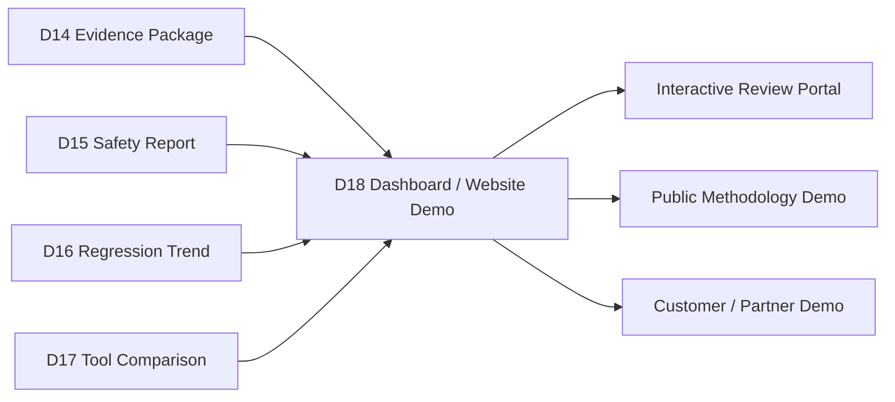
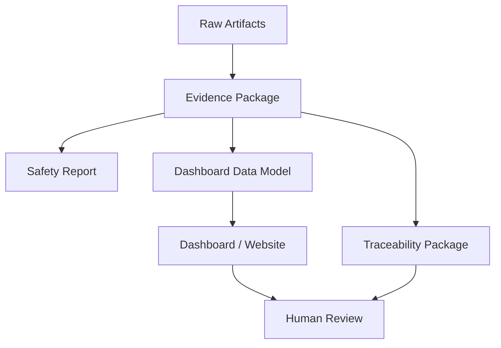
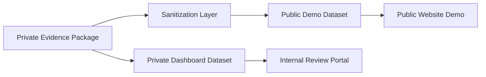
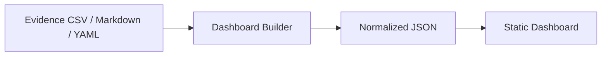
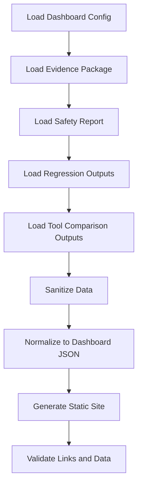
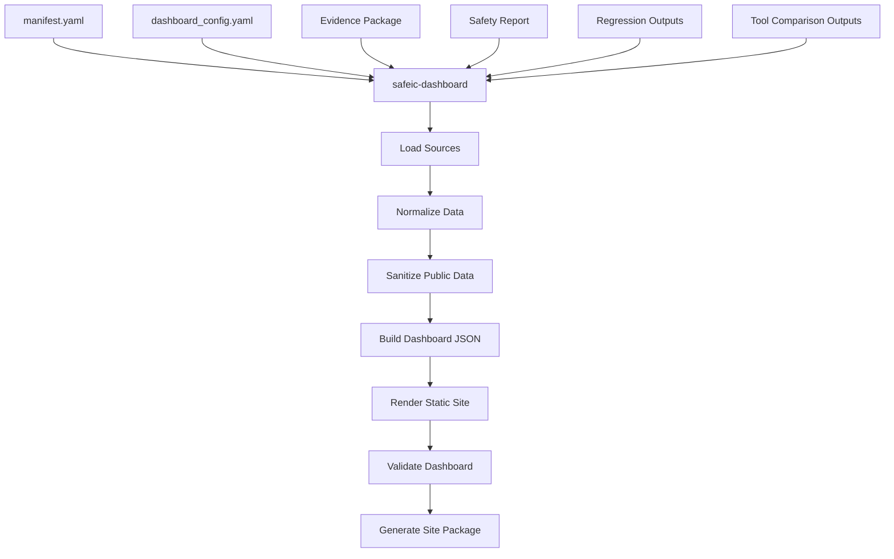
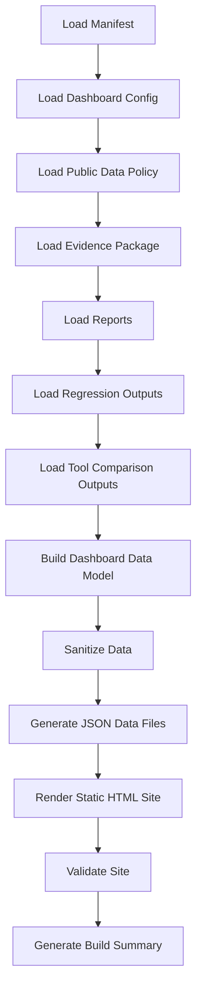
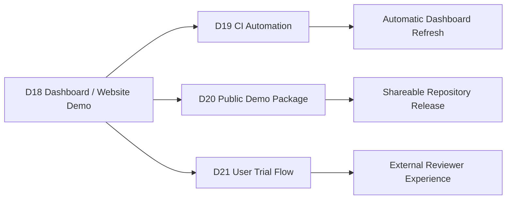

# [Automotive Safe-IC Practice 18] Dashboard and Website Demo: From Safety Evidence Packages to an Interactive Engineering Review Portal

**Author**: Darren H. Chen  
**Direction**: Automotive Chip Functional Safety Analysis and Fault Injection Practice  
**Demo**: D18_dashboard_and_website_demo  
**Tags**: Automotive Chip, Functional Safety, Safety Dashboard, Website Demo, Evidence Package, FMEDA, Fault Injection, Diagnostic Coverage, Residual FIT, Tool Comparison, Engineering Review

---

## 1. Why This Article Matters

In the previous article, we introduced a commercial tool comparison workflow.

D17 compared an internal safety evidence package with normalized commercial-tool evidence and generated outputs such as:

```text
tool_comparison_summary.md
tool_comparison_matrix.csv
fault_list_overlap.csv
fault_outcome_correlation.csv
dc_comparison_by_failure_mode.csv
fmeda_row_comparison.csv
residual_fit_comparison.csv
methodology_gap_report.csv
comparison_warnings.csv
```

That comparison makes the flow more credible.

However, reports and CSV files are still not the easiest way to communicate a safety engineering workflow.

A reviewer, customer, manager, collaborator, or potential employer may ask:

> Can I see the safety flow, evidence, metrics, FMEDA updates, fault results, trend tracking, and tool comparison in one navigable demo?

The eighteenth demo in this repository is:

```text
D18_dashboard_and_website_demo
```

The generic tool introduced in this article is:

```text
safeic-dashboard
```

The purpose of `safeic-dashboard` is to convert safety evidence packages, reports, metrics, trends, and comparison outputs into a static or lightweight interactive review portal:

```text
evidence package
safety report
metric tables
FMEDA tables
fault outcomes
regression trend outputs
commercial tool comparison outputs
public-safe metadata
dashboard configuration
```

and generate:

```text
site/index.html
site/data/dashboard_index.json
site/data/metrics/*.json
site/data/fmeda/*.json
site/data/campaign/*.json
site/data/trends/*.json
site/data/comparison/*.json
site/assets/
site/README.md
```

The central idea is:

> A dashboard is not just a visualization layer. It is a communication layer that turns structured safety evidence into an inspectable, navigable, and shareable engineering story.

---

## 2. Where D18 Fits in the Flow

D18 sits after reporting, regression tracking, and tool comparison.



**Figure 1. D18 turns evidence packages, reports, trends, and comparison outputs into a dashboard and website demo.**

Earlier demos answered:

```text
What evidence exists?
What does the report say?
How did metrics change over iterations?
How does this flow compare with another tool?
```

D18 answers:

```text
Can the whole workflow be reviewed interactively?
Can key metrics be inspected quickly?
Can unsafe faults be linked to FMEDA rows?
Can trend changes be viewed across iterations?
Can tool comparison gaps be explored?
Can public-safe demo data be separated from private project data?
```

This is the transition from file-based engineering output to product-style demonstration.

---

## 3. Dashboard Is Not a Replacement for Evidence

A dashboard must not replace the evidence package.

It should sit on top of it.



**Figure 2. The dashboard presents evidence, but the evidence package remains the source of truth.**

A good dashboard should make it easy to navigate:

```text
metrics
fault outcomes
FMEDA rows
review items
trend changes
comparison gaps
assumptions
limitations
traceability
```

But every displayed number should still point back to source evidence.

---

## 4. Why a Dashboard Matters

A safety workflow has many artifacts:

```text
CSV tables
Markdown reports
YAML policies
log files
fault lists
FMEDA rows
trend reports
comparison matrices
review items
```

These artifacts are excellent for reproducibility, but hard for quick understanding.

A dashboard helps by organizing them into review pages:

```text
Overview
Metrics
Fault Campaign
Fault Outcomes
Measured DC
FMEDA
Residual FIT
Review Items
Regression Trends
Tool Comparison
Traceability
Assumptions
Downloads
```

A reviewer can start from a top-level view and drill down into evidence.

This makes the workflow easier to communicate without sacrificing traceability.

---

## 5. Public Demo vs Private Project Dashboard

A key architecture decision is to separate:

```text
public methodology demo
private project dashboard
```

Public demo data should avoid:

```text
proprietary RTL
customer names
license-protected reports
commercial tool raw outputs
private tool logs
internal project paths
confidential safety assumptions
supplier-specific FIT data
```

Private dashboards can include more details, but should still control access.



**Figure 3. Public and private dashboards should be generated from different data profiles.**

D18 should support both profiles.

For this article series, the default is:

```text
public_methodology_demo
```

---

## 6. Dashboard Data Model

A dashboard should not read every raw CSV directly at runtime.

It should use a dashboard data model.

Suggested normalized JSON files:

```text
dashboard_index.json
overview_metrics.json
fault_outcomes.json
measured_dc.json
fmeda_rows.json
residual_fit.json
review_items.json
trend_summary.json
tool_comparison.json
traceability_links.json
assumptions.json
warnings.json
```

This is similar to the canonical model used in D17.

The idea is:

```text
raw evidence package
→ dashboard build step
→ normalized dashboard data
→ static web presentation
```



**Figure 4. D18 converts file-based evidence into normalized dashboard JSON.**

This separation keeps the website simple and reproducible.

---

## 7. Main Dashboard Pages

A practical D18 dashboard can include the following pages:

```text
1. Overview
2. Safety Flow
3. Key Metrics
4. Fault Campaign
5. Fault Outcomes
6. Diagnostic Coverage
7. FMEDA
8. Residual FIT
9. Review Items
10. Regression Trends
11. Commercial Tool Comparison
12. Traceability
13. Assumptions and Limitations
14. Downloads
```

Each page should answer a specific review question.

For example:

```text
Overview:
  What is the current safety status?

Fault Outcomes:
  Which faults are detected, safe, unsafe, unresolved?

FMEDA:
  Which rows use estimated DC, measured DC, or selected DC?

Trends:
  Did safety metrics improve or regress?

Comparison:
  Where do internal and commercial-tool outputs agree or disagree?
```

A dashboard without clear review questions becomes decorative.

---

## 8. Overview Page

The overview page should summarize the entire package.

Suggested cards:

```text
Design
Analysis scope
Evidence package version
Total base FIT
Total residual FIT
Weighted selected DC
Unsafe fault count
Unresolved fault count
Review-required row count
High-severity review items
Dashboard profile
```

Example data:

```json
{
  "design": "toy_counter",
  "scope": "functional safety analysis and fault injection practice",
  "total_base_fit": 0.078,
  "total_residual_fit": 0.0204,
  "weighted_selected_dc": 0.738,
  "unsafe_faults": 2,
  "unresolved_faults": 0,
  "review_required_rows": 2,
  "profile": "public_methodology_demo"
}
```

The overview should be honest.

If the data is demo-only, say so clearly.

---

## 9. Safety Flow Page

The safety flow page explains how artifacts are generated.

```mermaid
flowchart LR
    A[D01 Input Package] --> B[D02 Assumption Setup]
    B --> C[D03 FIT Modeling]
    C --> D[D04 Base FIT Review]
    D --> E[D05 Structural Safety Model]
    E --> F[D06 Estimated DC]
    F --> G[D07 Safety Mechanism Selection]
    G --> H[D08 Fault List]
    H --> I[D09 VCD Context]
    I --> J[D10 Fault Campaign]
    J --> K[D11 Outcome Classification]
    K --> L[D12 Measured DC]
    L --> M[D13 FMEDA Update]
    M --> N[D14 Evidence Package]
    N --> O[D15 Report]
    O --> P[D16 Regression]
    P --> Q[D17 Comparison]
    Q --> R[D18 Dashboard]
```



**Figure 5. The dashboard should show the complete safety analysis and fault injection flow.**

This page is important for public explanation.

It tells users that the platform is not just one script.

It is a structured safety analysis workflow.

---

## 10. Key Metrics Page

The key metrics page should provide concise, grouped metrics.

Suggested sections:

```text
top-level safety metrics
measured diagnostic coverage
residual FIT by failure mode
FMEDA review status
campaign quality
evidence quality
```

Example metric table:

```csv
metric,value,status
total_base_fit,0.078,INFO
total_residual_fit,0.0204,REVIEW
weighted_selected_dc,0.738,REVIEW
unsafe_faults,2,HIGH
review_required_rows,2,HIGH
metric_confidence,LOW,WARN
```

The dashboard can show these as cards and tables.

For public demos, avoid pretending that toy data represents production-level signoff.

---

## 11. Fault Campaign Page

The fault campaign page should show execution status.

Suggested fields:

```text
campaign id
design
fault list version
total requested faults
executed faults
passed runs
failed runs
timeout runs
not-classified runs
execution mode
run timestamp
```

Example:

```csv
item,value
campaign_id,campaign_demo_001
design,toy_counter
requested_faults,5
executed_faults,5
passed_runs,5
failed_runs,0
not_classified,0
execution_mode,emulation
```

The page should also link to:

```text
campaign_status.csv
raw_fault_results.csv
fault_outcomes.csv
campaign warnings
```

A campaign page helps reviewers check whether measured results are backed by actual runs.

---

## 12. Fault Outcomes Page

The fault outcomes page should allow filtering by:

```text
outcome
failure mode
fault type
node
endpoint
safety mechanism
confidence
review status
```

Suggested table columns:

```text
fault_id
node
fault_type
failure_mode
endpoint
expected_alarm
observed_alarm
outcome
subtype
confidence
reason
linked_fmeda_row
```

Example:

```csv
fault_id,node,fault_type,failure_mode,outcome,reason
F001,toy_counter.count[0],stuck_at_0,FM_DATA_CORRUPTION,detected,alarm asserted within detection window
F003,toy_counter.count_parity,stuck_at_0,FM_DIAGNOSTIC_STATE_CORRUPTION,unsafe,no alarm observed
F004,toy_counter.alarm,stuck_at_0,FM_ALARM_NOT_ASSERTED,unsafe,alarm stuck inactive
```

Unsafe faults should be visually prominent.

But the source evidence should remain traceable.

---

## 13. Diagnostic Coverage Page

The diagnostic coverage page should show DC by:

```text
overall
endpoint
failure mode
safety mechanism
part
subpart
```

Important labels:

```text
estimated_dc
measured_dc
selected_dc
confidence
sample size
unresolved ratio
```

Example:

```csv
group_type,group_id,estimated_dc,measured_dc,selected_dc,confidence
failure_mode,FM_DATA_CORRUPTION,0.90,1.00,0.90,LOW
failure_mode,FM_DIAGNOSTIC_STATE_CORRUPTION,0.00,0.00,0.00,LOW
failure_mode,FM_ALARM_NOT_ASSERTED,0.00,0.00,0.00,LOW
```

The dashboard must distinguish estimated, measured, and selected DC.

Mixing these values is one of the most common safety communication mistakes.

---

## 14. FMEDA Page

The FMEDA page should show:

```text
row_id
part
subpart
design_object
failure_mode
base_fit
safety_mechanism
estimated_dc
measured_dc
selected_dc
residual_fit
evidence_source
confidence
review_status
review_comment
```

Example:

```csv
row_id,part,subpart,failure_mode,selected_dc,residual_fit,review_status
R001,PART_COUNTER,SUBPART_COUNTER_STATE,FM_DATA_CORRUPTION,0.90,0.0064,low_confidence
R002,PART_COUNTER,SUBPART_COUNTER_DIAG,FM_DIAGNOSTIC_STATE_CORRUPTION,0.00,0.0040,review_required
R003,PART_COUNTER,SUBPART_COUNTER_DIAG,FM_ALARM_NOT_ASSERTED,0.00,0.0100,review_required
```

Useful filters:

```text
review_required only
high residual FIT
low confidence
unsafe fault linked
measured DC lower than estimated
evidence missing
```

This page is the central review table.

---

## 15. Residual FIT Page

The residual FIT page should support prioritization.

Views:

```text
residual FIT by failure mode
residual FIT by part
residual FIT by subpart
top residual contributors
residual FIT trend
```

Example:

```csv
rank,failure_mode,residual_fit,dominant_row
1,FM_ALARM_NOT_ASSERTED,0.0100,R003
2,FM_DATA_CORRUPTION,0.0064,R001
3,FM_DIAGNOSTIC_STATE_CORRUPTION,0.0040,R002
```

This answers:

```text
Where should design improvement focus first?
Which failure mode dominates remaining risk?
Which part or subpart should be reviewed?
```

A dashboard is especially useful here because prioritization is easier when the top contributors are visible.

---

## 16. Review Items Page

The review items page should show engineering actions.

Suggested columns:

```text
item_id
severity
row_id
fault_id
issue
recommended_action
status
owner
due_date
evidence_link
```

Example:

```csv
item_id,severity,row_id,issue,recommended_action,status
I001,HIGH,R003,alarm path has unsafe fault,add redundant alarm or alarm path monitor,open
I002,MEDIUM,R002,diagnostic state unprotected,add protection or justify residual risk,open
I003,LOW,R001,measured DC confidence low,increase campaign sample size,open
```

A dashboard becomes useful when it converts findings into actions.

---

## 17. Regression Trend Page

The regression trend page comes from D16.

It should show:

```text
baseline iteration
current iteration
metric deltas
residual FIT trend
DC trend
fault outcome changes
FMEDA row changes
review item changes
regression alerts
```

Example:

```csv
metric,baseline,current,delta,delta_class
total_residual_fit,0.0204,0.0104,-0.0100,improvement
unsafe_faults,2,1,-1,improvement
review_required_rows,2,1,-1,improvement
```

Important alert examples:

```text
detected fault became unsafe
new unsafe fault introduced
residual FIT increased
policy changed with metric change
evidence quality degraded
```

Trend pages show that the platform is not just a one-shot analysis tool.

It is an iterative safety engineering system.

---

## 18. Commercial Tool Comparison Page

The comparison page comes from D17.

It should show:

```text
input scope alignment
fault model comparison
fault list overlap
fault outcome correlation
DC comparison
FMEDA row comparison
residual FIT comparison
methodology gap report
comparison warnings
```

Example summary:

```csv
item,value
matched_faults,90
internal_only_faults,10
commercial_only_faults,30
matched_outcomes,85
disagreements,5
policy_differences,2
methodology_gaps,4
```

The page should clearly state:

```text
which metrics are directly comparable
which metrics are not directly comparable
which differences are caused by scope or policy
which differences require review
```

This prevents the dashboard from becoming a misleading marketing page.

---

## 19. Traceability Page

The traceability page should connect:

```text
FMEDA row
fault outcome
fault campaign run
fault list item
VCD context
structural model
evidence file
```

Example:

```csv
trace_id,source,target,relationship
T001,R003,F004,supported_by_unsafe_fault
T002,F004,D10_RUN_F004,executed_by
T003,D10_RUN_F004,D08_F004,defined_by_fault_list
T004,D08_F004,D09_CONTEXT,uses_context
```

A useful dashboard should allow a reviewer to start from:

```text
FMEDA row R003
```

and trace back to:

```text
unsafe fault F004
campaign result
fault list definition
VCD context
classification reason
```

Traceability is what turns visualization into engineering evidence.

---

## 20. Assumptions and Limitations Page

This page should be explicit.

Examples:

```text
demo data is synthetic or public-safe
fault model set is limited
sample size is intentionally small
commercial tool data may be normalized sample data
some execution may be emulated
not production safety signoff
estimated and measured DC are separated
safe and unresolved handling follows configured policy
```

A dashboard that hides limitations loses credibility.

A dashboard that states limitations clearly is more professional.

---

## 21. Downloads Page

A useful dashboard should include links to source artifacts:

```text
safety_report.md
evidence_package_summary.md
fmeda_table.csv
fault_outcomes.csv
measured_dc_by_failure_mode.csv
regression_summary.md
tool_comparison_summary.md
assumption_register.csv
traceability_matrix.csv
```

For public dashboards, downloads should be sanitized.

For private dashboards, downloads can include richer artifacts.

The download page should identify:

```text
public-safe artifact
private artifact
synthetic sample
derived report
raw evidence
```

---

## 22. Dashboard Configuration

D18 should be driven by configuration.

Example `dashboard_config.yaml`:

```yaml
dashboard:
  title: Automotive Safe-IC Functional Safety Demo
  demo: D18_dashboard_and_website_demo
  top_module: toy_counter
  profile: public_methodology_demo

data_sources:
  evidence_package: inputs/evidence_package
  safety_report: inputs/reports/safety_report.md
  regression_outputs: inputs/regression
  comparison_outputs: inputs/comparison

pages:
  overview: true
  safety_flow: true
  metrics: true
  fault_campaign: true
  fault_outcomes: true
  diagnostic_coverage: true
  fmeda: true
  residual_fit: true
  review_items: true
  regression_trends: true
  tool_comparison: true
  traceability: true
  assumptions: true
  downloads: true

privacy:
  sanitize_paths: true
  hide_raw_commercial_reports: true
  allow_downloads: true
  show_demo_limitations: true
```

Configuration makes the dashboard reusable across:

```text
public GitHub demo
internal engineering review
customer demonstration
training material
```

---

## 23. Public-Safe Data Policy

D18 should include a public-safe data policy.

Example:

```yaml
public_data_policy:
  allow:
    - synthetic RTL names
    - toy design metrics
    - normalized sample fault outcomes
    - derived methodology reports
    - sanitized comparison tables

  deny:
    - proprietary RTL
    - raw commercial tool reports
    - real customer identifiers
    - license-protected logs
    - private filesystem paths
    - confidential safety assumptions
```

This is important if the dashboard will be placed on a public website.

A public dashboard must be designed, not accidentally exported.

---

## 24. Static Site Architecture

The simplest D18 implementation is a static site.

Static site structure:

```text
site/
  index.html
  assets/
    app.js
    style.css
  data/
    dashboard_index.json
    overview_metrics.json
    fault_outcomes.json
    measured_dc.json
    fmeda_rows.json
    residual_fit.json
    review_items.json
    trend_summary.json
    tool_comparison.json
    traceability_links.json
```

Advantages:

```text
easy to publish
easy to version-control
easy to archive
no server required
safe for public demo
works with sanitized JSON
```

For a GitHub methodology demo, static site generation is the best first version.

---

## 25. Data Build Pipeline

D18 should have a build pipeline:



**Figure 6. D18 build pipeline converts evidence into sanitized dashboard JSON and static website files.**

The dashboard build step should produce warnings if:

```text
required data is missing
private path appears in output
commercial raw report is included
metric value cannot be parsed
traceability link is broken
unsafe fault has no FMEDA link
```

---

## 26. Dashboard Validation

Dashboard generation should validate:

```text
all enabled pages have data
all JSON files are valid
all metric values are parseable
all FMEDA row links resolve
all fault IDs resolve
all review item links resolve
no forbidden private path appears
no raw commercial report is copied
all downloads exist
dashboard_index.json matches generated files
```

Example validation output:

```csv
check,status,details
overview_data_present,PASS,overview_metrics.json found
fault_outcomes_present,PASS,5 records
fmeda_links_resolve,PASS,3 rows linked
private_path_scan,PASS,no forbidden path found
commercial_raw_report_scan,PASS,no raw report copied
traceability_links,WARN,1 link target missing
```

A dashboard is a generated artifact and must be checked like any other artifact.

---

## 27. Dashboard Index

The dashboard index is the entry point for the site.

Example `dashboard_index.json`:

```json
{
  "project": "automotive_safeic_practice",
  "demo": "D18_dashboard_and_website_demo",
  "top_module": "toy_counter",
  "profile": "public_methodology_demo",
  "pages": [
    {"id": "overview", "title": "Overview", "data": "data/overview_metrics.json"},
    {"id": "fault_outcomes", "title": "Fault Outcomes", "data": "data/fault_outcomes.json"},
    {"id": "fmeda", "title": "FMEDA", "data": "data/fmeda_rows.json"},
    {"id": "trends", "title": "Regression Trends", "data": "data/trend_summary.json"},
    {"id": "comparison", "title": "Tool Comparison", "data": "data/tool_comparison.json"}
  ],
  "limitations": [
    "public methodology demo",
    "synthetic or sanitized data",
    "not production safety signoff"
  ]
}
```

This file allows the website to load pages dynamically.

---

## 28. The `safeic-dashboard` Tool Architecture

The generic tool `safeic-dashboard` can be implemented as a staged pipeline.



**Figure 7. `safeic-dashboard` loads evidence, normalizes and sanitizes it, generates dashboard JSON, renders a static site, and validates the output.**

Suggested internal modules:

```text
safeic_dashboard/
  cli.py
  manifest.py
  load_config.py
  source_loader.py
  csv_to_json.py
  markdown_loader.py
  data_model.py
  sanitizer.py
  page_builder.py
  static_site.py
  link_validator.py
  dashboard_validator.py
  report.py
```

Responsibilities:

| Module | Responsibility |
|---|---|
| `source_loader.py` | Load D14-D17 outputs |
| `csv_to_json.py` | Convert CSV tables to JSON records |
| `markdown_loader.py` | Load report summaries |
| `data_model.py` | Build dashboard-ready data |
| `sanitizer.py` | Remove private paths and disallowed artifacts |
| `page_builder.py` | Build page-specific JSON |
| `static_site.py` | Generate HTML, JS, CSS |
| `link_validator.py` | Check internal links |
| `dashboard_validator.py` | Validate generated site |
| `report.py` | Generate build summary and warnings |

---

## 29. D18 Directory Structure

Suggested directory:

```text
D18_dashboard_and_website_demo/
  README.md
  run_demo.sh
  run_demo.csh
  manifest.yaml

  inputs/
    dashboard_config.yaml
    public_data_policy.yaml

    evidence_package/
      package_manifest.yaml
      evidence_index.csv
      assumption_register.csv
      traceability_matrix.csv
      metrics/
        measured_dc_by_failure_mode.csv
        measured_dc_by_endpoint.csv
        measured_residual_fit.csv
        safety_metric_summary.csv
      fmeda/
        fmeda_table.csv
        fmeda_review_items.csv
      campaign/
        campaign_status.csv
        fault_outcomes.csv

    reports/
      safety_report.md
      safety_report_summary.md

    regression/
      regression_summary.md
      metric_trend.csv
      regression_alerts.csv

    comparison/
      tool_comparison_summary.md
      fault_outcome_correlation.csv
      dc_comparison_by_failure_mode.csv
      methodology_gap_report.csv

  site/
    index.html
    assets/
      app.js
      style.css
    data/
      dashboard_index.json
      overview_metrics.json
      fault_outcomes.json
      measured_dc.json
      fmeda_rows.json
      residual_fit.json
      review_items.json
      trend_summary.json
      tool_comparison.json
      traceability_links.json

  outputs/
    dashboard_build_summary.md
    dashboard_validation.csv
    dashboard_warnings.csv
    site_manifest.yaml
```

This directory separates inputs, generated site, and build outputs.

---

## 30. D18 Manifest

Example:

```yaml
project:
  name: automotive_safeic_practice
  demo: D18_dashboard_and_website_demo
  top_module: toy_counter

inputs:
  dashboard_config: inputs/dashboard_config.yaml
  public_data_policy: inputs/public_data_policy.yaml
  evidence_package: inputs/evidence_package
  reports: inputs/reports
  regression: inputs/regression
  comparison: inputs/comparison

outputs:
  site_dir: site
  dashboard_index: site/data/dashboard_index.json
  validation: outputs/dashboard_validation.csv
  warnings: outputs/dashboard_warnings.csv
  summary: outputs/dashboard_build_summary.md
  site_manifest: outputs/site_manifest.yaml
```

The manifest makes the dashboard build reproducible.

---

## 31. D18 Execution Flow



**Figure 8. D18 execution flow: load sources, build data model, sanitize, generate site, validate, and summarize.**

Example bash script:

```bash
#!/usr/bin/env bash
set -euo pipefail

safeic-dashboard \
  --manifest manifest.yaml \
  --output-dir outputs
```

Example csh script:

```csh
#!/bin/csh -f

set DEMO = D18_dashboard_and_website_demo
echo "Running $DEMO"

safeic-dashboard \
  --manifest manifest.yaml \
  --output-dir outputs
```

Expected outputs:

```text
site/index.html
site/assets/app.js
site/assets/style.css
site/data/dashboard_index.json
site/data/overview_metrics.json
site/data/fault_outcomes.json
site/data/measured_dc.json
site/data/fmeda_rows.json
site/data/residual_fit.json
site/data/review_items.json
site/data/trend_summary.json
site/data/tool_comparison.json
site/data/traceability_links.json
outputs/dashboard_build_summary.md
outputs/dashboard_validation.csv
outputs/dashboard_warnings.csv
outputs/site_manifest.yaml
```

---

## 32. Example `overview_metrics.json`

```json
{
  "cards": [
    {"name": "Design", "value": "toy_counter", "status": "INFO"},
    {"name": "Total Base FIT", "value": 0.078, "status": "INFO"},
    {"name": "Total Residual FIT", "value": 0.0204, "status": "REVIEW"},
    {"name": "Weighted Selected DC", "value": 0.738, "status": "REVIEW"},
    {"name": "Unsafe Faults", "value": 2, "status": "HIGH"},
    {"name": "Review Required Rows", "value": 2, "status": "HIGH"}
  ],
  "limitations": [
    "public methodology demo",
    "toy design",
    "not production safety signoff"
  ]
}
```

This data can drive the overview page.

---

## 33. Example `dashboard_validation.csv`

```csv
check,status,details
dashboard_config_loaded,PASS,inputs/dashboard_config.yaml
evidence_package_loaded,PASS,inputs/evidence_package
overview_metrics_generated,PASS,6 cards
fault_outcomes_generated,PASS,5 records
fmeda_rows_generated,PASS,3 records
traceability_links_resolve,WARN,1 missing link target
private_path_scan,PASS,no private paths detected
raw_commercial_report_scan,PASS,no raw commercial reports copied
site_index_generated,PASS,site/index.html
```

Validation results should be part of the generated site package.

---

## 34. Example `dashboard_build_summary.md`

```md
# D18 Dashboard Build Summary

Demo: D18_dashboard_and_website_demo  
Design: toy_counter  
Profile: public_methodology_demo  

## Generated Site

- `site/index.html`
- `site/data/dashboard_index.json`
- `site/data/overview_metrics.json`
- `site/data/fault_outcomes.json`
- `site/data/fmeda_rows.json`
- `site/data/trend_summary.json`
- `site/data/tool_comparison.json`

## Key Dashboard Warnings

- One traceability link target is missing.
- Data is public-demo data and not production safety signoff.
- Commercial comparison data is normalized sample data.

## Result

Dashboard generated successfully with warnings.
```

This summary helps users know whether the dashboard build is acceptable.

---

## 35. Dashboard UI Principles

The UI should follow engineering review principles:

```text
show key status first
make unsafe findings easy to find
separate estimated, measured, and selected values
make filters obvious
link metrics to evidence
show limitations clearly
avoid decorative-only charts
avoid hiding warnings
make CSV downloads available
```

Dashboard pages should be calm and functional.

The goal is review clarity, not visual complexity.

---

## 36. Suggested Visual Components

Useful components include:

```text
metric cards
sortable tables
filterable fault outcome table
FMEDA review table
residual FIT ranking
trend tables
comparison status matrix
traceability graph
warning banner
download list
```

For a public static demo, tables may be more useful than complex charts.

Tables are easier to inspect, diff, and validate.

Charts can be added later.

---

## 37. Security and Confidentiality Considerations

D18 must be careful about data exposure.

Before publishing, check:

```text
no real customer names
no proprietary RTL paths
no raw commercial tool reports
no license server paths
no internal usernames
no private absolute paths
no confidential FIT assumptions
no private emails or project identifiers
```

The dashboard builder should perform basic scans.

Example forbidden patterns:

```text
/home/private_project/
customer_
license.dat
LM_LICENSE_FILE
internal_only
confidential
```

This is not perfect security, but it reduces accidental leakage.

---

## 38. Dashboard as Portfolio Asset

A public-safe D18 dashboard can become a portfolio asset.

It can demonstrate:

```text
structured safety workflow
evidence traceability
fault injection methodology
FMEDA integration
measured DC computation
regression tracking
commercial tool correlation
engineering communication
```

This is valuable because it shows not only knowledge, but engineering implementation thinking.

However, public dashboards should focus on methodology and sanitized sample data.

Do not expose private project information to make the demo look more realistic.

A clean public demo is more professional than a risky one.

---

## 39. How D18 Connects to Later Demos

D18 creates the website/demo layer.

Later demos can add automation, CI, publication workflow, and user-facing online trial packages.



**Figure 9. D18 provides the presentation layer for later CI automation, public demo packaging, and external reviewer workflows.**

The dashboard is where the toolchain becomes visible to external users.

---

## 40. Recommended Implementation Stages

D18 can be implemented in stages.

### Stage 1: Static Data Conversion

Convert selected CSV and Markdown files to JSON.

Deliverables:

```text
site/data/*.json
outputs/dashboard_validation.csv
```

### Stage 2: Static HTML Dashboard

Generate `index.html`, `app.js`, and `style.css`.

Deliverables:

```text
site/index.html
site/assets/app.js
site/assets/style.css
```

### Stage 3: Page Navigation and Filtering

Add pages and filters for metrics, faults, FMEDA rows, and review items.

Deliverables:

```text
overview page
fault outcomes page
FMEDA page
review items page
```

### Stage 4: Trend and Comparison Pages

Add D16 and D17 outputs.

Deliverables:

```text
regression trend page
commercial tool comparison page
```

### Stage 5: Public-Safe Packaging

Add sanitization, validation, download bundle, and publication workflow.

Deliverables:

```text
dashboard_warnings.csv
site_manifest.yaml
public_demo_site.zip
```

This staged approach makes D18 useful quickly and safe to publish later.

---

## 41. Summary

Dashboard and website generation turns safety evidence into an interactive engineering review experience.

The D18 demo:

```text
D18_dashboard_and_website_demo
```

introduces the generic tool:

```text
safeic-dashboard
```

The tool consumes:

```text
D14 evidence package
D15 safety report
D16 regression outputs
D17 commercial tool comparison outputs
dashboard_config.yaml
public_data_policy.yaml
```

and generates:

```text
site/index.html
site/assets/app.js
site/assets/style.css
site/data/dashboard_index.json
site/data/overview_metrics.json
site/data/fault_outcomes.json
site/data/measured_dc.json
site/data/fmeda_rows.json
site/data/residual_fit.json
site/data/review_items.json
site/data/trend_summary.json
site/data/tool_comparison.json
site/data/traceability_links.json
outputs/dashboard_build_summary.md
outputs/dashboard_validation.csv
outputs/dashboard_warnings.csv
outputs/site_manifest.yaml
```

The central lesson is:

> A dashboard is a communication layer for structured safety evidence. It should make the workflow easier to inspect, but it must preserve traceability, show limitations, and avoid exposing private or proprietary data.

D18 makes the methodology visible, navigable, and suitable for public demonstration or controlled engineering review.

---

## 42. D18 Demo Checklist

For `D18_dashboard_and_website_demo`, the expected deliverables are:

```text
[ ] README.md
[ ] run_demo.sh
[ ] run_demo.csh
[ ] manifest.yaml

[ ] inputs/dashboard_config.yaml
[ ] inputs/public_data_policy.yaml

[ ] inputs/evidence_package/package_manifest.yaml
[ ] inputs/evidence_package/evidence_index.csv
[ ] inputs/evidence_package/assumption_register.csv
[ ] inputs/evidence_package/traceability_matrix.csv
[ ] inputs/evidence_package/metrics/measured_dc_by_failure_mode.csv
[ ] inputs/evidence_package/metrics/measured_dc_by_endpoint.csv
[ ] inputs/evidence_package/metrics/measured_residual_fit.csv
[ ] inputs/evidence_package/metrics/safety_metric_summary.csv
[ ] inputs/evidence_package/fmeda/fmeda_table.csv
[ ] inputs/evidence_package/fmeda/fmeda_review_items.csv
[ ] inputs/evidence_package/campaign/campaign_status.csv
[ ] inputs/evidence_package/campaign/fault_outcomes.csv

[ ] inputs/reports/safety_report.md
[ ] inputs/reports/safety_report_summary.md

[ ] inputs/regression/regression_summary.md
[ ] inputs/regression/metric_trend.csv
[ ] inputs/regression/regression_alerts.csv

[ ] inputs/comparison/tool_comparison_summary.md
[ ] inputs/comparison/fault_outcome_correlation.csv
[ ] inputs/comparison/dc_comparison_by_failure_mode.csv
[ ] inputs/comparison/methodology_gap_report.csv

[ ] site/index.html
[ ] site/assets/app.js
[ ] site/assets/style.css

[ ] site/data/dashboard_index.json
[ ] site/data/overview_metrics.json
[ ] site/data/fault_outcomes.json
[ ] site/data/measured_dc.json
[ ] site/data/fmeda_rows.json
[ ] site/data/residual_fit.json
[ ] site/data/review_items.json
[ ] site/data/trend_summary.json
[ ] site/data/tool_comparison.json
[ ] site/data/traceability_links.json

[ ] outputs/dashboard_build_summary.md
[ ] outputs/dashboard_validation.csv
[ ] outputs/dashboard_warnings.csv
[ ] outputs/site_manifest.yaml
```

A successful D18 run should answer:

```text
Can the complete safety workflow be reviewed interactively?
Can users see key metrics, unsafe faults, FMEDA rows, residual FIT, and review items?
Can trend and regression outputs be inspected?
Can tool comparison gaps be explored?
Can dashboard values be traced back to evidence artifacts?
Does the dashboard distinguish estimated, measured, and selected DC?
Are assumptions and limitations visible?
Has public data been sanitized?
Is the generated site suitable for GitHub, a company website demo, or controlled customer review?
```
