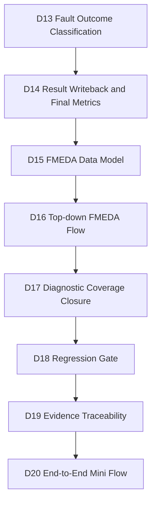
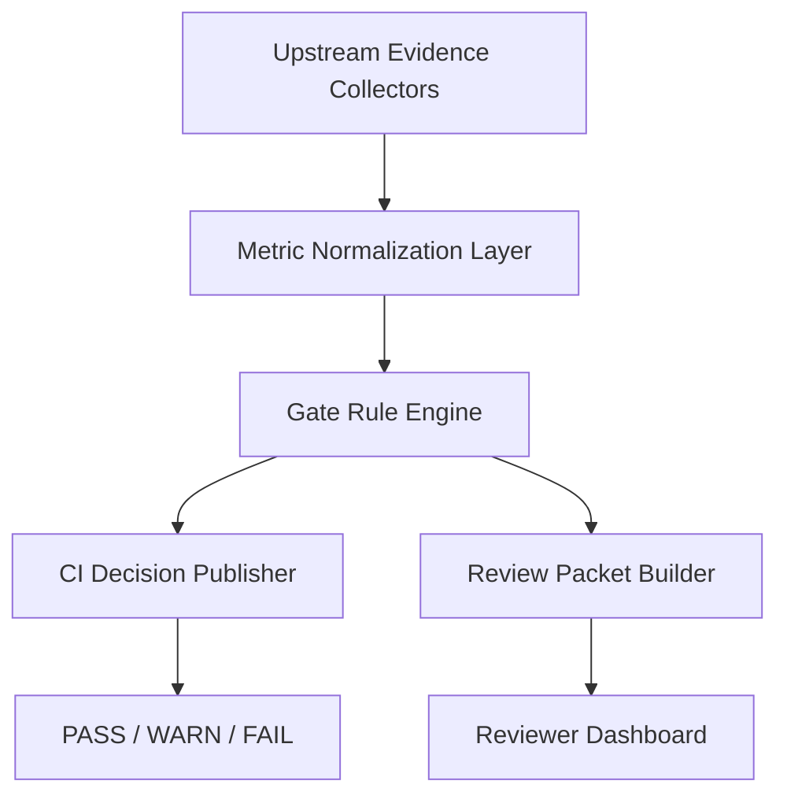
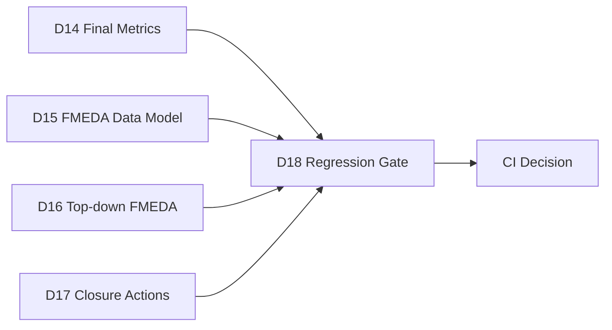
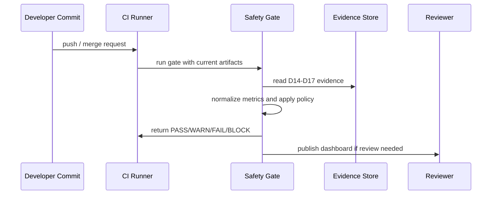
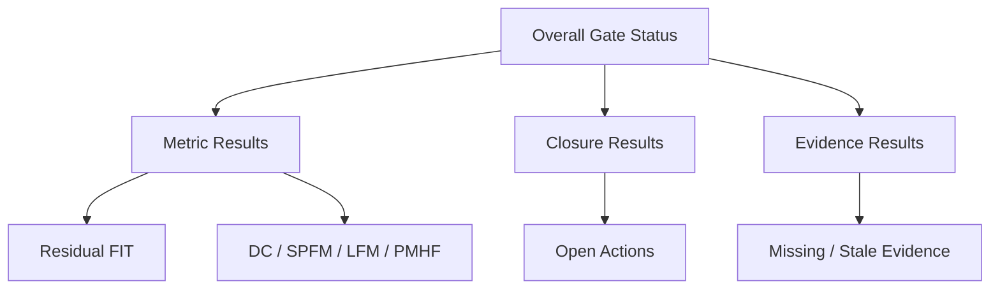

# Automotive Safe-IC Practice 18: Regression Gate — Turning Safety Metrics into CI Quality Gates

**Author**: Darren H. Chen  
**Direction**: Automotive Chip Functional Safety Analysis and Fault Injection Practice  
**Demo**: `D18_regression_gate_safety_metrics_ci`  
**Tags**: Automotive Chip, Functional Safety, ISO 26262, ASIL, FIT, Diagnostic Coverage, SPFM, LFM, PMHF, Fault Campaign, FMEDA, Regression Gate, CI, Evidence Automation

---

## 1. From Safety Analysis to Engineering Control

By D17, the flow has already moved through design input packaging, base FIT analysis, safety mechanism exploration, fault-list preparation, simulation context construction, fault campaign setup, execution planning, outcome classification, final metric preparation, FMEDA modeling, top-down FMEDA organization, and diagnostic coverage closure.

At that point, a team may have many useful artifacts:

```text
FIT summaries
fault campaign classifications
residual FIT tables
FMEDA rows
closure action plans
review queues
database session manifests
evidence indexes
```

However, an automotive chip project does not pass or fail once. It changes every day.

RTL changes.

Clocking changes.

Safety mechanisms change.

Fault lists change.

Test stimulus changes.

Mission profile assumptions change.

Therefore, the functional safety flow needs a regression gate.

D18 turns safety work from a manual review activity into a repeatable engineering control system.

It answers a practical question:

```text
When a design changes, can we automatically decide whether the safety evidence is still acceptable?
```

This is the bridge between safety methodology and day-to-day chip development.

---

## 2. D18 Position in the 20-Demo Flow

D18 is the regression-gate stage of the series.

It does not replace D01-D17.

It reads their outputs and converts the safety state into CI-grade pass / warn / fail decisions.



D18 is not a new safety calculation stage.

It is a control stage.

It converts evidence into rules.

It converts rules into gates.

It converts gates into continuous integration decisions.

---

## 3. What Regression Means in a Functional Safety Flow

In ordinary RTL verification, regression often means:

```text
run testcases
collect pass / fail results
measure coverage
compare against a threshold
```

In functional safety, regression has a broader meaning:

```text
re-check whether the safety argument remains valid after design, configuration, stimulus, or evidence changes
```

A safety regression should ask:

```text
Did FIT increase?
Did diagnostic coverage decrease?
Did residual FIT exceed the budget?
Did unresolved faults grow?
Did unsafe faults appear?
Did evidence become stale?
Did a safety mechanism lose its endpoint binding?
Did an alarm or observe point disappear?
Did a database session become inconsistent with the exported reports?
```

This is why D18 is not just a script that greps for a success string.

It is a structured safety quality gate.

---

## 4. Metrics That Matter to the Gate

D18 focuses on metrics that can affect a safety decision.

Typical metric families include:

| Metric Family | Example Fields | Gate Question |
|---|---|---|
| Failure-rate metrics | total FIT, permanent FIT, transient FIT, residual FIT | Is the failure-rate budget still acceptable? |
| Diagnostic coverage metrics | DC permanent, DC transient, endpoint coverage, mechanism coverage | Did coverage drop below the intended level? |
| Architectural metrics | SPFM, LFM, PMHF-like summaries | Are hardware random failure metrics still within target? |
| Campaign metrics | detected, safe, unsafe, unresolved counts | Did the campaign produce unacceptable outcomes? |
| Closure metrics | open critical actions, unresolved root causes, review status | Is the safety case still open? |
| Evidence metrics | missing files, stale inputs, mismatched sessions | Can the result be trusted and reproduced? |

D18 should not overfit to a single number.

A realistic gate is multi-dimensional.

---

## 5. FIT, Residual FIT, and Gate Semantics

FIT means Failure In Time. In semiconductor safety work, it is commonly used to express expected random hardware failure rate.

Residual FIT is the portion of FIT that remains after crediting safety mechanisms and classifying fault outcomes.

In a regression gate, residual FIT is especially important because it is closer to the remaining safety risk.

A simple gate rule may look like:

```text
if residual_fit_total <= residual_fit_budget:
    PASS
else:
    FAIL
```

But a better rule should also inspect why residual FIT changed:

```text
Did the design add registers?
Did a high-FIT cone lose coverage?
Did unresolved faults increase?
Did a mechanism become unmapped?
Did the mission profile change?
Did the FIT standard change?
```

A FIT increase is not always wrong.

For example, adding a safety mechanism may increase transistor count and therefore increase base FIT, while reducing residual FIT through better diagnostic coverage.

D18 should therefore distinguish:

```text
base FIT movement
coverage movement
residual FIT movement
```

---

## 6. Diagnostic Coverage as a Regression Signal

Diagnostic coverage, usually abbreviated as DC, measures how effectively a safety mechanism detects or controls faults.

A regression gate should check both absolute and relative movement.

Absolute rule:

```text
DC must be greater than or equal to the target.
```

Relative rule:

```text
DC must not drop by more than the allowed delta compared with baseline.
```

The relative rule is important because a design may still pass the minimum threshold while trending in a bad direction.

For example:

```text
previous DC = 98.7%
current DC  = 97.3%
target DC   = 97.0%
```

This may technically pass the target, but the drop deserves review.

D18 should make this visible.

---

## 7. Fault Outcome Metrics

D13 classifies fault outcomes into:

```text
detected
safe
unsafe
unresolved
```

D18 consumes this classification.

A reasonable gate policy is:

```text
unsafe faults       -> FAIL unless explicitly reviewed and justified
unresolved faults   -> WARN or FAIL depending on severity and FIT weight
detected faults     -> contribute positively to diagnostic coverage
safe faults         -> contribute to safe-fault accounting but still require traceability
```

This distinction matters because not all unresolved faults have the same safety impact.

A low-FIT unresolved fault in a non-critical cone may require review.

A high-FIT unresolved fault tied to a safety goal may block the regression.

D18 therefore should not only count unresolved faults.

It should weight them.

---

## 8. Closure State Is Part of the Gate

D17 creates closure actions for unresolved faults, unsafe outcomes, residual FIT gaps, missing bindings, and incomplete evidence.

D18 uses those actions as gate inputs.

A typical closure gate may be:

```text
critical open actions > 0 -> FAIL
high open actions     > 0 -> FAIL or WARN depending on branch policy
medium open actions   > threshold -> WARN
low open actions      -> PASS with tracking
```

This prevents a common engineering mistake:

```text
metrics look acceptable, but the review queue still contains unresolved safety concerns
```

The regression gate should not only check numbers.

It should check unfinished engineering decisions.

---

## 9. Evidence Freshness and Staleness

A safety metric is useful only when its input evidence matches the current design state.

D18 should therefore include freshness checks.

Example questions:

```text
Was the final metrics table generated from the current outcome classification?
Was the FMEDA model generated after final metric writeback?
Was the closure dashboard generated after FMEDA rollup?
Was the fault list generated from the latest EP-to-SM map?
Was the VCD context generated after the latest observe-point plan?
```

This is not merely file timestamp checking.

The stronger method is to use artifact identity.

Each artifact should carry a run identity:

```text
artifact_id
source_demo
source_file
source_hash
generated_at
input_manifest_id
upstream_dependency_id
```

D18 can then detect stale evidence even when filenames look correct.

---

## 10. Regression Gate Architecture

A robust D18 gate can be organized as a four-layer architecture.



The layers are:

```text
collector layer       -> gather D13-D17 artifacts
normalization layer   -> convert CSV/JSON/MD into comparable tables
rule engine layer     -> apply thresholds and dependency checks
publisher layer       -> emit CI result and review packet
```

This keeps the system maintainable.

Adding a new metric should not require rewriting the entire flow.

---

## 11. Input Contract from D17

D18 primarily consumes the D17 handoff.

Typical D17 outputs used by D18 include:

```text
closure_item_catalog.csv
unresolved_root_cause_analysis.csv
diagnostic_coverage_gap_analysis.csv
closure_action_plan.csv
closure_decision_matrix.csv
residual_fit_priority_queue.csv
fmeda_review_packet.csv
d17_handoff_to_d18.csv
d17_quality_gate.csv
evidence_index.csv
```

These files represent the final open state before CI gating.

D18 should not ignore D14, D15, or D16, but D17 is the immediate upstream owner of closure semantics.

A clean D18 design should treat D17 as the primary closure authority.

---

## 12. Cross-Checking D14, D15, and D16

D18 should also cross-check upstream evidence beyond D17.

From D14:

```text
final metrics summary
lambda bucket allocation
result writeback manifest
```

From D15:

```text
FMEDA residual FIT table
FMEDA traceability matrix
residual FIT review queue
```

From D16:

```text
top-down FMEDA rollup
assumption register
top-down review queue
```

This creates a consistency triangle:



If D14 says residual FIT is acceptable but D15 has residual FIT review rows, D18 should report a consistency issue.

If D16 still has open assumptions, D18 should not claim the safety case is clean.

---

## 13. Gate Rule Types

D18 rules can be grouped into several types.

| Rule Type | Example |
|---|---|
| Threshold rule | residual FIT must not exceed budget |
| Trend rule | DC must not drop more than allowed delta |
| Completeness rule | required evidence files must exist |
| Consistency rule | D14 final metric count must match D15 FMEDA rollup |
| Closure rule | no critical open closure item |
| Classification rule | unsafe faults must be zero or explicitly waived |
| Freshness rule | downstream artifact must be newer than upstream dependency identity |
| Policy rule | release branch uses stricter thresholds than development branch |

A single pass/fail flag is too weak.

D18 should produce a rule-level result table so reviewers can see why a gate passed or failed.

---

## 14. PASS, WARN, FAIL, and BLOCK

A practical gate should use more than two states.

Recommended states:

```text
PASS   -> safe to continue
WARN   -> acceptable for development, review required
FAIL   -> cannot merge or release without action
BLOCK  -> input evidence incomplete; decision cannot be made
```

`BLOCK` is different from `FAIL`.

For example, if the fault outcome file is missing, D18 cannot say the design failed safety criteria.

It can only say the evidence is incomplete.

This distinction improves engineering fairness.

---

## 15. Branch-Aware Safety Policy

Not every branch needs the same strictness.

A development branch may allow warnings.

A release candidate should be stricter.

Example policy:

| Branch Type | Unsafe Faults | Critical Closure Actions | Evidence Missing | DC Drop |
|---|---:|---:|---:|---:|
| development | FAIL | FAIL | BLOCK | WARN |
| integration | FAIL | FAIL | BLOCK | FAIL if above delta |
| release | FAIL | FAIL | BLOCK | FAIL on any unexplained drop |

D18 can encode this through a policy file:

```yaml
branch_policy:
  development:
    allow_warn: true
    fail_on_dc_drop_percent: 2.0
  release:
    allow_warn: false
    fail_on_dc_drop_percent: 0.5
```

This avoids hardcoding project policy into scripts.

---

## 16. Baseline Comparison

Regression implies comparison.

D18 should compare current evidence against a baseline.

Baseline types include:

```text
last passing run
last release candidate
ASIL-target baseline
customer-agreed baseline
manual review baseline
```

A baseline snapshot should contain:

```text
metric table
artifact hashes
policy version
rule version
gate result
review waivers
```

Then D18 can answer:

```text
Which metric changed?
Which evidence changed?
Which rule changed?
Was the change expected?
```

---

## 17. Safety Metrics Are Not Ordinary Coverage Numbers

Code coverage and functional coverage are usually measured to increase confidence in verification completeness.

Safety metrics are tied to risk.

A 1% movement in residual FIT or diagnostic coverage may have certification meaning.

Therefore, D18 should avoid casual gate design such as:

```text
if metric > 90 then pass
```

A better approach is:

```text
metric value
metric target
metric source
metric confidence
metric trend
metric review state
metric dependency chain
```

The gate result is a decision with context, not just a number.

---

## 18. Waiver Management

A real project will sometimes need waivers.

For example:

```text
an unresolved fault is tied to unreachable stimulus
an unsafe candidate is outside the safety goal boundary
a missing alarm is intentionally reviewed as non-safety-relevant
a metric drop is expected because the design boundary changed
```

D18 should support waivers, but waivers must be controlled.

A waiver should include:

```text
waiver_id
rule_id
artifact_id
reason
owner
expiration
review_status
linked_action
```

Waivers should not be invisible.

They should appear in the CI summary.

---

## 19. The Difference Between Waiver and Closure

A waiver says:

```text
this issue is accepted under defined conditions
```

A closure action says:

```text
this issue must be resolved
```

D18 should not confuse them.

A waived issue may pass a gate, but it still remains part of the evidence package.

A closure item blocks or warns until resolved.

This separation is important for auditability.

---

## 20. Evidence Contract for CI

A CI system should not parse arbitrary folders blindly.

D18 should define an evidence contract.

Example:

```text
inputs/
  from_D17/
  from_D16/
  from_D15/
  from_D14/
configs/
  gate_policy.yaml
  branch_policy.yaml
  waiver_register.csv
outputs/
  normalized_metrics.csv
  regression_gate_results.csv
  ci_status.json
  review_dashboard.md
```

This gives the CI stage a stable interface.

The purpose of D18 is not just to run checks.

It is to define what a safety regression check means.

---

## 21. CI Integration Model

A D18 CI flow can be modeled as:



The CI runner does not need to know how each safety metric was created.

It only needs to execute the gate and publish the result.

---

## 22. What D18 Should Produce

D18 should produce both machine-readable and human-readable outputs.

Machine-readable:

```text
ci_status.json
regression_gate_results.csv
normalized_safety_metrics.csv
rule_evaluation.csv
baseline_delta.csv
waiver_application.csv
```

Human-readable:

```text
regression_gate_dashboard.md
release_readiness_summary.md
review_packet.md
```

Handoff outputs:

```text
d18_handoff_to_d19.csv
d18_handoff_to_d20.csv
```

The machine-readable outputs drive automation.

The human-readable outputs support review.

---

## 23. Normalized Safety Metric Table

A normalized metric table should flatten multiple upstream outputs into one schema.

Example columns:

```text
metric_id
metric_name
metric_group
current_value
baseline_value
delta
unit
target
comparison_operator
source_demo
source_artifact
confidence_level
review_status
```

This enables generic rule evaluation.

For example:

```text
metric_name = residual_fit_total
current_value = 4.2
unit = FIT
target = 10
comparison_operator = <=
```

The rule engine can evaluate this without knowing the original artifact format.

---

## 24. Rule Evaluation Table

The rule evaluation table should be explicit.

Example columns:

```text
rule_id
rule_name
rule_type
severity
metric_id
condition
observed_value
expected_value
result
reason
action_hint
waiver_id
```

This is better than a single summary line.

When a gate fails, engineers should immediately know:

```text
which rule failed
which metric caused it
which artifact produced the metric
what action is suggested
whether a waiver exists
```

---

## 25. Gate Dashboard

A reviewer-facing dashboard can summarize the result:

```text
Overall gate: FAIL
Critical failures: 2
Warnings: 5
Blocked evidence: 0
Residual FIT trend: +0.3 FIT
DC trend: -0.8%
Unresolved high-risk faults: 1
Open critical closure actions: 1
Waivers applied: 2
```

A dashboard should also show the path to the evidence.



D19 will later expand this into a full evidence traceability layer.

D18 focuses on CI decision quality.

---

## 26. Handling Tool Warnings and Known Diagnostics

A functional safety toolchain may produce warnings that are not necessarily failures.

D18 should not use a naive rule such as:

```text
if log contains Warning -> FAIL
```

Instead, it should classify diagnostics:

```text
fatal error
execution error
known benign warning
known review warning
unknown warning
suppressed message summary
```

Known benign warnings may be recorded but not fail the gate.

Unknown warnings may trigger review.

Execution errors should fail or block.

This prevents regression noise while preserving evidence quality.

---

## 27. Dry-Run Evidence and Real-Run Evidence

Earlier demos may produce either:

```text
review-level generated evidence
real tool-generated evidence
```

D18 should recognize evidence confidence.

Suggested confidence labels:

```text
synthetic
review_level
tool_parsed
tool_generated
signoff_candidate
```

A development branch may allow review-level evidence.

A release branch should require real tool-generated or signoff-candidate evidence.

This avoids overstating what a demo artifact proves.

---

## 28. Safety Gate and Audit Thinking

D18 should be designed with audit thinking in mind.

An auditor or reviewer may ask:

```text
What exactly failed?
Who accepted the waiver?
Which evidence supports the pass decision?
Which upstream artifact changed?
Why did the metric move?
Can the decision be reproduced?
```

D18 answers these questions by producing:

```text
rule table
metric table
waiver table
baseline delta
artifact index
review dashboard
CI status
```

A gate without traceability is just a script.

A gate with traceability becomes part of the safety case.

---

## 29. Demo18 Project Structure

A clean D18 demo may use the following structure:

```text
D18_regression_gate_safety_metrics_ci/
  README.md
  configs/
    gate_policy.yaml
    branch_policy.yaml
    waiver_register.csv
    metric_targets.csv
  scripts/
    run_demo.csh
    run_demo.sh
  tools/
    build_d18_regression_gate.py
  inputs/
    from_D17/
    from_D16/
    from_D15/
    from_D14/
  outputs/
    normalized_safety_metrics.csv
    baseline_safety_metrics.csv
    baseline_delta.csv
    rule_evaluation.csv
    regression_gate_results.csv
    waiver_application.csv
    ci_status.json
    regression_gate_dashboard.md
    release_readiness_summary.md
    d18_handoff_to_d19.csv
    d18_handoff_to_d20.csv
    d18_quality_gate.csv
    evidence_index.csv
    demo_summary.md
```

The demo should be able to run without private infrastructure.

It should also be easy to connect to a CI runner later.

---

## 30. Example Gate Policy

A policy file may contain:

```yaml
metrics:
  residual_fit_total:
    unit: FIT
    operator: <=
    target: 10.0
    severity: FAIL

  diagnostic_coverage_transient:
    unit: percent
    operator: >=
    target: 90.0
    severity: FAIL

  unresolved_high_fit_faults:
    unit: count
    operator: ==
    target: 0
    severity: FAIL

closure:
  critical_open_actions:
    operator: ==
    target: 0
    severity: FAIL

  high_open_actions:
    operator: <=
    target: 0
    severity: WARN
```

This approach keeps policy separate from implementation.

That is important because safety targets may differ by product, ASIL target, release phase, or customer requirement.

---

## 31. Example CI Status JSON

D18 should emit a compact status file:

```json
{
  "demo_id": "D18",
  "gate_name": "safety_metrics_regression_gate",
  "overall_status": "FAIL",
  "policy": "development",
  "rules_total": 32,
  "rules_passed": 27,
  "rules_warned": 3,
  "rules_failed": 2,
  "rules_blocked": 0,
  "waivers_applied": 1,
  "review_required": true
}
```

A CI system can consume this easily.

A reviewer can open the dashboard for details.

---

## 32. D18 Handoff to D19

D19 will focus on evidence traceability.

D18 should therefore hand off:

```text
which rules were evaluated
which artifacts supported each rule
which metrics were normalized
which waivers were applied
which evidence was missing or stale
which decision was published to CI
```

D19 can then build a broader traceability graph:

```text
requirement -> metric -> artifact -> rule -> gate decision
```

D18 creates the decision.

D19 explains the evidence graph behind the decision.

---

## 33. D18 Handoff to D20

D20 is the end-to-end mini flow.

D18 should provide D20 with:

```text
CI gate status
release readiness summary
remaining warnings
open closure actions
baseline deltas
artifact index
```

D20 can then show the full flow from BFR to safety mechanisms, fault campaign, final metrics, FMEDA, closure, and regression gating.

D18 is therefore one of the last engineering gates before the final end-to-end story.

---

## 34. Common Mistakes

### 34.1 Treating Any Warning as a Failure

Warnings should be classified, not blindly failed.

### 34.2 Ignoring Evidence Freshness

A metric may look good but be generated from old inputs.

### 34.3 Mixing Development and Release Policy

Development CI can be more permissive than release CI.

### 34.4 Hiding Waivers

A waiver should never disappear from the evidence package.

### 34.5 Checking Only Final Metrics

Final metrics are important, but D18 must also check closure actions, evidence completeness, and trend movement.

### 34.6 Failing Without Action Hints

A gate should tell engineers what to fix.

---

## 35. Review Checklist

A reviewer should be able to answer:

```text
Which policy was used?
Which metrics were checked?
Which artifacts provided the metrics?
What changed from baseline?
Which rules passed, warned, failed, or blocked?
Were waivers applied?
Were any critical closure items open?
Were any unsafe faults unresolved?
Was evidence stale or missing?
Can the decision be reproduced?
What should be fixed next?
```

If the gate result cannot answer these questions, it is not yet a safety regression gate.

---

## 36. Summary

D18 transforms functional safety artifacts into a CI-grade regression gate.

It does not replace safety analysis, fault injection, outcome classification, FMEDA, or closure.

It connects them.

The core idea is:

```text
D01-D17 produce safety evidence.
D18 decides whether that evidence is acceptable for the current regression context.
```

A mature D18 gate should evaluate:

```text
FIT and residual FIT
DC and metric trends
fault outcome state
closure actions
FMEDA review state
evidence completeness
baseline delta
waivers
branch policy
CI decision
```

This is how a safety flow becomes part of everyday engineering.

Not a one-time spreadsheet.

Not a one-time report.

A controlled, repeatable, reviewable regression gate.
