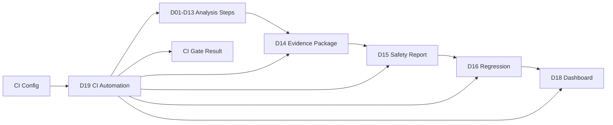
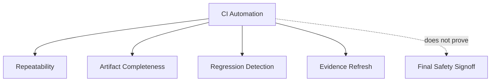
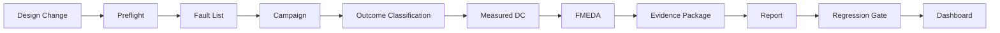
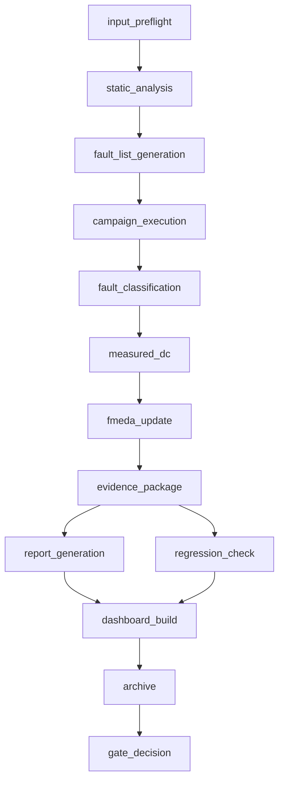
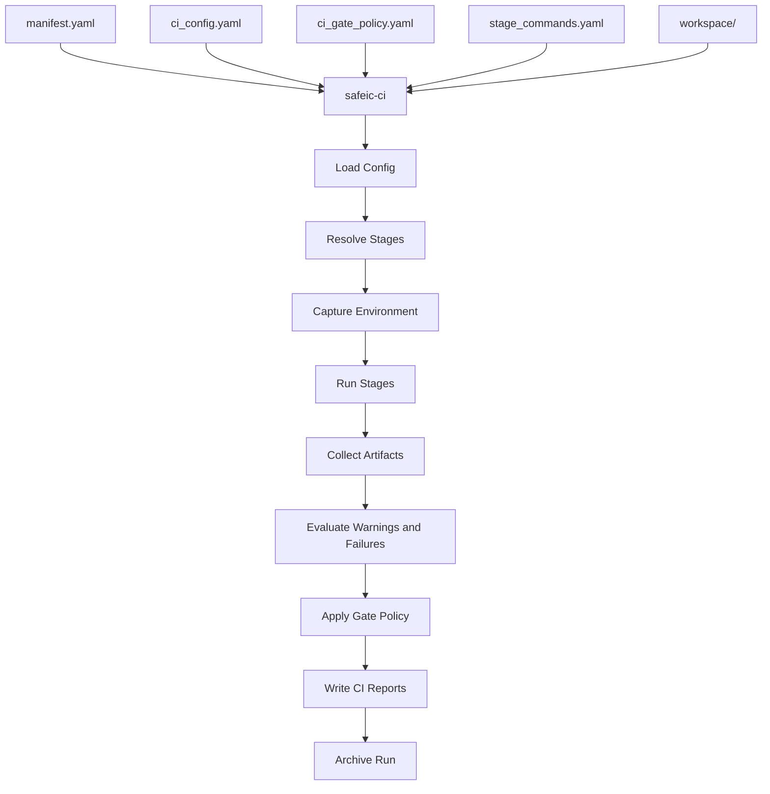
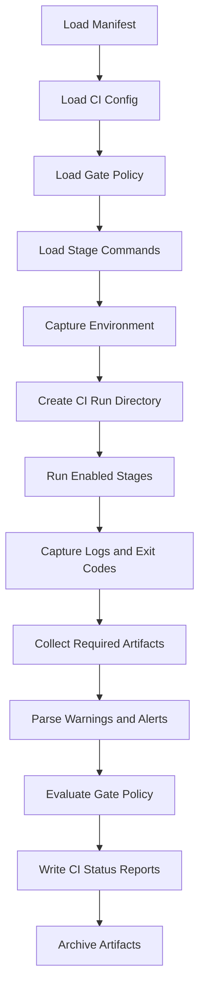
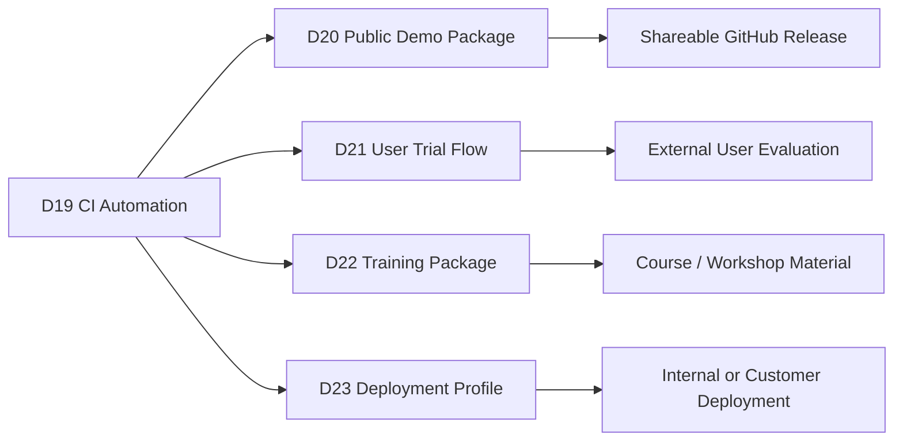

# [Automotive Safe-IC Practice 19] CI Automation: From Manual Safety Runs to Reproducible Safety Regression Gates

**Author**: Darren H. Chen  
**Direction**: Automotive Chip Functional Safety Analysis and Fault Injection Practice  
**Demo**: D19_ci_automation  
**Tags**: Automotive Chip, Functional Safety, CI Automation, Safety Regression, Fault Injection, FMEDA, Diagnostic Coverage, Residual FIT, Evidence Package, Dashboard, Engineering Workflow

---

## 1. Why This Article Matters

In the previous article, we turned safety evidence packages, reports, regression outputs, and comparison results into a dashboard and website demo.

D18 generated outputs such as:

```text
site/index.html
site/assets/app.js
site/assets/style.css
site/data/dashboard_index.json
site/data/overview_metrics.json
site/data/fault_outcomes.json
site/data/measured_dc.json
site/data/fmeda_rows.json
site/data/residual_fit.json
site/data/review_items.json
site/data/trend_summary.json
site/data/tool_comparison.json
site/data/traceability_links.json
outputs/dashboard_build_summary.md
outputs/dashboard_validation.csv
outputs/dashboard_warnings.csv
outputs/site_manifest.yaml
```

That makes the workflow visible and reviewable.

However, an engineering platform should not rely only on manual execution.

A real team eventually needs to ask:

> Can the safety analysis flow be executed automatically whenever the design, configuration, fault list, or safety policy changes?

The nineteenth demo in this repository is:

```text
D19_ci_automation
```

The generic tool introduced in this article is:

```text
safeic-ci
```

The purpose of `safeic-ci` is to orchestrate the previous safety-analysis steps in a repeatable CI-style flow:

```text
input package validation
static preflight
fault list generation
campaign execution or emulation
fault outcome classification
measured DC computation
FMEDA update
evidence package generation
safety report generation
regression comparison
dashboard refresh
CI gate decision
artifact archiving
```

and generate:

```text
ci_summary.md
ci_status.csv
ci_gate_result.json
ci_stage_status.csv
ci_artifact_index.csv
ci_warnings.csv
ci_failure_reasons.csv
ci_run_manifest.yaml
```

The central idea is:

> CI automation turns the safety workflow from a manual demo sequence into a repeatable engineering gate. The gate does not prove the design is safe, but it prevents safety evidence from silently regressing.

---

## 2. Where D19 Fits in the Flow

D19 is the automation layer over the previous demos.



**Figure 1. D19 orchestrates the earlier analysis, reporting, regression, and dashboard steps into a CI-style workflow.**

Earlier demos answered:

```text
How do we build evidence?
How do we report evidence?
How do we track regression?
How do we visualize evidence?
```

D19 answers:

```text
How do we run this flow repeatedly?
Which stages passed, warned, or failed?
Which artifacts were generated?
Which warnings should block the CI gate?
Which warnings should only be reported?
Can the dashboard be refreshed automatically?
Can results be archived for later comparison?
```

This is where the workflow starts to look like a continuous engineering system.

---

## 3. CI Automation Is Not Certification

A CI gate is not a safety certification gate.

It does not prove:

```text
the design is ISO 26262 compliant
the safety case is complete
the safety mechanism is sufficient
the product is ready for release
```

It can prove something narrower but very useful:

```text
the configured analysis flow ran
required artifacts were produced
metrics were parsed
regression checks were executed
high-severity regressions were detected
evidence package was generated
report and dashboard were refreshed
```



**Figure 2. CI automation improves repeatability and regression detection, but it does not replace formal safety review.**

This distinction must be explicit in any public or internal report.

---

## 4. Why CI Matters for Functional Safety Workflows

Without CI automation, safety artifacts often become stale.

Common problems:

```text
RTL changed but fault list was not regenerated
fault list changed but campaign was not rerun
campaign reran but fault outcomes were not reclassified
measured DC changed but FMEDA was not updated
FMEDA changed but evidence package was not rebuilt
report was not regenerated
dashboard shows old values
regression comparison uses an old baseline
```

CI automation reduces these gaps by defining a controlled dependency chain.



**Figure 3. CI automation keeps safety artifacts synchronized with design and policy changes.**

The key value is not speed alone.

The key value is preventing hidden evidence drift.

---

## 5. CI Orchestration vs Individual Tools

Earlier demos introduced individual tools:

```text
safeic-input
safeic-fit
safeic-struct
safeic-dc
safeic-faultgen
safeic-vcd
safeic-campaign
safeic-classify
safeic-measdc
safeic-fmeda
safeic-evidence
safeic-report
safeic-regress
safeic-compare
safeic-dashboard
```

D19 introduces an orchestration tool:

```text
safeic-ci
```

`safeic-ci` should not duplicate the logic of all tools.

It should:

```text
load CI configuration
determine which stages to run
execute each stage
capture logs
collect exit codes
validate artifacts
evaluate gate policy
summarize results
archive artifacts
```

This separation keeps each tool focused and makes CI behavior easier to debug.

---

## 6. CI Stages

A practical D19 CI flow can be split into stages:

```text
stage_00_environment_check
stage_01_input_preflight
stage_02_static_analysis
stage_03_fault_list_generation
stage_04_campaign_execution
stage_05_fault_classification
stage_06_measured_dc
stage_07_fmeda_update
stage_08_evidence_package
stage_09_report_generation
stage_10_regression_check
stage_11_dashboard_build
stage_12_archive
stage_13_gate_decision
```

Each stage should produce:

```text
status
start time
end time
duration
command
log file
expected artifacts
actual artifacts
warnings
errors
```

Example:

```csv
stage,status,duration_sec,log,artifacts
stage_05_fault_classification,PASS,3.2,logs/stage_05.log,outputs/D11/fault_outcomes.csv
stage_10_regression_check,WARN,1.1,logs/stage_10.log,outputs/D16/regression_alerts.csv
stage_13_gate_decision,FAIL,0.2,logs/stage_13.log,outputs/ci_gate_result.json
```

The stage model makes the CI run reviewable.

---

## 7. Stage Status Model

A useful CI status model:

```text
PASS
WARN
FAIL
SKIP
BLOCKED
NOT_RUN
```

Definitions:

```text
PASS:
  stage completed and required artifacts exist

WARN:
  stage completed but warnings were found

FAIL:
  stage failed or required artifacts are missing

SKIP:
  stage intentionally skipped by configuration

BLOCKED:
  stage was not run because an earlier required stage failed

NOT_RUN:
  stage was not scheduled or not reached
```

This is better than binary pass/fail because safety analysis often produces review-worthy warnings that should not always block early exploratory flows.

---

## 8. CI Gate Result

The final CI gate should be explicit.

Suggested gate statuses:

```text
PASS
PASS_WITH_WARNINGS
FAIL
MANUAL_REVIEW_REQUIRED
```

Example:

```json
{
  "gate": "MANUAL_REVIEW_REQUIRED",
  "reason": "high-severity review item remains open",
  "failed_stages": [],
  "warning_stages": ["stage_10_regression_check"],
  "critical_alerts": 0,
  "high_alerts": 1,
  "manual_review_items": 2
}
```

A `MANUAL_REVIEW_REQUIRED` result is useful.

It means the automation completed, but engineering judgement is required before accepting the evidence.

---

## 9. CI Gate Policy

D19 should be controlled by a gate policy file.

Example:

```yaml
ci_gate_policy:
  fail_on:
    - missing_required_artifact
    - stage_failure
    - critical_regression_alert
    - detected_to_unsafe
    - residual_fit_increase_above_fail_threshold
    - private_data_leak_detected

  manual_review_on:
    - high_regression_alert
    - measured_dc_lower_than_estimated
    - new_unsafe_fault
    - unresolved_ratio_above_threshold
    - policy_changed_with_metric_change
    - high_severity_review_item_open

  warn_on:
    - low_confidence_metric
    - small_sample_size
    - public_demo_limitation
    - non_blocking_dashboard_warning

  allow_skip:
    - commercial_tool_comparison
    - dashboard_build
```

This keeps the CI decision reproducible.

The same evidence should not pass or fail depending on who manually reads the logs.

---

## 10. CI Configuration

A CI configuration defines what to run.

Example `ci_config.yaml`:

```yaml
ci:
  name: toy_counter_safety_ci
  mode: public_demo
  top_module: toy_counter
  run_id: auto

stages:
  input_preflight: true
  static_analysis: true
  fault_list_generation: true
  campaign_execution: true
  fault_classification: true
  measured_dc: true
  fmeda_update: true
  evidence_package: true
  report_generation: true
  regression_check: true
  commercial_tool_comparison: false
  dashboard_build: true
  archive: true

execution:
  shell: csh
  stop_on_stage_failure: false
  continue_after_warning: true
  max_runtime_minutes: 60

artifacts:
  root: ci_runs
  retain_last_n: 10
```

This file makes the pipeline explicit.

Different profiles can use different stage sets.

---

## 11. CI Profiles

Suggested profiles:

```text
public_demo
developer_quick
nightly_full
pre_release
customer_demo
internal_review
```

Example:

```yaml
profiles:
  developer_quick:
    campaign_execution: emulation
    regression_check: true
    dashboard_build: false

  nightly_full:
    campaign_execution: real_or_large_sample
    regression_check: true
    dashboard_build: true
    archive: true

  public_demo:
    campaign_execution: emulation
    commercial_tool_comparison: synthetic_normalized_data
    dashboard_build: true
    sanitize_outputs: true
```

Profiles let the same architecture support different use cases.

A public demo should not run the same way as an internal full campaign.

---

## 12. Trigger Conditions

CI can be triggered by changes in:

```text
RTL files
testbench files
fault policies
classification policies
measurement policies
FMEDA seed table
tool scripts
dashboard templates
report templates
comparison configuration
```

Example trigger logic:

```yaml
triggers:
  rtl_changed:
    run:
      - input_preflight
      - fault_list_generation
      - campaign_execution
      - fault_classification
      - measured_dc
      - fmeda_update
      - evidence_package
      - regression_check

  report_template_changed:
    run:
      - report_generation
      - dashboard_build

  dashboard_template_changed:
    run:
      - dashboard_build
```

This avoids unnecessary reruns.

It also makes dependency reasoning clear.

---

## 13. Dependency Graph

D19 should model dependencies between stages.

Example:



**Figure 4. A CI dependency graph prevents stale downstream artifacts.**

If `campaign_execution` fails, later stages may be blocked or run in partial mode depending on policy.

---

## 14. Partial CI Runs

A CI run may be partial.

Examples:

```text
report-only rerun
dashboard-only rebuild
regression-only comparison
preflight-only check
fault-classification rerun
```

Partial runs are useful because not every change requires a full campaign.

But partial runs must be labeled.

Example:

```csv
run_id,profile,run_type,status
ci_001,public_demo,full_flow,PASS_WITH_WARNINGS
ci_002,public_demo,dashboard_only,PASS
ci_003,developer_quick,preflight_only,PASS
```

A report generated from a partial run should not be confused with a full safety-analysis update.

---

## 15. Artifact Management

CI should store artifacts in a structured run directory.

Suggested structure:

```text
ci_runs/
  ci_2026_05_12_001/
    ci_run_manifest.yaml
    ci_status.csv
    ci_gate_result.json
    logs/
      stage_01_input_preflight.log
      stage_02_static_analysis.log
      ...
    artifacts/
      D11_fault_outcomes/
      D12_measured_dc/
      D13_fmeda/
      D14_evidence_package/
      D15_report/
      D16_regression/
      D18_dashboard/
    summaries/
      ci_summary.md
      safety_report_summary.md
      regression_summary.md
```

This makes CI results easy to archive and compare.

---

## 16. Artifact Index

D19 should generate `ci_artifact_index.csv`.

Example:

```csv
artifact_id,stage,file_path,artifact_type,required,exists,sha256
A001,stage_05_fault_classification,artifacts/D11/fault_outcomes.csv,fault_outcomes,true,true,abc123
A002,stage_06_measured_dc,artifacts/D12/measured_dc_by_failure_mode.csv,metric,true,true,def456
A003,stage_07_fmeda_update,artifacts/D13/fmeda_table.csv,fmeda,true,true,789abc
A004,stage_11_dashboard_build,artifacts/D18/site/index.html,dashboard,false,true,555aaa
```

The artifact index is critical for reproducibility.

It tells what was generated and where it came from.

---

## 17. Log Management

Each stage should have a log.

Example:

```text
logs/stage_01_input_preflight.log
logs/stage_04_campaign_execution.log
logs/stage_10_regression_check.log
logs/stage_13_gate_decision.log
```

The CI summary should include the key log paths.

It should not require users to search through random output folders.

A good log should include:

```text
command
working directory
environment summary
start time
end time
exit code
warnings
errors
artifact paths
```

Logs are evidence too.

---

## 18. Environment Capture

Safety CI results are hard to reproduce without environment capture.

D19 should record:

```text
OS
hostname
user or sanitized user
shell
Python version
tool versions
PATH snapshot or sanitized PATH
license environment presence
Git commit
working tree status
run timestamp
```

Example `environment_summary.csv`:

```csv
item,value
os,Rocky Linux 8.10
shell,csh
python,3.11
git_commit,abc1234
working_tree,dirty
safa_available,false
execution_mode,public_demo_emulation
```

For public demos, sanitize private paths and usernames.

---

## 19. Real Tool Mode vs Emulation Mode

D19 should clearly distinguish:

```text
real_tool_mode
emulation_mode
hybrid_mode
```

Definitions:

```text
real_tool_mode:
  invokes licensed or installed tools

emulation_mode:
  uses sample data or lightweight open scripts

hybrid_mode:
  uses real outputs from previous runs but does not invoke the tool in CI
```

Example:

```yaml
execution_modes:
  campaign_execution: emulation
  commercial_tool_comparison: normalized_sample
  dashboard_build: real
```

This prevents public demo users from thinking that a full commercial tool run happened when it did not.

---

## 20. Handling Commercial Tools in CI

Commercial tools may require:

```text
licenses
specific OS
specific environment variables
restricted logs
large runtime
confidential outputs
```

For public CI, it is usually better to use:

```text
normalized sample outputs
sanitized snapshots
mock adapters
pre-recorded demo artifacts
```

For private CI, a real commercial tool run can be configured.

D19 should support both:

```yaml
commercial_tool:
  mode: normalized_snapshot
  allow_raw_report_publish: false
  adapter: generic_csv
```

This keeps public workflows safe.

---

## 21. Caching and Incremental Builds

Some safety stages may be expensive.

D19 can support caching.

Cache keys may include:

```text
RTL hash
filelist hash
policy hash
fault list hash
campaign config hash
tool version
```

Example:

```yaml
cache:
  enabled: true
  keys:
    fault_list_generation:
      - rtl_hash
      - faultgen_policy_hash
    measured_dc:
      - fault_outcomes_hash
      - measurement_policy_hash
```

If inputs are unchanged, a stage can reuse previous artifacts.

However, caching must be transparent.

The CI report should say:

```text
stage reused cached artifact
```

rather than pretending it reran.

---

## 22. Safety Regression Gate

The most important D19 output is the gate decision.

The gate should consider:

```text
stage failures
missing artifacts
critical regression alerts
new unsafe faults
detected-to-unsafe deltas
residual FIT increase
review item severity
evidence quality degradation
policy changes
dashboard privacy violations
```

Example decision logic:

```text
if any required stage fails:
  FAIL

else if critical regression alert exists:
  FAIL

else if high-severity review item exists:
  MANUAL_REVIEW_REQUIRED

else if warnings exist:
  PASS_WITH_WARNINGS

else:
  PASS
```

The exact policy is project-specific.

D19 should make it explicit.

---

## 23. CI Status Report

`ci_status.csv` should summarize every stage.

Example:

```csv
stage,status,duration_sec,required,log,summary
environment_check,PASS,0.2,true,logs/stage_00.log,environment captured
input_preflight,PASS,1.1,true,logs/stage_01.log,input package valid
fault_classification,PASS,2.4,true,logs/stage_05.log,fault outcomes generated
measured_dc,PASS,1.0,true,logs/stage_06.log,measured DC generated
regression_check,WARN,1.3,true,logs/stage_10.log,one high review item remains open
dashboard_build,PASS,0.9,false,logs/stage_11.log,site generated
gate_decision,MANUAL_REVIEW_REQUIRED,0.1,true,logs/stage_13.log,high review item open
```

This table is the first file reviewers should inspect when a CI run finishes.

---

## 24. CI Summary Report

`ci_summary.md` should be readable.

Example:

```md
# D19 CI Automation Summary

Run ID: ci_2026_05_12_001  
Profile: public_demo  
Design: toy_counter  
Gate: MANUAL_REVIEW_REQUIRED  

## Stage Summary

- PASS: 10
- WARN: 1
- FAIL: 0
- SKIP: 1

## Key Warnings

1. High-severity review item remains open for FM_ALARM_NOT_ASSERTED.
2. Measured DC confidence is low for selected demo groups.
3. Dashboard uses public demo data and is not production signoff evidence.

## Generated Artifacts

- Evidence package
- Safety report
- Regression summary
- Static dashboard site

## Next Actions

1. Review alarm-path safety mechanism.
2. Expand fault campaign sample size.
3. Keep selected DC conservative until evidence confidence improves.
```

The summary should give a reviewer enough information to decide what to inspect next.

---

## 25. CI Failure Reasons

If the gate fails, the failure reasons must be explicit.

Example `ci_failure_reasons.csv`:

```csv
reason_id,severity,category,stage,message,recommended_action
F001,CRITICAL,regression,stage_10_regression_check,detected fault F010 became unsafe,review recent RTL or safety mechanism change
F002,HIGH,artifact,stage_07_fmeda_update,fmeda_table.csv missing,rerun FMEDA update stage
```

A CI failure without clear reasons wastes engineering time.

---

## 26. CI Warnings

Warnings should be separate from failures.

Example `ci_warnings.csv`:

```csv
warning_id,severity,stage,message
W001,MEDIUM,stage_06_measured_dc,measured DC confidence is LOW
W002,LOW,stage_11_dashboard_build,one traceability link target missing
W003,LOW,stage_00_environment_check,SAFA_SA not found; using emulation mode
```

Warnings are useful for review but should not always fail the CI run.

---

## 27. CI Run Manifest

The run manifest records what happened.

Example `ci_run_manifest.yaml`:

```yaml
ci_run:
  run_id: ci_2026_05_12_001
  profile: public_demo
  design: toy_counter
  start_time: 2026-05-12T10:00:00
  end_time: 2026-05-12T10:08:00
  gate_result: MANUAL_REVIEW_REQUIRED

inputs:
  ci_config: inputs/ci_config.yaml
  ci_gate_policy: inputs/ci_gate_policy.yaml
  design_manifest: inputs/design_manifest.yaml

outputs:
  status: outputs/ci_status.csv
  gate_result: outputs/ci_gate_result.json
  summary: outputs/ci_summary.md
  artifact_index: outputs/ci_artifact_index.csv
```

This makes CI runs comparable and auditable.

---

## 28. Repository Layout for D19

Suggested directory:

```text
D19_ci_automation/
  README.md
  run_demo.sh
  run_demo.csh
  manifest.yaml

  inputs/
    ci_config.yaml
    ci_gate_policy.yaml
    design_manifest.yaml
    stage_commands.yaml
    public_data_policy.yaml

  scripts/
    run_stage.csh
    run_ci.csh
    run_ci.sh

  tools/
    safeic_ci.py

  workspace/
    D01/
    D11/
    D12/
    D13/
    D14/
    D15/
    D16/
    D18/

  ci_runs/
    ci_demo_latest/
      logs/
      artifacts/
      summaries/

  outputs/
    ci_summary.md
    ci_status.csv
    ci_gate_result.json
    ci_stage_status.csv
    ci_artifact_index.csv
    ci_warnings.csv
    ci_failure_reasons.csv
    ci_run_manifest.yaml
```

D19 should not require all previous demos to be fully present for a public demo.

It can use a small sample workspace.

---

## 29. Stage Command File

A stage command file keeps execution commands outside Python logic.

Example `stage_commands.yaml`:

```yaml
stages:
  input_preflight:
    command: "csh workspace/D01/scripts/run_demo.csh"
    required: true

  fault_classification:
    command: "csh workspace/D11/scripts/run_demo.csh"
    required: true

  measured_dc:
    command: "csh workspace/D12/scripts/run_demo.csh"
    required: true

  fmeda_update:
    command: "csh workspace/D13/scripts/run_demo.csh"
    required: true

  evidence_package:
    command: "csh workspace/D14/scripts/run_demo.csh"
    required: true

  report_generation:
    command: "csh workspace/D15/scripts/run_demo.csh"
    required: true

  regression_check:
    command: "csh workspace/D16/scripts/run_demo.csh"
    required: true

  dashboard_build:
    command: "csh workspace/D18/scripts/run_demo.csh"
    required: false
```

This makes the CI orchestrator flexible.

---

## 30. Tool Architecture

The generic tool `safeic-ci` can be implemented as a staged orchestrator.



**Figure 5. `safeic-ci` orchestrates stages, captures logs and artifacts, applies gate policy, and writes CI reports.**

Suggested internal modules:

```text
safeic_ci/
  cli.py
  manifest.py
  load_config.py
  stage_graph.py
  env_capture.py
  command_runner.py
  artifact_collector.py
  log_parser.py
  gate_policy.py
  status_report.py
  archive.py
  summary.py
```

Responsibilities:

| Module | Responsibility |
|---|---|
| `stage_graph.py` | Resolve stages and dependencies |
| `env_capture.py` | Capture reproducibility context |
| `command_runner.py` | Run commands and capture exit codes |
| `artifact_collector.py` | Collect and hash generated artifacts |
| `log_parser.py` | Extract warnings and errors |
| `gate_policy.py` | Apply CI gate rules |
| `status_report.py` | Write stage status tables |
| `archive.py` | Store run artifacts |
| `summary.py` | Generate human-readable summary |

---

## 31. D19 Manifest

Example:

```yaml
project:
  name: automotive_safeic_practice
  demo: D19_ci_automation
  top_module: toy_counter

inputs:
  ci_config: inputs/ci_config.yaml
  ci_gate_policy: inputs/ci_gate_policy.yaml
  design_manifest: inputs/design_manifest.yaml
  stage_commands: inputs/stage_commands.yaml
  public_data_policy: inputs/public_data_policy.yaml

workspace:
  root: workspace

outputs:
  summary: outputs/ci_summary.md
  status: outputs/ci_status.csv
  gate_result: outputs/ci_gate_result.json
  stage_status: outputs/ci_stage_status.csv
  artifact_index: outputs/ci_artifact_index.csv
  warnings: outputs/ci_warnings.csv
  failure_reasons: outputs/ci_failure_reasons.csv
  run_manifest: outputs/ci_run_manifest.yaml
```

The manifest defines the CI run.

---

## 32. D19 Execution Flow



**Figure 6. D19 execution flow: load config, run stages, collect artifacts, evaluate gate policy, and archive results.**

Example bash script:

```bash
#!/usr/bin/env bash
set -euo pipefail

safeic-ci \
  --manifest manifest.yaml \
  --output-dir outputs
```

Example csh script:

```csh
#!/bin/csh -f

set DEMO = D19_ci_automation
echo "Running $DEMO"

safeic-ci \
  --manifest manifest.yaml \
  --output-dir outputs
```

Expected outputs:

```text
outputs/ci_summary.md
outputs/ci_status.csv
outputs/ci_gate_result.json
outputs/ci_stage_status.csv
outputs/ci_artifact_index.csv
outputs/ci_warnings.csv
outputs/ci_failure_reasons.csv
outputs/ci_run_manifest.yaml
```

---

## 33. Example `ci_gate_result.json`

```json
{
  "run_id": "ci_demo_latest",
  "profile": "public_demo",
  "gate": "MANUAL_REVIEW_REQUIRED",
  "stage_counts": {
    "PASS": 10,
    "WARN": 1,
    "FAIL": 0,
    "SKIP": 1
  },
  "alerts": {
    "critical": 0,
    "high": 1,
    "medium": 2,
    "low": 1
  },
  "reasons": [
    "high-severity review item remains open",
    "measured DC confidence is low"
  ],
  "recommendation": "review safety findings before accepting this CI run"
}
```

This file can be consumed by scripts, dashboards, or CI systems.

---

## 34. Example `ci_status.csv`

```csv
stage,status,required,duration_sec,exit_code,log
environment_check,PASS,true,0.2,0,logs/stage_00_environment_check.log
input_preflight,PASS,true,1.1,0,logs/stage_01_input_preflight.log
fault_list_generation,PASS,true,1.5,0,logs/stage_03_fault_list_generation.log
campaign_execution,PASS,true,2.8,0,logs/stage_04_campaign_execution.log
fault_classification,PASS,true,1.7,0,logs/stage_05_fault_classification.log
measured_dc,PASS,true,0.8,0,logs/stage_06_measured_dc.log
fmeda_update,PASS,true,0.9,0,logs/stage_07_fmeda_update.log
evidence_package,PASS,true,1.0,0,logs/stage_08_evidence_package.log
report_generation,PASS,true,0.7,0,logs/stage_09_report_generation.log
regression_check,WARN,true,0.6,0,logs/stage_10_regression_check.log
dashboard_build,PASS,false,0.8,0,logs/stage_11_dashboard_build.log
gate_decision,MANUAL_REVIEW_REQUIRED,true,0.1,0,logs/stage_13_gate_decision.log
```

This table gives the CI run state at a glance.

---

## 35. Example `ci_summary.md`

```md
# D19 CI Automation Summary

Run ID: ci_demo_latest  
Profile: public_demo  
Design: toy_counter  
Gate Result: MANUAL_REVIEW_REQUIRED  

## Stage Status

| Status | Count |
|---|---:|
| PASS | 10 |
| WARN | 1 |
| FAIL | 0 |
| SKIP | 1 |

## Main Artifacts

- Evidence package generated.
- Safety report generated.
- Regression comparison generated.
- Dashboard site generated.

## Gate Reasons

- High-severity review item remains open.
- Measured DC confidence is low for demo sample.

## Recommended Actions

1. Review alarm-path safety mechanism.
2. Expand campaign sample size.
3. Keep FMEDA selected DC conservative.
```

This is the human-readable summary for engineers.

---

## 36. Validation Rules

`safeic-ci` should validate:

```text
manifest.yaml exists
ci_config.yaml exists
ci_gate_policy.yaml exists
stage_commands.yaml exists
enabled stages have commands
required stage commands are runnable
workspace exists
output directory is writable
required artifacts are defined
gate policy has valid rules
stage statuses are valid
artifact index is generated
gate result is generated
```

Example messages:

```text
[PASS] CI config loaded
[PASS] gate policy loaded
[PASS] stage command file loaded
[PASS] workspace found
[PASS] stage input_preflight completed
[WARN] stage regression_check produced high-severity review item
[WARN] dashboard build generated public demo limitation warning
[ERROR] required artifact D13/fmeda_table.csv missing
```

A CI orchestrator should fail clearly when required configuration is invalid.

---

## 37. Common Mistakes

### 37.1 Treating CI PASS as Safety Signoff

CI pass means the configured checks passed.

It does not mean final safety approval.

### 37.2 Hiding Warnings

Safety warnings should be reported even when they do not fail the gate.

### 37.3 Reusing Cached Artifacts Without Disclosure

If a stage uses cache, the summary must say so.

### 37.4 Running Stages Without Dependency Awareness

Downstream artifacts can become stale if dependencies are ignored.

### 37.5 Mixing Public Demo and Private Project Data

Public CI must be sanitized.

Private project artifacts should not leak into public dashboards or repositories.

### 37.6 Failing CI on Every Low-Confidence Metric

Low confidence may be expected in early demos.

Use manual review or warning status where appropriate.

### 37.7 Not Archiving Artifacts

Without archived artifacts, regression tracking becomes unreliable.

---

## 38. How D19 Connects to Later Demos

D19 creates the automation foundation for public demo packaging, user trials, and platform delivery.



**Figure 7. D19 provides the automation foundation for demo packaging, trials, training, and deployment.**

Once CI automation exists, each later output can be regenerated consistently.

---

## 39. Recommended Implementation Stages

D19 can be implemented in stages.

### Stage 1: Stage Runner

Run configured commands and capture status.

Deliverables:

```text
ci_status.csv
logs/
```

### Stage 2: Artifact Collection

Collect expected artifacts and generate hashes.

Deliverables:

```text
ci_artifact_index.csv
```

### Stage 3: Gate Policy Evaluation

Apply pass/warn/fail/manual-review rules.

Deliverables:

```text
ci_gate_result.json
ci_failure_reasons.csv
ci_warnings.csv
```

### Stage 4: Summary and Archive

Generate summary and archive run directory.

Deliverables:

```text
ci_summary.md
ci_run_manifest.yaml
ci_runs/
```

### Stage 5: Dashboard Refresh and Publication Hook

Automatically rebuild dashboard and prepare public demo bundle.

Deliverables:

```text
site/
public_demo_bundle.zip
```

This staged approach makes D19 immediately useful as an orchestration layer and extensible toward real CI integration.

---

## 40. Summary

CI automation turns the safety workflow into a repeatable engineering gate.

The D19 demo:

```text
D19_ci_automation
```

introduces the generic tool:

```text
safeic-ci
```

The tool consumes:

```text
ci_config.yaml
ci_gate_policy.yaml
stage_commands.yaml
workspace artifacts
previous demo tools and scripts
```

and generates:

```text
ci_summary.md
ci_status.csv
ci_gate_result.json
ci_stage_status.csv
ci_artifact_index.csv
ci_warnings.csv
ci_failure_reasons.csv
ci_run_manifest.yaml
```

The central lesson is:

> Safety CI is not certification. It is repeatability, artifact completeness, regression detection, and evidence freshness. It helps ensure that design and policy changes do not silently invalidate the safety argument.

D19 turns the previous demo sequence into an automatable workflow suitable for internal engineering, public methodology demos, and future customer-facing evaluation.

---

## 41. D19 Demo Checklist

For `D19_ci_automation`, the expected deliverables are:

```text
[ ] README.md
[ ] run_demo.sh
[ ] run_demo.csh
[ ] manifest.yaml

[ ] inputs/ci_config.yaml
[ ] inputs/ci_gate_policy.yaml
[ ] inputs/design_manifest.yaml
[ ] inputs/stage_commands.yaml
[ ] inputs/public_data_policy.yaml

[ ] scripts/run_stage.csh
[ ] scripts/run_ci.csh
[ ] scripts/run_ci.sh

[ ] tools/safeic_ci.py

[ ] workspace/D01/
[ ] workspace/D11/
[ ] workspace/D12/
[ ] workspace/D13/
[ ] workspace/D14/
[ ] workspace/D15/
[ ] workspace/D16/
[ ] workspace/D18/

[ ] outputs/ci_summary.md
[ ] outputs/ci_status.csv
[ ] outputs/ci_gate_result.json
[ ] outputs/ci_stage_status.csv
[ ] outputs/ci_artifact_index.csv
[ ] outputs/ci_warnings.csv
[ ] outputs/ci_failure_reasons.csv
[ ] outputs/ci_run_manifest.yaml

[ ] ci_runs/ci_demo_latest/logs/
[ ] ci_runs/ci_demo_latest/artifacts/
[ ] ci_runs/ci_demo_latest/summaries/
```

A successful D19 run should answer:

```text
Which CI profile was used?
Which stages ran?
Which stages passed, warned, failed, skipped, or were blocked?
Which artifacts were generated?
Which required artifacts are missing?
Which warnings should be reviewed?
Which issues fail the gate?
Which issues require manual review?
Was the dashboard refreshed?
Were artifacts archived?
Can the run be used as a baseline for later regression tracking?
```
