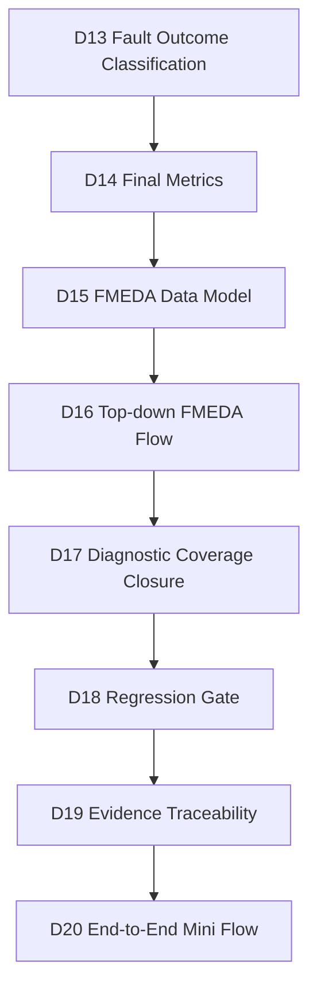
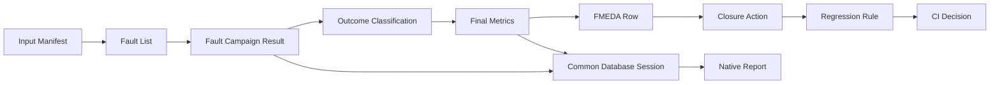
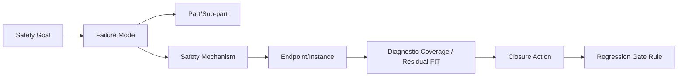
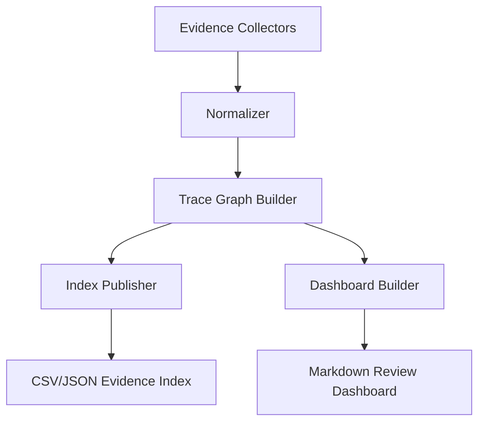

# Automotive Safe-IC Practice 19: Evidence Traceability — Unifying Reports, CSV, Common Database Sessions, and Logs

**Author**: Darren H. Chen  
**Direction**: Automotive Chip Functional Safety Analysis and Fault Injection Practice  
**Demo**: `D19_evidence_traceability_reports_csv_fdb_logs`  
**Tags**: Automotive Chip, Functional Safety, ISO 26262, Evidence Traceability, Common FuSa Database, FMEDA, Fault Campaign, Regression Gate, Audit, Safety Case, Artifact Index

---

## 1. When safety evidence becomes too large to trust manually

By the time a functional safety flow reaches D19, the project is no longer dealing with one report or one spreadsheet.

It has already accumulated evidence from input packaging, FIT setup, structural analysis, safety mechanism exploration, fault-list generation, simulation context preparation, alarm and observe-point definition, fault campaign setup, fault injection execution, outcome classification, final metric writeback, FMEDA modeling, top-down FMEDA review, diagnostic coverage closure, and regression gating.

At this stage, the main difficulty is not only whether the numbers look acceptable. The harder question is whether the evidence behind those numbers is traceable.

A reviewer may ask:

```text
Which input generated this metric?
Which database session contains this fault population?
Which campaign result supports this diagnostic coverage value?
Which FMEDA row used this residual FIT?
Which closure action explains this unresolved fault?
Which regression rule consumed this artifact?
Which file should be archived for audit?
```

If the team cannot answer these questions quickly, the safety flow is still fragile.

D19 turns scattered reports, CSV tables, database sessions, logs, dashboards, and handoff files into a unified evidence traceability layer.

It does not create a new safety metric. It creates the index that makes the existing metrics believable.

---

## 2. D19 position in the 20-demo flow

D19 sits after the regression gate and before the final end-to-end mini flow.



D18 decides whether the current safety state is acceptable under a policy. D19 explains where that decision came from.

D19 consumes the gate outputs from D18, but it also looks back into D13 through D17, and in a mature flow it can index evidence from D01 through D12 as well.

Its purpose is to create a queryable evidence map:

```text
artifact -> producer -> consumer -> metric -> rule -> decision -> review action
```

This is the bridge between engineering automation and safety review.

---

## 3. Evidence traceability is not just file collection

A common mistake is to treat evidence traceability as a folder-copy problem:

```text
copy all reports into archive/
zip the output directory
attach it to the review ticket
```

That is useful, but it is not traceability.

Traceability requires relationships.

For example, a CSV row saying `unresolved_detail_fault_count = 7` is only useful if we can answer:

```text
Which fault outcome file contributed the number?
Was the number derived from detail rows or aggregate rows?
Which closure action owns each unresolved item?
Which rule used the number?
Was the rule warning, failing, or passing?
Was a waiver applied?
Which database session can reproduce the detail report?
```

D19 therefore treats every artifact as a node and every dependency as an edge.

A directory contains files. A traceability layer contains meaning.

---

## 4. Core vocabulary

Before designing D19, the terms must be precise.

| Term | Meaning in D19 |
|---|---|
| Artifact | Any file or database session used as evidence, such as CSV, Markdown, JSON, report, waveform list, configuration, or log |
| Artifact identity | Stable identifier for an artifact, usually based on path, producer stage, type, hash, and logical role |
| Provenance | Information describing where an artifact came from and what produced it |
| Consumer | A downstream stage, rule, metric, review packet, or dashboard that uses an artifact |
| Common database session | A database partition addressed as `<database_file>::<session_name>` |
| Manifest | A structured list describing files, sessions, roles, and dependencies |
| Lineage | The chain of upstream artifacts that contributed to a downstream artifact |
| Evidence confidence | Classification of whether the artifact is synthetic, review-level, tool-parsed, tool-generated, or signoff-candidate |
| Freshness | Whether an artifact still matches the design/configuration context it claims to represent |
| Trace edge | A relationship such as `generated_from`, `consumed_by`, `supports_metric`, `supports_rule`, or `requires_review` |

Without these terms, evidence management becomes inconsistent across teams.

---

## 5. The evidence graph mental model

D19 can be understood as building a graph.



The graph is not only useful for visualization. It enables practical queries:

```text
Show all artifacts supporting this gate failure.
Show every output derived from this fault campaign session.
Show every FMEDA row affected by this unresolved fault.
Show whether this database session has a matching exported report.
Show whether this closure action has enough evidence to be accepted.
```

A strong traceability graph turns a safety flow into an auditable system.

---

## 6. D19 should not change safety semantics

D19 is an evidence indexing stage.

It should not:

```text
reclassify detected/safe/unsafe/unresolved faults
change residual FIT
edit FMEDA rows
approve or reject waivers
close diagnostic coverage actions
rerun the full fault campaign
replace the regression gate decision
```

Those responsibilities belong to earlier stages.

D19 can flag inconsistencies. It can report missing links. It can mark stale evidence. It can point reviewers to the exact source files.

But it should not quietly alter the safety conclusion.

This separation is important. If traceability tooling changes the evidence itself, review becomes difficult because the index is no longer a neutral view.

---

## 7. Input contract from D18

D18 is the immediate upstream owner of the regression gate decision. D19 should treat D18 as the primary gate evidence source.

Typical D18 inputs include:

```text
regression_input_manifest.csv
current_safety_metric_snapshot.csv
safety_metric_delta.csv
gate_rule_evaluation.csv
regression_gate_results.csv
waiver_application.csv
evidence_freshness_check.csv
common_fusa_db_gate_session_manifest.csv
safa_db_session_enabled_for_report.csv
safa_tool_report_status.csv
ci_status.json
regression_gate_dashboard.md
release_readiness_summary.md
d18_handoff_to_d19.csv
```

D19 does not need to understand every internal calculation in D18. It needs to know:

```text
which metrics were evaluated
which rules consumed those metrics
which artifacts supplied those metrics
which database sessions were referenced
which optional native reports were generated
which gate decision was published
```

This makes D19 a traceability expansion layer, not a second regression gate.

---

## 8. Looking back beyond D18

Although D18 is the immediate upstream stage, D19 should not stop at D18.

It should also index major evidence from:

```text
D13: fault outcome classification, unresolved/unsafe/detail outcome tables
D14: final metrics, result writeback manifests, database session references
D15: FMEDA rows, residual FIT tables, failure-mode evidence links
D16: top-down part/sub-part rollup, review workbook, assumption register
D17: closure issue register, action plan, disposition table, dashboard
D18: rule evaluation, CI status, gate dashboard, database session report status
```

A practical D19 flow can start with D13-D18 because those stages are closest to the safety decision.

Later, it can expand toward D01-D12 to cover input files, configuration, VCD context, alarm lists, observe points, and campaign setup packages.

---

## 9. Artifact classes in D19

D19 should classify artifacts. Classification prevents all files from being treated equally.

| Artifact Class | Examples | Review Meaning |
|---|---|---|
| Configuration | filelists, clock definitions, initialization files, policy files | Defines analysis or execution intent |
| Source boundary | RTL lists, top module, endpoint maps, safety mechanism maps | Defines design and safety scope |
| Campaign input | fault list, VCD list, alarm list, observe points, FTTI plan | Defines what was executed and observed |
| Campaign output | raw result reports, campaign result database sessions | Defines observed behavior under fault injection |
| Metric output | final metrics, residual FIT, diagnostic coverage tables | Defines safety metric values |
| FMEDA model | part/sub-part/failure-mode rows, SM mapping, rollup tables | Defines safety argument structure |
| Closure evidence | issue register, action plan, disposition, waiver evaluation | Defines risk convergence state |
| Gate evidence | rule evaluation, CI status, dashboard, policy | Defines regression decision |
| Native database evidence | `.fdb::session` references and exported session reports | Defines tool-backed persistent evidence |
| Logs | command transcript, warning summary, execution status | Defines reproducibility and diagnostics |

This classification lets D19 ask different questions for different artifact types.

A missing README may be low risk. A missing outcome classification table may block evidence trust.

---

## 10. Common database session traceability

A functional safety platform may store analysis, fault-list, campaign, and metric evidence in a common database.

A database session reference has the form:

```text
<database_file>::<session_name>
```

For example, conceptually:

```text
toy_counter.fdb::fault_list
toy_counter.fdb::final_metrics
toy_counter.fdb::campaign_results
```

The important point is not the spelling of a particular session. The important point is that the database file and the session name together form an evidence address.

D19 should index database session references as first-class artifacts.

A database session record should include:

```text
session_id
database_file
session_name
session_role
source_stage
exists
exported_report_path
report_extraction_status
consumer_artifacts
confidence_level
```

This avoids a common problem: a CSV says it came from a database, but nobody knows which session was used.

---

## 11. Reports and exported database views

Database sessions are powerful, but reviewers often need text or table exports.

Therefore D19 should distinguish between:

```text
native database session
exported report derived from the session
normalized CSV derived from the report
metric row derived from the CSV
rule result derived from the metric row
```

These are not the same artifact.

A trace chain may look like:

```text
Common DB session
  -> exported fault report
  -> parsed outcome summary
  -> normalized metric snapshot
  -> gate rule evaluation
  -> CI decision
```

If any link is missing, the final decision may still exist, but the evidence chain is incomplete.

---

## 12. CSV normalization and row-level traceability

CSV files are convenient, but they create traceability problems when rows are copied, aggregated, or renamed.

D19 should not only index CSV files. It should index important CSV rows.

For example:

```csv
row_trace_id,source_artifact,row_key,row_role,downstream_artifact,downstream_row_key
TRACE_ROW_0001,closure_action_plan.csv,D17-ACTION-0001,closure_action,gate_rule_evaluation.csv,GATE_DETAIL_UNRESOLVED
TRACE_ROW_0002,current_safety_metric_snapshot.csv,unresolved_detail_fault_count,metric,ci_status.json,key_metrics.unresolved_detail_fault_count
```

Row-level traceability is especially important when aggregate and detail rows coexist.

In a safety flow, a rollup row saying `unresolved_count = 7` should not be confused with seven individual unresolved fault rows.

D19 should preserve that distinction.

---

## 13. Logs are evidence, but not all log lines are equal

Logs are often large and noisy.

A useful D19 flow should not simply archive logs without structure. It should classify log evidence.

Useful log categories include:

```text
execution command
start and end time
exit status
tool version
input database session
output directory
known benign warning
review warning
fatal error
message summary
resource usage
```

A log line that records a tool version has a different evidence role from a log line that reports a fatal database error.

D19 can produce a `log_catalog.csv` such as:

```csv
log_id,source_stage,log_path,log_role,exit_status,error_count,warning_count,tool_version_detected,linked_artifact
LOG_0001,D18,outputs/native_status/report_fault_list.log,native_report,0,0,0,yes,DB_SESSION_fault_list
```

This allows reviewers to inspect important diagnostics without reading every line.

---

## 14. Artifact identity and hashing

A traceability system must distinguish files by content, not only by name.

File names can stay the same while contents change.

A robust artifact identity should include:

```text
artifact_id
logical_name
path
artifact_class
producer_stage
file_size
sha256
modified_time
source_hashes
role
confidence_level
```

The hash is not only for integrity. It also helps answer:

```text
Did this report change since the last review?
Is the current dashboard based on the same rule table?
Did two output directories contain identical evidence?
Was a database report regenerated or reused?
```

For database sessions, the session reference can be hashed together with the exported report if a direct database content hash is not available.

---

## 15. Provenance records

Provenance describes where evidence came from.

A useful provenance record answers:

```text
Who produced this artifact?
Which stage produced it?
Which inputs were consumed?
Which configuration was used?
Which tool family produced or exported it?
Which downstream stage consumed it?
```

A simple provenance table may look like:

```csv
artifact_id,producer_stage,producer_role,input_artifacts,output_artifact,confidence_level
ART_D18_RULES,D18,rule_evaluator,"ART_D17_ACTIONS;ART_D18_POLICY",outputs/gate_rule_evaluation.csv,review_level
ART_DB_KS_REPORT,D18,database_report_exporter,"DB_SESSION_KS_RESULTS",outputs/native_reports/campaign_result_report.txt,tool_generated
```

The table does not need to expose private command names. It only needs to expose engineering intent and artifact relationships.

---

## 16. Trace edge types

D19 should make relationships explicit.

Useful edge types include:

| Edge Type | Meaning |
|---|---|
| `generated_from` | Artifact was generated from one or more upstream artifacts |
| `consumed_by` | Artifact was used by a downstream stage |
| `supports_metric` | Artifact provides evidence for a metric |
| `supports_rule` | Artifact provides evidence for a gate rule |
| `supports_closure` | Artifact provides evidence for a closure action |
| `derived_from_session` | Report or CSV was derived from a database session |
| `has_native_report` | Database session has an exported report |
| `requires_review` | Artifact or row needs human disposition |
| `supersedes` | Artifact replaces an earlier artifact |
| `stale_with_respect_to` | Artifact is older or incompatible with a dependency |

A traceability graph becomes useful when edge types are disciplined.

Without edge types, everything becomes a generic hyperlink.

---

## 17. Safety goal to FMEDA row trace

FMEDA evidence is not only a spreadsheet problem.

A failure mode row should trace to:

```text
safety goal or safety requirement
part and sub-part
failure mode
safety mechanism
endpoint or instance boundary
diagnostic coverage evidence
residual FIT evidence
review status
closure action if open
```

D19 can model this as:



Even when an early demo uses simplified safety goals, the traceability structure should already be clear.

A future project can then replace toy evidence with production IP evidence without redesigning the trace model.

---

## 18. Fault campaign trace

Fault campaign evidence needs a different trace model.

A fault outcome should trace to:

```text
fault id
fault site
fault type
fault campaign package
simulation context
alarm set
observe point set
FTTI policy
raw campaign result
classification result
final metric row
closure action if unresolved or unsafe
```

This chain is important because a detected fault is not simply a count. It is detected under a specific observation policy.

If the alarm list changes, the meaning of detected changes.

If the VCD changes, activation and propagation behavior may change.

If the observe point changes, safe and unsafe classification boundaries may change.

D19 should preserve those dependencies.

---

## 19. Metric trace: from final metrics to gate rules

Metrics should not float by themselves.

A metric trace should include:

```text
metric_name
metric_value
metric_unit
scope
source_artifact
source_row
source_database_session
confidence_level
consumer_rule
consumer_dashboard
current_gate_result
```

For example:

```text
residual_fit_total
  <- final metric table
  <- database session export
  -> metric snapshot
  -> residual FIT gate rule
  -> CI decision
```

This lets reviewers understand not only the value, but also how the value influenced the decision.

A metric that is never consumed by a rule may still be useful, but it should not be mistaken for a gate driver.

---

## 20. Closure and waiver trace

D17 and D18 introduce closure actions and waivers.

D19 should connect them to evidence.

A closure action should trace to:

```text
source issue
source artifact
owner role
expected evidence
current disposition
affected failure mode
affected fault or metric
next validation step
```

A waiver should trace to:

```text
waiver id
linked rule
linked issue
justification
owner
approver
expiration
supporting evidence
status
```

The distinction matters:

```text
closure action -> issue must be resolved
waiver -> issue is accepted under controlled conditions
```

D19 should keep both visible.

Hidden waivers are dangerous because they make a gate look cleaner than it is.

---

## 21. Regression gate trace

D18 produces a gate decision such as PASS, WARN, FAIL, or BLOCK.

D19 should explain the decision.

For each rule, D19 should link:

```text
rule_id
rule_type
metric_id
observed value
expected value
rule result
severity
source metric artifact
source closure artifact
waiver if applied
CI status field
review dashboard section
```

This enables a useful review question:

```text
Why did the gate warn or fail?
```

The answer should not require reading scripts.

It should be visible in the traceability index.

---

## 22. Evidence confidence levels

Not all evidence has the same maturity.

D19 should classify confidence levels.

Suggested labels:

| Confidence Level | Meaning |
|---|---|
| `synthetic` | Artificial demo data or template-only data |
| `review_level` | Structured engineering review data, not directly generated by native analysis execution |
| `tool_parsed` | Parsed from native reports or database exports |
| `tool_generated` | Generated directly by a functional safety tool run or database report utility |
| `signoff_candidate` | Tool-generated and reviewed under controlled project policy |

A development flow may accept review-level evidence. A release flow may require tool-generated or signoff-candidate evidence.

D19 does not decide the release policy, but it must expose the evidence confidence so that D18 and D20 can make honest claims.

---

## 23. Freshness and staleness

Evidence can become stale even when the file still exists.

Examples:

```text
A fault list was generated from an old safety mechanism map.
A VCD was generated before the latest RTL change.
A final metric table was generated before the current outcome classification.
A closure dashboard was generated before a new unresolved issue appeared.
A database session was exported, but the exported report no longer matches the current session reference.
```

D19 should include a freshness check.

A simple first version can compare:

```text
file hash
file modified time
producer stage order
input manifest hash
known dependency list
```

A stronger version can use design fingerprints.

The goal is not to invent perfect proof. The goal is to prevent obviously stale evidence from passing unnoticed.

---

## 24. Deduplication and canonicalization

Evidence manifests often contain duplicate references.

Common examples:

```text
the same database session appears in D14, D15, D17, and D18 manifests
a session reference appears once as db_file + session_name and once as full db::session string
a relative path and absolute path point to the same file
a review-only mirror session is not a real executable database session
a copied artifact appears in both inputs/from_D17 and outputs/archive
```

D19 should canonicalize evidence references.

Canonicalization may include:

```text
normalizing paths
removing quotes and formatting noise
splitting `<db>::<session>` correctly
removing duplicate rows
separating real execution sessions from review-only references
linking copies back to their original artifact
```

This is especially important for database session traceability.

If duplicate or malformed session references enter the graph, downstream evidence reports become confusing.

---

## 25. A practical D19 architecture

D19 can be organized in four layers.



The layers are:

```text
collector layer       -> gather upstream manifests, reports, CSV, JSON, logs, database references
normalization layer   -> clean paths, classify artifacts, hash files, canonicalize sessions
trace graph layer     -> create artifact nodes and dependency edges
publisher layer       -> write index tables, dashboards, handoff files, and archive manifests
```

This architecture keeps D19 extensible.

Adding a new upstream artifact should only require a new collector or mapping rule, not a rewrite of the whole flow.

---

## 26. Evidence index tables

D19 should produce several machine-readable tables.

Recommended core outputs:

```text
artifact_catalog.csv
artifact_hash_manifest.csv
artifact_provenance.csv
traceability_edge_list.csv
traceability_node_list.csv
common_db_session_index.csv
native_report_index.csv
csv_row_trace_index.csv
metric_evidence_trace.csv
closure_evidence_trace.csv
gate_decision_trace.csv
log_catalog.csv
evidence_freshness_report.csv
evidence_gap_report.csv
evidence_dashboard.md
d19_quality_gate.csv
d19_handoff_to_d20.csv
```

These are not just administrative outputs. They define how the evidence package can be reviewed.

A reviewer should be able to start from a gate rule, follow it to a metric, follow the metric to a source CSV, follow the CSV to a database session export, and then follow the session back to the campaign stage.

---

## 27. Example artifact catalog schema

A useful `artifact_catalog.csv` may include:

```csv
artifact_id,logical_name,artifact_class,producer_stage,path,exists,sha256,size_bytes,confidence_level,primary_role
ART_0001,D18 gate rule evaluation,gate_evidence,D18,outputs/gate_rule_evaluation.csv,yes,<hash>,12345,review_level,rule_table
ART_0002,Campaign result database session,database_session,D14,toy_counter.fdb::campaign_results,yes,<session-hash>,,tool_generated,campaign_result
ART_0003,Closure action plan,closure_evidence,D17,outputs/closure_action_plan.csv,yes,<hash>,6789,review_level,closure_actions
```

The exact column names can evolve, but the intent should stay stable:

```text
identify the artifact
classify the artifact
locate the artifact
hash the artifact
state its role
state its evidence confidence
```

---

## 28. Example trace edge schema

A useful `traceability_edge_list.csv` may include:

```csv
edge_id,source_node,target_node,edge_type,reason
EDGE_0001,ART_D17_ACTION_PLAN,ART_D18_RULE_EVAL,consumed_by,D18 closure rules consume open action counts
EDGE_0002,ART_D18_RULE_EVAL,ART_D18_CI_STATUS,supports_decision,CI status summarizes rule results
EDGE_0003,DB_SESSION_FINAL_METRICS,ART_D14_FINAL_METRICS_REPORT,has_native_report,final metric report exported from database session
EDGE_0004,ART_D14_FINAL_METRICS_REPORT,ART_D15_FMEDA_ROWS,supports_metric,FMEDA residual FIT uses final metric evidence
```

This edge list can be imported into graph tools later, but it is already useful as a CSV.

The demo does not need a database-backed web portal to be valuable.

A disciplined edge list is enough to prove the method.

---

## 29. Query examples enabled by D19

Once D19 builds the evidence index, useful questions become easy.

Examples:

```text
Show all artifacts supporting the D18 WARN decision.
Show all unresolved detail faults and their closure actions.
Show all database sessions used by final metric evaluation.
Show every CSV row that feeds a gate rule.
Show every evidence item with review-level confidence.
Show every artifact that is missing or stale.
Show all native report exports derived from Common FuSa DB sessions.
Show the path from a failure mode to residual FIT and closure action.
```

This is exactly what a safety review needs.

The value of D19 is not only that files are indexed. It is that engineering questions can be answered without searching manually through folders.

---

## 30. D19 quality gate

D19 should have its own quality gate.

The gate should not require that all upstream safety issues are closed. That is D17 and D18 responsibility.

D19 should check evidence-index quality:

```text
required upstream handoff files exist
artifact catalog is generated
hash manifest is generated
trace edge list is generated
Common database sessions are indexed
native reports are linked when available
CI status is linked to rule evaluation
gate rules are linked to source metrics
closure actions are linked to source issues
no required artifact has missing path
no malformed database session is treated as executable evidence
D20 handoff is generated
```

D19 passes when the evidence is organized, traceable, and reviewable.

It warns when the safety flow still has open items.

It fails when the traceability package itself is incomplete or misleading.

---

## 31. Relationship with D20

D20 is the end-to-end mini flow.

D19 prepares D20 by telling it:

```text
which artifacts represent the complete flow
which metrics are supported by which evidence
which database sessions are part of the safety story
which reports are tool-generated
which outputs are review-level
which gate result should be shown
which open issues remain
which files should be archived
```

Without D19, D20 risks becoming a narrative demo.

With D19, D20 can become a reproducible evidence story:

```text
input package -> analysis evidence -> fault campaign evidence -> final metrics -> FMEDA -> closure -> gate -> traceability index
```

That is much closer to how a real safety engineering platform should behave.

---

## 32. Suggested D19 demo structure

A clean D19 demo can use the following structure:

```text
D19_evidence_traceability_reports_csv_fdb_logs/
  README.md
  configs/
    evidence_policy.yaml
    artifact_classification_rules.csv
    trace_edge_rules.csv
    required_artifacts.csv
  scripts/
    run_demo.csh
    run_demo.sh
  tools/
    build_d19_evidence_traceability.py
  inputs/
    from_D13/
    from_D14/
    from_D15/
    from_D16/
    from_D17/
    from_D18/
  outputs/
    artifact_catalog.csv
    artifact_hash_manifest.csv
    artifact_provenance.csv
    traceability_node_list.csv
    traceability_edge_list.csv
    common_db_session_index.csv
    native_report_index.csv
    csv_row_trace_index.csv
    metric_evidence_trace.csv
    closure_evidence_trace.csv
    gate_decision_trace.csv
    log_catalog.csv
    evidence_freshness_report.csv
    evidence_gap_report.csv
    evidence_dashboard.md
    d19_quality_gate.csv
    d19_handoff_to_d20.csv
    demo_summary.md
```

The demo should run without requiring a GUI.

It may optionally index native database reports if they are already exported, but it should not depend on manual clicking.

---

## 33. Common mistakes

### 33.1 Archiving without indexing

A zip archive is useful, but it does not answer traceability questions by itself.

### 33.2 Treating every file as equally important

A policy file, a fault report, a dashboard, and a command transcript have different evidence roles.

### 33.3 Losing row-level context

A file-level link is not enough when a gate rule depends on one row in a metric table.

### 33.4 Confusing aggregate and detail evidence

A rollup count and seven detail unresolved rows are related, but they are not the same evidence item.

### 33.5 Executing every database session reference

Some session references are real execution evidence. Some are review mirrors or placeholders. D19 should classify them rather than blindly treating all as executable.

### 33.6 Hiding review-level evidence confidence

A review-level table may be useful, but it should not be labeled as signoff-candidate evidence.

### 33.7 Ignoring stale evidence

An old report can look correct while no longer matching the current design context.

---

## 34. Review checklist

A reviewer should be able to answer:

```text
What artifacts were included in the evidence package?
Which artifacts are missing?
Which artifacts are tool-generated?
Which artifacts are review-level?
Which database sessions were referenced?
Which database sessions have exported reports?
Which metrics came from which artifacts?
Which gate rules consumed which metrics?
Which closure actions remain open?
Which unresolved faults are linked to closure actions?
Which waivers were applied?
Which evidence is stale or uncertain?
Can the final D18 decision be reproduced from the indexed files?
Can D20 assemble an end-to-end story from this package?
```

If D19 can answer these questions, the evidence package has practical audit value.

---

## 35. Summary

D19 transforms a collection of safety outputs into a traceable evidence system.

D01-D18 produce many important artifacts:

```text
configuration files
fault lists
simulation context
campaign results
outcome classifications
final metrics
FMEDA rows
closure actions
regression gate rules
Common database sessions
native reports
logs and dashboards
```

D19 gives them structure.

The core idea is:

```text
Every important safety decision should be traceable to the artifacts that support it.
Every important artifact should have a role, identity, hash, producer, consumer, and confidence level.
Every database session should be indexed as evidence, not treated as an invisible backend detail.
Every gate result should explain which metrics, rules, closures, and waivers contributed to it.
```

This is how the safety flow becomes reviewable at scale.

Not a pile of files.

Not a manually curated folder.

A structured, queryable, reproducible evidence layer.

D19 does not make the chip safe by itself. It makes the safety argument inspectable.

That is the foundation for D20, where the full mini flow can be presented as a complete end-to-end evidence chain.
